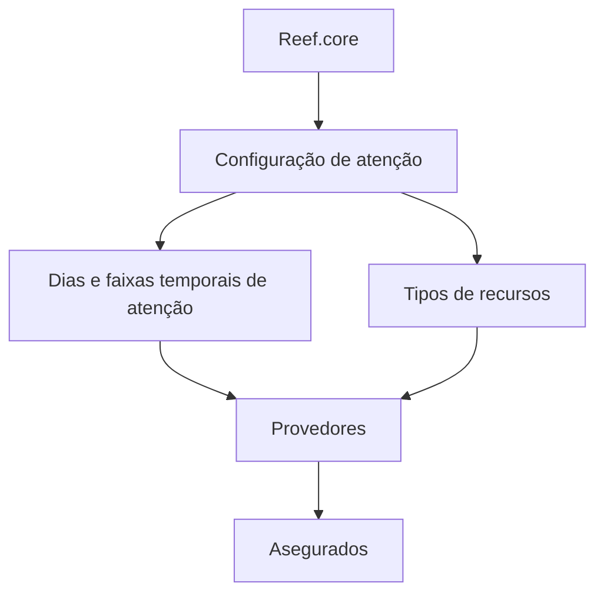

# Configuração de Atenção de Provedores no Reef.core

## 1. Metadados do Documento
- **Arquivo de Origem:** Não informado
- **Tipo de Documento:** Especificação Técnica
- **Domínio / Sistema:** Reef.core; Provedores; Asegurados
- **Público-Alvo:** Operação, Negócio e Desenvolvimento
- **Data/Versão Identificada:** Não identificada

---

## 2. Resumo Executivo & Contexto de Negócio

O conteúdo descreve a definição de atenção no sistema Reef.core. A capacidade funcional central apresentada é configurar quando os Provedores podem atender os Asegurados e quais recursos estão disponíveis para realizar esse atendimento.

A configuração operacional abrange dois eixos explicitamente identificados: dias e faixas temporais de atenção, além dos tipos de recursos. Esses elementos determinam a disponibilidade operacional dos Provedores no contexto de atendimento aos Asegurados.

O documento também referencia propriedades operacionais, vínculos, Provedores e perguntas frequentes. Entretanto, o excerto não detalha a estrutura dessas propriedades, os tipos de recursos possíveis, os vínculos configuráveis ou regras específicas para codificação e uso das tipologias de atenção.

A documentação alerta que valores pertencentes ao núcleo devem ser respeitados em ambas as listas de valores mencionadas. O excerto não identifica quais são essas listas, os respectivos valores nem o mecanismo técnico de validação.

---

## 3. Arquitetura, Componentes & Tecnologias Envolvidas

| Componente / Termo | Papel identificado no conteúdo | Detalhamento disponível |
| :--- | :--- | :--- |
| Reef.core | Sistema que permite configurar a atenção dos Provedores. | O excerto não informa arquitetura técnica, APIs, banco de dados ou interfaces. |
| Provedores | Entidades que realizam atendimento. | Podem ter dias, faixas temporais e recursos configurados. |
| Asegurados | Entidades atendidas pelos Provedores. | Não há detalhes sobre identificação, jornada ou regras de elegibilidade. |
| Dias e Tramos Temporales de Atención | Propriedade operacional de disponibilidade. | Não são apresentados formatos, calendários ou regras de recorrência. |
| Tipos de Recursos | Propriedade operacional relacionada ao atendimento. | Os tipos de recursos não são enumerados. |
| Vínculos | Tópico listado no documento. | Não há definição adicional no excerto. |
| CF Home Solutions APIs Documentation Zeus | Termos exibidos no rodapé ou navegação do conteúdo. | O papel funcional ou técnico não é explicado. |



**Nota de Análise:** O conteúdo não descreve microsserviços, contratos HTTP, formatos JSON, URLs, ambientes, mecanismos de integração ou tecnologias de implementação do Reef.core.

---

## 4. Regras de Negócio, Especificações Funcionais & Processos

1. O Reef.core possui a capacidade de configurar os dias nos quais os Provedores podem atender os Asegurados.
2. O Reef.core possui a capacidade de configurar as faixas temporais ou horários nos quais os Provedores podem atender os Asegurados.
3. O Reef.core possui a capacidade de configurar os recursos com os quais os Provedores realizam o atendimento aos Asegurados.
4. As propriedades operacionais explicitamente listadas são:
   - Dias e faixas temporais de atenção.
   - Tipos de recursos.
5. Devem ser respeitados os valores de ambas as listas de valores por serem valores do núcleo.
6. O documento referencia recomendações operacionais relativas à codificação, ao uso e à definição das tipologias de atenção dos Provedores, mas o conteúdo fornecido não apresenta a resposta nem as recomendações correspondentes.
7. O documento indica que a leitura de diretrizes e documentos funcionais relacionados é recomendada para evitar interpretações incorretas decorrentes da análise isolada do conteúdo.

---

## 5. Tabelas de Parâmetros, Ambientes e Estruturas de Dados

| Item / Parâmetro | Descrição / Função | Tipo / Valores / Formato | Ambiente / Observações |
| :--- | :--- | :--- | :--- |
| Dias de atenção | Configuram os dias em que Provedores podem atender Asegurados. | Não informado. | Propriedade operacional do Reef.core. |
| Faixas temporais de atenção | Configuram os horários em que Provedores podem atender Asegurados. | Não informado. | Propriedade operacional do Reef.core. |
| Tipos de recursos | Representam os recursos disponíveis aos Provedores para atendimento. | Não informado. | O documento não enumera recursos. |
| Listas de valores do núcleo | Valores que devem ser respeitados. | Não informado. | O excerto menciona duas listas, sem identificá-las. |
| Vínculos | Tópico listado como parte do conteúdo. | Não informado. | Não há detalhamento funcional ou técnico. |
| Diretrizes e documentos funcionais | Material complementar recomendado para interpretação correta. | Não informado. | Não foram fornecidos no excerto. |

---

## 6. Bateria de Perguntas & Respostas para RAG (FAQ Sintético)

### P1: Qual é o objetivo funcional apresentado para o Reef.core?
**R:** O Reef.core permite configurar os dias e as faixas temporais em que os Provedores podem atender os Asegurados, bem como os recursos disponíveis aos Provedores para realizar esse atendimento.

### P2: Quais propriedades operacionais são explicitamente mencionadas?
**R:** O documento lista como propriedades operacionais os dias e as faixas temporais de atenção e os tipos de recursos.

### P3: Quem realiza o atendimento no contexto descrito?
**R:** Os Provedores realizam o atendimento aos Asegurados.

### P4: O que pode ser configurado sobre a disponibilidade dos Provedores?
**R:** Podem ser configurados os dias e as faixas temporais ou horários em que os Provedores estão habilitados a atender os Asegurados.

### P5: O documento especifica quais são os tipos de recursos disponíveis aos Provedores?
**R:** Não. O documento menciona tipos de recursos como uma propriedade operacional, mas não apresenta a lista nem a definição dos recursos.

### P6: Existe alguma regra para listas de valores do núcleo?
**R:** Sim. O conteúdo determina que os valores de ambas as listas de valores devem ser respeitados por serem valores do núcleo. O excerto não identifica as listas nem seus valores.

### P7: O que são os vínculos mencionados no documento?
**R:** O conteúdo apresenta “Vínculos” como um tópico, mas não fornece definição, estrutura, regras ou relacionamentos associados.

### P8: Há recomendações para a codificação e definição de tipologias de atenção dos Provedores?
**R:** O documento contém uma pergunta sobre recomendações operacionais para codificação, uso e definição das tipologias de atenção dos Provedores. Entretanto, o excerto não contém a resposta ou as recomendações.

### P9: Por que o documento recomenda consultar diretrizes e documentos funcionais relacionados?
**R:** A consulta é recomendada para evitar que a interpretação isolada do documento resulte em erro.

### P10: O conteúdo informa APIs, métodos HTTP ou contratos de integração do Reef.core?
**R:** Não. Embora “APIs Documentation” apareça no conteúdo, o excerto não apresenta APIs, endpoints, métodos HTTP, contratos JSON ou integrações técnicas.

---

## 7. Glossário de Termos, Siglas & Conceitos-Chave

- **Reef.core:** Sistema citado como responsável por permitir a configuração da atenção de Provedores.
- **Provedores:** Entidades que podem atender Asegurados conforme dias, faixas temporais e recursos configurados.
- **Asegurados:** Entidades que recebem atendimento dos Provedores.
- **Atenção:** Contexto funcional de disponibilidade e realização de atendimento por Provedores.
- **Dias e Tramos Temporales de Atención:** Dias e faixas temporais configuráveis para o atendimento.
- **Tipos de Recursos:** Recursos disponíveis aos Provedores para realizar atendimento; os tipos não são detalhados.
- **Propriedades Operativas:** Propriedades relacionadas à operação de atenção, incluindo dias, faixas temporais e tipos de recursos.
- **Vínculos:** Tópico citado sem definição complementar.
- **CF:** Sigla exibida no conteúdo sem expansão ou contexto suficiente.
- **Zeus:** Termo exibido no conteúdo sem explicação funcional ou técnica.

---

## 8. Notas Críticas, Riscos & Limitações

- O excerto não identifica o arquivo de origem, autor, data, versão ou ambiente de referência.
- Não há detalhamento técnico sobre arquitetura, componentes internos, banco de dados, APIs, URLs, autenticação ou observabilidade.
- Não são apresentados os valores das duas listas de valores do núcleo que devem ser respeitados.
- Os tipos de recursos não são especificados.
- O tópico “Vínculos” é listado, mas não é explicado.
- A pergunta sobre recomendações operacionais para tipologias de atenção não possui resposta no conteúdo fornecido.
- A interpretação isolada do documento é explicitamente desaconselhada; o texto recomenda a leitura de diretrizes e documentos funcionais relacionados.

---

## 9. Conteúdo Bruto Estruturado (Referência Fiel)

```text
--- [PÁGINA 1 DE 2] ---

DEFINICIÓN de ATENCIÓN
Objetivo
Funcionalmente, Reef.core cuenta con la posibilidad de configurar tanto los días y tramos horarios en
los que los Proveedores pueden atender a los Asegurados como los recursos con los que aquellos
cuentan para hacerlo.
Propiedades Operativas
Propiedades Operativas
Días y Tramos Temporales de Atención
Tipos de Recursos
Vínculos
Relación de Directrices y Documentos funcionales cuya lectura recomendada para evitar que la
interpretación aislada del presente documento pueda conducir a error.
Proveedores
Preguntas frecuentes
(1) ¿Existe alguna recomendación operativa que deba ser tomada en consideración en la
codificación, uso y definición de las tipologías de atención de los Proveedores?
 /
 CF
Home Solutions APIs Documentation Zeus
EN

--- [PÁGINA 2 DE 2] ---

Se han de respetar, por ser valores del núcleo, los valores de ambas listas de valores.
```
