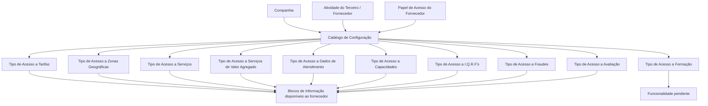

# Configuração de Acessos a Blocos de Informação por Atividade e Papel de Fornecedor

## 1. Metadados do Documento
- **Arquivo de Origem:** `Não identificado no conteúdo fornecido`
- **Tipo de Documento:** `Especificação Técnica / Funcional`
- **Domínio / Sistema:** `MAPFRE — gestão de fornecedores, atividades, papéis de acesso e blocos de informação`
- **Público-Alvo:** `Não identificado explicitamente`
- **Data/Versão Identificada:** `Não identificada`

---

## 2. Resumo Executivo & Contexto de Negócio

O documento descreve um catálogo de configuração que controla o acesso de fornecedores a blocos de informação do sistema. A configuração é definida para cada combinação de **Atividade do Terceiro/Fornecedor** e **Papel de Acesso** atribuído ao fornecedor.

O núcleo do sistema permite determinar a forma pela qual usuários fornecedores acessam informações relacionadas a tarifas, zonas geográficas, serviços, serviços de valor agregado, dados de atendimento, capacidades, I.Q.R.F's, fraudes, avaliação de desempenho e formação.

A configuração é associada a uma companhia específica, identificada pelo código da companhia sobre a qual a parametrização está sendo realizada. Dessa forma, o catálogo pode ser utilizado no contexto organizacional de cada companhia.

O documento não especifica os valores possíveis para cada “Tipo de Acesso”, nem detalha mecanismos técnicos de autenticação, autorização, métodos HTTP, telas, APIs, persistência ou contratos de dados. O bloco de informação relacionado à formação é explicitamente indicado como não implementado e pendente de funcionalidade.

---

## 3. Arquitetura, Componentes & Tecnologias Envolvidas

Os componentes funcionais identificados são:

- **Núcleo do Sistema:** possui a capacidade de configurar o acesso aos blocos de informação.
- **Catálogo de configuração:** reúne os atributos utilizados para definir acessos por atividade e papel do fornecedor.
- **Companhia:** contexto organizacional identificado pelo código da companhia.
- **Atividade do Terceiro/Fornecedor:** código da atividade que identifica o terceiro como fornecedor.
- **Papel de Acesso:** papel atribuído por atividade do fornecedor.
- **Blocos de Informação:** conjuntos de catálogos e informações cujo acesso é configurado.
- **Fornecedor / Usuário:** sujeito que acessa as informações conforme atividade e papel configurados.



> **Nota de Análise:** o documento descreve relações funcionais entre companhia, atividade, papel e blocos de informação, mas não apresenta arquitetura técnica, integrações, tecnologias, endpoints, bancos de dados ou ambientes.

---

## 4. Regras de Negócio, Especificações Funcionais & Processos

1. O sistema permite configurar o acesso a blocos de informação por combinação de:
   - Companhia;
   - Atividade do Terceiro/Fornecedor;
   - Papel de Acesso do fornecedor.

2. O atributo **Companhia** contém o código da companhia para a qual a configuração de acesso está sendo realizada.

3. O atributo **Código de Atividade do Terceiro** define o código da atividade do Terceiro/Fornecedor, desde que a atividade identifique o terceiro como fornecedor.

4. O atributo **Papel de Acesso** determina um dos papéis possíveis atribuídos por atividade do fornecedor.

5. Para uma combinação de atividade do fornecedor e papel do usuário, o catálogo determina a forma de acesso aos catálogos de:
   - Tarifas;
   - Zonas de atribuição;
   - Serviços;
   - Serviços de valor agregado;
   - Dados de atendimento do fornecedor;
   - Capacidades do fornecedor;
   - Incidências, queixas, reclamações e felicitações associadas ao fornecedor;
   - Fraudes;
   - Avaliação de desempenho do fornecedor;
   - Itinerário formativo do fornecedor.

6. O acesso à formação possui uma limitação explícita: o bloco de informação correspondente não está implementado. Portanto, o tipo de acesso à formação está pendente de funcionalidade.

7. O documento declara que não existe preferência ou recomendação para estabelecer ou padronizar a codificação do catálogo de blocos de informação por atividade de fornecedores.

8. Apesar da ausência de recomendação de codificação, a entidade MAPFRE deve analisar a conveniência de usar transversalmente o catálogo de informação nos processos da companhia, visando sua exploração correta posterior.

9. A interpretação isolada do documento pode conduzir a erro. A leitura dos documentos funcionais relacionados é recomendada:
   - Atividades dos Terceiros;
   - Papéis de Fornecedores por Atividade;
   - Blocos de Informação.

---

## 5. Tabelas de Parâmetros, Ambientes e Estruturas de Dados

| Item / Parâmetro | Descrição / Função | Tipo / Valores / Formato | Ambiente / Observações |
| :--- | :--- | :--- | :--- |
| Companhia | Contém o código da companhia sobre a qual a configuração de acesso é realizada. | Código de companhia; formato não detalhado. | Aplicável à configuração de acesso. |
| Código de Atividade do Terceiro | Estabelece o código da atividade do Terceiro/Fornecedor quando a atividade o identifica como fornecedor. | Código de atividade; formato não detalhado. | Aplicável a fornecedores. |
| Papel de Acesso | Determina um dos possíveis papéis atribuídos por atividade do fornecedor. | Papel de acesso; valores não detalhados. | Associado à atividade do fornecedor. |
| Tipo de Acesso a Tarifas | Determina a forma de acessar catálogos relativos a tarifas. | Tipo de acesso; valores não detalhados. | Definido por atividade do fornecedor e papel do usuário. |
| Tipo de Acesso a Zonas Geográficas | Determina a forma de acessar catálogos relativos a zonas de atribuição. | Tipo de acesso; valores não detalhados. | Definido por atividade do fornecedor e papel do usuário. |
| Tipo de Acesso a Serviços | Determina a forma de acessar catálogos relativos a serviços. | Tipo de acesso; valores não detalhados. | Definido por atividade do fornecedor e papel do usuário. |
| Tipo de Acesso a Serviços de Valor Agregado | Determina a forma de acessar catálogos relativos a serviços de valor agregado. | Tipo de acesso; valores não detalhados. | Definido por atividade do fornecedor e papel do usuário. |
| Tipo de Acesso a Dados de Atendimento | Determina a forma de acessar catálogos relativos aos dados de atendimento do fornecedor. | Tipo de acesso; valores não detalhados. | Definido por atividade do fornecedor e papel do usuário. |
| Tipo de Acesso a Capacidades | Determina a forma de acessar catálogos relativos às capacidades do fornecedor. | Tipo de acesso; valores não detalhados. | Definido por atividade do fornecedor e papel do usuário. |
| Tipo de Acesso a I.Q.R.F's | Determina a forma de acessar catálogos relativos a incidências, queixas, reclamações e felicitações associadas ao fornecedor. | Tipo de acesso; valores não detalhados. | Definido por atividade do fornecedor e papel do usuário. |
| Tipo de Acesso a Fraudes | Determina a forma de acessar catálogos relativos a fraudes. | Tipo de acesso; valores não detalhados. | Definido por atividade do fornecedor e papel do usuário. |
| Tipo de Acesso a Avaliação | Determina a forma de acessar catálogos relativos à avaliação de desempenho do fornecedor. | Tipo de acesso; valores não detalhados. | Definido por atividade do fornecedor e papel do usuário. |
| Tipo de Acesso a Formação | Determina a forma de acessar catálogos relativos ao itinerário formativo do fornecedor. | Tipo de acesso; valores não detalhados. | Pendente de funcionalidade, pois o bloco de informação não está implementado. |

---

## 6. Bateria de Perguntas & Respostas para RAG (FAQ Sintético)

### P1: Como o sistema configura o acesso de um fornecedor aos blocos de informação?
**R:** O sistema configura o acesso para cada combinação de companhia, atividade do Terceiro/Fornecedor e papel de acesso atribuído ao fornecedor. Essa combinação determina a forma de acesso aos catálogos dos blocos de informação.

### P2: Qual é a função do atributo Companhia no catálogo de configuração?
**R:** O atributo Companhia contém o código da companhia sobre a qual está sendo realizada a configuração de acesso aos blocos de informação.

### P3: Quando o Código de Atividade do Terceiro é aplicável a um fornecedor?
**R:** O Código de Atividade do Terceiro estabelece o código da atividade do Terceiro/Fornecedor quando essa atividade identifica o terceiro como fornecedor.

### P4: O que determina o atributo Papel de Acesso?
**R:** O atributo Papel de Acesso determina um dos possíveis papéis atribuídos por atividade do fornecedor. Esse papel é usado, juntamente com a atividade do fornecedor, para definir o acesso aos catálogos.

### P5: Quais blocos de informação podem ter acesso configurado?
**R:** O documento cita tarifas, zonas geográficas, serviços, serviços de valor agregado, dados de atendimento, capacidades, I.Q.R.F's, fraudes, avaliação de desempenho e formação.

### P6: O que é controlado pelo Tipo de Acesso a I.Q.R.F's?
**R:** O Tipo de Acesso a I.Q.R.F's determina a forma de acesso aos catálogos relativos a incidências, queixas, reclamações e felicitações associadas ao fornecedor.

### P7: O acesso ao itinerário formativo do fornecedor está disponível?
**R:** Não completamente. O documento informa que o bloco de informação de formação não está implementado; por isso, o Tipo de Acesso a Formação está pendente de funcionalidade.

### P8: O documento define os valores possíveis para cada Tipo de Acesso?
**R:** Não. O documento informa que os atributos determinam a forma de acesso aos catálogos, mas não apresenta valores permitidos, códigos, níveis de permissão ou regras técnicas de autorização.

### P9: Existe uma recomendação para padronizar a codificação do catálogo de blocos de informação?
**R:** Não. O documento afirma que não existe preferência ou recomendação para estabelecer ou padronizar a codificação no sistema.

### P10: Qual recomendação é direcionada à entidade MAPFRE sobre o catálogo?
**R:** A entidade MAPFRE deve analisar a conveniência de utilizar transversalmente o catálogo de informação nos processos da companhia, para permitir sua correta exploração posterior.

### P11: Quais documentos devem ser consultados para evitar interpretação isolada incorreta?
**R:** O documento recomenda a leitura de “Atividades dos Terceiros”, “Papéis de Fornecedores por Atividade” e “Blocos de Informação”.

### P12: O documento descreve APIs, métodos HTTP ou contratos JSON para os blocos de informação?
**R:** Não. O conteúdo fornecido não detalha APIs, métodos HTTP, contratos JSON, integrações técnicas, tecnologias de implementação ou mecanismos de persistência.

---

## 7. Glossário de Termos, Siglas & Conceitos-Chave

- **Blocos de Informação:** conjuntos de informações ou catálogos cujo acesso é configurado por atividade e papel do fornecedor.
- **Companhia:** entidade identificada por código, sobre a qual é realizada a configuração de acesso.
- **Fornecedor:** terceiro cuja atividade o identifica como fornecedor no sistema.
- **I.Q.R.F's:** Incidências, Queixas, Reclamações e Felicitações associadas ao fornecedor.
- **Papel de Acesso:** um dos possíveis papéis atribuídos por atividade do fornecedor.
- **Tipo de Acesso:** atributo que determina a forma de acesso de uma combinação de atividade do fornecedor e papel do usuário a um catálogo específico.
- **Zonas de Atribuição:** zonas geográficas cujos catálogos possuem acesso configurável.
- **Itinerário Formativo:** conjunto de informações relativo à formação do fornecedor.

---

## 8. Notas Críticas, Riscos & Limitações

- O documento não informa os valores, níveis ou códigos possíveis para os atributos de Tipo de Acesso.
- Não há detalhamento de mecanismos técnicos de controle de acesso, autenticação, autorização, APIs, integrações, persistência ou auditoria.
- O bloco de informação de formação não está implementado; portanto, o Tipo de Acesso a Formação está pendente de funcionalidade.
- A ausência de recomendação de padronização de codificação pode demandar análise local da entidade MAPFRE para garantir uso transversal e exploração posterior consistente.
- A leitura isolada do documento pode causar interpretações incorretas; a documentação relacionada é explicitamente recomendada.
- **Nota de Análise:** os termos “CF”, “Home Solutions APIs Documentation” e “Zeus” aparecem no conteúdo bruto, mas não são explicados pelo documento fornecido.

---

## 9. Conteúdo Bruto Estruturado (Referência Fiel)

```text
--- [PÁGINA 1 DE 3] ---

CONFIGURAR ACCESOS a BLOQUES de
INFORMACIÓN por ACTIVIDAD y ROL del
PROVEEDOR
Funcionalmente el núcleo del Sistema cuenta con la posibilidad de configurar, por cada combinación
de Actividad y rol de acceso del Proveedor, la forma por la que se va a poder acceder a la
información de los Bloques de Información.
Propiedades
Propiedades
Compañía
Este Atributo del catálogo contiene el código de la compañía sobre la que se está realizando la
configuración de acceso.
Código de Actividad del Tercero
Esta propiedad establece en el sistema el código de la Actividad del Tercero-Proveedor siempre y
cuando la Actividad del Tercero lo identifique como tal.
Rol Acceso
Este Atributo del catálogo de configuración determina uno de los posibles roles que se asignan por
Actividad del Proveedor.
 / 
 CF
Home Solutions APIs Documentation Zeus
EN


--- [PÁGINA 2 DE 3] ---

Tipo de Acceso a Tarifas
Este Atributo del catálogo de configuración determina para la Actividad del Proveedor y el Rol del
Usuario, la forma de acceder a los catálogos relativos a las Tarifas.
Tipo de Acceso a Zonas Geográficas
Este Atributo del catálogo de configuración determina para la Actividad del Proveedor y el Rol del
Usuario, la forma de acceder a los catálogos relativos a las Zonas de Asignación.
Tipo de Acceso a Servicios
Este Atributo del catálogo de configuración determina para la Actividad del Proveedor y el Rol del
Usuario, la forma de acceder a los catálogos relativos a los Servicios.
Tipo de Acceso a Servicios de Valor Añadido
Este Atributo del catálogo de configuración determina para la Actividad del Proveedor y el Rol del
Usuario, la forma de acceder a los catálogos relativos a los Servicios de Valor Añadido.
Tipo de Acceso a Datos de Atención
Este Atributo del catálogo de configuración determina para la Actividad del Proveedor y el Rol del
Usuario, la forma de acceder a los catálogos relativos a los Datos de Atención del Proveedor.
Tipo de Acceso a Capacidades
Este Atributo del catálogo de configuración determina para la Actividad del Proveedor y el Rol del
Usuario, la forma de acceder a los catálogos relativos a las Capacidades del Proveedor.
Tipo de Acceso a I.Q.R.F's
Este Atributo del catálogo de configuración determina para la Actividad del Proveedor y el Rol del
Usuario, la forma de acceder a los catálogos relativos a las Incidencias, Quejas, Reclamaciones y
Felicitaciones asociados al Proveedor.
Tipo de Acceso a Fraudes
Este Atributo del catálogo de configuración determina para la Actividad del Proveedor y el Rol del
Usuario, la forma de acceder a los catálogos relativos a los Fraudes.
Tipo de Acceso a Evaluación
Este Atributo del catálogo de configuración determina para la Actividad del Proveedor y el Rol del
Usuario, la forma de acceder a los catálogos relativos a la Evaluación en el Desempeño del
Proveedor.


--- [PÁGINA 3 DE 3] ---

Tipo de Acceso a Formación
Este Atributo del catálogo de configuración determina para la Actividad del Proveedor y el Rol del
Usuario, la forma de acceder a los catálogos relativos al itinerario formativo del Proveedor.
NOTA: Puesto que el Bloque de Información no está implementado, este tipo de Acceso está
Pendiente de Funcionalidad.
Vínculos
Relación de Directrices y Documentos funcionales cuya lectura recomendada para evitar que la
interpretación aislada del presente documento pueda conducir a error.
Actividades de los Terceros
Roles de Proveedores por Actividad
Bloques de Información
Preguntas frecuentes
(1) ¿Existe alguna recomendación operativa que deba ser tomada en consideración localmente en la
codificación, uso y definición del catálogo de Bloques de Información por Actividad de los
Proveedores?
No existe una preferencia ni recomendación para establecer o estandarizar en el sistema su
codificación, si bien la entidad MAPFRE debe analizar la conveniencia de utilizar transversalmente en
los procesos de la compañía este catálogo de información para su correcta y posterior explotación.
```
