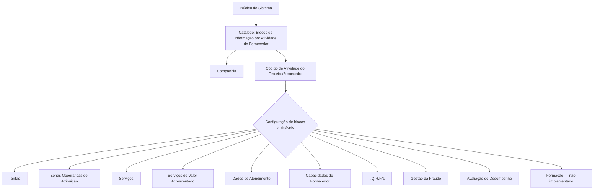

# Configuração de Blocos de Informação por Atividade do Fornecedor

## 1. Metadados do Documento
- **Arquivo de Origem:** `Não identificado no conteúdo fornecido`
- **Tipo de Documento:** `Especificação Funcional`
- **Domínio / Sistema:** `Gestão de Terceiros e Fornecedores — MAPFRE`
- **Público-Alvo:** `Analistas funcionais, equipas de negócio, administradores de catálogos e operação`
- **Data/Versão Identificada:** `Não identificada`

---

## 2. Resumo Executivo & Contexto de Negócio

O documento descreve um catálogo funcional denominado **Blocos de Informação por Atividade do Fornecedor**. O objetivo desse catálogo é permitir que o núcleo do sistema personalize, para cada atividade possível de Terceiros/Fornecedores, quais blocos de informação devem estar associados e ser configurados.

A configuração é contextualizada pela companhia e pela atividade do terceiro. Para cada atividade de fornecedor, o catálogo determina se áreas funcionais específicas — como tarifas, zonas geográficas de atribuição, serviços, capacidades, gestão de fraude e avaliação de desempenho — necessitam ou não de configuração no sistema.

Esse modelo permite que a informação exigida seja adaptada ao perfil operacional de cada atividade de fornecedor, evitando a configuração indiscriminada de catálogos que não sejam aplicáveis. O documento não define valores de códigos, critérios automáticos de decisão, fluxos de aprovação ou interfaces técnicas para persistência dessas configurações.

A orientação corporativa apresentada indica que não existe uma recomendação ou preferência para padronizar a codificação do catálogo. Ainda assim, a entidade MAPFRE deve avaliar a conveniência de utilizar o catálogo transversalmente nos processos da companhia, visando a sua correta exploração posterior.

---

## 3. Arquitetura, Componentes & Tecnologias Envolvidas

O conteúdo apresenta um componente funcional do núcleo do sistema: o catálogo de configuração de blocos de informação por atividade do fornecedor. Não são especificados microsserviços, tecnologias, bases de dados, métodos HTTP, contratos JSON, endpoints, servidores, ambientes ou mecanismos de integração.

Os componentes funcionais identificados são:

- **Núcleo do Sistema:** disponibiliza a capacidade de personalizar e configurar informação por atividade de fornecedor.
- **Catálogo de Blocos de Informação por Atividade do Fornecedor:** define os blocos de dados aplicáveis a cada atividade.
- **Companhia:** contexto organizacional sobre o qual a configuração é realizada.
- **Atividade do Terceiro/Fornecedor:** identificador funcional que determina a aplicabilidade dos blocos de informação.
- **Catálogos relacionados:** tarifas, zonas de atribuição, serviços, serviços de valor acrescentado, dados de atendimento, capacidades, I.Q.R.F.’s, fraude, avaliação e formação.



> **Nota de Análise:** O documento descreve relações funcionais entre um catálogo e os blocos de informação de fornecedor, mas não detalha arquitetura técnica, persistência de dados, interfaces de utilizador, permissões, integrações nem contratos de serviço.

---

## 4. Regras de Negócio, Especificações Funcionais & Processos

### 4.1 Objetivo funcional do catálogo

O núcleo do sistema possui a capacidade de personalizar e configurar, de forma específica para cada possível atividade de fornecedores, a informação que será associada no sistema.

A configuração é efetuada por atividade de Terceiro/Fornecedor e contempla propriedades que determinam se determinados catálogos ou informações devem ser configurados para aquela atividade.

### 4.2 Propriedades de contexto

1. **Companhia**
   - Contém o código da companhia sobre a qual está a ser realizada a configuração da atividade do Terceiro/Fornecedor.

2. **Código de Atividade do Terceiro**
   - Estabelece no sistema o código da atividade do Terceiro/Fornecedor.
   - A propriedade é aplicável quando a atividade do terceiro o identifica como fornecedor.

### 4.3 Regras de aplicabilidade de blocos de informação

Cada atributo de decisão determina se a atividade do fornecedor requer a configuração do respetivo bloco ou catálogo:

1. **Tarifas**
   - Determina se é necessário configurar os catálogos relativos a tarifas para a atividade do fornecedor.

2. **Zonas de Atribuição**
   - Determina se é necessário configurar as zonas geográficas de atribuição para a atividade do fornecedor.

3. **Serviços**
   - Determina se é necessário configurar os catálogos referentes aos serviços para a atividade do fornecedor.

4. **Serviços de Valor Acrescentado**
   - Determina se é necessário configurar informação referente a serviços de valor acrescentado para a atividade do fornecedor.

5. **Dados de Atendimento**
   - Determina se é necessário configurar os catálogos relativos aos dados de atendimento prestado para a atividade do fornecedor.

6. **Capacidades**
   - Determina se é necessário configurar informação relativa à capacidade do fornecedor para a atividade do fornecedor.

7. **I.Q.R.F.’s**
   - Determina se é necessário configurar catálogos relacionados com Incidências, Queixas, Reclamações e Felicitações do fornecedor.

8. **Fraudes**
   - Determina se é necessário configurar catálogos relativos à gestão de fraude para a atividade do fornecedor.

9. **Avaliação**
   - Determina se é necessário configurar catálogos relativos à avaliação do desempenho do fornecedor.

10. **Formação**
    - Determina se é necessário considerar itinerários de formação para que fornecedores daquela atividade possam desenvolver o seu trabalho.
    - **Restrição explícita:** este bloco de informação não está implementado.

### 4.4 Diretriz de codificação e utilização corporativa

Não existe preferência ou recomendação definida para estabelecer ou padronizar a codificação do catálogo de blocos de informação por atividade dos fornecedores.

A entidade MAPFRE deve analisar se é conveniente utilizar esse catálogo transversalmente nos processos da companhia, para permitir a correta exploração posterior da informação configurada.

### 4.5 Documentos e diretrizes relacionados

A leitura isolada do documento pode conduzir a interpretações incorretas. O documento recomenda a consulta dos seguintes materiais relacionados:

- **Actividades de los Terceros**
- **Tipologías de Proveedores por Actividad**

---

## 5. Tabelas de Parâmetros, Ambientes e Estruturas de Dados

| Item / Parâmetro | Descrição / Função | Tipo / Valores / Formato | Ambiente / Observações |
| :--- | :--- | :--- | :--- |
| Companhia | Código da companhia sobre a qual é configurada a atividade do Terceiro/Fornecedor. | Código de companhia; formato não detalhado. | Aplicável ao contexto da configuração. |
| Código de Atividade do Terceiro | Estabelece o código da atividade do Terceiro/Fornecedor quando a atividade identifica o terceiro como fornecedor. | Código de atividade; formato não detalhado. | Não são especificadas regras de codificação. |
| Tarifas | Determina a necessidade de configurar catálogos relativos a tarifas. | Atributo de decisão; valores não detalhados. | Aplicável por atividade do fornecedor. |
| Zonas de Atribuição | Determina a necessidade de configurar zonas geográficas de atribuição. | Atributo de decisão; valores não detalhados. | Aplicável por atividade do fornecedor. |
| Serviços | Determina a necessidade de configurar catálogos referentes a serviços. | Atributo de decisão; valores não detalhados. | Aplicável por atividade do fornecedor. |
| Serviços de Valor Acrescentado | Determina a necessidade de configurar informação sobre serviços de valor acrescentado. | Propriedade de decisão; valores não detalhados. | Aplicável por atividade do fornecedor. |
| Dados de Atendimento | Determina a necessidade de configurar catálogos relativos aos dados de atendimento prestado. | Atributo de decisão; valores não detalhados. | Aplicável por atividade do fornecedor. |
| Capacidades | Determina a necessidade de configurar informação relativa à capacidade do fornecedor. | Atributo de decisão; valores não detalhados. | Aplicável por atividade do fornecedor. |
| I.Q.R.F.’s | Determina a necessidade de configurar informação sobre incidências, queixas, reclamações e felicitações do fornecedor. | Atributo de decisão; valores não detalhados. | Aplicável por atividade do fornecedor. |
| Fraudes | Determina a necessidade de configurar catálogos de gestão de fraude. | Atributo de decisão; valores não detalhados. | Aplicável por atividade do fornecedor. |
| Avaliação | Determina a necessidade de configurar catálogos de avaliação de desempenho do fornecedor. | Atributo de decisão; valores não detalhados. | Aplicável por atividade do fornecedor. |
| Formação | Determina se devem ser considerados itinerários de formação para a atividade do fornecedor. | Atributo de decisão; valores não detalhados. | Bloco não implementado. |
| Codificação do catálogo | Codificação dos blocos de informação por atividade de fornecedor. | Não padronizada pelo documento. | MAPFRE deve avaliar a utilização transversal nos seus processos. |

---

## 6. Bateria de Perguntas & Respostas para RAG (FAQ Sintético)

### P1: Qual é a finalidade do catálogo de Blocos de Informação por Atividade do Fornecedor?
**R:** O catálogo permite ao núcleo do sistema personalizar e configurar, para cada atividade possível de Terceiros/Fornecedores, quais informações e catálogos devem estar associados e configurados no sistema.

### P2: Qual informação identifica o contexto organizacional da configuração da atividade do fornecedor?
**R:** A propriedade **Companhia** contém o código da companhia sobre a qual está a ser realizada a configuração da atividade do Terceiro/Fornecedor.

### P3: Quando deve ser utilizado o Código de Atividade do Terceiro?
**R:** O Código de Atividade do Terceiro estabelece no sistema o código da atividade do Terceiro/Fornecedor, desde que essa atividade identifique o terceiro como fornecedor.

### P4: O que o atributo Tarifas determina para uma atividade de fornecedor?
**R:** O atributo **Tarifas** determina se, para a atividade do fornecedor, é necessário configurar os catálogos relativos a tarifas.

### P5: Para que servem as Zonas de Atribuição no catálogo?
**R:** As Zonas de Atribuição determinam se a atividade do fornecedor exige a configuração de zonas geográficas de atribuição.

### P6: Quais blocos configuráveis estão relacionados com a prestação de serviços do fornecedor?
**R:** O documento identifica os blocos **Serviços**, **Serviços de Valor Acrescentado** e **Dados de Atendimento**. Esses blocos determinam, respetivamente, a necessidade de configurar catálogos de serviços, informação sobre serviços de valor acrescentado e catálogos relativos aos dados de atendimento prestado.

### P7: O que abrange o bloco I.Q.R.F.’s?
**R:** O bloco I.Q.R.F.’s determina se devem ser configurados catálogos relacionados com **Incidências, Queixas, Reclamações e Felicitações** do fornecedor.

### P8: Como a gestão de fraude é tratada na configuração por atividade de fornecedor?
**R:** O atributo **Fraudes** determina se a atividade do fornecedor requer a configuração dos catálogos relativos à gestão de fraude.

### P9: O catálogo permite configurar avaliação de desempenho do fornecedor?
**R:** Sim. O atributo **Avaliação** determina se é necessário configurar os catálogos relativos à avaliação de desempenho do fornecedor para uma atividade específica.

### P10: O bloco de Formação está disponível para utilização?
**R:** Não. Embora o bloco de Formação determine se devem ser considerados itinerários de formação para que o fornecedor possa desenvolver o seu trabalho, o documento declara explicitamente que esse bloco de informação não está implementado.

### P11: Existe uma regra corporativa para padronizar a codificação deste catálogo?
**R:** Não. O documento informa que não existe preferência ou recomendação para estabelecer ou padronizar a codificação do catálogo de Blocos de Informação por Atividade dos Fornecedores.

### P12: Que ação é recomendada à entidade MAPFRE relativamente a este catálogo?
**R:** A entidade MAPFRE deve analisar a conveniência de usar o catálogo transversalmente nos processos da companhia, visando a correta exploração posterior da informação.

### P13: Que documentos devem ser consultados para evitar interpretações isoladas incorretas?
**R:** O documento recomenda a leitura das diretrizes e documentos funcionais **Actividades de los Terceros** e **Tipologías de Proveedores por Actividad**.

---

## 7. Glossário de Termos, Siglas & Conceitos-Chave

- **Atividade do Terceiro/Fornecedor:** classificação funcional atribuída a um terceiro quando a sua atividade o identifica como fornecedor.
- **Blocos de Informação:** conjuntos de informações, catálogos ou áreas funcionais cuja configuração pode ser exigida ou dispensada por atividade de fornecedor.
- **Catálogo:** estrutura de configuração utilizada pelo sistema para definir informação aplicável a uma atividade de fornecedor.
- **Companhia:** entidade organizacional cujo código identifica o contexto da configuração.
- **Dados de Atendimento:** informação relativa ao atendimento prestado pelo fornecedor.
- **I.Q.R.F.’s:** Incidências, Queixas, Reclamações e Felicitações do fornecedor.
- **MAPFRE:** entidade mencionada como responsável por analisar a conveniência de utilização transversal do catálogo nos processos da companhia.
- **Serviços de Valor Acrescentado:** serviços adicionais para os quais a atividade do fornecedor pode exigir informação configurada.
- **Zonas Geográficas de Atribuição:** zonas geográficas cuja configuração pode ser necessária para uma atividade de fornecedor.

---

## 8. Notas Críticas, Riscos & Limitações

- O documento não identifica o nome do ficheiro, data, versão, autor ou responsável pela especificação.
- Não são detalhados valores permitidos, tipos de dados, obrigatoriedade, formatos, validações, regras de dependência ou comportamento padrão dos atributos de decisão.
- Não são apresentados fluxos de criação, alteração, aprovação, publicação ou desativação das configurações.
- Não há especificação de arquitetura técnica, APIs, contratos de integração, banco de dados, tecnologia, servidores, URLs, portas, ambientes ou mecanismos de autenticação.
- O bloco **Formação** é explicitamente indicado como não implementado; qualquer dependência operacional desse bloco representa uma limitação funcional.
- A ausência de padronização recomendada para a codificação do catálogo pode causar divergências entre entidades ou processos caso MAPFRE não defina uma convenção interna.
- A leitura isolada deste documento pode levar a interpretações incorretas; devem ser consultados os documentos relacionados sobre atividades de terceiros e tipologias de fornecedores por atividade.

---

## 9. Conteúdo Bruto Estruturado (Referência Fiel)

```text
--- [PÁGINA 1 DE 3] ---

CONFIGURAR BLOQUES de INFORMACIÓN
por ACTIVIDAD del PROVEEDOR
Funcionalmente el núcleo del Sistema cuenta con la posibilidad de personalizar y configurar de
manera específica para cada posible Actividad de Proveedores la información que van a tener
asociada en el Sistema.
Propiedades
Propiedades
Compañía
Este Atributo del catálogo contiene el código de la compañía sobre la que se está realizando la
configuración de la Actividad del Tercero/Proveedor.
Código de Actividad del Tercero
Esta propiedad establece en el sistema el código de la Actividad del Tercero-Proveedor siempre y
cuando la Actividad del Tercero lo identifique como tal.
¿Tarifas?
Este Atributo del catálogo de configuración determina si para la Actividad del Proveedor es necesario
o no configurar los catálogos relativos a las tarifas.
¿Zonas de Asignación?
 / 
 CF
Home Solutions APIs Documentation Zeus
EN


--- [PÁGINA 2 DE 3] ---

Este Atributo del catálogo de configuración determina si para la Actividad del Proveedor es necesario
o no configurar las Zonas Geográficas de Asignación.
¿Servicios?
Este Atributo del catálogo de configuración determina si para la Actividad del Proveedor es necesario
o no configurar los catálogos referentes a los Servicios.
¿Servicios de Valor Agregado?
Esta Propiedad del catálogo de configuración determina si para la Actividad del Proveedor es
necesario o no configurar información referente a los Servicios de Valor Añadido.
¿Datos de Atención?
Este Atributo del catálogo de configuración determina si para la Actividad del Proveedor es necesario
o no configurar los catálogos relativos a los Datos de Atención provista.
¿Capacidades?
Este Atributo del catálogo de configuración determina si para la Actividad del Proveedor es necesario
o no configurar la información relativa a la Capacidad del Proveedor.
¿I.Q.R.F's?
Este Atributo del catálogo de configuración determina si para la Actividad del Proveedor es necesario
o no configurar los catálogos relativos a la información relacionada con las Incidencias, Quejas,
Reclamaciones y Felicitaciones del Proveedor.
¿Fraudes?
Este Atributo del catálogo de configuración determina si para la Actividad del Proveedor es necesario
o no configurar los catálogos relativos a la Gestión del Fraude.
¿Evaluación?
Este Atributo del catálogo de configuración determina si para la Actividad del Proveedor es necesario
o no configurar los catálogos relativos a la Evaluación en el Desempeño del Proveedor.
¿Formación?
Este Atributo del catálogo de configuración determina si específicamente para la Actividad del
Proveedor es necesario o no considerar itinerarios de formación para que puedan desarrollar su
trabajo.
NOTA: Este Bloque de Información no está implementado.


--- [PÁGINA 3 DE 3] ---

Vínculos
Relación de Directrices y Documentos funcionales cuya lectura recomendada para evitar que la
interpretación aislada del presente documento pueda conducir a error.
Actividades de los Terceros
Tipologías de Proveedores por Actividad
Preguntas frecuentes
(1) ¿Existe alguna recomendación operativa que deba ser tomada en consideración localmente en la
codificación, uso y definición del catálogo de Bloques de Información por Actividad de los
Proveedores?
No existe una preferencia ni recomendación para establecer o estandarizar en el sistema su
codificación, si bien la entidad MAPFRE debe analizar la conveniencia de utilizar transversalmente en
los procesos de la compañía este catálogo de información para su correcta y posterior explotación.
```
