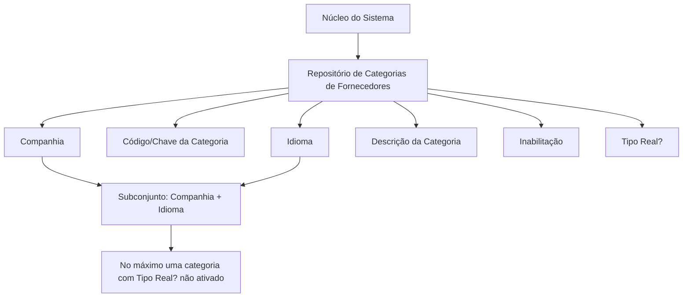

# Definição das Categorias de Fornecedores — Catálogo por Companhia e Idioma

## 1. Metadados do Documento
- **Arquivo de Origem:** Não identificado no conteúdo extraído
- **Tipo de Documento:** Especificação Funcional
- **Domínio / Sistema:** Catálogo de Categorias de Fornecedores — MAPFRE
- **Público-Alvo:** Analistas funcionais, desenvolvedores, administradores de catálogo e áreas de negócio
- **Data/Versão Identificada:** Não identificada

---

## 2. Resumo Executivo & Contexto de Negócio

O documento define o catálogo de **Categorias de Fornecedores** do núcleo do Sistema. O catálogo é entregue inicialmente às instalações sem conteúdo e deve ser preenchido conforme as necessidades de cada entidade ou companhia.

Cada categoria é identificada no contexto de uma companhia e possui informações multilíngues. A definição inclui o código da companhia, o código ou chave da categoria, o idioma e a descrição correspondente à categoria naquele idioma.

O catálogo também contém propriedades para controlar a inabilitação e a natureza da categoria. A propriedade **Tipo Real?** diferencia categorias reais de categorias genéricas e estabelece uma restrição: para cada subconjunto formado por companhia e idioma, pode existir apenas um registro com essa propriedade não ativada.

O documento não determina uma codificação padronizada para as categorias. A entidade MAPFRE deve avaliar a conveniência de utilizar esse catálogo transversalmente nos processos corporativos, visando sua correta exploração posterior.

---

## 3. Arquitetura, Componentes & Tecnologias Envolvidas

O conteúdo descreve um repositório de informação específico para a codificação de categorias de fornecedores. Não há detalhamento de tecnologias, APIs, banco de dados, interfaces, integrações, endpoints, métodos HTTP ou ambientes técnicos.

Os elementos funcionais identificados são:

- **Núcleo do Sistema:** componente que disponibiliza a possibilidade de codificar categorias de fornecedores.
- **Repositório de Categorias de Fornecedores:** repositório inicialmente vazio entregue às instalações.
- **Companhia:** atributo que contextualiza a definição de uma categoria.
- **Categoria:** código ou chave da categoria configurada.
- **Idioma:** chave do idioma usado na configuração.
- **Descrição da Categoria:** denominação da categoria no idioma definido.
- **Inabilitação:** propriedade para indicar que o Tipo de Fornecedor está desativado ou inabilitado para atribuição a um fornecedor.
- **Tipo Real?:** propriedade que classifica a categoria como real ou genérica.



> **Nota de Análise:** O documento lista fragmentos de navegação como “CF”, “Home”, “Solutions”, “APIs Documentation” e “Zeus”, mas não define seus significados nem sua relação com o catálogo de Categorias de Fornecedores.

---

## 4. Regras de Negócio, Especificações Funcionais & Processos

1. O núcleo do Sistema permite codificar Categorias de Fornecedores em um repositório específico.
2. O repositório de Categorias de Fornecedores é entregue inicialmente às instalações sem conteúdo.
3. Cada definição de Categoria de Fornecedor deve conter o código da companhia à qual a configuração se aplica.
4. Cada definição deve conter um código ou chave de Categoria de Fornecedor.
5. Cada definição deve conter a chave do idioma empregado na configuração, com exemplos de idiomas como espanhol, inglês e turco.
6. A descrição da categoria deve representar a denominação da Categoria de Fornecedor de acordo com o idioma configurado.
7. A propriedade **Inabilitação** estabelece que o **Tipo de Fornecedor** está desativado ou inabilitado para uso em sua atribuição a um fornecedor.
8. A propriedade **Tipo Real?** estabelece se a Categoria de Fornecedor é real ou genérica.
9. Para cada subconjunto de registros composto por **Companhia** e **Idioma**, pode existir somente um registro com a propriedade **Tipo Real?** não ativada.
10. No exemplo apresentado para o idioma espanhol, as categorias `1`, `2` e `3` são classificadas como reais (`S`), enquanto a categoria `ZZZ` é classificada como genérica (`N`).
11. Não existe preferência ou recomendação definida para estabelecer ou padronizar a codificação do catálogo no sistema.
12. A entidade MAPFRE deve analisar a conveniência de usar transversalmente o catálogo de Categorias de Fornecedores nos processos corporativos, para permitir sua exploração posterior.

> **Nota de Análise:** A descrição da propriedade **Inabilitação** menciona “Tipo de Proveedor”, embora o restante do documento trate do catálogo de “Categorías de los Proveedores”. O texto-fonte não esclarece se essa referência é intencional ou uma inconsistência terminológica.

---

## 5. Tabelas de Parâmetros, Ambientes e Estruturas de Dados

| Item / Parâmetro | Descrição / Função | Tipo / Valores / Formato | Ambiente / Observações |
| :--- | :--- | :--- | :--- |
| Companhia | Código da companhia para a qual a Categoria de Fornecedor está sendo definida. | Código de companhia; formato não especificado. | Compõe o subconjunto de unicidade junto com Idioma. |
| Categoria | Código ou chave da Categoria de Fornecedor configurada no catálogo. | Código/chave; formato não especificado. | Exemplos: `1`, `2`, `3`, `ZZZ`. |
| Idioma | Chave do idioma empregado na configuração da Categoria de Fornecedor. | Chave de idioma; exemplos textuais: espanhol, inglês, turco. | Compõe o subconjunto de unicidade junto com Companhia. |
| Descrição da Categoria | Denominação ou descrição da Categoria de Fornecedor no idioma da definição. | Texto. | Exemplo em espanhol: `RECOMENDADO`. |
| Inabilitação | Indica que o Tipo de Fornecedor está desativado ou inabilitado para sua atribuição a um fornecedor. | Valor/formato não especificado. | O documento não detalha comportamento operacional adicional. |
| Tipo Real? | Determina se a Categoria de Fornecedor é real ou genérica. | `S` para real; `N` para genérica, conforme exemplo. | Apenas um registro com a propriedade não ativada por combinação de Companhia e Idioma. |
| Repositório de Categorias de Fornecedores | Repositório específico para codificação das categorias. | Não especificado. | Entregue inicialmente vazio às instalações. |

| Código da Categoria | Descrição em Espanhol | Tipo Real? |
| :--- | :--- | :--- |
| `1` | RECOMENDADO | `S` |
| `2` | RECOMENDADO PLUS | `S` |
| `3` | EMBAJADOR | `S` |
| `ZZZ` | GENÉRICO | `N` |

---

## 6. Bateria de Perguntas & Respostas para RAG (FAQ Sintético)

### P1: Qual é o objetivo do catálogo de Categorias de Fornecedores?
**R:** O catálogo permite que o núcleo do Sistema codifique Categorias de Fornecedores em um repositório de informação específico. O repositório é entregue inicialmente sem conteúdo às instalações.

### P2: Quais dados identificam uma configuração de Categoria de Fornecedor?
**R:** A configuração contém, no mínimo, o código da Companhia, o código ou chave da Categoria de Fornecedor, o Idioma e a Descrição da Categoria no idioma utilizado.

### P3: Para que serve o atributo Companhia?
**R:** O atributo Companhia contém o código da companhia sobre a qual está sendo realizada a definição da Categoria de Fornecedor.

### P4: Como o sistema suporta descrições multilíngues das categorias?
**R:** Cada definição possui um atributo Idioma, que armazena a chave do idioma utilizado na configuração. A Descrição da Categoria representa a denominação da categoria de acordo com esse idioma. O documento cita espanhol, inglês e turco como exemplos.

### P5: O que representa a propriedade Tipo Real?
**R:** A propriedade **Tipo Real?** determina se uma Categoria de Fornecedor é uma categoria real ou uma categoria genérica. No exemplo em espanhol, as categorias `1`, `2` e `3` são reais (`S`), e a categoria `ZZZ` é genérica (`N`).

### P6: Qual restrição existe para categorias genéricas por companhia e idioma?
**R:** Para cada subconjunto de registros formado pela combinação de Companhia e Idioma, pode existir apenas um registro com a propriedade **Tipo Real?** não ativada. No exemplo, esse registro é a categoria `ZZZ`, marcada com `N`.

### P7: O que significa a propriedade Inabilitação?
**R:** A propriedade Inabilitação estabelece que o Tipo de Fornecedor está desativado ou inabilitado para ser utilizado em sua atribuição a um fornecedor. O documento não define valores possíveis, formato de armazenamento ou efeitos técnicos adicionais.

### P8: Existe um padrão obrigatório para os códigos das Categorias de Fornecedores?
**R:** Não. O documento declara que não existe preferência ou recomendação para estabelecer ou padronizar a codificação do catálogo no sistema.

### P9: Qual é a recomendação para a entidade MAPFRE sobre esse catálogo?
**R:** A entidade MAPFRE deve analisar a conveniência de utilizar transversalmente o catálogo de Categorias de Fornecedores nos processos da companhia, visando sua correta exploração posterior.

### P10: Quais categorias e descrições são apresentadas no exemplo em espanhol?
**R:** O exemplo apresenta `1 — RECOMENDADO`, `2 — RECOMENDADO PLUS`, `3 — EMBAJADOR` e `ZZZ — GENÉRICO`. As três primeiras são reais (`S`) e a última é genérica (`N`).

### P11: O documento especifica APIs, métodos HTTP ou contratos JSON para o catálogo?
**R:** Não. O documento é funcional e não detalha APIs, métodos HTTP, contratos JSON, persistência, tecnologias, URLs, ambientes ou mecanismos de integração.

---

## 7. Glossário de Termos, Siglas & Conceitos-Chave

- **Categoria de Fornecedor:** classificação codificada e configurada em catálogo para fornecedores.
- **Companhia:** entidade organizacional identificada por código, no contexto da qual a Categoria de Fornecedor é definida.
- **Descrição da Categoria:** denominação textual de uma Categoria de Fornecedor no idioma configurado.
- **Idioma:** chave que identifica o idioma empregado na configuração e descrição da categoria.
- **Inabilitação:** propriedade que indica que o Tipo de Fornecedor está desativado ou inabilitado para atribuição a um fornecedor.
- **MAPFRE:** entidade mencionada como responsável por analisar a conveniência de uso transversal do catálogo nos processos da companhia.
- **Repositório de informação específico:** local lógico de armazenamento e codificação das Categorias de Fornecedores.
- **Tipo Real?:** propriedade que determina se a Categoria de Fornecedor é real ou genérica.
- **Categoria Genérica:** categoria cujo campo **Tipo Real?** não está ativado; no exemplo, indicada por `N`.
- **Categoria Real:** categoria cujo campo **Tipo Real?** está ativado; no exemplo, indicada por `S`.

---

## 8. Notas Críticas, Riscos & Limitações

- O repositório é entregue inicialmente vazio, exigindo definição e carga de conteúdo pelas instalações.
- Não há padrão obrigatório para a codificação de categorias, o que pode resultar em divergências entre companhias ou processos se não houver governança corporativa.
- O documento recomenda que a entidade MAPFRE avalie a utilização transversal do catálogo, mas não estabelece essa utilização como obrigatória.
- O formato técnico dos atributos, valores permitidos para Inabilitação, regras de atualização, responsáveis pela manutenção e mecanismos de validação não são detalhados.
- Não há especificação de APIs, integração, persistência, trilhas de auditoria, autenticação, perfis de acesso ou ambientes.
- A referência à inabilitação de “Tipo de Fornecedor” em um documento sobre “Categoria de Fornecedor” não é esclarecida pelo conteúdo-fonte.
- A restrição sobre **Tipo Real?** é descrita em linguagem natural; o documento não informa como ela deve ser implementada tecnicamente.

---

## 9. Conteúdo Bruto Estruturado (Referência Fiel)

```text
--- [PÁGINA 1 DE 3] ---

DEFINICIÓN de las CATEGORÍAS de los
PROVEEDORES
Objetivo
Funcionalmente, el núcleo del Sistema cuenta con la posibilidad de codificar las Categorías de los
Proveedores en un repositorio de información específico que se entrega inicialmente a las
instalaciones vacío de contenido.
Propiedades
Otras Propiedades
Propiedades
Compañía
Este Atributo del catálogo contiene el código de la compañía sobre la que se está realizando la
definición de la Categoría del Proveedor.
Categoría
Este Atributo determina el código o clave de la Categoría del Proveedor que se está configurando en
el catálogo.
Idioma
 / 
 CF
Home Solutions APIs Documentation Zeus
EN


--- [PÁGINA 2 DE 3] ---

Este Atributo contiene la clave del Idioma empleado en la configuración de la Categoría del
Proveedor como por ejemplo: español, inglés, turco, ...
Descripción de la Categoría
Esta propiedad contiene la denominación o descripción de la Categoría del Proveedor de acuerdo
con el idioma utilizado en la definición.
A modo de ejemplo y si el idioma de la definición es el español...
CATEGORÍA DESCRIPCIÓN
1 RECOMENDADO
2 RECOMENDADO PLUS
3 EMBAJADOR
ZZZ GENÉRICO
Otras Propiedades
Inhabilitación
Esta propiedad establece que el Tipo de Proveedor está desactivado o inhabilitado para poder ser
empleado en su asignación a un Proveedor.
Tipo Real?
Esta propiedad establece si la Categoría del Proveedor es una Categoría Real o Genérica pudiendo
existir un único Registro con esta Propiedad sin activar por cada subconjunto de registros
conformado por la Compañía y el lenguaje.
A modo de ejemplo y si el idioma de la definición es el español...
CATEGORÍA DESCRIPCIÓN REAL?
1 RECOMENDADO S
2 RECOMENDADO PLUS S
3 EMBAJADOR S


--- [PÁGINA 3 DE 3] ---

CATEGORÍA DESCRIPCIÓN REAL?
ZZZ GENÉRICO N
Vínculos
Relación de Directrices y Documentos funcionales cuya lectura recomendada para evitar que la
interpretación aislada del presente documento pueda conducir a error.
Idiomas
Preguntas frecuentes
(1) ¿Existe alguna recomendación operativa que deba ser tomada en consideración localmente en la
codificación, uso y definición del catálogo de Categorías de los Proveedores?
No existe una preferencia ni recomendación para establecer o estandarizar en el sistema su
codificación, si bien la entidad MAPFRE debe analizar la conveniencia de utilizar transversalmente en
los procesos de la compañía este catálogo de información para su correcta y posterior explotación.
```
