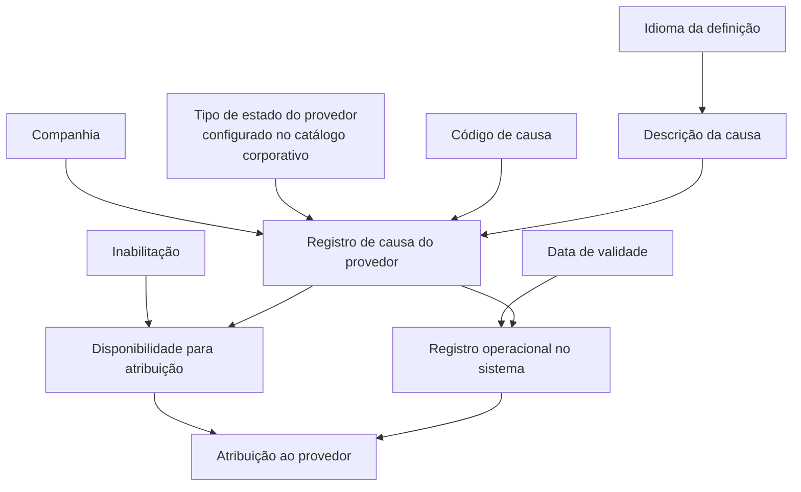

# Definição das Causas por Estado do Provedor

## 1. Metadados do Documento
- **Arquivo de Origem:** Não identificado no conteúdo extraído
- **Tipo de Documento:** Especificação Funcional
- **Domínio / Sistema:** Catálogo de causas associadas aos estados de provedores — entidade MAPFRE
- **Público-Alvo:** Negócio, analistas funcionais, desenvolvedores e operação
- **Data/Versão Identificada:** Não identificada

---

## 2. Resumo Executivo & Contexto de Negócio

O documento descreve um catálogo destinado a definir as causas ou motivos associados aos diferentes estados que um provedor pode assumir durante sua relação profissional com a entidade seguradora. A finalidade é permitir que a entidade seguradora identifique de maneira estruturada os motivos pelos quais um provedor se encontra em determinado estado.

A configuração de cada causa está associada à companhia, ao tipo de estado do provedor, a um código de causa, ao idioma e à descrição localizada da causa. O catálogo suporta descrições em idiomas como espanhol, inglês e alemão, permitindo apresentar a denominação da causa de acordo com o idioma usado na definição.

O documento também estabelece controles de vigência e disponibilidade. Uma causa pode ser inabilitada para impedir sua utilização na atribuição aos provedores. Além disso, a data de validade determina a partir de quando um registro configurado passa a estar operacional, permitindo manter histórico das alterações ao longo do tempo.

A MAPFRE deve avaliar a conveniência de adotar uma codificação transversal para explorar corretamente esse catálogo em seus processos corporativos, incluindo o agrupamento de causas relacionadas a cada estado de provedor. O documento não define uma convenção obrigatória para essa codificação.

> **Nota de Análise:** O objetivo menciona a divisão territorial de países em zonas geográficas para uso por provedores. Entretanto, o restante do conteúdo trata exclusivamente do catálogo de causas por estado de provedor e não detalha a relação entre zonas geográficas e as causas descritas.

---

## 3. Arquitetura, Componentes & Tecnologias Envolvidas

O conteúdo não descreve arquitetura técnica, APIs, microsserviços, contratos HTTP, bancos de dados, URLs, servidores ou ambientes de implantação. Os elementos funcionais identificados são:

- Entidade seguradora.
- Provedores.
- Catálogo corporativo.
- Catálogo de causas por estado de provedor.
- Companhia.
- Tipo de estado do provedor.
- Código de causa.
- Idioma.
- Descrição da causa.
- Inabilitação.
- Data de validade.
- MAPFRE.

O fluxo funcional inferível, limitado aos elementos explicitamente descritos, é a configuração de uma causa no catálogo, sua ativação por vigência e sua posterior atribuição aos provedores, desde que a causa não esteja inabilitada.



> **Nota de Análise:** O documento lista “Home Solutions APIs Documentation Zeus” no texto extraído, mas não fornece qualquer explicação sobre seu papel, integração ou vínculo com o catálogo de causas.

---

## 4. Regras de Negócio, Especificações Funcionais & Processos

### Configuração de causas por estado de provedor

1. Um provedor pode passar por diferentes estados durante sua relação profissional com a entidade seguradora.
2. A entidade seguradora necessita identificar as causas ou motivos pelos quais o provedor está associado a um estado específico.
3. Cada registro de causa deve ser definido no catálogo com referência à companhia sobre a qual a configuração está sendo realizada.
4. Cada registro deve identificar o tipo de estado do provedor conforme os valores configurados no catálogo corporativo.
5. Cada registro deve possuir um código ou chave de causa.
6. Cada causa deve possuir uma definição de idioma.
7. A descrição da causa deve corresponder ao idioma selecionado na definição.
8. A causa pode ser marcada como inabilitada, impedindo seu uso na atribuição aos provedores.
9. A data de validade determina a data a partir da qual o registro configurado torna-se operacional no sistema.
10. O uso correto da data de validade permite preservar um histórico das alterações efetuadas ao longo do tempo.

### Codificação e exploração corporativa

1. O documento não estabelece preferência ou recomendação obrigatória para codificar as causas no sistema.
2. A MAPFRE deve analisar a conveniência de usar transversalmente o catálogo de causas em seus processos corporativos.
3. Uma possível abordagem de exploração consiste em agrupar as causas relacionadas a cada estado de provedor segundo uma codificação preestabelecida.
4. A decisão sobre a padronização e o uso transversal da codificação permanece sob análise da entidade MAPFRE.

### Exemplos de causas apresentados

- Estado `AC`, causa `1`: `JUNIOR`.
- Estado `AC`, causa `2`: `EXPERTO`.
- Estado `BA`, causa `100`: `BAJA POR ENFERMEDAD`.
- Estado `BA`, causa `150`: `BAJA POR FRAUDE`.
- Estado `BA`, causa `200`: `BAJA POR FALTA DE CALIDAD`.
- Estado `SA`, causa `500`: `POR ENFERMEDAD`.
- Estado `SA`, causa `550`: `POR REMODELACIÓN`.
- Estado `SA`, causa `555`: `POR INVESTIGACIÓN FRAUDE`.

---

## 5. Tabelas de Parâmetros, Ambientes e Estruturas de Dados

### Estrutura funcional do registro de causa

| Item / Parâmetro | Descrição / Função | Tipo / Valores / Formato | Ambiente / Observações |
| :--- | :--- | :--- | :--- |
| Companhia | Código da companhia sobre a qual é realizada a definição do registro no catálogo. | Código de companhia; formato não detalhado. | Obrigatório conforme a descrição funcional; regras de validação não detalhadas. |
| Tipo de Estado do Provedor | Determina e especifica o tipo de estado do provedor. | Valores configurados no catálogo corporativo. | O documento não apresenta a lista completa de estados. |
| Código de Causa | Código ou chave da causa do provedor configurada no catálogo. | Código numérico nos exemplos: `1`, `2`, `100`, `150`, `200`, `500`, `550`, `555`. | Não há convenção obrigatória de codificação definida. |
| Idioma | Chave do idioma usado na configuração da causa do provedor. | Exemplos: espanhol, inglês e alemão. | O formato técnico da chave não é especificado. |
| Descrição da Causa | Denominação ou descrição da causa do provedor conforme o idioma da definição. | Texto. | Deve corresponder ao idioma selecionado. |
| Inabilitação | Indica que a chave de causa está desativada ou inabilitada. | Estado de habilitação; valores técnicos não detalhados. | Uma causa inabilitada não pode ser usada na atribuição aos provedores. |
| Data de Validade | Define a data a partir da qual o registro configurado está operacional no sistema. | Data; formato não detalhado. | Permite manter histórico de alterações ao longo do tempo. |

### Exemplos de estado, causa e descrição

| Estado | Código de Causa | Descrição da Causa | Observações |
| :--- | :--- | :--- | :--- |
| AC | 1 | JUNIOR | Exemplo apresentado para idioma espanhol. |
| AC | 2 | EXPERTO | Exemplo apresentado para idioma espanhol. |
| BA | 100 | BAJA POR ENFERMEDAD | Exemplo apresentado para idioma espanhol. |
| BA | 150 | BAJA POR FRAUDE | Exemplo apresentado para idioma espanhol. |
| BA | 200 | BAJA POR FALTA DE CALIDAD | Exemplo apresentado para idioma espanhol. |
| SA | 500 | POR ENFERMEDAD | Exemplo apresentado para idioma espanhol. |
| SA | 550 | POR REMODELACIÓN | Exemplo apresentado para idioma espanhol. |
| SA | 555 | POR INVESTIGACIÓN FRAUDE | Exemplo apresentado para idioma espanhol. |

### Ambientes, rotas, logs e integrações

| Item / Parâmetro | Descrição / Função | Tipo / Valores / Formato | Ambiente / Observações |
| :--- | :--- | :--- | :--- |
| Ambientes | Não identificados. | Não aplicável. | O documento não informa ambientes de desenvolvimento, homologação ou produção. |
| URLs | Não identificadas. | Não aplicável. | Não há URLs no conteúdo extraído. |
| Rotas de log | Não identificadas. | Não aplicável. | Não há caminhos, arquivos ou políticas de logs. |
| APIs e contratos | Não detalhados. | Não aplicável. | “Home Solutions APIs Documentation Zeus” é citado sem contexto técnico adicional. |

---

## 6. Bateria de Perguntas & Respostas para RAG (FAQ Sintético)

### P1: Qual é o objetivo do catálogo de causas por estado do provedor?
**R:** O catálogo permite à entidade seguradora identificar e configurar os motivos ou causas pelos quais um provedor se encontra associado a um determinado estado durante sua relação profissional com a entidade.

### P2: Quais informações compõem um registro de causa de provedor?
**R:** O registro contém companhia, tipo de estado do provedor, código de causa, idioma, descrição da causa, indicação de inabilitação e data de validade.

### P3: Como o tipo de estado do provedor é definido no catálogo?
**R:** O tipo de estado do provedor é determinado de acordo com os valores que estejam configurados no catálogo corporativo. O documento não apresenta a lista integral desses valores.

### P4: Qual é a função do código de causa?
**R:** O código de causa identifica a causa do provedor configurada no catálogo. Nos exemplos fornecidos, os códigos incluem `1`, `2`, `100`, `150`, `200`, `500`, `550` e `555`.

### P5: Como o idioma afeta a descrição de uma causa?
**R:** O idioma é a chave usada na configuração da causa do provedor. A descrição da causa deve conter a denominação correspondente ao idioma utilizado na definição, com exemplos de idiomas como espanhol, inglês e alemão.

### P6: O que acontece quando uma causa é inabilitada?
**R:** Quando uma causa é marcada como inabilitada, sua chave fica desativada e não pode ser utilizada para atribuição aos provedores.

### P7: Qual é o papel da data de validade no registro de causa?
**R:** A data de validade determina a partir de quando o registro configurado está operacional no sistema. O seu uso correto permite manter histórico dos cambios ou alterações realizadas ao longo do tempo.

### P8: Existe uma codificação obrigatória para as causas de estado de provedor?
**R:** Não. O documento informa que não existe preferência nem recomendação para estabelecer ou padronizar a codificação no sistema.

### P9: O que a MAPFRE deve avaliar sobre o uso do catálogo?
**R:** A MAPFRE deve analisar a conveniência de utilizar o catálogo transversalmente nos processos da companhia, visando sua correta exploração posterior, inclusive por meio do agrupamento de causas por estado de provedor segundo uma codificação preestabelecida.

### P10: Quais exemplos de causas são associados ao estado BA?
**R:** O documento apresenta as causas `100 — BAJA POR ENFERMEDAD`, `150 — BAJA POR FRAUDE` e `200 — BAJA POR FALTA DE CALIDAD` para o estado `BA`.

### P11: Quais exemplos de causas são associados ao estado SA?
**R:** O documento apresenta as causas `500 — POR ENFERMEDAD`, `550 — POR REMODELACIÓN` e `555 — POR INVESTIGACIÓN FRAUDE` para o estado `SA`.

### P12: O documento especifica APIs, métodos HTTP ou contratos JSON para o catálogo?
**R:** Não. Embora a expressão “Home Solutions APIs Documentation Zeus” esteja presente no conteúdo extraído, não há detalhamento de APIs, métodos HTTP, URLs, contratos JSON, autenticação ou integração técnica.

---

## 7. Glossário de Termos, Siglas & Conceitos-Chave

- **MAPFRE:** Entidade mencionada como responsável por analisar a conveniência do uso transversal do catálogo de causas em seus processos.
- **Provedor / Proveedor:** Profissional ou entidade que pode assumir diferentes estados em sua relação com a entidade seguradora.
- **Tipo de Estado do Provedor:** Classificação do estado do provedor, conforme valores configurados no catálogo corporativo.
- **Causa do Provedor:** Motivo associado ao estado de um provedor.
- **Catálogo Corporativo:** Catálogo que contém os valores usados para configurar o tipo de estado do provedor.
- **Companhia:** Código da empresa ou companhia sobre a qual a definição do registro de catálogo está sendo realizada.
- **Inabilitação:** Condição que desativa uma causa e impede seu uso na atribuição aos provedores.
- **Data de Validade:** Data a partir da qual um registro configurado passa a operar no sistema.
- **AC:** Código de estado apresentado nos exemplos; sua expansão não é detalhada.
- **BA:** Código de estado apresentado nos exemplos; sua expansão não é detalhada.
- **SA:** Código de estado apresentado nos exemplos; sua expansão não é detalhada.
- **Home Solutions APIs Documentation Zeus:** Termo listado no conteúdo extraído sem explicação funcional ou técnica.

---

## 8. Notas Críticas, Riscos & Limitações

- O documento não informa nome do arquivo, autor, versão, data de publicação ou aprovação.
- O documento não descreve modelo de dados físico, persistência, APIs, serviços, métodos HTTP, contratos JSON, autenticação ou integrações.
- Não são fornecidos ambientes, URLs, servidores, portas, variáveis de configuração ou rotas de logs.
- Não há definição explícita do significado dos códigos de estado `AC`, `BA` e `SA`.
- Não há formato técnico para código de companhia, código de causa, chave de idioma ou data de validade.
- Não são detalhadas regras de unicidade, obrigatoriedade, precedência de vigências, tratamento de causas duplicadas ou processo de reabilitação de uma causa inabilitada.
- A referência a zonas geográficas no objetivo não é desenvolvida no restante do documento, o que pode indicar conteúdo desconectado ou uma dependência funcional não explicada.
- A referência a “Home Solutions APIs Documentation Zeus” não contém contexto suficiente para estabelecer relação com o catálogo de causas.
- O próprio documento recomenda a leitura de diretrizes e documentos funcionais relacionados para evitar interpretações isoladas incorretas, mas não lista esses documentos.

---

## 9. Conteúdo Bruto Estruturado (Referência Fiel)

```text
--- [PÁGINA 1 DE 3] ---

DEFINICIÓN de las CAUSAS por ESTADO del
PROVEEDOR
Contexto
Los proveedores a lo largo de su desempeño profesional pueden pasar por diferentes estados en su
relación con la entidad aseguradora además que la entidad aseguradora necesita identificar las
causas o motivos por los que pueden estar asimilados en uno u otro estado.
Objetivo
Funcionalmente el núcleo del Sistema cuenta con la posibilidad de dividir la organización territorial de
los países en divisiones o Zonas Geográficas para su empleo específico por parte de los
Proveedores de la Entidad.
Propiedades
Otras Propiedades
Propiedades
Compañía
Este Atributo del catálogo contiene el código de la compañía sobre la que se está realizando la
definición del registro en el catálogo.
Tipo Estado del Proveedor
 /
 CF
Home Solutions APIs Documentation Zeus
EN


--- [PÁGINA 2 DE 3] ---

Este Atributo determina y especifica el Tipo de Estado de acuerdo con los valores que estén
configurados en el catálogo Corporativo.
Código de Causa
Este Atributo determina el código o clave de la Causa del Proveedor que se está configurando en el
catálogo.
Idioma
Esta propiedad es la clave del Idioma empleado en la configuración de la Causa del Proveedor, como
por ejemplo: español, inglés, alemán, ...
Descripción de la Causa
Esta propiedad contiene la denominación o descripción de la Causa del Proveedor de acuerdo con el
idioma utilizado en la definición.
A modo de ejemplo si el idioma de la definición fuera el español...
ESTADO CAUSA DESCRIPCIÓN
AC 1 JUNIOR
AC 2 EXPERTO
BA 100 BAJA POR ENFERMEDAD
BA 150 BAJA POR FRAUDE
BA 200 BAJA POR FALTA DE CALIDAD
SA 500 POR ENFERMEDAD
SA 550 POR REMODELACIÓN
SA 555 POR INVESTIGACIÓN FRAUDE
... ...
Otras Propiedades


--- [PÁGINA 3 DE 3] ---

Inhabilitación
Esta propiedad establece que la clave de la Causa está desactivada o inhabilitada para poder ser
utilizada en su asignación a los Proveedores.
Fecha de Validez
Esta propiedad determina la fecha a partir de la cual el registro configurado está operativo en el
sistema por lo que su correcto uso permite tener un histórico de los cambios efectuados a lo largo del
tiempo.
Vínculos
Relación de Directrices y Documentos funcionales cuya lectura recomendada para evitar que la
interpretación aislada del presente documento pueda conducir a error.
Idiomas
Preguntas frecuentes
(1) ¿Existe alguna recomendación operativa que deba ser tomada en consideración localmente en
la codificación, uso y definición del catálogo de las causas en los estados de los Proveedores?
No existe una preferencia ni recomendación para establecer o estandarizar en el sistema su
codificación, si bien la entidad MAPFRE debe analizar la conveniencia de utilizar transversalmente en
los procesos de la compañía este catálogo de información para su correcta y posterior explotación,
e.g:
Agrupando las Causas relacionadas con cada uno de los estados de los proveedores de acuerdo con
una codificación pre-establecida, ...
```
