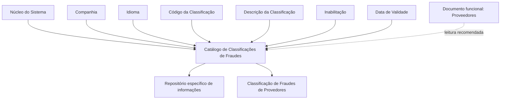

# Definição de Classificações de Fraudes para Provedores

## 1. Metadados do Documento
- **Arquivo de Origem:** Não identificado
- **Tipo de Documento:** Especificação Técnica
- **Domínio / Sistema:** Catálogo de Classificações de Fraudes para Provedores
- **Público-Alvo:** Negócio, Operação, Analistas Funcionais e Desenvolvedores
- **Data/Versão Identificada:** Não identificada

---

## 2. Resumo Executivo & Contexto de Negócio

O documento descreve a definição do catálogo de **Classificações de Fraudes** no núcleo do Sistema. Esse catálogo mantém um repositório específico de informações para classificar fraudes cometidas por Provedores.

A configuração de uma classificação de fraude é identificada pela companhia, idioma e código da classificação. A descrição da classificação depende do idioma configurado, permitindo que um mesmo código possua uma descrição apresentada conforme o idioma empregado na definição.

O catálogo também inclui propriedades operacionais para controlar a disponibilidade e a vigência dos registros. A propriedade de inabilitação desativa uma classificação para uso, enquanto a data de validade determina a partir de quando o registro torna-se operacional no Sistema.

O documento referencia “Proveedores” como material funcional recomendado, visando evitar interpretações isoladas ou incorretas da definição do catálogo. Não são apresentados métodos de acesso, telas, contratos de integração, persistência física ou regras de validação adicionais.

---

## 3. Arquitetura, Componentes & Tecnologias Envolvidas

O conteúdo identifica os seguintes elementos funcionais:

- **Núcleo do Sistema:** Componente que disponibiliza a capacidade de classificar fraudes.
- **Repositório de informação específico:** Repositório destinado às classificações de fraudes.
- **Catálogo de Classificações de Fraudes:** Estrutura configurável com atributos de companhia, idioma, código, descrição, inabilitação e data de validade.
- **Provedores:** Entidade ou domínio ao qual se referem as fraudes classificadas.
- **Documento funcional “Proveedores”:** Material relacionado cuja leitura é recomendada.



**Nota de Análise:** O documento não detalha tecnologias, bancos de dados, APIs, métodos HTTP, contratos JSON, interfaces de usuário, ambientes ou mecanismos técnicos de integração.

---

## 4. Regras de Negócio, Especificações Funcionais & Processos

1. O núcleo do Sistema possui a capacidade funcional de classificar fraudes em um repositório de informação específico.
2. As classificações de fraudes são configuradas para fraudes cometidas por Provedores.
3. A propriedade **Companhia** contém o código da companhia sobre a qual está sendo definida a classificação de fraude.
4. A propriedade **Idioma** contém a chave do idioma utilizada na configuração das classificações de fraude. O documento cita como exemplos espanhol, inglês e português.
5. A propriedade **Código da Classificação** contém a chave ou o código da classificação de fraude.
6. A propriedade **Descrição** identifica a descrição da classificação conforme o idioma utilizado na definição.
7. O documento apresenta exemplos de classificações em espanhol:
   - `DOL` — `Doloso`
   - `OCA` — `Ocasional`
8. A propriedade **Inabilitação** estabelece que o registro configurado está desativado ou inabilitado para utilização.
9. A propriedade **Data de Validade** informa ao Sistema a data a partir da qual o registro configurado está operacional.
10. O uso correto da Data de Validade permite manter um histórico das alterações realizadas ao longo do tempo.
11. O documento recomenda a leitura das diretrizes e documentos funcionais vinculados, especialmente “Proveedores”, para evitar erros de interpretação decorrentes de análise isolada.
12. A pergunta frequente sobre recomendações operacionais locais para codificação, uso e definição do catálogo possui resposta `N/A`.

---

## 5. Tabelas de Parâmetros, Ambientes e Estruturas de Dados

| Item / Parâmetro | Descrição / Função | Tipo / Valores / Formato | Ambiente / Observações |
| :--- | :--- | :--- | :--- |
| Companhia | Contém o código da companhia para a qual a classificação de fraude está sendo definida. | Código de companhia; formato não detalhado. | Associado à definição da classificação. |
| Idioma | Contém a chave do idioma empregada na configuração das classificações de fraude. | Chave de idioma; exemplos: espanhol, inglês, português. | Determina o idioma da descrição. |
| Código da Classificação | Contém a chave ou código da classificação de fraude. | Código; formato não detalhado. | Exemplos: `DOL`, `OCA`. |
| Descrição | Identifica a descrição da classificação de acordo com o idioma usado em sua definição. | Texto; formato não detalhado. | Exemplo em espanhol: `Doloso`, `Ocasional`. |
| Inabilitação | Define que o registro configurado está desativado ou inabilitado para uso. | Estado de inabilitação; valores não detalhados. | Controla a disponibilidade de utilização do registro. |
| Data de Validade | Indica a data a partir da qual o registro configurado torna-se operacional no Sistema. | Data; formato não detalhado. | Permite histórico de alterações ao longo do tempo. |
| DOL | Código de classificação apresentado como exemplo. | Código de classificação. | Descrição em espanhol: `Doloso`. |
| OCA | Código de classificação apresentado como exemplo. | Código de classificação. | Descrição em espanhol: `Ocasional`. |

---

## 6. Bateria de Perguntas & Respostas para RAG (FAQ Sintético)

### P1: Qual é o objetivo do catálogo de Classificações de Fraudes?
**R:** O catálogo permite que o núcleo do Sistema classifique fraudes em um repositório de informação específico. O documento relaciona essa classificação a fraudes cometidas por Provedores.

### P2: Quais atributos identificam uma classificação de fraude?
**R:** O documento identifica como propriedades da definição de classificação de fraude a Companhia, o Idioma, o Código da Classificação e a Descrição. Também são apresentadas as propriedades operacionais Inabilitação e Data de Validade.

### P3: Para que serve o atributo Companhia na classificação de fraudes?
**R:** O atributo Companhia contém o código da companhia sobre a qual está sendo realizada a definição das classificações de fraudes.

### P4: Como o idioma é utilizado no catálogo de classificações de fraudes?
**R:** A propriedade Idioma contém a chave do idioma empregada na configuração das classificações. A Descrição da Classificação é identificada de acordo com o idioma utilizado na definição. O documento cita espanhol, inglês e português como exemplos de idiomas.

### P5: O que representa o Código da Classificação?
**R:** O Código da Classificação representa a chave ou o código da classificação de fraude. O documento fornece os códigos `DOL` e `OCA` como exemplos.

### P6: Quais exemplos de código e descrição de classificação são apresentados?
**R:** O documento apresenta os exemplos em espanhol `DOL — Doloso` e `OCA — Ocasional`. Não são fornecidos critérios adicionais para determinar quando cada classificação deve ser utilizada.

### P7: Qual é o efeito da propriedade Inabilitação?
**R:** A propriedade Inabilitação estabelece que o registro configurado está desativado ou inabilitado para ser utilizado.

### P8: Qual é a finalidade da Data de Validade?
**R:** A Data de Validade indica ao Sistema a data a partir da qual o registro configurado está operacional. O uso correto dessa propriedade permite manter um histórico das mudanças realizadas ao longo do tempo.

### P9: Existem recomendações operacionais locais para codificação, uso e definição do catálogo?
**R:** Não. Na seção de perguntas frequentes, a recomendação operacional local para codificação, uso e definição do catálogo de Classificações de Fraudes para Provedores está indicada como `N/A`.

### P10: Há documentação relacionada que deve ser consultada?
**R:** Sim. O documento recomenda a leitura de diretrizes e documentos funcionais vinculados para evitar interpretações isoladas. O material explicitamente citado é “Proveedores”.

---

## 7. Glossário de Termos, Siglas & Conceitos-Chave

- **Classificação de Fraude:** Registro configurado para classificar fraudes no repositório específico do Sistema.
- **Companhia:** Código da companhia sobre a qual a definição da classificação de fraude é realizada.
- **DOL:** Código de classificação exemplificado com a descrição espanhola “Doloso”.
- **Idioma:** Chave do idioma utilizada na configuração da classificação e na respectiva descrição.
- **Inabilitação:** Propriedade que define que um registro configurado está desativado ou não pode ser utilizado.
- **OCA:** Código de classificação exemplificado com a descrição espanhola “Ocasional”.
- **Provedores / Proveedores:** Entidade referenciada pelo documento em relação às fraudes classificadas e ao documento funcional recomendado.
- **Data de Validade:** Propriedade que estabelece a data a partir da qual um registro passa a operar no Sistema.

---

## 8. Notas Críticas, Riscos & Limitações

- O documento não informa o nome do arquivo de origem, autor, versão ou data.
- Não são detalhados os meios de manutenção do catálogo, tais como telas, APIs, rotas, permissões ou procedimentos operacionais.
- Não há definição do formato técnico dos códigos de companhia, códigos de classificação, chaves de idioma ou datas.
- Não são apresentadas regras para evitar duplicidade de classificações, conflitos de vigência ou combinações inválidas entre companhia, idioma e código.
- Não há detalhamento sobre persistência, banco de dados, ambientes, URLs, logs ou integrações.
- A ausência de leitura do documento funcional “Proveedores” pode levar a interpretação isolada e incorreta do catálogo.
- **Nota de Análise:** O documento fornece exemplos de códigos e descrições, mas não especifica a taxonomia completa de classificações de fraude nem os critérios para aplicação de `DOL` ou `OCA`.

---

## 9. Conteúdo Bruto Estruturado (Referência Fiel)

```text
--- [PÁGINA 1 DE 2] ---

DEFINICIÓN de CLASIFICACIONES de
FRAUDES
Objetivo
Funcionalmente, el núcleo del Sistema cuenta con la posibilidad de clasificar los Fraudes en un
repositorio de información específico.
Propiedades Operativas
Otras Propiedades
Propiedades Operativas
Compañía
Este Atributo del catálogo contiene el código de la compañía sobre la que se está realizando la
definición de las clasificaciones de los Fraudes.
Idioma
Esta propiedad contiene la clave del Idioma empleado en la configuración de las clasificaciones de
los fraudes cometidos por los Proveedores como por ejemplo: español, inglés, Portugués, ...
Código de la Clasificación
Este Atributo contiene la clave o el código de la Clasificación del Fraude.
 /
 CF
Home Solutions APIs Documentation Zeus
EN


--- [PÁGINA 2 DE 2] ---

Descripción
Este Atributo del catálogo de configuración identifica la descripción de la Clasificación de acuerdo con
el idioma utilizado en su definición.
A modo de ejemplo y si el idioma empleado en la definición fuera el Español...
TIPO DESCRIPCIÓN
DOL Doloso
OCA Ocasional
... ...
Otras Propiedades
Inhabilitación
Esta propiedad establece que el Registro configurado está desactivado o inhabilitado para ser
utilizado.
Fecha de Validez
Esta propiedad le indica al Sistema la fecha a partir de la cual el registro configurado está operativo
en el sistema por lo que su correcto uso permite tener un histórico de los cambios efectuados a lo
largo del tiempo.
Vínculos
Relación de Directrices y Documentos funcionales cuya lectura recomendada para evitar que la
interpretación aislada del presente documento pueda conducir a error.
Proveedores
Preguntas frecuentes
(1) ¿Existe alguna recomendación operativa que deba ser tomada en consideración localmente en la
codificación, uso y definición del catálogo de Clasificaciones de los Fraudes para los Proveedores?
N/A
```
