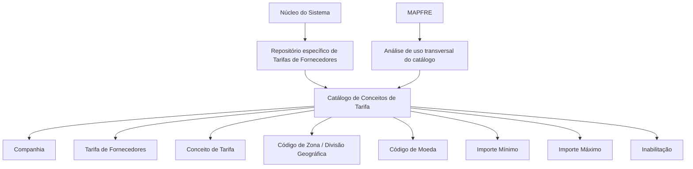

# Configuração de Conceitos de Tarifa de Fornecedores por Zona Geográfica e Tarifa

## 1. Metadados do Documento
- **Arquivo de Origem:** Não identificado no conteúdo fornecido
- **Tipo de Documento:** Especificação Funcional
- **Domínio / Sistema:** Tarifas de Fornecedores — MAPFRE
- **Público-Alvo:** Não identificado; conteúdo direcionado à configuração e exploração funcional de catálogo
- **Data/Versão Identificada:** Não identificada

---

## 2. Resumo Executivo & Contexto de Negócio

O documento descreve a configuração do catálogo de **Conceitos de Tarifa de Fornecedores por Zona Geográfica e Tarifa**. O núcleo do sistema permite codificar tarifas de fornecedores em um repositório de informação específico, inicialmente entregue sem conteúdo nas instalações.

A configuração de cada registro associa uma companhia, uma tarifa de fornecedor, um conceito de tarifa e uma divisão geográfica. O registro também informa a moeda aplicável e define limites mínimo e máximo de valor para a utilização do conceito de tarifa pelo fornecedor.

O catálogo prevê a propriedade de inabilitação, que permite marcar um código de conceito de tarifa como desativado ou indisponível para uso. O documento não especifica o comportamento operacional do sistema após a inabilitação, nem detalha processos de aprovação, auditoria ou reativação.

A MAPFRE deve analisar a conveniência de utilizar transversalmente esse catálogo nos processos corporativos, visando sua correta exploração posterior. O documento declara que não há preferência ou recomendação para padronizar a codificação do catálogo no sistema.

---

## 3. Arquitetura, Componentes & Tecnologias Envolvidas

O conteúdo disponibilizado não descreve arquitetura técnica, microsserviços, APIs, bancos de dados, ambientes, protocolos ou tecnologias de implementação. O escopo identificado é funcional: um repositório de informação para codificação de tarifas de fornecedores.

### Componentes e entidades citados

| Componente / Entidade | Papel descrito |
| :--- | :--- |
| Núcleo do Sistema | Disponibiliza a possibilidade de codificar tarifas de fornecedores. |
| Repositório de informação específico | Repositório destinado às tarifas de fornecedores; inicialmente entregue vazio nas instalações. |
| Catálogo de Conceitos de Tarifa de Fornecedores | Catálogo configurado por companhia, tarifa, conceito, zona geográfica, moeda e limites de valor. |
| Companhia | Código da companhia sobre a qual ocorre a configuração do conceito de tarifa. |
| Tarifa | Código ou chave da tarifa de fornecedores configurada no catálogo. |
| Conceito de Tarifa | Código ou chave do conceito de tarifa de fornecedores configurado. |
| Divisão Geográfica / Código de Zona | Código ou chave da divisão geográfica dos fornecedores configurada. |
| Moeda | Código da moeda empregado na configuração do registro. |
| MAPFRE | Entidade que deve analisar a conveniência de uso transversal do catálogo nos processos da companhia. |



> **Nota de Análise:** O documento não detalha métodos HTTP, contratos JSON, persistência, integrações, permissões, rotas de log ou ambientes técnicos.

---

## 4. Regras de Negócio, Especificações Funcionais & Processos

1. O núcleo do sistema permite codificar as tarifas de fornecedores em um repositório de informação específico.
2. O repositório de informação específico é entregue inicialmente vazio de conteúdo nas instalações.
3. A configuração do catálogo deve indicar o código da companhia sobre a qual o conceito de tarifa de fornecedor está sendo configurado.
4. A configuração deve indicar o código ou a chave da tarifa de fornecedores.
5. A configuração deve indicar o código ou a chave do conceito de tarifa de fornecedores.
6. A configuração deve indicar o código ou a chave da divisão geográfica dos fornecedores, denominada também código de zona.
7. A configuração deve indicar o código da moeda utilizada no registro.
8. O **Importe Mínimo** estabelece o valor mínimo que pode ser atribuído ao conceito de tarifa, de acordo com a moeda definida.
9. O **Importe Máximo** estabelece o valor máximo, entendido como limite, que pode ser considerado no uso do conceito de tarifa pelo fornecedor, de acordo com a moeda definida.
10. A propriedade **Inabilitação** informa que o código do conceito de tarifa está desativado ou inabilitado para utilização.
11. Não existe preferência ou recomendação para estabelecer ou padronizar a codificação do catálogo no sistema.
12. A entidade MAPFRE deve analisar a conveniência de utilizar o catálogo de forma transversal nos processos da companhia, para permitir sua correta exploração posterior.
13. O documento recomenda a leitura dos documentos funcionais vinculados para evitar interpretações isoladas e incorretas.

### Documentos funcionais vinculados

- Tarifas de los Proveedores
- Conceptos de Tarifa
- Monedas

> **Nota de Análise:** O conteúdo não define critérios de validação entre importe mínimo e importe máximo, obrigatoriedade dos atributos, formatos dos códigos, regras de unicidade, nem o fluxo de criação, alteração ou exclusão de registros.

---

## 5. Tabelas de Parâmetros, Ambientes e Estruturas de Dados

| Item / Parâmetro | Descrição / Função | Tipo / Valores / Formato | Ambiente / Observações |
| :--- | :--- | :--- | :--- |
| Companhia | Contém o código da companhia sobre a qual é realizada a configuração do conceito de tarifa de fornecedores. | Código da companhia; formato não detalhado. | Aplicável ao registro configurado no catálogo. |
| Tarifa | Determina o código ou chave da tarifa de fornecedores configurada no catálogo. | Código ou chave; formato não detalhado. | Aplicável ao registro configurado no catálogo. |
| Conceito | Determina o código ou chave do conceito de tarifa de fornecedores configurado no catálogo. | Código ou chave; formato não detalhado. | Pode ser marcado como inabilitado. |
| Código de Zona | Determina o código ou chave da divisão geográfica dos fornecedores configurada no catálogo. | Código ou chave; formato não detalhado. | Também referido como divisão geográfica. |
| Código da Moeda | Indica o código da moeda usada na configuração do registro. | Código de moeda; formato não detalhado. | Base de referência para os importes mínimo e máximo. |
| Importe Mínimo | Estabelece o valor mínimo que pode ser atribuído ao conceito de tarifa conforme a moeda definida. | Valor monetário; formato e precisão não detalhados. | Vinculado à moeda da definição. |
| Importe Máximo | Estabelece o valor máximo, entendido como limite, para uso do conceito de tarifa pelo fornecedor conforme a moeda definida. | Valor monetário; formato e precisão não detalhados. | Vinculado à moeda da definição. |
| Inabilitação | Estabelece que o código do conceito de tarifa está desativado ou inabilitado para uso. | Estado de inabilitação; valores não detalhados. | O comportamento técnico ou funcional subsequente não é informado. |
| Repositório específico | Armazena a codificação das tarifas de fornecedores. | Repositório de informação; tecnologia não identificada. | Inicialmente entregue vazio nas instalações. |
| Codificação do catálogo | Forma de identificação dos registros do catálogo. | Não padronizada pelo documento. | Não há preferência ou recomendação de estandardização no sistema. |

---

## 6. Bateria de Perguntas & Respostas para RAG (FAQ Sintético)

### P1: Qual é o objetivo do catálogo de Conceitos de Tarifa de Fornecedores?
**R:** O catálogo permite codificar tarifas de fornecedores em um repositório de informação específico disponibilizado pelo núcleo do sistema. O documento indica que esse repositório é inicialmente entregue vazio nas instalações.

### P2: Quais atributos identificam a configuração de um conceito de tarifa de fornecedor?
**R:** O documento identifica os atributos Companhia, Tarifa, Conceito, Código de Zona, Código da Moeda, Importe Mínimo, Importe Máximo e Inabilitação.

### P3: Qual é a função do atributo Companhia?
**R:** O atributo Companhia contém o código da companhia sobre a qual está sendo realizada a configuração do conceito de tarifa de fornecedores.

### P4: O que representa o atributo Tarifa no catálogo?
**R:** Tarifa determina o código ou a chave da tarifa de fornecedores que está sendo configurada no catálogo.

### P5: Para que serve o Código de Zona?
**R:** O Código de Zona determina o código ou a chave da divisão geográfica dos fornecedores que está sendo configurada no catálogo.

### P6: Como a moeda se relaciona aos valores mínimo e máximo?
**R:** O Código da Moeda identifica a moeda empregada na configuração do registro. O Importe Mínimo e o Importe Máximo são definidos de acordo com essa moeda.

### P7: Qual é a diferença entre Importe Mínimo e Importe Máximo?
**R:** O Importe Mínimo é o menor valor que pode ser atribuído ao conceito de tarifa conforme a moeda da definição. O Importe Máximo é o limite máximo que pode ser considerado no uso desse conceito de tarifa pelo fornecedor, também de acordo com a moeda definida.

### P8: O que acontece quando um conceito de tarifa está inabilitado?
**R:** A propriedade Inabilitação estabelece que o código do conceito de tarifa está desativado ou inabilitado para ser utilizado. O documento não detalha regras adicionais de bloqueio, reativação ou impacto em registros existentes.

### P9: O documento define um padrão obrigatório para a codificação do catálogo?
**R:** Não. O documento declara que não existe preferência ou recomendação para estabelecer ou estandardizar a codificação no sistema.

### P10: Qual orientação é dada à MAPFRE sobre o uso do catálogo?
**R:** A MAPFRE deve analisar a conveniência de utilizar transversalmente o catálogo de informação nos processos da companhia, visando sua correta exploração posterior.

### P11: Quais documentos devem ser consultados para complementar a interpretação do catálogo?
**R:** O documento recomenda consultar os materiais vinculados “Tarifas de los Proveedores”, “Conceptos de Tarifa” e “Monedas”, para evitar que a interpretação isolada do documento leve a erros.

### P12: O documento informa APIs, tecnologias ou ambientes para o catálogo?
**R:** Não. O conteúdo não descreve APIs, métodos HTTP, contratos JSON, tecnologias, servidores, URLs, ambientes, mecanismos de autenticação ou rotas de logs.

---

## 7. Glossário de Termos, Siglas & Conceitos-Chave

- **MAPFRE:** Entidade mencionada como responsável por analisar a conveniência do uso transversal do catálogo nos processos da companhia.
- **Catálogo de Conceitos de Tarifa:** Catálogo de informação usado para configurar conceitos de tarifa de fornecedores.
- **Tarifa de Fornecedores:** Tarifa identificada por um código ou chave na configuração do catálogo.
- **Conceito de Tarifa:** Conceito identificado por um código ou chave, associado à tarifa de fornecedores.
- **Código de Zona:** Código ou chave da divisão geográfica dos fornecedores.
- **Divisão Geográfica:** Entidade geográfica de fornecedores identificada pelo Código de Zona.
- **Código da Moeda:** Código da moeda empregada na configuração do registro.
- **Importe Mínimo:** Valor mínimo permitido para atribuição ao conceito de tarifa, conforme a moeda definida.
- **Importe Máximo:** Valor máximo ou limite aplicável ao uso do conceito de tarifa pelo fornecedor, conforme a moeda definida.
- **Inabilitação:** Propriedade que indica que o código do conceito de tarifa está desativado ou inabilitado para uso.
- **Codificação:** Definição de códigos ou chaves para os elementos do catálogo.

---

## 8. Notas Críticas, Riscos & Limitações

- O repositório de tarifas de fornecedores é entregue inicialmente sem conteúdo; o documento não descreve carga inicial, migração ou responsáveis pelo preenchimento.
- Não há recomendação ou padronização para a codificação do catálogo, o que pode demandar análise da MAPFRE para uso transversal consistente.
- O documento recomenda leitura dos documentos vinculados para evitar erros de interpretação decorrentes de sua leitura isolada.
- Não são informados critérios de validação entre Importe Mínimo e Importe Máximo.
- Não são detalhados formato, tamanho, domínio de valores ou obrigatoriedade dos códigos de companhia, tarifa, conceito, zona e moeda.
- Não há descrição de tecnologia, APIs, integração, persistência, controles de acesso, auditoria, logs ou ambientes.
- Não é detalhado o comportamento operacional de registros associados a conceitos de tarifa inabilitados.

---

## 9. Conteúdo Bruto Estruturado (Referência Fiel)

```text
--- [PÁGINA 1 DE 3] ---

CONFIGURACIÓN de los CONCEPTOS de
TARIFA de los PROVEEDORES por ZONA
GEOGRÁFICA y TARIFA
Objetivo
Funcionalmente, el núcleo del Sistema cuenta con la posibilidad de codificar las Tarifas de los
Proveedores en un repositorio de información específico que se entrega inicialmente a las
instalaciones vacío de contenido.
Propiedades
Otras Propiedades
Propiedades
Compañía
Este Atributo del catálogo contiene el código de la compañía sobre la que se está realizando la
configuración del Concepto de Tarifa de los Proveedores.
Tarifa
Este Atributo determina el código o clave de la Tarifa de los Proveedores que se está configurando en
el catálogo.
Concepto
 /
 CF
Home Solutions APIs Documentation Zeus
EN


--- [PÁGINA 2 DE 3] ---

Este Atributo determina el código o clave del Concepto de Tarifa de los Proveedores que se está
configurando en el catálogo.
Código de Zona
Este Atributo determina el código o clave de la División Geográfica de los Proveedores que se está
configurando en el catálogo.
Código de la Moneda
Esta propiedad indica el código de la Moneda empleada en la configuración del Registro.
Importe Mínimo
Esta propiedad establece el importe mínimo que se puede asignar al concepto de tarifa de acuerdo
con la moneda de su definición.
Importe Máximo
Esta propiedad establece el importe máximo, entendido como límite, que se puede contemplar en el
uso de este concepto de Tarifa por parte del Proveedor y de acuerdo con la moneda de su definición.
Otras Propiedades
Inhabilitación
Esta propiedad establece que el Código del Concepto de Tarifa está desactivado o inhabilitado para
poder ser utilizado.
Vínculos
Relación de Directrices y Documentos funcionales cuya lectura recomendada para evitar que la
interpretación aislada del presente documento pueda conducir a error.
Tarifas de los Proveedores
Conceptos de Tarifa
Monedas
Preguntas frecuentes
(1) ¿Existe alguna recomendación operativa que deba ser tomada en consideración localmente en la
codificación, uso y definición del catálogo de Conceptos de Tarifa de los Proveedores?


--- [PÁGINA 3 DE 3] ---

No existe una preferencia ni recomendación para establecer o estandarizar en el sistema su
codificación, si bien la entidad MAPFRE debe analizar la conveniencia de utilizar transversalmente en
los procesos de la compañía este catálogo de información para su correcta y posterior explotación.
```
