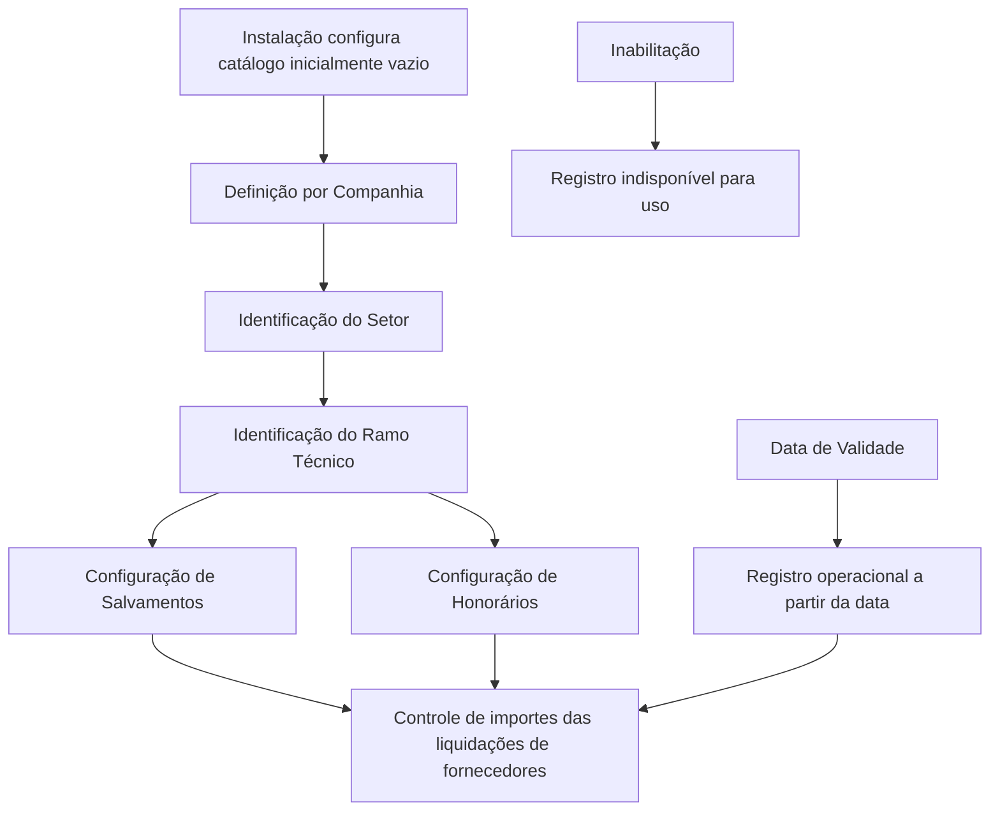

# Definição de Controle de Importes de Fraude por Ramo no REEF.core

## 1. Metadados do Documento
- **Arquivo de Origem:** `Não identificado — texto bruto fornecido`
- **Tipo de Documento:** `Especificação Técnica / Funcional`
- **Domínio / Sistema:** `REEF.core — Controle de Importes para Fraude`
- **Público-Alvo:** `Negócio, analistas funcionais, configuração corporativa e operação`
- **Data/Versão Identificada:** `Não identificada`

---

## 2. Resumo Executivo & Contexto de Negócio

O documento descreve a funcionalidade do REEF.core para controlar os importes das liquidações de fornecedores no contexto de fraude. Esse controle é definido por meio de um catálogo de informações instalado inicialmente sem conteúdo, cuja configuração deve ser realizada pelas próprias instalações conforme suas necessidades.

A configuração é segmentada por companhia, setor e ramo técnico. Esses atributos identificam o escopo organizacional e de produto no qual uma definição de controle de importes deve ser aplicada.

O catálogo define especificamente o comportamento relacionado aos importes de salvamentos e honorários. Para ambos os conceitos, é possível controlar se o importe pode ser modificado e determinar o tipo padrão de obtenção do valor. Quando o cálculo for dinâmico, a companhia pode estabelecer a lógica de negócio usada para obter o importe.

A configuração também contém propriedades de inabilitação e data de validade. A inabilitação impede a utilização de um registro configurado; a data de validade determina quando o registro se torna operacional e permite preservar um histórico das alterações realizadas no catálogo ao longo do tempo.

O documento não estabelece uma convenção obrigatória para codificação do catálogo. Contudo, recomenda que a entidade MAPFRE avalie a conveniência de usar o catálogo transversalmente nos processos da companhia, visando sua exploração posterior.

---

## 3. Arquitetura, Componentes & Tecnologias Envolvidas

Os elementos explicitamente identificados são:

| Componente / Conceito | Papel descrito |
| :--- | :--- |
| **REEF.core** | Sistema que disponibiliza o controle de importes das liquidações de fornecedores. |
| **Catálogo de Controle de Importes** | Estrutura de informação configurada pelas instalações para definir controles de fraude. |
| **Companhia** | Código da companhia para a qual a definição de controle de importes de fraude é realizada. |
| **Setor** | Chave identificada conforme a configuração da estrutura de produtos da entidade. |
| **Ramo Técnico** | Chave identificada conforme a configuração da estrutura de produtos da entidade. |
| **Liquidações de Fornecedores** | Contexto cujos importes podem ser controlados pela configuração do catálogo. |
| **Salvamentos** | Conceito cujo importe pode ser modificável ou calculado segundo um tipo padrão e lógica de negócio. |
| **Honorários** | Conceito cujo importe pode ser modificável ou calculado segundo um tipo padrão e lógica de negócio. |
| **MAPFRE** | Entidade mencionada como responsável por avaliar o uso transversal do catálogo. |



**Nota de Análise:** o documento não detalha interfaces, métodos HTTP, contratos JSON, banco de dados, tecnologias de implementação, integrações externas ou regras de precedência entre registros de catálogo.

---

## 4. Regras de Negócio, Especificações Funcionais & Processos

### Controle de importes de liquidações

1. O REEF.core permite controlar os importes das liquidações de fornecedores.
2. O controle depende da configuração realizada em um catálogo de informações.
3. O catálogo é entregue às instalações sem conteúdo.
4. Cada instalação deve configurar o catálogo de acordo com suas próprias necessidades.

### Escopo da definição de controle de fraude

A definição de importes para controle de fraude está associada a:

1. **Companhia:** código da companhia sobre a qual a definição é realizada.
2. **Setor:** chave de setor conforme a estrutura de produtos configurada pela entidade.
3. **Ramo Técnico:** chave de ramo técnico conforme a estrutura de produtos configurada pela entidade.

### Regras para salvamentos

1. O atributo **“¿Permite Modificar el Importe de Salvamentos?”** modula o comportamento do sistema, permitindo ou impedindo a modificação do importe de salvamentos.
2. O atributo **“Tipo por Defecto en Salvamentos”** identifica a forma de obtenção que o sistema deve considerar para calcular o importe de salvamentos.
3. Caso tenha sido indicado que o cálculo deve ser efetuado dinamicamente, a lógica de negócio de obtenção do importe de salvamentos deve calcular dinamicamente o valor conforme os critérios que a companhia considerar oportunos.

### Regras para honorários

1. O atributo **“¿Permite Modificar el Importe de Honorarios?”** modula o comportamento do sistema, permitindo ou impedindo a modificação do importe de honorários.
2. O atributo **“Tipo por Defecto en Honorarios”** identifica a forma de obtenção que o sistema deve considerar para calcular o importe de honorários.
3. A lógica de negócio para obtenção do importe de honorários permite calcular dinamicamente o valor conforme os critérios que a companhia considerar oportunos.

### Regras de vigência e disponibilidade

1. A propriedade **Inhabilitación** estabelece que o registro configurado na tabela de controle de importes para companhia, setor e ramo está desativado ou inabilitado para uso.
2. A propriedade **Fecha de Validez** determina a data a partir da qual o registro configurado se torna operacional no sistema.
3. O uso correto da data de validade permite manter histórico das alterações realizadas ao longo do tempo na configuração do catálogo de importes.

### Recomendações documentais e de uso

1. O documento indica a leitura recomendada de diretrizes e documentos funcionais relacionados para evitar interpretações isoladas e incorretas.
2. O vínculo documental explicitamente apresentado é **Fraude**.
3. Não existe preferência ou recomendação para estabelecer ou padronizar a codificação do catálogo no sistema.
4. A entidade MAPFRE deve avaliar a conveniência de usar o catálogo transversalmente nos processos da companhia, para permitir sua correta exploração posterior.

---

## 5. Tabelas de Parâmetros, Ambientes e Estruturas de Dados

| Item / Parâmetro | Descrição / Função | Tipo / Valores / Formato | Ambiente / Observações |
| :--- | :--- | :--- | :--- |
| Companhia | Contém o código da companhia para a qual é definida a configuração de importes de controle de fraude. | Código de companhia; formato não especificado. | Associado ao registro de controle de importes. |
| Setor | Identifica a chave do setor conforme a configuração da estrutura de produtos da entidade. | Chave de setor; formato não especificado. | Associado ao escopo companhia, setor e ramo. |
| Ramo / Ramo Técnico | Identifica a chave do ramo técnico conforme a configuração da estrutura de produtos da entidade. | Chave de ramo técnico; formato não especificado. | Associado ao escopo companhia, setor e ramo. |
| ¿Permite Modificar el Importe de Salvamentos? | Determina se o sistema permite modificar o importe de salvamentos. | Valor não detalhado no documento. | Modula o comportamento relativo aos salvamentos. |
| Tipo por Defecto en Salvamentos | Identifica a forma de obtenção considerada pelo sistema para cálculo do importe de salvamentos. | Tipo de obtenção; valores não especificados. | Pode indicar cálculo dinâmico. |
| Lógica de Negócio para obtener el Importe de los Salvamentos | Permite obter dinamicamente o importe de salvamentos segundo critérios definidos pela companhia. | Lógica de negócio; implementação não detalhada. | Aplicável quando o cálculo for indicado como dinâmico. |
| ¿Permite Modificar el Importe de Honorarios? | Determina se o sistema permite modificar o importe de honorários. | Valor não detalhado no documento. | Modula o comportamento relativo aos honorários. |
| Tipo por Defecto en Honorarios | Identifica a forma de obtenção considerada pelo sistema para cálculo do importe de honorários. | Tipo de obtenção; valores não especificados. | Regras e valores possíveis não detalhados. |
| Lógica de Negócio para obtener el Importe de los Honorarios | Permite obter dinamicamente o importe de honorários segundo critérios definidos pela companhia. | Lógica de negócio; implementação não detalhada. | Critérios são estabelecidos pela companhia. |
| Inhabilitación | Define que o registro de controle de importes está desativado ou inabilitado. | Propriedade de estado; valores não especificados. | Impede o uso do registro para companhia, setor e ramo. |
| Fecha de Validez | Determina a data a partir da qual o registro configurado está operacional. | Data; formato não especificado. | Permite histórico de mudanças do catálogo. |
| Catálogo de Importes para o Controle de Fraude | Catálogo usado para configurar controles sobre importes de liquidações de fornecedores. | Catálogo de informação; estrutura técnica não especificada. | Entregue vazio às instalações. |

---

## 6. Bateria de Perguntas & Respostas para RAG (FAQ Sintético)

### P1: Qual é o objetivo do catálogo de controle de importes de fraude no REEF.core?
**R:** O catálogo permite configurar o controle dos importes das liquidações de fornecedores no REEF.core. O catálogo é entregue inicialmente sem conteúdo, e cada instalação deve configurá-lo conforme suas necessidades.

### P2: Quais atributos definem o escopo de um registro de controle de importes?
**R:** O documento identifica companhia, setor e ramo técnico como atributos de escopo. A companhia contém o código da companhia; setor e ramo técnico correspondem às chaves configuradas na estrutura de produtos da entidade.

### P3: O importe de salvamentos pode ser alterado manualmente?
**R:** A possibilidade de alterar o importe de salvamentos é controlada pelo atributo “¿Permite Modificar el Importe de Salvamentos?”. O documento informa que esse atributo permite ou não a modificação, mas não especifica os valores permitidos nem o comportamento técnico da alteração.

### P4: Como o sistema obtém o importe de salvamentos quando o cálculo é dinâmico?
**R:** Quando o atributo de tipo padrão indicar cálculo dinâmico, a lógica de negócio para obtenção do importe de salvamentos permite calcular o valor dinamicamente conforme os critérios que a companhia considerar oportunos.

### P5: Como o documento define o cálculo do importe de honorários?
**R:** O atributo “Tipo por Defecto en Honorarios” identifica a forma de obtenção do importe. A lógica de negócio de honorários permite obter o importe dinamicamente segundo os critérios definidos pela companhia. O documento não detalha fórmulas, regras de cálculo ou valores possíveis.

### P6: Qual é o efeito da propriedade Inhabilitación?
**R:** A propriedade Inhabilitación informa que o registro configurado na tabela de controle de importes para uma combinação de companhia, setor e ramo está desativado ou inabilitado e, portanto, não pode ser utilizado.

### P7: Para que serve a Fecha de Validez no catálogo de importes?
**R:** A Fecha de Validez determina a data a partir da qual um registro configurado se torna operacional no sistema. Seu uso correto permite manter histórico das mudanças realizadas na configuração do catálogo de importes ao longo do tempo.

### P8: Existe um padrão obrigatório de codificação para o catálogo de importes?
**R:** Não. O documento afirma que não existe preferência nem recomendação para estabelecer ou padronizar a codificação do catálogo no sistema.

### P9: Qual recomendação é dada à entidade MAPFRE sobre esse catálogo?
**R:** A MAPFRE deve analisar a conveniência de utilizar transversalmente o catálogo de informações nos processos da companhia, com o objetivo de permitir sua correta exploração posterior.

### P10: Quais documentos relacionados devem ser considerados ao interpretar esta especificação?
**R:** O documento recomenda a leitura de diretrizes e documentos funcionais relacionados para evitar que uma interpretação isolada cause erros. O vínculo explicitamente apresentado é “Fraude”.

---

## 7. Glossário de Termos, Siglas & Conceitos-Chave

- **REEF.core:** Sistema que dispõe da possibilidade de controlar os importes das liquidações de fornecedores por meio de configuração em catálogo de informações.
- **Controle de Importes:** Configuração destinada a controlar valores associados às liquidações de fornecedores no contexto de fraude.
- **Liquidações de Fornecedores:** Contexto operacional cujos importes são objeto do controle descrito.
- **Companhia:** Código da companhia sobre a qual é realizada a definição de importes de controle de fraude.
- **Setor:** Chave de setor configurada na estrutura de produtos da entidade.
- **Ramo Técnico:** Chave de ramo configurada na estrutura de produtos da entidade.
- **Salvamentos:** Conceito cujo importe pode ter modificação controlada e cálculo definido por tipo padrão e lógica de negócio.
- **Honorários:** Conceito cujo importe pode ter modificação controlada e cálculo definido por tipo padrão e lógica de negócio.
- **Inhabilitación:** Propriedade que desativa ou inabilita o uso de um registro configurado.
- **Fecha de Validez:** Data a partir da qual um registro configurado se torna operacional.
- **MAPFRE:** Entidade citada como responsável por avaliar o uso transversal do catálogo nos processos da companhia.

---

## 8. Notas Críticas, Riscos & Limitações

- O catálogo é entregue vazio; a efetividade do controle depende da configuração realizada por cada instalação.
- O documento não informa valores permitidos para os atributos de permissão de modificação, tipos padrão ou propriedades de inabilitação.
- O documento não apresenta fórmulas, contratos técnicos, serviços, APIs, tabelas físicas, rotas de logs ou mecanismos de persistência.
- O documento não especifica como resolver conflitos entre múltiplos registros de companhia, setor, ramo, data de validade e estado de inabilitação.
- Os critérios utilizados pelas companhias para cálculo dinâmico de salvamentos e honorários não são definidos.
- Uma interpretação isolada do documento pode conduzir a erro; a leitura de diretrizes e documentos funcionais relacionados é recomendada.
- Não existe padronização recomendada para a codificação do catálogo, o que pode resultar em abordagens distintas entre instalações.
- **Nota de Análise:** o texto menciona o vínculo “Fraude”, mas não fornece seu conteúdo nem identifica o documento correspondente.

---

## 9. Conteúdo Bruto Estruturado (Referência Fiel)

```text
--- [PÁGINA 1 DE 3] ---

DEFINICIÓN de CONTROL de IMPORTES del
FRAUDE por RAMO>
Objetivo
Funcionalmente, Reef.core cuenta con la posibilidad de controlar los importes de las Liquidaciones
de los Proveedores de acuerdo con la configuración que se realice en un catálogo de información
que se entrega a las instalaciones vacío de contenido para que sean ellas quienes lo configuren de
acuerdo con sus necesidades.
Propiedades
Otras Propiedades
Propiedades
Compañía
Este Atributo del catálogo contiene el código de la compañía sobre la que se está realizando la
definición de los importes de Control del Fraude. .
Sector
Esta propiedad identifica la clave del Sector de acuerdo con la configuración realizada en la
estructura de productos de la entidad.
Ramo
 / 
 CF
Home Solutions APIs Documentation Zeus
EN


--- [PÁGINA 2 DE 3] ---

Esta propiedad identifica la clave del Ramo Técnico de acuerdo con la configuración realizada en la
estructura de productos de la entidad.
¿Permite Modificar el Importe de Salvamentos?
Este Atributo modula el comportamiento del sistema permitiendo o no modificar el importe de los
salvamentos.
Tipo por Defecto en Salvamentos
Este Atributo identifica la forma de obtención que el sistema debe considerar para efectuar el cálculo
del importe.
Lógica de Negocio para obtener el Importe de los Salvamentos
Si se ha indicado que el cálculo debe efectuarse dinámicamente (valor del atributo anterior) esta
lógica de Negocio permite obtener dinámicamente el Importe de los Salvamentos de acuerdo con los
criterios que la Compañía estime oportunamente para realizar su cálculo.
¿Permite Modificar el Importe de Honorarios?
Este Atributo modula el comportamiento del sistema permitiendo o no modificar el importe de los
honorarios.
Tipo por Defecto en Honorarios
Este Atributo identifica la forma de obtención que el sistema debe considerar para efectuar el cálculo
del importe de los honorarios.
Lógica de Negocio para obtener el Importe de los Honorarios
Esta lógica de Negocio permite obtener dinámicamente el Importe de los Honorarios de acuerdo con
los criterios que la Compañía estime oportunamente para efectuar su cálculo.
Otras Propiedades
Inhabilitación
Esta propiedad establece que el Registro configurado en la tabla de control de importes para la
compañía, sector y Ramo está desactivado o inhabilitado para poder ser utilizado.
Fecha de Validez
Esta propiedad determina la fecha a partir de la cual el registro configurado está operativo en el
sistema por lo que su correcto uso permite tener un histórico de los cambios efectuados a lo largo del
tiempo en la configuración del catálogo de importes.


--- [PÁGINA 3 DE 3] ---

Vínculos
Relación de Directrices y Documentos funcionales cuya lectura recomendada para evitar que la
interpretación aislada del presente documento pueda conducir a error.
Fraude
Preguntas frecuentes
(1) ¿Existe alguna recomendación operativa que deba ser tomada en consideración localmente en la
codificación, uso y definición del catálogo de Importes para el Control del Fraude?
No existe una preferencia ni recomendación para establecer o estandarizar en el sistema su
codificación, si bien la entidad MAPFRE debe analizar la conveniencia de utilizar transversalmente en
los procesos de la compañía este catálogo de información para su correcta y posterior explotación.
```
