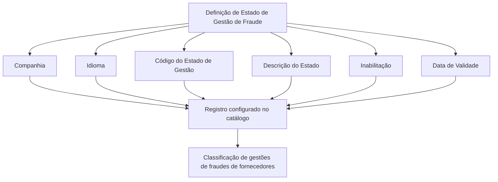

# Definição dos Estados de Gestão de Fraudes de Fornecedores

## 1. Metadados do Documento
- **Arquivo de Origem:** Não identificado no conteúdo fornecido
- **Tipo de Documento:** Especificação Funcional
- **Domínio / Sistema:** Catálogo de Estados de Gestão de Fraudes — Fornecedores
- **Público-Alvo:** Negócio, Analistas Funcionais, Operação e equipes responsáveis pela configuração do sistema
- **Data/Versão Identificada:** Não identificada

---

## 2. Resumo Executivo & Contexto de Negócio

O documento define propriedades para configurar e classificar os estados das gestões de fraudes cometidas por fornecedores. A classificação ocorre em um repositório de informações específico do núcleo do sistema.

Cada registro de estado de gestão de fraude é definido considerando a companhia, o idioma, um código de estado e uma descrição localizada. Essa estrutura permite que a mesma definição funcional seja apresentada conforme o idioma utilizado na configuração.

O catálogo prevê propriedades operacionais adicionais para controlar a disponibilidade e a vigência temporal dos registros. A propriedade de inabilitação desativa um registro configurado, enquanto a data de validade indica a partir de quando o registro passa a operar no sistema e suporta o histórico de alterações ao longo do tempo.

O documento também referencia materiais relacionados, incluindo “Proveedores” e “Preguntas frecuentes”, para evitar interpretações isoladas. Entretanto, a pergunta frequente apresentada não possui resposta detalhada, sendo indicada como `N/A`.

---

## 3. Arquitetura, Componentes & Tecnologias Envolvidas

O conteúdo não descreve arquitetura tecnológica, microsserviços, APIs, protocolos, ambientes técnicos, integrações ou tecnologias de implementação.

O fluxo funcional identificado representa a configuração e utilização de um registro no catálogo de estados de gestão de fraudes de fornecedores.



> **Nota de Análise:** O documento menciona “Sistema”, “núcleo do Sistema” e “repositório de informação específico”, mas não identifica nomes técnicos, componentes de software, contratos, métodos HTTP, bancos de dados ou mecanismos de integração.

---

## 4. Regras de Negócio, Especificações Funcionais & Processos

### 4.1 Objetivo funcional

O núcleo do sistema possui a capacidade de classificar os estados nos quais se encontram as gestões de fraudes em um repositório de informações específico.

A classificação está relacionada às gestões de fraudes cometidas por fornecedores.

### 4.2 Propriedades operacionais do catálogo

1. **Companhia**
   - O atributo de companhia contém o código da companhia sobre a qual está sendo realizada a definição dos estados das gestões de fraudes.

2. **Idioma**
   - A propriedade de idioma contém a chave do idioma empregado na configuração dos estados das gestões de fraudes cometidas por fornecedores.
   - Exemplos de idiomas citados: espanhol, inglês e português.

3. **Código do Estado de Gestão**
   - O campo identifica a chave ou o código do estado da gestão de fraude.

4. **Descrição**
   - O atributo de descrição identifica a descrição do estado da gestão de fraude cometida pelo fornecedor.
   - A descrição é definida conforme o idioma utilizado na configuração.

### 4.3 Estados exemplificados para o idioma espanhol

O documento apresenta os seguintes exemplos de código e descrição de estado:

- `ASG` — Asignado
- `CLD` — Concluido
- `INV` — Investigación de Campo
- `RDI` — En Revisión DISMA
- `REV` — En Revisión

### 4.4 Outras propriedades

1. **Inabilitação**
   - Define que o registro configurado está desativado ou inabilitado para utilização.

2. **Data de Validade**
   - Indica ao sistema a data a partir da qual o registro configurado está operacional.
   - O uso correto da data de validade permite manter um histórico das alterações realizadas ao longo do tempo.

### 4.5 Vínculos documentais

O documento recomenda a leitura de diretrizes e documentos funcionais relacionados para evitar erros decorrentes da interpretação isolada da especificação.

Os vínculos listados são:

- Proveedores
- Preguntas frecuentes

### 4.6 Pergunta frequente documentada

A pergunta frequente registrada é:

> ¿Existe alguna recomendación operativa que deba ser tomada en consideración localmente en la codificación, uso y definición del catálogo de posibles estados en la gestión de los Fraudes para los Proveedores?

A resposta apresentada no documento é:

`N/A`

> **Nota de Análise:** Não há recomendação operacional adicional detalhada para codificação, uso ou definição local do catálogo de estados de fraude de fornecedores.

---

## 5. Tabelas de Parâmetros, Ambientes e Estruturas de Dados

| Item / Parâmetro | Descrição / Função | Tipo / Valores / Formato | Ambiente / Observações |
| :--- | :--- | :--- | :--- |
| Companhia | Contém o código da companhia para a qual os estados das gestões de fraudes são definidos. | Código de companhia | Aplicável à definição do catálogo. |
| Idioma | Contém a chave do idioma empregada na configuração dos estados das gestões de fraudes de fornecedores. | Chave de idioma; exemplos: espanhol, inglês, português | Utilizado para definir descrições conforme o idioma. |
| Código do Estado de Gestão | Identifica a chave ou o código do estado da gestão de fraude. | Código de estado | Exemplos: `ASG`, `CLD`, `INV`, `RDI`, `REV`. |
| Descrição | Identifica a descrição do estado da gestão de fraude cometida pelo fornecedor. | Texto dependente do idioma | A descrição é definida conforme o idioma configurado. |
| Inabilitação | Indica que o registro configurado está desativado ou inabilitado para uso. | Propriedade de estado operacional | O documento não especifica valores técnicos ou formato. |
| Data de Validade | Indica a data a partir da qual o registro configurado está operacional no sistema. | Data | Suporta histórico de mudanças ao longo do tempo. |

### 5.1 Catálogo exemplificado em espanhol

| Código do Estado | Descrição em Espanhol | Observação |
| :--- | :--- | :--- |
| `ASG` | Asignado | Exemplo apresentado no documento. |
| `CLD` | Concluido | Exemplo apresentado no documento. |
| `INV` | Investigación de Campo | Exemplo apresentado no documento. |
| `RDI` | En Revisión DISMA | Exemplo apresentado no documento. |
| `REV` | En Revisión | Exemplo apresentado no documento. |

---

## 6. Bateria de Perguntas & Respostas para RAG (FAQ Sintético)

### P1: Qual é o objetivo do catálogo de estados de gestão de fraudes?
**R:** O catálogo permite ao núcleo do sistema classificar os estados nos quais se encontram as gestões de fraudes em um repositório de informações específico. O documento trata especificamente de fraudes cometidas por fornecedores.

### P2: Qual informação deve ser preenchida no atributo Companhia?
**R:** O atributo Companhia deve conter o código da companhia sobre a qual está sendo realizada a definição dos estados das gestões de fraudes.

### P3: Para que serve a propriedade Idioma na configuração dos estados?
**R:** A propriedade Idioma contém a chave do idioma utilizada na configuração dos estados das gestões de fraudes cometidas por fornecedores. O documento cita espanhol, inglês e português como exemplos de idiomas.

### P4: O que identifica o Código do Estado de Gestão?
**R:** O Código do Estado de Gestão identifica a chave ou o código do estado da gestão de fraude. Os exemplos apresentados são `ASG`, `CLD`, `INV`, `RDI` e `REV`.

### P5: Como a descrição de um estado de fraude deve ser definida?
**R:** A descrição deve identificar o estado da gestão de fraude cometida pelo fornecedor e deve ser configurada de acordo com o idioma utilizado na definição do registro.

### P6: Quais estados de gestão de fraude são exemplificados em espanhol?
**R:** O documento exemplifica `ASG` como “Asignado”, `CLD` como “Concluido”, `INV` como “Investigación de Campo”, `RDI` como “En Revisión DISMA” e `REV` como “En Revisión”.

### P7: Qual é o efeito da propriedade Inabilitação?
**R:** A propriedade Inabilitação estabelece que o registro configurado está desativado ou inabilitado para ser utilizado.

### P8: Para que serve a Data de Validade de um registro de estado?
**R:** A Data de Validade informa ao sistema a data a partir da qual o registro configurado está operacional. Seu uso correto permite manter um histórico das alterações efetuadas ao longo do tempo.

### P9: O documento define APIs, métodos HTTP ou contratos JSON para o catálogo?
**R:** Não. O documento não detalha APIs, métodos HTTP, contratos JSON, tecnologias, URLs, portas, banco de dados ou mecanismos de integração.

### P10: Existem recomendações operacionais locais para codificação e uso do catálogo de estados?
**R:** O documento registra essa questão em “Preguntas frecuentes”, mas a resposta fornecida é `N/A`. Portanto, não existe recomendação operacional adicional detalhada no conteúdo analisado.

---

## 7. Glossário de Termos, Siglas & Conceitos-Chave

- **Gestão de Fraude:** Gestão associada a fraudes cometidas por fornecedores, cujos estados podem ser classificados no catálogo.
- **Estado de Gestão:** Situação identificada por um código e uma descrição, utilizada para classificar uma gestão de fraude.
- **Catálogo:** Estrutura de configuração que reúne registros de possíveis estados de gestão de fraude.
- **Companhia:** Código da companhia para a qual a definição dos estados de fraude é realizada.
- **Idioma:** Chave do idioma empregada na configuração e na descrição dos estados.
- **Inabilitação:** Propriedade que torna um registro configurado desativado ou indisponível para utilização.
- **Data de Validade:** Data a partir da qual um registro configurado passa a estar operacional no sistema.
- **ASG:** Código exemplificado para o estado “Asignado”.
- **CLD:** Código exemplificado para o estado “Concluido”.
- **INV:** Código exemplificado para o estado “Investigación de Campo”.
- **RDI:** Código exemplificado para o estado “En Revisión DISMA”.
- **REV:** Código exemplificado para o estado “En Revisión”.
- **DISMA:** Termo presente na descrição “En Revisión DISMA”; o documento não apresenta sua expansão ou definição.

---

## 8. Notas Críticas, Riscos & Limitações

- O documento não identifica o nome do sistema, versão, data, responsável, ambiente, URL ou arquivo de origem.
- Não há especificação técnica de API, banco de dados, modelo de dados físico, autenticação, autorização, logs ou integrações.
- Não são definidos formatos técnicos para os campos Companhia, Idioma, Código do Estado de Gestão, Inabilitação ou Data de Validade.
- Não há regras explícitas sobre unicidade de códigos, obrigatoriedade de campos, validação de datas, coexistência de registros ou transição entre estados.
- O termo `DISMA` não é definido.
- A seção de perguntas frequentes contém uma pergunta sobre recomendações operacionais locais, porém sua resposta é `N/A`.
- A interpretação do documento isoladamente pode conduzir a erro; o próprio conteúdo recomenda a leitura dos vínculos “Proveedores” e “Preguntas frecuentes”.

---

## 9. Conteúdo Bruto Estruturado (Referência Fiel)

```text
--- [PÁGINA 1 DE 3] ---

DEFINICIÓN de los ESTADOS de GESTIÓN de
los FRAUDES
Objetivo
Funcionalmente, el núcleo del Sistema cuenta con la posibilidad de clasificar los estados en los que
se encuentran las Gestiones de los Fraudes en un repositorio de información específico.
Propiedades Operativas
Otras Propiedades
Propiedades Operativas
Compañía
Este Atributo del catálogo contiene el código de la compañía sobre la que se está realizando la
definición de los estados de las gestiones de los Fraudes.
Idioma
Esta propiedad contiene la clave del Idioma empleado en la configuración de los Estados de las
Gestiones de los fraudes cometidos por los Proveedores como por ejemplo: español, inglés,
Portugués, ...
Código del Estado de la Gestión
Este campo identifica la clave o el código del Estado de la Gestión del Fraude.
 / 
 CF
Home Solutions APIs Documentation Zeus
EN


--- [PÁGINA 2 DE 3] ---

Descripción
Este Atributo del catálogo de configuración identifica la descripción del Estado de la Gestión del
Fraude cometido por el Proveedor de acuerdo con el idioma utilizado en su definición.
A modo de ejemplo y si el idioma empleado en la definición fuera el Español...
ESTADO DESCRIPCIÓN
ASG Asignado
CLD Concluido
INV Investigación de Campo
RDI En Revisión DISMA
REV En Revisión
Otras Propiedades
Inhabilitación
Esta propiedad establece que el Registro configurado está desactivado o inhabilitado para ser
utilizado.
Fecha de Validez
Esta propiedad le indica al Sistema la fecha a partir de la cual el registro configurado está operativo
en el sistema por lo que su correcto uso permite tener un histórico de los cambios efectuados a lo
largo del tiempo.
Vínculos
Relación de Directrices y Documentos funcionales cuya lectura recomendada para evitar que la
interpretación aislada del presente documento pueda conducir a error.
Proveedores
Preguntas frecuentes
(1) ¿Existe alguna recomendación operativa que deba ser tomada en consideración localmente en la
codificación, uso y definición del catálogo de posibles estados en la gestión de los Fraudes para los


--- [PÁGINA 3 DE 3] ---

Proveedores?
N/A
```
