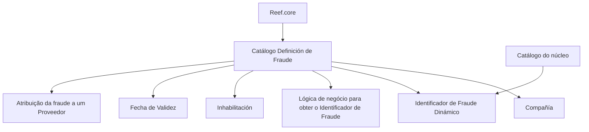

# Definição de Fraude no Reef.core — Catálogo de Configuração de Fraudes de Provedores

## 1. Metadados do Documento
- **Arquivo de Origem:** Não identificado no conteúdo fornecido
- **Tipo de Documento:** Especificação Técnica
- **Domínio / Sistema:** Reef.core — catálogo de definição de fraude para provedores
- **Público-Alvo:** Negócio, analistas funcionais, desenvolvedores e operação
- **Data/Versão Identificada:** Não identificada

---

## 2. Resumo Executivo & Contexto de Negócio

O documento descreve o catálogo **Definición de Fraude** do sistema **Reef.core**, destinado à configuração dos possíveis tipos de fraude cometidos por provedores. Segundo o conteúdo, esse catálogo é entregue inicialmente às instalações sem conteúdo configurado.

A definição de cada fraude é associada a uma companhia por meio do atributo **Compañía**. O catálogo também permite configurar o tipo de identificador de fraude dinâmico, de acordo com valores previamente configurados no catálogo do núcleo do sistema.

A propriedade **Lógica de negócio para obter o Identificador de Fraude** contém a lógica responsável por determinar o identificador dinâmico de fraude. Entretanto, o documento não especifica a linguagem, regras condicionais, algoritmos ou formatos usados nessa lógica.

O catálogo possui mecanismos para controlar a disponibilidade e a vigência temporal dos registros. A propriedade **Inhabilitación** indica que uma fraude está desativada para utilização em sua atribuição a um provedor. A propriedade **Fecha de Validez** determina a data a partir da qual a configuração torna-se operacional, permitindo manter histórico das alterações realizadas ao longo do tempo.

---

## 3. Arquitetura, Componentes & Tecnologias Envolvidas

Os elementos explicitamente identificados são:

- **Reef.core:** sistema que possui o catálogo para configurar possíveis fraudes cometidas por provedores.
- **Catálogo Definición de Fraude:** catálogo de informações para definição de fraudes.
- **Proveedores:** entidade à qual uma fraude pode ser atribuída.
- **Catálogo do núcleo:** origem dos valores configuráveis para o tipo de identificador de fraude dinâmico.
- **Compañía:** atributo que identifica o código da companhia sobre a qual a definição de fraude é realizada.
- **Home Solutions APIs Documentation Zeus:** texto presente no conteúdo bruto, sem explicação funcional ou técnica adicional.
- **CF:** texto presente no conteúdo bruto, sem definição contextual.



> **Nota de Análise:** o conteúdo não descreve interfaces, APIs, bancos de dados, métodos HTTP, contratos JSON, tecnologias de implantação ou integrações técnicas entre sistemas.

---

## 4. Regras de Negócio, Especificações Funcionais & Processos

### 4.1 Configuração inicial do catálogo

1. O Reef.core possui a possibilidade funcional de configurar possíveis fraudes cometidas por provedores.
2. As fraudes são configuradas em um catálogo de informações denominado **Definición de Fraude**.
3. O catálogo é entregue inicialmente às instalações vazio de conteúdo.
4. A ausência de conteúdo inicial implica que as definições de fraude devem ser configuradas para que possam ser utilizadas.

### 4.2 Associação da fraude à companhia

1. O atributo **Compañía** contém o código da companhia sobre a qual a definição de fraude está sendo realizada.
2. Cada definição de fraude deve estar contextualizada pela companhia indicada nesse atributo.
3. O documento não informa o formato, tamanho, domínio de valores ou origem do código de companhia.

### 4.3 Identificador de fraude dinâmico

1. A propriedade **Identificador de Fraude Dinámico** contempla o tipo de identificador de fraude dinâmico.
2. O tipo de identificador deve seguir os valores configurados no catálogo do núcleo.
3. A propriedade **Lógica de negócio para obter o Identificador de Fraude** contém a lógica que determinará o identificador de fraude dinâmico.
4. O documento não detalha os valores possíveis, a lógica de seleção, as condições de cálculo ou exemplos de identificadores.

### 4.4 Desativação da fraude

1. A propriedade **Inhabilitación** estabelece que uma fraude está desativada ou inabilitada.
2. Uma fraude inabilitada não pode ser utilizada na sua atribuição a um provedor.
3. O documento não define o valor técnico utilizado para representar a inabilitação, como booleano, código, flag ou estado.

### 4.5 Vigência e histórico

1. A propriedade **Fecha de Validez** informa ao sistema a data a partir da qual o registro configurado de fraude está operacional.
2. O uso correto da data de validade permite manter o histórico das alterações realizadas ao longo do tempo.
3. O documento não esclarece se existe data final de vigência, tratamento para datas retroativas ou regras para registros com vigências sobrepostas.

### 4.6 Documentos relacionados

O documento recomenda a leitura de diretrizes e documentos funcionais relacionados para evitar que a interpretação isolada do material leve a erro. O vínculo explicitamente indicado é:

- **Proveedores**

### 4.7 Pergunta frequente documentada

A pergunta sobre recomendações operacionais locais para codificação, uso e definição do catálogo de definição de fraude possui resposta **N/A**. Portanto, não há recomendação operacional adicional registrada no documento.

---

## 5. Tabelas de Parâmetros, Ambientes e Estruturas de Dados

| Item / Parâmetro | Descrição / Função | Tipo / Valores / Formato | Ambiente / Observações |
| :--- | :--- | :--- | :--- |
| Reef.core | Sistema que disponibiliza a configuração de possíveis fraudes cometidas por provedores. | Sistema | Não são descritas versão, ambiente ou tecnologia. |
| Catálogo Definición de Fraude | Catálogo de informações utilizado para configurar possíveis fraudes cometidas por provedores. | Catálogo | Entregue inicialmente vazio nas instalações. |
| Compañía | Contém o código da companhia sobre a qual a definição de fraude está sendo realizada. | Código de companhia; formato não informado | A origem e os valores permitidos não são detalhados. |
| Identificador de Fraude Dinámico | Contempla o tipo de identificador de fraude dinâmico. | Valores configurados no catálogo do núcleo | O documento não lista os valores disponíveis. |
| Lógica de negócio para obter o Identificador de Fraude | Lógica que determinará o identificador de fraude dinâmico. | Lógica de negócio; implementação não informada | Não há regras, exemplos ou linguagem de expressão. |
| Inhabilitación | Indica que a fraude está desativada ou inabilitada para uso na atribuição a um provedor. | Estado de inabilitação; representação não informada | Bloqueia o uso da fraude na atribuição a provedores. |
| Fecha de Validez | Indica a data a partir da qual o registro de fraude está operacional no sistema. | Data; formato não informado | Permite manter histórico de mudanças ao longo do tempo. |
| Proveedores | Documento funcional relacionado cuja leitura é recomendada. | Referência documental | O conteúdo do documento relacionado não foi fornecido. |
| Home Solutions APIs Documentation Zeus | Texto listado no conteúdo bruto. | Não identificado | Não há detalhamento do significado ou relação com o catálogo. |
| CF | Texto listado no conteúdo bruto. | Não identificado | Não há definição no material fornecido. |

---

## 6. Bateria de Perguntas & Respostas para RAG (FAQ Sintético)

### P1: Qual é o objetivo do catálogo Definición de Fraude no Reef.core?
**R:** O catálogo Definición de Fraude permite configurar os possíveis tipos de fraude cometidos por provedores no sistema Reef.core. O catálogo é entregue inicialmente sem conteúdo nas instalações.

### P2: O catálogo de definição de fraude já possui registros quando é instalado?
**R:** Não. O documento informa que o catálogo de informações para definição de fraude é entregue inicialmente às instalações vazio de conteúdo.

### P3: Qual é a função do atributo Compañía na definição de fraude?
**R:** O atributo Compañía contém o código da companhia sobre a qual está sendo realizada a definição da fraude. O documento não detalha o formato ou os valores permitidos para esse código.

### P4: Como é determinado o Identificador de Fraude Dinámico?
**R:** O tipo de identificador de fraude dinâmico segue os valores configurados no catálogo do núcleo. A propriedade denominada “Lógica de negócio para obter o Identificador de Fraude” contém a lógica que determinará esse identificador, mas o documento não descreve essa lógica em detalhes.

### P5: Quais valores podem ser utilizados no Identificador de Fraude Dinámico?
**R:** O documento estabelece apenas que os valores são configurados no catálogo do núcleo. Não há lista de valores, tipos de identificador ou exemplos no conteúdo fornecido.

### P6: O que acontece quando uma fraude está marcada com Inhabilitación?
**R:** A propriedade Inhabilitación estabelece que a fraude está desativada ou inabilitada. Uma fraude nesse estado não pode ser utilizada na sua atribuição a um provedor.

### P7: Para que serve a Fecha de Validez de uma fraude?
**R:** A Fecha de Validez informa ao sistema a data a partir da qual o registro configurado de fraude está operacional. O uso correto dessa propriedade permite manter um histórico das alterações realizadas ao longo do tempo.

### P8: O documento informa uma data final de validade para a configuração de fraude?
**R:** Não. O material descreve apenas a data a partir da qual o registro se torna operacional. Não há informação sobre data final de vigência, vigências sobrepostas ou regras para datas retroativas.

### P9: Quais documentos relacionados devem ser consultados para interpretar corretamente a definição de fraude?
**R:** O documento recomenda a leitura de diretrizes e documentos funcionais relacionados para evitar interpretação isolada incorreta. A referência explicitamente indicada é “Proveedores”.

### P10: Existem recomendações operacionais locais para codificação, uso ou definição do catálogo de fraude?
**R:** Não há recomendações adicionais documentadas. A resposta registrada para essa pergunta frequente é “N/A”.

### P11: O documento especifica APIs, métodos HTTP ou contratos JSON para o catálogo de fraude?
**R:** Não. O documento não apresenta APIs, métodos HTTP, contratos JSON, integrações técnicas ou detalhes de implementação relacionados ao catálogo Definición de Fraude.

---

## 7. Glossário de Termos, Siglas & Conceitos-Chave

- **Reef.core:** sistema que dispõe de um catálogo para configuração de possíveis fraudes cometidas por provedores.
- **Definición de Fraude:** catálogo de informações utilizado para configurar possíveis fraudes cometidas por provedores.
- **Compañía:** atributo que contém o código da companhia sobre a qual a definição de fraude é realizada.
- **Identificador de Fraude Dinámico:** propriedade que contempla o tipo de identificador de fraude dinâmico conforme valores configurados no catálogo do núcleo.
- **Inhabilitación:** propriedade que indica que uma fraude está desativada ou inabilitada para atribuição a um provedor.
- **Fecha de Validez:** propriedade que define a data a partir da qual uma configuração de fraude está operacional.
- **Proveedores:** referência a provedores e a um documento funcional relacionado.
- **CF:** termo presente no conteúdo, sem significado definido no documento.
- **Home Solutions APIs Documentation Zeus:** expressão presente no conteúdo, sem significado ou contexto explicado no documento.

---

## 8. Notas Críticas, Riscos & Limitações

- O catálogo é entregue inicialmente vazio; a disponibilidade funcional de definições de fraude depende de configuração posterior.
- O documento não detalha os valores aceitos pelo **Identificador de Fraude Dinámico**.
- O documento não especifica a lógica de negócio usada para calcular ou selecionar o identificador de fraude dinâmico.
- O formato do código de companhia não é informado.
- A representação técnica da propriedade **Inhabilitación** não é definida.
- Não há informação sobre data final de vigência, conflitos de vigência ou tratamento de alterações históricas.
- O documento recomenda consultar documentos funcionais relacionados, especialmente **Proveedores**, pois sua interpretação isolada pode conduzir a erro.
- Não há detalhes sobre APIs, integrações, persistência, segurança, auditoria, logs ou ambientes.
- Os termos **CF** e **Home Solutions APIs Documentation Zeus** aparecem no conteúdo bruto sem definição adicional.

---

## 9. Conteúdo Bruto Estruturado (Referência Fiel)

```text
--- [PÁGINA 1 DE 2] ---

DEFINICIÓN de FRAUDE
Objetivo
Funcionalmente, Reef.core cuenta con la posibilidad de configurar los posibles Fraudes cometidos
por los Proveedores en un catálogo de información que se entrega inicialmente a las instalaciones
vacío de contenido.
Propiedades Operativas
Otras Propiedades
Propiedades Operativas
Compañía
Este Atributo del catálogo contiene el código de la compañía sobre la que se está realizando la
definición del Fraude.
Identificador de Fraude Dinámico
Esta Propiedad del Catálogo contempla el Tipo de identificador del Fraude Dinámico de acuerdo con
los valores configurados en el catálogo del núcleo.
Lógica de negocio para obtener el Identificador de Fraude
Esta Propiedad contiene la Lógica que determinará el identificador de Fraude Dinámico.
 / 
 CF
Home Solutions APIs Documentation Zeus
EN


--- [PÁGINA 2 DE 2] ---

Otras Propiedades
Inhabilitación
Esta propiedad establece que el Fraude está desactivado o inhabilitado para poder ser utilizado en
su asignación a un Proveedor.
Fecha de Validez
Esta propiedad le indica al Sistema la fecha a partir de la cual el registro configurado del Fraude está
operativo en el sistema por lo que su correcto uso permite tener un histórico de los cambios
efectuados a lo largo del tiempo.
Vínculos
Relación de Directrices y Documentos funcionales cuya lectura recomendada para evitar que la
interpretación aislada del presente documento pueda conducir a error.
Proveedores
Preguntas frecuentes
(1) ¿Existe alguna recomendación operativa que deba ser tomada en consideración localmente en la
codificación, uso y definición del catálogo de Definición del Fraude?
N/A
```
