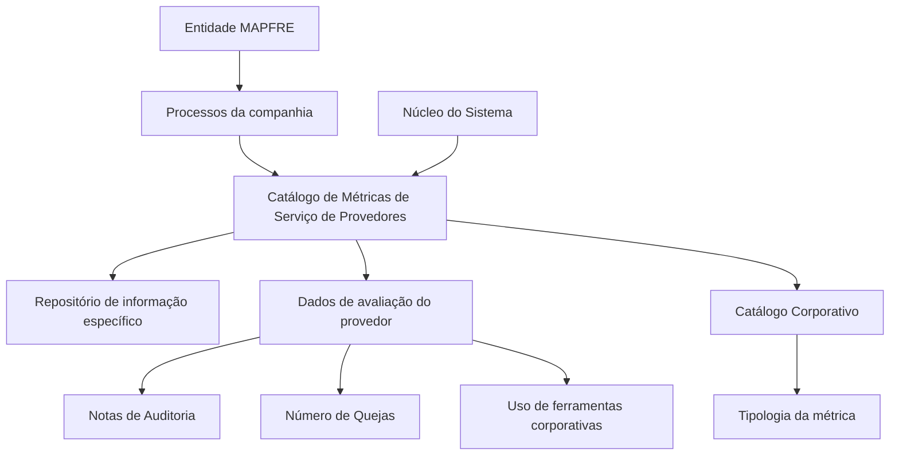

# Definição das Métricas de Serviço dos Provedores

## 1. Metadados do Documento
- **Arquivo de Origem:** Não identificado no conteúdo fornecido
- **Tipo de Documento:** Especificação Funcional
- **Domínio / Sistema:** Catálogo de Métricas de Serviço de Provedores — MAPFRE
- **Público-Alvo:** Negócio, Analistas Funcionais, Administradores de Catálogo e Operação
- **Data/Versão Identificada:** Não identificada

---

## 2. Resumo Executivo & Contexto de Negócio

O documento descreve a definição e a manutenção de um catálogo de Métricas de Serviço de Provedores no núcleo do sistema. Esse repositório de informação é entregue inicialmente sem conteúdo e deve ser configurado pela entidade MAPFRE para suportar a avaliação de provedores.

O catálogo permite registrar informações de avaliação, incluindo notas de auditoria, quantidade de reclamações e o uso ou não de ferramentas corporativas disponibilizadas pela MAPFRE. As métricas são configuradas com atributos de companhia, código de métrica, categoria/tipologia, idioma, descrição, objetivo, percentual objetivo, status de inabilitação e data de validade.

A configuração é multilíngue, pois cada métrica contém uma chave de idioma e uma descrição correspondente ao idioma utilizado na definição. O documento apresenta exemplos de métricas relacionadas a número de rejeições, tempo de espera, qualidade e uso de ferramentas corporativas.

Não existe uma recomendação ou preferência definida para padronizar a codificação das métricas no sistema. A própria entidade MAPFRE deve analisar a forma mais adequada de utilizar o catálogo em seus processos internos, visando à correta exploração posterior das informações registradas.

---

## 3. Arquitetura, Componentes & Tecnologias Envolvidas

O conteúdo não descreve tecnologias, protocolos, APIs, bancos de dados, ambientes, servidores ou microsserviços. A arquitetura funcional identificável é composta pelo núcleo do sistema, pelo catálogo de Métricas de Serviço de Provedores e pelos processos corporativos da entidade MAPFRE que utilizam as métricas configuradas.

Componentes e conceitos citados:

| Componente / Conceito | Papel identificado |
| :--- | :--- |
| Núcleo do Sistema | Disponibiliza a capacidade de codificar métricas de serviço dos provedores. |
| Repositório de informação | Repositório específico onde as métricas de serviço são configuradas. Inicialmente é entregue sem conteúdo. |
| Catálogo de Métricas de Serviço de Provedores | Estrutura de informação usada para definir métricas aplicáveis à avaliação de provedores. |
| Provedor | Entidade à qual as métricas podem ser atribuídas e aplicada a avaliação. |
| Entidade MAPFRE | Responsável por analisar a melhor forma de utilizar o catálogo em seus processos corporativos. |
| Catálogo Corporativo | Fonte dos valores configurados para a tipologia da métrica. |
| Serviços de Provedores | Documento funcional relacionado, recomendado para leitura. |
| Atividades dos Terceiros | Documento funcional relacionado, recomendado para leitura. |
| Tipologias de Provedores por Atividade | Documento funcional relacionado, recomendado para leitura. |



> **Nota de Análise:** O documento não detalha a implementação técnica do repositório, os mecanismos de integração, os métodos HTTP, contratos JSON, tecnologias utilizadas ou controles de acesso ao catálogo.

---

## 4. Regras de Negócio, Especificações Funcionais & Processos

### 4.1. Configuração inicial do catálogo

1. O núcleo do sistema possui capacidade para codificar Métricas de Serviço de Provedores.
2. As métricas são mantidas em um repositório de informação específico.
3. O repositório de informação é inicialmente entregue às instalações sem conteúdo.
4. A ausência de conteúdo inicial implica que a entidade responsável deve configurar o catálogo conforme a necessidade de seus processos.

### 4.2. Finalidade das métricas

As métricas permitem capturar dados de avaliação de um provedor. O documento cita explicitamente:

- Notas de Auditoria.
- Número de reclamações (`Quejas`).
- Indicação de utilização ou não de ferramentas corporativas disponibilizadas pela MAPFRE.

### 4.3. Regras para identificação e classificação

| Regra | Descrição |
| :--- | :--- |
| Companhia | A definição da categoria do provedor deve ser associada ao código da companhia sobre a qual a definição está sendo realizada. |
| Métrica | A configuração deve identificar o código ou a chave da métrica do provedor. |
| Categoria / Tipologia | A configuração referencia a categoria do provedor e especifica a tipologia da métrica conforme valores configurados no Catálogo Corporativo. |
| Idioma | A configuração deve conter a chave do idioma utilizado na definição da métrica de serviço do provedor. São citados como exemplos espanhol, inglês e turco. |
| Descrição da Métrica | A denominação ou descrição deve corresponder à categoria do provedor e ao idioma empregado na definição. |
| Objetivo da Métrica | O objetivo deve ser definido de acordo com a tipologia da métrica. |
| Porcentagem Objetivo | A porcentagem objetivo deve ser definida de acordo com a tipologia da métrica. |

### 4.4. Regras de estado e vigência

| Regra | Descrição |
| :--- | :--- |
| Inabilitação | Quando configurada, estabelece que a métrica está desativada ou inabilitada e não pode ser utilizada na sua atribuição a um provedor. |
| Data de Validade | Informa ao sistema a data a partir da qual o registro configurado está operativo. |
| Histórico | O uso correto da data de validade permite manter histórico das mudanças geográficas realizadas ao longo do tempo. |

> **Nota de Análise:** O documento vincula a data de validade ao histórico de “mudanças geográficas”, mas não esclarece como as mudanças geográficas se relacionam funcionalmente com as Métricas de Serviço de Provedores.

### 4.5. Codificação do catálogo

Não existe preferência nem recomendação para estabelecer ou padronizar a codificação das Métricas de Serviço de Provedores no sistema. A entidade MAPFRE deve analisar a melhor maneira de utilizar esse catálogo de informações nos processos da companhia, visando à correta exploração posterior.

---

## 5. Tabelas de Parâmetros, Ambientes e Estruturas de Dados

### 5.1. Atributos e propriedades da métrica

| Item / Parâmetro | Descrição / Função | Tipo / Valores / Formato | Ambiente / Observações |
| :--- | :--- | :--- | :--- |
| Companhia | Contém o código da companhia sobre a qual é realizada a definição da categoria do provedor. | Código da companhia; formato não detalhado. | Aplicável à definição da categoria do provedor. |
| Métrica | Determina o código ou a chave da métrica do provedor configurada no catálogo. | Código ou chave; formato não detalhado. | Campo de identificação da métrica. |
| Tipologia | Especifica a tipologia da métrica segundo valores configurados no Catálogo Corporativo. | Valores do Catálogo Corporativo; valores específicos não detalhados. | O texto também menciona “código ou chave da Categoria do Provedor”; a redação apresenta ambiguidade. |
| Idioma | Contém a chave do idioma empregado na configuração da métrica de serviço do provedor. | Exemplos: espanhol, inglês, turco. | Suporta descrições configuradas por idioma. |
| Descrição da Métrica | Contém a denominação ou descrição da categoria do provedor conforme o idioma definido. | Texto descritivo. | Deve corresponder ao idioma da definição. |
| Objetivo da Métrica | Contém o objetivo da métrica do provedor conforme sua tipologia. | Valor não detalhado. | Dependente da tipologia. |
| Porcentagem Objetivo | Contém o percentual objetivo da métrica do provedor conforme sua tipologia. | Percentual; escala e formato não detalhados. | Dependente da tipologia. |
| Inabilitação | Indica que a métrica definida está desativada ou inabilitada. | Estado habilitada/inabilitada; codificação não detalhada. | Métrica inabilitada não pode ser usada na atribuição a um provedor. |
| Data de Validade | Indica a data a partir da qual o registro está operativo no sistema. | Data; formato não detalhado. | Permite manter histórico de mudanças geográficas ao longo do tempo. |

### 5.2. Exemplos de métricas apresentados

| Métrica | Tipo | Descrição | Observações |
| :--- | :--- | :--- | :--- |
| R01 | P | NÚMERO DE RECHAZOS | Exemplo apresentado para idioma espanhol. |
| T02 | H | TIEMPO DE ESPERA | Exemplo apresentado para idioma espanhol. |
| C01 | P | CALIDAD | Exemplo apresentado para idioma espanhol. |
| H01 | C | USO HERRAMIENTAS CORP. | Exemplo apresentado para idioma espanhol. |

> **Nota de Análise:** O documento apresenta os códigos de tipo `P`, `H` e `C`, mas não define seus significados.

### 5.3. Ambientes, rotas, URLs e logs

| Item / Parâmetro | Descrição / Função | Tipo / Valores / Formato | Ambiente / Observações |
| :--- | :--- | :--- | :--- |
| Ambientes | Não identificados. | Não aplicável. | O documento não fornece ambientes de desenvolvimento, homologação ou produção. |
| URLs | Não identificadas. | Não aplicável. | Os termos “Home Solutions APIs Documentation Zeus” aparecem no conteúdo bruto, sem contexto funcional suficiente para caracterizá-los como URLs ou sistemas integrados. |
| Rotas de log | Não identificadas. | Não aplicável. | O documento não descreve logging, auditoria técnica ou caminhos de arquivos. |
| Servidores | Não identificados. | Não aplicável. | O documento não apresenta hosts, portas ou infraestrutura. |

---

## 6. Bateria de Perguntas & Respostas para RAG (FAQ Sintético)

### P1: Qual é a finalidade do catálogo de Métricas de Serviço de Provedores?
**R:** O catálogo de Métricas de Serviço de Provedores permite configurar métricas em um repositório específico do núcleo do sistema para suportar a captura de dados de avaliação de provedores. Entre os dados explicitamente citados estão notas de auditoria, número de reclamações e utilização ou não de ferramentas corporativas disponibilizadas pela MAPFRE.

### P2: O repositório de Métricas de Serviço de Provedores já possui conteúdo na instalação inicial?
**R:** Não. O documento informa que o repositório específico de informação é entregue inicialmente às instalações vazio de conteúdo. Portanto, as métricas devem ser codificadas ou configuradas posteriormente conforme a necessidade da entidade MAPFRE.

### P3: Quais dados de avaliação de um provedor podem ser capturados pelo catálogo?
**R:** O documento cita como dados de avaliação as notas de auditoria, o número de reclamações e a indicação de uso ou não de ferramentas corporativas disponibilizadas pela MAPFRE. O conteúdo não fornece uma lista exaustiva de outros dados avaliativos.

### P4: Qual é a função do atributo Companhia na definição das métricas?
**R:** O atributo Companhia contém o código da companhia sobre a qual está sendo realizada a definição da categoria do provedor. O formato do código e as regras de validação desse atributo não são detalhados.

### P5: Como a tipologia de uma métrica de serviço é determinada?
**R:** A tipologia da métrica é especificada de acordo com os valores configurados no Catálogo Corporativo. O documento não define os valores permitidos, as descrições dos tipos ou as regras de associação entre tipologia e métrica.

### P6: Como o idioma é usado na configuração de uma Métrica de Serviço de Provedor?
**R:** O atributo Idioma contém a chave do idioma utilizada na configuração da métrica. O documento fornece espanhol, inglês e turco como exemplos. A descrição da métrica deve corresponder ao idioma utilizado na definição.

### P7: O que acontece quando uma métrica é marcada como inabilitada?
**R:** Uma métrica marcada como inabilitada está desativada e não pode ser utilizada na sua atribuição a um provedor. O documento não detalha se métricas já atribuídas são afetadas quando ocorre a inabilitação.

### P8: Qual é a função da Data de Validade de uma métrica?
**R:** A Data de Validade indica a partir de qual data o registro configurado passa a estar operativo no sistema. Segundo o documento, o uso correto dessa data permite manter histórico das mudanças geográficas efetuadas ao longo do tempo.

### P9: Existem regras corporativas para padronizar os códigos das métricas?
**R:** Não. O documento afirma que não existe preferência ou recomendação para estabelecer ou padronizar a codificação no sistema. A entidade MAPFRE deve analisar a melhor maneira de utilizar o catálogo em seus processos para possibilitar sua exploração posterior.

### P10: Quais exemplos de métricas são apresentados no documento?
**R:** O documento apresenta, em espanhol, as métricas `R01 — P — NÚMERO DE RECHAZOS`, `T02 — H — TIEMPO DE ESPERA`, `C01 — P — CALIDAD` e `H01 — C — USO HERRAMIENTAS CORP.`. Os significados dos códigos de tipo `P`, `H` e `C` não são especificados.

### P11: Quais documentos funcionais devem ser consultados para evitar interpretação isolada?
**R:** O documento recomenda a leitura de “Servicios de Proveedores”, “Actividades de los Terceros” e “Tipologías de Proveedores por Actividad”. Esses vínculos são indicados para evitar que a interpretação isolada do documento atual conduza a erro.

---

## 7. Glossário de Termos, Siglas & Conceitos-Chave

- **MAPFRE:** Entidade corporativa mencionada como responsável por analisar a melhor forma de utilizar o catálogo nos processos da companhia.
- **Métrica de Serviço de Provedor:** Elemento configurável usado para apoiar a avaliação de um provedor.
- **Provedor:** Entidade sujeita à atribuição e avaliação por métricas de serviço.
- **Catálogo Corporativo:** Catálogo que contém os valores usados para configurar a tipologia da métrica.
- **Tipologia:** Classificação da métrica conforme valores configurados no Catálogo Corporativo.
- **Inabilitação:** Propriedade que torna uma métrica desativada e impede seu uso na atribuição a um provedor.
- **Data de Validade:** Data a partir da qual um registro configurado se torna operativo no sistema.
- **Quejas:** Termo em espanhol para reclamações.
- **R01, T02, C01, H01:** Códigos de métricas apresentados como exemplos.
- **P, H, C:** Códigos de tipo apresentados nos exemplos de métricas; seus significados não são definidos no documento.

---

## 8. Notas Críticas, Riscos & Limitações

- O documento não identifica o arquivo de origem, data, versão, autor, proprietário funcional ou ciclo de aprovação.
- Não há detalhamento técnico sobre banco de dados, interfaces, APIs, integrações, autenticação, autorização, logs, trilhas de auditoria, URLs, infraestrutura ou ambientes.
- A redação do atributo “Tipología” é ambígua: o texto menciona tanto a chave/código da Categoria do Provedor quanto a tipologia da métrica.
- Os códigos de tipo `P`, `H` e `C` são exibidos em exemplos, mas não são definidos.
- Não são detalhados os formatos, campos obrigatórios, regras de unicidade, limites, validações ou comportamento de atualização dos atributos.
- Não está definido como uma métrica inabilitada afeta atribuições existentes a provedores.
- A relação entre Data de Validade e histórico de mudanças geográficas é mencionada, mas não explicada.
- A inexistência de recomendação de padronização para a codificação das métricas pode gerar divergências entre entidades ou processos da MAPFRE.
- A leitura dos documentos vinculados é recomendada explicitamente para evitar interpretações equivocadas do conteúdo isolado.

---

## 9. Conteúdo Bruto Estruturado (Referência Fiel)

```text
--- [PÁGINA 1 DE 3] ---

DEFINICIÓN de las MÉTRICAS de SERVICIO de
los PROVEEDORES
Objetivo
Funcionalmente, el núcleo del Sistema cuenta con la posibilidad de codificar las Métricas de Servicio
de los Proveedores en un repositorio de información específico que se entrega inicialmente a las
instalaciones vacío de contenido.
De esta manera se posibilita la captura de los datos de Evaluación de un proveedor, en particular los
correspondientes a las notas de Auditoría, el número de Quejas, si utiliza o no herramientas
Corporativas dispuestas por MAPFRE …
Propiedades
Otras Propiedades
Propiedades
Compañía
Este Atributo del catálogo contiene el código de la compañía sobre la que se está realizando la
definición de la Categoría del Proveedor.
Métrica
Este Atributo determina el código o clave de la Métrica del Proveedor que se está configurando en el
catálogo.
 / 
 CF
Home Solutions APIs Documentation Zeus
EN


--- [PÁGINA 2 DE 3] ---

Tipología
Este Atributo determina el T o clave de la Categoría del Proveedor que se está configurando en el
catálogo.
Este Atributo especifica la tipología de la métrica de acuerdo con los valores que estén configurados
en el catálogo Corporativo.
Idioma
Este Atributo contiene la clave del Idioma empleado en la configuración de la Métrica del Servicio del
Proveedor como por ejemplo: español, inglés, turco, ...
Descripción de la Métrica
Esta propiedad contiene la denominación o descripción de la Categoría del Proveedor de acuerdo
con el idioma utilizado en la definición.
A modo de ejemplo y si el idioma de la definición es el español...
MÉTRICA TIPO DESCRIPCIÓN
R01 P NÚMERO DE RECHAZOS
T02 H TIEMPO DE ESPERA
C01 P CALIDAD
H01 C USO HERRAMIENTAS CORP.
Objetivo de la Métrica
Esta propiedad contiene el Objetivo de la Métrica del Proveedor de acuerdo con su tipología.
Porcentaje Objetivo
Esta propiedad contiene el Porcentaje Objetivo de la Métrica del Proveedor de acuerdo con su
tipología.
Otras Propiedades
Inhabilitación


--- [PÁGINA 3 DE 3] ---

Esta propiedad establece que la métrica definida está desactivada o inhabilitada para poder ser
empleada en su asignación a un Proveedor.
Fecha de Validez
Esta propiedad le indica al Sistema la fecha a partir de la cual el registro configurado está operativo
en el sistema por lo que su correcto uso permite tener un histórico de los cambios geográficos
efectuados a lo largo del tiempo.
Vínculos
Relación de Directrices y Documentos funcionales cuya lectura recomendada para evitar que la
interpretación aislada del presente documento pueda conducir a error.
Servicios de Proveedores
Actividades de los Terceros
Tipologías de Proveedores por Actividad
Preguntas frecuentes
(1) ¿Existe alguna recomendación operativa que deba ser tomada en consideración localmente en la
codificación, uso y definición del catálogo de Métricas de Servicio de los Proveedores?
No existe una preferencia ni recomendación para establecer o estandarizar en el sistema su
codificación, si bien la entidad MAPFRE debe analizar la mejor manera de utilizar en los procesos de
la compañía este catálogo de información para su correcta y posterior explotación.
```
