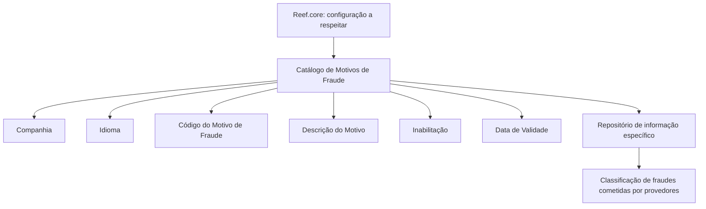

# Definição dos Motivos de Fraude para Provedores

## 1. Metadados do Documento
- **Arquivo de Origem:** `Não identificado`
- **Tipo de Documento:** Especificação Funcional
- **Domínio / Sistema:** Catálogo de Motivos de Fraude para Provedores; Reef.core
- **Público-Alvo:** Não identificado
- **Data/Versão Identificada:** Não identificada

---

## 2. Resumo Executivo & Contexto de Negócio

O documento descreve a configuração de um catálogo específico para classificar os motivos de fraudes cometidas por provedores. Funcionalmente, o núcleo do sistema permite manter esses motivos em um repositório de informação dedicado.

Cada registro de motivo de fraude é contextualizado pela companhia e pelo idioma empregado na configuração. O registro também possui um código identificador e uma descrição associada ao idioma selecionado.

A especificação apresenta exemplos de códigos e descrições em espanhol, incluindo motivos como documentos apócrifos, fraude interno, danos preexistentes e delinquência organizada. Esses exemplos demonstram que o catálogo é destinado a padronizar a classificação operacional de eventos de fraude.

O catálogo possui mecanismos para inabilitar registros e controlar a data a partir da qual um registro está operacional. A data de validade permite preservar um histórico das alterações realizadas ao longo do tempo.

A orientação operacional explícita é respeitar a configuração realizada a partir de `Reef.core`. O documento também referencia o tema de provedores como leitura relacionada para prevenir interpretações isoladas ou incorretas.

---

## 3. Arquitetura, Componentes & Tecnologias Envolvidas

### Componentes e conceitos identificados

| Componente / Conceito | Papel identificado no documento |
| :--- | :--- |
| Sistema núcleo | Possui a capacidade funcional de classificar motivos de fraude. |
| Repositório de informação específico | Armazena a configuração e a classificação dos motivos de fraude. |
| Catálogo de Motivos de Fraude | Estrutura configurável contendo os registros de motivos de fraude de provedores. |
| Companhia | Atributo que informa o código da companhia para a qual o motivo de fraude está sendo definido. |
| Idioma | Propriedade que define o idioma utilizado na configuração do motivo de fraude. |
| Reef.core | Origem cuja configuração deve ser respeitada na codificação, uso e definição do catálogo. |
| Provedores | Contexto funcional relacionado aos motivos de fraude documentados. |



> **Nota de Análise:** O documento não detalha tecnologias, bancos de dados, APIs, métodos HTTP, contratos JSON, servidores, URLs, integrações técnicas ou mecanismos de persistência do catálogo.

---

## 4. Regras de Negócio, Especificações Funcionais & Processos

### Finalidade funcional

1. O núcleo do sistema permite classificar motivos de fraudes.
2. A classificação é mantida em um repositório de informação específico.
3. O catálogo se aplica a motivos de fraudes cometidas por provedores.

### Propriedades operativas do catálogo

1. **Companhia**
   - Contém o código da companhia sobre a qual está sendo realizada a definição dos motivos de fraude.

2. **Idioma**
   - Contém a chave do idioma utilizada na configuração dos motivos de fraude cometidos por provedores.
   - O documento cita como exemplos de idioma: espanhol, inglês e português.

3. **Código do Motivo de Fraude**
   - Identifica a chave ou o código do motivo de fraude.

4. **Descrição**
   - Identifica a descrição do motivo de fraude cometido pelo provedor.
   - A descrição deve corresponder ao idioma usado na definição do registro.

### Outras propriedades

1. **Inabilitação**
   - Define que o registro configurado está desativado ou inabilitado para utilização.

2. **Data de Validade**
   - Indica a data a partir da qual o registro configurado está operacional no sistema.
   - O uso correto da data de validade permite manter um histórico das mudanças efetuadas ao longo do tempo.

### Diretriz operacional

- A codificação, o uso e a definição do catálogo de motivos de fraude para provedores devem respeitar a configuração realizada a partir de `Reef.core`.

### Leitura relacionada

- O documento indica que diretrizes e documentos funcionais relacionados a **Provedores** devem ser considerados para evitar que a interpretação isolada desta especificação conduza a erro.

---

## 5. Tabelas de Parâmetros, Ambientes e Estruturas de Dados

### Estrutura funcional do registro de motivo de fraude

| Item / Parâmetro | Descrição / Função | Tipo / Valores / Formato | Ambiente / Observações |
| :--- | :--- | :--- | :--- |
| Companhia | Código da companhia para a qual a definição do motivo de fraude é realizada. | Código de companhia; formato não detalhado. | Aplicável à configuração do catálogo. |
| Idioma | Chave do idioma usado para configurar o motivo de fraude. | Exemplos citados: espanhol, inglês, português. | A descrição do motivo é associada ao idioma configurado. |
| Código do Motivo de Fraude | Chave ou código que identifica o motivo de fraude. | Código; formato não detalhado. | Exemplos documentados: `APD`, `CIO`, `CSD`, `DPR`, `DRC`, `DUC`, `EPR`, `FRI`, `HAI`, `NCD`, `ORC`, `RMS`. |
| Descrição | Descrição do motivo de fraude cometido pelo provedor conforme o idioma definido. | Texto. | O documento apresenta exemplos em espanhol. |
| Inabilitação | Determina que o registro está desativado ou inabilitado para uso. | Estado de inabilitação; valores não detalhados. | Aplicável ao registro configurado. |
| Data de Validade | Data a partir da qual o registro está operacional no sistema. | Data; formato não detalhado. | Permite manter histórico de alterações ao longo do tempo. |

### Exemplos de motivos de fraude em espanhol

| Código do Motivo | Descrição em espanhol |
| :--- | :--- |
| APD | Documentos Apócrifos |
| CIO | Reclamo Lesiones Fuera Accidente |
| CSD | Reclamo Mismos Daños |
| DPR | Daños Preexistentes |
| DRC | Cambio Conductor |
| DUC | Uso Diverso al Contratado |
| EPR | Expediente Procedente |
| FRI | Fraude Interno |
| HAI | Accidente Alto Impacto sin Lesiones |
| NCD | Daños no Correspondientes |
| ORC | Delincuencia Organizada |
| RMS | Reclama Monto Superior al Autorizado |

### Ambientes, rotas e integrações

| Item / Parâmetro | Descrição / Função | Tipo / Valores / Formato | Ambiente / Observações |
| :--- | :--- | :--- | :--- |
| Ambiente | Não identificado. | Não identificado. | O documento não informa ambientes de desenvolvimento, homologação ou produção. |
| URL | Não identificada. | Não identificado. | O texto menciona “Home Solutions APIs Documentation Zeus”, sem fornecer URL ou detalhamento técnico. |
| Logs | Não identificados. | Não identificado. | O documento não informa caminhos, variáveis ou políticas de logs. |
| API / Integração | Não detalhada. | Não identificado. | Não há métodos, endpoints ou contratos expostos. |

---

## 6. Bateria de Perguntas & Respostas para RAG (FAQ Sintético)

### P1: Qual é o objetivo do catálogo de Motivos de Fraude para Provedores?
**R:** O catálogo permite que o núcleo do sistema classifique os motivos de fraudes cometidas por provedores em um repositório de informação específico.

### P2: Qual atributo identifica a companhia associada à definição de um motivo de fraude?
**R:** O atributo **Companhia** contém o código da companhia sobre a qual está sendo realizada a definição dos motivos de fraude.

### P3: Para que serve a propriedade Idioma no catálogo de motivos de fraude?
**R:** A propriedade **Idioma** contém a chave do idioma utilizada na configuração dos motivos de fraude cometidos por provedores. O documento cita espanhol, inglês e português como exemplos.

### P4: Como um motivo de fraude é identificado no catálogo?
**R:** Um motivo de fraude é identificado pelo campo **Código do Motivo de Fraude**, que representa a chave ou o código do motivo configurado.

### P5: Como a descrição de um motivo de fraude deve ser definida?
**R:** A descrição identifica o motivo de fraude cometido pelo provedor e deve ser definida de acordo com o idioma usado na configuração do registro.

### P6: O que significa a propriedade Inabilitação?
**R:** A propriedade **Inabilitação** estabelece que o registro configurado está desativado ou inabilitado para ser utilizado.

### P7: Qual é a finalidade da Data de Validade de um registro?
**R:** A **Data de Validade** informa a data a partir da qual o registro configurado está operacional no sistema. Seu uso correto permite manter um histórico das mudanças efetuadas ao longo do tempo.

### P8: Qual orientação deve ser seguida para codificar e usar o catálogo de motivos de fraude?
**R:** Deve-se respeitar a configuração realizada a partir de `Reef.core` ao codificar, usar e definir o catálogo de motivos de fraude para provedores.

### P9: Qual código representa “Fraude Interno” no exemplo apresentado?
**R:** O código `FRI` representa o motivo **Fraude Interno**.

### P10: Qual código representa “Daños Preexistentes” no exemplo apresentado?
**R:** O código `DPR` representa o motivo **Daños Preexistentes**.

### P11: Quais documentos ou diretrizes relacionadas devem ser considerados ao interpretar esta especificação?
**R:** O documento recomenda considerar as diretrizes e documentos funcionais relacionados a **Provedores**, para evitar erros decorrentes da interpretação isolada da especificação.

### P12: O documento detalha APIs, métodos HTTP ou contratos de integração do catálogo?
**R:** Não. O documento descreve propriedades funcionais do catálogo, mas não detalha APIs, métodos HTTP, endpoints, contratos JSON, tecnologias de implementação ou integrações técnicas.

---

## 7. Glossário de Termos, Siglas & Conceitos-Chave

- **APD:** Código de motivo de fraude correspondente a **Documentos Apócrifos**.
- **CIO:** Código de motivo de fraude correspondente a **Reclamo Lesiones Fuera Accidente**.
- **CSD:** Código de motivo de fraude correspondente a **Reclamo Mismos Daños**.
- **DPR:** Código de motivo de fraude correspondente a **Daños Preexistentes**.
- **DRC:** Código de motivo de fraude correspondente a **Cambio Conductor**.
- **DUC:** Código de motivo de fraude correspondente a **Uso Diverso al Contratado**.
- **EPR:** Código de motivo de fraude correspondente a **Expediente Procedente**.
- **FRI:** Código de motivo de fraude correspondente a **Fraude Interno**.
- **HAI:** Código de motivo de fraude correspondente a **Accidente Alto Impacto sin Lesiones**.
- **NCD:** Código de motivo de fraude correspondente a **Daños no Correspondientes**.
- **ORC:** Código de motivo de fraude correspondente a **Delincuencia Organizada**.
- **RMS:** Código de motivo de fraude correspondente a **Reclama Monto Superior al Autorizado**.
- **Motivo de Fraude:** Classificação configurável para uma fraude cometida por um provedor.
- **Provedor:** Entidade no contexto das fraudes tratadas pelo catálogo.
- **Reef.core:** Origem de configuração que deve ser respeitada para a codificação, o uso e a definição do catálogo.
- **Data de Validade:** Data a partir da qual um registro configurado torna-se operacional no sistema.
- **Inabilitação:** Estado que define que um registro configurado está desativado ou não pode ser utilizado.

---

## 8. Notas Críticas, Riscos & Limitações

- O documento não informa o nome do arquivo de origem, data, versão, autor ou responsável pelo conteúdo.
- O documento não detalha tecnologias, arquitetura física, banco de dados, APIs, endpoints, autenticação, autorização ou contratos de integração.
- O documento não define formato, tamanho, obrigatoriedade ou regras de unicidade para os campos Companhia, Idioma, Código do Motivo de Fraude, Descrição e Data de Validade.
- Não são especificados os valores possíveis, o comportamento operacional ou o mecanismo técnico da propriedade Inabilitação.
- Não há detalhamento sobre como o histórico de alterações é armazenado ou consultado; o texto somente afirma que a data de validade permite manter o histórico ao longo do tempo.
- A referência a `Reef.core` é normativa, mas o documento não detalha como essa configuração é consumida, sincronizada ou validada.
- A interpretação isolada do documento pode conduzir a erro; o próprio texto recomenda a leitura das diretrizes e documentos funcionais relacionados a Provedores.

---

## 9. Conteúdo Bruto Estruturado (Referência Fiel)

```text
--- [PÁGINA 1 DE 3] ---

DEFINICIÓN de los MOTIVOS de los FRAUDES
Objetivo
Funcionalmente, el núcleo del Sistema cuenta con la posibilidad de clasificar los Motivos de los
Fraudes en un repositorio de información específico.
Propiedades Operativas
Otras Propiedades
Propiedades Operativas
Compañía
Este Atributo del catálogo contiene el código de la compañía sobre la que se está realizando la
definición de los Motivos de los Fraudes.
Idioma
Esta propiedad contiene la clave del Idioma empleado en la configuración de los Motivos de los
Fraudes cometidos por los Proveedores como por ejemplo: español, inglés, Portugués, ...
Código del Motivo del Fraude
Este campo identifica la clave o el código del Motivo del Fraude.
Descripción
 / 
 CF
Home Solutions APIs Documentation Zeus
EN


--- [PÁGINA 2 DE 3] ---

Este Atributo del catálogo de configuración identifica la descripción del Motivo del Fraude cometido
por el Proveedor de acuerdo con el idioma utilizado en su definición.
A modo de ejemplo y si el idioma empleado en la definición fuera el Español...
MOTIVO DESCRIPCIÓN
APD Documentos Apócrifos
CIO Reclamo Lesiones Fuera Accidente
CSD Reclamo Mismos Daños
DPR Daños Preexistentes
DRC Cambio Conductor
DUC Uso Diverso al Contratado
EPR Expediente Procedente
FRI Fraude Interno
HAI Accidente Alto Impacto sin Lesiones
NCD Daños no Correspondientes
ORC Delincuencia Organizada
RMS Reclama Monto Superior al Autorizado
Otras Propiedades
Inhabilitación
Esta propiedad establece que el Registro configurado está desactivado o inhabilitado para ser
utilizado.
Fecha de Validez


--- [PÁGINA 3 DE 3] ---

Esta propiedad le indica al Sistema la fecha a partir de la cual el registro configurado está operativo
en el sistema por lo que su correcto uso permite tener un histórico de los cambios efectuados a lo
largo del tiempo.
Vínculos
Relación de Directrices y Documentos funcionales cuya lectura recomendada para evitar que la
interpretación aislada del presente documento pueda conducir a error.
Proveedores
Preguntas frecuentes
(1) ¿Existe alguna recomendación operativa que deba ser tomada en consideración localmente en la
codificación, uso y definición del catálogo de Motivos de los Fraudes para los Proveedores?
Se debe respetar la configuración realizada desde Reef.core
```
