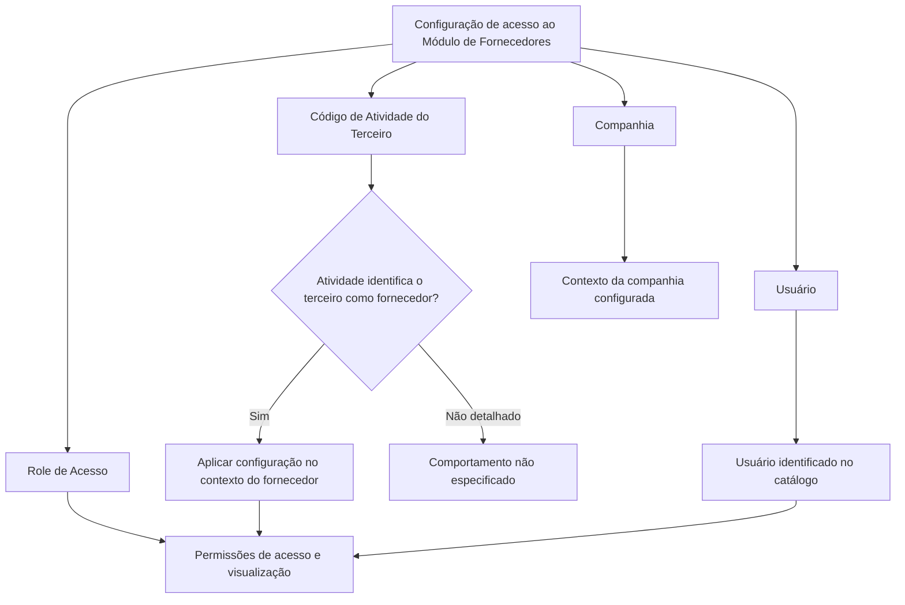

# Configuração de Roles de Acesso de Fornecedores no Sistema

## 1. Metadados do Documento
- **Arquivo de Origem:** `Não informado`
- **Tipo de Documento:** Especificação Funcional
- **Domínio / Sistema:** Módulo de Fornecedores, Sistema de Segurança e gestão de acessos da entidade MAPFRE
- **Público-Alvo:** Analistas funcionais, administradores de segurança, operação e equipes responsáveis por processos de fornecedores
- **Data/Versão Identificada:** Não identificada

---

## 2. Resumo Executivo & Contexto de Negócio

O documento descreve a configuração de acesso ao Módulo de Fornecedores no Sistema. A funcionalidade permite determinar quais usuários podem acessar o módulo e qual role de acesso será atribuído a cada usuário configurado.

A configuração é contextualizada por companhia e pelo código de atividade do terceiro. O código de atividade deve identificar o terceiro como fornecedor para que a configuração seja aplicável no contexto do Módulo de Fornecedores.

O role atribuído ao usuário determina as permissões de acesso e de visualização de informações. Portanto, o catálogo de configuração funciona como mecanismo de controle de acesso funcional para informações e operações relacionadas a fornecedores.

O documento recomenda a leitura conjunta das diretrizes e documentos funcionais vinculados, especificamente **Atividades dos Terceiros** e **Sistema de Segurança**, para evitar interpretações isoladas ou incorretas. Não há recomendação ou preferência formal para a codificação ou padronização dos roles; entretanto, a entidade MAPFRE deve avaliar o uso transversal desse catálogo nos processos corporativos para permitir exploração posterior adequada das informações.

---

## 3. Arquitetura, Componentes & Tecnologias Envolvidas

O documento não especifica arquitetura técnica, microsserviços, métodos HTTP, contratos de integração, banco de dados, ambientes, URLs, tecnologias de implementação ou mecanismos técnicos de autenticação.

Os componentes funcionais explicitamente citados são:

- **Sistema:** sistema que contém o Módulo de Fornecedores e o catálogo de configuração de acessos.
- **Módulo de Fornecedores:** módulo cujo acesso é controlado por usuário e role.
- **Catálogo de configuração:** catálogo que registra companhia, código de atividade do terceiro, usuário e role de acesso.
- **Sistema de Segurança:** documento ou sistema vinculado recomendado para leitura complementar.
- **Atividades dos Terceiros:** diretriz ou documento funcional vinculado.
- **Entidade MAPFRE:** entidade que deve analisar a conveniência de uso transversal do catálogo.



> **Nota de Análise:** O documento descreve um fluxo funcional de configuração de acesso, mas não detalha telas, APIs, persistência de dados, critérios de autorização técnica ou comportamento para códigos de atividade que não identifiquem o terceiro como fornecedor.

---

## 4. Regras de Negócio, Especificações Funcionais & Processos

### 4.1 Objetivo da configuração

O núcleo funcional do Sistema permite configurar:

1. Quais usuários podem acessar o Módulo de Fornecedores.
2. Qual role de acesso é atribuído a cada usuário.
3. Quais permissões de acesso e visualização decorrem do role atribuído.

### 4.2 Propriedades do catálogo de configuração

A configuração de acesso ao Módulo de Fornecedores contém as seguintes propriedades:

1. **Companhia**
   - Contém o código da companhia sobre a qual a configuração de acesso ao módulo está sendo realizada.
   - A companhia define o contexto organizacional da configuração.

2. **Código de Atividade do Terceiro**
   - Estabelece no Sistema o código da atividade do terceiro-fornecedor.
   - A propriedade é aplicável quando a atividade do terceiro o identifica como fornecedor.

3. **Usuário**
   - Identifica o usuário no catálogo de configuração.

4. **Role de Acesso**
   - Determina o role atribuído ao usuário.
   - O role determina as permissões de acesso e de visualização de informações.

### 4.3 Fluxo funcional identificado

1. A configuração é realizada para uma companhia identificada por código.
2. É informado o código de atividade do terceiro.
3. O código de atividade deve identificar o terceiro como fornecedor.
4. É identificado o usuário que será configurado no catálogo.
5. É atribuído um role de acesso ao usuário.
6. O role atribuído determina as permissões de acesso e visualização de informações no Módulo de Fornecedores.

### 4.4 Diretrizes de interpretação

- A leitura isolada do documento pode conduzir a erro de interpretação.
- Devem ser consultados os documentos ou diretrizes vinculados:
  - **Atividades dos Terceiros**
  - **Sistema de Segurança**
- Não existe preferência ou recomendação para estabelecer ou padronizar a codificação dos roles no Sistema.
- A entidade MAPFRE deve analisar a conveniência de usar o catálogo de forma transversal nos processos corporativos, visando correta exploração posterior das informações.

---

## 5. Tabelas de Parâmetros, Ambientes e Estruturas de Dados

| Item / Parâmetro | Descrição / Função | Tipo / Valores / Formato | Ambiente / Observações |
| :--- | :--- | :--- | :--- |
| Companhia | Contém o código da companhia para a qual a configuração de acesso ao Módulo de Fornecedores é realizada. | Código de companhia; formato não especificado. | Define o contexto organizacional da configuração. |
| Código de Atividade do Terceiro | Estabelece o código da atividade do terceiro-fornecedor no Sistema. | Código de atividade; formato não especificado. | Aplicável quando a atividade identifica o terceiro como fornecedor. |
| Usuário | Identifica o usuário no catálogo de configuração. | Identificador de usuário; formato não especificado. | Usuário ao qual será atribuído um role de acesso. |
| Role de Acesso | Determina o role atribuído ao usuário. | Role; valores permitidos não especificados. | Determina permissões de acesso e visualização de informações. |
| Módulo de Fornecedores | Módulo cujo acesso é configurado por usuário e role. | Componente funcional do Sistema. | Métodos, operações e telas não especificados. |
| Atividades dos Terceiros | Documento ou diretriz funcional relacionada. | Referência documental. | Leitura recomendada para interpretação correta. |
| Sistema de Segurança | Documento ou sistema relacionado ao controle de acesso. | Referência documental ou funcional. | Leitura recomendada para interpretação correta. |
| Codificação de roles | Forma de codificar ou padronizar roles no Sistema. | Não especificado. | Não há preferência nem recomendação formal de padronização. |
| Uso transversal do catálogo | Utilização do catálogo em processos corporativos da MAPFRE. | Decisão de análise corporativa. | Deve ser analisada pela entidade MAPFRE para exploração posterior das informações. |

---

## 6. Bateria de Perguntas & Respostas para RAG (FAQ Sintético)

### P1: Qual é o objetivo da configuração de roles de acesso de fornecedores?
**R:** O objetivo é configurar quais usuários podem acessar o Módulo de Fornecedores no Sistema e qual role será atribuído a cada usuário. O role atribuído determina as permissões de acesso e de visualização de informações.

### P2: Qual propriedade identifica a companhia para a qual a configuração de acesso é realizada?
**R:** A propriedade **Companhia** contém o código da companhia sobre a qual a configuração de acesso ao Módulo de Fornecedores está sendo realizada.

### P3: Quando o Código de Atividade do Terceiro é aplicável à configuração?
**R:** O Código de Atividade do Terceiro estabelece o código da atividade do terceiro-fornecedor no Sistema, desde que a atividade do terceiro o identifique como fornecedor.

### P4: Qual é a finalidade da propriedade Usuário no catálogo de configuração?
**R:** A propriedade **Usuário** identifica o usuário no catálogo de configuração. Esse usuário é o destinatário da atribuição de um role de acesso ao Módulo de Fornecedores.

### P5: O que o Role de Acesso determina no Sistema?
**R:** O Role de Acesso determina o role atribuído ao usuário. Esse role determina as permissões de acesso e de visualização de informações.

### P6: O documento define os valores possíveis para roles de acesso?
**R:** Não. O documento informa que o role determina permissões de acesso e visualização, mas não apresenta uma lista de roles, privilégios específicos, matriz de permissões ou valores permitidos.

### P7: Existe uma recomendação para padronizar a codificação dos roles de fornecedores?
**R:** Não. O documento afirma que não existe preferência nem recomendação para estabelecer ou padronizar a codificação dos roles no Sistema.

### P8: Qual orientação é dada à entidade MAPFRE sobre o catálogo de roles?
**R:** A entidade MAPFRE deve analisar a conveniência de utilizar transversalmente o catálogo de informações nos processos da companhia, visando sua correta exploração posterior.

### P9: Quais documentos devem ser consultados para evitar interpretação isolada da especificação?
**R:** O documento recomenda a leitura das diretrizes e documentos funcionais **Atividades dos Terceiros** e **Sistema de Segurança**, pois a interpretação isolada do documento pode conduzir a erro.

### P10: O documento descreve APIs, endpoints ou contratos JSON para a configuração de roles?
**R:** Não. O documento apresenta apenas a descrição funcional das propriedades de configuração: Companhia, Código de Atividade do Terceiro, Usuário e Role de Acesso.

### P11: O que ocorre quando a atividade do terceiro não o identifica como fornecedor?
**R:** O documento apenas estabelece que o Código de Atividade do Terceiro é considerado quando a atividade identifica o terceiro como fornecedor. Não há detalhamento sobre validação, bloqueio, erro ou comportamento alternativo quando essa condição não é atendida.

### P12: Quais informações mínimas são identificadas no catálogo de configuração de acesso?
**R:** O catálogo identifica, no mínimo, a Companhia, o Código de Atividade do Terceiro, o Usuário e o Role de Acesso.

---

## 7. Glossário de Termos, Siglas & Conceitos-Chave

- **Catálogo de configuração:** Estrutura de configuração que identifica companhia, código de atividade do terceiro, usuário e role de acesso.
- **Código de Atividade do Terceiro:** Código que estabelece a atividade do terceiro-fornecedor no Sistema, quando a atividade identifica o terceiro como fornecedor.
- **Companhia:** Entidade organizacional identificada por código para a qual a configuração de acesso é realizada.
- **MAPFRE:** Entidade citada como responsável por analisar a conveniência do uso transversal do catálogo nos processos corporativos.
- **Módulo de Fornecedores:** Módulo do Sistema cujo acesso é controlado mediante usuários e roles.
- **Role de Acesso:** Role atribuído ao usuário que determina permissões de acesso e visualização de informações.
- **Sistema de Segurança:** Referência vinculada cuja leitura é recomendada para interpretação adequada da configuração de acessos.
- **Terceiro-Provedor / Terceiro-Fornecedor:** Terceiro cuja atividade o identifica como fornecedor no contexto do Sistema.
- **Usuário:** Identidade configurada no catálogo e à qual é atribuído um role de acesso.

> **Nota de Análise:** A expressão “CF Home Solutions APIs Documentation Zeus EN” aparece no conteúdo bruto, mas o documento não fornece contexto suficiente para definir “CF”, “Zeus” ou estabelecer relação técnica com a configuração de roles.

---

## 8. Notas Críticas, Riscos & Limitações

- O documento não apresenta uma matriz de permissões por role.
- O documento não informa quais roles existem, seus códigos, seus critérios de atribuição ou suas regras de segregação de funções.
- Não há detalhamento de validações para companhia, usuário ou código de atividade do terceiro.
- Não há especificação de comportamento quando a atividade do terceiro não o identifica como fornecedor.
- Não são descritos APIs, endpoints, contratos de dados, telas, persistência, logs, auditoria ou integrações técnicas.
- A interpretação isolada do documento pode conduzir a erro; a leitura de **Atividades dos Terceiros** e **Sistema de Segurança** é explicitamente recomendada.
- A ausência de padrão recomendado para codificação de roles pode gerar divergências entre processos, caso a entidade MAPFRE não defina uma estratégia transversal de uso do catálogo.

---

## 9. Conteúdo Bruto Estruturado (Referência Fiel)

```text
--- [PÁGINA 1 DE 2] ---

CONFIGURAR ROLES de ACCESO de
PROVEEDORES
Funcionalmente el núcleo del Sistema cuenta con la posibilidad de configurar qué Usuarios y con qué
Rol pueden acceder al Módulo de Proveedores en el Sistema.
Propiedades
Propiedades
Compañía
Este Atributo del catálogo contiene el código de la compañía sobre la que se está realizando la
configuración de acceso al módulo.
Código de Actividad del Tercero
Esta propiedad establece en el sistema el código de la Actividad del Tercero-Proveedor siempre y
cuando la Actividad del Tercero lo identifique como tal.
Usuario
Esta Propiedad del catálogo de configuración identifica el Usuario.
Rol Acceso
 / 
 CF
Home Solutions APIs Documentation Zeus
EN


--- [PÁGINA 2 DE 2] ---

Este Atributo del catálogo de configuración determina el Rol que se está asignando al Usuario, rol
que determinará los permisos de acceso y visualización de información.
Vínculos
Relación de Directrices y Documentos funcionales cuya lectura recomendada para evitar que la
interpretación aislada del presente documento pueda conducir a error.
Actividades de los Terceros
Sistema de Seguridad
Preguntas frecuentes
(1) ¿Existe alguna recomendación operativa que deba ser tomada en consideración localmente en la
codificación, uso y definición del catálogo de Roles de los Proveedores?
No existe una preferencia ni recomendación para establecer o estandarizar en el sistema su
codificación, si bien la entidad MAPFRE debe analizar la conveniencia de utilizar transversalmente en
los procesos de la compañía este catálogo de información para su correcta y posterior explotación.
```
