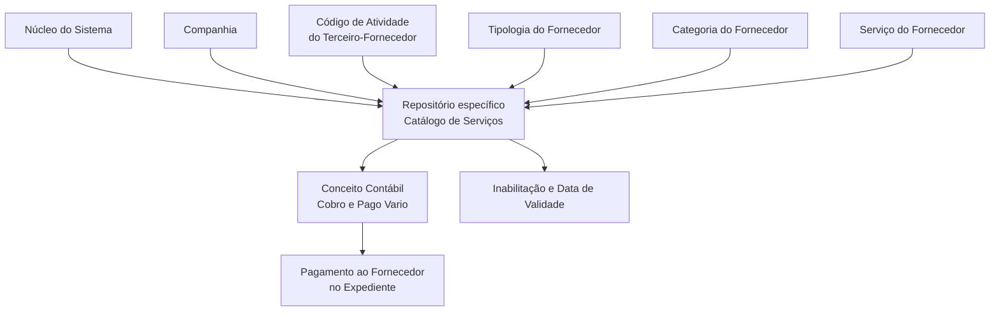

# Definição dos Serviços por Atividade, Tipologia e Categoria do Fornecedor

## 1. Metadados do Documento
- **Arquivo de Origem:** Não identificado no conteúdo fornecido
- **Tipo de Documento:** Especificação Técnica / Funcional
- **Domínio / Sistema:** Catálogo de Serviços de Fornecedores — MAPFRE
- **Público-Alvo:** Negócio, analistas funcionais, operação e equipes responsáveis pela configuração de catálogos
- **Data/Versão Identificada:** Não identificada

---

## 2. Resumo Executivo & Contexto de Negócio

O documento descreve a definição funcional de um catálogo destinado à codificação dos serviços prestados por fornecedores. O núcleo do sistema permite configurar esses serviços conforme a Atividade, Tipologia e Categoria do fornecedor, utilizando um repositório de informação específico inicialmente entregue sem conteúdo.

A configuração do catálogo associa informações de companhia, atividade do terceiro-fornecedor, tipologia, categoria, serviço e conceito contábil. O conceito contábil é utilizado no pagamento ao fornecedor que tenha participado de um expediente, considerando a combinação entre atividade, tipologia, categoria e serviço prestado.

O catálogo também possui propriedades de controle operacional. A propriedade de inabilitação permite desativar um registro configurado. A data de validade indica desde quando o registro está operativo e permite manter histórico das alterações realizadas ao longo do tempo.

O documento não determina uma codificação obrigatória ou um padrão de nomenclatura para o catálogo de serviços. Contudo, estabelece que a entidade MAPFRE deve avaliar a conveniência de utilizar o catálogo transversalmente nos processos corporativos, visando sua correta exploração posterior.

---

## 3. Arquitetura, Componentes & Tecnologias Envolvidas

O conteúdo fornecido não descreve tecnologias, servidores, integrações, endpoints, bancos de dados ou microsserviços. A arquitetura funcional identificável é composta pelo núcleo do sistema, pelo repositório específico do catálogo de serviços e pelos atributos utilizados para caracterizar o serviço de um fornecedor.



**Nota de Análise:** O documento descreve atributos funcionais do catálogo, mas não detalha o modelo físico de dados, métodos de integração, contratos de API, tecnologias de implementação ou mecanismos técnicos de persistência.

---

## 4. Regras de Negócio, Especificações Funcionais & Processos

1. O núcleo do sistema permite codificar os serviços fornecidos pelos fornecedores.
2. A codificação dos serviços deve considerar:
   - Atividade do fornecedor;
   - Tipologia do fornecedor;
   - Categoria do fornecedor.
3. As informações são mantidas em um repositório específico de informação.
4. O repositório é entregue inicialmente vazio de conteúdo nas instalações.
5. O atributo **Companhia** deve conter o código da companhia para a qual está sendo realizada a definição do serviço.
6. O atributo **Código de Atividade do Terceiro** deve estabelecer o código da atividade do terceiro-fornecedor, desde que a atividade do terceiro o identifique como fornecedor.
7. O atributo **Tipologia** deve determinar o código ou chave do tipo de fornecedor configurado no catálogo.
8. O atributo **Categoria** deve determinar o código ou chave do tipo de fornecedor configurado no catálogo.
9. O atributo **Serviço** deve determinar o código ou chave do serviço de fornecedores configurado no catálogo.
10. O atributo **Conceito Contábil** identifica o conceito contábil — conceito de cobrança e pagamento variado — usado para realizar o pagamento ao fornecedor participante de um expediente.
11. O pagamento ao fornecedor deve considerar sua atividade, tipologia, categoria e serviço prestado.
12. A propriedade **Inabilitação** define que o registro configurado está desativado ou inabilitado.
13. A propriedade **Data de Validade** informa ao sistema a data a partir da qual o registro configurado está operativo.
14. O uso correto da data de validade permite manter histórico das alterações realizadas ao longo do tempo.
15. Não existe preferência ou recomendação para estabelecer ou padronizar a codificação do catálogo no sistema.
16. A entidade MAPFRE deve analisar a conveniência de usar transversalmente o catálogo de informações nos processos da companhia, para permitir sua correta exploração posterior.
17. A leitura dos documentos relacionados é recomendada para evitar que a interpretação isolada deste documento conduza a erro.

### Documentos e vínculos funcionais relacionados
- Serviços de Fornecedores;
- Atividades dos Terceiros;
- Tipologias de Fornecedores por Atividade.

---

## 5. Tabelas de Parâmetros, Ambientes e Estruturas de Dados

| Item / Parâmetro | Descrição / Função | Tipo / Valores / Formato | Ambiente / Observações |
| :--- | :--- | :--- | :--- |
| Repositório de informação | Repositório específico para codificar serviços fornecidos por fornecedores. | Não especificado. | Entregue inicialmente vazio de conteúdo. |
| Companhia | Contém o código da companhia para a qual está sendo definida a configuração do serviço. | Código de companhia; formato não especificado. | Aplicável à definição do serviço. |
| Código de Atividade do Terceiro | Estabelece o código da atividade do terceiro-fornecedor. | Código de atividade; formato não especificado. | Aplicável quando a atividade do terceiro o identifica como fornecedor. |
| Tipologia | Determina o código ou chave do tipo de fornecedor configurado no catálogo. | Código ou chave; formato não especificado. | Relacionada ao fornecedor. |
| Categoria | Determina o código ou chave do tipo de fornecedor configurado no catálogo. | Código ou chave; formato não especificado. | O documento utiliza a mesma descrição atribuída à tipologia. |
| Serviço | Determina o código ou chave do serviço de fornecedores configurado no catálogo. | Código ou chave; formato não especificado. | Relacionado ao serviço prestado. |
| Conceito Contábil | Identifica o conceito contábil utilizado para realizar pagamento ao fornecedor participante de um expediente. | Conceito de Cobro y Pago Vario. | Considera atividade, tipologia, categoria e serviço prestado. |
| Inabilitação | Define que o registro configurado está desativado ou inabilitado. | Estado de inabilitação; valores não especificados. | Controle de disponibilidade do registro. |
| Data de Validade | Indica a data a partir da qual o registro configurado está operativo no sistema. | Data; formato não especificado. | Permite histórico das alterações ao longo do tempo. |
| Codificação do catálogo | Não possui preferência ou recomendação de padronização definida pelo documento. | Não aplicável. | MAPFRE deve avaliar o uso transversal nos processos corporativos. |

---

## 6. Bateria de Perguntas & Respostas para RAG (FAQ Sintético)

### P1: Qual é o objetivo do catálogo de Serviços de Fornecedores?
**R:** O catálogo permite ao núcleo do sistema codificar os serviços fornecidos por fornecedores conforme sua atividade, tipologia e categoria, utilizando um repositório específico de informação.

### P2: O repositório do catálogo de serviços já possui dados quando é entregue às instalações?
**R:** Não. O documento informa que o repositório específico de informação é entregue inicialmente vazio de conteúdo.

### P3: Qual é a finalidade do atributo Companhia no catálogo?
**R:** O atributo Companhia contém o código da companhia sobre a qual está sendo realizada a definição do serviço.

### P4: Quando o Código de Atividade do Terceiro deve ser utilizado?
**R:** O Código de Atividade do Terceiro estabelece no sistema o código da atividade do terceiro-fornecedor, sempre que a atividade do terceiro o identifique como fornecedor.

### P5: Como o documento define Tipologia no catálogo?
**R:** Tipologia determina o código ou a chave do tipo de fornecedor que está sendo configurado no catálogo.

### P6: Quais informações são consideradas para o pagamento de um fornecedor participante de um expediente?
**R:** O conceito contábil usado para o pagamento considera a atividade, a tipologia, a categoria e o serviço prestado pelo fornecedor que interveio no expediente.

### P7: O que significa a propriedade Inabilitação?
**R:** A propriedade Inabilitação estabelece que o registro configurado está desativado ou inabilitado.

### P8: Qual é a função da Data de Validade de um registro do catálogo?
**R:** A Data de Validade informa ao sistema a partir de qual data o registro configurado está operativo. Seu uso correto permite manter o histórico das mudanças realizadas ao longo do tempo.

### P9: Existe uma codificação obrigatória ou recomendada para o catálogo de Serviços de Fornecedores?
**R:** Não. O documento declara que não existe preferência nem recomendação para estabelecer ou padronizar a codificação do catálogo no sistema.

### P10: Qual é a orientação para a entidade MAPFRE quanto ao uso do catálogo?
**R:** A MAPFRE deve analisar a conveniência de utilizar o catálogo de forma transversal nos processos da companhia, visando sua correta exploração posterior.

### P11: Quais documentos funcionais relacionados devem ser consultados?
**R:** O documento recomenda a leitura de “Serviços de Fornecedores”, “Atividades dos Terceiros” e “Tipologias de Fornecedores por Atividade”, pois a interpretação isolada do documento atual pode conduzir a erro.

---

## 7. Glossário de Termos, Siglas & Conceitos-Chave

- **Atividade do Terceiro:** Código da atividade do terceiro-fornecedor, aplicável quando a atividade o identifica como fornecedor.
- **Categoria:** Atributo que determina o código ou chave do tipo de fornecedor configurado no catálogo.
- **Companhia:** Atributo que contém o código da companhia para a qual a definição de serviço está sendo realizada.
- **Conceito Contábil:** Conceito de cobrança e pagamento variado utilizado para realizar pagamentos ao fornecedor envolvido em um expediente.
- **Expediente:** Contexto no qual um fornecedor pode ter intervindo e para o qual pode ser realizado pagamento.
- **Fornecedor / Proveedor:** Terceiro que presta um serviço e cuja atividade, tipologia, categoria e serviço são considerados no catálogo.
- **Inabilitação:** Propriedade que indica que um registro configurado está desativado ou inabilitado.
- **MAPFRE:** Entidade mencionada como responsável por avaliar o uso transversal do catálogo nos processos da companhia.
- **Serviço:** Atributo que determina o código ou chave do serviço de fornecedor configurado no catálogo.
- **Tipologia:** Atributo que determina o código ou chave do tipo de fornecedor configurado no catálogo.

---

## 8. Notas Críticas, Riscos & Limitações

- O repositório do catálogo é inicialmente entregue vazio, portanto exige carregamento e governança de conteúdo pela organização.
- O documento não fornece uma convenção obrigatória de codificação para atividades, tipologias, categorias ou serviços.
- A ausência de padronização de codificação pode prejudicar o uso transversal e a exploração posterior das informações caso a MAPFRE não estabeleça critérios internos.
- A interpretação isolada do documento pode conduzir a erro; a leitura dos documentos funcionais vinculados é recomendada.
- O documento não detalha formatos de campos, valores permitidos, regras de unicidade, integrações, APIs, permissões, mecanismos de auditoria ou tecnologias utilizadas.
- A descrição de **Categoria** repete que determina o código ou chave do “Tipo de Proveedor”; o documento não fornece detalhamento adicional que diferencie formalmente categoria de tipologia.

---

## 9. Conteúdo Bruto Estruturado (Referência Fiel)

```text
--- [PÁGINA 1 DE 3] ---

DEFINICIÓN de los SERVICIOS por Actividad,
Tipología y Categoría del PROVEEDOR
Objetivo
Funcionalmente, el núcleo del Sistema cuenta con la posibilidad de codificar los Servicios provistos
por los Proveedores en función de su Actividad, Tipología y Categoría en un repositorio de
información específico que se entrega inicialmente a las instalaciones vacío de contenido.
Propiedades
Otras Propiedades
Compañía
Este Atributo del catálogo contiene el código de la compañía sobre la que se está realizando la
definición del Servicio.
Código de Actividad del Tercero
Esta propiedad establece en el sistema el código de la Actividad del Tercero-Proveedor siempre y
cuando la Actividad del Tercero lo identifique como tal.
Tipología
Este Atributo determina el código o clave del Tipo de Proveedor que se está configurando en el
catálogo.
 /
 CF
Home Solutions APIs Documentation Zeus
EN


--- [PÁGINA 2 DE 3] ---

Categoría
Este Atributo determina el código o clave del Tipo de Proveedor que se está configurando en el
catálogo.
Servicio
Este Atributo determina el código o clave del Servicio de los Proveedores que se está configurando
en el catálogo.
Concepto Contable
Esta propiedad del Catálogo identifica el Concepto Contable (Concepto de Cobro y Pago Vario) que
va a utilizarse para realizar el pago al Proveedor que haya intervenido en el expediente (de acuerdo
con su Actividad, Tipología, Categoría y Servicio Prestado)
Otras Propiedades
Inhabilitación
Esta propiedad establece que el Registro configurado está desactivado o inhabilitado.
Fecha de Validez
Esta propiedad le indica al Sistema la fecha a partir de la cual el registro configurado está operativo
en el sistema por lo que su correcto uso permite tener un histórico de los cambios efectuados a lo
largo del tiempo.
Vínculos
Relación de Directrices y Documentos funcionales cuya lectura recomendada para evitar que la
interpretación aislada del presente documento pueda conducir a error.
Servicios de Proveedores
Actividades de los Terceros
Tipologías de Proveedores por Actividad
Preguntas frecuentes
(1) ¿Existe alguna recomendación operativa que deba ser tomada en consideración localmente en la
codificación, uso y definición del catálogo de Servicios de los Proveedores?
No existe una preferencia ni recomendación para establecer o estandarizar en el sistema su
codificación, si bien la entidad MAPFRE debe analizar la conveniencia de utilizar transversalmente en
los procesos de la compañía este catálogo de información para su correcta y posterior explotación.


--- [PÁGINA 3 DE 3] ---

[Página em branco ou apenas elementos visuais/imagem]
```
