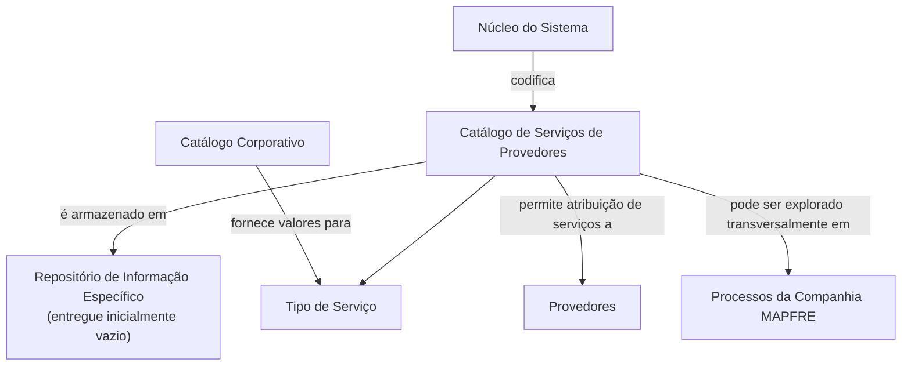

# Definição dos Serviços de Provedores — Catálogo Corporativo MAPFRE

## 1. Metadados do Documento
- **Arquivo de Origem:** Não identificado no conteúdo fornecido
- **Tipo de Documento:** Especificação Funcional
- **Domínio / Sistema:** Catálogo de Serviços de Provedores / MAPFRE
- **Público-Alvo:** Negócio, Analistas Funcionais, Operação e Desenvolvedores
- **Data/Versão Identificada:** Não identificada

---

## 2. Resumo Executivo & Contexto de Negócio

O documento define funcionalmente o catálogo de **Serviços de Provedores**, utilizado pelo núcleo do sistema para codificar os serviços fornecidos por provedores. O repositório específico de informações é entregue inicialmente às instalações sem conteúdo, exigindo configuração local dos registros de serviço.

A definição de cada serviço é contextualizada por companhia, código de serviço, tipo de serviço, idioma e descrição localizada. O tipo de serviço deve obedecer aos valores configurados no catálogo corporativo. A utilização de idioma permite que uma mesma definição de serviço possua denominações adequadas ao idioma empregado.

O documento também define a propriedade de inabilitação, que indica que determinado código de serviço está desativado e não pode ser utilizado na atribuição de serviços a provedores. Como exemplo de descrições de serviços, são apresentados os códigos `1`, `2` e `A`, associados respectivamente a `CHAPA`, `PINTURA` e `ELECTRICIDAD`.

Não há recomendação operacional para padronizar a codificação do catálogo dentro do sistema. Contudo, a entidade MAPFRE deve avaliar a conveniência de usar o catálogo de forma transversal nos processos corporativos, visando sua correta exploração posterior.

---

## 3. Arquitetura, Componentes & Tecnologias Envolvidas

O conteúdo não descreve arquitetura técnica, servidores, integrações, APIs, protocolos, bancos de dados ou tecnologias de implementação. A estrutura funcional identificada consiste em um núcleo de sistema, um repositório de informações específico e o catálogo de Serviços de Provedores.

Componentes e conceitos identificados:

| Componente / Conceito | Descrição fundamentada no documento |
| :--- | :--- |
| Núcleo do Sistema | Possui a capacidade funcional de codificar os serviços providos por provedores. |
| Repositório de Informação Específico | Repositório no qual são codificados os serviços de provedores; é entregue inicialmente sem conteúdo. |
| Catálogo de Serviços de Provedores | Catálogo que concentra as definições de serviços, incluindo companhia, código, tipo, idioma, descrição e inabilitação. |
| Catálogo Corporativo | Fonte dos valores configurados para o atributo Tipo de Serviço. |
| Provedores | Entidades às quais os serviços podem ser atribuídos. |
| MAPFRE | Entidade que deve analisar a conveniência do uso transversal do catálogo nos processos da companhia. |



> **Nota de Análise:** O documento não detalha métodos HTTP, contratos JSON, persistência física, autenticação, interfaces de usuário ou mecanismos técnicos de integração.

---

## 4. Regras de Negócio, Especificações Funcionais & Processos

### 4.1 Objetivo funcional

1. O núcleo do sistema deve permitir a codificação de serviços providos por provedores.
2. Os serviços devem ser registrados em um repositório de informação específico.
3. O repositório de informação específico é entregue inicialmente vazio, sem conteúdo preconfigurado.

### 4.2 Definição de um serviço de provedor

A configuração de um serviço de provedor envolve os seguintes atributos:

1. **Companhia:** identifica o código da companhia para a qual a definição do serviço está sendo realizada.
2. **Serviço:** determina o código ou chave do serviço de provedores configurado no catálogo.
3. **Tipo de Serviço:** especifica o tipo de serviço segundo os valores configurados no catálogo corporativo.
4. **Idioma:** representa a chave do idioma utilizada na configuração do serviço, com exemplos como espanhol, inglês e turco.
5. **Descrição do Serviço:** contém a denominação ou descrição do serviço no idioma empregado na definição.
6. **Inabilitação:** determina que o código do serviço está desativado ou inabilitado para utilização na atribuição a provedores.

### 4.3 Regra de idioma e descrição

- A descrição do serviço deve ser associada ao idioma utilizado na definição do serviço.
- O documento cita como exemplos de idiomas: espanhol, inglês e turco.
- O texto não estabelece uma lista fechada de idiomas válidos.
- O texto não especifica regras de unicidade para a combinação entre companhia, serviço e idioma.

### 4.4 Regra de Tipo de Serviço

- O atributo **Tipo de Serviço** deve ser definido de acordo com os valores existentes no catálogo corporativo.
- O documento não apresenta os valores disponíveis no catálogo corporativo.
- O documento não descreve processo de manutenção, governança ou aprovação dos tipos de serviço.

### 4.5 Regra de inabilitação

- Um serviço marcado como inabilitado está desativado.
- Um código de serviço inabilitado não pode ser utilizado na atribuição a provedores.
- O documento não detalha se a inabilitação preserva atribuições já existentes, nem descreve procedimentos de reativação.

### 4.6 Diretriz de codificação e uso corporativo

- Não existe preferência ou recomendação para estabelecer ou padronizar a codificação do catálogo no sistema.
- A entidade MAPFRE deve analisar a conveniência de utilizar o catálogo transversalmente nos processos da companhia.
- O uso transversal é apresentado como meio para correta exploração posterior das informações do catálogo.

### 4.7 Documentos relacionados

O documento recomenda a leitura das seguintes diretrizes e documentos funcionais, para evitar interpretações isoladas que possam conduzir a erro:

- **Servicios por Actividad, Tipología y Categoría**
- **Preguntas frecuentes**

> **Nota de Análise:** O conteúdo dos documentos relacionados não foi fornecido. Portanto, não é possível extrair regras adicionais de atividade, tipologia, categoria ou perguntas frequentes.

---

## 5. Tabelas de Parâmetros, Ambientes e Estruturas de Dados

### 5.1 Atributos do catálogo de Serviços de Provedores

| Item / Parâmetro | Descrição / Função | Tipo / Valores / Formato | Ambiente / Observações |
| :--- | :--- | :--- | :--- |
| Companhia | Contém o código da companhia sobre a qual a definição do serviço está sendo realizada. | Código da companhia; formato não especificado. | Aplicável à definição do serviço no catálogo. |
| Serviço | Determina o código ou chave do serviço de provedores configurado no catálogo. | Código ou chave; formato não especificado. | Utilizado para identificar o serviço. |
| Tipo de Serviço | Especifica o tipo do serviço. | Valores configurados no catálogo corporativo. | Os valores concretos não são apresentados. |
| Idioma | Representa a chave do idioma empregado na configuração do serviço. | Exemplos: espanhol, inglês, turco. | Não há lista completa ou formato definido. |
| Descrição do Serviço | Contém a denominação ou descrição do serviço segundo o idioma utilizado na definição. | Texto descritivo. | Associada ao idioma da configuração. |
| Inabilitação | Estabelece que o código de serviço está desativado ou inabilitado. | Estado de inabilitação; valores/formato não especificados. | Serviço inabilitado não pode ser atribuído a provedores. |

### 5.2 Exemplos de serviços apresentados

| Código de Serviço | Descrição do Serviço | Idioma explicitamente indicado | Contexto / Observações |
| :--- | :--- | :--- | :--- |
| `1` | `CHAPA` | Espanhol, no contexto do exemplo. | Exemplo para serviços configurados para um terceiro-provedor correspondente a uma oficina. |
| `2` | `PINTURA` | Espanhol, no contexto do exemplo. | Exemplo para serviços configurados para um terceiro-provedor correspondente a uma oficina. |
| `A` | `ELECTRICIDAD` | Espanhol, no contexto do exemplo. | Exemplo para serviços configurados para um terceiro-provedor correspondente a uma oficina. |

### 5.3 Ambientes, rotas, logs e URLs

| Item / Parâmetro | Descrição / Função | Tipo / Valores / Formato | Ambiente / Observações |
| :--- | :--- | :--- | :--- |
| Ambientes técnicos | Não identificados. | Não aplicável. | O documento não informa ambientes de desenvolvimento, testes, homologação ou produção. |
| Rotas de log | Não identificadas. | Não aplicável. | O documento não contém caminhos, variáveis ou configurações de logs. |
| URLs | Não identificadas. | Não aplicável. | O texto apresenta referências visuais a “Home Solutions APIs Documentation Zeus”, mas não fornece URL, função ou contexto técnico verificável. |
| Servidores | Não identificados. | Não aplicável. | O documento não apresenta servidores, portas ou endereços. |

---

## 6. Bateria de Perguntas & Respostas para RAG (FAQ Sintético)

### P1: Qual é o objetivo do catálogo de Serviços de Provedores?
**R:** O catálogo de Serviços de Provedores permite que o núcleo do sistema codifique os serviços fornecidos por provedores em um repositório de informação específico. Esse repositório é entregue inicialmente sem conteúdo, de modo que as definições de serviços precisam ser configuradas.

### P2: Quais atributos compõem a definição de um serviço de provedor?
**R:** A definição utiliza os atributos Companhia, Serviço, Tipo de Serviço, Idioma, Descrição do Serviço e Inabilitação. O documento não apresenta atributos adicionais nem especifica formatos técnicos para esses campos.

### P3: Qual é a função do atributo Companhia no catálogo?
**R:** O atributo Companhia contém o código da companhia sobre a qual está sendo realizada a definição do serviço. O documento não informa o formato do código da companhia.

### P4: Como o Tipo de Serviço deve ser configurado?
**R:** O Tipo de Serviço deve ser especificado segundo os valores configurados no catálogo corporativo. O documento não lista quais são esses valores nem descreve quem é responsável pela manutenção do catálogo corporativo.

### P5: Para que serve o atributo Idioma?
**R:** O atributo Idioma representa a chave do idioma utilizada na configuração do serviço de provedores. O documento cita espanhol, inglês e turco como exemplos de idiomas empregados nas definições.

### P6: Como a Descrição do Serviço se relaciona com o idioma?
**R:** A Descrição do Serviço contém a denominação do serviço de acordo com o idioma utilizado em sua definição. No exemplo apresentado para idioma espanhol, os códigos `1`, `2` e `A` correspondem às descrições `CHAPA`, `PINTURA` e `ELECTRICIDAD`.

### P7: O que acontece quando um serviço é inabilitado?
**R:** Quando um código de serviço é marcado com a propriedade de Inabilitação, ele fica desativado ou inabilitado e não pode ser utilizado na atribuição de serviços a provedores.

### P8: Existe uma padronização obrigatória para a codificação dos serviços?
**R:** Não. O documento afirma que não existe preferência nem recomendação para estabelecer ou padronizar a codificação do catálogo no sistema.

### P9: Qual orientação é fornecida à MAPFRE sobre a utilização do catálogo?
**R:** A MAPFRE deve analisar a conveniência de utilizar transversalmente o catálogo de informações nos processos da companhia, com o objetivo de permitir sua correta exploração posterior.

### P10: O documento detalha APIs, contratos JSON ou métodos HTTP do catálogo?
**R:** Não. O documento descreve atributos funcionais do catálogo de Serviços de Provedores, mas não especifica APIs, métodos HTTP, contratos JSON, modelos de dados físicos ou tecnologias de integração.

### P11: Quais documentos devem ser consultados para evitar interpretação isolada?
**R:** O documento recomenda a leitura de “Servicios por Actividad, Tipología y Categoría” e “Preguntas frecuentes”. O conteúdo desses documentos relacionados não está presente no material fornecido.

### P12: O catálogo é entregue com serviços já cadastrados?
**R:** Não. O repositório de informação específico destinado aos serviços de provedores é entregue inicialmente vazio de conteúdo.

---

## 7. Glossário de Termos, Siglas & Conceitos-Chave

- **Catálogo de Serviços de Provedores:** Repositório lógico de definições de serviços fornecidos por provedores, configurados por companhia, código, tipo, idioma, descrição e estado de inabilitação.
- **Catálogo Corporativo:** Catálogo que contém os valores utilizados para a definição do Tipo de Serviço.
- **Companhia:** Entidade identificada por código para a qual a definição de serviço é realizada.
- **Inabilitação:** Propriedade que torna um código de serviço desativado e impede sua utilização na atribuição a provedores.
- **MAPFRE:** Entidade mencionada como responsável por analisar a conveniência de utilização transversal do catálogo nos processos da companhia.
- **Provedor:** Entidade que fornece serviços e à qual os serviços do catálogo podem ser atribuídos.
- **Serviço:** Código ou chave que identifica um serviço de provedor no catálogo.
- **Tipo de Serviço:** Classificação do serviço definida a partir dos valores configurados no catálogo corporativo.

---

## 8. Notas Críticas, Riscos & Limitações

- O repositório de Serviços de Provedores é entregue inicialmente vazio; a ausência de carga inicial pode exigir definição operacional para criação e manutenção dos registros.
- Não há recomendação ou padrão definido para a codificação dos serviços. Essa ausência pode resultar em codificações heterogêneas caso não exista governança complementar.
- A MAPFRE deve avaliar o uso transversal do catálogo nos processos corporativos; o documento não confirma que tal uso já esteja implementado.
- O documento não informa os valores permitidos para Tipo de Serviço, apesar de determinar que eles sejam obtidos do catálogo corporativo.
- Não há detalhamento sobre formatos de campos, obrigatoriedade, cardinalidade, regras de unicidade, auditoria, aprovação, exclusão, reativação ou ciclo de vida dos serviços.
- Não são fornecidas informações sobre ambientes, servidores, URLs, logs, APIs, integração ou segurança.
- A interpretação isolada do documento pode conduzir a erro; são recomendados os documentos “Servicios por Actividad, Tipología y Categoría” e “Preguntas frecuentes”.

---

## 9. Conteúdo Bruto Estruturado (Referência Fiel)

```text
--- [PÁGINA 1 DE 3] ---

DEFINICIÓN de los SERVICIOS de
PROVEEDORES
Objetivo
Funcionalmente, el núcleo del Sistema cuenta con la posibilidad de codificar los Servicios provistos
por los Proveedores en un repositorio de información específico que se entrega inicialmente a las
instalaciones vacío de contenido.
Propiedades
Otras Propiedades
Propiedades
Compañía
Este Atributo del catálogo contiene el código de la compañía sobre la que se está realizando la
definición del Servicio.
Servicio
Este Atributo determina el código o clave del Servicio de los Proveedores que se está configurando
en el catálogo.
Tipo de Servicio
 / 
 CF
Home Solutions APIs Documentation Zeus
EN


--- [PÁGINA 2 DE 3] ---

Este Atributo especifica el Tipo de Servicio de acuerdo con los valores que estén configurados en el
catálogo Corporativo.
Idioma
Esta propiedad es la clave del Idioma empleado en la configuración del Servicio de los Proveedores
como por ejemplo: español, inglés, turco, ...
Descripción del Servicio
Esta propiedad contiene la denominación o descripción del Servicio de acuerdo con el idioma
utilizado en la definición.
A modo de ejemplo si los servicios fueran aquellos configurados para un Tercero-Proveedor
correspondiente a un Taller y si el idioma de la definición fuera el español...
SERVICIO DESCRIPCIÓN
1 CHAPA
2 PINTURA
A ELECTRICIDAD
... ...
Otras Propiedades
Inhabilitación
Esta propiedad establece que el Código del Servicio está desactivado o inhabilitado para poder ser
utilizado en la asignación a los Proveedores.
Vínculos
Relación de Directrices y Documentos funcionales cuya lectura recomendada para evitar que la
interpretación aislada del presente documento pueda conducir a error.
Servicios por Actividad, Tipología y Categoría
Preguntas frecuentes


--- [PÁGINA 3 DE 3] ---

(1) ¿Existe alguna recomendación operativa que deba ser tomada en consideración localmente en la
codificación, uso y definición del catálogo de Servicios de los Proveedores?
No existe una preferencia ni recomendación para establecer o estandarizar en el sistema su
codificación, si bien la entidad MAPFRE debe analizar la conveniencia de utilizar transversalmente en
los procesos de la compañía este catálogo de información para su correcta y posterior explotación.
```
