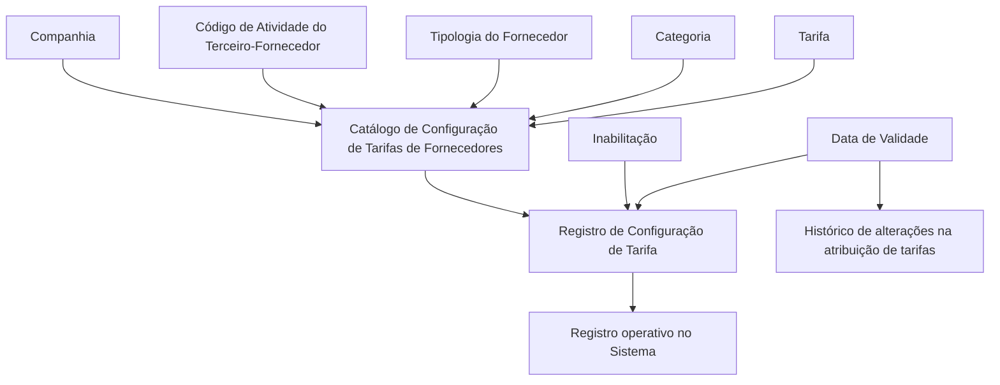

# Configuração de Tarifas de Fornecedores por Atividade, Tipologia e Categoria

## 1. Metadados do Documento
- **Arquivo de Origem:** Não identificado
- **Tipo de Documento:** Especificação Funcional
- **Domínio / Sistema:** Catálogo de Configuração de Tarifas de Fornecedores — MAPFRE
- **Público-Alvo:** Negócio, Analistas Funcionais, Operação e Desenvolvedores
- **Data/Versão Identificada:** Não identificada

---

## 2. Resumo Executivo & Contexto de Negócio

O documento descreve a configuração de tarifas de fornecedores em um repositório de informação particular do núcleo do Sistema. A codificação da tarifa é definida em função de três dimensões principais: atividade do terceiro-fornecedor, tipologia do fornecedor e categoria.

A finalidade funcional do catálogo é permitir que o Sistema associe uma tarifa a um fornecedor de maneira estruturada. A associação considera a companhia na qual a definição é realizada, o código de atividade do terceiro, a tipologia, a categoria e a tarifa aplicável.

O catálogo também possui propriedades operacionais para inabilitação de registros e controle de vigência. A data de validade determina a partir de quando um registro fica operativo no Sistema e permite manter histórico das alterações feitas na atribuição de tarifas ao longo do tempo.

O documento recomenda a leitura conjunta de diretrizes e documentos funcionais relacionados a tarifas de fornecedores, atividades de terceiros e tipologias de fornecedores por atividade. A interpretação isolada pode levar a erros. Não há recomendação ou preferência estabelecida para padronizar a codificação, mas a entidade MAPFRE deve avaliar a conveniência de usar esse catálogo transversalmente em seus processos para posterior exploração adequada.

---

## 3. Arquitetura, Componentes & Tecnologias Envolvidas

O documento não descreve arquitetura técnica, integrações, APIs, bancos de dados, protocolos, ambientes de infraestrutura ou tecnologias específicas. O conteúdo disponível descreve um fluxo funcional de configuração de um registro no catálogo de tarifas de fornecedores.

Componentes funcionais identificados:

- **Núcleo do Sistema:** Componente que disponibiliza a possibilidade de codificar tarifas de fornecedores.
- **Repositório de informação particular:** Local lógico onde as tarifas são codificadas.
- **Catálogo de Configuração de Tarifas de Fornecedores:** Estrutura funcional que armazena a configuração.
- **Companhia:** Contexto organizacional da definição da tarifa.
- **Atividade do Terceiro-Fornecedor:** Critério de identificação do fornecedor como tal.
- **Tipologia:** Código ou chave do tipo de fornecedor.
- **Categoria:** Código ou chave configurada no catálogo.
- **Tarifa:** Código ou chave da tarifa do fornecedor.
- **Inabilitação:** Propriedade que desativa o registro.
- **Data de Validade:** Propriedade que controla o início operacional e o histórico da configuração.



> **Nota de Análise:** O documento descreve relações funcionais entre propriedades do catálogo, mas não informa contratos de serviço, métodos HTTP, formatos JSON, persistência física, endpoints, tecnologias ou responsáveis técnicos.

---

## 4. Regras de Negócio, Especificações Funcionais & Processos

1. O núcleo do Sistema deve permitir a codificação das tarifas dos fornecedores em um repositório de informação particular.

2. A configuração de uma tarifa de fornecedor deve considerar a atividade, a tipologia e a categoria do fornecedor.

3. A propriedade **Companhia** deve conter o código da companhia para a qual a definição da tarifa está sendo realizada.

4. A propriedade **Código de Atividade do Terceiro** deve estabelecer o código da atividade do terceiro-fornecedor no Sistema, desde que a atividade do terceiro o identifique como fornecedor.

5. A propriedade **Tipologia** deve determinar o código ou a chave do tipo de fornecedor configurado no catálogo.

6. A propriedade **Categoria** deve determinar o código ou a chave do tipo de fornecedor configurado no catálogo.

7. A propriedade **Tarifa** deve determinar o código ou a chave da tarifa dos fornecedores configurada no catálogo.

8. A propriedade **Inabilitação** deve indicar que o registro configurado está desativado ou inabilitado.

9. A propriedade **Data de Validade** deve indicar ao Sistema a data a partir da qual o registro passa a estar operativo.

10. O uso correto da data de validade deve permitir a manutenção de histórico das alterações realizadas na atribuição de tarifas ao longo do tempo.

11. A interpretação do documento deve considerar também os documentos funcionais relacionados:
    - Tarifas de Fornecedores.
    - Atividades dos Terceiros.
    - Tipologias de Fornecedores por Atividade.

12. Não existe preferência ou recomendação explícita para estabelecer ou padronizar a codificação no Sistema.

13. A entidade MAPFRE deve analisar a conveniência de utilizar transversalmente o catálogo de informação nos processos da companhia, visando sua correta exploração posterior.

---

## 5. Tabelas de Parâmetros, Ambientes e Estruturas de Dados

| Item / Parâmetro | Descrição / Função | Tipo / Valores / Formato | Ambiente / Observações |
| :--- | :--- | :--- | :--- |
| Companhia | Contém o código da companhia sobre a qual a definição da tarifa é realizada. | Código de companhia; formato não detalhado. | Aplicável ao registro de configuração de tarifa. |
| Código de Atividade do Terceiro | Estabelece o código da atividade do terceiro-fornecedor no Sistema. | Código de atividade; formato não detalhado. | Aplicável quando a atividade do terceiro o identifica como fornecedor. |
| Tipologia | Determina o código ou chave do tipo de fornecedor configurado no catálogo. | Código ou chave; valores não detalhados. | Associada à configuração da tarifa de fornecedor. |
| Categoria | Determina o código ou chave configurada no catálogo. | Código ou chave; valores não detalhados. | O documento não detalha domínio de valores nem critérios de validação. |
| Tarifa | Determina o código ou chave da tarifa dos fornecedores no catálogo. | Código ou chave; valores não detalhados. | Associada à atividade, tipologia e categoria do fornecedor. |
| Inabilitação | Indica que o registro configurado está desativado ou inabilitado. | Indicador; formato e valores não detalhados. | Afeta o estado operacional do registro. |
| Data de Validade | Indica a data a partir da qual o registro é operativo no Sistema. | Data; formato não detalhado. | Permite histórico das alterações na atribuição de tarifas. |
| Repositório de informação particular | Repositório utilizado pelo núcleo do Sistema para codificar tarifas de fornecedores. | Não detalhado. | Não há informação sobre tecnologia, localização ou modelo de persistência. |
| Tarifas de Fornecedores | Documento funcional relacionado recomendado para leitura. | Referência documental. | Deve ser considerado para evitar interpretação isolada. |
| Atividades dos Terceiros | Documento funcional relacionado recomendado para leitura. | Referência documental. | Deve ser considerado para evitar interpretação isolada. |
| Tipologias de Fornecedores por Atividade | Documento funcional relacionado recomendado para leitura. | Referência documental. | Deve ser considerado para evitar interpretação isolada. |

---

## 6. Bateria de Perguntas & Respostas para RAG (FAQ Sintético)

### P1: Qual é o objetivo do catálogo de Configuração de Tarifas de Fornecedores?
**R:** O catálogo permite que o núcleo do Sistema codifique as tarifas dos fornecedores em um repositório de informação particular, considerando a atividade, a tipologia e a categoria do fornecedor.

### P2: Quais são os critérios funcionais usados para configurar uma tarifa de fornecedor?
**R:** A configuração considera a companhia, o código de atividade do terceiro-fornecedor, a tipologia, a categoria e a tarifa. O documento também inclui as propriedades de inabilitação e data de validade para controlar o estado e a vigência do registro.

### P3: Para que serve o atributo Companhia na configuração de tarifas?
**R:** O atributo Companhia contém o código da companhia sobre a qual está sendo realizada a definição da tarifa. O documento não especifica o formato desse código.

### P4: Quando o Código de Atividade do Terceiro deve ser utilizado?
**R:** O Código de Atividade do Terceiro estabelece no Sistema o código da atividade do terceiro-fornecedor, desde que a atividade do terceiro o identifique como fornecedor.

### P5: Como a tipologia é representada no catálogo de tarifas?
**R:** A propriedade Tipologia determina o código ou a chave do tipo de fornecedor que está sendo configurado no catálogo. O documento não informa os valores permitidos nem a estrutura do código ou chave.

### P6: Qual é a função da propriedade Categoria?
**R:** A propriedade Categoria determina o código ou a chave configurada no catálogo. O documento a relaciona à configuração de tarifas de fornecedores, mas não detalha os valores, regras de composição ou critérios de validação da categoria.

### P7: Como o Sistema controla se um registro de tarifa está ativo?
**R:** A propriedade Inabilitação estabelece que o registro configurado está desativado ou inabilitado. O documento não detalha os valores possíveis do indicador, nem o comportamento do Sistema ao consultar registros inabilitados.

### P8: Qual é o papel da Data de Validade na configuração de tarifas?
**R:** A Data de Validade informa ao Sistema a data a partir da qual o registro está operativo. O uso correto dessa propriedade permite manter histórico dos փոփոխações efetuadas na atribuição de tarifas ao longo do tempo.

### P9: O documento determina um padrão obrigatório para codificação das tarifas?
**R:** Não. O documento afirma que não existe preferência ou recomendação para estabelecer ou padronizar a codificação no Sistema.

### P10: Qual recomendação é direcionada à entidade MAPFRE?
**R:** A entidade MAPFRE deve analisar a conveniência de utilizar transversalmente esse catálogo de informação nos processos da companhia, para permitir sua correta exploração posterior.

### P11: Quais documentos relacionados devem ser consultados junto com esta especificação?
**R:** O documento recomenda consultar “Tarifas de Proveedores”, “Actividades de los Terceros” e “Tipologías de Proveedores por Actividad”, pois a interpretação isolada pode conduzir a erro.

### P12: O documento especifica APIs, métodos HTTP, contratos JSON ou tecnologias de persistência?
**R:** Não. O documento não detalha APIs, métodos HTTP, contratos JSON, tecnologias, banco de dados, infraestrutura, ambientes ou mecanismos técnicos de integração.

---

## 7. Glossário de Termos, Siglas & Conceitos-Chave

- **MAPFRE:** Entidade mencionada no documento que deve avaliar a conveniência de usar transversalmente o catálogo de informação nos processos da companhia.
- **Terceiro-Fornecedor:** Terceiro cuja atividade o identifica como fornecedor no contexto do Sistema.
- **Atividade do Terceiro:** Código de atividade usado para identificar o terceiro como fornecedor quando aplicável.
- **Tipologia:** Código ou chave do tipo de fornecedor configurado no catálogo.
- **Categoria:** Código ou chave configurada no catálogo para a configuração de tarifa.
- **Tarifa:** Código ou chave da tarifa atribuída aos fornecedores no catálogo.
- **Inabilitação:** Propriedade que indica que um registro configurado está desativado ou inabilitado.
- **Data de Validade:** Data a partir da qual um registro fica operativo no Sistema.
- **Histórico de atribuição de tarifas:** Registro temporal das alterações efetuadas na associação de tarifas.

---

## 8. Notas Críticas, Riscos & Limitações

- O documento não identifica o arquivo de origem, data, versão, autor, área responsável ou sistema específico.
- O documento não define os formatos, domínios de valores, obrigatoriedade ou validações dos atributos Companhia, Atividade, Tipologia, Categoria e Tarifa.
- O documento não descreve regras para tratamento de registros com datas de validade sobrepostas, expiradas ou futuras.
- O documento não detalha o comportamento do Sistema para registros inabilitados.
- O documento não fornece fluxos de aprovação, perfis de acesso, matriz de permissões ou responsáveis pela manutenção do catálogo.
- O documento não descreve APIs, integrações, interfaces, endpoints, métodos HTTP, contratos JSON, banco de dados ou tecnologias.
- A interpretação isolada do documento pode conduzir a erro; a leitura dos documentos relacionados é explicitamente recomendada.
- Não há padrão obrigatório de codificação informado, o que pode resultar em variações locais caso a entidade MAPFRE não estabeleça convenções transversais.

---

## 9. Conteúdo Bruto Estruturado (Referência Fiel)

```text
--- [PÁGINA 1 DE 2] ---

CONFIGURACIÓN de las TARIFAS por
Actividad, Tipología y Categoría del
PROVEEDOR
Objetivo
Funcionalmente, el núcleo del Sistema cuenta con la posibilidad de codificar las Tarifas de los
Proveedores en función de su Actividad, Tipología y Categoría en un repositorio de información
particular.
Propiedades
Otras Propiedades
Propiedades
Compañía
Este Atributo del catálogo contiene el código de la compañía sobre la que se está realizando la
definición de la Tarifa.
Código de Actividad del Tercero
Esta propiedad establece en el sistema el código de la Actividad del Tercero-Proveedor siempre y
cuando la Actividad del Tercero lo identifique como tal.
Tipología
 / 
 CF
Home Solutions APIs Documentation Zeus
EN


--- [PÁGINA 2 DE 2] ---

Este Atributo determina el código o clave del Tipo de Proveedor que se está configurando en el
catálogo.
Categoría
Este Atributo determina el código o clave del Tipo de Proveedor que se está configurando en el
catálogo.
Tarifa
Este Atributo determina el código o clave de la Tarifa de los Proveedores que se está configurando en
el catálogo.
Otras Propiedades
Inhabilitación
Esta propiedad establece que el Registro configurado está desactivado o inhabilitado.
Fecha de Validez
Esta propiedad le indica al Sistema la fecha a partir de la cual el registro está operativo en el sistema
por lo que su correcto uso permite tener un histórico de los cambios efectuados en la asignación de
las Tarifas a lo largo del tiempo.
Vínculos
Relación de Directrices y Documentos funcionales cuya lectura recomendada para evitar que la
interpretación aislada del presente documento pueda conducir a error.
Tarifas de Proveedores
Actividades de los Terceros
Tipologías de Proveedores por Actividad
Preguntas frecuentes
(1) ¿Existe alguna recomendación operativa que deba ser tomada en consideración localmente en la
codificación, uso y definición del catálogo de Configuración de Tarifas de los Proveedores?
No existe una preferencia ni recomendación para establecer o estandarizar en el sistema su
codificación, si bien la entidad MAPFRE debe analizar la conveniencia de utilizar transversalmente en
los procesos de la compañía este catálogo de información para su correcta y posterior explotación.
```
