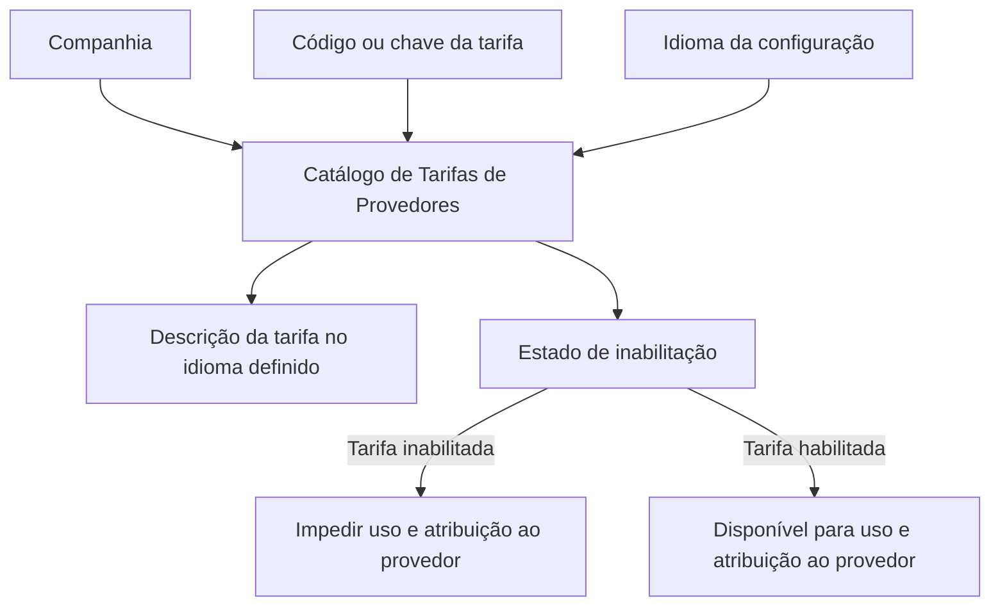

# Definição de Tarifas de Provedores — Catálogo Funcional MAPFRE

## 1. Metadados do Documento
- **Arquivo de Origem:** `Texto bruto fornecido pelo usuário`
- **Tipo de Documento:** `Especificação Funcional`
- **Domínio / Sistema:** `Catálogo de Tarifas de Provedores / MAPFRE`
- **Público-Alvo:** `Não identificado explicitamente`
- **Data/Versão Identificada:** `Não identificada`

---

## 2. Resumo Executivo & Contexto de Negócio

O documento descreve a definição funcional do catálogo de **Tarifas de Provedores**. O núcleo do sistema permite codificar tarifas em um repositório específico de informações, inicialmente entregue vazio nas instalações.

Cada definição de tarifa é contextualizada por companhia, código de tarifa e idioma. A descrição da tarifa depende do idioma adotado na configuração, permitindo representar uma mesma tarifa com denominações linguísticas adequadas.

O catálogo contempla a possibilidade de inabilitar códigos de tarifa, impedindo que tarifas desativadas sejam utilizadas ou atribuídas a um provedor. O documento não detalha mecanismos técnicos, fluxos de aprovação, interfaces, APIs, métodos HTTP ou contratos JSON.

A organização MAPFRE deve avaliar a conveniência de utilizar o catálogo transversalmente nos processos corporativos, visando sua exploração posterior. Não há recomendação ou preferência para padronizar a codificação das tarifas.

---

## 3. Arquitetura, Componentes & Tecnologias Envolvidas

O documento apresenta um componente funcional: o **repositório de informações para Tarifas de Provedores**. Não há descrição de arquitetura de software, tecnologias, banco de dados, microsserviços, integrações, ambientes técnicos ou protocolos.



**Nota de Análise:** o documento lista o catálogo de Tarifas de Provedores, mas não detalha persistência, responsabilidades de sistemas, autenticação, APIs, métodos HTTP, contratos JSON ou comunicação entre componentes.

---

## 4. Regras de Negócio, Especificações Funcionais & Processos

1. O núcleo do sistema possui capacidade funcional para codificar Tarifas de Provedores.
2. As Tarifas de Provedores são registradas em um repositório de informação específico.
3. O repositório é inicialmente entregue às instalações sem conteúdo.
4. A definição de uma Tarifa de Provedores contém o código da companhia para a qual a tarifa está sendo definida.
5. A definição de uma Tarifa de Provedores contém um código ou chave de tarifa.
6. A propriedade de idioma identifica o idioma usado na configuração da tarifa; os exemplos citados incluem espanhol, inglês e turco.
7. A descrição da tarifa contém a denominação correspondente ao idioma utilizado na definição.
8. A propriedade de inabilitação determina que um código de tarifa esteja desativado ou inabilitado.
9. Uma tarifa inabilitada não pode ser utilizada nem atribuída a um provedor.
10. Não existe preferência ou recomendação operacional para estabelecer ou padronizar a codificação das Tarifas de Provedores no sistema.
11. A entidade MAPFRE deve analisar a conveniência de usar transversalmente o catálogo de Tarifas de Provedores nos processos da companhia para permitir exploração correta e posterior.
12. A leitura da diretriz funcional relacionada **“Tarifa por Atividade, Tipologia e Categoria”** é recomendada para evitar interpretações isoladas e potencialmente incorretas deste documento.

---

## 5. Tabelas de Parâmetros, Ambientes e Estruturas de Dados

| Item / Parâmetro | Descrição / Função | Tipo / Valores / Formato | Ambiente / Observações |
| :--- | :--- | :--- | :--- |
| Companhia | Código da companhia sobre a qual é definida a Tarifa de Provedores. | Código de companhia; formato não detalhado. | Obrigatório no contexto da definição funcional. |
| Tarifa | Código ou chave da Tarifa de Provedores configurada no catálogo. | Código ou chave; formato não detalhado. | Não há preferência ou recomendação para padronizar a codificação. |
| Idioma | Chave do idioma empregada na configuração das Tarifas de Provedores. | Exemplos: espanhol, inglês, turco. | Determina o idioma da descrição da tarifa. |
| Descrição da Tarifa | Denominação ou descrição da tarifa conforme o idioma usado na definição. | Texto; formato não detalhado. | Exemplo documentado para idioma espanhol. |
| Inabilitação | Indica que o código da tarifa está desativado ou inabilitado. | Estado de inabilitação; valores técnicos não detalhados. | Uma tarifa inabilitada não pode ser utilizada nem atribuída a um provedor. |
| Repositório de Tarifas | Repositório específico para codificação das Tarifas de Provedores. | Não detalhado. | Inicialmente entregue vazio nas instalações. |
| Diretriz relacionada | Documento funcional recomendado para leitura complementar. | “Tarifa por Atividade, Tipologia e Categoria”. | Necessário para reduzir risco de interpretação isolada. |

### Exemplos de descrições de tarifa em espanhol

| Código de Tarifa | Descrição |
| :--- | :--- |
| `1` | TARIFA TALLERES ESTÁNDAR |
| `2` | TARIFA TALLERES PREMIUM |
| `3` | TARIFA TALLERES EMBAJADORES |
| `A` | TARIFA GRÚAS |

---

## 6. Bateria de Perguntas & Respostas para RAG (FAQ Sintético)

### P1: Qual é o objetivo do catálogo de Tarifas de Provedores?
**R:** O catálogo permite codificar Tarifas de Provedores em um repositório de informação específico disponibilizado pelo núcleo do sistema.

### P2: O repositório de Tarifas de Provedores já possui dados quando é entregue às instalações?
**R:** Não. O documento informa que o repositório específico é inicialmente entregue às instalações vazio de conteúdo.

### P3: Qual informação representa a propriedade Companhia na definição de uma tarifa?
**R:** A propriedade Companhia contém o código da companhia para a qual está sendo realizada a definição da Tarifa de Provedores.

### P4: O que a propriedade Tarifa representa?
**R:** A propriedade Tarifa determina o código ou a chave da Tarifa de Provedores que está sendo configurada no catálogo.

### P5: Como o idioma influencia a definição de uma tarifa?
**R:** O idioma é a chave linguística empregada na configuração das Tarifas de Provedores. A descrição da tarifa deve corresponder ao idioma utilizado na definição; o documento cita espanhol, inglês e turco como exemplos.

### P6: O que acontece quando uma tarifa está inabilitada?
**R:** Quando um código de tarifa está desativado ou inabilitado, essa tarifa não pode ser utilizada nem atribuída a um provedor.

### P7: Existe um padrão obrigatório para a codificação das Tarifas de Provedores?
**R:** Não. O documento afirma que não há preferência ou recomendação para estabelecer ou padronizar a codificação das tarifas no sistema.

### P8: Qual orientação é dada à entidade MAPFRE sobre o uso do catálogo?
**R:** A entidade MAPFRE deve analisar a conveniência de utilizar transversalmente o catálogo de Tarifas de Provedores nos processos corporativos para viabilizar exploração correta e posterior das informações.

### P9: Quais exemplos de tarifas em espanhol são apresentados?
**R:** São apresentados os códigos `1`, `2`, `3` e `A`, com as descrições “TARIFA TALLERES ESTÁNDAR”, “TARIFA TALLERES PREMIUM”, “TARIFA TALLERES EMBAJADORES” e “TARIFA GRÚAS”, respectivamente.

### P10: Qual documento funcional relacionado deve ser consultado?
**R:** O documento recomenda a leitura da diretriz funcional “Tarifa por Atividade, Tipologia e Categoria”, pois a interpretação isolada da especificação de Tarifas de Provedores pode levar a erros.

### P11: O documento especifica APIs, métodos HTTP ou contratos JSON para o catálogo?
**R:** Não. O texto fornecido não detalha APIs, métodos HTTP, contratos JSON, tecnologias, ambientes técnicos ou mecanismos de integração.

---

## 7. Glossário de Termos, Siglas & Conceitos-Chave

- **MAPFRE:** Entidade mencionada como responsável por analisar a conveniência do uso transversal do catálogo nos processos corporativos.
- **Tarifa de Provedores:** Informação catalogada por companhia, código ou chave de tarifa, idioma, descrição e estado de inabilitação.
- **Catálogo:** Repositório de informações no qual as Tarifas de Provedores são codificadas.
- **Companhia:** Código da entidade sobre a qual é realizada a definição da tarifa.
- **Idioma:** Chave linguística usada para configurar e descrever a tarifa.
- **Inabilitação:** Estado que desativa uma tarifa e impede seu uso ou atribuição a um provedor.
- **Tarifa por Atividade, Tipologia e Categoria:** Diretriz ou documento funcional relacionado, recomendado para leitura complementar.

---

## 8. Notas Críticas, Riscos & Limitações

- O repositório de Tarifas de Provedores é entregue inicialmente vazio; o documento não define estratégia de carga inicial, migração ou governança dos dados.
- Não existe recomendação para padronização da codificação das tarifas, o que pode exigir decisão local ou corporativa para garantir consistência transversal.
- A MAPFRE deve avaliar a conveniência de adoção transversal do catálogo; o documento não determina essa adoção como obrigatória.
- A interpretação isolada do documento pode conduzir a erros; é recomendada a consulta à diretriz “Tarifa por Atividade, Tipologia e Categoria”.
- Não há detalhamento técnico sobre tecnologias, banco de dados, telas, integrações, APIs, permissões, auditoria, validações de formato ou ciclo de vida de tarifas.
- **Nota de Análise:** o texto não detalha como uma tarifa é criada, alterada, reabilitada, excluída ou vinculada operacionalmente a um provedor.

---

## 9. Conteúdo Bruto Estruturado (Referência Fiel)

```text
--- [PÁGINA 1 DE 2] ---

DEFINICIÓN de TARIFAS de PROVEEDORES
Objetivo
Funcionalmente, el núcleo del Sistema cuenta con la posibilidad de codificar las Tarifas de los
Proveedores en un repositorio de información específico que se entrega inicialmente a las
instalaciones vacío de contenido.
Propiedades
Otras Propiedades
Propiedades
Compañía
Este Atributo del catálogo contiene el código de la compañía sobre la que se está realizando la
definición de la Tarifa de los Proveedores.
Tarifa
Este Atributo determina el código o clave de la Tarifa de los Proveedores que se está configurando en
el catálogo.
Idioma
Esta propiedad es la clave del Idioma empleado en la configuración de las Tarifas de los Proveedores
como por ejemplo: español, inglés, turco, ...
 /
 CF
Home Solutions APIs Documentation Zeus
EN

--- [PÁGINA 2 DE 2] ---

Descripción de la Tarifa
Esta propiedad contiene la denominación o descripción de la Tarifa de acuerdo con el idioma utilizado
en la definición.
A modo de ejemplo y si el idioma de la definición es el español...
TARIFA DESCRIPCIÓN
1 TARIFA TALLERES ESTÁNDAR
2 TARIFA TALLERES PREMIUM
3 TARIFA TALLERES EMBAJADORES
A TARIFA GRÚAS
Otras Propiedades
Inhabilitación
Esta propiedad establece que el Código de la Tarifa está desactivada o inhabilitada para poder ser
utilizada y asignada a un Proveedor.
Vínculos
Relación de Directrices y Documentos funcionales cuya lectura recomendada para evitar que la
interpretación aislada del presente documento pueda conducir a error.
Tarifa por Actividad, Tipología y Categoría
Preguntas frecuentes
(1) ¿Existe alguna recomendación operativa que deba ser tomada en consideración localmente en la
codificación, uso y definición del catálogo de Tarifas de los Proveedores?
No existe una preferencia ni recomendación para establecer o estandarizar en el sistema su
codificación, si bien la entidad MAPFRE debe analizar la conveniencia de utilizar transversalmente en
los procesos de la compañía este catálogo de información para su correcta y posterior explotación.
```
