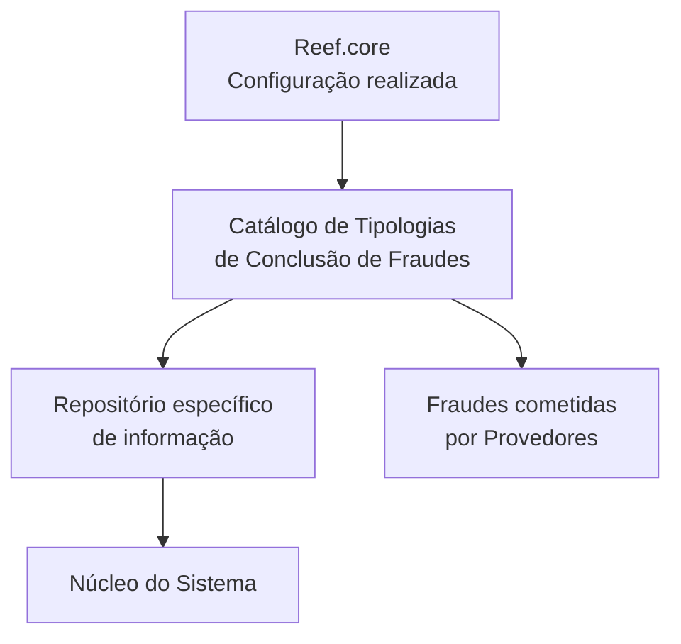

# Definição de Tipologias de Conclusão de Fraudes para Provedores

## 1. Metadados do Documento
- **Arquivo de Origem:** Não identificado; conteúdo bruto fornecido na solicitação.
- **Tipo de Documento:** Especificação funcional.
- **Domínio / Sistema:** Catálogo de Tipologias de Conclusão de Fraudes para Provedores; Reef.core.
- **Público-Alvo:** Operação, negócio e equipes responsáveis pela configuração do catálogo.
- **Data/Versão Identificada:** Não identificada.

---

## 2. Resumo Executivo & Contexto de Negócio

O documento descreve a definição e a configuração de um catálogo de **Tipos de Conclusão de Fraudes** aplicável a fraudes cometidas por Provedores. Funcionalmente, o núcleo do Sistema dispõe da capacidade de codificar esses tipos de conclusão em um repositório específico de informações.

Cada registro do catálogo é contextualizado por companhia e idioma. A companhia identifica o código organizacional sobre o qual a tipologia é definida, enquanto o idioma identifica a língua empregada na configuração e na descrição da conclusão.

A tipologia possui uma chave ou código de Tipo de Conclusão, uma descrição localizada por idioma e uma classificação que informa se o tipo deve ser considerado fraudulento. O catálogo também controla a inabilitação de registros e a data a partir da qual cada configuração passa a estar operacional.

O uso da data de validade permite manter histórico das alterações ao longo do tempo. A orientação operacional explícita do documento é que a configuração realizada a partir de **Reef.core** deve ser respeitada.

O documento referencia diretrizes, documentos funcionais, informações sobre Provedores e perguntas frequentes como materiais relacionados, porém não detalha seus conteúdos nem apresenta contratos técnicos, interfaces, métodos HTTP, estruturas JSON ou mecanismos de integração.

---

## 3. Arquitetura, Componentes & Tecnologias Envolvidas

Os elementos identificados são:

- **Núcleo do Sistema:** possui a capacidade funcional de codificar Tipos de Conclusão de Fraudes.
- **Repositório específico de informação:** local lógico mencionado para a codificação dos tipos de conclusão.
- **Catálogo de Tipologias de Conclusão de Fraudes:** estrutura de configuração contendo companhia, idioma, tipo, descrição, qualificação de fraude, inabilitação e data de validade.
- **Reef.core:** origem cuja configuração deve ser respeitada.
- **Provedores:** contexto de aplicação das tipologias de conclusão de fraudes.



**Nota de Análise:** o documento estabelece uma dependência funcional entre a configuração realizada em Reef.core e o catálogo de Tipologias de Conclusão de Fraudes. Não são detalhados protocolos, interfaces, tecnologias de persistência, fluxos de sincronização ou mecanismos técnicos de integração.

---

## 4. Regras de Negócio, Especificações Funcionais & Processos

1. O núcleo do Sistema pode codificar os Tipos de Conclusão de Fraudes em um repositório de informação específico.
2. A definição de uma tipologia deve considerar a **companhia** sobre a qual a configuração está sendo realizada.
3. A configuração deve registrar o **idioma** empregado na definição dos tipos de conclusão de fraudes cometidas por Provedores.
4. O atributo **Tipo de Conclusão** deve conter a chave ou o código do tipo de conclusão de fraude.
5. A **Descrição do Tipo de Conclusão** deve identificar a descrição correspondente ao idioma utilizado em sua definição.
6. O atributo **É Fraude?** deve qualificar e identificar o tipo de conclusão como tipo fraudulento.
7. A propriedade de **Inabilitação** deve indicar que o registro configurado está desativado ou inabilitado para utilização.
8. A **Data de Validade** deve indicar a data a partir da qual o registro configurado se torna operacional no Sistema.
9. O uso correto da Data de Validade deve permitir a manutenção de histórico das alterações realizadas ao longo do tempo.
10. A configuração realizada a partir de **Reef.core** deve ser respeitada.
11. A leitura de diretrizes e documentos funcionais relacionados é recomendada para evitar interpretações isoladas e incorretas do documento.

**Exemplos de descrições em espanhol apresentados no documento:**

| Código de tipo | Descrição |
| :--- | :--- |
| ACP | Procedente |
| RJT | Rechazado |

**Nota de Análise:** os códigos `ACP` e `RJT` são apresentados apenas como exemplos. O documento não define a expansão das siglas, não informa se representam todos os tipos possíveis e não estabelece regras adicionais para a classificação desses códigos.

---

## 5. Tabelas de Parâmetros, Ambientes e Estruturas de Dados

| Item / Parâmetro | Descrição / Função | Tipo / Valores / Formato | Ambiente / Observações |
| :--- | :--- | :--- | :--- |
| Companhia | Contém o código da companhia sobre a qual ocorre a definição dos Tipos de Conclusão. | Código de companhia; formato não detalhado. | Aplicável ao catálogo de Tipologias de Conclusão de Fraudes. |
| Idioma | Contém a chave do idioma utilizada na configuração dos tipos de conclusão de fraudes cometidas por Provedores. | Chave de idioma; exemplos: espanhol, inglês, português. | Utilizado na definição e na descrição da tipologia. |
| Tipo de Conclusão | Contém a chave ou o código do tipo de conclusão de fraude. | Código ou chave; formato não detalhado. | Exemplos apresentados: `ACP` e `RJT`. |
| Descrição do Tipo de Conclusão | Identifica a descrição do tipo de conclusão conforme o idioma usado em sua definição. | Texto localizado por idioma. | Exemplo em espanhol: `ACP` = `Procedente`; `RJT` = `Rechazado`. |
| É Fraude? | Qualifica e identifica o tipo de conclusão como Tipo Fraudulento. | Valor ou formato não detalhado. | O documento não define valores possíveis, tais como verdadeiro/falso. |
| Inabilitação | Estabelece que o registro configurado está desativado ou inabilitado para uso. | Valor ou formato não detalhado. | Afeta a possibilidade de utilização do registro. |
| Data de Validade | Informa a data a partir da qual o registro configurado está operacional no Sistema. | Data; formato não detalhado. | Seu uso correto permite manter histórico de alterações. |
| Reef.core | Origem de configuração que deve ser respeitada. | Sistema/plataforma citada. | Não são especificadas integração, interface ou regras de precedência além da obrigação de respeitar a configuração. |
| Repositório específico de informação | Repositório no qual o núcleo do Sistema pode codificar Tipos de Conclusão de Fraudes. | Tecnologia e estrutura não detalhadas. | Não há URL, servidor, banco de dados, rota de log ou ambiente identificado. |

---

## 6. Bateria de Perguntas & Respostas para RAG (FAQ Sintético)

### P1: Qual é o objetivo do catálogo de Tipologias de Conclusão de Fraudes?
**R:** O catálogo permite que o núcleo do Sistema codifique os Tipos de Conclusão de Fraudes em um repositório específico de informações, no contexto de fraudes cometidas por Provedores.

### P2: Qual atributo identifica a companhia da configuração?
**R:** O atributo **Companhia** contém o código da companhia sobre a qual a definição dos Tipos de Conclusão está sendo realizada.

### P3: Para que serve o atributo Idioma no catálogo?
**R:** O atributo **Idioma** contém a chave do idioma empregada na configuração dos tipos de conclusão de fraudes cometidas por Provedores. O documento cita espanhol, inglês e português como exemplos.

### P4: O que deve ser armazenado no campo Tipo de Conclusão?
**R:** O campo **Tipo de Conclusão** deve conter a chave ou o código do tipo de conclusão de fraude. O documento apresenta `ACP` e `RJT` como exemplos de códigos.

### P5: Como a descrição de um Tipo de Conclusão é determinada?
**R:** A **Descrição do Tipo de Conclusão** identifica a descrição conforme o idioma empregado na definição. No exemplo em espanhol, `ACP` corresponde a `Procedente` e `RJT` corresponde a `Rechazado`.

### P6: Qual é a função da propriedade É Fraude?
**R:** A propriedade **É Fraude?** qualifica e identifica um Tipo de Conclusão como Tipo Fraudulento. O documento não detalha os valores, o formato do campo ou critérios adicionais de classificação.

### P7: O que ocorre quando um registro possui a propriedade de Inabilitação?
**R:** A propriedade de **Inabilitação** estabelece que o registro configurado está desativado ou inabilitado para ser utilizado.

### P8: Qual é o propósito da Data de Validade?
**R:** A **Data de Validade** indica a data a partir da qual um registro configurado torna-se operacional no Sistema. Seu uso correto permite manter um histórico das alterações efetuadas ao longo do tempo.

### P9: Qual regra operacional deve ser observada em relação ao Reef.core?
**R:** A configuração realizada a partir de **Reef.core** deve ser respeitada. O documento não detalha como essa configuração é distribuída, validada ou integrada ao catálogo.

### P10: O documento informa APIs, métodos HTTP ou contratos JSON do catálogo?
**R:** Não. O documento descreve propriedades funcionais do catálogo, mas não detalha APIs, métodos HTTP, contratos JSON, URLs, credenciais, tecnologias de banco de dados ou rotas de log.

---

## 7. Glossário de Termos, Siglas & Conceitos-Chave

- **ACP:** Código de Tipo de Conclusão apresentado como exemplo; sua descrição em espanhol é `Procedente`. O documento não informa a expansão da sigla.
- **Catálogo:** Estrutura de configuração dos Tipos de Conclusão de Fraudes.
- **Data de Validade:** Data a partir da qual um registro configurado fica operacional no Sistema.
- **É Fraude?:** Propriedade que qualifica e identifica um Tipo de Conclusão como Tipo Fraudulento.
- **Inabilitação:** Propriedade que indica que um registro está desativado ou inabilitado para uso.
- **Provedores:** Entidades no contexto das fraudes cujos tipos de conclusão são configurados pelo catálogo.
- **Reef.core:** Sistema ou origem de configuração mencionada cuja configuração deve ser respeitada.
- **RJT:** Código de Tipo de Conclusão apresentado como exemplo; sua descrição em espanhol é `Rechazado`. O documento não informa a expansão da sigla.
- **Tipo de Conclusão:** Chave ou código que identifica uma conclusão de fraude.

---

## 8. Notas Críticas, Riscos & Limitações

- O documento não identifica arquivo de origem, autor, data, versão ou responsável pela manutenção.
- O documento não detalha mecanismos técnicos para a codificação no repositório de informação.
- Não são fornecidos contratos de integração, endpoints, protocolos, métodos HTTP, estruturas JSON, banco de dados, URLs, servidores, portas ou caminhos de logs.
- O documento exige respeito à configuração proveniente de Reef.core, mas não define regras de sincronização, precedência, tratamento de conflito ou validação dessa configuração.
- Os valores permitidos para **É Fraude?** e **Inabilitação** não são especificados.
- O formato da Data de Validade, regras de sobreposição temporal e comportamento para registros expirados não são especificados.
- As referências a diretrizes, documentos funcionais, Provedores e perguntas frequentes não incluem o conteúdo dos documentos vinculados.
- A interpretação isolada do documento pode induzir a erro; a leitura dos documentos funcionais relacionados é recomendada pelo próprio conteúdo.

---

## 9. Conteúdo Bruto Estruturado (Referência Fiel)

```text
--- [PÁGINA 1 DE 3] ---

DEFINICIÓN de TIPOLOGÍAS de CONCLUSIÓN
de FRAUDES
Objetivo
Funcionalmente, el núcleo del Sistema cuenta con la posibilidad de codificar los Tipos de Conclusión
de los Fraudes en un repositorio de información específico.
Propiedades Operativas
Otras Propiedades
Propiedades Operativas
Compañía
Este Atributo del catálogo contiene el código de la compañía sobre la que se está realizando la
definición de los tipos de Conclusión.
Idioma
Esta propiedad contiene la clave del Idioma empleado en la configuración de los tipos de conclusión
de los fraudes cometidos por los Proveedores como por ejemplo: español, inglés, Portugués, ...
Tipo de Conclusión
Este Atributo contiene la clave o el código del tipo de conclusión del Fraude.
 /
 CF
Home Solutions APIs Documentation Zeus
EN


--- [PÁGINA 2 DE 3] ---

Descripción del Tipo de Conclusión
Este Atributo del catálogo de configuración identifica la descripción del tipo de conclusión de acuerdo
con el idioma utilizado en su definición.
A modo de ejemplo y si el idioma empleado en la definición fuera el Español...
TIPO DESCRIPCIÓN
ACP Procedente
RJT Rechazado
... ...
¿Es Fraude?
Esta propiedad del catálogo califica e identifica al tipo de conclusión como Tipo Fraudulento.
Otras Propiedades
Inhabilitación
Esta propiedad establece que el Registro configurado está desactivado o inhabilitado para ser
utilizado.
Fecha de Validez
Esta propiedad le indica al Sistema la fecha a partir de la cual el registro configurado está operativo
en el sistema por lo que su correcto uso permite tener un histórico de los cambios efectuados a lo
largo del tiempo.
Vínculos
Relación de Directrices y Documentos funcionales cuya lectura recomendada para evitar que la
interpretación aislada del presente documento pueda conducir a error.
Proveedores
Preguntas frecuentes
(1) ¿Existe alguna recomendación operativa que deba ser tomada en consideración localmente en la
codificación, uso y definición del catálogo de Tipologías de Conclusión de los Fraudes para los
Proveedores?


--- [PÁGINA 3 DE 3] ---

Se debe respetar la configuración realizada desde Reef.core
```
