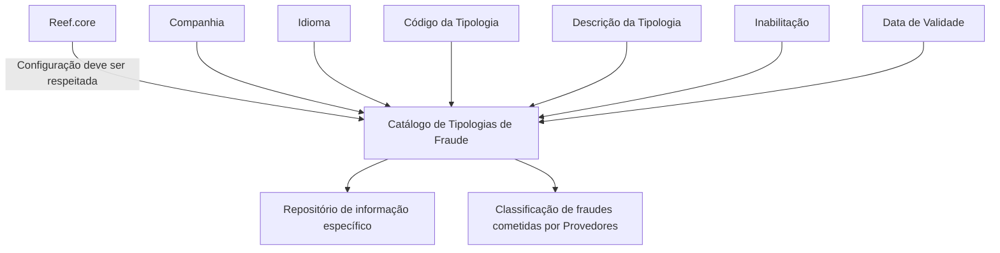

# Catálogo de Tipologias de Fraude para Provedores — Definição e Propriedades Operacionais

## 1. Metadados do Documento
- **Arquivo de Origem:** Não identificado no conteúdo fornecido
- **Tipo de Documento:** Especificação Funcional
- **Domínio / Sistema:** Tipologias de Fraude para Provedores / Reef.core
- **Público-Alvo:** Desenvolvedores, Arquitetos, Operação e Analistas Funcionais
- **Data/Versão Identificada:** Não identificada

---

## 2. Resumo Executivo & Contexto de Negócio

O documento define o catálogo de **Tipologias de Fraude** cometidas por provedores. Funcionalmente, o núcleo do sistema permite configurar essas tipologias em um repositório específico de informações.

A configuração do catálogo inclui atributos operacionais para identificar a companhia, o idioma, o código da tipologia e a descrição associada à tipologia de fraude. A descrição é dependente do idioma utilizado na definição do registro.

O catálogo também possui propriedades para controlar a disponibilidade e a vigência dos registros. A propriedade de inabilitação desativa registros configurados, enquanto a data de validade determina a partir de quando um registro se torna operacional no sistema.

O uso correto da data de validade é apresentado como necessário para manter o histórico das alterações efetuadas ao longo do tempo. O documento recomenda ainda a leitura dos materiais relacionados a provedores e perguntas frequentes para evitar interpretações isoladas incorretas.

A recomendação operacional explícita é respeitar a configuração realizada no **Reef.core** ao codificar, utilizar ou definir o catálogo de tipologias de fraude para provedores.

---

## 3. Arquitetura, Componentes & Tecnologias Envolvidas

O documento cita os seguintes elementos funcionais:

- **Núcleo do Sistema:** componente funcional com capacidade de configurar as tipologias de fraude.
- **Repositório de informação específico:** local lógico de armazenamento das configurações das tipologias de fraude.
- **Catálogo de Tipologias de Fraude:** estrutura configurável para classificar fraudes cometidas por provedores.
- **Reef.core:** sistema ou origem de configuração cuja parametrização deve ser respeitada.
- **Home Solutions APIs Documentation Zeus:** texto exibido no conteúdo bruto; o documento não detalha a função dessa referência.
- **Provedores:** entidade associada às fraudes classificadas pelo catálogo.

> *Nota de Análise: O conteúdo não descreve componentes técnicos, APIs, métodos HTTP, contratos JSON, bancos de dados, ambientes, URLs ou integrações entre sistemas.*



---

## 4. Regras de Negócio, Especificações Funcionais & Processos

### 4.1 Objetivo funcional

O núcleo do sistema possui a possibilidade de configurar as tipologias de fraude em um repositório de informação específico. As tipologias abrangem fraudes cometidas por provedores.

### 4.2 Propriedades operacionais do catálogo

1. **Companhia**
   - O atributo contém o código da companhia sobre a qual está sendo definida a taxonomia de fraudes.

2. **Idioma**
   - A propriedade contém a chave do idioma utilizada na configuração das tipologias de fraude cometidas por provedores.
   - Exemplos de idiomas mencionados: espanhol, inglês e português.

3. **Tipologia do Fraude**
   - O campo identifica a chave ou o código da tipologia de fraude.

4. **Descrição**
   - O atributo identifica a descrição da tipologia de fraude cometida pelo provedor.
   - A descrição é estabelecida de acordo com o idioma utilizado em sua definição.

### 4.3 Controle de disponibilidade e vigência

1. **Inabilitação**
   - Determina que o registro configurado está desativado ou inabilitado para utilização.

2. **Data de Validade**
   - Indica ao sistema a data a partir da qual o registro configurado se torna operacional.
   - O uso correto da data de validade permite manter um histórico das alterações realizadas ao longo do tempo.

### 4.4 Regra operacional obrigatória

A codificação, o uso e a definição do catálogo de tipologias de fraude para provedores devem respeitar a configuração efetuada a partir do **Reef.core**.

### 4.5 Referências funcionais relacionadas

O documento indica vínculos com diretrizes e documentos funcionais cuja leitura é recomendada, a fim de evitar erro decorrente da interpretação isolada do documento:

- Provedores
- Perguntas frequentes

> *Nota de Análise: O conteúdo não especifica o formato técnico dos códigos de companhia, idioma ou tipologia; não detalha validações adicionais; e não informa como ocorre a consulta, manutenção ou publicação dos registros configurados.*

---

## 5. Tabelas de Parâmetros, Ambientes e Estruturas de Dados

| Item / Parâmetro | Descrição / Função | Tipo / Valores / Formato | Ambiente / Observações |
| :--- | :--- | :--- | :--- |
| Companhia | Contém o código da companhia para a qual a taxonomia de fraudes está sendo definida. | Código de companhia; formato não detalhado. | Aplicável à definição da taxonomia de fraudes. |
| Idioma | Contém a chave do idioma empregada na configuração das tipologias de fraude cometidas por provedores. | Chave de idioma; exemplos: espanhol, inglês, português. | A descrição da tipologia depende do idioma utilizado. |
| Tipologia do Fraude | Identifica a chave ou o código da tipologia de fraude. | Código ou chave; formato não detalhado. | Aplicável a fraudes cometidas por provedores. |
| Descrição | Identifica a descrição da tipologia de fraude cometida pelo provedor. | Texto descritivo por idioma. | Deve corresponder ao idioma utilizado na definição. |
| Inabilitação | Define que um registro configurado está desativado ou inabilitado para uso. | Estado de inabilitação; valores não detalhados. | Impede a utilização do registro configurado. |
| Data de Validade | Define a data a partir da qual o registro se torna operacional no sistema. | Data; formato não detalhado. | Suporta histórico de alterações ao longo do tempo. |
| Reef.core | Origem de configuração que deve ser respeitada. | Sistema/referência citada. | Regra operacional aplicável à codificação, uso e definição do catálogo. |
| Repositório de informação específico | Repositório onde o núcleo do sistema configura as tipologias de fraude. | Estrutura não detalhada. | Não há detalhes sobre tecnologia, localização ou acesso. |

### Exemplos de motivos e descrições em espanhol

| Código / Motivo | Descrição |
| :--- | :--- |
| FNC | Fraude no Confirmado |
| FRC | Fraude Confirmado |
| FRP | Fraude Parcial |
| FWE | Fraude Identificado sin Pruebas |
| PEG | Pago Ex-Gratia |
| POC | Pago a Criterio |

---

## 6. Bateria de Perguntas & Respostas para RAG (FAQ Sintético)

### P1: Qual é o objetivo do catálogo de Tipologias de Fraude para Provedores?
**R:** O catálogo permite que o núcleo do sistema configure tipologias de fraude cometidas por provedores em um repositório de informação específico.

### P2: Qual atributo relaciona uma definição de taxonomia de fraude a uma companhia?
**R:** O atributo **Companhia** contém o código da companhia sobre a qual a taxonomia de fraudes está sendo definida.

### P3: Como o idioma influencia uma tipologia de fraude?
**R:** A propriedade **Idioma** contém a chave do idioma usada na configuração das tipologias de fraude. A descrição da tipologia é definida de acordo com o idioma utilizado, com exemplos citados de espanhol, inglês e português.

### P4: O que o campo Tipologia do Fraude identifica?
**R:** O campo **Tipologia do Fraude** identifica a chave ou o código da tipologia de fraude.

### P5: Qual é a finalidade da propriedade Inabilitação?
**R:** A propriedade **Inabilitação** estabelece que o registro configurado está desativado ou inabilitado para ser utilizado.

### P6: Quando um registro configurado se torna operacional?
**R:** Um registro configurado torna-se operacional a partir da data indicada na propriedade **Data de Validade**.

### P7: Por que a Data de Validade é importante no catálogo?
**R:** A Data de Validade informa a partir de quando o registro está operativo no sistema e, quando usada corretamente, permite manter o histórico das alterações efetuadas ao longo do tempo.

### P8: Qual recomendação deve ser seguida ao codificar ou usar o catálogo de tipologias de fraude?
**R:** Deve-se respeitar a configuração realizada a partir do **Reef.core** durante a codificação, o uso e a definição do catálogo de tipologias de fraude para provedores.

### P9: Quais exemplos de códigos de motivos de fraude são apresentados no documento?
**R:** O documento apresenta os códigos FNC, FRC, FRP, FWE, PEG e POC, com descrições em espanhol para fraude não confirmada, fraude confirmada, fraude parcial, fraude identificada sem provas, pagamento ex-gratia e pagamento a critério.

### P10: O documento informa APIs ou contratos técnicos para manutenção do catálogo?
**R:** Não. O conteúdo fornecido não detalha APIs, métodos HTTP, contratos JSON, esquemas de banco de dados, mecanismos de autenticação ou procedimentos técnicos de manutenção.

### P11: Quais documentos ou temas relacionados devem ser consultados para evitar interpretações incorretas?
**R:** O documento recomenda a leitura dos vínculos relacionados a **Provedores** e **Perguntas frequentes**, além de outras diretrizes e documentos funcionais associados.

---

## 7. Glossário de Termos, Siglas & Conceitos-Chave

- **Catálogo de Tipologias de Fraude:** estrutura de configuração utilizada para classificar tipologias de fraude cometidas por provedores.
- **Companhia:** atributo que contém o código da companhia para a qual uma taxonomia de fraudes é definida.
- **Data de Validade:** data a partir da qual um registro configurado se torna operacional no sistema.
- **FNC:** código associado a “Fraude no Confirmado”.
- **FRC:** código associado a “Fraude Confirmado”.
- **FRP:** código associado a “Fraude Parcial”.
- **FWE:** código associado a “Fraude Identificado sin Pruebas”.
- **Inabilitação:** propriedade que define que um registro está desativado ou indisponível para uso.
- **PEG:** código associado a “Pago Ex-Gratia”.
- **POC:** código associado a “Pago a Criterio”.
- **Provedores:** entidade associada às fraudes classificadas pelo catálogo.
- **Reef.core:** origem de configuração que deve ser respeitada na codificação, uso e definição do catálogo.
- **Taxonomia de Fraudes:** organização ou classificação de tipologias de fraude aplicável a uma companhia.

---

## 8. Notas Críticas, Riscos & Limitações

- O documento não identifica o arquivo de origem, a data, a versão ou o responsável pela documentação.
- Não há detalhamento de arquitetura técnica, integrações, APIs, bancos de dados, mecanismos de persistência ou ambientes.
- Não são definidos formatos, tamanhos, obrigatoriedade ou regras de validação para os campos Companhia, Idioma, Tipologia do Fraude, Descrição e Data de Validade.
- A configuração no **Reef.core** é uma dependência operacional explícita; divergências entre o catálogo e essa configuração podem comprometer a codificação, o uso ou a definição das tipologias.
- A interpretação isolada do documento pode conduzir a erro; o próprio conteúdo recomenda consultar diretrizes e documentos funcionais relacionados a provedores e perguntas frequentes.
- Não há detalhamento adicional sobre os métodos de manutenção, aprovação, auditoria, versionamento ou exclusão dos registros do catálogo.

---

## 9. Conteúdo Bruto Estruturado (Referência Fiel)

```text
--- [PÁGINA 1 DE 3] ---

DEFINICIÓN de las TIPOLOGÍAS de los
FRAUDES

Objetivo

Funcionalmente, el núcleo del Sistema cuenta con la posibilidad de configurar las Tipologías de los
Fraudes en un repositorio de información específico.

Propiedades Operativas

Otras Propiedades

Propiedades Operativas

Compañía

Este Atributo del catálogo contiene el código de la compañía sobre la que se está realizando la
definición de la Taxonomía de los Fraudes.

Idioma

Esta propiedad contiene la clave del Idioma empleado en la configuración de las Tipologías de los
Fraudes cometidos por los Proveedores como por ejemplo: español, inglés, Portugués, ...

Tipología del Fraude

Este campo identifica la clave o el código de la Tipología del Fraude.

 /
 CF
Home Solutions APIs Documentation Zeus
EN


--- [PÁGINA 2 DE 3] ---

Descripción

Este Atributo del catálogo de configuración identifica la descripción de la Tipología del Fraude
cometido por el Proveedor de acuerdo con el idioma utilizado en su definición.

A modo de ejemplo y si el idioma empleado en la definición fuera el Español...

MOTIVO DESCRIPCIÓN
FNC Fraude no Confirmado
FRC Fraude Confirmado
FRP Fraude Parcial
FWE Fraude Identificado sin Pruebas
PEG Pago Ex-Gratia
POC Pago a Criterio

Otras Propiedades

Inhabilitación

Esta propiedad establece que el Registro configurado está desactivado o inhabilitado para ser
utilizado.

Fecha de Validez

Esta propiedad le indica al Sistema la fecha a partir de la cual el registro configurado está operativo
en el sistema por lo que su correcto uso permite tener un histórico de los cambios efectuados a lo
largo del tiempo.

Vínculos

Relación de Directrices y Documentos funcionales cuya lectura recomendada para evitar que la
interpretación aislada del presente documento pueda conducir a error.

Proveedores

Preguntas frecuentes


--- [PÁGINA 3 DE 3] ---

(1) ¿Existe alguna recomendación operativa que deba ser tomada en consideración localmente en la
codificación, uso y definición del catálogo de las Tipologías de los Fraudes para los Proveedores?

Se debe respetar la configuración realizada desde Reef.core
```
