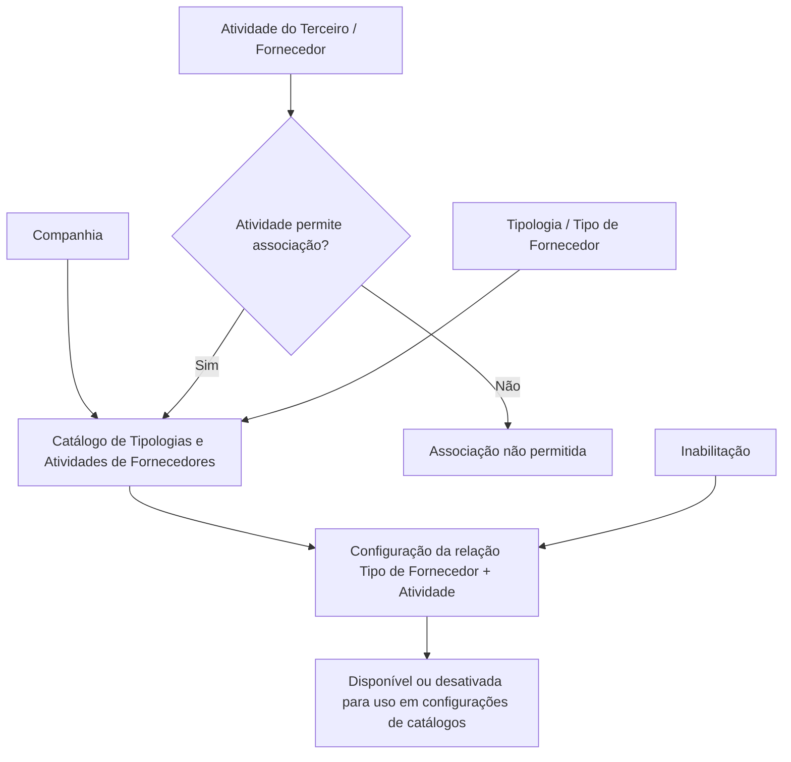

# Configuração de Tipologias de Fornecedores por Atividade

## 1. Metadados do Documento
- **Arquivo de Origem:** Não identificado no conteúdo fornecido
- **Tipo de Documento:** Especificação Funcional
- **Domínio / Sistema:** Catálogo de Tipologias e Atividades de Fornecedores — MAPFRE
- **Público-Alvo:** Negócio, configuração de catálogos e operação
- **Data/Versão Identificada:** Não identificada

---

## 2. Resumo Executivo & Contexto de Negócio

O documento descreve a configuração de um catálogo que relaciona **Tipologias de Fornecedores** às **Atividades de Terceiros/Fornecedores**. O núcleo do sistema permite associar esses dois elementos em uma estrutura específica de informação.

O catálogo é inicialmente entregue às instalações sem conteúdo. Dessa forma, a entidade MAPFRE deve definir a utilização, codificação e manutenção do catálogo conforme a conveniência dos processos corporativos que o utilizarem ou considerarem.

A configuração é realizada por companhia e utiliza atributos que identificam a atividade do terceiro, a tipologia do fornecedor e o estado de inabilitação da relação configurada. A atividade somente pode ser registrada quando a própria atividade do terceiro permitir essa associação.

O documento não define uma preferência ou recomendação para padronizar a codificação do catálogo. Também recomenda a leitura do documento funcional relacionado **“Actividades de los Terceros”** para evitar interpretações isoladas ou incorretas.

---

## 3. Arquitetura, Componentes & Tecnologias Envolvidas

Componentes funcionais identificados:

- **Núcleo do Sistema:** disponibiliza a associação entre tipologias e atividades de fornecedores.
- **Catálogo de Tipologias e Atividades de Fornecedores:** repositório específico para as relações configuradas.
- **Companhia:** contexto organizacional ao qual a relação pertence.
- **Atividade do Terceiro/Fornecedor:** atividade associável quando permitida pela própria atividade.
- **Tipologia / Tipo de Fornecedor:** código ou chave do tipo de fornecedor configurado.
- **Inabilitação:** estado que desativa o tipo de fornecedor para a atividade configurada.
- **Documento relacionado:** “Actividades de los Terceros”.



**Nota de Análise:** O conteúdo menciona os termos “CF”, “Home Solutions APIs Documentation”, “Zeus” e “EN” como fragmentos no texto extraído, mas não fornece contexto suficiente para classificá-los como sistemas, tecnologias, ambientes ou componentes funcionais.

---

## 4. Regras de Negócio, Especificações Funcionais & Processos

1. O núcleo do sistema permite associar e relacionar tipologias e atividades de fornecedores.
2. A relação entre tipologia e atividade é mantida em um catálogo de informação específico.
3. O catálogo é inicialmente entregue vazio de conteúdo às instalações.
4. Cada relação entre tipo de fornecedor e atividade deve estar vinculada a uma companhia, por meio do código da companhia.
5. O código da atividade do terceiro/fornecedor somente é estabelecido quando a atividade do terceiro permitir essa associação.
6. O documento apresenta como exemplos de atividades de terceiros: **talleres**, **clínicas**, **hospitais** e **peritos**.
7. A tipologia determina o código ou a chave do tipo de fornecedor configurado no catálogo.
8. A propriedade de inabilitação determina que um tipo de fornecedor, para determinada atividade configurada, está desativado ou inabilitado para uso nas configurações dos catálogos.
9. Não existe preferência ou recomendação para estabelecer ou padronizar a codificação no sistema.
10. A entidade MAPFRE deve avaliar a conveniência de utilizar o catálogo conforme os processos corporativos em que o catálogo possa ser utilizado ou considerado.
11. A leitura do documento “Actividades de los Terceros” é recomendada para reduzir o risco de interpretação isolada e incorreta deste documento.

---

## 5. Tabelas de Parâmetros, Ambientes e Estruturas de Dados

| Item / Parâmetro | Descrição / Função | Tipo / Valores / Formato | Ambiente / Observações |
| :--- | :--- | :--- | :--- |
| Catálogo de Tipologias e Atividades de Fornecedores | Armazena a associação e a relação entre tipologias e atividades de fornecedores. | Catálogo de informação específico. | Entregue inicialmente vazio às instalações. |
| Companhia | Contém o código da companhia sobre a qual está sendo realizada a relação entre tipo e atividade de fornecedor. | Código de companhia. | Define o contexto da relação configurada. |
| Código de Atividade do Terceiro | Estabelece o código da atividade do terceiro/fornecedor no sistema. | Código de atividade. | Aplicável somente quando a atividade do terceiro permitir. |
| Atividade do Terceiro | Atividade associada à tipologia do fornecedor. | Exemplos citados: talleres, clínicas, hospitais, peritos. | A permissão da própria atividade condiciona a associação. |
| Tipologia | Determina o código ou a chave do tipo de fornecedor configurado. | Código ou chave de tipo de fornecedor. | Configurada no catálogo. |
| Inabilitação | Define que o tipo de fornecedor para a atividade configurada está desativado ou inabilitado. | Estado de inabilitação. | Impede o uso em configurações de catálogos. |
| Codificação do catálogo | Forma de codificar os registros do catálogo. | Não padronizada pelo documento. | MAPFRE deve analisar sua conveniência conforme os processos corporativos. |
| Documento relacionado | Material recomendado para interpretação complementar. | “Actividades de los Terceros”. | Sua leitura é recomendada para evitar interpretação isolada. |

---

## 6. Bateria de Perguntas & Respostas para RAG (FAQ Sintético)

### P1: Qual é o objetivo do catálogo de Tipologias e Atividades de Fornecedores?
**R:** O catálogo permite associar e relacionar tipologias de fornecedores às atividades de terceiros/fornecedores em uma estrutura específica de informação disponibilizada pelo núcleo do sistema.

### P2: O catálogo de Tipologias e Atividades de Fornecedores já possui dados quando é entregue?
**R:** Não. O documento informa que o catálogo é entregue inicialmente às instalações vazio de conteúdo.

### P3: Qual atributo identifica a companhia de uma relação entre tipo e atividade de fornecedor?
**R:** O atributo **Companhia** contém o código da companhia sobre a qual está sendo realizada a relação entre o tipo de fornecedor e a atividade de fornecedor.

### P4: Em que condição o código de atividade do terceiro pode ser estabelecido no sistema?
**R:** O código de atividade do terceiro/fornecedor pode ser estabelecido somente quando a atividade do terceiro permitir essa associação.

### P5: Quais exemplos de atividades de terceiros são citados no documento?
**R:** O documento cita como exemplos de atividades de terceiros: talleres, clínicas, hospitais e peritos.

### P6: O que representa a propriedade Tipologia?
**R:** A propriedade **Tipologia** determina o código ou a chave do tipo de fornecedor que está sendo configurado no catálogo.

### P7: Qual é o efeito da propriedade Inabilitação?
**R:** A propriedade **Inabilitação** indica que o tipo de fornecedor, para a atividade configurada, está desativado ou inabilitado e não pode ser utilizado nas configurações dos catálogos.

### P8: O documento define um padrão obrigatório de codificação para o catálogo?
**R:** Não. O documento declara que não existe preferência ou recomendação para estabelecer ou padronizar a codificação no sistema.

### P9: Quem deve decidir sobre a conveniência de utilização do catálogo?
**R:** A entidade MAPFRE deve analisar a conveniência de utilizar o catálogo de acordo com os processos da companhia nos quais o catálogo possa ser utilizado ou considerado.

### P10: Qual documento funcional deve ser consultado em conjunto com esta especificação?
**R:** O documento recomenda a leitura de **“Actividades de los Terceros”**, pois a interpretação isolada da presente especificação pode conduzir a erro.

---

## 7. Glossário de Termos, Siglas & Conceitos-Chave

- **Atividade do Terceiro:** atividade atribuída a um terceiro ou fornecedor e que pode permitir a associação a uma tipologia de fornecedor.
- **Catálogo:** estrutura específica de informação usada para manter relações entre tipologias e atividades de fornecedores.
- **Companhia:** entidade organizacional identificada pelo código sobre o qual a relação entre tipo e atividade é configurada.
- **Inabilitação:** propriedade que torna um tipo de fornecedor desativado ou indisponível para uso em configurações de catálogos.
- **MAPFRE:** entidade mencionada como responsável por analisar a conveniência de utilizar o catálogo conforme seus processos.
- **Tipologia / Tipo de Fornecedor:** código ou chave que identifica o tipo de fornecedor configurado no catálogo.

---

## 8. Notas Críticas, Riscos & Limitações

- O catálogo é entregue vazio; o conteúdo necessário para operação deve ser definido localmente.
- O documento não estabelece convenção, padrão ou recomendação de codificação.
- A associação depende de uma permissão da atividade do terceiro, mas os critérios técnicos ou funcionais que definem essa permissão não são detalhados.
- O documento não descreve interfaces, métodos HTTP, contratos JSON, persistência, validações sistêmicas adicionais, perfis de acesso ou fluxos de aprovação.
- A propriedade de inabilitação é descrita funcionalmente, mas o documento não especifica o comportamento de registros existentes após a inabilitação.
- A interpretação isolada do documento pode levar a erro; a leitura de **“Actividades de los Terceros”** é expressamente recomendada.
- Os fragmentos “CF”, “Home Solutions APIs Documentation”, “Zeus” e “EN” não possuem explicação adicional no conteúdo fornecido.

---

## 9. Conteúdo Bruto Estruturado (Referência Fiel)

```text
--- [PÁGINA 1 DE 2] ---

CONFIGURACIÓN de las TIPOLOGÍAS de los
PROVEEDORES por ACTIVIDAD
Objetivo
Funcionalmente, el núcleo del Sistema cuenta con la posibilidad de asociar y relacionar las
Tipologías y las Actividades de los Proveedores en un catálogo de información específico que se
entrega inicialmente a las instalaciones vacío de contenido.
Propiedades
Otras Propiedades
Propiedades
Compañía
Este Atributo del catálogo contiene el código de la compañía sobre la que se está realizando la
relación del Tipo y Actividad de Proveedor.
Código de Actividad del Tercero
Esta propiedad establece en el sistema el código de la Actividad del Tercero-Proveedor siempre y
cuando la Actividad del Tercero así lo permita (Como por ejemplo en Talleres, Clínicas, Hospitales,
Peritos, ...)
Tipología
 / 
 CF
Home Solutions APIs Documentation Zeus
EN


--- [PÁGINA 2 DE 2] ---

Este Atributo determina el código o clave del Tipo de Proveedor que se está configurando en el
catálogo.
Otras Propiedades
Inhabilitación
Esta propiedad establece que el Tipo de Proveedor para la Actividad que se está configurando está
desactivado o inhabilitado para poder ser utilizada en las configuraciones de los catálogos.
Vínculos
Relación de Directrices y Documentos funcionales cuya lectura recomendada para evitar que la
interpretación aislada del presente documento pueda conducir a error.
Actividades de los Terceros
Preguntas frecuentes
(1) ¿Existe alguna recomendación operativa que deba ser tomada en consideración localmente en la
codificación, uso y definición del catálogo de Tipologías y Actividades de los Proveedores?
No existe una preferencia ni recomendación para establecer o estandarizar en el sistema su
codificación, si bien la entidad MAPFRE debe analizar la conveniencia de utilizarlo de acuerdo con
los procesos de la compañía en los que este catálogo de información pueda ser
utilizado/considerado.
```
