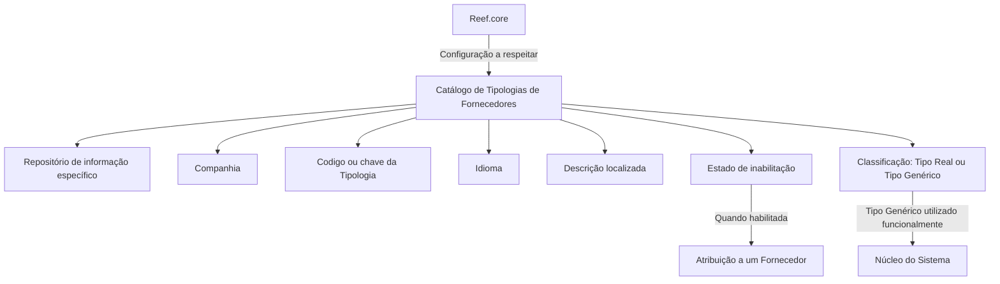

# Definição das Tipologias de Fornecedores no Catálogo do Sistema

## 1. Metadados do Documento
- **Arquivo de Origem:** `Não informado no conteúdo extraído`
- **Tipo de Documento:** `Especificação Técnica`
- **Domínio / Sistema:** `Catálogo de Tipologias de Fornecedores / núcleo do Sistema / Reef.core`
- **Público-Alvo:** `Não identificado explicitamente`
- **Data/Versão Identificada:** `Não identificada`

---

## 2. Resumo Executivo & Contexto de Negócio

O documento define as propriedades funcionais necessárias para cadastrar e administrar Tipologias de Fornecedores em um repositório de informação específico do núcleo do Sistema. O repositório é entregue inicialmente vazio, portanto a configuração das tipologias faz parte da parametrização inicial ou manutenção do catálogo.

Cada definição de Tipologia de Fornecedor é contextualizada por Companhia, código de Tipologia e Idioma. A combinação desses atributos permite manter descrições localizadas para uma mesma tipologia, como os exemplos em espanhol `AGENCIA` e `MULTIMARCA`.

O catálogo também controla o estado de habilitação de uma Tipologia de Fornecedor. Uma tipologia inabilitada não pode ser utilizada em sua atribuição a um Fornecedor, o que estabelece uma restrição funcional explícita para o processo de associação de fornecedores.

O documento diferencia Tipos Reais de Tipos Genéricos. Um Tipo Genérico é utilizado funcionalmente pelo núcleo do Sistema e existe uma restrição de unicidade: pode haver somente um registro com a propriedade `Tipo Real?` desativada para cada subconjunto de Companhia e idioma.

A recomendação operacional principal é respeitar a configuração realizada a partir do `Reef.core`. O documento também referencia a leitura das diretrizes e documentos funcionais relacionados a Atividades de Terceiros para evitar interpretações isoladas ou incorretas.

---

## 3. Arquitetura, Componentes & Tecnologias Envolvidas

Os componentes e conceitos identificados são:

| Componente / Conceito | Papel identificado no documento |
| :--- | :--- |
| Núcleo do Sistema | Utiliza funcionalmente Tipos Genéricos de Fornecedor. |
| Repositório de informação específico | Armazena a codificação das Tipologias de Fornecedores; é entregue inicialmente sem conteúdo. |
| Catálogo de Tipologias de Fornecedores | Estrutura funcional onde são configurados Companhia, Tipologia, Idioma, descrição, inabilitação e classificação de Tipo Real ou Genérico. |
| Reef.core | Origem de configuração que deve ser respeitada durante a codificação, uso e definição do catálogo. |
| Fornecedor | Entidade à qual uma Tipologia de Fornecedor pode ser atribuída, desde que a tipologia não esteja inabilitada. |
| Atividades de Terceiros | Documento funcional relacionado, recomendado para leitura complementar. |
| Home Solutions APIs Documentation Zeus | Texto apresentado no conteúdo bruto como elemento de navegação/interface; não há detalhamento técnico adicional. |
| CF | Sigla exibida no conteúdo bruto; não há definição fornecida. |

O documento não detalha tecnologias, protocolos, APIs, métodos HTTP, contratos JSON, servidores, URLs operacionais, portas ou ambientes de implantação.



> **Nota de Análise:** O diagrama representa exclusivamente as relações funcionais explicitadas no documento. O conteúdo não descreve interfaces técnicas, persistência física, integrações de API ou sequência operacional detalhada.

---

## 4. Regras de Negócio, Especificações Funcionais & Processos

### 4.1. Existência do repositório de Tipologias de Fornecedores

1. O núcleo do Sistema possui a capacidade funcional de codificar Tipologias de Fornecedores.
2. As Tipologias de Fornecedores são mantidas em um repositório de informação específico.
3. O repositório específico é entregue inicialmente vazio de conteúdo.
4. A ausência inicial de conteúdo implica que as tipologias devem ser configuradas no catálogo conforme as regras documentadas.

### 4.2. Contextualização da Tipologia de Fornecedor

1. O atributo `Companhia` contém o código da companhia para a qual está sendo realizada a definição do Tipo de Fornecedor.
2. O atributo `Tipologia` determina o código ou a chave do Tipo de Fornecedor configurado no catálogo.
3. O atributo `Idioma` é a chave do idioma usado na configuração das Tipologias de Fornecedores.
4. O documento cita como exemplos de idiomas: espanhol, inglês e turco.
5. A propriedade `Descrição do Tipo de Fornecedor` contém a denominação ou descrição da Tipologia de Fornecedor de acordo com o idioma utilizado na definição.

### 4.3. Exemplos de descrição em espanhol

Quando o idioma da definição é espanhol, o documento apresenta os seguintes exemplos:

| Tipo | Descrição |
| :--- | :--- |
| `1` | `AGENCIA` |
| `2` | `MULTIMARCA` |

### 4.4. Regra de inabilitação

1. A propriedade `Inhabilitación` estabelece que uma Tipologia de Fornecedor está desativada ou inabilitada.
2. Uma Tipologia de Fornecedor inabilitada não pode ser usada em sua atribuição a um Fornecedor.
3. O documento não especifica o valor técnico, formato, campo de interface ou mecanismo de persistência utilizado para registrar a inabilitação.

### 4.5. Regra de Tipo Real e Tipo Genérico

1. A propriedade `Tipo Real?` estabelece se uma Tipologia de Fornecedor é um Tipo Real ou um Tipo Genérico.
2. Um Tipo Genérico é utilizado funcionalmente pelo núcleo do Sistema.
3. Para cada subconjunto de Companhia e idioma, pode existir somente um registro com a propriedade `Tipo Real?` sem ativação.
4. O documento não define os valores técnicos usados para representar `ativado`, `desativado`, `Tipo Real` ou `Tipo Genérico`.

### 4.6. Recomendação operacional

1. A codificação, o uso e a definição do catálogo de Tipologias de Fornecedores devem respeitar a configuração realizada a partir do `Reef.core`.
2. A interpretação isolada do documento pode conduzir a erro.
3. É recomendada a leitura das diretrizes e dos documentos funcionais relacionados a `Atividades de Terceiros`.

---

## 5. Tabelas de Parâmetros, Ambientes e Estruturas de Dados

| Item / Parâmetro | Descrição / Função | Tipo / Valores / Formato | Ambiente / Observações |
| :--- | :--- | :--- | :--- |
| Companhia | Contém o código da companhia para a qual a definição do Tipo de Fornecedor é realizada. | Código de companhia; formato não especificado. | Compõe o contexto da definição da Tipologia de Fornecedor. |
| Tipologia | Determina o código ou a chave do Tipo de Fornecedor configurado no catálogo. | Código ou chave; formato não especificado. | Identificador da Tipologia de Fornecedor. |
| Idioma | Chave do idioma empregada na configuração das Tipologias de Fornecedores. | Chave de idioma; exemplos: espanhol, inglês e turco. | Define o idioma da descrição da tipologia. |
| Descrição do Tipo de Fornecedor | Contém a denominação ou a descrição da Tipologia de Fornecedor conforme o idioma definido. | Texto; formato e tamanho não especificados. | Exemplo em espanhol: `AGENCIA`, `MULTIMARCA`. |
| Inhabilitación | Estabelece que a Tipologia de Fornecedor está desativada ou inabilitada. | Valor ou formato não especificado. | Uma tipologia inabilitada não pode ser atribuída a um Fornecedor. |
| Tipo Real? | Estabelece se a Tipologia de Fornecedor é Tipo Real ou Tipo Genérico. | Estado de ativação não especificado. | Somente um registro com a propriedade sem ativação pode existir por subconjunto de Companhia e idioma. |
| Tipo Genérico | Tipo de Fornecedor utilizado funcionalmente pelo núcleo do Sistema. | Conceito funcional; codificação não especificada. | Associado à regra da propriedade `Tipo Real?`. |
| Repositório específico | Repositório que armazena a codificação das Tipologias de Fornecedores. | Não especificado. | Entregue inicialmente vazio de conteúdo. |
| Reef.core | Fonte de configuração que deve ser respeitada. | Sistema ou componente; detalhes técnicos não especificados. | Aplica-se à codificação, ao uso e à definição do catálogo. |

---

## 6. Bateria de Perguntas & Respostas para RAG (FAQ Sintético)

### P1: Qual é o objetivo do catálogo de Tipologias de Fornecedores?
**R:** O catálogo permite codificar Tipologias de Fornecedores em um repositório de informação específico do núcleo do Sistema. Esse repositório é entregue inicialmente vazio, portanto as tipologias precisam ser configuradas conforme as propriedades e regras definidas no documento.

### P2: Quais atributos identificam uma definição de Tipo de Fornecedor?
**R:** A definição utiliza os atributos Companhia, Tipologia e Idioma. Companhia identifica o código da companhia em que a configuração ocorre; Tipologia contém o código ou chave do Tipo de Fornecedor; e Idioma identifica a língua usada para a descrição configurada.

### P3: Como a descrição de uma Tipologia de Fornecedor é tratada em relação ao idioma?
**R:** A propriedade Descrição do Tipo de Fornecedor contém a denominação da tipologia conforme o idioma usado na definição. O documento fornece exemplos em espanhol: Tipo `1` com descrição `AGENCIA` e Tipo `2` com descrição `MULTIMARCA`.

### P4: Uma Tipologia de Fornecedor inabilitada pode ser atribuída a um Fornecedor?
**R:** Não. A propriedade Inhabilitación estabelece que a Tipologia de Fornecedor está desativada ou inabilitada para ser utilizada em sua atribuição a um Fornecedor.

### P5: O que determina a propriedade “Tipo Real?”?
**R:** A propriedade `Tipo Real?` determina se a Tipologia de Fornecedor é classificada como Tipo Real ou Tipo Genérico. O documento informa que o Tipo Genérico é utilizado funcionalmente pelo núcleo do Sistema.

### P6: Qual é a restrição de unicidade para Tipos Genéricos?
**R:** Pode existir somente um registro com a propriedade `Tipo Real?` sem ativação para cada subconjunto de Companhia e idioma. O documento não fornece a representação técnica do estado de ativação, apenas estabelece essa restrição funcional.

### P7: Qual configuração deve ser respeitada ao codificar ou usar o catálogo de Tipologias de Fornecedores?
**R:** A configuração realizada a partir do `Reef.core` deve ser respeitada durante a codificação, o uso e a definição do catálogo de Tipologias de Fornecedores.

### P8: O documento especifica APIs, métodos HTTP ou contratos JSON para o catálogo?
**R:** Não. O documento descreve propriedades e regras funcionais do catálogo, mas não detalha APIs, métodos HTTP, contratos JSON, tecnologias de implementação, bancos de dados, URLs ou mecanismos de integração.

### P9: O que acontece quando o repositório de Tipologias de Fornecedores é entregue?
**R:** O repositório de informação específico para Tipologias de Fornecedores é entregue inicialmente vazio de conteúdo. O documento não descreve um procedimento técnico de carga inicial, mas estabelece as propriedades que devem compor a configuração.

### P10: Quais documentos complementares são recomendados?
**R:** O documento recomenda consultar as diretrizes e os documentos funcionais relacionados a `Atividades de Terceiros`, pois a interpretação isolada do documento de Tipologias de Fornecedores pode conduzir a erro.

---

## 7. Glossário de Termos, Siglas & Conceitos-Chave

- **Catálogo de Tipologias de Fornecedores:** Estrutura de configuração que armazena Tipos de Fornecedor e suas propriedades.
- **Companhia:** Código da companhia para a qual é realizada a definição de um Tipo de Fornecedor.
- **Descrição do Tipo de Fornecedor:** Denominação da Tipologia de Fornecedor no idioma configurado.
- **Fornecedor:** Entidade à qual uma Tipologia de Fornecedor pode ser atribuída, desde que a tipologia esteja habilitada.
- **Idioma:** Chave da língua usada para configurar a descrição das Tipologias de Fornecedores.
- **Inhabilitación:** Propriedade que indica que uma Tipologia de Fornecedor está desativada ou inabilitada para atribuição a um Fornecedor.
- **Núcleo do Sistema:** Componente funcional do Sistema que utiliza Tipos Genéricos de Fornecedor.
- **Reef.core:** Origem de configuração que deve ser respeitada para a codificação, uso e definição do catálogo.
- **Tipo Genérico:** Tipo de Fornecedor utilizado funcionalmente pelo núcleo do Sistema.
- **Tipo Real:** Classificação de Tipo de Fornecedor determinada pela propriedade `Tipo Real?`; o documento não apresenta detalhamento adicional.
- **Tipologia:** Código ou chave do Tipo de Fornecedor configurado no catálogo.
- **CF:** Sigla exibida no conteúdo bruto sem definição.
- **Home Solutions APIs Documentation Zeus:** Texto exibido no conteúdo bruto sem contextualização técnica adicional.

---

## 8. Notas Críticas, Riscos & Limitações

- O repositório de Tipologias de Fornecedores é entregue inicialmente vazio; o documento não detalha o processo técnico de carga, migração, aprovação ou publicação inicial.
- A propriedade `Tipo Real?` possui uma regra de unicidade para registros sem ativação por Companhia e idioma, mas o documento não define o modelo técnico de dados, índices, validações de interface ou tratamento de erro.
- A propriedade `Inhabilitación` impede a atribuição da tipologia a um Fornecedor, porém não informa se atribuições já existentes permanecem válidas, são bloqueadas ou são removidas.
- O documento não fornece URLs, ambientes, servidores, credenciais, APIs, métodos HTTP, contratos de integração, banco de dados ou mecanismos de auditoria.
- A configuração oriunda de `Reef.core` deve ser respeitada, mas o documento não explica como essa configuração é consultada, propagada, sincronizada ou validada.
- A leitura isolada deste documento pode conduzir a erro; o próprio conteúdo recomenda a consulta de diretrizes e documentos funcionais sobre Atividades de Terceiros.
- `CF` e `Home Solutions APIs Documentation Zeus` aparecem no conteúdo extraído, mas não possuem definição funcional ou técnica no documento.

---

## 9. Conteúdo Bruto Estruturado (Referência Fiel)

```text
--- [PÁGINA 1 DE 2] ---

DEFINICIÓN de las TIPOLOGÍAS de los
PROVEEDORES
Objetivo
Funcionalmente, el núcleo del Sistema cuenta con la posibilidad de codificar las Tipologías de los
Proveedores en un repositorio de información específico que se entrega inicialmente a las
instalaciones vacío de contenido.
Propiedades
Otras Propiedades
Propiedades
Compañía
Este Atributo del catálogo contiene el código de la compañía sobre la que se está realizando la
definición del Tipo de Proveedor.
Tipología
Este Atributo determina el código o clave del Tipo de Proveedor que se está configurando en el
catálogo.
Idioma
 /
 CF
Home Solutions APIs Documentation Zeus
EN


--- [PÁGINA 2 DE 2] ---

Esta propiedad es la clave del Idioma empleado en la configuración de las Tipologías de los
Proveedores como por ejemplo: español, inglés, turco, ...
Descripción del Tipo de Proveedor
Esta propiedad contiene la denominación o descripción del Tipo de Proveedor de acuerdo con el
idioma utilizado en la definición.
A modo de ejemplo y si el idioma de la definición es el español...
TIPO DESCRIPCIÓN
1 AGENCIA
2 MULTIMARCA
Otras Propiedades
Inhabilitación
Esta propiedad establece que el Tipo de Proveedor está desactivado o inhabilitado para poder ser
empleado en su asignación a un Proveedor.
Tipo Real?
Esta propiedad establece si el Tipo de Proveedor es un Tipo Real o un Tipo Genérico (puede existir
un único Registro con esta Propiedad sin activar por cada subconjunto de Compañía y lenguaje)
utilizado funcionalmente por el núcleo del Sistema.
Vínculos
Relación de Directrices y Documentos funcionales cuya lectura recomendada para evitar que la
interpretación aislada del presente documento pueda conducir a error.
Actividades de los Terceros
Preguntas frecuentes
(1) ¿Existe alguna recomendación operativa que deba ser tomada en consideración localmente en la
codificación, uso y definición del catálogo de Tipologías de Proveedores?
Se debe respetar la configuración realizada desde Reef.core
```
