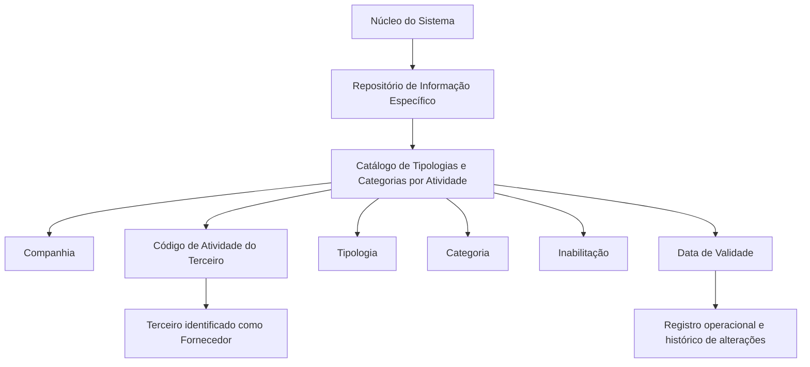

# Configuração de Tipologias e Categorias de Fornecedores por Atividade

## 1. Metadados do Documento
- **Arquivo de Origem:** `Não identificado no conteúdo fornecido`
- **Tipo de Documento:** `Especificação Funcional`
- **Domínio / Sistema:** `Catálogo de Tipologias e Categorias de Fornecedores por Atividade — MAPFRE`
- **Público-Alvo:** `Não explicitamente identificado; conteúdo aplicável a gestão funcional e configuração de catálogos`
- **Data/Versão Identificada:** `Não identificada`

---

## 2. Resumo Executivo & Contexto de Negócio

O documento descreve a configuração de um catálogo corporativo destinado a associar Tipologias e Categorias de Fornecedores de acordo com a Atividade de cada Terceiro-Fornecedor. O núcleo do sistema possui essa capacidade funcional por meio de um repositório de informação específico.

O repositório de informação é entregue inicialmente vazio nas instalações. Portanto, a entidade responsável pela instalação e operação deve definir os registros de configuração necessários para que o catálogo possa ser utilizado nos processos da companhia.

Cada registro do catálogo é definido no contexto de uma Companhia e de um Código de Atividade do Terceiro. A associação de atividade é aplicável quando a Atividade do Terceiro identifica o Terceiro como um fornecedor.

A configuração inclui os atributos Tipologia e Categoria, além de propriedades operacionais de Inabilitação e Data de Validade. A Data de Validade permite determinar a partir de quando um registro passa a operar no sistema e manter histórico das alterações de configuração ao longo do tempo.

O documento não estabelece uma codificação obrigatória ou padronizada para o catálogo. Entretanto, recomenda que a entidade MAPFRE avalie a conveniência de utilizar o catálogo transversalmente nos processos da companhia, visando sua exploração posterior.

---

## 3. Arquitetura, Componentes & Tecnologias Envolvidas

O conteúdo fornecido não descreve arquitetura técnica de infraestrutura, microsserviços, APIs, bancos de dados, métodos HTTP, contratos JSON, ambientes ou tecnologias de implementação.

Os componentes funcionais explicitamente citados são:

- **Núcleo do Sistema:** componente que disponibiliza a capacidade de associar Tipologias e Categorias de Fornecedores conforme a Atividade.
- **Repositório de Informação Específico:** repositório que sustenta o catálogo e é inicialmente entregue sem conteúdo.
- **Catálogo de Tipologias e Categorias por Código de Atividade:** estrutura de configuração que armazena os registros.
- **Companhia:** contexto organizacional ao qual pertence a definição de um registro.
- **Código de Atividade do Terceiro:** código que identifica a atividade do Terceiro-Fornecedor.
- **Tipologia:** código ou chave do tipo de fornecedor configurado.
- **Categoria:** código ou chave do tipo de fornecedor configurado, conforme redação original.
- **Inabilitação:** indicador de que o registro está desativado ou inabilitado.
- **Data de Validade:** data a partir da qual o registro configurado fica operacional.



> **Nota de Análise:** O documento apresenta uma estrutura funcional de catálogo, mas não detalha entidades técnicas, modelo físico de dados, relacionamentos de cardinalidade, interfaces de integração, APIs ou mecanismos de persistência.

---

## 4. Regras de Negócio, Especificações Funcionais & Processos

### 4.1 Finalidade do catálogo

1. O núcleo do sistema permite atribuir Tipologias e Categorias de Fornecedores de acordo com a Atividade do fornecedor.
2. A atribuição é mantida em um repositório de informação específico.
3. O repositório é entregue inicialmente vazio de conteúdo nas instalações.
4. A configuração do catálogo é necessária para disponibilizar registros de Tipologia e Categoria associados às Atividades dos Terceiros-Fornecedores.

### 4.2 Contexto de Companhia

1. Todo registro do catálogo contém o código da Companhia.
2. O código da Companhia representa a companhia sobre a qual está sendo realizada a definição do registro.
3. O documento não informa formato, tamanho, domínio de valores ou regra de unicidade para o código da Companhia.

### 4.3 Código de Atividade do Terceiro

1. O Código de Atividade do Terceiro estabelece no sistema o código da Atividade do Terceiro-Fornecedor.
2. A Atividade do Terceiro deve identificar o Terceiro como fornecedor para que a propriedade seja aplicável.
3. O documento não define a origem do Código de Atividade do Terceiro, seus valores válidos ou validações de cadastro.

### 4.4 Tipologia

1. A Tipologia determina o código ou a chave do Tipo de Fornecedor configurado no catálogo.
2. O documento não apresenta uma lista de Tipologias, nomenclatura obrigatória, regra de codificação ou relacionamento detalhado com Categorias.

### 4.5 Categoria

1. A Categoria determina o código ou a chave do Tipo de Fornecedor configurado no catálogo, conforme a descrição literal do documento.
2. O conteúdo não diferencia tecnicamente a semântica de Categoria da semântica de Tipologia.
3. O documento não apresenta lista de Categorias, valores permitidos ou regra de hierarquia entre Tipologia e Categoria.

> **Nota de Análise:** A descrição funcional de **Categoria** repete a formulação usada para **Tipologia**. O documento não oferece detalhamento adicional que permita estabelecer uma distinção funcional entre os dois atributos.

### 4.6 Inabilitação

1. A propriedade Inabilitação estabelece que um registro configurado está desativado ou inabilitado.
2. O documento não informa o formato do indicador, valores aceitos, comportamento do sistema para registros inabilitados ou eventuais efeitos em consultas históricas.

### 4.7 Data de Validade e histórico

1. A Data de Validade informa ao sistema a data a partir da qual o registro configurado passa a estar operacional.
2. O uso correto da Data de Validade permite manter histórico das alterações efetuadas nas configurações do catálogo ao longo do tempo.
3. O documento não especifica formato de data, tratamento de data final, sobreposição de vigências, retroatividade ou critérios de resolução em caso de múltiplos registros para a mesma combinação de atributos.

### 4.8 Diretriz de codificação e uso corporativo

1. Não existe preferência ou recomendação para estabelecer ou padronizar a codificação do catálogo no sistema.
2. A entidade MAPFRE deve analisar a conveniência de utilizar o catálogo de informação de forma transversal nos processos da companhia.
3. A análise de uso transversal é recomendada para permitir a correta exploração posterior das informações do catálogo.

### 4.9 Documentos funcionais relacionados

A interpretação do documento não deve ser isolada, pois o próprio conteúdo recomenda a leitura das seguintes diretrizes e documentos funcionais:

- Atividades dos Terceiros.
- Tipologias de Fornecedores.
- Categorias de Fornecedores.

---

## 5. Tabelas de Parâmetros, Ambientes e Estruturas de Dados

| Item / Parâmetro | Descrição / Função | Tipo / Valores / Formato | Ambiente / Observações |
| :--- | :--- | :--- | :--- |
| Repositório de informação específico | Repositório utilizado para atribuir Tipologias e Categorias de Fornecedores de acordo com a Atividade. | Não especificado. | É entregue inicialmente vazio de conteúdo nas instalações. |
| Companhia | Código da companhia sobre a qual está sendo definida a configuração do registro. | Código; formato não especificado. | Contexto organizacional do registro do catálogo. |
| Código de Atividade do Terceiro | Estabelece o código da Atividade do Terceiro-Fornecedor no sistema. | Código; domínio não especificado. | Aplicável quando a Atividade do Terceiro identifica o Terceiro como fornecedor. |
| Tipologia | Determina o código ou chave do Tipo de Fornecedor configurado no catálogo. | Código ou chave; valores não especificados. | Não há padronização de codificação estabelecida pelo documento. |
| Categoria | Determina o código ou chave do Tipo de Fornecedor configurado no catálogo. | Código ou chave; valores não especificados. | A descrição original não diferencia Categoria de Tipologia. |
| Inabilitação | Indica que o registro configurado está desativado ou inabilitado. | Não especificado. | Não são descritos valores, formato ou comportamento operacional. |
| Data de Validade | Indica a data a partir da qual o registro configurado fica operacional no sistema. | Data; formato não especificado. | Permite manter histórico de mudanças nas configurações do catálogo. |
| Codificação do catálogo | Forma de codificar Tipologias e Categorias por Código de Atividade. | Não padronizada. | Não há preferência nem recomendação para padronização no sistema. |
| Uso transversal do catálogo | Uso da informação do catálogo nos processos da companhia. | Diretriz de análise corporativa. | A entidade MAPFRE deve analisar sua conveniência para exploração posterior. |

---

## 6. Bateria de Perguntas & Respostas para RAG (FAQ Sintético)

### P1: Qual é o objetivo do catálogo de Tipologias e Categorias de Fornecedores por Atividade?
**R:** O catálogo permite ao núcleo do sistema atribuir Tipologias e Categorias de Fornecedores de acordo com a Atividade de cada Terceiro-Fornecedor. Essa configuração é mantida em um repositório de informação específico.

### P2: O repositório do catálogo já possui conteúdo quando é entregue nas instalações?
**R:** Não. O documento informa que o repositório de informação específico é entregue inicialmente vazio de conteúdo nas instalações.

### P3: Qual é a função do atributo Companhia no catálogo?
**R:** O atributo Companhia contém o código da companhia sobre a qual está sendo realizada a definição do registro do catálogo.

### P4: Quando o Código de Atividade do Terceiro deve ser utilizado?
**R:** O Código de Atividade do Terceiro estabelece no sistema o código da Atividade do Terceiro-Fornecedor, desde que a Atividade do Terceiro o identifique como fornecedor.

### P5: O que representa a Tipologia na configuração de fornecedores?
**R:** A Tipologia determina o código ou a chave do Tipo de Fornecedor configurado no catálogo.

### P6: O que representa a Categoria na configuração de fornecedores?
**R:** A Categoria determina o código ou a chave do Tipo de Fornecedor configurado no catálogo. O documento não fornece detalhamento adicional que diferencie funcionalmente a Categoria da Tipologia.

### P7: Qual é a finalidade da propriedade Inabilitação?
**R:** A propriedade Inabilitação informa que o registro configurado está desativado ou inabilitado. O documento não especifica quais valores representam esse estado nem como o sistema trata registros inabilitados.

### P8: Para que serve a Data de Validade de um registro do catálogo?
**R:** A Data de Validade informa ao sistema a partir de qual data o registro configurado passa a estar operacional. Seu uso correto permite manter um histórico das alterações efetuadas nas configurações do catálogo ao longo do tempo.

### P9: Existe uma codificação obrigatória para Tipologias e Categorias de Fornecedores?
**R:** Não. O documento declara que não existe preferência nem recomendação para estabelecer ou padronizar a codificação no sistema.

### P10: Qual recomendação é feita à entidade MAPFRE sobre o uso do catálogo?
**R:** A entidade MAPFRE deve analisar a conveniência de utilizar transversalmente o catálogo de informação nos processos da companhia, permitindo sua correta exploração posterior.

### P11: Quais documentos devem ser consultados para evitar interpretação isolada do catálogo?
**R:** O documento recomenda a leitura das diretrizes e documentos funcionais “Atividades dos Terceiros”, “Tipologias de Fornecedores” e “Categorias de Fornecedores”.

### P12: O documento especifica APIs, métodos HTTP ou contratos de integração para o catálogo?
**R:** Não. O conteúdo fornecido não detalha APIs, métodos HTTP, contratos JSON, tecnologias de implementação, ambientes técnicos ou mecanismos de integração.

---

## 7. Glossário de Termos, Siglas & Conceitos-Chave

- **Atividade do Terceiro:** atividade atribuída ao Terceiro e usada para identificar o Terceiro como fornecedor quando aplicável.
- **Categoria:** atributo que determina o código ou a chave do Tipo de Fornecedor configurado no catálogo, conforme descrição original.
- **Código de Atividade do Terceiro:** propriedade que estabelece no sistema o código da Atividade do Terceiro-Fornecedor.
- **Companhia:** entidade organizacional cujo código contextualiza a definição de um registro do catálogo.
- **Data de Validade:** data a partir da qual um registro configurado se torna operacional no sistema.
- **Fornecedor:** Terceiro identificado como fornecedor conforme sua Atividade.
- **Inabilitação:** propriedade que indica que um registro configurado está desativado ou inabilitado.
- **MAPFRE:** entidade mencionada como responsável por analisar a conveniência de uso transversal do catálogo nos processos da companhia.
- **Repositório de Informação Específico:** repositório utilizado pelo núcleo do sistema para configurar Tipologias e Categorias de Fornecedores por Atividade.
- **Terceiro:** entidade cuja Atividade pode identificá-la como fornecedor.
- **Tipologia:** atributo que determina o código ou a chave do Tipo de Fornecedor configurado no catálogo.

---

## 8. Notas Críticas, Riscos & Limitações

- O repositório de informação é entregue vazio, criando dependência operacional da correta carga e manutenção inicial dos registros de catálogo.
- O documento não define convenção obrigatória para codificação de Tipologias e Categorias. A ausência de padronização pode dificultar o uso transversal e a exploração posterior das informações entre processos da companhia.
- O conteúdo recomenda a leitura de documentos funcionais relacionados para evitar interpretação isolada e potencialmente incorreta da presente especificação.
- A descrição de Categoria reproduz o conceito apresentado para Tipologia; não há detalhamento suficiente para diferenciar os dois atributos.
- Não são especificados valores válidos, formatos, obrigatoriedade, cardinalidade, chaves de unicidade ou regras de validação para os atributos do catálogo.
- Não há definição de como o sistema deve tratar registros inabilitados.
- Não há detalhamento sobre data final de vigência, sobreposição de períodos, retroatividade ou resolução de conflitos entre registros históricos.
- O documento não contém informações sobre integrações, serviços, APIs, tecnologias, ambientes, URLs, logs, permissões ou controles de acesso.

---

## 9. Conteúdo Bruto Estruturado (Referência Fiel)

```text
--- [PÁGINA 1 DE 2] ---

CONFIGURACIÓN de las TIPOLOGÍAS y
CATEGORÍAS de los PROVEEDORES por
ACTIVIDAD
Objetivo
Funcionalmente, el núcleo del Sistema cuenta con la posibilidad de asignar las Tipologías y
Categorías de los Proveedores de acuerdo con su Actividad en un repositorio de información
específico que se entrega inicialmente a las instalaciones vacío de contenido.
Propiedades
Otras Propiedades
Compañía
Este Atributo del catálogo contiene el código de la compañía sobre la que se está realizando la
definición del Registro.
Código de Actividad del Tercero
Esta propiedad establece en el sistema el código de la Actividad del Tercero-Proveedor siempre y
cuando la Actividad del Tercero lo identifique como tal.
Tipología
Este Atributo determina el código o clave del Tipo de Proveedor que se está configurando en el
catálogo
 / 
 CF
Home Solutions APIs Documentation Zeus
EN


--- [PÁGINA 2 DE 2] ---

Categoría
Este Atributo determina el código o clave del Tipo de Proveedor que se está configurando en el
catálogo.
Otras Propiedades
Inhabilitación
Esta propiedad establece que el Registro configurado está desactivado o inhabilitado.
Fecha de Validez
Esta propiedad le indica al Sistema la fecha a partir de la cual el registro configurado está operativo
en el sistema por lo que su correcto uso permite tener un histórico de los cambios efectuados en las
configuraciones del catálogo a lo largo del tiempo.
Vínculos
Relación de Directrices y Documentos funcionales cuya lectura recomendada para evitar que la
interpretación aislada del presente documento pueda conducir a error.
Actividades de los Terceros
Tipologías de Proveedores
Categorías de Proveedores
Preguntas frecuentes
(1) ¿Existe alguna recomendación operativa que deba ser tomada en consideración localmente en la
codificación, uso y definición del catálogo de Tipologías y Categorías por Código de Actividad de los
Proveedores?
No existe una preferencia ni recomendación para establecer o estandarizar en el sistema su
codificación, si bien la entidad MAPFRE debe analizar la conveniencia de utilizar transversalmente en
los procesos de la compañía este catálogo de información para su correcta y posterior explotación.
```
