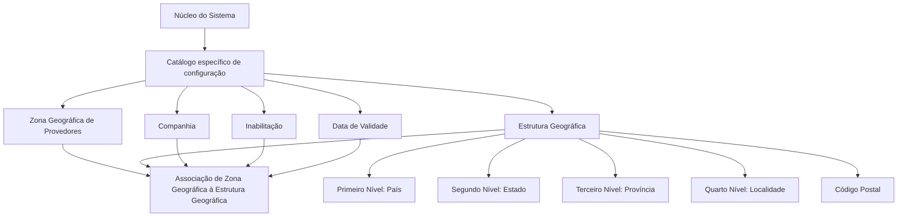

# Relação entre Zonas Geográficas e Estrutura Geográfica em Provedores

## 1. Metadados do Documento
- **Arquivo de Origem:** Não identificado no conteúdo fornecido
- **Tipo de Documento:** Especificação Técnica
- **Domínio / Sistema:** Provedores — Zonas Geográficas e Estrutura Geográfica
- **Público-Alvo:** Desenvolvedores, Analistas Funcionais, Operação e Negócio
- **Data/Versão Identificada:** Não identificada

---

## 2. Resumo Executivo & Contexto de Negócio

O documento descreve a capacidade funcional do núcleo do sistema para relacionar a estrutura zonal dos provedores com a estrutura geográfica ou organização territorial de um país. Essa associação é configurada por meio de um catálogo específico entregue inicialmente sem conteúdo às entidades.

A configuração permite associar uma Zona Geográfica de Provedores a identificadores territoriais organizados em quatro níveis: país, estado, província e localidade. A associação também contempla Código Postal, permitindo representar uma localização geográfica de forma mais específica.

Cada associação é contextualizada por companhia, garantindo que o vínculo entre a zona geográfica de provedores e a estrutura territorial seja configurado para a companhia correspondente. O documento identifica também propriedades para inativação e vigência temporal da associação.

A propriedade de inabilitação impede que uma associação seja utilizada. A data de validade determina a partir de quando um registro configurado se torna operacional, permitindo preservar histórico de alterações geográficas realizadas ao longo do tempo.

O documento recomenda a leitura conjunta dos materiais funcionais “Zonas Geográficas de Proveedores” e “Estructura Geográfica”, pois a interpretação isolada desta especificação pode conduzir a erros.

---

## 3. Arquitetura, Componentes & Tecnologias Envolvidas

### Componentes e conceitos identificados

- **Núcleo do Sistema:** componente funcional com capacidade de relacionar estruturas zonais de provedores e estruturas geográficas.
- **Catálogo específico de configuração:** catálogo no qual a associação entre Zona Geográfica de Provedores e estrutura territorial é registrada.
- **Companhia:** código da companhia para a qual a associação é configurada.
- **Zona Geográfica de Provedores:** zona identificada por código ou chave.
- **Estrutura Geográfica:** organização territorial composta por país, estado, província, localidade e Código Postal.
- **Registro configurado:** associação entre zona geográfica, companhia e atributos territoriais, sujeita a inabilitação e data de validade.



> **Nota de Análise:** O documento não detalha tecnologias de implementação, APIs, métodos HTTP, contratos JSON, banco de dados, interfaces de usuário, URLs, ambientes ou mecanismos técnicos de persistência do catálogo.

---

## 4. Regras de Negócio, Especificações Funcionais & Processos

1. O núcleo do sistema possui capacidade funcional para relacionar a Estrutura Zonal dos Provedores com a Estrutura Geográfica ou organização territorial de um país.

2. A relação entre Zona Geográfica de Provedores e Estrutura Geográfica é estabelecida em um catálogo específico de configuração.

3. O catálogo específico é fornecido às entidades sem conteúdo inicial.

4. A associação deve indicar a **Companhia** sobre a qual está sendo realizada a vinculação entre a Zona Geográfica de Provedores e a estrutura territorial do país.

5. A associação deve identificar a Zona Geográfica de Provedores por meio de um código ou chave.

6. A estrutura geográfica da associação pode ser identificada pelos seguintes níveis territoriais:
   - Primeiro Nível: país.
   - Segundo Nível: estado.
   - Terceiro Nível: província.
   - Quarto Nível: localidade.
   - Código Postal associado aos quatro níveis anteriores.

7. A propriedade **Inhabilitación** estabelece que uma associação entre Zona Geográfica e Estrutura Geográfica esteja desativada ou inabilitada para utilização.

8. A propriedade **Fecha de Validez** informa ao sistema a data a partir da qual o registro configurado está operacional.

9. O uso correto da data de validade permite manter histórico de mudanças geográficas efetuadas ao longo do tempo.

10. A leitura isolada deste documento pode levar a interpretações incorretas; o documento recomenda consultar também os materiais “Zonas Geográficas de Proveedores” e “Estructura Geográfica”.

---

## 5. Tabelas de Parâmetros, Ambientes e Estruturas de Dados

| Item / Parâmetro | Descrição / Função | Tipo / Valores / Formato | Ambiente / Observações |
| :--- | :--- | :--- | :--- |
| Catálogo específico de configuração | Repositório funcional para configurar a associação entre Zona Geográfica de Provedores e Estrutura Geográfica. | Não especificado | É fornecido vazio de conteúdo às entidades. |
| Companhia | Contém o código da companhia na qual está sendo realizada a associação da Zona Geográfica de Provedores à estrutura territorial do país. | Código de companhia; formato não especificado | Aplicável à associação configurada. |
| Código de Zona | Determina o código ou chave da Zona Geográfica de Provedores configurada no catálogo. | Código ou chave; formato não especificado | Identifica a zona geográfica associada. |
| Código do Primeiro Nível | Contém a chave que identifica o primeiro nível da Estrutura Geográfica. | Chave; formato não especificado | Primeiro nível corresponde ao país. |
| Código do Segundo Nível | Identifica a chave do segundo nível da Estrutura Geográfica. | Chave; formato não especificado | Segundo nível corresponde ao estado. |
| Código do Terceiro Nível | Identifica a chave do terceiro nível da Estrutura Geográfica. | Chave; formato não especificado | Terceiro nível corresponde à província. |
| Código do Quarto Nível | Identifica a chave do quarto nível da Estrutura Geográfica. | Chave; formato não especificado | Quarto nível corresponde à localidade. |
| Código Postal | Contém a chave que identifica o Código Postal associado aos quatro níveis anteriores da estrutura geográfica. | Chave; formato não especificado | Relacionado a país, estado, província e localidade. |
| Inhabilitación | Define que a associação de Zona Geográfica à Estrutura Geográfica está desativada ou inabilitada. | Estado de inabilitação; valores não especificados | Uma associação inabilitada não pode ser utilizada. |
| Fecha de Validez | Informa a data a partir da qual o registro configurado está operacional no sistema. | Data; formato não especificado | Permite manter histórico de mudanças geográficas ao longo do tempo. |
| Zonas Geográficas de Proveedores | Documento funcional vinculado e recomendado para consulta. | Referência documental | Deve ser lido para evitar interpretação isolada incorreta. |
| Estructura Geográfica | Documento funcional vinculado e recomendado para consulta. | Referência documental | Deve ser lido para evitar interpretação isolada incorreta. |

---

## 6. Bateria de Perguntas & Respostas para RAG (FAQ Sintético)

### P1: Qual é o objetivo da relação entre Zonas Geográficas de Provedores e Estrutura Geográfica?
**R:** O objetivo é permitir que o núcleo do sistema relacione a Estrutura Zonal dos Provedores com a Estrutura Geográfica ou organização territorial de um país. Essa relação é configurada em um catálogo específico.

### P2: Onde é configurada a associação entre uma Zona Geográfica de Provedores e a estrutura territorial?
**R:** A associação é configurada em um catálogo específico de configuração. O documento informa que esse catálogo é fornecido inicialmente sem conteúdo às entidades.

### P3: Qual é a finalidade do atributo Companhia?
**R:** O atributo Companhia contém o código da companhia sobre a qual está sendo realizada a associação entre a Zona Geográfica de Provedores e a estrutura territorial do país.

### P4: Como uma Zona Geográfica de Provedores é identificada no catálogo?
**R:** A Zona Geográfica de Provedores é identificada pelo atributo Código de Zona, que determina o código ou a chave da zona configurada no catálogo.

### P5: Quais níveis territoriais podem compor a Estrutura Geográfica?
**R:** A Estrutura Geográfica pode conter quatro níveis: Primeiro Nível, correspondente ao país; Segundo Nível, correspondente ao estado; Terceiro Nível, correspondente à província; e Quarto Nível, correspondente à localidade. A estrutura também contempla Código Postal.

### P6: Qual é o papel do Código Postal na associação geográfica?
**R:** O Código Postal contém a chave que identifica o Código Postal associado aos quatro níveis anteriores da estrutura geográfica: país, estado, província e localidade.

### P7: O que acontece quando a propriedade Inhabilitación é definida para uma associação?
**R:** A propriedade Inhabilitación estabelece que a associação entre Zona Geográfica e Estrutura Geográfica está desativada ou inabilitada, impedindo que essa associação seja utilizada.

### P8: Para que serve a propriedade Fecha de Validez?
**R:** A propriedade Fecha de Validez indica a data a partir da qual um registro configurado está operacional no sistema. Seu uso correto permite manter um histórico das alterações geográficas realizadas ao longo do tempo.

### P9: O documento especifica APIs, métodos HTTP ou contratos JSON para a configuração?
**R:** Não. O conteúdo fornecido descreve propriedades funcionais do catálogo, mas não apresenta APIs, métodos HTTP, contratos JSON, tecnologias de implementação, endpoints ou formatos de integração.

### P10: Quais documentos devem ser consultados em conjunto com esta especificação?
**R:** O documento recomenda a leitura de “Zonas Geográficas de Proveedores” e “Estructura Geográfica”, pois a interpretação isolada do material pode conduzir a erros.

---

## 7. Glossário de Termos, Siglas & Conceitos-Chave

- **Zona Geográfica de Provedores:** zona identificada por código ou chave e associada à estrutura territorial de um país.
- **Estrutura Geográfica:** organização territorial formada por níveis geográficos, incluindo país, estado, província, localidade e Código Postal.
- **Catálogo específico de configuração:** catálogo no qual é registrada a associação entre Zona Geográfica de Provedores e Estrutura Geográfica.
- **Companhia:** entidade identificada por código para a qual a associação geográfica é realizada.
- **Código de Zona:** código ou chave que identifica a Zona Geográfica de Provedores.
- **Primeiro Nível:** nível da Estrutura Geográfica correspondente ao país.
- **Segundo Nível:** nível da Estrutura Geográfica correspondente ao estado.
- **Terceiro Nível:** nível da Estrutura Geográfica correspondente à província.
- **Quarto Nível:** nível da Estrutura Geográfica correspondente à localidade.
- **Código Postal:** chave de identificação do código postal associado aos quatro níveis geográficos anteriores.
- **Inhabilitación:** propriedade que desativa ou inabilita uma associação para uso.
- **Fecha de Validez:** data a partir da qual um registro configurado passa a estar operacional.
- **Vínculos:** referências a diretrizes e documentos funcionais cuja leitura é recomendada.

---

## 8. Notas Críticas, Riscos & Limitações

- O catálogo é fornecido inicialmente vazio às entidades; o documento não descreve o processo de carga inicial, manutenção ou governança dos dados configurados.
- Não são especificados formatos, domínios de valores, obrigatoriedade, cardinalidade ou validações para os códigos de companhia, zona, níveis geográficos ou Código Postal.
- O documento não descreve o comportamento do sistema em caso de associação incompleta, sobreposição de níveis geográficos, datas de validade conflitantes ou associações simultaneamente habilitadas.
- Não há detalhamento sobre APIs, integrações, tecnologias, banco de dados, permissões, auditoria ou ambientes.
- A propriedade de inabilitação é descrita funcionalmente, mas o documento não define representação técnica, valores possíveis ou tratamento de registros já utilizados.
- A leitura isolada pode gerar interpretação incorreta; é necessária a consulta aos documentos “Zonas Geográficas de Proveedores” e “Estructura Geográfica”.

---

## 9. Conteúdo Bruto Estruturado (Referência Fiel)

```text
--- [PÁGINA 1 DE 3] ---

RELACIÓN de ZONAS GEOGRÁFICAS y
ESTRUCTURA GEOGRÁFICA en
PROVEEDORES
Objetivo
Funcionalmente el núcleo del Sistema cuenta con la capacidad de poder relacionar la Estructura
Zonal de los Proveedores con la Estructura Geográfica u organización territorial del país, relación que
se establece en un catálogo específico de configuración que se proporciona vacío de contenido a las
entidades.
Propiedades
Otras Propiedades
Propiedades
Compañía
Este Atributo del catálogo contiene el código de la compañía sobre la que se está realizando la
asociación de la Zona Geográfica de Proveedores a la estructura territorial del país.
Código de Zona
Este Atributo determina el código o clave de la Zona Geográfica de los Proveedores que se está
configurando en el catálogo.
 / 
 CF
Home Solutions APIs Documentation Zeus
EN


--- [PÁGINA 2 DE 3] ---

Código del Primer Nivel
Este atributo contiene la clave que identificará al Primer Nivel (país) de la estructura Geográfica.
Código del Segundo Nivel
Este atributo identifica específicamente la clave que identificará al Segundo Nivel (estado) de la
estructura Geográfica.
Código del Tercer Nivel
Este atributo identifica específicamente la clave que identificará al Tercer Nivel (provincia) de la
estructura Geográfica.
Código del Cuarto Nivel
Este atributo identifica específicamente la clave que identificará al Cuarto Nivel (localidad) de la
estructura Geográfica.
Código Postal
Esta Propiedad contiene la clave que identifica el Código Postal asociado a los cuatro niveles previos
de la estructura geográfica.
Otras Propiedades
Inhabilitación
Esta propiedad establece que la Asociación de la Zona Geográfica a la Estructura Geográfica está
desactivada o inhabilitada para poder ser utilizada.
Fecha de Validez
Esta propiedad le indica al Sistema la fecha a partir de la cual el registro configurado está operativo
en el sistema por lo que su correcto uso permite tener un histórico de los cambios geográficos
efectuados a lo largo del tiempo.
Vínculos
Relación de Directrices y Documentos funcionales cuya lectura recomendada para evitar que la
interpretación aislada del presente documento pueda conducir a error.
Zonas Geográficas de Proveedores
Estructura Geográfica


--- [PÁGINA 3 DE 3] ---

Preguntas frecuentes
N/A
```
