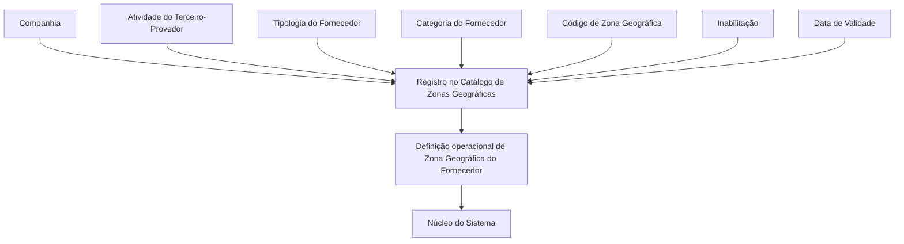

# Definição de Zonas Geográficas de Fornecedores por Atividade, Tipologia e Categoria

## 1. Metadados do Documento
- **Arquivo de Origem:** Não identificado no conteúdo fornecido
- **Tipo de Documento:** Especificação Funcional
- **Domínio / Sistema:** Catálogo de Zonas Geográficas de Fornecedores — MAPFRE
- **Público-Alvo:** Analistas funcionais, equipes de negócio, administradores de catálogo e operação
- **Data/Versão Identificada:** Não identificada

---

## 2. Resumo Executivo & Contexto de Negócio

O documento define um catálogo funcional destinado à atribuição de Zonas Geográficas aos Terceiros classificados como Fornecedores. A atribuição de zona geográfica é determinada pela combinação de Atividade, Tipologia e Categoria do fornecedor.

O núcleo do Sistema dispõe de um repositório específico para manter essas definições. Segundo o documento, esse repositório é entregue inicialmente às instalações sem conteúdo, exigindo que a organização realize o respectivo cadastramento e manutenção dos registros.

Cada registro do catálogo é contextualizado por Companhia, código de Atividade do Terceiro, Tipologia, Categoria e Código de Zona. O cadastro também contempla propriedades de controle operacional, como Inabilitação e Data de Validade.

A Data de Validade permite determinar o momento a partir do qual uma configuração passa a operar no Sistema e viabiliza a preservação de histórico das alterações realizadas ao longo do tempo. O documento também recomenda a leitura de documentos funcionais relacionados para evitar interpretações isoladas e incorretas.

Não existe recomendação ou preferência explícita para padronizar a codificação do catálogo. Entretanto, a entidade MAPFRE deve avaliar a conveniência de utilizar transversalmente esse catálogo nos processos corporativos para permitir sua exploração posterior.

---

## 3. Arquitetura, Componentes & Tecnologias Envolvidas

O conteúdo descreve uma estrutura funcional de catálogo, sem detalhar arquitetura técnica, tecnologias, APIs, bancos de dados, métodos HTTP, contratos JSON, servidores ou ambientes de implantação.

### Componentes funcionais identificados

| Componente | Função descrita |
| :--- | :--- |
| Núcleo do Sistema | Possui a capacidade de atribuir Zonas Geográficas aos Fornecedores. |
| Repositório de informação específico | Mantém as definições de Zonas Geográficas por Atividade, Tipologia e Categoria. É entregue inicialmente vazio. |
| Catálogo de Zonas Geográficas de Fornecedores | Armazena registros de configuração relacionados a Companhia, Atividade, Tipologia, Categoria, Zona, Inabilitação e Data de Validade. |
| Entidade MAPFRE | Deve analisar a conveniência de uso transversal do catálogo em processos da companhia. |
| Documentos funcionais vinculados | Devem ser consultados para evitar interpretação isolada do documento. |



> **Nota de Análise:** O documento não descreve componentes técnicos de implementação, integrações, interfaces, protocolos, tecnologias ou persistência de dados. O diagrama representa exclusivamente a relação funcional entre os atributos explicitamente citados.

---

## 4. Regras de Negócio, Especificações Funcionais & Processos

### 4.1 Objetivo funcional

O núcleo do Sistema pode atribuir Zonas Geográficas aos Provedores/Fornecedores de acordo com:

1. Atividade;
2. Tipologia;
3. Categoria.

As definições são mantidas em um repositório de informação específico.

### 4.2 Inicialização do repositório

O repositório específico destinado às definições de Zonas Geográficas é entregue inicialmente vazio de conteúdo nas instalações. Portanto, o conteúdo necessário para a utilização funcional do catálogo deve ser definido e cadastrado localmente.

### 4.3 Identificação organizacional do registro

O atributo **Companhia** contém o código da companhia sobre a qual está sendo realizada a definição do registro. Cada configuração de zona geográfica possui, portanto, um contexto de companhia.

### 4.4 Aplicabilidade da Atividade do Terceiro

O atributo **Código de Atividade do Terceiro** estabelece no Sistema o código da Atividade do Terceiro-Fornecedor, desde que a Atividade do Terceiro o identifique como fornecedor.

### 4.5 Tipologia do fornecedor

O atributo **Tipologia** determina o código ou chave do Tipo de Fornecedor configurado no catálogo.

### 4.6 Categoria do fornecedor

O atributo **Categoria** determina o código ou chave do Tipo de Fornecedor configurado no catálogo.

> **Nota de Análise:** O texto fornecido utiliza, para Categoria, a mesma descrição apresentada para Tipologia: “código ou clave del Tipo de Proveedor”. O documento não detalha uma distinção funcional adicional entre Tipologia e Categoria.

### 4.7 Zona geográfica

O atributo **Código de Zona** determina o código ou chave da Divisão Geográfica dos Fornecedores configurada no catálogo.

### 4.8 Inabilitação do registro

A propriedade **Inabilitação** define que o registro configurado está desativado ou inabilitado.

### 4.9 Vigência e histórico

A propriedade **Data de Validade** informa ao Sistema a data a partir da qual o registro configurado passa a estar operativo. O uso correto da Data de Validade permite manter um histórico das alterações realizadas ao longo do tempo.

### 4.10 Diretriz de codificação e uso corporativo

Não existe preferência ou recomendação para estabelecer ou padronizar a codificação do catálogo no Sistema. A entidade MAPFRE deve analisar a conveniência de utilizar esse catálogo de informação transversalmente nos processos da companhia, visando sua correta exploração posterior.

### 4.11 Documentos funcionais relacionados

A leitura dos documentos relacionados é recomendada para evitar que uma interpretação isolada deste documento conduza a erro. Os vínculos citados são:

1. Atividades dos Terceiros;
2. Tipologias de Fornecedores por Atividade;
3. Categorias de Fornecedores;
4. Zonas Geográficas.

---

## 5. Tabelas de Parâmetros, Ambientes e Estruturas de Dados

| Item / Parâmetro | Descrição / Função | Tipo / Valores / Formato | Ambiente / Observações |
| :--- | :--- | :--- | :--- |
| Companhia | Contém o código da companhia sobre a qual é realizada a definição do registro. | Código de companhia; formato não detalhado. | Aplicável ao registro do catálogo. |
| Código de Atividade do Terceiro | Estabelece o código da Atividade do Terceiro-Fornecedor no Sistema. | Código de atividade; formato não detalhado. | Aplicável quando a Atividade do Terceiro o identifica como fornecedor. |
| Tipologia | Determina o código ou chave do Tipo de Fornecedor configurado. | Código ou chave; formato não detalhado. | Atributo do catálogo. |
| Categoria | Determina o código ou chave do Tipo de Fornecedor configurado. | Código ou chave; formato não detalhado. | O documento não esclarece diferença adicional em relação à Tipologia. |
| Código de Zona | Determina o código ou chave da Divisão Geográfica dos Fornecedores. | Código ou chave; formato não detalhado. | Atributo do catálogo. |
| Inabilitação | Indica que o registro configurado está desativado ou inabilitado. | Estado de habilitação; valores não detalhados. | Propriedade operacional do registro. |
| Data de Validade | Indica a data a partir da qual o registro configurado está operativo no Sistema. | Data; formato não detalhado. | Permite preservar histórico de mudanças. |
| Repositório específico | Repositório que mantém as definições de zonas geográficas por Atividade, Tipologia e Categoria. | Repositório de informação; tecnologia não detalhada. | Entregue inicialmente vazio nas instalações. |
| Codificação do catálogo | Codificação usada para os registros do catálogo. | Não padronizada pelo documento. | A MAPFRE deve avaliar o uso transversal do catálogo. |

---

## 6. Bateria de Perguntas & Respostas para RAG (FAQ Sintético)

### P1: Qual é o objetivo do catálogo de Zonas Geográficas de Fornecedores?
**R:** O catálogo permite que o núcleo do Sistema atribua Zonas Geográficas aos Terceiros identificados como Fornecedores de acordo com a Atividade, a Tipologia e a Categoria de cada fornecedor.

### P2: O repositório de Zonas Geográficas já possui dados quando é entregue à instalação?
**R:** Não. O documento informa que o repositório específico de informação é entregue inicialmente vazio de conteúdo nas instalações.

### P3: Qual atributo identifica a companhia associada a uma definição de zona geográfica?
**R:** O atributo Companhia contém o código da companhia sobre a qual está sendo realizada a definição do registro no catálogo.

### P4: Em que condição o Código de Atividade do Terceiro deve ser usado?
**R:** O Código de Atividade do Terceiro estabelece no Sistema o código da Atividade do Terceiro-Fornecedor, desde que a atividade identifique esse terceiro como fornecedor.

### P5: Qual é a função da Tipologia no catálogo?
**R:** A Tipologia determina o código ou chave do Tipo de Fornecedor que está sendo configurado no catálogo.

### P6: O que representa o Código de Zona?
**R:** O Código de Zona determina o código ou chave da Divisão Geográfica dos Fornecedores configurada no catálogo.

### P7: Como um registro de zona geográfica pode ser desativado?
**R:** A propriedade Inabilitação estabelece que o registro configurado está desativado ou inabilitado.

### P8: Para que serve a Data de Validade de um registro?
**R:** A Data de Validade informa a data a partir da qual o registro configurado passa a estar operativo no Sistema. O uso correto desse atributo permite manter histórico das mudanças efetuadas ao longo do tempo.

### P9: O documento estabelece um padrão obrigatório para a codificação do catálogo?
**R:** Não. O documento informa que não existe preferência ou recomendação para estabelecer ou padronizar a codificação do catálogo no Sistema.

### P10: Qual orientação é dada à entidade MAPFRE sobre o uso do catálogo?
**R:** A entidade MAPFRE deve analisar a conveniência de usar transversalmente o catálogo de informação nos processos da companhia, buscando sua correta exploração posterior.

### P11: Quais documentos funcionais devem ser consultados em conjunto com esta definição?
**R:** O documento recomenda a leitura de Atividades dos Terceiros, Tipologias de Fornecedores por Atividade, Categorias de Fornecedores e Zonas Geográficas, para evitar interpretações isoladas e incorretas.

### P12: O documento especifica APIs, métodos HTTP, contratos JSON ou tecnologias de armazenamento?
**R:** Não. O conteúdo fornecido descreve regras funcionais e atributos de catálogo, mas não detalha APIs, métodos HTTP, contratos JSON, tecnologias, bancos de dados ou ambientes técnicos.

---

## 7. Glossário de Termos, Siglas & Conceitos-Chave

- **MAPFRE:** Entidade mencionada no documento que deve analisar a conveniência de uso transversal do catálogo de informação nos processos da companhia.
- **Atividade do Terceiro:** Código de atividade associado a um Terceiro, aplicável quando o Terceiro é identificado como Fornecedor.
- **Categoria:** Atributo que determina o código ou chave do Tipo de Fornecedor configurado no catálogo, conforme a descrição fornecida.
- **Código de Zona:** Código ou chave da Divisão Geográfica dos Fornecedores configurada no catálogo.
- **Companhia:** Código da companhia sobre a qual é definida uma configuração de catálogo.
- **Data de Validade:** Data a partir da qual um registro configurado passa a estar operativo no Sistema.
- **Divisão Geográfica:** Classificação geográfica dos Fornecedores identificada por Código de Zona.
- **Fornecedor / Provedor:** Terceiro cuja Atividade o identifica como fornecedor e que pode receber uma Zona Geográfica.
- **Inabilitação:** Propriedade que indica que o registro está desativado ou inabilitado.
- **Tipologia:** Código ou chave do Tipo de Fornecedor configurado no catálogo.
- **Zona Geográfica:** Divisão geográfica atribuída ao Fornecedor conforme sua Atividade, Tipologia e Categoria.

---

## 8. Notas Críticas, Riscos & Limitações

- O repositório de definições é entregue inicialmente vazio; a ausência de conteúdo cadastrado pode impedir ou limitar a atribuição de Zonas Geográficas aos Fornecedores.
- O documento não estabelece uma convenção obrigatória de codificação para o catálogo. Essa ausência pode gerar divergências entre companhias, áreas ou processos caso não haja governança local.
- A MAPFRE deve avaliar o uso transversal do catálogo nos processos corporativos. Sem essa avaliação, a exploração posterior da informação pode ser limitada ou inconsistente.
- O documento recomenda a leitura de diretrizes e documentos funcionais relacionados. A interpretação isolada do conteúdo pode conduzir a erro.
- O documento não detalha distinção funcional adicional entre Tipologia e Categoria, embora ambas sejam utilizadas como critérios para a atribuição de Zonas Geográficas.
- Não há detalhamento de arquitetura técnica, integrações, APIs, contratos de dados, permissões, validações de unicidade, formatos de data ou regras de precedência entre registros.
- Não são descritos procedimentos para carga inicial, manutenção, aprovação, auditoria ou tratamento de conflitos entre registros com diferentes Datas de Validade.

---

## 9. Conteúdo Bruto Estruturado (Referência Fiel)

```text
--- [PÁGINA 1 DE 2] ---

DEFINICIÓN de las ZONAS GEOGRÁFICAS por
Actividad, Tipología y Categoría del
PROVEEDOR
Objetivo
Funcionalmente, el núcleo del Sistema cuenta con la posibilidad de asignar las Zonas Geográficas de
los Proveedores de acuerdo con su Actividad, Tipología y Categoría en un repositorio de información
específico que se entrega inicialmente a las instalaciones vacío de contenido.
Propiedades
Otras Propiedades
Compañía
Este Atributo del catálogo contiene el código de la compañía sobre la que se está realizando la
definición del Registro.
Código de Actividad del Tercero
Esta propiedad establece en el sistema el código de la Actividad del Tercero-Proveedor siempre y
cuando la Actividad del Tercero lo identifique como tal.
Tipología
Este Atributo determina el código o clave del Tipo de Proveedor que se está configurando en el
catálogo.
 / 
 CF
Home Solutions APIs Documentation Zeus
EN


--- [PÁGINA 2 DE 2] ---

Categoría
Este Atributo determina el código o clave del Tipo de Proveedor que se está configurando en el
catálogo.
Código de Zona
Este Atributo determina el código o clave de la División Geográfica de los Proveedores que se está
configurando en el catálogo.
Otras Propiedades
Inhabilitación
Esta propiedad establece que el Registro configurado está desactivado o inhabilitado.
Fecha de Validez
Esta propiedad le indica al Sistema la fecha a partir de la cual el registro configurado está operativo
en el sistema por lo que su correcto uso permite tener un histórico de los cambios efectuados a lo
largo del tiempo.
Vínculos
Relación de Directrices y Documentos funcionales cuya lectura recomendada para evitar que la
interpretación aislada del presente documento pueda conducir a error.
Actividades de los Terceros
Tipologías de Proveedores por Actividad
Categorías de Proveedores
Zonas Geográficas
Preguntas frecuentes
(1) ¿Existe alguna recomendación operativa que deba ser tomada en consideración localmente en la
codificación, uso y definición del catálogo de Servicios de los Proveedores?
No existe una preferencia ni recomendación para establecer o estandarizar en el sistema su
codificación, si bien la entidad MAPFRE debe analizar la conveniencia de utilizar transversalmente en
los procesos de la compañía este catálogo de información para su correcta y posterior explotación.
```
