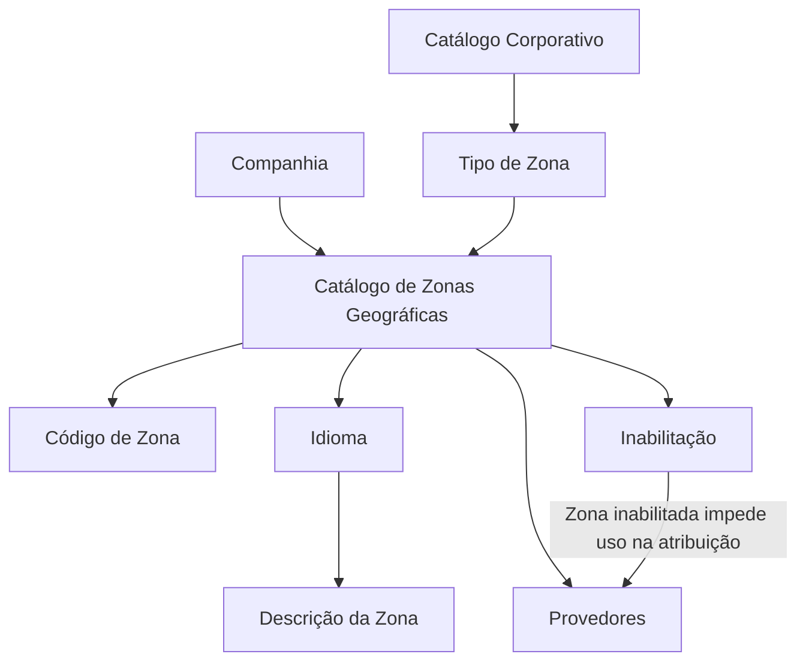

# Definição e Configuração de Zonas Geográficas para Provedores

## 1. Metadados do Documento
- **Arquivo de Origem:** Não identificado
- **Tipo de Documento:** Especificação Funcional
- **Domínio / Sistema:** Catálogo de Zonas Geográficas de Provedores — MAPFRE
- **Público-Alvo:** Negócio, Operação, Analistas Funcionais e Desenvolvedores
- **Data/Versão Identificada:** Não identificada

---

## 2. Resumo Executivo & Contexto de Negócio

O documento descreve a definição de Zonas Geográficas configuradas para Provedores. O núcleo do Sistema permite dividir a organização territorial dos países em divisões ou Zonas Geográficas para uso específico pelos Provedores da Entidade.

A configuração da Zona Geográfica é realizada por meio de um catálogo contendo atributos como Companhia, Tipo de Zona, Código de Zona, Idioma, Descrição da Zona e Inabilitação. Esses atributos identificam a companhia, caracterizam o uso da divisão geográfica, definem a chave da zona e permitem manter descrições por idioma.

O documento apresenta exemplos de códigos e descrições de zonas, incluindo zonas associadas a Tarifas, a Atribuições de Provedores e a ambos os usos. A Zona Geográfica pode ser inabilitada, impedindo a utilização de sua chave na atribuição a Provedores.

Não existe recomendação ou preferência explícita para padronizar a codificação no sistema. Contudo, a entidade MAPFRE deve analisar a conveniência de explorar transversalmente esse catálogo nos processos da companhia, incluindo a diferenciação entre Zonas relacionadas a Tarifas e Zonas relacionadas a Atribuições de Provedores.

---

## 3. Arquitetura, Componentes & Tecnologias Envolvidas

Os elementos funcionais identificados são:

- **Núcleo do Sistema:** disponibiliza a capacidade de organizar territorialmente os países em Zonas Geográficas.
- **Catálogo de Zonas Geográficas:** repositório funcional no qual as Zonas Geográficas são definidas.
- **Provedores:** utilizam as Zonas Geográficas em sua atribuição.
- **Catálogo Corporativo:** fornece os valores configurados que determinam o Tipo de Zona.
- **Companhia:** contexto organizacional para o qual a Zona Geográfica é definida.
- **Idioma:** chave utilizada para definir a descrição textual da Zona Geográfica.
- **MAPFRE:** entidade que deve avaliar o uso transversal do catálogo em seus processos.

> *Nota de Análise: O documento não descreve tecnologias, integrações, métodos HTTP, contratos JSON, bancos de dados, URLs, ambientes ou microsserviços.*



---

## 4. Regras de Negócio, Especificações Funcionais & Processos

1. O núcleo do Sistema permite dividir a organização territorial dos países em divisões ou Zonas Geográficas.
2. As Zonas Geográficas possuem emprego específico pelos Provedores da Entidade.
3. O atributo **Companhia** contém o código da companhia sobre a qual está sendo realizada a definição da Zona Geográfica.
4. O atributo **Tipo de Zona** determina e especifica o Tipo de Zona conforme:
   - o uso que a divisão geográfica terá;
   - os valores configurados no Catálogo Corporativo.
5. O atributo **Código de Zona** determina o código ou chave da Divisão Geográfica configurada no catálogo.
6. A propriedade **Idioma** representa a chave do idioma utilizada na configuração da Zona Geográfica. O documento cita espanhol, inglês e alemão como exemplos.
7. A propriedade **Descrição da Zona** contém a denominação ou descrição da Zona ou Divisão Geográfica de acordo com o idioma usado na definição.
8. A propriedade **Inabilitação** estabelece que a chave da Zona Geográfica está desativada ou inabilitada para uso em sua atribuição a Provedores.
9. O documento não estabelece preferência ou recomendação para padronizar a codificação das Zonas Geográficas no sistema.
10. A entidade MAPFRE deve analisar a conveniência de utilizar transversalmente o catálogo de Zonas Geográficas nos processos da companhia, visando sua correta exploração posterior.
11. Como exemplo de exploração transversal, o documento propõe agrupar e diferenciar:
    - Zonas relacionadas a Tarifas;
    - Zonas relacionadas a Atribuições de Provedores.

---

## 5. Tabelas de Parâmetros, Ambientes e Estruturas de Dados

| Item / Parâmetro | Descrição / Função | Tipo / Valores / Formato | Ambiente / Observações |
| :--- | :--- | :--- | :--- |
| Companhia | Contém o código da companhia na qual a Zona Geográfica está sendo definida. | Código de companhia; formato não detalhado. | Aplicável à definição da Zona Geográfica. |
| Tipo de Zona | Determina e especifica o tipo da divisão geográfica conforme seu uso. | Valores configurados no Catálogo Corporativo; valores específicos não detalhados. | Pode estar relacionado a Tarifas, Atribuições de Provedores ou ambos, conforme exemplos. |
| Código de Zona | Determina o código ou chave da Divisão Geográfica configurada. | Código ou chave; formato não detalhado. | Não há padrão de codificação obrigatório definido no documento. |
| Idioma | Chave do idioma usada na configuração da Zona Geográfica. | Exemplos: espanhol, inglês, alemão. | Determina o idioma da descrição da zona. |
| Descrição da Zona | Denominação ou descrição da Zona ou Divisão Geográfica no idioma definido. | Texto descritivo. | Mantida de acordo com o idioma utilizado na definição. |
| Inabilitação | Indica que a chave da Zona Geográfica está desativada ou inabilitada. | Estado de inabilitação; valores não detalhados. | Impede o uso da zona na atribuição a Provedores. |
| Zona `1` | Exemplo de Zona Geográfica associada a Tarifas. | `ZONA 1 - TARIFA` | Exemplo apresentado para idioma espanhol. |
| Zona `2` | Exemplo de Zona Geográfica associada a Tarifas. | `ZONA 2 - TARIFA` | Exemplo apresentado para idioma espanhol. |
| Zona `A` | Exemplo de Zona Geográfica associada a Atribuições. | `ZONA A - ASIGNACIÓN` | Exemplo apresentado para idioma espanhol. |
| Zona `B` | Exemplo de Zona Geográfica associada a Atribuições. | `ZONA B - ASIGNACIÓN` | Exemplo apresentado para idioma espanhol. |
| Zona `1A` | Exemplo de Zona Geográfica associada a ambos os usos. | `ZONA 1A - AMBAS` | Exemplo apresentado para idioma espanhol. |
| Zona `2B` | Exemplo de Zona Geográfica associada a ambos os usos. | `ZONA 2B - AMBAS` | Exemplo apresentado para idioma espanhol. |

---

## 6. Bateria de Perguntas & Respostas para RAG (FAQ Sintético)

### P1: Qual é o objetivo do catálogo de Zonas Geográficas para Provedores?
**R:** O catálogo permite dividir a organização territorial dos países em divisões ou Zonas Geográficas para emprego específico pelos Provedores da Entidade.

### P2: Qual atributo identifica a companhia da Zona Geográfica?
**R:** O atributo **Companhia** contém o código da companhia sobre a qual está sendo realizada a definição da Zona Geográfica.

### P3: Como o Tipo de Zona é determinado?
**R:** O Tipo de Zona é determinado pelo uso que a divisão geográfica terá e pelos valores configurados no Catálogo Corporativo.

### P4: O que representa o Código de Zona?
**R:** O Código de Zona determina o código ou a chave da Divisão Geográfica configurada no catálogo.

### P5: Há uma codificação obrigatória ou padronizada para Zonas Geográficas?
**R:** Não. O documento informa que não existe preferência nem recomendação para estabelecer ou padronizar a codificação das Zonas Geográficas no sistema.

### P6: Para que serve a propriedade Idioma na configuração da Zona Geográfica?
**R:** A propriedade Idioma é a chave do idioma empregada na configuração da Zona Geográfica. O documento cita espanhol, inglês e alemão como exemplos.

### P7: O que acontece quando uma Zona Geográfica é inabilitada?
**R:** Quando a propriedade Inabilitação estabelece que a chave da Zona Geográfica está desativada ou inabilitada, essa zona não pode ser utilizada em sua atribuição a Provedores.

### P8: Como deve ser definida a Descrição da Zona?
**R:** A Descrição da Zona deve conter a denominação ou descrição da Zona ou Divisão Geográfica conforme o idioma utilizado em sua definição.

### P9: Quais usos de Zona Geográfica são exemplificados no documento?
**R:** O documento apresenta exemplos de Zonas relacionadas a Tarifas, Zonas relacionadas a Atribuições de Provedores e Zonas relacionadas a ambos os usos.

### P10: Qual análise é recomendada para a MAPFRE sobre o catálogo de Zonas Geográficas?
**R:** A MAPFRE deve analisar a conveniência de utilizar transversalmente o catálogo nos processos da companhia, incluindo o agrupamento e a diferenciação entre Zonas de Tarifas e Zonas de Atribuições de Provedores.

---

## 7. Glossário de Termos, Siglas & Conceitos-Chave

- **Zonas Geográficas:** divisões da organização territorial dos países, configuradas para uso específico por Provedores.
- **Provedores:** entidades que utilizam as Zonas Geográficas em sua atribuição.
- **Companhia:** entidade identificada pelo código informado no atributo Companhia da Zona Geográfica.
- **Tipo de Zona:** classificação da divisão geográfica segundo seu uso e os valores configurados no Catálogo Corporativo.
- **Catálogo Corporativo:** catálogo cujos valores configurados são considerados na determinação do Tipo de Zona.
- **Código de Zona:** código ou chave da Divisão Geográfica configurada.
- **Idioma:** chave do idioma utilizada na configuração e na descrição da Zona Geográfica.
- **Descrição da Zona:** denominação ou descrição textual da Zona ou Divisão Geográfica no idioma definido.
- **Inabilitação:** propriedade que desativa a chave da Zona Geográfica e impede seu uso na atribuição a Provedores.
- **Tarifa:** uso de Zona Geográfica exemplificado como `TARIFA`.
- **Atribuição / Asignación:** uso de Zona Geográfica relacionado à atribuição de Provedores.
- **MAPFRE:** entidade mencionada como responsável por analisar a utilização transversal do catálogo nos processos da companhia.

---

## 8. Notas Críticas, Riscos & Limitações

- O documento não identifica arquivo de origem, data, versão, autor ou proprietário funcional.
- O documento não detalha tecnologias, componentes técnicos, banco de dados, APIs, integrações, URLs, servidores, ambientes, permissões ou rotinas operacionais.
- O documento menciona vínculos e a leitura recomendada de diretrizes e documentos funcionais, mas não apresenta os respectivos conteúdos.
- Não são definidos formatos, tamanhos, obrigatoriedade, validações, valores permitidos ou ciclo de vida para os atributos do catálogo.
- Não há padrão obrigatório para codificação de Zonas Geográficas; uma codificação inconsistente pode prejudicar a exploração transversal futura do catálogo.
- A diferenciação entre Zonas de Tarifas e Zonas de Atribuições de Provedores é apresentada como exemplo de conveniência a ser analisada pela MAPFRE, não como regra obrigatória.

---

## 9. Conteúdo Bruto Estruturado (Referência Fiel)

```text
--- [PÁGINA 1 DE 3] ---

DEFINICIÓN de las ZONAS GEOGRÁFICAS
configuradas para PROVEEDORES
Objetivo
Funcionalmente el núcleo del Sistema cuenta con la posibilidad de dividir la organización territorial de
los países en divisiones o Zonas Geográficas para su empleo específico por parte de los
Proveedores de la Entidad.
Propiedades
Otras Propiedades
Propiedades
Compañía
Este Atributo del catálogo contiene el código de la compañía sobre la que se está realizando la
definición de la Zona Geográfica.
Tipo de Zona
Este Atributo determina y especifica el Tipo de Zona de acuerdo con el uso que va a tener la división
geográfica y los valores que estén configurados en el catálogo Corporativo.
Código de Zona
 / 
 CF
Home Solutions APIs Documentation Zeus
EN


--- [PÁGINA 2 DE 3] ---

Este Atributo determina el código o clave de la División Geográfica que se está configurando en el
catálogo.
Idioma
Esta propiedad es la clave del Idioma empleado en la configuración de la Zona Geográfica, como por
ejemplo: español, inglés, alemán, ...
Descripción de la Zona
Esta propiedad contiene la denominación o descripción de la Zona o División Geográfica de acuerdo
con el idioma utilizado en la definición.
A modo de ejemplo si el idioma de la definición fuera el español...
ZONA DESCRIPCIÓN
1 ZONA 1 - TARIFA
2 ZONA 2 - TARIFA
A ZONA A - ASIGNACIÓN
B ZONA B - ASIGNACIÓN
... ...
1A ZONA 1A - AMBAS
2B ZONA 2B - AMBAS
... ...
Otras Propiedades
Inhabilitación
Esta propiedad establece que la clave de la Zona Geográfica está desactivada o inhabilitada para
poder ser utilizada en su asignación a los Proveedores.
Vínculos


--- [PÁGINA 3 DE 3] ---

Relación de Directrices y Documentos funcionales cuya lectura recomendada para evitar que la
interpretación aislada del presente documento pueda conducir a error.
Idiomas
Preguntas frecuentes
(1) ¿Existe alguna recomendación operativa que deba ser tomada en consideración localmente en la
codificación, uso y definición del catálogo de Zonas Geográficas de los Proveedores?
No existe una preferencia ni recomendación para establecer o estandarizar en el sistema su
codificación, si bien la entidad MAPFRE debe analizar la conveniencia de utilizar transversalmente en
los procesos de la compañía este catálogo de información para su correcta y posterior explotación,
e.g:
Agrupando y distinguiendo la codificación de las Zonas relacionadas con Tarifas de aquellas Zonas
relacionadas con las Asignaciones de los Proveedores.
```
