# Definições de Fornecedores em Reef.core — Configurações, Serviços, Tarifas, Fraude e I.Q.R.F.

## 1. Metadados do Documento
- **Arquivo de Origem:** Não identificado no conteúdo fornecido
- **Tipo de Documento:** Apresentação Executiva
- **Domínio / Sistema:** Reef.core — gestão e configuração de Terceiros classificados como Fornecedores
- **Público-Alvo:** Negócio, analistas funcionais, administradores de configuração e operação
- **Data/Versão Identificada:** Não identificada

---

## 2. Resumo Executivo & Contexto de Negócio

O documento descreve as definições funcionais disponíveis em Reef.core para relacionar e agrupar elementos de configuração aplicáveis a Terceiros identificados como Fornecedores. A classificação de um Terceiro como Fornecedor depende de o atributo correspondente estar expressamente identificado na definição do Código de Atividade do Terceiro.

As configurações estão organizadas em grupos funcionais. Esses grupos abrangem a identificação e classificação de Fornecedores, serviços prestados, zonas geográficas de atuação, tarifas, atendimento, avaliação de desempenho, fraudes e I.Q.R.F.'s.

No grupo de identificação de Fornecedores, Reef.core disponibiliza configurações para blocos de informação, papéis de acesso, permissões de acesso, tipologias, categorias, relações com código de atividade, causas de estado e convênios de pagamento definidos por Ramo Técnico e Atividade do Fornecedor.

Os grupos subsequentes estabelecem catálogos e relações de negócio para serviços, cobertura geográfica, tarifas, métricas de serviço, gestão de fraude e tratamento de Incidências, Queixas, Reclamações e Felicitações. O documento descreve os itens configuráveis, mas não detalha telas, campos, contratos de integração, métodos HTTP, modelos de dados ou regras de cálculo.

---

## 3. Arquitetura, Componentes & Tecnologias Envolvidas

O documento cita **Reef.core** como o sistema no qual os Terceiros podem ser configurados como Fornecedores. Não são mencionadas tecnologias de implementação, bancos de dados, APIs, microsserviços, URLs, ambientes, versões, portas ou mecanismos de integração.

A estrutura apresentada é funcional e categórica, composta pelos seguintes grupos:

- Definições específicas para identificação dos Terceiros Fornecedores.
- Definições específicas para serviços prestados pelos Terceiros Fornecedores.
- Definições específicas para zonas geográficas de atuação.
- Definições específicas para tarifas dos serviços prestados.
- Definições específicas para atendimento e qualidade.
- Definições específicas para avaliação de desempenho.
- Definições específicas para fraudes cometidos ou relacionados a clientes e Terceiros Fornecedores.
- Definições específicas para I.Q.R.F.'s relacionadas aos serviços prestados por Terceiros Fornecedores.

```mermaid
graph TD
  A[Reef.core] --> B[Terceiros]
  B --> C[Fornecedores]

  C --> D[Identificação e classificação]
  D --> D1[Blocos de Informação]
  D --> D2[Roles de Acesso]
  D --> D3[Permissões de acesso a blocos]
  D --> D4[Tipologias]
  D --> D5[Categorias]
  D --> D6[Relacionamentos por Código de Atividade]
  D --> D7[Causas por Estado]
  D --> D8[Convênios de Pagamento por Ramo e Atividade]

  C --> E[Serviços prestados]
  E --> E1[Serviços]
  E --> E2[Critérios de atribuição]
  E --> E3[Serviços por Atividade, Tipologia e Categoria]

  C --> F[Zonas geográficas]
  F --> F1[Zonas Geográficas]
  F --> F2[Zonas e Estrutura Geográfica]
  F --> F3[Zonas por Atividade, Tipologia e Categoria]

  C --> G[Tarifas]
  G --> G1[Códigos de Tarifa]
  G --> G2[Conceitos de Tarifa]
  G --> G3[Conceitos por Zona e Código de Tarifa]
  G --> G4[Conceitos por Atividade, Tipologia e Categoria]

  C --> H[Atendimento]
  C --> I[Avaliação de desempenho]
  I --> I1[Métricas de Serviço]

  C --> J[Fraude]
  J --> J1[Catálogos, tipologias, motivos e estados]
  J --> J2[Controle de Importes por Ramo]

  C --> K[I.Q.R.F.'s]
  K --> K1[Informantes]
  K --> K2[Afetados]
  K --> K3[Canais]
  K --> K4[Motivos]
```



> **Nota de Análise:** O diagrama representa a organização funcional explicitamente apresentada no documento. O material não descreve fluxos de execução, troca de dados ou dependências técnicas entre esses elementos.

---

## 4. Regras de Negócio, Especificações Funcionais & Processos

### Identificação do Terceiro como Fornecedor

- Reef.core relaciona e agrupa em blocos funcionais os elementos que permitem configurar Terceiros como Fornecedores.
- A configuração como Fornecedor é aplicável desde que o atributo correspondente esteja expressamente identificado na definição do Código de Atividade do Terceiro.
- Os asteriscos presentes nas tarjetas indicam se a configuração de determinado elemento é obrigatória em relação à definição dos Fornecedores.
- O conteúdo extraído não informa quais elementos possuem asterisco ou quais configurações são obrigatórias.

### Identificação e classificação de Fornecedores

- Os **Blocos de Informação** são atribuídos aos Fornecedores.
- Os **Roles de Acesso** são configurados para os Fornecedores.
- As **Permissões de Acesso a Blocos de Informação** controlam o acesso aos blocos de informação dos Fornecedores.
- As **Tipologias de Fornecedores** classificam os Fornecedores.
- As **Categorias de Fornecedores** subdividem os Fornecedores.
- As **Tipologias de Fornecedores por Código de Atividade** configuram tipologias possíveis por código de atividade do Plano de Fidelização Local.
- As **Tipologias e Categorias por Código de Atividade** relacionam tipo e categoria de Fornecedores conforme o código de atividade.
- As **Causas por Estado do Fornecedor** configuram códigos de causas para os estados dos Fornecedores.
- Os **Convênios de Pagamento por Ramo e Atividade** são definidos por Ramo Técnico e Atividade do Fornecedor.

### Serviços prestados por Fornecedores

- O catálogo de **Serviços** contém os possíveis serviços prestados pelos Fornecedores.
- Os **Critérios de Atribuição de Serviços** definem critérios para atribuição de serviços ao plantel de Fornecedores.
- Os **Serviços por Atividade, Tipologia e Categoria** relacionam serviços possíveis conforme atividade, tipologia e categoria do Fornecedor.

### Zonas geográficas de atuação

- As **Zonas Geográficas** definem as áreas nas quais os Fornecedores prestam serviços.
- A configuração de **Zonas Geográficas e Estrutura Geográfica** relaciona a estrutura geográfica da Companhia às zonas geográficas dos Fornecedores.
- As **Zonas Geográficas por Atividade, Tipologia e Categoria** relacionam zonas geográficas conforme atividade, tipologia e categoria do Fornecedor.

### Tarifas

- Os **Códigos de Tarifa** representam as tarifas possíveis dos Fornecedores.
- Os **Conceitos de Tarifa** representam os conceitos que podem ser contemplados nas tarifas dos Fornecedores.
- Os **Conceitos de Tarifa por Zona Geográfica e Código de Tarifa** definem conceitos de tarifa utilizáveis de acordo com a zona geográfica em que o serviço é realizado.
- Os **Conceitos de Tarifa por Atividade, Tipologia e Categoria** definem conceitos de tarifa aplicáveis conforme atividade, tipologia e categoria do Fornecedor.

### Atendimento e qualidade

- O catálogo de **Atendimento** é configurado para os Fornecedores.
- O documento associa esse grupo à atenção e à qualidade prestada pelos Fornecedores, sem especificar indicadores, critérios de qualidade ou fluxos de atendimento.

### Avaliação de desempenho

- As **Métricas de Serviço** dos Fornecedores são configuradas para serem utilizadas na avaliação de desempenho dos serviços prestados.
- O documento não detalha fórmulas, pesos, periodicidade, metas, limiares ou consequências da avaliação.

### Fraude

- O grupo de fraude trata de fraudes cometidas ou relacionadas a clientes ou Terceiros Fornecedores.
- O **Catálogo de Fraudes** é descrito como configuração de métricas de serviço utilizadas na avaliação de desempenho dos Fornecedores.
- As **Tipologias Conclusão de Fraudes** também são descritas como configuração de métricas de serviço utilizadas na avaliação de desempenho dos Fornecedores.
- O **Catálogo de Classificações** configura classificações de fraude.
- Os **Estados de Gestão** identificam os possíveis estados pelos quais transcorre a gestão de fraude.
- O **Catálogo de Tipologias** classifica os possíveis tipos de fraude.
- O **Catálogo de Motivos** define possíveis motivos pelos quais ocorre fraude.
- O **Catálogo de Motivos por Tipologia do Fraude** relaciona motivos de acordo com a tipologia de fraude.
- O **Controle de Importes por Ramo** configura importes de controle definidos por Ramo Técnico.

> **Nota de Análise:** As descrições de “Catálogo de Fraudes” e “Tipologias Conclusão de Fraudes” repetem a descrição referente a métricas de serviço e avaliação de desempenho. O documento não fornece informação adicional para confirmar se essa repetição é intencional ou um erro de conteúdo.

### I.Q.R.F.'s

- As I.Q.R.F.'s estão relacionadas a Incidências, Queixas, Reclamações e Felicitações vinculadas aos serviços prestados pelos Fornecedores.
- O **Catálogo de Informantes** configura os Terceiros que iniciam ou informam gestões I.Q.R.F.'s.
- O **Catálogo de Afetados** configura Terceiros, Departamentos ou Áreas afetados pelas gestões I.Q.R.F.'s.
- O **Catálogo de Canais IQRF** configura os canais pelos quais I.Q.R.F.'s são informadas.
- O **Catálogo de Motivos IQRF** configura os motivos pelos quais I.Q.R.F.'s são produzidas em seus diferentes estados de gestão.

---

## 5. Tabelas de Parâmetros, Ambientes e Estruturas de Dados

| Item / Parâmetro | Descrição / Função | Tipo / Valores / Formato | Ambiente / Observações |
| :--- | :--- | :--- | :--- |
| Reef.core | Sistema no qual Terceiros podem ser configurados como Fornecedores. | Sistema citado no documento. | Não são informados ambiente, versão ou URL. |
| Código de Atividade do Terceiro | Define expressamente o atributo que identifica um Terceiro como Fornecedor. | Código de atividade. | Valores e formato não detalhados. |
| Blocos de Informação | Blocos de informação atribuídos aos Fornecedores. | Configuração funcional. | Não há campos ou permissões específicas informadas. |
| Roles de Acesso | Papéis de acesso dos Fornecedores. | Configuração funcional. | Não são detalhados papéis, perfis ou privilégios. |
| Permissões de Acesso a Blocos de Informação | Permissões de acesso aos blocos de informação dos Fornecedores. | Configuração funcional. | Matriz de permissões não informada. |
| Tipologias de Fornecedores | Classificação de Fornecedores por tipologia. | Catálogo/configuração. | Valores não detalhados. |
| Categorias de Fornecedores | Subdivisão de Fornecedores por categoria. | Catálogo/configuração. | Valores não detalhados. |
| Tipologias por Código de Atividade | Tipologias possíveis por código de atividade do Plano de Fidelização Local. | Relação de catálogo. | Não são informados códigos ou tipologias. |
| Tipologias e Categorias por Código de Atividade | Relação entre tipo, categoria e código de atividade. | Relação de catálogo. | Não são informados mapeamentos. |
| Causas por Estado do Fornecedor | Códigos de causas dos estados dos Fornecedores. | Catálogo de códigos. | Estados e causas não detalhados. |
| Convênios de Pagamento por Ramo e Atividade | Convênios de pagamento por Ramo Técnico e Atividade do Fornecedor. | Relação de configuração. | Convênios, ramos e atividades não detalhados. |
| Serviços | Catálogo de possíveis serviços prestados pelos Fornecedores. | Catálogo. | Serviços não detalhados. |
| Critérios de Atribuição de Serviços | Critérios para atribuição de serviços ao plantel de Fornecedores. | Configuração funcional. | Critérios não detalhados. |
| Serviços por Atividade, Tipologia e Categoria | Serviços possíveis por atividade, tipologia e categoria. | Relação de catálogo. | Mapeamentos não detalhados. |
| Zonas Geográficas | Zonas em que os Fornecedores prestam serviços. | Catálogo/configuração. | Zonas não detalhadas. |
| Zonas Geográficas e Estrutura Geográfica | Relação entre estrutura geográfica da Companhia e zonas dos Fornecedores. | Relação de configuração. | Estrutura geográfica não detalhada. |
| Zonas por Atividade, Tipologia e Categoria | Relação de zonas por atividade, tipologia e categoria. | Relação de catálogo. | Mapeamentos não detalhados. |
| Códigos de Tarifa | Tarifas possíveis para Fornecedores. | Catálogo/configuração. | Códigos e valores não detalhados. |
| Conceitos de Tarifa | Conceitos contempláveis nas tarifas dos Fornecedores. | Catálogo/configuração. | Conceitos não detalhados. |
| Conceitos por Zona e Código de Tarifa | Conceitos de tarifa aplicáveis por tarifa conforme zona de realização do serviço. | Relação de configuração. | Regras ou valores não detalhados. |
| Conceitos por Atividade, Tipologia e Categoria | Conceitos de tarifa aplicáveis conforme atributos do Fornecedor. | Relação de configuração. | Regras ou valores não detalhados. |
| Atendimento | Catálogo de atendimento dos Fornecedores. | Catálogo/configuração. | Indicadores e valores não detalhados. |
| Métricas de Serviço | Métricas usadas na avaliação de desempenho dos serviços prestados por Fornecedores. | Catálogo/configuração. | Fórmulas e metas não detalhadas. |
| Catálogo de Fraudes | Item de configuração associado, na descrição fornecida, a métricas de serviço e avaliação de desempenho. | Catálogo/configuração. | Descrição possivelmente inconsistente com o título. |
| Tipologias Conclusão de Fraudes | Item de configuração associado, na descrição fornecida, a métricas de serviço e avaliação de desempenho. | Catálogo/configuração. | Descrição possivelmente inconsistente com o título. |
| Catálogo de Classificações | Catálogo de classificações de fraude. | Catálogo. | Valores não detalhados. |
| Estados de Gestão | Estados possíveis no fluxo de gestão de fraude. | Catálogo. | Estados e transições não detalhados. |
| Catálogo de Tipologias | Catálogo que classifica possíveis tipos de fraude. | Catálogo. | Tipologias não detalhadas. |
| Catálogo de Motivos | Catálogo de possíveis motivos de fraude. | Catálogo. | Motivos não detalhados. |
| Catálogo de Motivos por Tipologia do Fraude | Relação de motivos conforme tipologia de fraude. | Relação de catálogo. | Mapeamentos não detalhados. |
| Controle de Importes por Ramo | Importes de controle definidos por Ramo Técnico. | Configuração de importes. | Valores, moeda e regras de controle não detalhados. |
| Catálogo de Informantes | Terceiros que iniciam ou informam gestões I.Q.R.F.'s. | Catálogo. | Informantes não detalhados. |
| Catálogo de Afetados | Terceiros, Departamentos ou Áreas afetados por gestões I.Q.R.F.'s. | Catálogo. | Afetados não detalhados. |
| Catálogo de Canais IQRF | Canais pelos quais I.Q.R.F.'s são informadas. | Catálogo. | Canais não detalhados. |
| Catálogo de Motivos IQRF | Motivos de I.Q.R.F.'s nos diferentes estados de gestão. | Catálogo/configuração. | Motivos e estados não detalhados. |

---

## 6. Bateria de Perguntas & Respostas para RAG (FAQ Sintético)

### P1: Como um Terceiro é identificado como Fornecedor em Reef.core?
**R:** Um Terceiro pode ser configurado como Fornecedor em Reef.core quando o atributo correspondente estiver expressamente identificado na definição do Código de Atividade do Terceiro.

### P2: O que indicam os asteriscos nas tarjetas de configuração de Fornecedores?
**R:** Os asteriscos indicam se a configuração de determinado elemento é obrigatória em relação à definição dos Fornecedores. O conteúdo fornecido não informa quais elementos específicos possuem asterisco.

### P3: Quais configurações são usadas para classificar Fornecedores?
**R:** A classificação de Fornecedores inclui Tipologias de Fornecedores, Categorias de Fornecedores, Tipologias por Código de Atividade e Tipologias e Categorias por Código de Atividade.

### P4: Como Reef.core relaciona serviços aos Fornecedores?
**R:** Reef.core possui um catálogo de Serviços, Critérios de Atribuição de Serviços ao plantel de Fornecedores e uma configuração de Serviços por Atividade, Tipologia e Categoria do Fornecedor.

### P5: Como são configuradas as áreas de atendimento dos Fornecedores?
**R:** As áreas são configuradas por meio de Zonas Geográficas, da relação entre Zonas Geográficas e a Estrutura Geográfica da Companhia, e das Zonas Geográficas por Atividade, Tipologia e Categoria.

### P6: Quais elementos compõem a configuração de tarifas de Fornecedores?
**R:** A configuração de tarifas inclui Códigos de Tarifa, Conceitos de Tarifa, Conceitos de Tarifa por Zona Geográfica e Código de Tarifa, e Conceitos de Tarifa por Atividade, Tipologia e Categoria.

### P7: Como as métricas de serviço são usadas no contexto de Fornecedores?
**R:** As Métricas de Serviço dos Fornecedores são configuradas para utilização na avaliação de desempenho dos serviços prestados pelos Fornecedores. O documento não descreve métricas concretas, fórmulas ou critérios de avaliação.

### P8: Quais catálogos apoiam a gestão de fraude relacionada a Fornecedores?
**R:** O documento cita Catálogo de Fraudes, Tipologias Conclusão de Fraudes, Catálogo de Classificações, Estados de Gestão, Catálogo de Tipologias, Catálogo de Motivos, Catálogo de Motivos por Tipologia do Fraude e Controle de Importes por Ramo.

### P9: O que são Estados de Gestão no domínio de fraude?
**R:** Estados de Gestão são um catálogo que identifica os possíveis estados pelos quais transcorre a gestão de fraude. O documento não informa os nomes dos estados nem as transições permitidas.

### P10: O que são I.Q.R.F.'s no contexto dos Fornecedores?
**R:** I.Q.R.F.'s são Incidências, Queixas, Reclamações e Felicitações relacionadas aos serviços prestados pelos Terceiros Fornecedores.

### P11: Quais configurações existem para a gestão de I.Q.R.F.'s?
**R:** A gestão de I.Q.R.F.'s inclui Catálogo de Informantes, Catálogo de Afetados, Catálogo de Canais IQRF e Catálogo de Motivos IQRF.

### P12: O documento especifica APIs, URLs ou contratos técnicos de Reef.core?
**R:** Não. O documento fornecido apresenta itens de configuração funcional e não detalha APIs, URLs, métodos HTTP, contratos JSON, tecnologias, ambientes, versões ou integrações técnicas.

---

## 7. Glossário de Termos, Siglas & Conceitos-Chave

- **Reef.core:** Sistema citado como o ambiente de configuração de Terceiros como Fornecedores.
- **Terceiros:** Entidades que podem ser identificadas e configuradas como Fornecedores em Reef.core.
- **Fornecedor / Proveedor:** Terceiro configurado como prestador de serviços.
- **Código de Atividade:** Definição que deve identificar expressamente o atributo correspondente para que um Terceiro seja configurado como Fornecedor.
- **Plano de Fidelização Local:** Plano mencionado no contexto de tipologias de Fornecedores por código de atividade.
- **Ramo Técnico:** Critério utilizado na definição de convênios de pagamento e importes de controle.
- **Tipologia:** Classificação aplicável a Fornecedores ou a fraudes, conforme o contexto.
- **Categoria:** Subdivisão dos Fornecedores.
- **Zona Geográfica:** Área geográfica na qual Fornecedores prestam serviços.
- **Métricas de Serviço:** Métricas utilizadas para avaliação do desempenho dos serviços prestados pelos Fornecedores.
- **I.Q.R.F.:** Incidências, Queixas, Reclamações e Felicitações.
- **Estados de Gestão:** Estados possíveis pelos quais transcorre a gestão de fraude.
- **Importes de Controle:** Valores de controle definidos por Ramo Técnico.

---

## 8. Notas Críticas, Riscos & Limitações

- O documento não identifica arquivo de origem, autor, data, versão ou ambiente de referência.
- Não há detalhamento de campos, formatos, valores de catálogo, obrigatoriedades específicas, regras de validação, permissões, perfis, telas ou procedimentos de configuração.
- Não são apresentados fluxos operacionais, transições de estados, fórmulas de cálculo, critérios de decisão, valores monetários ou métricas concretas.
- Não são informadas APIs, integrações, bancos de dados, URLs, ambientes, versões, protocolos, contratos ou tecnologias de implementação.
- Os asteriscos são descritos como indicadores de obrigatoriedade, mas o texto extraído não preserva quais cartões ou elementos possuem asterisco.
- As descrições de **Catálogo de Fraudes** e **Tipologias Conclusão de Fraudes** mencionam métricas de serviço e avaliação de desempenho, sem explicar a relação direta com fraude. A possível inconsistência deve ser validada com a fonte oficial.
- O material apresenta um catálogo funcional de alto nível; não deve ser usado isoladamente para implementar configurações sem documentação complementar ou validação com os responsáveis pelo domínio Reef.core.

---

## 9. Conteúdo Bruto Estruturado (Referência Fiel)

```text
--- [PÁGINA 1 DE 6] ---

DEFINICIONES de PROVEEDORES
Se relacionan y agrupan en bloques funcionales los elementos que permiten configurar en Reef.core
los Terceros como Proveedores siempre y cuando el atributo correspondiente en la definición del
Código de Actividad del Tercero así lo identifique expresamente.
Los Asteriscos de las Tarjetas indican si la configuración del elemento es obligatoria en relación
con la definición de los Proveedores.
DEFINICIONES ESPECÍFICAS en la
identificación de los Terceros PROVEEDORES
En este Grupo se encuentran definiciones que se utilizan en la
identificación y clasificación del PROVEEDOR.
BLOQUES DE INFORMACIÓN
Configuración de los Bloques de Información
asignados a los Proveedores.
ROLES DE ACCESO
Configuración de los Roles de Acceso de los
Proveedores.
 / 
 CF
Home Solutions APIs Documentation Zeus
EN


--- [PÁGINA 2 DE 6] ---

PERMISOS DE ACCESO A BLOQUES DE
INFORMACIÓN
Configuración de los permisos de acceso a
los bloques de información de los
Proveedores.
TIPOLOGÍAS DE PROVEEDORES
Configuración de las tipologías en las que se
clasifican los Proveedores.
CATEGORÍAS DE PROVEEDORES
Configuración de las categorías en las que se
subdividen los Proveedores.
TIPOLOGÍAS DE PROVEEDORES POR
CÓDIGO DE ACTIVIDAD
Configuración de las posibles tipologías de
Proveedores por código de actividad del Plan
de Fidelización Local.
TIPOLOGÍAS Y CATEGORÍAS POR
CÓDIGO DE ACTIVIDAD
Configuración del catálogo que relaciona los
tipo y categorías de los Proveedores de
acuerdo con su código de actividad.
CAUSAS POR ESTADO DEL PROVEEDOR
Configuración de los códigos de las causas
de los estados de los Proveedores.
CONVENIOS DE PAGO POR RAMO Y
ACTIVIDAD
Configuración de los Convenios de Pago
definidos por Ramo Técnico y Actividad del
Proveedor.
DEFINICIONES ESPECÍFICAS de los servicios
prestados por los Terceros PROVEEDORES
En este Grupo se encuentran definiciones que se utilizan en los
servicios prestados por los PROVEEDORES.
SERVICIOS
 CRITERIOS DE ASIGNACIÓN DE
SERVICIOS


--- [PÁGINA 3 DE 6] ---

Configuración del catálogo de posibles
servicios prestados por los Proveedores.
Configuración de los criterios de asignación
de los servicios al plantel de Proveedores.
SERVICIOS POR ACTIVIDAD, TIPOLOGÍA Y
CATEGORÍA
Configuración de los posibles servicios de
acuerdo con la actividad, tipología y categoría
de los Proveedores.
DEFINICIONES ESPECÍFICAS de las zonas
geográficas de actuación de los Terceros
PROVEEDORES
En este Grupo se encuentran definiciones relacionadas con las zonas
geográficas en las que prestan sus servicios los PROVEEDORES.
ZONAS GEOGRÁFICAS
Configuración de las Zonas Geográficas en
las que prestan sus servicios los
Proveedores.
ZONAS GEOGRÁFICAS Y ESTRUCTURA
GEOGRÁFICA
Relación entre la Estructura geográfica de la
Compañía y las Zonas Geográficas de los
Proveedores.
ZONAS GEOGRÁFICAS POR ACTIVIDAD,
TIPOLOGÍA Y CATEGORÍA
Configuración del catálogo que relaciona las
zonas geográficas de los Proveedores de
acuerdo con la actividad, tipología y categoría
del Proveedor.
DEFINICIONES ESPECÍFICAS de las tarifas de
los Terceros PROVEEDORES


--- [PÁGINA 4 DE 6] ---

En este Grupo se encuentran definiciones relacionadas con las tarifas
de los servicios prestados por los PROVEEDORES.
CÓDIGOS DE TARIFA
Configuración de las posibles Tarifas que
pueden tener los Proveedores.
CONCEPTOS DE TARIFA
Configuración de los posibles conceptos de
tarifa que se pueden contemplar en las Tarifas
de los Proveedores.
CONCEPTOS DE TARIFA POR ZONA
GEOGRÁFICA Y CÓDIGO DE TARIFA
Configuración de los conceptos de tarifa que
se pueden emplear por Tarifa de acuerdo con
la Zona Geográfica en la que se realiza el
Servicio.
CONCEPTOS DE TARIFA POR ACTIVIDAD,
TIPOLOGÍA Y CATEGORÍA
Configuración de los conceptos de tarifa que
se pueden dar de acuerdo con la Actividad, la
Tipología y la Categoría del Proveedor.
DEFINICIONES ESPECÍFICAS en la atención de
los Terceros PROVEEDORES
En este Grupo se encuentran definiciones relacionadas con la atención
y la calidad prestada por los PROVEEDORES.
ATENCIÓN
Configuración del catálogo de atención de los Proveedores.
DEFINICIONES ESPECÍFICAS en la evaluación
del desempeño de los Terceros PROVEEDORES


--- [PÁGINA 5 DE 6] ---

En este Grupo se encuentran definiciones relacionadas con la
evaluación en el desempeño de los servicios prestados por los
PROVEEDORES.
MÉTRICAS DE SERVICIO
Configuración de las Métricas de Servicio de los Proveedores que se van a utilizar en la
Evaluación de su Desempeño.
DEFINICIONES ESPECÍFICAS en los fraudes
cometidos por los clientes o por los Terceros
PROVEEDORES
En este Grupo se encuentran definiciones relacionadas con el fraude
cometido/relacionado con los PROVEEDORES.
CATÁLOGO DE FRAUDES
Configuración de las Métricas de Servicio de
los Proveedores que se van a utilizar en la
Evaluación de su Desempeño.
TIPOLOGÍAS CONCLUSIÓN DE FRAUDES
Configuración de las Métricas de Servicio de
los Proveedores que se van a utilizar en la
Evaluación de su Desempeño.
CATÁLOGO DE CLASIFICACIONES
Configuración del catálogo de clasificaciones
del Fraude.
ESTADOS DE GESTIÓN
Configuración del catálogo que identifica los
posibles Estados por los que transcurre la
gestión del fraude.
CATÁLOGO DE TIPOLOGÍAS
Configuración del catálogo que clasifica los
posibles Tipos de fraude.
CATÁLOGO DE MOTIVOS
Configuración del catálogo de posibles
Motivos por el que se comete el fraude.
CATÁLOGO DE MOTIVOS POR TIPOLOGÍA
DEL FRAUDE
CONTROL DE IMPORTES POR RAMO


--- [PÁGINA 6 DE 6] ---

Configuración del catálogo que relaciona los
Motivos de acuerdo con la Tipología del
fraude.
Configuración de los importes de control
definidos por Ramo Técnico.
DEFINICIONES ESPECÍFICAS en las I.Q.R.F's de
los servicios prestados por los Terceros
PROVEEDORES
En este Grupo se encuentran definiciones relacionadas con las
Incidencias, Quejas, Reclamaciones y Felicitaciones relacionadas por
los servicios prestados por los PROVEEDORES.
CATÁLOGO DE INFORMANTES
Configuración de los Terceros que inician o
informan las gestiones I.Q.R.F's.
CATÁLOGO DE AFECTADOS
Configuración de los Terceros, Departamentos
ó Áreas afectados por las gestiones I.Q.R.F's.
CATÁLOGO DE CANALES IQRF
Configuración de los Canales por los que se
informan las I.Q.R.F's.
CATÁLOGO DE MOTIVOS IQRF
Configuración de los Motivos por los que se
producen las I.Q.R.F's en sus distintos
estados de gestión.
```
