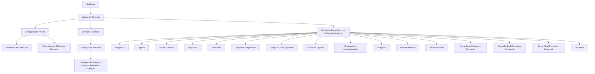

# Configuração de Terceiros por Código de Atividade no Reef.core

## 1. Metadados do Documento
- **Arquivo de Origem:** Não identificado no conteúdo fornecido
- **Tipo de Documento:** Apresentação Executiva
- **Domínio / Sistema:** Reef.core — Módulo de Terceiros
- **Público-Alvo:** Configuradores do sistema, analistas funcionais, administradores e equipes de negócio
- **Data/Versão Identificada:** Não identificada

---

## 2. Resumo Executivo & Contexto de Negócio

O documento apresenta a organização das definições configuráveis do **Módulo de Terceiros** no sistema **Reef.core**. No contexto apresentado, o termo **Terceros** abrange tanto pessoas físicas quanto pessoas jurídicas.

A configuração é estruturada em níveis. O primeiro nível reúne configurações prévias do sistema que não afetam exclusivamente o Módulo de Terceiros, mas são necessárias para realizar uma definição correta. Esse nível inclui referências a parâmetros de instalação e parâmetros do módulo.

O segundo nível contém definições comuns aplicáveis aos Terceiros independentemente do Código de Atividade associado. Também contempla os Catálogos de Terceiros que podem ser utilizados por qualquer atividade e operação do módulo.

O terceiro nível organiza definições específicas por Código de Atividade. Cada categoria de Terceiro possui definições próprias em catálogos, incluindo Asegurado, Agente, Supervisor, Tramitador, companhias de seguros e resseguros, entidades bancárias, níveis de estrutura comercial e fornecedores.

O documento não fornece detalhes sobre telas, campos de catálogo, regras de validação, métodos de integração, contratos de dados, permissões ou fluxos técnicos de persistência. A informação disponível delimita a taxonomia de configurações e os tipos de Terceiros suportados.

---

## 3. Arquitetura, Componentes & Tecnologias Envolvidas

O conteúdo descreve uma arquitetura funcional de configuração do **Módulo de Terceiros do Reef.core**, dividida em três níveis principais:

1. **Configurações Prévias:** configurações transversais do sistema necessárias para a definição de Terceiros.
2. **Definições Comuns:** definições e catálogos reutilizáveis para todos os Códigos de Atividade.
3. **Definições Específicas por Código de Atividade:** configurações de catálogos destinadas a tipos específicos de Terceiros.

Também são citados os elementos “Parámetros Instalación”, “Parámetros Módulo de Terceros”, “Home Solutions”, “APIs Documentation” e “Zeus”, sem detalhamento de suas funções, integrações, URLs, tecnologias ou contratos.



> **Nota de Análise:** O documento lista “Home Solutions”, “APIs Documentation” e “Zeus”, mas não especifica se são sistemas integrados, ferramentas de navegação, ambientes, módulos ou fontes documentais.

---

## 4. Regras de Negócio, Especificações Funcionais & Processos

### 4.1 Definição de Terceiros

- No Reef.core, o termo **Terceros** é utilizado para designar:
  - Pessoas físicas.
  - Pessoas jurídicas.
- Os Terceiros podem possuir um **Código de Atividade** associado.
- As configurações do Módulo de Terceiros são organizadas de acordo com o Código de Atividade dos Terceiros.

### 4.2 Configurações Prévias

- Existem configurações de sistema que não afetam exclusivamente o Módulo de Terceiros.
- Essas configurações são necessárias para realizar uma definição correta no Módulo de Terceiros.
- Os asteriscos nas tarjetas indicam a obrigatoriedade de definição de um elemento na configuração de Terceiros.
- O documento cita:
  - Parâmetros de instalação.
  - Parâmetros do Módulo de Terceiros.

### 4.3 Definições Comuns

- As definições comuns se aplicam aos Terceiros independentemente do Código de Atividade associado.
- Os Catálogos de Terceiros podem ser utilizados com qualquer Atividade e Operação do Módulo de Terceiros.

### 4.4 Definições Específicas por Código de Atividade

As definições específicas do Módulo de Terceiros são organizadas pelos seguintes Códigos de Atividade:

1. **Asegurado:** catálogos utilizados com os Asegurados.
2. **Agente:** catálogos utilizados com os Agentes.
3. **Tercero Genérico:** catálogos utilizados com os Terceiros Genéricos.
4. **Supervisor:** catálogos utilizados com os Supervisores de Siniestros.
5. **Tramitador:** catálogos utilizados com os Tramitadores de Siniestros.
6. **Compañía Aseguradora:** catálogos utilizados com as Companhias Aseguradoras.
7. **Compañía Reaseguradora:** catálogos utilizados com as Companhias Reaseguradoras.
8. **Broker de Seguros:** catálogos utilizados com os Brokers de Seguros.
9. **Empleado de Agencia/Agente:** catálogos utilizados com empregados de Agências ou Agentes.
10. **Compañía:** catálogos utilizados com as Companhias do Sistema.
11. **Entidad Bancaria:** catálogos utilizados com Entidades Bancárias do Sistema.
12. **Oficina Bancaria:** catálogos utilizados com escritórios bancários pertencentes a Entidades Bancárias.
13. **Primer Nivel Estructura Comercial:** catálogos utilizados no primeiro nível da estrutura comercial.
14. **Segundo Nivel Estructura Comercial:** catálogos utilizados no segundo nível da estrutura comercial.
15. **Tercer Nivel Estructura Comercial:** catálogos utilizados no terceiro nível da estrutura comercial.
16. **Proveedor:** catálogos de fornecedores, desde que o Código de Atividade do Terceiro o identifique como Proveedor.

> **Nota de Análise:** O documento não detalha os valores possíveis dos Códigos de Atividade, os campos disponíveis em cada catálogo, as regras de associação entre um Terceiro e múltiplos códigos, nem os mecanismos de manutenção dessas configurações.

---

## 5. Tabelas de Parâmetros, Ambientes e Estruturas de Dados

| Item / Parâmetro | Descrição / Função | Tipo / Valores / Formato | Ambiente / Observações |
| :--- | :--- | :--- | :--- |
| Reef.core | Sistema no qual o Módulo de Terceiros é configurado. | Sistema corporativo | O documento não informa versão, ambiente ou URL. |
| Módulo de Terceiros | Módulo responsável pelas definições relacionadas a pessoas físicas e jurídicas classificadas como Terceiros. | Módulo funcional | As configurações são organizadas por Código de Atividade. |
| Terceros | Termo utilizado no Reef.core para pessoas físicas e pessoas jurídicas. | Conceito de domínio | Pode possuir Código de Atividade associado. |
| Código de Atividade | Critério de organização das definições específicas de Terceiros. | Classificação funcional | Valores detalhados indiretamente pelos tipos de Terceiro listados. |
| Configurações Prévias | Configurações do sistema necessárias para a correta definição de Terceiros. | Nível de configuração | Não afetam exclusivamente o Módulo de Terceiros. |
| Parâmetros de Instalação | Parâmetros citados no nível de configurações prévias. | Parâmetro | Sem detalhamento de campos ou valores. |
| Parâmetros do Módulo de Terceiros | Parâmetros que afetam a funcionalidade e usabilidade do módulo na instalação Reef.core. | Parâmetro | Sem detalhamento de campos ou valores. |
| Asteriscos nas tarjetas | Indicadores de obrigatoriedade da definição de um elemento na configuração de Terceiros. | Regra visual de obrigatoriedade | O documento não identifica quais elementos possuem asterisco. |
| Definições Comuns | Definições aplicáveis a Terceiros sem depender do Código de Atividade. | Nível de configuração | Aplicável a todos os Códigos de Atividade. |
| Catálogos de Terceiros | Catálogos utilizáveis com qualquer Atividade e Operação do Módulo de Terceiros. | Estrutura de catálogo | Não são informados os campos ou valores dos catálogos. |
| Asegurado | Código de Atividade com catálogos próprios para Asegurados. | Tipo de Terceiro | Sem detalhamento adicional. |
| Agente | Código de Atividade com catálogos próprios para Agentes. | Tipo de Terceiro | Sem detalhamento adicional. |
| Tercero Genérico | Código de Atividade com catálogos próprios para Terceiros Genéricos. | Tipo de Terceiro | Sem detalhamento adicional. |
| Supervisor | Código de Atividade associado a Supervisores de Siniestros. | Tipo de Terceiro | Sem detalhamento adicional. |
| Tramitador | Código de Atividade associado a Tramitadores de Siniestros. | Tipo de Terceiro | Sem detalhamento adicional. |
| Compañía Aseguradora | Código de Atividade associado a Companhias Aseguradoras. | Tipo de Terceiro | Sem detalhamento adicional. |
| Compañía Reaseguradora | Código de Atividade associado a Companhias Reaseguradoras. | Tipo de Terceiro | Sem detalhamento adicional. |
| Broker de Seguros | Código de Atividade associado a Brokers de Seguros. | Tipo de Terceiro | Sem detalhamento adicional. |
| Empleado de Agencia/Agente | Código de Atividade associado a empregados de Agências ou Agentes. | Tipo de Terceiro | Sem detalhamento adicional. |
| Compañía | Código de Atividade associado a Companhias do Sistema. | Tipo de Terceiro | Sem detalhamento adicional. |
| Entidad Bancaria | Código de Atividade associado a Entidades Bancárias do Sistema. | Tipo de Terceiro | Sem detalhamento adicional. |
| Oficina Bancaria | Código de Atividade associado a escritórios bancários pertencentes a Entidades Bancárias. | Tipo de Terceiro | Sem detalhamento adicional. |
| Primer Nivel Estructura Comercial | Código de Atividade associado ao primeiro nível da estrutura comercial. | Tipo de Terceiro | Sem detalhamento adicional. |
| Segundo Nivel Estructura Comercial | Código de Atividade associado ao segundo nível da estrutura comercial. | Tipo de Terceiro | Sem detalhamento adicional. |
| Tercer Nivel Estructura Comercial | Código de Atividade associado ao terceiro nível da estrutura comercial. | Tipo de Terceiro | Sem detalhamento adicional. |
| Proveedor | Código de Atividade para fornecedores. | Tipo de Terceiro | Aplicável quando o Código de Atividade identifica o Terceiro como Proveedor. |
| Home Solutions | Item citado na apresentação. | Não identificado | Sem detalhamento funcional. |
| APIs Documentation | Item citado na apresentação. | Não identificado | Não há documentação de APIs, endpoints ou contratos no conteúdo fornecido. |
| Zeus | Item citado na apresentação. | Não identificado | Sem detalhamento funcional. |

---

## 6. Bateria de Perguntas & Respostas para RAG (FAQ Sintético)

### P1: O que significa o termo “Terceros” no Reef.core?
**R:** No Reef.core, o termo “Terceros” é utilizado tanto para pessoas físicas quanto para pessoas jurídicas. O documento apresenta o Módulo de Terceiros como a área de configuração responsável por definir elementos associados a esses Terceiros conforme seus Códigos de Atividade.

### P2: Como as configurações do Módulo de Terceiros são organizadas?
**R:** O documento organiza as configurações em três níveis: Configurações Prévias, Definições Comuns para todos os Códigos de Atividade e Definições Específicas de Terceiros por Código de Atividade.

### P3: Qual é a função das Configurações Prévias no Módulo de Terceiros?
**R:** As Configurações Prévias correspondem a configurações do sistema que não afetam exclusivamente o Módulo de Terceiros, mas são necessárias para realizar uma definição correta de Terceiros. O documento cita Parâmetros de Instalação e Parâmetros do Módulo de Terceiros nesse contexto.

### P4: O que os asteriscos nas tarjetas indicam?
**R:** Os asteriscos nas tarjetas indicam que a definição de determinado elemento é obrigatória na configuração dos Terceiros. O documento não especifica quais elementos concretos são obrigatórios.

### P5: Para que servem as Definições Comuns para todos os Códigos de Atividade?
**R:** As Definições Comuns agrupam configurações aplicáveis aos Terceiros independentemente do Código de Atividade associado. Nesse nível estão os Catálogos de Terceiros que podem ser usados com qualquer Atividade e Operação do Módulo de Terceiros.

### P6: Quais Códigos de Atividade relacionados a sinistros são citados?
**R:** O documento cita os Códigos de Atividade Supervisor e Tramitador. O Supervisor utiliza catálogos associados a Supervisores de Siniestros, enquanto o Tramitador utiliza catálogos associados a Tramitadores de Siniestros.

### P7: Quais tipos de companhias possuem definições específicas no Módulo de Terceiros?
**R:** O documento lista Compañía Aseguradora, Compañía Reaseguradora e Compañía. Cada uma possui definição em catálogos de Terceiros para seu respectivo contexto: companhias seguradoras, resseguradoras ou companhias do sistema.

### P8: Como um Terceiro é tratado como Proveedor?
**R:** O documento informa que os catálogos de Proveedores são utilizados com fornecedores desde que o Código de Atividade do Terceiro o identifique como um Proveedor. Não são detalhadas regras adicionais de validação ou campos de cadastro.

### P9: Quais elementos bancários são suportados nas definições específicas?
**R:** O documento apresenta Entidad Bancaria e Oficina Bancaria. Entidad Bancaria refere-se às Entidades Bancárias do Sistema, enquanto Oficina Bancaria refere-se às oficinas bancárias pertencentes a essas Entidades Bancárias.

### P10: Quais níveis de estrutura comercial são configuráveis?
**R:** O documento lista três níveis: Primer Nivel Estructura Comercial, Segundo Nivel Estructura Comercial e Tercer Nivel Estructura Comercial. Cada nível possui definições em catálogos de Terceiros para uso no respectivo nível da estrutura comercial.

### P11: O documento descreve APIs, endpoints ou contratos de integração?
**R:** Não. Embora “APIs Documentation” seja citado no conteúdo, o documento não apresenta endpoints, métodos HTTP, URLs, payloads, contratos JSON, mecanismos de autenticação ou regras de integração.

### P12: O documento informa os campos disponíveis nos Catálogos de Terceiros?
**R:** Não. O documento informa que existem Catálogos de Terceiros comuns e catálogos específicos por Código de Atividade, mas não descreve campos, tipos de dados, chaves, relacionamentos ou valores permitidos.

---

## 7. Glossário de Termos, Siglas & Conceitos-Chave

- **Reef.core:** Sistema no qual o Módulo de Terceiros e suas configurações são definidos.
- **Módulo de Terceiros:** Módulo do Reef.core destinado a configurações relacionadas a pessoas físicas e jurídicas denominadas Terceros.
- **Terceros:** Termo utilizado pelo Reef.core para abranger pessoas físicas e pessoas jurídicas.
- **Código de Atividade:** Critério utilizado para organizar definições específicas de Terceiros.
- **Catálogos de Terceiros:** Configurações de catálogo aplicáveis a Terceiros, seja de forma comum ou específica por Código de Atividade.
- **Asegurado:** Tipo de Terceiro associado a segurados.
- **Agente:** Tipo de Terceiro associado a agentes.
- **Tercero Genérico:** Tipo de Terceiro classificado como genérico.
- **Supervisor:** Tipo de Terceiro associado a Supervisores de Siniestros.
- **Tramitador:** Tipo de Terceiro associado a Tramitadores de Siniestros.
- **Siniestros:** Termo apresentado no contexto de Supervisores e Tramitadores; o documento não fornece definição adicional.
- **Compañía Aseguradora:** Companhia seguradora.
- **Compañía Reaseguradora:** Companhia resseguradora.
- **Broker de Seguros:** Broker relacionado a seguros.
- **Empleado de Agencia/Agente:** Empregado de uma agência ou agente.
- **Entidad Bancaria:** Entidade bancária do sistema.
- **Oficina Bancaria:** Escritório bancário pertencente a uma Entidade Bancária.
- **Estructura Comercial:** Estrutura comercial organizada em primeiro, segundo e terceiro níveis.
- **Proveedor:** Fornecedor identificado pelo Código de Atividade do Terceiro.

---

## 8. Notas Críticas, Riscos & Limitações

- O conteúdo é predominantemente uma visão estrutural e resumida das configurações do Módulo de Terceiros.
- Não há identificação do arquivo de origem, data, versão, autor, organização, ambiente ou público formal da apresentação.
- Não são apresentados campos, tipos de dados, valores de parâmetros, tabelas de banco de dados, APIs, URLs, portas, credenciais ou rotas de log.
- O documento não detalha critérios de validação para associação entre Terceiros e Códigos de Atividade.
- Não são especificadas regras de obrigatoriedade além da indicação de que asteriscos nas tarjetas representam elementos obrigatórios.
- Não há fluxo operacional para criação, alteração, exclusão, aprovação ou consulta de Terceiros.
- Não são apresentados controles de acesso, perfis de usuário, matriz de permissões ou responsabilidades por equipe.
- Os itens “Home Solutions”, “APIs Documentation” e “Zeus” são citados sem explicação funcional ou técnica.
- Não é possível inferir a implementação técnica, tecnologias de backend, banco de dados, protocolos de integração ou arquitetura de implantação a partir do conteúdo fornecido.

---

## 9. Conteúdo Bruto Estruturado (Referência Fiel)

```text
--- [PÁGINA 1 DE 3] ---

DEFINICIONES de los TERCEROS por Código
de Actividad
Relación de elementos que se pueden configurar en Reef.core para el Módulo de Terceros, de
acuerdo con el Código de Actividad que los Terceros pueden tener asociado.
En Reef.core se denominan tanto a las personas físicas como a las personas Jurídicas con el
término Terceros
CONFIGURACIONES Previas
En este nivel se encuentran configuraciones del Sistema que no afectan
exclusivamente al módulo de Terceros, pero son necesarias para
realizar una correcta definición.
Los Asteriscos de las Tarjetas muestran la obligatoriedad de la definición del elemento en la
configuración de los Terceros.
PARÁMETROS INSTALACIÓN
 PARÁMETROS MÓDULO DE TERCEROS
 / 
 CF
Home Solutions APIs Documentation Zeus
EN


--- [PÁGINA 2 DE 3] ---

Configuración de los Parámetros que afectan
transversalmente el comportamiento de la
Aplicación.
Configuración de los Parámetros que afectan
la Funcionalidad y Usabilidad del Módulo de
Terceros en la Instalación Reef.core.
DEFINICIONES COMUNES para todos los
Códigos de Actividad
En este nivel se encuentran las definiciones de los Terceros
independientemente del código actividad que los Terceros puedan tener
asociado.
CATÁLOGOS DE TERCEROS 
Configuración de los Catálogos de los Terceros que pueden ser utilizados con cualquier Actividad
y Operación del Módulo de Terceros.
DEFINICIONES ESPECÍFICAS de los Terceros
por Código de Actividad
En este nivel se encuentran las definiciones del Módulo de Terceros
organizadas por sus Códigos de Actividad:
ASEGURADO
Definición en los Catálogos de los Terceros
utilizados con los Asegurados.
AGENTE
Definición en los Catálogos de los Terceros
utilizados con los Agentes.
TERCERO GENÉRICO
Definición en los Catálogos de los Terceros
utilizados con los Terceros Genéricos.
SUPERVISOR
Definición en los Catálogos de los Terceros
utilizados con los Supervisores de Siniestros.
TRAMITADOR
 COMPAÑÍA ASEGURADORA


--- [PÁGINA 3 DE 3] ---

Definición en los Catálogos de los Terceros
utilizados con los Tramitadores de Siniestros.
Definición en los Catálogos de los Terceros
utilizados con las Compañías Aseguradoras.
COMPAÑÍA REASEGURADORA
Definición en los Catálogos de los Terceros
utilizados con las Compañías
Reaseguradoras.
BROKER DE SEGUROS
Definición en los Catálogos de los Terceros
utilizados con los Brokers de Seguros.
EMPLEADO DE AGENCIA/AGENTE
Definición en los Catálogos de los Terceros
utilizados con los Empleados de Agencias o
Agentes.
COMPAÑÍA
Definición en los Catálogos de los Terceros
utilizados con las Compañías del Sistema.
ENTIDAD BANCARIA
Definición en los Catálogos de los Terceros
utilizados con las Entidades Bancarias del
Sistema.
OFICINA BANCARIA
Definición en los Catálogos de los Terceros
utilizados con las Oficinas Bancarias
pertenecientes a las Entidades Bancarias.
PRIMER NIVEL ESTRUCTURA COMERCIAL
Definición en los Catálogos de los Terceros
utilizados en el Primer Nivel de la Estructura
Comercial.
SEGUNDO NIVEL ESTRUCTURA
COMERCIAL
Definición en los Catálogos de los Terceros
utilizados en el Segundo Nivel de la
Estructura Comercial.
TERCER NIVEL ESTRUCTURA
COMERCIAL
Definición en los Catálogos de los Terceros
utilizados en el Tercer Nivel de la Estructura
Comercial.
PROVEEDOR
Definición en los Catálogos de los
Proveedores utilizados con los Proveedores
siempre y cuando el Código de Actividad del
Tercero lo identifique como un Proveedor.
```
