# Definições e Catálogos de Terceiros no Reef.core

## 1. Metadados do Documento
- **Arquivo de Origem:** Não identificado
- **Tipo de Documento:** Apresentação Executiva
- **Domínio / Sistema:** Reef.core — gestão de Terceiros
- **Público-Alvo:** Negócio, Analistas Funcionais, Desenvolvedores e Arquitetos
- **Data/Versão Identificada:** Não identificada

---

## 2. Resumo Executivo & Contexto de Negócio

O documento descreve o conjunto de definições, catálogos e classificações utilizados para configurar Terceiros no sistema Reef.core. Os Terceiros são segmentados conforme a sua tipologia: **Pessoa Física** ou **Pessoa Jurídica**.

A estrutura apresentada organiza as definições em três níveis: definições comuns aplicáveis a qualquer Terceiro; definições exclusivas para Pessoas Físicas; e definições exclusivas para Pessoas Jurídicas. Essa separação permite que atributos, catálogos e validações sejam aplicados de acordo com a natureza do Terceiro.

As definições comuns cobrem elementos como atividades, campos obrigatórios, documentos identificadores, agrupamentos, categorias, classificações, meios de cobrança/pagamento, perfis financeiros, regimes fiscais, consentimentos e relações. O documento também inclui mecanismos de inabilitação e validações por expressões regulares.

Para Pessoas Físicas, o escopo inclui situações de permissões de conduzir, profissões, titulações e níveis de estudo. Para Pessoas Jurídicas, o escopo abrange cargos desempenhados por pessoas físicas, atividades econômicas e tipos de pessoas jurídicas.

> *Nota de Análise: O documento apresenta definições funcionais de catálogos, mas não detalha interfaces, modelos de dados, métodos HTTP, contratos JSON, persistência, permissões, URLs, ambientes ou integrações técnicas.*

---

## 3. Arquitetura, Componentes & Tecnologias Envolvidas

O documento não descreve uma arquitetura técnica de software, componentes de infraestrutura, microsserviços, bancos de dados ou tecnologias de implementação. A estrutura identificada é funcional e organiza catálogos de Terceiros no sistema Reef.core.

```mermaid
graph TD
  A[Terceiros no Reef.core] --> B[Definições comuns]
  A --> C[Definições específicas: Pessoas Físicas]
  A --> D[Definições específicas: Pessoas Jurídicas]

  B --> B1[Atividades]
  B --> B2[Campos obrigatórios]
  B --> B3[Documentos identificadores]
  B --> B4[Agrupações]
  B --> B5[Catálogo multipropósito]
  B --> B6[Categorias e classificações]
  B --> B7[Cobrança e pagamento]
  B --> B8[Regimes fiscais e impostos]
  B --> B9[Perfis financeiros e rating]
  B --> B10[Relacionamentos]
  B --> B11[Consentimentos]
  B --> B12[Inabilitação]
  B --> B13[Expressões regulares]

  C --> C1[Estados do permiso de conduzir]
  C --> C2[Profissões]
  C --> C3[Titulações]
  C --> C4[Níveis de estudos]

  D --> D1[Cargos]
  D --> D2[Atividades econômicas]
  D --> D3[Tipos de pessoas jurídicas]
```



### Componentes funcionais identificados

| Componente / Conceito | Descrição sustentada pelo documento |
| :--- | :--- |
| Reef.core | Sistema no qual Terceiros podem ser incapacitados e no qual podem ser realizadas validações com expressões regulares. |
| Terceiros | Entidades configuradas no sistema e segmentadas em Pessoas Físicas ou Pessoas Jurídicas. |
| Pessoa Física | Tipologia de Terceiro para a qual há definições exclusivas, como profissões e níveis de estudo. |
| Pessoa Jurídica | Tipologia de Terceiro para a qual há definições exclusivas, como atividades econômicas e tipos de pessoa jurídica. |
| Catálogos | Conjuntos de definições empregados para classificar, validar, caracterizar ou associar informações aos Terceiros. |

---

## 4. Regras de Negócio, Especificações Funcionais & Processos

### 4.1 Segmentação dos Terceiros

Os Terceiros são organizados de acordo com sua tipologia:

1. **Pessoa Física**
2. **Pessoa Jurídica**

Existem definições comuns, aplicáveis independentemente da tipologia, e definições específicas condicionadas à classificação do Terceiro como Pessoa Física ou Pessoa Jurídica.

### 4.2 Definições comuns para qualquer Terceiro

As seguintes definições podem ser utilizadas indistintamente para Pessoas Físicas e Pessoas Jurídicas:

- **Atividades:** definem as atividades dos Terceiros, incluindo exemplos como Segurados, Agentes, Peritos e Advogados.
- **Campos obrigatórios:** definem os dados obrigatórios que devem ser capturados no registro e na captura de informações dos Terceiros, conforme a atividade.
- **Documentos identificadores:** definem documentos identificadores dos Terceiros, como ID, SSN e NIF.
- **Agrupações:** definem agrupações dos Terceiros.
- **Catálogo multipropósito:** define códigos empregados pelos Terceiros, incluindo tipos de sociedades mercantis e grupos empresariais.
- **Categorias:** definem subconjuntos nos quais os Terceiros serão divididos.
- **Classificações:** definem classificações dos Terceiros.
- **Códigos de qualidade:** definem classificações dos Terceiros como códigos de qualidade.
- **Entidades de cobrança/pagamento:** definem entidades comercializadoras dos meios de cobrança e pagamento utilizados pelos Terceiros.
- **Meios de cobrança/pagamento:** definem os meios de cobrança e pagamento utilizados pelos Terceiros.
- **Tipos de token:** definem classificações dos tipos de token relacionados aos meios de pagamento utilizados pelos Terceiros.
- **Regimes fiscais:** definem classificações dos regimes fiscais apresentados pelos Terceiros.
- **Calificações (rating):** definem as classificações de rating dos Terceiros.
- **Perfis financeiros:** definem os possíveis perfis financeiros dos Terceiros.
- **Impostos ou retenções:** definem códigos de impostos ou retenções apresentados pelos Terceiros.
- **Parentescos ou relações:** definem os parentescos ou relações dos Terceiros.
- **Departamentos:** definem departamentos nos quais empresas são estruturadas para associação aos Terceiros.
- **Cargos em Pessoas Politicamente Expostas:** definem cargos para Pessoas Politicamente Expostas.
- **Consentimentos:** definem códigos dos possíveis consentimentos associados aos Terceiros.
- **Causas de inabilitação:** definem causas pelas quais Terceiros podem ser incapacitados no Reef.core.
- **Motivos de inabilitação:** definem motivos pelos quais Terceiros podem ser incapacitados segundo as atividades associadas.
- **Expressões regulares:** definem validações por expressões regulares que podem ser realizadas para Terceiros no Reef.core.
- **Expressões regulares por propriedade:** definem expressões regulares associadas às propriedades dos objetos.

### 4.3 Definições específicas para Pessoas Físicas

As definições abaixo são utilizadas exclusivamente quando o Terceiro é uma Pessoa Física:

- **Estados do permiso de conduzir:** definem as possíveis situações em que o permiso de conduzir pode se encontrar.
- **Profissões:** definem as profissões das Pessoas Físicas.
- **Titulações:** definem titulações ou títulos oficiais que Pessoas Físicas podem possuir.
- **Níveis de estudos:** definem níveis educacionais que Pessoas Físicas podem ter.

### 4.4 Definições específicas para Pessoas Jurídicas

As definições abaixo são utilizadas exclusivamente quando o Terceiro é uma Pessoa Jurídica:

- **Cargos:** definem cargos ou posições de Pessoas Físicas que trabalham em Pessoas Jurídicas, como CEO, CFO, COO e CIO.
- **Atividades econômicas:** definem atividades econômicas associadas às Pessoas Jurídicas, como serviços, industriais e comerciais.
- **Tipos de Pessoas Jurídicas:** definem tipos de Pessoas Jurídicas como classificações que essas entidades podem ter.

---

## 5. Tabelas de Parâmetros, Ambientes e Estruturas de Dados

| Item / Parâmetro | Descrição / Função | Tipo / Valores / Formato | Ambiente / Observações |
| :--- | :--- | :--- | :--- |
| Tipologia de Terceiro | Segmenta Terceiros conforme sua natureza. | Pessoa Física; Pessoa Jurídica. | Aplicável à configuração de Terceiros. |
| Atividades | Define as atividades dos Terceiros. | Exemplos: Asegurados, Agentes, Peritos, Abogados. | Definição comum. |
| Campos obrigatórios | Define dados obrigatórios para registro e captura de informações. | Associados à atividade. | Definição comum. |
| Documentos identificadores | Define documentos de identificação dos Terceiros. | Exemplos: ID, SSN, NIF. | Definição comum. |
| Agrupações | Define agrupações dos Terceiros. | Não detalhado. | Definição comum. |
| Catálogo multipropósito | Define códigos empregados pelos Terceiros. | Tipos de sociedades mercantis; grupos empresariais. | Definição comum. |
| Categorias | Divide Terceiros em subconjuntos. | Não detalhado. | Definição comum. |
| Classificações | Define classificações dos Terceiros. | Não detalhado. | Definição comum. |
| Códigos de qualidade | Define classificações como códigos de qualidade. | Não detalhado. | Definição comum. |
| Entidades de cobrança/pagamento | Define entidades comercializadoras dos meios utilizados. | Não detalhado. | Definição comum. |
| Meios de cobrança/pagamento | Define os meios de cobrança e pagamento empregados pelos Terceiros. | Não detalhado. | Definição comum. |
| Tipos de token | Define classificações de tipos de token para meios de pagamento. | Não detalhado. | Definição comum. |
| Regimes fiscais | Define classificações de regimes fiscais dos Terceiros. | Não detalhado. | Definição comum. |
| Calificações (Rating) | Define as calificaciones ou ratings dos Terceiros. | Não detalhado. | Definição comum. |
| Perfis financeiros | Define possíveis perfis financeiros dos Terceiros. | Não detalhado. | Definição comum. |
| Impostos ou retenções | Define códigos de impostos ou retenções dos Terceiros. | Não detalhado. | Definição comum. |
| Parentescos ou relações | Define parentescos ou relações dos Terceiros. | Não detalhado. | Definição comum. |
| Departamentos | Define departamentos de empresas para associação aos Terceiros. | Não detalhado. | Definição comum. |
| Cargos em Pessoas Politicamente Expostas | Define cargos relacionados a Pessoas Politicamente Expostas. | Não detalhado. | Definição comum. |
| Consentimentos | Define códigos de possíveis consentimentos associados aos Terceiros. | Não detalhado. | Definição comum. |
| Causas de inabilitação | Define causas para incapacitar Terceiros no Reef.core. | Não detalhado. | Definição comum. |
| Motivos de inabilitação | Define motivos para incapacitar Terceiros conforme as atividades associadas. | Não detalhado. | Definição comum. |
| Expressões regulares | Define validações por expressões regulares para Terceiros. | Expressões regulares. | Realizadas no Reef.core. |
| Expressões regulares por propriedade | Define expressões regulares associadas a propriedades de objetos. | Expressões regulares. | Definição comum. |
| Estados do permiso de conduzir | Define situações possíveis do permiso de conduzir. | Não detalhado. | Exclusivo para Pessoas Físicas. |
| Profissões | Define profissões das Pessoas Físicas. | Não detalhado. | Exclusivo para Pessoas Físicas. |
| Titulações | Define titulações ou títulos oficiais de Pessoas Físicas. | Não detalhado. | Exclusivo para Pessoas Físicas. |
| Níveis de estudos | Define níveis educacionais de Pessoas Físicas. | Não detalhado. | Exclusivo para Pessoas Físicas. |
| Cargos | Define cargos ou posições de Pessoas Físicas em Pessoas Jurídicas. | Exemplos: CEO, CFO, COO, CIO. | Exclusivo para Pessoas Jurídicas. |
| Atividades econômicas | Define atividades econômicas associadas a Pessoas Jurídicas. | Exemplos: Serviços, Industriais, Comerciais. | Exclusivo para Pessoas Jurídicas. |
| Tipos de Pessoas Jurídicas | Define classificações aplicáveis a Pessoas Jurídicas. | Não detalhado. | Exclusivo para Pessoas Jurídicas. |

---

## 6. Bateria de Perguntas & Respostas para RAG (FAQ Sintético)

### P1: Como os Terceiros são segmentados no Reef.core?
**R:** Os Terceiros são segmentados segundo sua tipologia em Pessoa Física ou Pessoa Jurídica. O documento separa as definições comuns das definições exclusivas para cada uma dessas tipologias.

### P2: Quais definições são aplicáveis tanto a Pessoas Físicas quanto a Pessoas Jurídicas?
**R:** As definições comuns incluem atividades, campos obrigatórios, documentos identificadores, agrupações, catálogo multipropósito, categorias, classificações, códigos de qualidade, cobrança e pagamento, regimes fiscais, rating, perfis financeiros, impostos ou retenções, relações, departamentos, consentimentos, inabilitação e expressões regulares.

### P3: Para que servem os campos obrigatórios dos Terceiros?
**R:** Os campos obrigatórios definem os dados que devem ser capturados durante o registro e a captura de informações dos Terceiros. Esses dados obrigatórios estão relacionados às atividades dos Terceiros.

### P4: Quais documentos identificadores são citados para Terceiros?
**R:** O documento cita ID, SSN e NIF como exemplos de documentos identificadores dos Terceiros. Não são descritas regras adicionais de formato, validação ou obrigatoriedade para esses documentos.

### P5: O que o Catálogo Multipropósito define?
**R:** O Catálogo Multipropósito define códigos empregados pelos Terceiros. Entre os exemplos apresentados estão tipos de sociedades mercantis e grupos empresariais.

### P6: Como a inabilitação de Terceiros é tratada no Reef.core?
**R:** O documento prevê causas de inabilitação pelas quais os Terceiros podem ser incapacitados no Reef.core. Também prevê motivos de inabilitação, aplicáveis conforme as atividades associadas aos Terceiros.

### P7: Qual é a finalidade das expressões regulares no contexto de Terceiros?
**R:** As expressões regulares definem validações que podem ser realizadas com os Terceiros no Reef.core. Há ainda expressões regulares por propriedade, associadas às propriedades dos objetos.

### P8: Quais informações são específicas de Pessoas Físicas?
**R:** Para Pessoas Físicas, o documento define estados do permiso de conduzir, profissões, titulações ou títulos oficiais e níveis educacionais.

### P9: Quais informações são específicas de Pessoas Jurídicas?
**R:** Para Pessoas Jurídicas, o documento define cargos ou posições de Pessoas Físicas que trabalham nessas entidades, atividades econômicas e tipos de Pessoas Jurídicas.

### P10: Quais exemplos de cargos são fornecidos para Pessoas Jurídicas?
**R:** O documento cita CEO, CFO, COO e CIO como exemplos de cargos ou posições de Pessoas Físicas que trabalham em Pessoas Jurídicas.

### P11: O que são entidades e meios de cobrança/pagamento no documento?
**R:** As entidades de cobrança/pagamento são entidades comercializadoras dos meios utilizados pelos Terceiros. Os meios de cobrança/pagamento são os próprios meios empregados pelos Terceiros. O documento não apresenta uma lista concreta desses meios ou entidades.

### P12: O documento define tecnologias, APIs ou integrações do Reef.core?
**R:** Não. O documento apresenta catálogos e definições funcionais para configuração de Terceiros. Não detalha tecnologias, APIs, endpoints, contratos JSON, bancos de dados, ambientes ou integrações.

---

## 7. Glossário de Termos, Siglas & Conceitos-Chave

- **Terceiro:** Entidade configurada no sistema, classificada como Pessoa Física ou Pessoa Jurídica.
- **Pessoa Física:** Tipologia de Terceiro para a qual se aplicam definições exclusivas como profissões, titulações e níveis de estudos.
- **Pessoa Jurídica:** Tipologia de Terceiro para a qual se aplicam definições exclusivas como cargos, atividades econômicas e tipos de pessoa jurídica.
- **Reef.core:** Sistema citado como contexto para inabilitação de Terceiros e validações com expressões regulares.
- **ID:** Exemplo de documento identificador de Terceiros; o documento não expande a sigla.
- **SSN:** Exemplo de documento identificador de Terceiros; o documento não expande a sigla.
- **NIF:** Exemplo de documento identificador de Terceiros; o documento não expande a sigla.
- **Rating:** Calificação associada aos Terceiros.
- **Token:** Tipo de token relacionado aos meios de pagamento utilizados pelos Terceiros.
- **Pessoa Politicamente Exposta:** Categoria citada no contexto de definição de cargos; o documento não apresenta definição adicional.
- **CEO:** Exemplo de cargo ou posição em Pessoas Jurídicas; o documento não expande a sigla.
- **CFO:** Exemplo de cargo ou posição em Pessoas Jurídicas; o documento não expande a sigla.
- **COO:** Exemplo de cargo ou posição em Pessoas Jurídicas; o documento não expande a sigla.
- **CIO:** Exemplo de cargo ou posição em Pessoas Jurídicas; o documento não expande a sigla.
- **Expressão regular:** Mecanismo de validação aplicável a Terceiros e a propriedades de objetos.

---

## 8. Notas Críticas, Riscos & Limitações

- O documento não identifica o nome do arquivo de origem, a versão ou a data de emissão.
- O documento não detalha arquitetura técnica, componentes de software, APIs, persistência de dados, ambientes, URLs, credenciais, logs ou mecanismos de integração.
- O documento não especifica quais campos são obrigatórios para cada atividade, apenas estabelece que existem campos obrigatórios associados às atividades.
- O documento não descreve os valores concretos dos catálogos, categorias, classificações, regimes fiscais, perfis financeiros, consentimentos ou causas de inabilitação.
- O documento cita validações por expressões regulares, mas não fornece os padrões, propriedades de objetos ou critérios de aplicação.
- O documento cita motivos de inabilitação vinculados às atividades associadas, mas não define regras de decisão, precedência, fluxo de aprovação ou efeitos operacionais da inabilitação.
- A expressão “Permiso de Conducir” foi mantida conforme apresentada no conteúdo original; o documento não detalha os estados possíveis.

---

## 9. Conteúdo Bruto Estruturado (Referência Fiel)

```text
--- [PÁGINA 1 DE 4] ---

DEFINICIONES de los TERCEROS
Relación de elementos que intervienen o pueden intervenir en la configuración de los Terceros en el
Sistema, segmentándolos de acuerdo con la Tipología del Tercero, es decir, diferenciando si éste es
una Persona Física o una Persona Jurídica.
DEFINICIONES COMUNES para cualquier
Tercero, independientemente que éstos sean
PERSONAS FÍSICAS ó PERSONAS JURÍDICAS
En este nivel se localizan catálogos que se utilizan indistintamente tanto
para Personas Físicas como para Personas Jurídicas.
ACTIVIDADES 
Definición de las Actividades de los Terceros:
Asegurados, Agentes, Peritos, Abogados,...
CAMPOS OBLIGATORIOS 
Definición de los Datos Obligatorios por
Actividad, que se tienen que capturar en el
registro y captura de la información de los
Terceros.
DOCUMENTOS IDENTIFICADORES 
 AGRUPACIONES
 / 
 CF
Home Solutions APIs Documentation Zeus
EN


--- [PÁGINA 2 DE 4] ---

Definición de los Documentos Identificadores
de los Terceros: ID, SSN, NIF,...
Definición de las Agrupaciones de los
Terceros.
CATÁLOGO MULTIPROPÓSITO 
Definición de los códigos empleados por los
Terceros en el Catálogo Multipropósito de los
Terceros: Tipos de Sociedades Mercantiles,
Grupos Empresariales,...
CATEGORÍAS
Definición de las Categorías en las que se
van a dividir los Terceros como subconjuntos
de los mismos.
CLASIFICACIONES
Definición de las Clasificaciones de los
Terceros.
CÓDIGOS DE CALIDAD
Definición de las clasificaciones de los
Terceros como Códigos de Calidad de los
Terceros.
ENTIDADES DE COBRO/PAGO
Definición de las Entidades comercializadoras
de los medios de Cobro/Pago utilizadas por
los Terceros.
MEDIOS DE COBRO/PAGO
Definición de los Medios de Cobro/Pago
empleados por los Terceros.
TIPOS DE TOKEN
Definición de las clasificaciones de los Tipos
de Token de los medios de Pago utilizados
por los Terceros.
REGÍMENES FISCALES
Definición de las clasificaciones de los
Regímenes Fiscales que presentan los
Terceros.
CALIFICACIONES (RATING)
Definición de las Calificaciones (Rating) que
poseen los Terceros.
PERFILES FINANCIEROS
Definición de los posibles Perfiles Financieros
que disfrutan los Terceros.
IMPUESTOS O RETENCIONES
Definición de los códigos de Impuestos o
Retenciones que presentan los Terceros.
PARENTESCOS O RELACIONES
Definición de los Parentescos o Relaciones
que disfrutan los Terceros.


--- [PÁGINA 3 DE 4] ---

DEPARTAMENTOS
Definición de los posibles Departamentos en
los que se estructuran las Empresas para su
asociación a los Terceros.
CARGOS EN PERSONAS POLÍTICAMENTE
EXPUESTAS
Definición de los Cargos en Personas
Políticamente Expuestas.
CONSENTIMIENTOS
Definición de los códigos de los posibles
Consentimientos que se asocian a los
Terceros.
CAUSAS DE INHABILITACIÓN 
Definición de las Causas de Inhabilitación por
las que se pueden incapacitar a los Terceros
en Reef.core.
MOTIVOS DE INHABILITACIÓN 
Definición de los Motivos de Inhabilitación**
por las que se pueden incapacitar a los
Terceros de acuerdo con las Actividades que
estos tengan asociadas.
EXPRESIONES REGULARES
Definición de las Validaciones con
Expresiones Regulares que se pueden
realizar con los Terceros en Reef.core.
EXPRESIONES REGULARES por
PROPIEDAD
Definición de las Expresiones Regulares que
se asocian a las propiedades de los objetos.
DEFINICIONES ESPECÍFICAS de los Terceros
cuando estos son PERSONAS FÍSICAS
En este nivel se encuentran definiciones que se emplean
exclusivamente cuando el Tercero es una Persona Física.
ESTADOS DEL PERMISO DE CONDUCIR
Definición de las posibles situaciones en las
que se pueda encontrar el Permiso de
Conducir.
PROFESIONES
Definición de las Profesiones de las Personas
Físicas.


--- [PÁGINA 4 DE 4] ---

TITULACIONES
Definición de las Titulaciones ó Títulos
Oficiales que las Personas Físicas puedan
poseer.
NIVELES DE ESTUDIOS
Definición de los Niveles Educativos que las
Personas Físicas puedan tener.
DEFINICIONES ESPECÍFICAS de los Terceros
cuando estos son PERSONAS JURÍDICAS
En este nivel se encuentran definiciones que se emplean
exclusivamente cuando el Tercero es una Persona Jurídica.
CARGOS
Definición de los Cargos o Posiciones de las
Personas Físicas que trabajan en Personas
Jurídicas: CEO, CFO, COO, CIO, ...
ACTIVIDADES ECONÓMICAS
Definición de las Actividades Económicas
asociadas a las Personas Jurídicas: Servicios,
Industriales, Comerciales,...
TIPOS DE PERSONAS JURÍDICAS
Definición de los Tipos de Personas Jurídicas
como Clasificaciones que éstas pueden tener.
```
