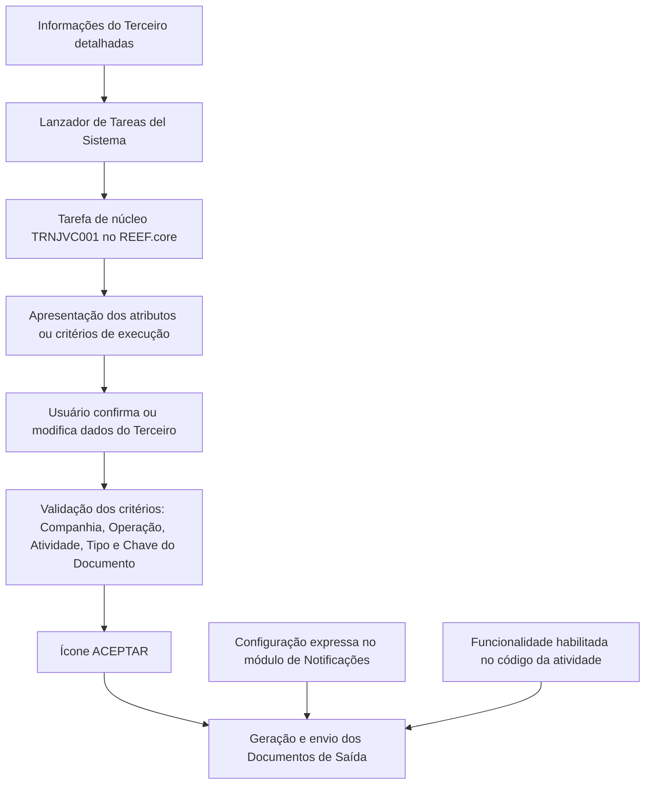

# Geração e Envio de Documentação de Terceiros no REEF.core

## 1. Metadados do Documento
- **Arquivo de Origem:** Não identificado — texto bruto fornecido pelo usuário.
- **Tipo de Documento:** Procedimento.
- **Domínio / Sistema:** REEF.core; módulo de Notificações; documentação de Terceiros.
- **Público-Alvo:** Operação, usuários funcionais e suporte do sistema.
- **Data/Versão Identificada:** Não identificada.

---

## 2. Resumo Executivo & Contexto de Negócio

O documento descreve o procedimento para gerar e enviar Documentos de Saída associados a um Terceiro no sistema REEF.core. A geração depende de uma configuração expressa no módulo de Notificações e da habilitação da funcionalidade no código da atividade do Terceiro.

Após detalhar as informações do Terceiro, o usuário deve executar o processo pelo Lanzador de Tareas do Sistema. No REEF.core, a execução ocorre por meio da tarefa de núcleo de código `TRNJVC001`.

A tarefa `TRNJVC001` apresenta, por padrão, os dados do Terceiro utilizado na chamada como atributos ou critérios de execução. O documento informa que esses dados podem ser modificados pelo usuário antes da confirmação da execução.

Os critérios de captura abrangem a Companhia, a Operação, a Atividade do Terceiro, o tipo de documento identificador e a chave do documento identificador. A confirmação final do processo ocorre pelo acionamento do ícone **ACEPTAR**.

---

## 3. Arquitetura, Componentes & Tecnologias Envolvidas

| Componente / Elemento | Papel identificado no documento |
| :--- | :--- |
| REEF.core | Sistema no qual a geração do documento é executada. |
| Módulo de Notificações | Módulo no qual deve existir configuração expressa para geração e envio dos Documentos de Saída. |
| Lanzador de Tareas del Sistema | Mecanismo utilizado para iniciar o processo após detalhar as informações do Terceiro. |
| Tarefa `TRNJVC001` | Tarefa de núcleo de código responsável pela geração do documento no REEF.core. |
| Terceiro | Entidade cujos dados são utilizados como critérios da chamada e para a geração documental. |
| Código da atividade | Deve ter a funcionalidade de geração documental habilitada. |
| Documentos de Saída | Documentos que devem ser gerados e enviados conforme a configuração existente. |



**Nota de Análise:** O documento não detalha protocolos de envio, métodos HTTP, contratos JSON, destinos dos documentos, formatos de arquivo, filas, bancos de dados ou mecanismos de tratamento de erro.

---

## 4. Regras de Negócio, Especificações Funcionais & Processos

### Condições necessárias para geração e envio

1. Os Documentos de Saída do Terceiro devem ser gerados e enviados de acordo com a configuração expressamente realizada no módulo de Notificações.
2. O código da atividade do Terceiro deve ter a funcionalidade habilitada.
3. As informações do Terceiro devem ser detalhadas antes da execução do processo.
4. O processo deve ser iniciado pelo Lanzador de Tareas del Sistema.
5. No REEF.core, a geração deve utilizar a tarefa de núcleo de código `TRNJVC001`.
6. A tarefa `TRNJVC001` apresenta, por padrão, como atributos ou critérios de execução os dados do Terceiro utilizado na chamada.
7. O usuário pode modificar os dados apresentados pela tarefa antes da execução.
8. A sequência de captura dos campos segue a ordem indicada no documento: da esquerda para a direita e de cima para baixo.
9. Após informar ou ajustar os critérios necessários, o usuário deve pressionar o ícone **ACEPTAR**.

### Critérios de execução da tarefa `TRNJVC001`

1. Informar o **Código de Compañía** da entidade seguradora utilizada na execução da tarefa.
2. Informar o código da **Operação** no campo correspondente ao filtro de operação.
3. Informar o código da **Actividad del Tercero**, por exemplo: Asegurado, Agente ou Abogado.
4. Informar o **Tipo de Documento Identificador**, utilizando uma tipologia previamente configurada no sistema.
5. Informar a **Clave del Documento Identificador**, correspondente à chave do Terceiro.
6. Confirmar a execução pelo ícone **ACEPTAR**.

---

## 5. Tabelas de Parâmetros, Ambientes e Estruturas de Dados

| Item / Parâmetro | Descrição / Função | Tipo / Valores / Formato | Ambiente / Observações |
| :--- | :--- | :--- | :--- |
| `TRNJVC001` | Tarefa de núcleo de código executada para gerar documentação no REEF.core. | Código de tarefa. | Apresenta por padrão os dados do Terceiro; o usuário pode modificá-los. |
| Código de Compañía | Identifica a Companhia da entidade seguradora para a execução da tarefa. | Código de Companhia. | Utilizado na execução da tarefa. |
| Filtro Operação | Campo associado à Operação da execução. | Campo de filtro. | O documento apresenta o rótulo “Operação”. |
| Operação | Identifica a operação. | Código de Operação. | Deve ser informado no campo correspondente. |
| Actividad del Tercero | Identifica a atividade do Terceiro. | Código de atividade. | Exemplos: Asegurado, Agente e Abogado. |
| Tipo de Documento Identificador | Define a tipologia documental para identificar uma pessoa física ou jurídica. | Tipo de documento previamente configurado. | A tipologia deve existir previamente no sistema. |
| Clave del Documento Identificador | Contém a chave do Terceiro. | Chave do Terceiro. | Atributo da tarefa. |
| Ícone `ACEPTAR` | Confirma a execução após o preenchimento dos critérios. | Ação de interface. | Etapa final indicada pelo documento. |
| Módulo de Notificações | Mantém a configuração necessária para gerar e enviar Documentos de Saída. | Módulo do sistema. | A configuração deve ser expressamente realizada. |
| Código da atividade | Determina a habilitação da funcionalidade de documentação. | Configuração de atividade. | A funcionalidade deve estar habilitada. |

### Tipos de Documento Identificador citados

| Tipo de Documento | País / Contexto | Descrição |
| :--- | :--- | :--- |
| NIF | Espanha | Número de Identificação Fiscal. |
| DNI | Espanha | Documento Nacional de Identidade. |
| RFC | México | Registro Federal de Contribuyentes. |
| RUT | Chile | Rol Único Tributario. |
| RUT | Colômbia | Registro único Tributario. |
| TIN | Malta | Tax Identification Number. |

---

## 6. Bateria de Perguntas & Respostas para RAG (FAQ Sintético)

### P1: Qual é o objetivo da tarefa `TRNJVC001` no REEF.core?
**R:** A tarefa de núcleo de código `TRNJVC001` é utilizada no REEF.core para executar a geração de documentação do Terceiro. O processo visa gerar e enviar os Documentos de Saída do Terceiro conforme a configuração existente no módulo de Notificações.

### P2: Quais condições precisam existir para que os Documentos de Saída do Terceiro sejam gerados e enviados?
**R:** Devem existir duas condições principais: uma configuração expressamente realizada no módulo de Notificações e a habilitação dessa funcionalidade no código da atividade do Terceiro.

### P3: Como o processo de geração de documentos é iniciado?
**R:** Depois que as informações do Terceiro forem detalhadas, o processo deve ser executado por meio do Lanzador de Tareas del Sistema.

### P4: Quais dados a tarefa `TRNJVC001` mostra inicialmente?
**R:** A tarefa `TRNJVC001` mostra, por padrão, como atributos ou critérios de execução, os dados do Terceiro com o qual a chamada é realizada.

### P5: Os critérios preenchidos pela tarefa `TRNJVC001` podem ser alterados?
**R:** Sim. Embora a tarefa apresente por padrão os dados do Terceiro utilizado na chamada, o documento informa que esses dados podem ser modificados pelo usuário.

### P6: O que representa o campo Código de Compañía?
**R:** O campo Código de Compañía contém o código da Companhia da entidade seguradora com a qual será realizada a execução da tarefa.

### P7: Qual informação deve ser preenchida em Actividad del Tercero?
**R:** O parâmetro Actividad del Tercero deve conter o código da atividade do Terceiro. O documento cita como exemplos as atividades Asegurado, Agente e Abogado.

### P8: Para que serve o Tipo de Documento Identificador?
**R:** O Tipo de Documento Identificador contém a tipologia do documento usado para identificar uma pessoa física ou jurídica. Os tipos devem ter sido configurados previamente no sistema.

### P9: Quais tipos de documentos identificadores são exemplificados no procedimento?
**R:** O documento exemplifica NIF e DNI para a Espanha, RFC para o México, RUT para Chile e Colômbia, e TIN para Malta. Cada tipo possui uma descrição específica conforme o país ou contexto indicado.

### P10: O que deve ser informado na Clave del Documento Identificador?
**R:** A Clave del Documento Identificador deve conter a chave do Terceiro e é apresentada como um atributo da tarefa.

### P11: Qual é a ação final para executar o processo?
**R:** Após preencher ou ajustar os critérios de execução, o usuário deve pressionar o ícone **ACEPTAR**.

### P12: O documento detalha como os documentos são enviados após a geração?
**R:** Não. O documento informa que os Documentos de Saída devem ser gerados e enviados conforme a configuração no módulo de Notificações, mas não detalha o canal, protocolo, destino ou formato do envio.

---

## 7. Glossário de Termos, Siglas & Conceitos-Chave

- **REEF.core:** Sistema no qual a tarefa `TRNJVC001` realiza a geração documental.
- **Terceiro:** Entidade cujos dados são usados como critérios de execução e para a documentação gerada.
- **Documentos de Saída:** Documentos associados ao Terceiro que devem ser gerados e enviados.
- **Lanzador de Tareas del Sistema:** Mecanismo do sistema utilizado para iniciar o processo.
- **TRNJVC001:** Código da tarefa de núcleo executada para gerar o documento no REEF.core.
- **Código de Compañía:** Código da Companhia da entidade seguradora utilizada na execução.
- **Operação:** Código da operação utilizado como critério de execução.
- **Actividad del Tercero:** Código da atividade do Terceiro, como Asegurado, Agente ou Abogado.
- **Tipo de Documento Identificador:** Tipologia de documento usada para identificar pessoa física ou jurídica.
- **Clave del Documento Identificador:** Chave do Terceiro informada como atributo da tarefa.
- **NIF:** Número de Identificação Fiscal, citado para Espanha.
- **DNI:** Documento Nacional de Identidade, citado para Espanha.
- **RFC:** Registro Federal de Contribuyentes, citado para México.
- **RUT:** Rol Único Tributario no Chile; Registro único Tributario na Colômbia.
- **TIN:** Tax Identification Number, citado para Malta.
- **ACEPTAR:** Ícone utilizado para confirmar a execução do processo.

---

## 8. Notas Críticas, Riscos & Limitações

- A geração e o envio dos Documentos de Saída dependem simultaneamente da configuração no módulo de Notificações e da habilitação da funcionalidade no código da atividade.
- A tarefa `TRNJVC001` permite modificação dos dados inicialmente apresentados; alterações incorretas nos critérios podem afetar a execução documental.
- O documento não especifica validações de formato para códigos, chaves ou tipos documentais.
- O documento não descreve mensagens de erro, critérios de sucesso, retentativas, auditoria ou recuperação em caso de falha.
- O documento não detalha os formatos dos Documentos de Saída, os destinatários, os canais de envio ou as integrações técnicas envolvidas.
- O documento não apresenta ambientes, servidores, URLs, endpoints, credenciais ou dependências de infraestrutura.

---

## 9. Conteúdo Bruto Estruturado (Referência Fiel)

```text
--- [PÁGINA 1 DE 2] ---

GENERAR Documentación del Tercero
Objetivo
Generar y enviar los Documentos de Salida del Tercero de acuerdo con la configuración
expresamente realizada en el módulo de Notificaciones y además el código de la actividad tenga
habilitada esta funcionalidad.
Hilo del Proceso
Una vez se ha detallado la información del Tercero, se tiene que ejecutar el proceso definido
mediante el Lanzador de Tareas del Sistema.
En Reef.core la generación del documento se realiza ejecutando la Tarea del núcleo de código:
'TRNJVC001', tarea que por defecto muestra como Atributos o criterios de ejecución los Datos del
Tercero con el que se realiza la llamada (si bien estos datos pueden ser modificados por el Usuario)
De izquierda a derecha y de arriba hacia abajo los siguientes campos marcan la secuencia en el
orden de su captura.
 / 
 RS
Inicio Soluciones APIs Documentación Zeus
ES


--- [PÁGINA 2 DE 2] ---

Código de Compañía
Este Campo contiene el código de Compañía de la Entidad Aseguradora con el que se va a realizar
la ejecución de la Tarea.
Filtro Operación
Operación
Este Campo contiene el código de la Operación
Actividad del Tercero
Este Parámetro contiene el código de la Actividad del Tercero (Asegurado, Agente, Abogado,...)
Tipo de Documento Identificador
Este Campo contiene la Tipología del Documento con el que se va a identificar a la persona física o
jurídica de acuerdo con los tipos de documentos que hayan sido configurados en el sistema
previamente. Por ejemplo:
TIPO DE DOCUMENTO DESCRIPCIÓN
NIF - España Número de Identificación Fiscal
DNI - España Documento Nacional de Identidad
RFC - México Registro Federal de Contribuyentes
RUT - Chile Rol Único Tributario
RUT - Colombia Registro único Tributario
TIN - Malta Tax Identification Number
Clave del Documento Identificador
Este Atributo de la Tarea contendrá la clave del Tercero.
... y por último, se pulsa el icono ACEPTAR.
```
