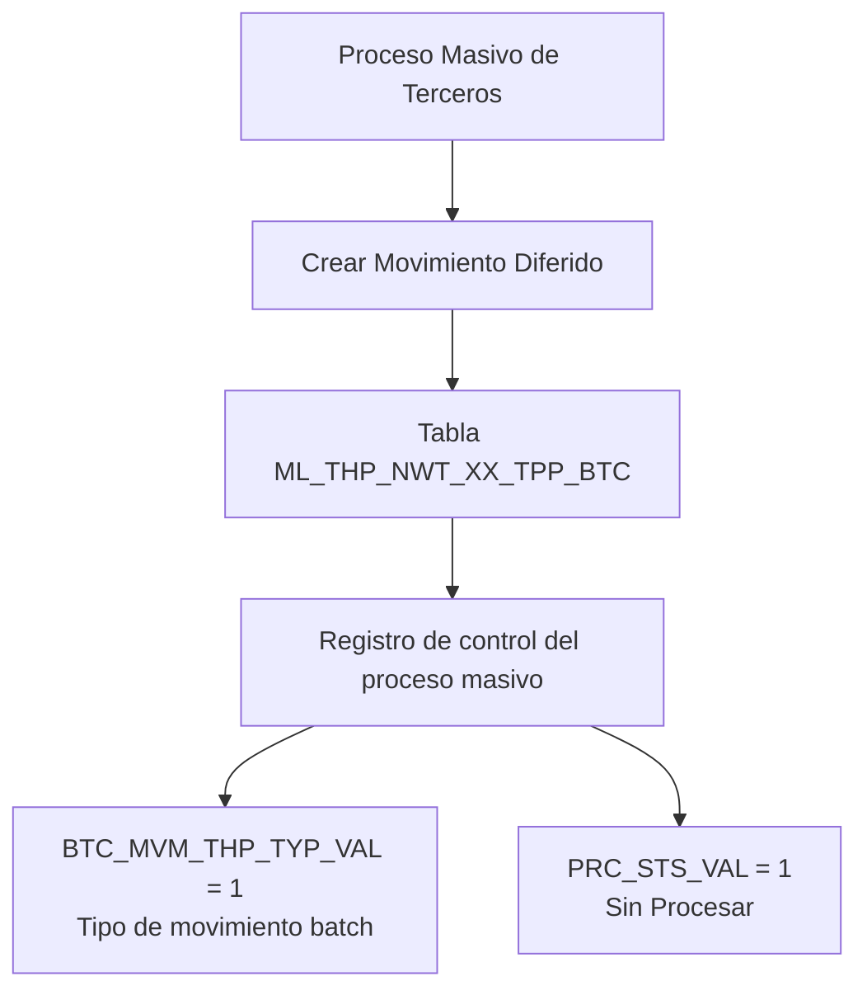

# Criar Movimento Diferido do Processo Massivo de Terceiros — Visão Técnica e Modelo de Dados

## 1. Metadados do Documento
- **Arquivo de Origem:** Não identificado; conteúdo bruto fornecido pelo usuário
- **Tipo de Documento:** Especificação Técnica
- **Domínio / Sistema:** Processo Massivo de Terceiros
- **Público-Alvo:** Desenvolvedores, Arquitetos e Operação
- **Data/Versão Identificada:** Não identificada

---

## 2. Resumo Executivo & Contexto de Negócio

O documento apresenta uma visão técnica para a criação de um movimento diferido no contexto do **Proceso Masivo de Terceros**. O conteúdo identifica a tabela de controle utilizada na operação: `ML_THP_NWT_XX_TPP_BTC`.

A tabela `ML_THP_NWT_XX_TPP_BTC` é descrita como a **TABLA CONTROL PROCESOS MASIVOS TERCEROS**. O documento relaciona colunas que devem ser preenchidas ou alteradas para representar o movimento, incluindo identificadores, dados de processamento, documento e atividade do terceiro, usuário e data de modificação.

Duas regras de valor explícitas são apresentadas: `BTC_MVM_THP_TYP_VAL` assume o valor `1` para o tipo de movimento batch, e `PRC_STS_VAL` inicia com o valor `1`, correspondente ao estado **Sin Procesar**.

O material não descreve métodos HTTP, contratos JSON, serviços, mecanismos de persistência, transações, regras de reprocessamento, critérios de erro ou detalhamento dos campos abreviados. A especificação disponível está limitada ao modelo de dados envolvido e aos valores indicados.

---

## 3. Arquitetura, Componentes & Tecnologias Envolvidas

### Componentes identificados

| Componente | Descrição sustentada pelo documento |
| :--- | :--- |
| Proceso Masivo de Terceros | Processo no qual ocorre a criação de movimento diferido. |
| Movimento diferido | Operação técnica descrita no título do documento. |
| `ML_THP_NWT_XX_TPP_BTC` | Tabela de controle dos processos massivos de terceiros. |
| Movimento batch | Tipo de movimento associado ao valor `1` em `BTC_MVM_THP_TYP_VAL`. |
| Estado “Sin Procesar” | Estado inicial associado ao valor `1` em `PRC_STS_VAL`. |



**Nota de Análise:** O documento não identifica aplicações, microsserviços, APIs, bancos de dados, tecnologias de implementação, URLs, ambientes ou integrações externas. O diagrama representa somente a relação operacional explicitamente indicada entre o processo, a criação do movimento diferido e a tabela de controle.

---

## 4. Regras de Negócio, Especificações Funcionais & Processos

### Processo técnico identificado

1. O contexto funcional é a criação de um movimento diferido do **Proceso Masivo de Terceros**.
2. A operação envolve a tabela `ML_THP_NWT_XX_TPP_BTC`.
3. A tabela é classificada como tabela de controle dos processos massivos de terceiros.
4. O registro de controle contém valores relacionados a companhia, identificação, data de processamento, número da ordem de processo, hilo, tipo de movimento batch, documento e atividade do terceiro, situação do processo, usuário e data de modificação.
5. O campo `BTC_MVM_THP_TYP_VAL` deve assumir o valor `1`, indicado como tipo de movimento batch.
6. O campo `PRC_STS_VAL` deve iniciar com o valor `1`, indicado como **Sin Procesar**.
7. As colunas listadas no documento são sinalizadas como obrigatórias na coluna de obrigatoriedade apresentada.

### Restrições e ausência de detalhamento

- O documento não define o significado expandido de siglas como `CMP`, `BTC`, `POC`, `PRC`, `THP`, `DCM`, `ACV`, `STS`, `USR` ou `MDF`.
- O documento não informa os tipos físicos das colunas, tamanhos, domínios, chaves primárias, chaves estrangeiras ou índices.
- O documento não especifica qual evento inicia a operação de criação do movimento diferido.
- O documento não detalha os valores aceitos para campos marcados como `N.A.`.
- O documento não descreve validações, mensagens de erro, tratamento de duplicidade, concorrência, auditoria ou reprocessamento.

---

## 5. Tabelas de Parâmetros, Ambientes e Estruturas de Dados

### Tabela envolvida

| Item / Parâmetro | Descrição / Função | Tipo / Valores / Formato | Ambiente / Observações |
| :--- | :--- | :--- | :--- |
| `ML_THP_NWT_XX_TPP_BTC` | Tabela de controle de processos massivos de terceiros. | Não informado. | Tabela envolvida na criação de movimento diferido. |

### Colunas e valores extraídos

| Item / Parâmetro | Descrição / Função | Tipo / Valores / Formato | Ambiente / Observações |
| :--- | :--- | :--- | :--- |
| `CMP_VAL` | Campo associado a companhia. | `N.A.` | Obrigatório conforme documento. |
| `BTC_IDN_VAL` | Campo associado a identificação. | `N.A.` | Obrigatório conforme documento. |
| `POC_DAT` | Campo associado a data de tratamento/processamento. | `N.A.` | Obrigatório conforme documento. O texto extraído está truncado. |
| `POC_ORD_NBR` | Campo associado ao número da ordem de processo. | `N.A.` | Obrigatório conforme documento. |
| `PRC_THD_VAL` | Campo associado ao hilo. | `N.A.` | Obrigatório conforme documento. |
| `BTC_MVM_THP_TYP_VAL` | Tipo de movimento batch. | Assume o valor `1`. | Obrigatório conforme documento. |
| `THP_DCM_TYP_VAL` | Campo associado ao tipo de documento do terceiro. | `N.A.` | Obrigatório conforme documento. |
| `THP_DCM_VAL` | Campo associado ao documento do terceiro. | `N.A.` | Obrigatório conforme documento. |
| `THP_ACV_VAL` | Campo associado à atividade do terceiro. | `N.A.` | Obrigatório conforme documento. |
| `PRC_STS_VAL` | Campo associado à situação do processo. | Inicialmente assume o valor `1`: `Sin Procesar`. | Obrigatório conforme documento. |
| `USR_VAL` | Campo associado ao usuário que atualiza a fila. | `N.A.` | Obrigatório conforme documento. O texto extraído está truncado. |
| `MDF_DAT` | Campo associado à data de modificação. | `N.A.` | Obrigatório conforme documento. |

### Ambientes, servidores e rotas

| Item / Parâmetro | Descrição / Função | Tipo / Valores / Formato | Ambiente / Observações |
| :--- | :--- | :--- | :--- |
| Ambientes | Não identificados. | Não informado. | O documento não apresenta URLs, servidores ou ambientes. |
| Rotas de logs | Não identificadas. | Não informado. | O documento não apresenta caminhos de log. |
| APIs | Não identificadas. | Não informado. | O documento não apresenta endpoints ou contratos. |

---

## 6. Bateria de Perguntas & Respostas para RAG (FAQ Sintético)

### P1: Qual tabela é utilizada na criação do movimento diferido do Processo Massivo de Terceiros?
**R:** A tabela utilizada é `ML_THP_NWT_XX_TPP_BTC`, descrita no documento como a tabela de controle dos processos massivos de terceiros.

### P2: Qual é a finalidade da tabela `ML_THP_NWT_XX_TPP_BTC`?
**R:** A `ML_THP_NWT_XX_TPP_BTC` é apresentada como a tabela de controle dos processos massivos de terceiros, envolvida na operação de criação de movimento diferido.

### P3: Qual valor deve ser atribuído ao campo `BTC_MVM_THP_TYP_VAL`?
**R:** O campo `BTC_MVM_THP_TYP_VAL` deve receber o valor `1`. O documento associa esse valor ao tipo de movimento batch.

### P4: Qual é o estado inicial do processamento registrado em `PRC_STS_VAL`?
**R:** O campo `PRC_STS_VAL` deve iniciar com o valor `1`, que o documento identifica como o estado `Sin Procesar`.

### P5: Quais campos do registro estão relacionados ao documento do terceiro?
**R:** Os campos relacionados ao documento do terceiro são `THP_DCM_TYP_VAL`, associado ao tipo de documento do terceiro, e `THP_DCM_VAL`, associado ao documento do terceiro.

### P6: Qual campo representa a atividade do terceiro?
**R:** O campo `THP_ACV_VAL` é associado à atividade do terceiro.

### P7: Quais campos estão relacionados à identificação e à companhia?
**R:** O campo `CMP_VAL` está associado à companhia e o campo `BTC_IDN_VAL` está associado à identificação.

### P8: O documento especifica os tipos físicos ou tamanhos das colunas da tabela?
**R:** Não. O documento lista as colunas, indica valores como `N.A.` e destaca valores específicos para `BTC_MVM_THP_TYP_VAL` e `PRC_STS_VAL`, mas não informa tipos físicos, tamanhos ou restrições de banco de dados.

### P9: O documento descreve APIs ou métodos HTTP para criar o movimento diferido?
**R:** Não. O conteúdo disponível não descreve APIs, endpoints, métodos HTTP, contratos JSON ou microsserviços responsáveis pela criação do movimento diferido.

### P10: Quais campos registram dados de usuário e data de modificação?
**R:** O campo `USR_VAL` é associado ao usuário que atualiza a fila, enquanto `MDF_DAT` é associado à data de modificação.

---

## 7. Glossário de Termos, Siglas & Conceitos-Chave

- **Proceso Masivo de Terceros:** Processo massivo relacionado a terceiros, citado como contexto da criação de movimento diferido.
- **Movimento diferido:** Operação técnica cujo processo de criação é abordado pelo documento.
- **`ML_THP_NWT_XX_TPP_BTC`:** Tabela de controle dos processos massivos de terceiros.
- **Batch:** Tipo de movimento associado ao valor `1` em `BTC_MVM_THP_TYP_VAL`.
- **Sin Procesar:** Estado inicial associado ao valor `1` em `PRC_STS_VAL`.
- **`CMP_VAL`:** Campo associado a companhia.
- **`BTC_IDN_VAL`:** Campo associado a identificação.
- **`POC_DAT`:** Campo associado a uma data de tratamento ou processamento; a descrição extraída está incompleta.
- **`POC_ORD_NBR`:** Campo associado ao número da ordem de processo.
- **`PRC_THD_VAL`:** Campo associado ao hilo.
- **`THP_DCM_TYP_VAL`:** Campo associado ao tipo de documento do terceiro.
- **`THP_DCM_VAL`:** Campo associado ao documento do terceiro.
- **`THP_ACV_VAL`:** Campo associado à atividade do terceiro.
- **`PRC_STS_VAL`:** Campo associado à situação do processo.
- **`USR_VAL`:** Campo associado ao usuário que atualiza a fila.
- **`MDF_DAT`:** Campo associado à data de modificação.

---

## 8. Notas Críticas, Riscos & Limitações

- **Cobertura documental limitada:** O conteúdo fornecido apresenta somente a visão técnica baseada em uma tabela e suas colunas.
- **Extração truncada:** Algumas descrições aparecem parcialmente cortadas, incluindo referências a data de tratamento, número de ordem, usuário e data de modificação.
- **Tipos não especificados:** Não há definição de tipo de dado, tamanho, nulidade, chaves, índices ou relacionamentos da tabela.
- **Sem fluxo de erro:** Não existem regras de exceção, retorno, reprocessamento, idempotência ou tratamento de falhas.
- **Sem interfaces técnicas:** O documento não detalha APIs, endpoints, jobs, filas, serviços, eventos ou contratos de integração.
- **Siglas não expandidas:** As abreviações das colunas não são formalmente definidas pelo material fornecido.
- **Nota de Análise:** O documento afirma que as colunas indicadas são obrigatórias, mas não detalha o mecanismo técnico que impõe essa obrigatoriedade.

---

## 9. Conteúdo Bruto Estruturado (Referência Fiel)

```text
--- [PÁGINA 1 DE 2] ---

CREAR MOVIMIENTO DIFERIDO del Proceso
Masivo de Terceros (Visión Técnica)
Modelo de datos involucrado
La tabla que interviene en esta operación es:
TABLA DESCRIPCIÓN
ML_THP_NWT_XX_TPP_BTC TABLA CONTROL PROCESOS MASIVOS TERCEROS
COLUMNA CAMBIA
VALOR
MOTIVO/VALOR OBLIGATORIA COMEN
CMP_VAL S N.A. SI COMPAN
BTC_IDN_VAL S N.A. SI IDENTIF
POC_DAT S N.A. SI FECHA D
TRATAM
 / 
 RS
Inicio Soluciones APIs Documentación Zeus
ES


--- [PÁGINA 2 DE 2] ---

COLUMNA CAMBIA
VALOR
MOTIVO/VALOR OBLIGATORIA COMEN
POC_ORD_NBR S N.A. SI NUMERO
ORDEN 
PROCES
PRC_THD_VAL S N.A. SI HILO
BTC_MVM_THP_TYP_VAL S Toma el Valor 1 SI TIPO DE
MOVIMI
BATCH
THP_DCM_TYP_VAL S N.A. SI TIPO DE
DOCUM
DEL TER
THP_DCM_VAL S N.A. SI DOCUM
DEL TER
THP_ACV_VAL S N.A. SI ACTIVID
TERCER
PRC_STS_VAL S Inicialmente
Toma el valor 1
Sin Procesar
SI SITUAC
PROCES
USR_VAL S N.A. SI USUARI
ACTUAL
FILA
MDF_DAT S N.A. SI FECHA
MODIFIC
```
