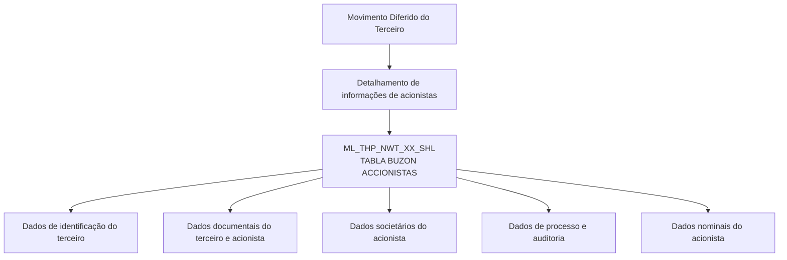
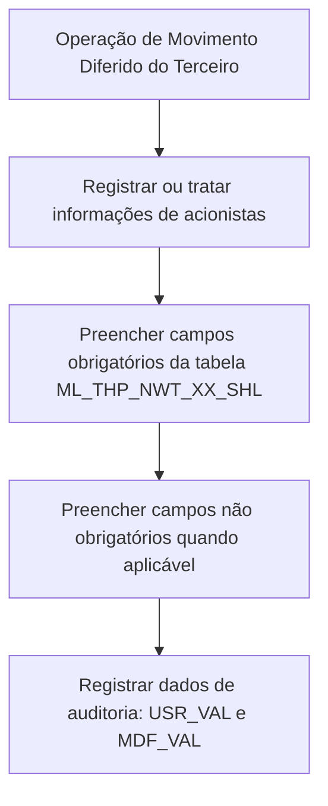

# Detalhamento Técnico de Acionistas no Movimento Diferido do Terceiro

## 1. Metadados do Documento
- **Arquivo de Origem:** Não identificado no conteúdo fornecido
- **Tipo de Documento:** Especificação Técnica
- **Domínio / Sistema:** Movimento Diferido do Terceiro — Acionistas
- **Público-Alvo:** Desenvolvedores, Arquitetos, Analistas Funcionais e Operação
- **Data/Versão Identificada:** Não identificada

---

## 2. Resumo Executivo & Contexto de Negócio

O documento descreve a visão técnica para detalhar informações de acionistas no contexto do **Movimento Diferido do Terceiro**. O foco apresentado é o modelo de dados envolvido na operação, especificamente a tabela de caixa postal de acionistas.

A tabela identificada para a operação é `ML_THP_NWT_XX_SHL`, descrita como **TABLA BUZON ACCIONISTAS**. O documento relaciona as colunas dessa tabela, indicando se cada valor muda, o motivo ou valor associado, a obrigatoriedade e um comentário funcional resumido.

As informações cobrem a identificação do terceiro, os documentos do terceiro e do acionista, atividade do terceiro, dados de pessoa politicamente exposta, estado do processo, datas de vínculo societário, percentual de participação, cargo do acionista, dados de auditoria e dados nominais do acionista.

O conteúdo fornecido não detalha métodos HTTP, contratos JSON, integrações entre sistemas, processamento de mensagens, regras de persistência, mecanismos de validação ou comportamento transacional. A especificação limita-se à estrutura de campos da tabela de acionistas e à indicação de obrigatoriedade.

---

## 3. Arquitetura, Componentes & Tecnologias Envolvidas

O único componente de dados explicitamente identificado é a tabela `ML_THP_NWT_XX_SHL`, denominada **TABLA BUZON ACCIONISTAS**. Essa tabela participa da operação de detalhamento de acionistas vinculada ao Movimento Diferido do Terceiro.

Não foram identificadas tecnologias, APIs, microsserviços, ambientes, URLs, servidores, mecanismos de mensageria ou ferramentas de observabilidade no conteúdo fornecido.



**Nota de Análise:** O documento identifica a tabela `ML_THP_NWT_XX_SHL`, mas não detalha o mecanismo técnico pelo qual o Movimento Diferido do Terceiro insere, consulta, atualiza ou remove registros nessa tabela.

---

## 4. Regras de Negócio, Especificações Funcionais & Processos

### 4.1 Estrutura de obrigatoriedade

O documento classifica os campos da tabela `ML_THP_NWT_XX_SHL` como obrigatórios (`SI`) ou não obrigatórios (`NO`).

Campos marcados como obrigatórios:

- `BTC_IDN_VAL`: identificado.
- `SQN_VAL`: sequência.
- `CMP_VAL`: companhia.
- `THP_DCM_TYP_VAL`: tipo do documento do terceiro.
- `THP_DCM_VAL`: documento do terceiro.
- `THP_ACV_VAL`: atividade do terceiro.
- `SHL_DCM_TYP_VAL`: tipo do documento do acionista.
- `SHL_DCM_VAL`: documento do acionista.
- `VLD_DAT`: data de validade.
- `PRS_PCE`: pessoa politicamente exposta.
- `DSB_ROW`: fila desabilitada.
- `USR_VAL`: usuário que atualizou a fila.
- `MDF_VAL`: data de modificação.

Campos marcados como não obrigatórios:

- `PRC_THD_VAL`: hilo.
- `PRC_STS_VAL`: situação do processo.
- `SHL_RGS_DAT`: data de alta como acionista.
- `SHL_RMV_DAT`: data de baixa como acionista.
- `PAR_PER`: percentual de participação.
- `SHL_PST_VAL`: cargo de acionista.
- `ACN_ORG_VAL`: ação de origem.
- `ERR_IDN_VAL`: identificador interno do erro.
- `SHL_NAM`: nome do acionista.
- `SHL_FRS_NAM`: primeiro sobrenome do acionista.
- `SHL_SCN_NAM`: segundo sobrenome do acionista.

### 4.2 Valores de mudança e motivo

Para todas as colunas apresentadas, o documento informa `S` na coluna **CAMBIA VALOR** e `N.A.` na coluna **MOTIVO/VALOR**.

**Nota de Análise:** O conteúdo não explica o significado operacional de `S` em “CAMBIA VALOR”, nem especifica quais eventos, condições ou rotinas alteram cada valor. Também não detalha a semântica de `N.A.` para a coluna “MOTIVO/VALOR”.

### 4.3 Fluxo funcional identificado



**Nota de Análise:** O fluxograma representa somente uma organização conceitual dos dados explicitamente listados. O documento não fornece um fluxo processual detalhado, regras de inserção, critérios de atualização, tratamento de exceções ou estados de processamento.

---

## 5. Tabelas de Parâmetros, Ambientes e Estruturas de Dados

| Item / Parâmetro | Descrição / Função | Tipo / Valores / Formato | Ambiente / Observações |
| :--- | :--- | :--- | :--- |
| `ML_THP_NWT_XX_SHL` | Tabela envolvida na operação; descrita como tabela de caixa postal de acionistas | Tabela | Nenhum ambiente identificado |
| `BTC_IDN_VAL` | Identificado | Muda valor: `S`; motivo/valor: `N.A.`; obrigatória: `SI` | Sem formato ou domínio informado |
| `SQN_VAL` | Sequência | Muda valor: `S`; motivo/valor: `N.A.`; obrigatória: `SI` | Sem formato ou domínio informado |
| `CMP_VAL` | Companhia | Muda valor: `S`; motivo/valor: `N.A.`; obrigatória: `SI` | Sem formato ou domínio informado |
| `THP_DCM_TYP_VAL` | Tipo do documento do terceiro | Muda valor: `S`; motivo/valor: `N.A.`; obrigatória: `SI` | Sem domínio de tipos documentais informado |
| `THP_DCM_VAL` | Documento do terceiro | Muda valor: `S`; motivo/valor: `N.A.`; obrigatória: `SI` | Sem formato documental informado |
| `THP_ACV_VAL` | Atividade do terceiro | Muda valor: `S`; motivo/valor: `N.A.`; obrigatória: `SI` | Sem catálogo de atividades informado |
| `SHL_DCM_TYP_VAL` | Tipo do documento do acionista | Muda valor: `S`; motivo/valor: `N.A.`; obrigatória: `SI` | Sem domínio de tipos documentais informado |
| `SHL_DCM_VAL` | Documento do acionista | Muda valor: `S`; motivo/valor: `N.A.`; obrigatória: `SI` | Sem formato documental informado |
| `VLD_DAT` | Data de validade | Muda valor: `S`; motivo/valor: `N.A.`; obrigatória: `SI` | Sem formato de data informado |
| `PRS_PCE` | Pessoa politicamente exposta | Muda valor: `S`; motivo/valor: `N.A.`; obrigatória: `SI` | Sem valores permitidos informados |
| `PRC_THD_VAL` | Hilo | Muda valor: `S`; motivo/valor: `N.A.`; obrigatória: `NO` | Significado técnico não detalhado |
| `PRC_STS_VAL` | Situação do processo | Muda valor: `S`; motivo/valor: `N.A.`; obrigatória: `NO` | Sem catálogo de situações informado |
| `SHL_RGS_DAT` | Data de alta como acionista | Muda valor: `S`; motivo/valor: `N.A.`; obrigatória: `NO` | Sem formato de data informado |
| `SHL_RMV_DAT` | Data de baixa como acionista | Muda valor: `S`; motivo/valor: `N.A.`; obrigatória: `NO` | Sem formato de data informado |
| `PAR_PER` | Percentual de participação | Muda valor: `S`; motivo/valor: `N.A.`; obrigatória: `NO` | Sem escala, precisão ou intervalo informado |
| `SHL_PST_VAL` | Cargo de acionista | Muda valor: `S`; motivo/valor: `N.A.`; obrigatória: `NO` | Sem catálogo de cargos informado |
| `DSB_ROW` | Fila desabilitada | Muda valor: `S`; motivo/valor: `N.A.`; obrigatória: `SI` | Sem valores permitidos informados |
| `USR_VAL` | Usuário que atualizou a fila | Muda valor: `S`; motivo/valor: `N.A.`; obrigatória: `SI` | Campo de auditoria |
| `MDF_VAL` | Data de modificação | Muda valor: `S`; motivo/valor: `N.A.`; obrigatória: `SI` | Campo de auditoria; formato não informado |
| `ACN_ORG_VAL` | Ação de origem | Muda valor: `S`; motivo/valor: `N.A.`; obrigatória: `NO` | Sem catálogo de ações informado |
| `ERR_IDN_VAL` | Identificador interno do erro | Muda valor: `S`; motivo/valor: `N.A.`; obrigatória: `NO` | Sem estrutura de erro informada |
| `SHL_NAM` | Nome do acionista | Muda valor: `S`; motivo/valor: `N.A.`; obrigatória: `NO` | Sem tamanho ou formato informado |
| `SHL_FRS_NAM` | Primeiro sobrenome do acionista | Muda valor: `S`; motivo/valor: `N.A.`; obrigatória: `NO` | Sem tamanho ou formato informado |
| `SHL_SCN_NAM` | Segundo sobrenome do acionista | Muda valor: `S`; motivo/valor: `N.A.`; obrigatória: `NO` | Sem tamanho ou formato informado |

---

## 6. Bateria de Perguntas & Respostas para RAG (FAQ Sintético)

### P1: Qual tabela armazena as informações de acionistas no Movimento Diferido do Terceiro?
**R:** A tabela identificada no documento é `ML_THP_NWT_XX_SHL`, descrita como **TABLA BUZON ACCIONISTAS**. O conteúdo fornecido indica que essa é a tabela envolvida na operação de detalhamento de acionistas no Movimento Diferido do Terceiro.

### P2: Quais campos obrigatórios identificam o terceiro na tabela de acionistas?
**R:** Os campos obrigatórios relacionados à identificação do terceiro são `BTC_IDN_VAL`, descrito como identificado; `SQN_VAL`, descrito como sequência; `CMP_VAL`, descrito como companhia; `THP_DCM_TYP_VAL`, descrito como tipo do documento do terceiro; `THP_DCM_VAL`, descrito como documento do terceiro; e `THP_ACV_VAL`, descrito como atividade do terceiro.

### P3: Quais dados documentais do acionista são obrigatórios?
**R:** A tabela `ML_THP_NWT_XX_SHL` exige os campos `SHL_DCM_TYP_VAL`, correspondente ao tipo do documento do acionista, e `SHL_DCM_VAL`, correspondente ao documento do acionista. Ambos estão marcados como obrigatórios (`SI`).

### P4: O campo de pessoa politicamente exposta é obrigatório?
**R:** Sim. O campo `PRS_PCE`, descrito como pessoa politicamente exposta, está marcado como obrigatório (`SI`) na estrutura apresentada para a tabela `ML_THP_NWT_XX_SHL`.

### P5: Quais campos representam as datas de vínculo do acionista?
**R:** O documento identifica `SHL_RGS_DAT` como data de alta como acionista e `SHL_RMV_DAT` como data de baixa como acionista. Os dois campos estão marcados como não obrigatórios (`NO`). Também existe `VLD_DAT`, descrito como data de validade e marcado como obrigatório (`SI`), e `MDF_VAL`, descrito como data de modificação e marcado como obrigatório (`SI`).

### P6: O percentual de participação do acionista é obrigatório?
**R:** Não. O campo `PAR_PER`, descrito como percentual de participação, está marcado como não obrigatório (`NO`). O documento não especifica a escala, a precisão decimal, o intervalo permitido ou o formato desse percentual.

### P7: Quais campos registram dados de auditoria ou atualização da fila?
**R:** Os campos `USR_VAL` e `MDF_VAL` registram, respectivamente, o usuário que atualizou a fila e a data de modificação. Ambos são obrigatórios (`SI`). O campo `DSB_ROW`, descrito como fila desabilitada, também é obrigatório e está associado ao controle da fila.

### P8: Como a tabela registra situações de erro?
**R:** O campo `ERR_IDN_VAL` é descrito como identificador interno do erro e está marcado como não obrigatório (`NO`). O documento não informa códigos de erro possíveis, critérios para preenchimento, mensagens associadas ou fluxo de tratamento de falhas.

### P9: Quais dados nominais do acionista podem ser registrados?
**R:** A tabela prevê `SHL_NAM` para nome do acionista, `SHL_FRS_NAM` para primeiro sobrenome do acionista e `SHL_SCN_NAM` para segundo sobrenome do acionista. Os três campos são não obrigatórios (`NO`).

### P10: O documento informa APIs, endpoints ou contratos JSON para a tabela de acionistas?
**R:** Não. O documento apresenta somente a tabela `ML_THP_NWT_XX_SHL` e sua relação de colunas, obrigatoriedade e comentários resumidos. Não há métodos HTTP, endpoints, contratos JSON, URLs, tecnologias, servidores ou ambientes especificados.

### P11: O que significa o valor `S` na coluna “CAMBIA VALOR”?
**R:** O documento informa `S` para todas as colunas apresentadas na coluna “CAMBIA VALOR”. Contudo, o conteúdo não define explicitamente o significado funcional ou técnico desse indicador, nem os eventos que provocam a alteração dos valores.

### P12: Quais campos de processo são opcionais?
**R:** Os campos `PRC_THD_VAL`, descrito como hilo, e `PRC_STS_VAL`, descrito como situação do processo, estão marcados como não obrigatórios (`NO`). O documento não define o significado técnico de “hilo” nem os valores possíveis para a situação do processo.

---

## 7. Glossário de Termos, Siglas & Conceitos-Chave

- **Acionista / Accionista:** Pessoa para a qual a tabela registra informações documentais, societárias e nominais.
- **`ML_THP_NWT_XX_SHL`:** Tabela envolvida na operação, descrita como tabela de caixa postal de acionistas.
- **BTC:** Prefixo presente no campo `BTC_IDN_VAL`; o documento não expande a sigla.
- **CMP:** Prefixo presente no campo `CMP_VAL`; o documento o associa à companhia.
- **DCM:** Prefixo presente em campos documentais; o documento o associa a documento ou tipo de documento.
- **MDF:** Prefixo presente no campo `MDF_VAL`; o documento o associa à data de modificação.
- **N.A.:** Valor apresentado na coluna “MOTIVO/VALOR”; o documento não define seu significado.
- **PCE:** Presente no campo `PRS_PCE`; o documento o associa a pessoa politicamente exposta.
- **PRC:** Prefixo presente em campos de processo; o documento o associa a hilo e situação do processo.
- **SHL:** Prefixo presente em campos de acionista; o documento o associa a informações documentais, societárias e nominais do acionista.
- **SI:** Indicador de obrigatoriedade informado no documento.
- **NO:** Indicador de não obrigatoriedade informado no documento.
- **USR:** Prefixo presente no campo `USR_VAL`; o documento o associa ao usuário que atualizou a fila.
- **VLD:** Prefixo presente no campo `VLD_DAT`; o documento o associa à data de validade.

---

## 8. Notas Críticas, Riscos & Limitações

- O documento não identifica o arquivo de origem, autor, versão, data, sistema proprietário ou ambiente de execução.
- Não há definição de tipos físicos de dados, tamanhos, precisão numérica, formatos de data, chaves primárias, índices ou relacionamentos da tabela `ML_THP_NWT_XX_SHL`.
- O significado técnico de `S` em “CAMBIA VALOR” não é detalhado.
- O significado de `N.A.` na coluna “MOTIVO/VALOR” não é detalhado.
- Não há catálogo de valores para campos como `THP_DCM_TYP_VAL`, `SHL_DCM_TYP_VAL`, `PRS_PCE`, `PRC_STS_VAL`, `DSB_ROW` ou `ACN_ORG_VAL`.
- Não há regras que determinem quando campos não obrigatórios devem ser preenchidos.
- Não há descrição de validações, erros, processamento assíncrono, integração, APIs, mecanismos de segurança, permissões ou auditoria além dos campos listados.
- Não há detalhamento do campo `PRC_THD_VAL`, descrito como “HILO”.
- O campo `ERR_IDN_VAL` é identificado como identificador interno do erro, mas não há taxonomia de erros, comportamento de recuperação ou critério de preenchimento.

---

## 9. Conteúdo Bruto Estruturado (Referência Fiel)

```text
--- [PÁGINA 1 DE 3] ---

DETALLAR Información de Accionistas en el
Movimiento Diferido del Tercero (Visión
Técnica)
Modelo de datos involucrado
La tabla que interviene en esta operación es:
TABLA DESCRIPCIÓN
ML_THP_NWT_XX_SHL TABLA BUZON ACCIONISTAS
COLUMNA CAMBIA
VALOR
MOTIVO/VALOR OBLIGATORIA COMENTARIO
BTC_IDN_VAL S N.A. SI IDENTIFICADO
SQN_VAL S N.A. SI SECUENCIA
CMP_VAL S N.A. SI COMPANIA
THP_DCM_TYP_VAL S N.A. SI TIPO DEL
DOCUMENTO
 / 
 RS
Inicio Soluciones APIs Documentación Zeus
ES


--- [PÁGINA 2 DE 3] ---

COLUMNA CAMBIA
VALOR
MOTIVO/VALOR OBLIGATORIA COMENTARIO
DEL TERCERO
THP_DCM_VAL S N.A. SI DOCUMENTO
DEL TERCERO
THP_ACV_VAL S N.A. SI ACTIVIDAD
TERCERO
SHL_DCM_TYP_VAL S N.A. SI TIPO DEL
DOCUMENTO
ACCIONISTA
SHL_DCM_VAL S N.A. SI DOCUMENTO
ACCIONISTA
VLD_DAT S N.A. SI FECHA VALID
PRS_PCE S N.A. SI PERSONA
POLITICAMEN
EXPUESTA
PRC_THD_VAL S N.A. NO HILO
PRC_STS_VAL S N.A. NO SITUACION D
PROCESO
SHL_RGS_DAT S N.A. NO FECHA DE AL
COMO
ACCIONISTA
SHL_RMV_DAT S N.A. NO FECHA DE BA
COMO
ACCIONISTA
PAR_PER S N.A. NO PORCENTAJE
DE
PARTICIPACIO


--- [PÁGINA 3 DE 3] ---

COLUMNA CAMBIA
VALOR
MOTIVO/VALOR OBLIGATORIA COMENTARIO
SHL_PST_VAL S N.A. NO CARGO DE
ACCIONISTA
DSB_ROW S N.A. SI FILA
DESHABILITA
USR_VAL S N.A. SI USUARIO QU
ACTUALIZO L
FILA
MDF_VAL S N.A. SI FECHA
MODIFICACIO
ACN_ORG_VAL S N.A. NO ACCION
ORIGEN
ERR_IDN_VAL S N.A. NO IDENTIFICADO
INTERNO DEL
ERROR
SHL_NAM S N.A. NO NOMBRE DEL
ACCIONISTA
SHL_FRS_NAM S N.A. NO PRIMER
APELLIDO DE
ACCIONISTA
SHL_SCN_NAM S N.A. NO SEGUNDO
APELLIDO DE
ACCIONISTA
```
