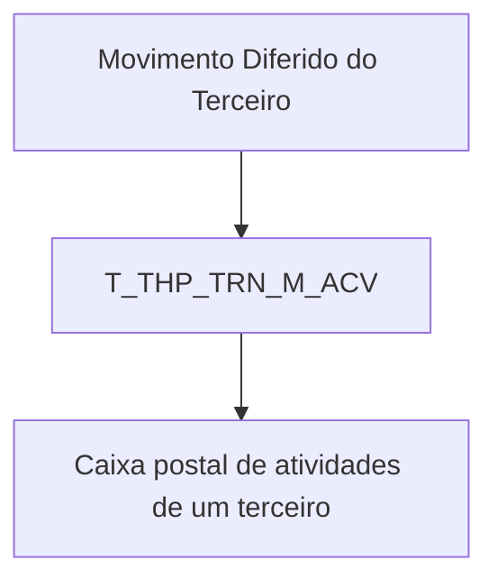

# Detalhar Informações de Atividades no Movimento Diferido do Terceiro — Visão Técnica

## 1. Metadados do Documento
- **Arquivo de Origem:** Não identificado no conteúdo fornecido
- **Tipo de Documento:** Especificação Técnica
- **Domínio / Sistema:** Movimento Diferido do Terceiro / atividades de terceiro
- **Público-Alvo:** Não explicitado; conteúdo técnico orientado a dados
- **Data/Versão Identificada:** Não identificada

---

## 2. Resumo Executivo & Contexto de Negócio

O documento descreve, em visão técnica, as informações de atividades associadas ao Movimento Diferido do Terceiro. O conteúdo identifica explicitamente o modelo de dados envolvido nessa operação.

A tabela indicada para a operação é `T_THP_TRN_M_ACV`, descrita como “TABLA BUZÓN ACTIVIDADES DE UN TERCERO”. O documento apresenta a relação de colunas dessa tabela, seu caráter obrigatório e comentários funcionais resumidos.

Os campos cobrem identificadores, sequência dentro de um identificador, situação de processamento, companhia, documentos do terceiro, atividade do terceiro, documentos do terceiro pai, ação sobre o registro, usuário e data de atualização, erro, validação e relacionamento entre atividades e documentos de terceiros.

Não são apresentados métodos HTTP, contratos de integração, regras de persistência detalhadas, valores permitidos, tipos físicos de dados, chaves, índices, ambiente técnico ou mecanismos de tratamento de erro. A especificação disponível é predominantemente um inventário técnico-funcional de campos.

---

## 3. Arquitetura, Componentes & Tecnologias Envolvidas

O único componente técnico explicitamente identificado é a tabela `T_THP_TRN_M_ACV`, utilizada na operação relacionada ao Movimento Diferido do Terceiro. A tabela é descrita como caixa postal de atividades de um terceiro.

Não há microsserviços, APIs, bancos de dados, linguagens, plataformas, URLs, servidores ou ambientes explicitamente detalhados no conteúdo fornecido.



> **Nota de Análise:** O documento menciona “APIs”, “Documentación” e “Zeus” em elementos de navegação, mas não fornece detalhamento técnico que permita classificá-los como componentes integrantes da solução.

---

## 4. Regras de Negócio, Especificações Funcionais & Processos

### Modelo de dados envolvido

A operação utiliza a tabela `T_THP_TRN_M_ACV`, cuja descrição é “TABLA BUZÓN ACTIVIDADES DE UN TERCERO”.

### Regras e obrigatoriedades identificadas

1. `IDN_VAL` é obrigatório e está associado a um identificador.
2. `IDN_SQN` é obrigatório e representa uma sequência dentro de um identificador.
3. `PRC_THD_VAL` não é obrigatório e possui comentário “HILO / RS”.
4. `PRC_STS_VAL` não é obrigatório e está relacionado à situação de processamento.
5. `CMP_VAL` é obrigatório e está relacionado à companhia.
6. `THP_DCM_TYP_VAL` é obrigatório e representa o tipo de documento do terceiro.
7. `THP_DCM_VAL` é obrigatório e representa o código de documento do terceiro.
8. `THP_VAL` não é obrigatório e representa o código do terceiro.
9. `THP_ACV_VAL` é obrigatório e representa a atividade do terceiro.
10. `PRN_DCM_TYP_VAL` não é obrigatório e representa o tipo de documento do terceiro pai.
11. `PRN_DCM_VAL` não é obrigatório e representa o código de documento do terceiro pai.
12. `ACN_ORG_VAL` não é obrigatório e registra a primeira ação produzida sobre o registro, com referências textuais a `(I)NSERT` e `(M)ODIF`.
13. `USR_VAL` é obrigatório e representa o usuário que atualiza a linha.
14. `MDF_DAT` é obrigatório e representa a data de atualização da linha.
15. `ERR_IDN_VAL` não é obrigatório e representa o código de erro.
16. `VLD_DAT` não é obrigatório e representa uma data de validação.
17. `RLT_THP_ACV_VAL` não é obrigatório e representa a atividade do terceiro relacionado.
18. `RLT_THP_DCM_TYP_VAL` não é obrigatório e representa o tipo de documento do terceiro relacionado.
19. `RLT_THP_DCM_VAL` não é obrigatório e representa o documento do terceiro relacionado.
20. `RLN_TYP_VAL` não é obrigatório e representa o tipo de relação.

> **Nota de Análise:** O documento não detalha regras de validação, domínios de valores, relacionamentos físicos, cardinalidade, chaves primárias, chaves estrangeiras ou comportamento de inserção/modificação além das referências textuais disponíveis.

---

## 5. Tabelas de Parâmetros, Ambientes e Estruturas de Dados

| Item / Parâmetro | Descrição / Função | Tipo / Valores / Formato | Ambiente / Observações |
| :--- | :--- | :--- | :--- |
| `T_THP_TRN_M_ACV` | Tabela caixa postal de atividades de um terceiro | Tabela | Utilizada na operação descrita |
| `IDN_VAL` | Identificador | Não informado | Obrigatório: Sim |
| `IDN_SQN` | Sequência dentro de identificador | Não informado | Obrigatório: Sim |
| `PRC_THD_VAL` | Hilo / RS | Não informado | Obrigatório: Não |
| `PRC_STS_VAL` | Situação de processamento | Não informado | Obrigatório: Não |
| `CMP_VAL` | Companhia | Não informado | Obrigatório: Sim |
| `THP_DCM_TYP_VAL` | Tipo de documento do terceiro | Não informado | Obrigatório: Sim |
| `THP_DCM_VAL` | Código de documento do terceiro | Não informado | Obrigatório: Sim |
| `THP_VAL` | Código do terceiro | Não informado | Obrigatório: Não |
| `THP_ACV_VAL` | Atividade do terceiro | Não informado | Obrigatório: Sim |
| `PRN_DCM_TYP_VAL` | Tipo de documento do terceiro pai | Não informado | Obrigatório: Não |
| `PRN_DCM_VAL` | Código de documento do terceiro pai | Não informado | Obrigatório: Não |
| `ACN_ORG_VAL` | Primeira ação produzida sobre o registro | Referências: `(I)NSERT`, `(M)ODIF` | Obrigatório: Não |
| `USR_VAL` | Usuário que atualiza a linha | Não informado | Obrigatório: Sim |
| `MDF_DAT` | Data de atualização da linha | Não informado | Obrigatório: Sim |
| `ERR_IDN_VAL` | Código de erro | Não informado | Obrigatório: Não |
| `VLD_DAT` | Data de validação | Não informado | Obrigatório: Não |
| `RLT_THP_ACV_VAL` | Atividade do terceiro relacionado | Não informado | Obrigatório: Não |
| `RLT_THP_DCM_TYP_VAL` | Tipo de documento do terceiro relacionado | Não informado | Obrigatório: Não |
| `RLT_THP_DCM_VAL` | Documento do terceiro relacionado | Não informado | Obrigatório: Não |
| `RLN_TYP_VAL` | Tipo de relação | Não informado | Obrigatório: Não |

---

## 6. Bateria de Perguntas & Respostas para RAG (FAQ Sintético)

### P1: Qual tabela participa da operação de detalhamento de atividades no Movimento Diferido do Terceiro?
**R:** A tabela identificada pelo documento é `T_THP_TRN_M_ACV`, descrita como “TABLA BUZÓN ACTIVIDADES DE UN TERCERO”.

### P2: Quais campos obrigatórios identificam o registro de atividade de terceiro?
**R:** Os campos obrigatórios identificados são `IDN_VAL`, associado a um identificador, e `IDN_SQN`, associado à sequência dentro do identificador. O documento não detalha a composição de chave entre esses campos.

### P3: Quais campos obrigatórios identificam o documento e a atividade do terceiro?
**R:** O documento marca como obrigatórios `THP_DCM_TYP_VAL` para o tipo de documento do terceiro, `THP_DCM_VAL` para o código de documento do terceiro e `THP_ACV_VAL` para a atividade do terceiro.

### P4: O código do terceiro é obrigatório na tabela `T_THP_TRN_M_ACV`?
**R:** Não. O campo `THP_VAL`, descrito como código do terceiro, está marcado como não obrigatório.

### P5: Como o documento registra a companhia e o status de processamento?
**R:** `CMP_VAL` é o campo obrigatório associado à companhia. `PRC_STS_VAL` é o campo não obrigatório associado à situação de processamento.

### P6: Quais campos representam informações do terceiro pai?
**R:** `PRN_DCM_TYP_VAL` representa o tipo de documento do terceiro pai e `PRN_DCM_VAL` representa o código de documento do terceiro pai. Ambos estão marcados como não obrigatórios.

### P7: Como a tabela registra autoria e data da atualização da linha?
**R:** `USR_VAL` representa o usuário que atualiza a linha e `MDF_DAT` representa a data de atualização da linha. Ambos são obrigatórios.

### P8: Quais campos podem registrar erro e validação?
**R:** `ERR_IDN_VAL` representa o código de erro e `VLD_DAT` representa a data de validação. Os dois campos são não obrigatórios segundo o documento.

### P9: Como são representadas informações de atividade e documento de um terceiro relacionado?
**R:** `RLT_THP_ACV_VAL` representa a atividade do terceiro relacionado, `RLT_THP_DCM_TYP_VAL` representa o tipo de documento do terceiro relacionado e `RLT_THP_DCM_VAL` representa o documento do terceiro relacionado. Os três campos são não obrigatórios.

### P10: O que representa `ACN_ORG_VAL`?
**R:** `ACN_ORG_VAL` representa a primeira ação produzida sobre o registro. O conteúdo menciona textualmente as referências `(I)NSERT` e `(M)ODIF`, mas não detalha os valores completos, regras de preenchimento ou comportamento operacional desse campo.

### P11: O documento especifica tipos físicos, tamanhos ou domínios de valores para as colunas?
**R:** Não. O documento apresenta as colunas, a obrigatoriedade e comentários resumidos, porém não fornece tipos físicos, tamanhos, valores permitidos, valores padrão ou restrições de banco de dados.

### P12: Há especificação de API, métodos HTTP ou contratos JSON para a operação?
**R:** Não. Embora apareçam referências de navegação a “APIs” e “Documentación”, o conteúdo não apresenta métodos HTTP, endpoints, contratos JSON, payloads ou integrações.

---

## 7. Glossário de Termos, Siglas & Conceitos-Chave

- **`T_THP_TRN_M_ACV`:** Tabela descrita como “TABLA BUZÓN ACTIVIDADES DE UN TERCERO”.
- **THP:** Sigla presente nos nomes de colunas relacionadas ao terceiro; o significado expandido não é fornecido.
- **ACV:** Sigla presente no nome da tabela e em campos de atividade; o significado expandido não é fornecido.
- **PRN:** Prefixo presente em campos de documento do terceiro pai; o significado expandido não é fornecido.
- **RLT:** Prefixo presente em campos de terceiro relacionado; o significado expandido não é fornecido.
- **RLN:** Prefixo presente em `RLN_TYP_VAL`, associado ao tipo de relação; o significado expandido não é fornecido.
- **`(I)NSERT`:** Referência textual associada à primeira ação produzida sobre o registro.
- **`(M)ODIF`:** Referência textual associada à primeira ação produzida sobre o registro.
- **N.A.:** Valor exibido na coluna “MOTIVO/VALOR”; o significado não é expandido no documento.

---

## 8. Notas Críticas, Riscos & Limitações

- O conteúdo não identifica arquivo de origem, versão, data, autor ou ambiente.
- Os tipos físicos, tamanhos, padrões, chaves, índices e relacionamentos de banco de dados não foram detalhados.
- A coluna “CAMBIA VALOR” apresenta `S` para todos os registros exibidos, sem explicação semântica adicional.
- O campo `PRC_THD_VAL` contém o comentário truncado “HILO / RS”; não há detalhamento adicional.
- `ACN_ORG_VAL` cita `(I)NSERT` e `(M)ODIF`, porém não define integralmente os valores, o domínio ou as condições de uso.
- Não há especificação de APIs, contratos, integrações, autenticação, processamento de erros ou trilhas de auditoria.
- Algumas descrições estão truncadas na extração original; esta estrutura preserva os termos e significados explicitamente disponíveis, sem completar lacunas.

---

## 9. Conteúdo Bruto Estruturado (Referência Fiel)

```text
--- [PÁGINA 1 DE 3] ---

DETALLAR Información de Actividades en el
Movimiento Diferido del Tercero (Visión
Técnica)
Modelo de datos involucrado
La tabla que interviene en esta operación es:
TABLA DESCRIPCIÓN
T_THP_TRN_M_ACV TABLA BUZÓN ACTIVIDADES DE UN TERCERO
COLUMNA CAMBIA
VALOR
MOTIVO/VALOR OBLIGATORIA COMENT
IDN_VAL S N.A. SI IDENTIF
IDN_SQN S N.A. SI SECUEN
DENTRO
IDENTIF
PRC_THD_VAL S N.A. NO HILO
 / 
 RS
Inicio Soluciones APIs Documentación Zeus
ES


--- [PÁGINA 2 DE 3] ---

COLUMNA CAMBIA
VALOR
MOTIVO/VALOR OBLIGATORIA COMENT
PRC_STS_VAL S N.A. NO SITUACI
PROCES
CMP_VAL S N.A. SI COMPAÑ
THP_DCM_TYP_VAL S N.A. SI TIPO DE
DOCUME
DEL TER
THP_DCM_VAL S N.A. SI CÓDIGO
DOCUME
DEL TER
THP_VAL S N.A. NO CÓDIGO
TERCER
THP_ACV_VAL S N.A. SI ACTIVIDA
TERCER
PRN_DCM_TYP_VAL S N.A. NO TIPO DE
DOCUME
PADRE D
TERCER
PRN_DCM_VAL S N.A. NO CÓDIGO
DOCUME
PADRE D
TERCER
ACN_ORG_VAL S N.A. NO PRIMERA
ACCION 
PRODUC
SOBRE E
REGISTR
(I)NSERT
(M)ODIF


--- [PÁGINA 3 DE 3] ---

COLUMNA CAMBIA
VALOR
MOTIVO/VALOR OBLIGATORIA COMENT
USR_VAL S N.A. SI USUARIO
ACTUAL
FILA
MDF_DAT S N.A. SI FECHA D
ACTUAL
DE LA FI
ERR_IDN_VAL S N.A. NO CODIGO
ERROR
VLD_DAT S N.A. NO FECHA V
RLT_THP_ACV_VAL S N.A. NO ACTIVIDA
TERCER
RELACIO
RLT_THP_DCM_TYP_VAL S N.A. NO TIPO DE
DOCUME
DEL TER
RELACIO
RLT_THP_DCM_VAL S N.A. NO DOCUME
DEL TER
RELACIO
RLN_TYP_VAL S N.A. NO TIPO DE
RELACIÓ
```
