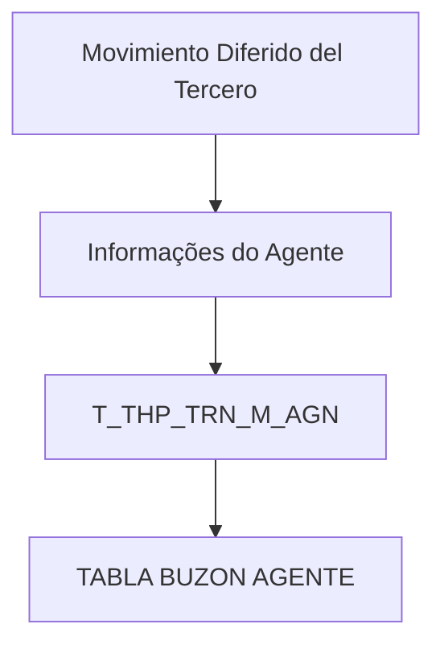

# Detalhamento de Informações do Agente no Movimento Diferido do Terceiro — Visão Técnica

## 1. Metadados do Documento
- **Arquivo de Origem:** Não identificado no conteúdo fornecido
- **Tipo de Documento:** Especificação Técnica
- **Domínio / Sistema:** Movimento Diferido do Terceiro; gestão de agentes e terceiros
- **Público-Alvo:** Desenvolvedores, Arquitetos, Analistas Funcionais e Operação
- **Data/Versão Identificada:** Não identificada

---

## 2. Resumo Executivo & Contexto de Negócio

O documento apresenta uma visão técnica para detalhar informações de agente na operação denominada **“Movimiento Diferido del Tercero”**. O conteúdo concentra-se exclusivamente no modelo de dados envolvido na operação, identificando a tabela `T_THP_TRN_M_AGN`.

A tabela `T_THP_TRN_M_AGN` é descrita como **“TABLA BUZON AGENTE”**. O documento relaciona as colunas dessa tabela, indicando que todas possuem valor de alteração `S` e motivo/valor `N.A.`, além de registrar se cada campo é obrigatório e fornecer uma descrição funcional resumida.

Os atributos obrigatórios identificados incluem informações de identificação, sequência, companhia, documento do terceiro, atividade do terceiro, código do terceiro, data de validade, usuário responsável pela atualização e data de atualização da linha. Os demais atributos são identificados como não obrigatórios no material fornecido.

O documento não apresenta métodos HTTP, contratos JSON, integrações externas, regras de transformação, mecanismos de persistência, condições de processamento, URLs de ambiente, versões de software ou fluxos de exceção. A especificação disponível está limitada ao inventário técnico dos campos da tabela de agente.

---

## 3. Arquitetura, Componentes & Tecnologias Envolvidas

### Componentes identificados

| Componente | Tipo | Descrição sustentada pelo documento |
| :--- | :--- | :--- |
| Movimento Diferido do Terceiro | Operação / contexto funcional | Operação na qual são detalhadas informações do agente. |
| `T_THP_TRN_M_AGN` | Tabela de dados | Tabela envolvida na operação; descrita como “TABLA BUZON AGENTE”. |
| Agente | Entidade de negócio | Entidade cujas informações são registradas pelos campos da tabela. |
| Terceiro | Entidade de negócio | Entidade relacionada a documento, atividade, código, agrupamento, assessor e outros atributos. |



**Nota de Análise:** O documento identifica a tabela `T_THP_TRN_M_AGN`, mas não detalha arquitetura de aplicações, banco de dados, camadas de serviço, processos de integração, tecnologias, APIs, métodos HTTP ou contratos de troca de dados.

---

## 4. Regras de Negócio, Especificações Funcionais & Processos

1. A operação abordada é o detalhamento de informações do agente no contexto de **Movimiento Diferido del Tercero**.
2. A tabela de dados envolvida é `T_THP_TRN_M_AGN`.
3. A descrição da tabela é **TABLA BUZON AGENTE**.
4. Todas as colunas relacionadas no documento possuem:
   - `CAMBIA VALOR`: `S`
   - `MOTIVO/VALOR`: `N.A.`
5. Os campos marcados como obrigatórios (`SI`) são:
   - `IDN_VAL`
   - `IDN_SQN`
   - `CMP_VAL`
   - `THP_DCM_TYP_VAL`
   - `THP_DCM_VAL`
   - `THP_ACV_VAL`
   - `THP_VAL`
   - `VLD_DAT`
   - `USR_VAL`
   - `MDF_DAT`
6. Os campos marcados como não obrigatórios (`NO`) correspondem aos demais atributos apresentados nas páginas 1 a 5.
7. O documento associa os campos a informações de identificação, documento, atividade, contrato, credencial, retenção, comissão, inabilitação, situação, auditoria e distribuição.
8. O conteúdo não informa regras de validação além da obrigatoriedade dos campos.
9. O conteúdo não descreve valores permitidos, domínios de dados, tipos físicos, chaves primárias, chaves estrangeiras, índices, relacionamentos entre tabelas ou valores padrão.
10. O conteúdo não detalha o significado de `S` em “CAMBIA VALOR”; registra apenas que esse valor é apresentado para todas as colunas listadas.

---

## 5. Tabelas de Parâmetros, Ambientes e Estruturas de Dados

### Estrutura identificada: `T_THP_TRN_M_AGN`

| Item / Parâmetro | Descrição / Função | Tipo / Valores / Formato | Ambiente / Observações |
| :--- | :--- | :--- | :--- |
| `T_THP_TRN_M_AGN` | TABLA BUZON AGENTE | Não informado | Tabela envolvida na operação Movimento Diferido do Terceiro. |

### Campos da tabela `T_THP_TRN_M_AGN`

| Item / Parâmetro | Descrição / Função | Tipo / Valores / Formato | Ambiente / Observações |
| :--- | :--- | :--- | :--- |
| `IDN_VAL` | IDENTIFICADO | Não informado; cambia valor: `S`; motivo/valor: `N.A.` | Obrigatório: `SI`. |
| `IDN_SQN` | SECUENCIA DENTRO DEL IDENTIFICADO | Não informado; cambia valor: `S`; motivo/valor: `N.A.` | Obrigatório: `SI`. |
| `PRC_THD_VAL` | HILO / RS | Não informado; cambia valor: `S`; motivo/valor: `N.A.` | Obrigatório: `NO`. A descrição foi extraída com quebra/truncamento. |
| `PRC_STS_VAL` | SITUACION D PROCESO | Não informado; cambia valor: `S`; motivo/valor: `N.A.` | Obrigatório: `NO`. A descrição foi extraída com truncamento. |
| `CMP_VAL` | COMPAÑIA | Não informado; cambia valor: `S`; motivo/valor: `N.A.` | Obrigatório: `SI`. |
| `THP_DCM_TYP_VAL` | TIPO DE DOCUMENTO DEL TERCERO | Não informado; cambia valor: `S`; motivo/valor: `N.A.` | Obrigatório: `SI`. |
| `THP_DCM_VAL` | CODIGO DE DOCUMENTO DEL TERCERO | Não informado; cambia valor: `S`; motivo/valor: `N.A.` | Obrigatório: `SI`. |
| `THP_ACV_VAL` | ACTIVIDAD D TERCERO | Não informado; cambia valor: `S`; motivo/valor: `N.A.` | Obrigatório: `SI`. A descrição foi extraída com truncamento. |
| `THP_VAL` | CODIGO DE TERCERO | Não informado; cambia valor: `S`; motivo/valor: `N.A.` | Obrigatório: `SI`. |
| `ACE_VAL` | CODIGO DE TERCERO EJECUTIVO | Não informado; cambia valor: `S`; motivo/valor: `N.A.` | Obrigatório: `NO`. |
| `THR_LVL_VAL` | TERCER NIVEL ESTRUCTURA COMERCIAL | Não informado; cambia valor: `S`; motivo/valor: `N.A.` | Obrigatório: `NO`. A descrição foi extraída com truncamento. |
| `DRC_AGN` | AGENTE DIRECTO | Não informado; cambia valor: `S`; motivo/valor: `N.A.` | Obrigatório: `NO`. |
| `AGN_TYP_VAL` | TIPO AGENTE | Não informado; cambia valor: `S`; motivo/valor: `N.A.` | Obrigatório: `NO`. |
| `ORN_VAL` | CODIGO DE TERCERO ORGANIZADO | Não informado; cambia valor: `S`; motivo/valor: `N.A.` | Obrigatório: `NO`. |
| `AVS_VAL` | TERCERO ASESOR | Não informado; cambia valor: `S`; motivo/valor: `N.A.` | Obrigatório: `NO`. |
| `MTC_VAL` | COMPENSAC | Não informado; cambia valor: `S`; motivo/valor: `N.A.` | Obrigatório: `NO`. Descrição truncada no conteúdo. |
| `AGN_ASC_VAL` | NUMERO DE COLEGIADO | Não informado; cambia valor: `S`; motivo/valor: `N.A.` | Obrigatório: `NO`. |
| `CRL_DAT` | FECHA INICIO CREDENCIAL | Não informado; cambia valor: `S`; motivo/valor: `N.A.` | Obrigatório: `NO`. |
| `CRL_EXP_DAT` | FECHA VENCIMIENTO CREDENCIAL | Não informado; cambia valor: `S`; motivo/valor: `N.A.` | Obrigatório: `NO`. |
| `CTR_VAL` | CONTRATO | Não informado; cambia valor: `S`; motivo/valor: `N.A.` | Obrigatório: `NO`. |
| `CTR_RGS_DAT` | FECHA ALTA CONTRATO | Não informado; cambia valor: `S`; motivo/valor: `N.A.` | Obrigatório: `NO`. |
| `CTR_RMV_DAT` | FECHA BAJA CONTRATO | Não informado; cambia valor: `S`; motivo/valor: `N.A.` | Obrigatório: `NO`. |
| `THP_QLT_VAL` | CALIDAD | Não informado; cambia valor: `S`; motivo/valor: `N.A.` | Obrigatório: `NO`. |
| `SND_VAL` | ENVIO - FORMA EN LA QUE SE ENVIA LOS DOCUMENTO | Não informado; cambia valor: `S`; motivo/valor: `N.A.` | Obrigatório: `NO`. A redação original contém inconsistência de plural. |
| `THP_GRG_VAL` | AGRUPAMIEN DEL TERCERO | Não informado; cambia valor: `S`; motivo/valor: `N.A.` | Obrigatório: `NO`. Descrição truncada no conteúdo. |
| `AGN_OBS_VAL` | OBSERVACIO | Não informado; cambia valor: `S`; motivo/valor: `N.A.` | Obrigatório: `NO`. Descrição truncada no conteúdo. |
| `RTN_TYP_VAL` | RETENCION | Não informado; cambia valor: `S`; motivo/valor: `N.A.` | Obrigatório: `NO`. |
| `CMS_EXL` | EXCLUIDO DE COMISIONES | Não informado; cambia valor: `S`; motivo/valor: `N.A.` | Obrigatório: `NO`. |
| `PRE_NTC` | AVISO DE PRIMAS | Não informado; cambia valor: `S`; motivo/valor: `N.A.` | Obrigatório: `NO`. |
| `MAG_MTH` | FORMA DE GESTION | Não informado; cambia valor: `S`; motivo/valor: `N.A.` | Obrigatório: `NO`. |
| `CFT_VAL` | CLASIFICACIO | Não informado; cambia valor: `S`; motivo/valor: `N.A.` | Obrigatório: `NO`. Descrição truncada no conteúdo. |
| `DSB_ROW` | INHABILITADO | Não informado; cambia valor: `S`; motivo/valor: `N.A.` | Obrigatório: `NO`. |
| `VLD_DAT` | FECHA DE VALIDEZ | Não informado; cambia valor: `S`; motivo/valor: `N.A.` | Obrigatório: `SI`. |
| `AGN_STS_TYP_VAL` | SITUACION | Não informado; cambia valor: `S`; motivo/valor: `N.A.` | Obrigatório: `NO`. |
| `BNF_CSS_VAL` | CLASE DE BENEFICIARIO | Não informado; cambia valor: `S`; motivo/valor: `N.A.` | Obrigatório: `NO`. |
| `THP_DSC_VAL` | CAUSA DE INHABILITACI | Não informado; cambia valor: `S`; motivo/valor: `N.A.` | Obrigatório: `NO`. Descrição truncada no conteúdo. |
| `DSB_PRC_TYP_VAL` | PROCESO PA EL QUE ESTA INHABILITADO | Não informado; cambia valor: `S`; motivo/valor: `N.A.` | Obrigatório: `NO`. A descrição foi extraída com truncamento. |
| `ACN_ORG_VAL` | PRMERA ACC QUE SE PRODUCE SOBRE EL REGISTRO: `(I)NSERTAR`, `(M)ODIFICAR` | Não informado; cambia valor: `S`; motivo/valor: `N.A.` | Obrigatório: `NO`. O conteúdo registra explicitamente as ações `I` e `M`. |
| `USR_VAL` | USUARIO QU ACTUALIZO L FILA | Não informado; cambia valor: `S`; motivo/valor: `N.A.` | Obrigatório: `SI`. Descrição truncada no conteúdo. |
| `MDF_DAT` | FECHA DE ACTUALIZACI DE LA FILA | Não informado; cambia valor: `S`; motivo/valor: `N.A.` | Obrigatório: `SI`. Descrição truncada no conteúdo. |
| `ERR_IDN_VAL` | CODIGO DE ERROR | Não informado; cambia valor: `S`; motivo/valor: `N.A.` | Obrigatório: `NO`. |
| `THR_DST_HNL_VAL` | TERCER CAN DISTRIBUCIO | Não informado; cambia valor: `S`; motivo/valor: `N.A.` | Obrigatório: `NO`. Descrição truncada no conteúdo. |

### Campos obrigatórios

| Campo | Descrição apresentada | Obrigatoriedade |
| :--- | :--- | :--- |
| `IDN_VAL` | IDENTIFICADO | `SI` |
| `IDN_SQN` | SECUENCIA DENTRO DEL IDENTIFICADO | `SI` |
| `CMP_VAL` | COMPAÑIA | `SI` |
| `THP_DCM_TYP_VAL` | TIPO DE DOCUMENTO DEL TERCERO | `SI` |
| `THP_DCM_VAL` | CODIGO DE DOCUMENTO DEL TERCERO | `SI` |
| `THP_ACV_VAL` | ACTIVIDAD D TERCERO | `SI` |
| `THP_VAL` | CODIGO DE TERCERO | `SI` |
| `VLD_DAT` | FECHA DE VALIDEZ | `SI` |
| `USR_VAL` | USUARIO QU ACTUALIZO L FILA | `SI` |
| `MDF_DAT` | FECHA DE ACTUALIZACI DE LA FILA | `SI` |

---

## 6. Bateria de Perguntas & Respostas para RAG (FAQ Sintético)

### P1: Qual tabela está envolvida no detalhamento de informações do agente no Movimento Diferido do Terceiro?
**R:** A tabela identificada no documento é `T_THP_TRN_M_AGN`, descrita como **TABLA BUZON AGENTE**.

### P2: Quais campos são obrigatórios na tabela `T_THP_TRN_M_AGN`?
**R:** Os campos obrigatórios são `IDN_VAL`, `IDN_SQN`, `CMP_VAL`, `THP_DCM_TYP_VAL`, `THP_DCM_VAL`, `THP_ACV_VAL`, `THP_VAL`, `VLD_DAT`, `USR_VAL` e `MDF_DAT`.

### P3: Qual campo representa o tipo de documento do terceiro?
**R:** O campo `THP_DCM_TYP_VAL` representa o **TIPO DE DOCUMENTO DEL TERCERO** e está marcado como obrigatório (`SI`).

### P4: Qual campo armazena o código do documento do terceiro?
**R:** O campo `THP_DCM_VAL` corresponde ao **CODIGO DE DOCUMENTO DEL TERCERO** e está marcado como obrigatório (`SI`).

### P5: Qual atributo representa o código do terceiro?
**R:** O campo `THP_VAL` representa o **CODIGO DE TERCERO**. O documento o classifica como obrigatório (`SI`).

### P6: Quais campos registram informações de credencial do agente?
**R:** O documento lista `CRL_DAT`, para **FECHA INICIO CREDENCIAL**, e `CRL_EXP_DAT`, para **FECHA VENCIMIENTO CREDENCIAL**. Ambos estão marcados como não obrigatórios (`NO`).

### P7: Como o documento registra a primeira ação produzida sobre um registro?
**R:** O campo `ACN_ORG_VAL` registra a primeira ação produzida sobre o registro. O documento menciona explicitamente `(I)NSERTAR` e `(M)ODIFICAR`. Esse campo está marcado como não obrigatório (`NO`).

### P8: Quais campos representam informações de auditoria da atualização da linha?
**R:** O campo `USR_VAL` representa o usuário que atualizou a linha e é obrigatório (`SI`). O campo `MDF_DAT` representa a data de atualização da linha e também é obrigatório (`SI`).

### P9: Qual campo registra a data de validade?
**R:** O campo `VLD_DAT` representa a **FECHA DE VALIDEZ** e é obrigatório (`SI`).

### P10: Existe um campo para indicar exclusão de comissões?
**R:** Sim. O campo `CMS_EXL` é descrito como **EXCLUIDO DE COMISIONES** e está marcado como não obrigatório (`NO`).

### P11: Qual campo representa um agente direto?
**R:** O campo `DRC_AGN` representa **AGENTE DIRECTO**. O documento o indica como não obrigatório (`NO`).

### P12: O documento define tipos de dados, tamanhos, chaves ou valores permitidos para os campos?
**R:** Não. O documento apresenta nome de coluna, indicação `S` em “CAMBIA VALOR”, valor `N.A.` em “MOTIVO/VALOR”, obrigatoriedade e comentário funcional. Não são informados tipos físicos, tamanhos, chaves, índices, domínios ou valores permitidos.

---

## 7. Glossário de Termos, Siglas & Conceitos-Chave

- **Movimiento Diferido del Tercero:** Nome da operação no contexto da qual são detalhadas informações do agente.
- **`T_THP_TRN_M_AGN`:** Tabela identificada como envolvida na operação; descrita como **TABLA BUZON AGENTE**.
- **TABLA BUZON AGENTE:** Descrição atribuída pelo documento à tabela `T_THP_TRN_M_AGN`.
- **Agente:** Entidade associada às informações registradas na tabela, incluindo tipo, agente direto, credencial, contrato, situação e observações.
- **Tercero:** Entidade relacionada a código, documento, atividade, agrupamento, assessor e canal de distribuição.
- **`SI`:** Indicador de obrigatoriedade apresentado nas colunas obrigatórias.
- **`NO`:** Indicador de não obrigatoriedade apresentado nas colunas não obrigatórias.
- **`S`:** Valor apresentado em “CAMBIA VALOR” para todos os campos. O documento não define seu significado.
- **`N.A.`:** Valor apresentado na coluna “MOTIVO/VALOR” para todos os campos. O documento não define seu significado.
- **`ACN_ORG_VAL`:** Campo associado à primeira ação ocorrida sobre o registro, com referências a `(I)NSERTAR` e `(M)ODIFICAR`.
- **`ERR_IDN_VAL`:** Campo descrito como código de erro.
- **`DSB_ROW`:** Campo descrito como inabilitado.
- **`VLD_DAT`:** Campo descrito como data de validade.

---

## 8. Notas Críticas, Riscos & Limitações

- O arquivo de origem, a data e a versão do documento não foram identificados no conteúdo fornecido.
- O documento não informa tipos de dados, comprimento, precisão, formato de datas, chaves primárias, chaves estrangeiras, índices ou regras de integridade para `T_THP_TRN_M_AGN`.
- O documento não especifica APIs, métodos HTTP, payloads, serviços, endpoints, filas, integrações, URLs, ambientes ou tecnologias de implementação.
- O significado dos valores `S` em “CAMBIA VALOR” e `N.A.` em “MOTIVO/VALOR” não é definido.
- Diversas descrições parecem truncadas ou afetadas pela extração OCR, incluindo `PRC_STS_VAL`, `THP_ACV_VAL`, `THR_LVL_VAL`, `MTC_VAL`, `THP_GRG_VAL`, `AGN_OBS_VAL`, `CFT_VAL`, `THP_DSC_VAL`, `USR_VAL`, `MDF_DAT` e `THR_DST_HNL_VAL`.
- A presença do campo `ACN_ORG_VAL` indica ações de inserção e modificação, porém o documento não define o comportamento do processamento para cada ação.
- **Nota de Análise:** O documento lista a tabela `T_THP_TRN_M_AGN`, porém não detalha métodos HTTP, contratos JSON, regras de persistência, validações além da obrigatoriedade, nem relacionamento com outras tabelas.

---

## 9. Conteúdo Bruto Estruturado (Referência Fiel)

```text
--- [PÁGINA 1 DE 5] ---

DETALLAR Información del Agente en el
Movimiento Diferido del Tercero (Visión
Técnica)
Modelo de datos involucrado
La tabla que interviene en esta operación es:
TABLA DESCRIPCIÓN
T_THP_TRN_M_AGN TABLA BUZON AGENTE
COLUMNA CAMBIA
VALOR
MOTIVO/VALOR OBLIGATORIA COMENTARIO
IDN_VAL S N.A. SI IDENTIFICADO
IDN_SQN S N.A. SI SECUENCIA
DENTRO DEL
IDENTIFICADO
PRC_THD_VAL S N.A. NO HILO
 / 
 RS
Inicio Soluciones APIs Documentación Zeus
ES


--- [PÁGINA 2 DE 5] ---

COLUMNA CAMBIA
VALOR
MOTIVO/VALOR OBLIGATORIA COMENTARIO
PRC_STS_VAL S N.A. NO SITUACION D
PROCESO
CMP_VAL S N.A. SI COMPAÑIA
THP_DCM_TYP_VAL S N.A. SI TIPO DE
COCUMENTO
DEL TERCERO
THP_DCM_VAL S N.A. SI CODIGO DE
DOCUMENTO
DEL TERCERO
THP_ACV_VAL S N.A. SI ACTIVIDAD D
TERCERO
THP_VAL S N.A. SI CODIGO DE
TERCERO
ACE_VAL S N.A. NO CODIGO DE
TERCERO
EJECUTIVO
THR_LVL_VAL S N.A. NO TERCER NIVE
ESTRUCTURA
COMERCIAL
DRC_AGN S N.A. NO AGENTE
DIRECTO
AGN_TYP_VAL S N.A. NO TIPO AGENTE
ORN_VAL S N.A. NO CODIGO DE
TERCERO
ORGANIZADO


--- [PÁGINA 3 DE 5] ---

COLUMNA CAMBIA
VALOR
MOTIVO/VALOR OBLIGATORIA COMENTARIO
AVS_VAL S N.A. NO TERCERO
ASESOR
MTC_VAL S N.A. NO COMPENSAC
AGN_ASC_VAL S N.A. NO NUMERO DE
COLEGIADO
CRL_DAT S N.A. NO FECHA INICIO
CREDENCIAL
CRL_EXP_DAT S N.A. NO FECHA
VENCIMIENTO
CREDENCIAL
CTR_VAL S N.A. NO CONTRATO
CTR_RGS_DAT S N.A. NO FECHA ALTA
CONTRATO
CTR_RMV_DAT S N.A. NO FECHA BAJA
CONTRATO
THP_QLT_VAL S N.A. NO CALIDAD
SND_VAL S N.A. NO ENVIO - FORM
EN LA QUE SE
ENVIA LOS
DOCUMENTO
THP_GRG_VAL S N.A. NO AGRUPAMIEN
DEL TERCERO
AGN_OBS_VAL S N.A. NO OBSERVACIO
RTN_TYP_VAL S N.A. NO RETENCION


--- [PÁGINA 4 DE 5] ---

COLUMNA CAMBIA
VALOR
MOTIVO/VALOR OBLIGATORIA COMENTARIO
CMS_EXL S N.A. NO EXCLUIDO DE
COMISIONES
PRE_NTC S N.A. NO AVISO DE
PRIMAS
MAG_MTH S N.A. NO FORMA DE
GESTION
CFT_VAL S N.A. NO CLASIFICACIO
DSB_ROW S N.A. NO INHABILITADO
VLD_DAT S N.A. SI FECHA DE
VALIDEZ
AGN_STS_TYP_VAL S N.A. NO SITUACION
BNF_CSS_VAL S N.A. NO CLASE DE
BENEFICIARIO
THP_DSC_VAL S N.A. NO CAUSA DE
INHABILITACI
DSB_PRC_TYP_VAL S N.A. NO PROCESO PA
EL QUE ESTA
INHABILITADO
ACN_ORG_VAL S N.A. NO PRMERA ACC
QUE SE
PRODUCE
SOBRE EL
REGISTRO (
(I)NSERTAR,
(M)ODIFICAR


--- [PÁGINA 5 DE 5] ---

COLUMNA CAMBIA
VALOR
MOTIVO/VALOR OBLIGATORIA COMENTARIO
USR_VAL S N.A. SI USUARIO QU
ACTUALIZO L
FILA
MDF_DAT S N.A. SI FECHA DE
ACTUALIZACI
DE LA FILA
ERR_IDN_VAL S N.A. NO CODIGO DE
ERROR
THR_DST_HNL_VAL S N.A. NO TERCER CAN
DISTRIBUCIO
```
