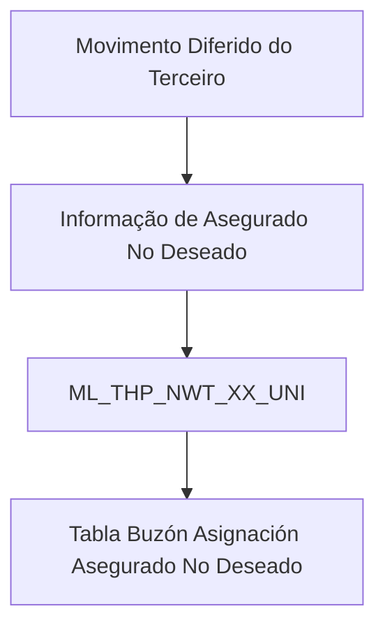

# Visão Técnica — Informação de Asegurado Não Desejado no Movimento Diferido do Terceiro

## 1. Metadados do Documento
- **Arquivo de Origem:** Não informado
- **Tipo de Documento:** Especificação Técnica
- **Domínio / Sistema:** Movimento Diferido do Terceiro — Asegurado Não Desejado
- **Público-Alvo:** Desenvolvedores, Arquitetos e Operação
- **Data/Versão Identificada:** Não identificada

---

## 2. Resumo Executivo & Contexto de Negócio

O documento apresenta a visão técnica para detalhar a informação de **Asegurado No Deseado** no contexto do **Movimiento Diferido del Tercero**. O escopo fornecido concentra-se no modelo de dados utilizado pela operação.

A operação envolve a tabela `ML_THP_NWT_XX_UNI`, identificada como **TABLA BUZON ASIGNACION ASEGURADO NO DESEADO**. O conteúdo lista as colunas da tabela, indicando que todas possuem `CAMBIA VALOR` igual a `S` e `MOTIVO/VALOR` igual a `N.A.`.

A especificação diferencia os campos obrigatórios dos não obrigatórios. Os dados obrigatórios incluem identificadores, sequência, companhia, atividade do terceiro, documento, qualidade, setor, ramo, níveis organizacionais, agente, data de validação, nomes e informações de qualidade, causa de inabilitação e dados de auditoria de atualização.

**Nota de Análise:** o documento não descreve fluxos de processamento, métodos HTTP, contratos de integração, regras de preenchimento, valores permitidos, relacionamentos entre tabelas, mecanismos de persistência ou tratamento de erros além da existência do campo `ERR_IDN_VAL`.

---

## 3. Arquitetura, Componentes & Tecnologias Envolvidas

O único componente técnico explicitamente identificado é a tabela `ML_THP_NWT_XX_UNI`, utilizada pela operação de atribuição de segurado não desejado no movimento diferido do terceiro.



| Componente | Tipo | Descrição |
| :--- | :--- | :--- |
| `ML_THP_NWT_XX_UNI` | Tabela | Tabela envolvida na operação; descrita como tabela de buzón para atribuição de assegurado não desejado. |
| Movimento Diferido do Terceiro | Processo / contexto funcional | Contexto no qual a informação de assegurado não desejado é detalhada. |
| Asegurado No Deseado | Informação de negócio | Informação registrada na tabela `ML_THP_NWT_XX_UNI`. |

---

## 4. Regras de Negócio, Especificações Funcionais & Processos

1. A tabela que intervém na operação é `ML_THP_NWT_XX_UNI`.
2. A descrição da tabela é **TABLA BUZON ASIGNACION ASEGURADO NO DESEADO**.
3. Todas as colunas listadas possuem o indicador `CAMBIA VALOR` com valor `S`.
4. Todas as colunas listadas possuem `MOTIVO/VALOR` com valor `N.A.`.
5. Os campos obrigatórios identificados no documento devem ser tratados como obrigatórios no contexto descrito; o documento não especifica regras de validação, formato, domínio de valores ou comportamento em caso de ausência.
6. Os campos não obrigatórios identificados incluem informações de processamento, referência, nomes de níveis, código de terceiro, comentário, ação de origem, identificador interno de erro e outros itens explicitamente marcados como `NO`.
7. O campo `USR_VAL` é obrigatório e representa o usuário que atualizou a fila.
8. O campo `MDF_DAT` é obrigatório e representa a data de modificação.
9. O campo `ERR_IDN_VAL` não é obrigatório e representa o identificador interno do erro.
10. O documento não fornece detalhamento adicional sobre o significado técnico das abreviações usadas nos nomes das colunas.

---

## 5. Tabelas de Parâmetros, Ambientes e Estruturas de Dados

| Item / Parâmetro | Descrição / Função | Tipo / Valores / Formato | Ambiente / Observações |
| :--- | :--- | :--- | :--- |
| `BTC_IDN_VAL` | Identificado | Obrigatória: `SI`; Cambia valor: `S`; Motivo/valor: `N.A.` | Formato não informado |
| `SQN_VAL` | Sequência | Obrigatória: `SI`; Cambia valor: `S`; Motivo/valor: `N.A.` | Formato não informado |
| `CMP_VAL` | Companhia | Obrigatória: `SI`; Cambia valor: `S`; Motivo/valor: `N.A.` | Formato não informado |
| `THP_ACV_VAL` | Atividade do terceiro | Obrigatória: `SI`; Cambia valor: `S`; Motivo/valor: `N.A.` | Formato não informado |
| `THP_DCM_TYP_VAL` | Tipo do documento do terceiro | Obrigatória: `SI`; Cambia valor: `S`; Motivo/valor: `N.A.` | Formato não informado |
| `THP_DCM_VAL` | Documento do terceiro | Obrigatória: `SI`; Cambia valor: `S`; Motivo/valor: `N.A.` | Formato não informado |
| `THP_QLT_VAL` | Qualidade | Obrigatória: `SI`; Cambia valor: `S`; Motivo/valor: `N.A.` | Formato não informado |
| `THP_QLT_NAM` | Nome da qualidade | Obrigatória: `SI`; Cambia valor: `S`; Motivo/valor: `N.A.` | Formato não informado |
| `SEC_VAL` | Setor | Obrigatória: `SI`; Cambia valor: `S`; Motivo/valor: `N.A.` | Formato não informado |
| `LOB_VAL` | Ramo | Obrigatória: `SI`; Cambia valor: `S`; Motivo/valor: `N.A.` | Formato não informado |
| `FRS_LVL_VAL` | Primeiro nível | Obrigatória: `SI`; Cambia valor: `S`; Motivo/valor: `N.A.` | Formato não informado |
| `SCN_LVL_VAL` | Segundo nível | Obrigatória: `SI`; Cambia valor: `S`; Motivo/valor: `N.A.` | Formato não informado |
| `THR_LVL_VAL` | Terceiro nível | Obrigatória: `SI`; Cambia valor: `S`; Motivo/valor: `N.A.` | Formato não informado |
| `AGN_VAL` | Agente | Obrigatória: `SI`; Cambia valor: `S`; Motivo/valor: `N.A.` | Formato não informado |
| `VLD_DAT` | Data de validação | Obrigatória: `SI`; Cambia valor: `S`; Motivo/valor: `N.A.` | Formato não informado |
| `PRC_THD_VAL` | Hilo | Obrigatória: `NO`; Cambia valor: `S`; Motivo/valor: `N.A.` | Formato não informado |
| `PRC_STS_VAL` | Situação do processo | Obrigatória: `NO`; Cambia valor: `S`; Motivo/valor: `N.A.` | Formato não informado |
| `RFR_VAL` | Referência | Obrigatória: `NO`; Cambia valor: `S`; Motivo/valor: `N.A.` | Formato não informado |
| `SEC_NAM` | Nome do setor | Obrigatória: `SI`; Cambia valor: `S`; Motivo/valor: `N.A.` | Formato não informado |
| `LOB_NAM` | Nome do ramo | Obrigatória: `SI`; Cambia valor: `S`; Motivo/valor: `N.A.` | Formato não informado |
| `FRS_LVL_NAM` | Nome do primeiro nível | Obrigatória: `NO`; Cambia valor: `S`; Motivo/valor: `N.A.` | Formato não informado |
| `SCN_LVL_NAM` | Nome do segundo nível | Obrigatória: `NO`; Cambia valor: `S`; Motivo/valor: `N.A.` | Formato não informado |
| `THR_LVL_NAM` | Nome do terceiro nível | Obrigatória: `SI`; Cambia valor: `S`; Motivo/valor: `N.A.` | Formato não informado |
| `CPE_NAM` | Nome completo do broker | Obrigatória: `SI`; Cambia valor: `S`; Motivo/valor: `N.A.` | Formato não informado |
| `THP_VAL` | Código do terceiro | Obrigatória: `NO`; Cambia valor: `S`; Motivo/valor: `N.A.` | Formato não informado |
| `QLT_STS_TYP_VAL` | Estado da qualidade | Obrigatória: `SI`; Cambia valor: `S`; Motivo/valor: `N.A.` | Formato não informado |
| `QLT_STS_TYP_NAM` | Nome do estado da qualidade | Obrigatória: `SI`; Cambia valor: `S`; Motivo/valor: `N.A.` | Formato não informado |
| `THP_DSC_VAL` | Causa de inabilitação | Obrigatória: `SI`; Cambia valor: `S`; Motivo/valor: `N.A.` | Formato não informado |
| `THP_DSC_NAM` | Nome da causa de inabilitação | Obrigatória: `SI`; Cambia valor: `S`; Motivo/valor: `N.A.` | Formato não informado |
| `CMT_TXT_VAL` | Comentário | Obrigatória: `NO`; Cambia valor: `S`; Motivo/valor: `N.A.` | Formato não informado |
| `ACN_ORG_VAL` | Ação de origem | Obrigatória: `NO`; Cambia valor: `S`; Motivo/valor: `N.A.` | Formato não informado |
| `USR_VAL` | Usuário que atualizou a fila | Obrigatória: `SI`; Cambia valor: `S`; Motivo/valor: `N.A.` | Formato não informado |
| `MDF_DAT` | Data de modificação | Obrigatória: `SI`; Cambia valor: `S`; Motivo/valor: `N.A.` | Formato não informado |
| `ERR_IDN_VAL` | Identificador interno do erro | Obrigatória: `NO`; Cambia valor: `S`; Motivo/valor: `N.A.` | Formato não informado |

---

## 6. Bateria de Perguntas & Respostas para RAG (FAQ Sintético)

### P1: Qual tabela é utilizada para a informação de assegurado não desejado no movimento diferido do terceiro?
**R:** A tabela utilizada é `ML_THP_NWT_XX_UNI`, descrita no documento como **TABLA BUZON ASIGNACION ASEGURADO NO DESEADO**.

### P2: Quais campos de identificação são obrigatórios na tabela `ML_THP_NWT_XX_UNI`?
**R:** O documento marca como obrigatórios os campos `BTC_IDN_VAL`, `SQN_VAL`, `CMP_VAL`, `THP_DCM_TYP_VAL` e `THP_DCM_VAL`. As descrições apresentadas são, respectivamente, identificado, sequência, companhia, tipo do documento do terceiro e documento do terceiro.

### P3: O código do terceiro é obrigatório no registro de assegurado não desejado?
**R:** Não. O campo `THP_VAL`, descrito como código do terceiro, está marcado como não obrigatório (`NO`) no documento.

### P4: Quais campos registram o estado da qualidade?
**R:** Os campos obrigatórios relacionados ao estado da qualidade são `QLT_STS_TYP_VAL`, descrito como estado qualidade, e `QLT_STS_TYP_NAM`, descrito como nome estado qualidade.

### P5: Como são registradas a causa de inabilitação e sua descrição?
**R:** A causa de inabilitação é registrada no campo obrigatório `THP_DSC_VAL`. O nome da causa de inabilitação é registrado no campo obrigatório `THP_DSC_NAM`.

### P6: Quais informações de auditoria de atualização são obrigatórias?
**R:** O campo `USR_VAL`, referente ao usuário que atualizou a fila, e o campo `MDF_DAT`, referente à data de modificação, são obrigatórios.

### P7: O campo de comentário é obrigatório?
**R:** Não. O campo `CMT_TXT_VAL`, descrito como comentário, está marcado como não obrigatório (`NO`).

### P8: Existe um campo para identificar erros internos?
**R:** Sim. O campo `ERR_IDN_VAL` representa o identificador interno do erro. O documento o classifica como não obrigatório (`NO`).

### P9: Quais campos de nível organizacional são obrigatórios?
**R:** Os campos `FRS_LVL_VAL`, `SCN_LVL_VAL` e `THR_LVL_VAL`, correspondentes a primeiro, segundo e terceiro nível, são obrigatórios. Entre os nomes dos níveis, `THR_LVL_NAM` é obrigatório, enquanto `FRS_LVL_NAM` e `SCN_LVL_NAM` não são obrigatórios.

### P10: Qual é o valor do indicador “Cambia Valor” para as colunas listadas?
**R:** Todas as colunas apresentadas no documento possuem `CAMBIA VALOR` igual a `S`.

### P11: O documento define formatos ou domínios permitidos para os campos?
**R:** Não. O documento identifica as colunas, suas descrições, a obrigatoriedade, o valor `S` em `CAMBIA VALOR` e `N.A.` em `MOTIVO/VALOR`, mas não define formatos, tipos físicos, tamanhos, valores permitidos ou regras de validação.

---

## 7. Glossário de Termos, Siglas & Conceitos-Chave

- **Asegurado No Deseado:** Informação de negócio tratada na operação descrita pelo documento.
- **Movimiento Diferido del Tercero:** Contexto operacional no qual a informação de assegurado não desejado é registrada.
- **`ML_THP_NWT_XX_UNI`:** Tabela identificada como tabela de buzón para atribuição de assegurado não desejado.
- **Buzón:** Termo presente na descrição da tabela; o documento não detalha sua definição técnica.
- **THP:** Prefixo presente em diversas colunas; significado não expandido no documento.
- **`BTC_IDN_VAL`:** Coluna descrita como identificado.
- **`SQN_VAL`:** Coluna descrita como sequência.
- **`CMP_VAL`:** Coluna descrita como companhia.
- **`LOB`:** Prefixo presente em campos descritos como ramo; expansão não informada.
- **`AGN_VAL`:** Coluna descrita como agente.
- **`QLT`:** Prefixo presente em campos relacionados à qualidade; expansão não informada.
- **`MDF_DAT`:** Coluna descrita como data de modificação.
- **`ERR_IDN_VAL`:** Coluna descrita como identificador interno do erro.
- **`N.A.`:** Valor exibido na coluna `MOTIVO/VALOR`; o documento não informa seu significado.

---

## 8. Notas Críticas, Riscos & Limitações

- O documento apresenta somente o modelo de dados da tabela `ML_THP_NWT_XX_UNI`; não há contratos de API, métodos HTTP, eventos, integrações, serviços ou fluxos operacionais detalhados.
- Não foram informados tipos físicos de dados, tamanhos, chaves primárias, chaves estrangeiras, índices, valores de domínio ou regras de integridade.
- Não há definição do comportamento de processamento para os campos não obrigatórios `PRC_THD_VAL`, `PRC_STS_VAL`, `RFR_VAL`, `CMT_TXT_VAL`, `ACN_ORG_VAL` e `ERR_IDN_VAL`.
- O campo `ERR_IDN_VAL` indica a existência de um identificador interno de erro, mas não há catálogo de erros, critérios de preenchimento ou procedimento de tratamento descrito.
- Não foram identificados ambientes, URLs, servidores, rotas de log, versões, responsáveis técnicos ou dependências externas.

---

## 9. Conteúdo Bruto Estruturado (Referência Fiel)

```text
--- [PÁGINA 1 DE 4] ---

DETALLAR Información como Asegurado No
Deseado en el Movimiento Diferido del Tercero
(Visión Técnica)
Modelo de datos involucrado
La tabla que interviene en esta operación es:
TABLA DESCRIPCIÓN
ML_THP_NWT_XX_UNI TABLA BUZON ASIGNACION ASEGURADO NO DESEADO
COLUMNA CAMBIA
VALOR
MOTIVO/VALOR OBLIGATORIA COMENTARIO
BTC_IDN_VAL S N.A. SI IDENTIFICADO
SQN_VAL S N.A. SI SECUENCIA
CMP_VAL S N.A. SI COMPANIA
THP_ACV_VAL S N.A. SI ACTIVIDAD
TERCERO
 /
 RS
Inicio Soluciones APIs Documentación Zeus
ES


--- [PÁGINA 2 DE 4] ---

COLUMNA CAMBIA
VALOR
MOTIVO/VALOR OBLIGATORIA COMENTARIO
THP_DCM_TYP_VAL S N.A. SI TIPO DEL
DOCUMENTO
DEL TERCERO
THP_DCM_VAL S N.A. SI DOCUMENTO
DEL TERCERO
THP_QLT_VAL S N.A. SI CALIDAD
THP_QLT_NAM S N.A. SI NOMBRE
CALIDAD
SEC_VAL S N.A. SI SECTOR
LOB_VAL S N.A. SI RAMO
FRS_LVL_VAL S N.A. SI PRIMER NIVE
SCN_LVL_VAL S N.A. SI SEGUNDO
NIVEL
THR_LVL_VAL S N.A. SI TERCER NIVE
AGN_VAL S N.A. SI AGENTE
VLD_DAT S N.A. SI FECHA VALID
PRC_THD_VAL S N.A. NO HILO
PRC_STS_VAL S N.A. NO SITUACION D
PROCESO
RFR_VAL S N.A. NO REFERENCIA
SEC_NAM S N.A. SI NOMBRE
SECTOR


--- [PÁGINA 3 DE 4] ---

COLUMNA CAMBIA
VALOR
MOTIVO/VALOR OBLIGATORIA COMENTARIO
LOB_NAM S N.A. SI NOMBRE RAM
FRS_LVL_NAM S N.A. NO NOMBRE
PRIMER NIVE
SCN_LVL_NAM S N.A. NO NOMBRE
SEGUNDO
NIVEL
THR_LVL_NAM S N.A. SI NOMBRE
TERCER NIVE
CPE_NAM S N.A. SI NOMBRE
COMPLETO
BROKER
THP_VAL S N.A. NO CODIGO
TERCERO
QLT_STS_TYP_VAL S N.A. SI ESTADO
CALIDAD
QLT_STS_TYP_NAM S N.A. SI NOMBRE
ESTADO
CALIDAD
THP_DSC_VAL S N.A. SI CAUSA
INHABILITACI
THP_DSC_NAM S N.A. SI NOMBRE
CAUSA
INHABILITACI
CMT_TXT_VAL S N.A. NO COMENTARIO
ACN_ORG_VAL S N.A. NO ACCION
ORIGEN


--- [PÁGINA 4 DE 4] ---

COLUMNA CAMBIA
VALOR
MOTIVO/VALOR OBLIGATORIA COMENTARIO
USR_VAL S N.A. SI USUARIO QU
ACTUALIZO L
FILA
MDF_DAT S N.A. SI FECHA
MODIFICACIO
ERR_IDN_VAL S N.A. NO IDENTIFICADO
INTERNO DEL
ERROR
```
