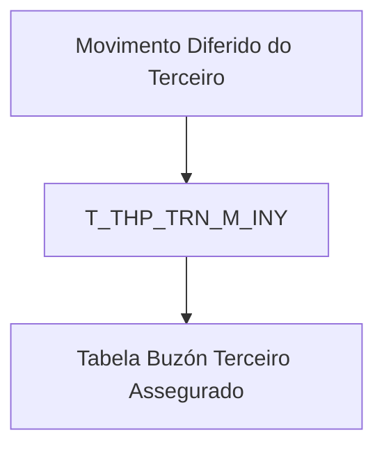

# Informação do Terceiro no Movimento Diferido do Terceiro — Visão Técnica e Modelo de Dados

## 1. Metadados do Documento
- **Arquivo de Origem:** Não identificado no conteúdo fornecido
- **Tipo de Documento:** Especificação Técnica
- **Domínio / Sistema:** Movimento Diferido do Terceiro / Terceiro Assegurado
- **Público-Alvo:** Desenvolvedores, Arquitetos, Analistas Funcionais e Operação
- **Data/Versão Identificada:** Não identificada

---

## 2. Resumo Executivo & Contexto de Negócio

O documento descreve, sob uma visão técnica, as informações de terceiros envolvidas no processo denominado **Movimento Diferido do Terceiro**. O conteúdo concentra-se no modelo de dados utilizado pela operação e identifica a tabela `T_THP_TRN_M_INY` como a estrutura interveniente.

A tabela `T_THP_TRN_M_INY` é descrita como uma **tabela de buzón de terceiro assegurado**. O documento relaciona colunas dessa tabela, indicando que o valor é alterado (`S`) para todos os campos apresentados, o motivo/valor como `N.A.` e a obrigatoriedade de cada coluna.

Os campos cobrem identificação do terceiro, documento, atividade, companhia, situação de processo, dados de beneficiário, dados de apólice, rastreabilidade de atualização, associação do assegurado a escritório, dados de perfil financeiro, marcações comerciais e obrigações fiscais.

Não foram fornecidos métodos HTTP, contratos JSON, regras de persistência, gatilhos de processamento, valores permitidos, tipos físicos de banco de dados, chaves, índices, relacionamentos ou detalhamento de integração com outros sistemas. O documento também não define as siglas técnicas presentes nos nomes das colunas.

---

## 3. Arquitetura, Componentes & Tecnologias Envolvidas

O único componente técnico explicitamente identificado é a tabela `T_THP_TRN_M_INY`, definida como tabela de buzón do terceiro assegurado e utilizada pela operação de Movimento Diferido do Terceiro.

Não há tecnologias, microsserviços, APIs, servidores, URLs, ambientes, ferramentas de CI/CD ou mecanismos de integração detalhados no conteúdo fornecido.



**Nota de Análise:** O diagrama representa exclusivamente a relação explicitamente descrita entre a operação e a tabela. O documento não detalha produtores de dados, consumidores, mecanismos de persistência, APIs ou fluxos de processamento.

---

## 4. Regras de Negócio, Especificações Funcionais & Processos

1. A operação de Movimento Diferido do Terceiro utiliza a tabela `T_THP_TRN_M_INY`.
2. A tabela `T_THP_TRN_M_INY` é descrita como uma tabela de buzón para terceiro assegurado.
3. Todas as colunas listadas possuem o indicador `Cambia valor` com valor `S`.
4. Todas as colunas listadas possuem `Motivo/Valor` igual a `N.A.`.
5. As colunas obrigatórias explicitamente identificadas são:
   - `IDN_VAL`
   - `IDN_SQN`
   - `CMP_VAL`
   - `THP_DCM_TYP_VAL`
   - `THP_DCM_VAL`
   - `THP_ACV_VAL`
   - `USR_VAL`
   - `MDF_DAT`
   - `TXL_OTH_CNY`
   - `PRE_GRE_LMT`
6. A coluna `ACN_ORG_VAL` é descrita como a primeira ação produzida sobre o registro, com referências textuais a:
   - `(I)NSERTAR`
   - `(M)ODIFICAR`
7. A coluna `USR_VAL` registra o usuário que atualizou a linha.
8. A coluna `MDF_DAT` registra a data de atualização da linha.
9. A coluna `THP_DCM_TYP_VAL` representa o tipo de documento do terceiro.
10. A coluna `THP_DCM_VAL` representa o código de documento do terceiro.
11. A coluna `THP_ACV_VAL` representa a atividade do terceiro.
12. A coluna `MTC_VAL` representa a forma de compensação, descrita como a forma pela qual o terceiro cobra ou paga.
13. A coluna `RFR_THR_LVL_VAL` representa o código de nível que identifica o escritório ao qual o assegurado está associado.
14. A coluna `RTG_TYP_VAL` representa o grupo socioeconômico ao qual o assegurado pertence.
15. A coluna `TXL_OTH_CNY` representa obrigação fiscal em outros países.
16. A coluna `PRE_GRE_LMT` representa primas maiores que um limite; o valor ou critério desse limite não é informado.
17. O documento não informa o fluxo de inserção, modificação, validação, rejeição, tratamento de erros ou processamento posterior dos registros da tabela.

---

## 5. Tabelas de Parâmetros, Ambientes e Estruturas de Dados

| Item / Parâmetro | Descrição / Função | Tipo / Valores / Formato | Ambiente / Observações |
| :--- | :--- | :--- | :--- |
| `T_THP_TRN_M_INY` | Tabela de buzón do terceiro assegurado | Não informado | Tabela envolvida na operação |
| `IDN_VAL` | Identificador | `Cambia valor: S`; obrigatório: Sim | Comentário extraído: “IDENTIFICAD” |
| `IDN_SQN` | Sequência dentro do identificador | `Cambia valor: S`; obrigatório: Sim | Comentário extraído: “SECUENCIA DENTRO DEL IDENTIFICAD” |
| `PRC_THD_VAL` | Hilo / thread | `Cambia valor: S`; obrigatório: Não | Comentário extraído: “HILO” |
| `PRC_STS_VAL` | Situação de processo | `Cambia valor: S`; obrigatório: Não | Comentário extraído: “SITUACION D PROCESO” |
| `CMP_VAL` | Companhia | `Cambia valor: S`; obrigatório: Sim | Comentário extraído: “COMPAÏ¿½IA” |
| `THP_DCM_TYP_VAL` | Tipo de documento do terceiro | `Cambia valor: S`; obrigatório: Sim | O texto extraído contém “COCUMENTO” |
| `THP_DCM_VAL` | Código de documento do terceiro | `Cambia valor: S`; obrigatório: Sim | — |
| `THP_ACV_VAL` | Atividade do terceiro | `Cambia valor: S`; obrigatório: Sim | — |
| `THP_VAL` | Código de terceiro | `Cambia valor: S`; obrigatório: Não | — |
| `THP_GRG_VAL` | Agrupamento do terceiro | `Cambia valor: S`; obrigatório: Não | — |
| `MTC_VAL` | Forma de compensação | `Cambia valor: S`; obrigatório: Não | Forma pela qual o terceiro cobra ou paga |
| `THP_QLT_VAL` | Qualidade do terceiro | `Cambia valor: S`; obrigatório: Não | O texto extraído contém “TERERO” |
| `INY_OBS_VAL` | Observação | `Cambia valor: S`; obrigatório: Não | O texto extraído contém “OBERVACION” |
| `AFL_VAL` | Afiliação | `Cambia valor: S`; obrigatório: Não | — |
| `BNF_CSS_VAL` | Classe de beneficiário | `Cambia valor: S`; obrigatório: Não | — |
| `THP_DSC_VAL` | Causa de inabilitação | `Cambia valor: S`; obrigatório: Não | — |
| `DSB_ROW` | Registro inabilitado | `Cambia valor: S`; obrigatório: Não | — |
| `CPE_NAM` | Nome completo do terceiro | `Cambia valor: S`; obrigatório: Não | — |
| `PLY_VAL` | Apólice | `Cambia valor: S`; obrigatório: Não | — |
| `ENR_SQN` | Número de suplemento | `Cambia valor: S`; obrigatório: Não | — |
| `RSK_VAL` | Número de risco | `Cambia valor: S`; obrigatório: Não | — |
| `MDF_SCO_VAL` | Modificação | `Cambia valor: S`; obrigatório: Não | Comentário truncado no documento |
| `VLD_DAT` | Data de validade | `Cambia valor: S`; obrigatório: Não | — |
| `ACN_ORG_VAL` | Primeira ação produzida sobre o registro | `Cambia valor: S`; obrigatório: Não | Referências textuais: `(I)NSERTAR`, `(M)ODIFICAR` |
| `USR_VAL` | Usuário que atualizou a linha | `Cambia valor: S`; obrigatório: Sim | — |
| `MDF_DAT` | Data de atualização da linha | `Cambia valor: S`; obrigatório: Sim | — |
| `ERR_IDN_VAL` | Código de erro | `Cambia valor: S`; obrigatório: Não | — |
| `RFR_THR_LVL_VAL` | Código de nível de identificação do escritório associado ao assegurado | `Cambia valor: S`; obrigatório: Não | — |
| `RGS_DAT` | Data de alta do assegurado | `Cambia valor: S`; obrigatório: Não | — |
| `RTG_TYP_VAL` | Grupo socioeconômico ao qual pertence o assegurado | `Cambia valor: S`; obrigatório: Não | — |
| `RBN_VAL` | Marca Robinson | `Cambia valor: S`; obrigatório: Não | — |
| `VIP_VAL` | Marca VIP | `Cambia valor: S`; obrigatório: Não | — |
| `LYL_VAL` | Marca de plano de fidelização | `Cambia valor: S`; obrigatório: Não | — |
| `LYL_PON_VAL` | Pontos do plano de fidelização | `Cambia valor: S`; obrigatório: Não | — |
| `EMP_QNT` | Número de empregados | `Cambia valor: S`; obrigatório: Não | — |
| `IVG_QNT` | Faturamento | `Cambia valor: S`; obrigatório: Não | — |
| `CIY_TYP_VAL` | Código de tipo de sociedade | `Cambia valor: S`; obrigatório: Não | — |
| `BSG_TYP_VAL` | Não detalhado | `Cambia valor: S`; obrigatório: Não | O documento não apresenta descrição |
| `PYM_DAY_VAL` | Dia sugerido de pagamento | `Cambia valor: S`; obrigatório: Não | — |
| `TXL_OTH_CNY` | Obrigação fiscal em outros países | `Cambia valor: S`; obrigatório: Sim | — |
| `FNP_MAN_ACV_VAL` | Perfil financeiro: atividade principal | `Cambia valor: S`; obrigatório: Não | — |
| `FNP_OTH_ACV_VAL` | Perfil financeiro: outras atividades | `Cambia valor: S`; obrigatório: Não | — |
| `PRE_GRE_LMT` | Primas maiores que um limite | `Cambia valor: S`; obrigatório: Sim | Limite não especificado |
| `ANC_OPR` | Aviso de operações | `Cambia valor: S`; obrigatório: Não | — |

---

## 6. Bateria de Perguntas & Respostas para RAG (FAQ Sintético)

### P1: Qual tabela participa da operação de Movimento Diferido do Terceiro?
**R:** A tabela identificada no documento como envolvida na operação é `T_THP_TRN_M_INY`, descrita como uma tabela de buzón do terceiro assegurado.

### P2: Quais campos são obrigatórios na tabela `T_THP_TRN_M_INY`?
**R:** Os campos identificados como obrigatórios são `IDN_VAL`, `IDN_SQN`, `CMP_VAL`, `THP_DCM_TYP_VAL`, `THP_DCM_VAL`, `THP_ACV_VAL`, `USR_VAL`, `MDF_DAT`, `TXL_OTH_CNY` e `PRE_GRE_LMT`.

### P3: Qual coluna contém o tipo de documento do terceiro?
**R:** A coluna `THP_DCM_TYP_VAL` representa o tipo de documento do terceiro e é obrigatória conforme o documento.

### P4: Qual coluna armazena o código de documento do terceiro?
**R:** A coluna `THP_DCM_VAL` armazena o código de documento do terceiro e é obrigatória.

### P5: Como o documento representa a ação inicial produzida sobre um registro?
**R:** A coluna `ACN_ORG_VAL` representa a primeira ação produzida sobre o registro. O documento menciona as referências `(I)NSERTAR` e `(M)ODIFICAR`, mas não define integralmente os valores permitidos nem as regras de processamento desses valores.

### P6: Onde é registrado o usuário responsável pela atualização de uma linha?
**R:** O usuário que atualizou a linha é registrado na coluna `USR_VAL`, que é obrigatória.

### P7: Qual coluna registra a data de atualização da linha?
**R:** A data de atualização da linha é registrada na coluna `MDF_DAT`, classificada como obrigatória.

### P8: Qual campo representa a obrigação fiscal do terceiro em outros países?
**R:** A coluna `TXL_OTH_CNY` representa a obrigação fiscal em outros países e é obrigatória.

### P9: Como é representada a associação do assegurado a um escritório?
**R:** A coluna `RFR_THR_LVL_VAL` contém o código de nível que identifica o escritório ao qual o assegurado está associado. O documento não fornece o domínio de valores desse código.

### P10: Qual campo contém o grupo socioeconômico do assegurado?
**R:** A coluna `RTG_TYP_VAL` representa o grupo socioeconômico ao qual o assegurado pertence.

### P11: O documento define tipos físicos de banco de dados para as colunas?
**R:** Não. O documento apresenta o indicador de alteração de valor (`S`), o motivo/valor (`N.A.`), a obrigatoriedade e comentários descritivos, mas não informa tipos físicos como `VARCHAR`, `NUMBER`, `DATE` ou equivalentes.

### P12: Qual campo indica que há primas superiores a um limite?
**R:** A coluna `PRE_GRE_LMT` representa primas maiores que um limite e é obrigatória. O valor numérico, a moeda, o operador de comparação e a regra de cálculo do limite não são especificados.

---

## 7. Glossário de Termos, Siglas & Conceitos-Chave

- **Movimento Diferido do Terceiro:** Operação mencionada no título do documento; seu comportamento funcional detalhado não foi fornecido.
- **Terceiro Assegurado:** Entidade relacionada à tabela `T_THP_TRN_M_INY`, conforme a descrição “tabela buzón terceiro assegurado”.
- **Buzón:** Termo usado para caracterizar a tabela `T_THP_TRN_M_INY`; o documento não detalha seu significado técnico ou operacional.
- **`T_THP_TRN_M_INY`:** Tabela envolvida na operação de Movimento Diferido do Terceiro.
- **`IDN_VAL`:** Campo de identificador.
- **`IDN_SQN`:** Campo de sequência dentro do identificador.
- **`CMP_VAL`:** Campo de companhia.
- **`THP_DCM_TYP_VAL`:** Campo de tipo de documento do terceiro.
- **`THP_DCM_VAL`:** Campo de código de documento do terceiro.
- **`THP_ACV_VAL`:** Campo de atividade do terceiro.
- **`MTC_VAL`:** Campo de forma de compensação do terceiro.
- **`ACN_ORG_VAL`:** Campo de primeira ação produzida sobre o registro.
- **`USR_VAL`:** Campo de usuário que atualizou a linha.
- **`MDF_DAT`:** Campo de data de atualização da linha.
- **`ERR_IDN_VAL`:** Campo de código de erro.
- **`TXL_OTH_CNY`:** Campo de obrigação fiscal em outros países.
- **`PRE_GRE_LMT`:** Campo associado a primas maiores que um limite.
- **`S`:** Valor exibido na coluna “Cambia valor” para todos os campos listados; o documento não define formalmente a sigla.
- **`N.A.`:** Valor exibido na coluna “Motivo/Valor” para todos os campos listados; o documento não define formalmente o significado.

---

## 8. Notas Críticas, Riscos & Limitações

- O conteúdo original aparenta ser uma extração com trechos truncados, problemas de codificação e palavras parcialmente corrompidas, como `COMPAÏ¿½IA`, `COCUMENTO`, `OBERVACION` e `TERERO`.
- Não há nome de arquivo, autoria, data, versão, sistema de origem ou histórico de alterações identificados.
- Não foram informados tipos de dados, tamanho de campos, valores permitidos, chaves primárias, chaves estrangeiras, índices, constraints ou relacionamentos da tabela `T_THP_TRN_M_INY`.
- Não há detalhamento de fluxos de integração, APIs, métodos HTTP, payloads, contratos, filas, jobs, eventos ou consumidores da tabela.
- A coluna `BSG_TYP_VAL` é listada sem descrição funcional.
- A descrição de `MDF_SCO_VAL` está truncada e não permite interpretação adicional fiel.
- O documento menciona `(I)NSERTAR` e `(M)ODIFICAR` para `ACN_ORG_VAL`, mas não detalha se esses são os únicos valores válidos.
- O documento não esclarece o significado formal das siglas usadas nos nomes das colunas.
- O valor, a unidade e a regra de negócio associados ao limite de `PRE_GRE_LMT` não são fornecidos.

---

## 9. Conteúdo Bruto Estruturado (Referência Fiel)

```text
--- [PÁGINA 1 DE 5] ---

DETALLAR Información del Tercero en el
Movimiento Diferido del Tercero (Visión
Técnica)
Modelo de datos involucrado
La tabla que interviene en esta operación es:
TABLA DESCRIPCIÓN
T_THP_TRN_M_INY TABLA BUZON TERCERO ASEGURADO
COLUMNA CAMBIA
VALOR
MOTIVO/VALOR OBLIGATORIA COMENTARIO
IDN_VAL S N.A. SI IDENTIFICAD
IDN_SQN S N.A. SI SECUENCIA
DENTRO DEL
IDENTIFICAD
PRC_THD_VAL S N.A. NO HILO
 / 
 RS
Inicio Soluciones APIs Documentación Zeus
ES


--- [PÁGINA 2 DE 5] ---

COLUMNA CAMBIA
VALOR
MOTIVO/VALOR OBLIGATORIA COMENTARIO
PRC_STS_VAL S N.A. NO SITUACION D
PROCESO
CMP_VAL S N.A. SI COMPAÏ¿½IA
THP_DCM_TYP_VAL S N.A. SI TIPO DE
COCUMENTO
DEL TERCER
THP_DCM_VAL S N.A. SI CODIGO DE
DOCUMENTO
DEL TERCER
THP_ACV_VAL S N.A. SI ACTIVIDAD D
TERCERO
THP_VAL S N.A. NO CODIGO DE
TERCERO
THP_GRG_VAL S N.A. NO AGRUPAMIEN
DEL TERCER
MTC_VAL S N.A. NO FORMA DE
COMPENSAC
(FORMA EN L
QUE EL
TERCERO
COBRA O PAG
THP_QLT_VAL S N.A. NO CALIDAD DEL
TERERO
INY_OBS_VAL S N.A. NO OBERVACION
AFL_VAL S N.A. NO AFILIACION


--- [PÁGINA 3 DE 5] ---

COLUMNA CAMBIA
VALOR
MOTIVO/VALOR OBLIGATORIA COMENTARIO
BNF_CSS_VAL S N.A. NO CLASE DE
BENEFICIARI
THP_DSC_VAL S N.A. NO CAUSA DE
INHABILITACI
DSB_ROW S N.A. NO INHABILITADO
CPE_NAM S N.A. NO NOMBRE
COMPLETO D
TERCERO
PLY_VAL S N.A. NO POLIZA
ENR_SQN S N.A. NO NUMERO DE
SUPLEMENTO
RSK_VAL S N.A. NO NUMERO DE
RIESGO
MDF_SCO_VAL S N.A. NO MODIFICACIO
VLD_DAT S N.A. NO FECHA DE
VALIDEZ
ACN_ORG_VAL S N.A. NO PRMERA
ACCION QUE
PRODUCE
SOBRE EL
REGISTRO (
(I)NSERTAR,
(M)ODIFICAR 
USR_VAL S N.A. SI USUARIO QU
ACTUALIZO L
FILA


--- [PÁGINA 4 DE 5] ---

COLUMNA CAMBIA
VALOR
MOTIVO/VALOR OBLIGATORIA COMENTARIO
MDF_DAT S N.A. SI FECHA DE
ACTUALIZAC
DE LA FILA
ERR_IDN_VAL S N.A. NO CODIGO DE
ERROR
RFR_THR_LVL_VAL S N.A. NO CÓDIGO NIVE
IDENTIFICA
OFICINA A LA
QUE ESTA
ASOCIADA AL
ASEGURADO
RGS_DAT S N.A. NO FECHA ALTA D
ASEGURADO
RTG_TYP_VAL S N.A. NO GRUPO SOCI
ECONÓMICO 
QUE
PERTENECE 
ASEGURADO
RBN_VAL S N.A. NO MARCA
ROBINSON
VIP_VAL S N.A. NO MARCA VIP
LYL_VAL S N.A. NO MARCA PLAN
FIDELIZACION
LYL_PON_VAL S N.A. NO PUNTOS PLA
FIDELIZACION
EMP_QNT S N.A. NO NUMERO DE
EMPLEADOS


--- [PÁGINA 5 DE 5] ---

COLUMNA CAMBIA
VALOR
MOTIVO/VALOR OBLIGATORIA COMENTARIO
IVG_QNT S N.A. NO FACTURACIO
CIY_TYP_VAL S N.A. NO CODIGO TIPO
SOCIEDAD
BSG_TYP_VAL S N.A. NO
PYM_DAY_VAL S N.A. NO DIA SUGERID
DE PAGO
TXL_OTH_CNY S N.A. SI OBLIGACIÓN
FISCAL EN
OTROS PAÍSE
FNP_MAN_ACV_VAL S N.A. NO PERFIL
FINANCIERO
ACTIVIDAD
PRINCIPAL
FNP_OTH_ACV_VAL S N.A. NO PERFIL
FINANCIERO
OTRAS
ACTIVIDADES
PRE_GRE_LMT S N.A. SI PRIMAS
MAYORES A U
LÍMITE
ANC_OPR S N.A. NO AVISO DE
OPERACIONE
```
