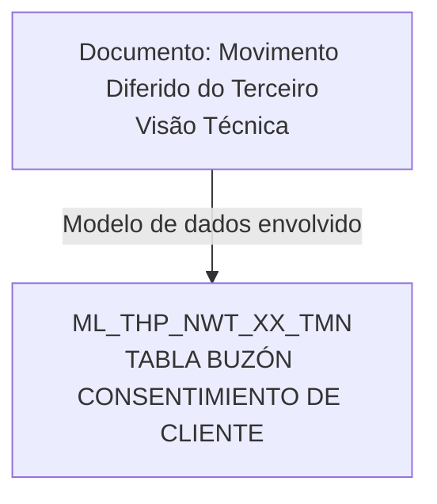

# Detalhamento de Consentimentos no Movimento Diferido do Terceiro — Visão Técnica

## 1. Metadados do Documento
- **Arquivo de Origem:** `Não identificado`
- **Tipo de Documento:** `Especificação Técnica`
- **Domínio / Sistema:** `Consentimentos de cliente / Movimento Diferido do Terceiro`
- **Público-Alvo:** `Desenvolvedores, Arquitetos, Operação`
- **Data/Versão Identificada:** `Não identificada`

---

## 2. Resumo Executivo & Contexto de Negócio

O documento apresenta uma visão técnica para detalhar informações de consentimentos no contexto do **Movimento Diferido do Terceiro**. O conteúdo identifica explicitamente o modelo de dados envolvido na operação.

A tabela indicada para a operação é `ML_THP_NWT_XX_TMN`, descrita como **TABLA BUZÓN CONSENTIMIENTO DE CLIENTE**. O documento relaciona colunas dessa tabela, sinalizando se cada coluna tem alteração de valor, se é obrigatória e uma descrição resumida de sua finalidade.

A especificação evidencia atributos associados à identificação do terceiro, identificação e tipo de documento, atividade, código e tipo de consentimento, períodos de vigência, forma de outorga, estado do processo, dados de auditoria e referências internas de erro.

O material não descreve métodos HTTP, APIs, contratos JSON, processos de persistência, valores permitidos, regras de validação detalhadas ou relacionamentos com outras tabelas. Portanto, a análise limita-se aos campos e classificações explicitamente apresentados.

---

## 3. Arquitetura, Componentes & Tecnologias Envolvidas

O documento cita somente uma estrutura de dados: a tabela `ML_THP_NWT_XX_TMN`. Não há tecnologias, microsserviços, URLs, ambientes, APIs, integrações externas ou camadas de aplicação detalhados.



**Nota de Análise:** o documento identifica a tabela `ML_THP_NWT_XX_TMN`, porém não detalha banco de dados, esquema, chaves, índices, relacionamentos, comandos SQL ou responsáveis pela atualização dos campos.

---

## 4. Regras de Negócio, Especificações Funcionais & Processos

A operação técnica descrita utiliza a tabela `ML_THP_NWT_XX_TMN`, denominada **TABLA BUZÓN CONSENTIMIENTO DE CLIENTE**.

Os campos listados possuem o indicador `S` na coluna **CAMBIA VALOR**, conforme apresentado no documento. A coluna **MOTIVO/VALOR** é apresentada como `N.A.` para todos os registros visíveis.

Os seguintes campos são classificados como obrigatórios (`SI`):

- `BTC_IDN_VAL`: identificado.
- `SQN_VAL`: sequência.
- `CMP_VAL`: companhia.
- `THP_DCM_TYP_VAL`: tipo do documento do terceiro.
- `THP_DCM_VAL`: documento do terceiro.
- `THP_ACV_VAL`: atividade do terceiro.
- `COE_VAL`: código de consentimento.
- `VAL_COE_TYP_VAL`: tipo de consentimento.
- `VLD_DAT`: data de validação.
- `FRM_TYP_VAL`: tipo de forma outorgada.
- `COE_INL_DAT`: data de início do consentimento.
- `COE_FNL_DAT`: data de fim do consentimento.
- `DSB_ROW`: fila desabilitada.
- `USR_VAL`: usuário que atualizou a fila.
- `MDF_VAL`: data de modificação.

Os seguintes campos são classificados como não obrigatórios (`NO`):

- `PRC_THD_VAL`: hilo.
- `PRC_STS_VAL`: situação do processo.
- `ACN_ORG_VAL`: ação de origem.
- `ERR_IDN_VAL`: identificador interno do erro.

**Nota de Análise:** o documento não explica o significado operacional dos valores `S`, `SI`, `NO` ou `N.A.` além de suas posições nas colunas apresentadas. Também não descreve condições que determinam a atualização de cada campo.

---

## 5. Tabelas de Parâmetros, Ambientes e Estruturas de Dados

| Item / Parâmetro | Descrição / Função | Tipo / Valores / Formato | Ambiente / Observações |
| :--- | :--- | :--- | :--- |
| `ML_THP_NWT_XX_TMN` | Tabela de caixa postal de consentimento de cliente | Tabela | Estrutura de dados envolvida na operação |
| `BTC_IDN_VAL` | Identificado | Muda valor: `S`; Motivo/valor: `N.A.`; Obrigatória: `SI` | Não há formato detalhado |
| `SQN_VAL` | Sequência | Muda valor: `S`; Motivo/valor: `N.A.`; Obrigatória: `SI` | Não há formato detalhado |
| `CMP_VAL` | Companhia | Muda valor: `S`; Motivo/valor: `N.A.`; Obrigatória: `SI` | Não há formato detalhado |
| `THP_DCM_TYP_VAL` | Tipo do documento do terceiro | Muda valor: `S`; Motivo/valor: `N.A.`; Obrigatória: `SI` | Não há formato detalhado |
| `THP_DCM_VAL` | Documento do terceiro | Muda valor: `S`; Motivo/valor: `N.A.`; Obrigatória: `SI` | Não há formato detalhado |
| `THP_ACV_VAL` | Atividade do terceiro | Muda valor: `S`; Motivo/valor: `N.A.`; Obrigatória: `SI` | Não há formato detalhado |
| `COE_VAL` | Código de consentimento | Muda valor: `S`; Motivo/valor: `N.A.`; Obrigatória: `SI` | Não há formato detalhado |
| `VAL_COE_TYP_VAL` | Tipo de consentimento | Muda valor: `S`; Motivo/valor: `N.A.`; Obrigatória: `SI` | Não há formato detalhado |
| `VLD_DAT` | Data de validação | Muda valor: `S`; Motivo/valor: `N.A.`; Obrigatória: `SI` | Não há formato detalhado |
| `PRC_THD_VAL` | Hilo | Muda valor: `S`; Motivo/valor: `N.A.`; Obrigatória: `NO` | Não há formato detalhado |
| `PRC_STS_VAL` | Situação do processo | Muda valor: `S`; Motivo/valor: `N.A.`; Obrigatória: `NO` | Não há valores de situação especificados |
| `FRM_TYP_VAL` | Tipo de forma outorgada | Muda valor: `S`; Motivo/valor: `N.A.`; Obrigatória: `SI` | Não há formato detalhado |
| `COE_INL_DAT` | Data de início do consentimento | Muda valor: `S`; Motivo/valor: `N.A.`; Obrigatória: `SI` | Não há formato de data especificado |
| `COE_FNL_DAT` | Data de fim do consentimento | Muda valor: `S`; Motivo/valor: `N.A.`; Obrigatória: `SI` | Não há formato de data especificado |
| `DSB_ROW` | Fila desabilitada | Muda valor: `S`; Motivo/valor: `N.A.`; Obrigatória: `SI` | Não há valores permitidos especificados |
| `USR_VAL` | Usuário que atualizou a fila | Muda valor: `S`; Motivo/valor: `N.A.`; Obrigatória: `SI` | Campo de auditoria conforme descrição |
| `MDF_VAL` | Data de modificação | Muda valor: `S`; Motivo/valor: `N.A.`; Obrigatória: `SI` | Não há formato de data especificado |
| `ACN_ORG_VAL` | Ação de origem | Muda valor: `S`; Motivo/valor: `N.A.`; Obrigatória: `NO` | Não há valores permitidos especificados |
| `ERR_IDN_VAL` | Identificador interno do erro | Muda valor: `S`; Motivo/valor: `N.A.`; Obrigatória: `NO` | Não há catálogo de erros especificado |

---

## 6. Bateria de Perguntas & Respostas para RAG (FAQ Sintético)

### P1: Qual tabela participa da operação de consentimentos no Movimento Diferido do Terceiro?
**R:** A tabela envolvida na operação é `ML_THP_NWT_XX_TMN`, descrita no documento como **TABLA BUZÓN CONSENTIMIENTO DE CLIENTE**.

### P2: Quais campos identificam o terceiro no modelo de dados de consentimentos?
**R:** O documento lista `THP_DCM_TYP_VAL` como tipo do documento do terceiro, `THP_DCM_VAL` como documento do terceiro e `THP_ACV_VAL` como atividade do terceiro. Os três campos são obrigatórios (`SI`).

### P3: Quais campos de consentimento são obrigatórios na tabela `ML_THP_NWT_XX_TMN`?
**R:** Os campos obrigatórios de consentimento explicitamente listados são `COE_VAL` para código de consentimento, `VAL_COE_TYP_VAL` para tipo de consentimento, `VLD_DAT` para data de validação, `FRM_TYP_VAL` para tipo de forma outorgada, `COE_INL_DAT` para início do consentimento e `COE_FNL_DAT` para fim do consentimento.

### P4: O campo `PRC_STS_VAL` é obrigatório?
**R:** Não. O campo `PRC_STS_VAL`, descrito como situação do processo, está classificado como não obrigatório (`NO`) no documento.

### P5: Quais são os campos não obrigatórios identificados na especificação?
**R:** Os campos não obrigatórios são `PRC_THD_VAL` (hilo), `PRC_STS_VAL` (situação do processo), `ACN_ORG_VAL` (ação de origem) e `ERR_IDN_VAL` (identificador interno do erro).

### P6: Quais campos de auditoria ou rastreabilidade são apresentados?
**R:** O documento apresenta `USR_VAL`, descrito como usuário que atualizou a fila, e `MDF_VAL`, descrito como data de modificação. Ambos são obrigatórios (`SI`). Também apresenta `ERR_IDN_VAL` como identificador interno do erro, mas esse campo não é obrigatório (`NO`).

### P7: A especificação informa o formato das datas de consentimento?
**R:** Não. O documento identifica `VLD_DAT`, `COE_INL_DAT`, `COE_FNL_DAT` e `MDF_VAL` como campos relacionados a datas, mas não informa formato, fuso horário, precisão ou regras de validação.

### P8: Há uma regra documentada para o valor da coluna “Motivo/Valor”?
**R:** O documento apresenta `N.A.` na coluna **MOTIVO/VALOR** para todos os campos mostrados. Não há explicação adicional sobre o significado operacional de `N.A.`.

### P9: Todos os campos listados mudam de valor?
**R:** Sim. Para todos os campos exibidos no documento, a coluna **CAMBIA VALOR** está marcada com `S`.

### P10: O documento detalha APIs ou contratos de integração para a tabela de consentimentos?
**R:** Não. O conteúdo limita-se ao modelo de dados da tabela `ML_THP_NWT_XX_TMN` e à classificação de seus campos. Não há métodos HTTP, endpoints, payloads, contratos JSON ou fluxos de integração especificados.

---

## 7. Glossário de Termos, Siglas & Conceitos-Chave

- **`ML_THP_NWT_XX_TMN`:** tabela identificada como **TABLA BUZÓN CONSENTIMIENTO DE CLIENTE**.
- **Terceiro:** entidade referenciada pelos campos de documento e atividade do terceiro; o documento não fornece definição adicional.
- **Consentimento:** conceito associado aos campos de código, tipo, datas de vigência e forma outorgada.
- **`BTC_IDN_VAL`:** campo descrito como identificado.
- **`SQN_VAL`:** campo descrito como sequência.
- **`CMP_VAL`:** campo descrito como companhia.
- **`THP_DCM_TYP_VAL`:** tipo do documento do terceiro.
- **`THP_DCM_VAL`:** documento do terceiro.
- **`THP_ACV_VAL`:** atividade do terceiro.
- **`COE_VAL`:** código de consentimento.
- **`VAL_COE_TYP_VAL`:** tipo de consentimento.
- **`VLD_DAT`:** data de validação.
- **`PRC_THD_VAL`:** hilo.
- **`PRC_STS_VAL`:** situação do processo.
- **`FRM_TYP_VAL`:** tipo de forma outorgada.
- **`COE_INL_DAT`:** data de início do consentimento.
- **`COE_FNL_DAT`:** data de fim do consentimento.
- **`DSB_ROW`:** fila desabilitada.
- **`USR_VAL`:** usuário que atualizou a fila.
- **`MDF_VAL`:** data de modificação.
- **`ACN_ORG_VAL`:** ação de origem.
- **`ERR_IDN_VAL`:** identificador interno do erro.
- **`SI`:** indicador exibido como obrigatório.
- **`NO`:** indicador exibido como não obrigatório.
- **`S`:** valor exibido na coluna **CAMBIA VALOR**.
- **`N.A.`:** valor exibido na coluna **MOTIVO/VALOR**, sem explicação adicional no documento.

---

## 8. Notas Críticas, Riscos & Limitações

- O documento não identifica o arquivo de origem, data, versão, autor ou sistema proprietário da tabela.
- Não são especificados tipos físicos de dados, tamanhos, nulidade técnica, chaves primárias, chaves estrangeiras, índices ou relacionamentos da tabela `ML_THP_NWT_XX_TMN`.
- Não há detalhamento sobre os valores aceitos pelos campos de situação, ação de origem, forma outorgada, código de consentimento ou tipo de consentimento.
- Não são documentadas regras de consistência entre `COE_INL_DAT`, `COE_FNL_DAT` e `VLD_DAT`.
- Não há descrição de tratamento de erro para `ERR_IDN_VAL`, nem catálogo de erros ou condição de preenchimento.
- Não há processo operacional, integração, endpoint, tecnologia, ambiente ou responsável técnico especificado.
- O termo `PRC_THD_VAL` é apresentado como “HILO”, sem detalhamento adicional do seu significado técnico ou funcional.

---

## 9. Conteúdo Bruto Estruturado (Referência Fiel)

```text
--- [PÁGINA 1 DE 3] ---

DETALLAR Información de Consentimientos en
el Movimiento Diferido del Tercero (Visión
Técnica)
Modelo de datos involucrado
La tabla que interviene en esta operación es:
TABLA DESCRIPCIÓN
ML_THP_NWT_XX_TMN TABLA BUZÓN CONSENTIMIENTO DE CLIENTE
COLUMNA CAMBIA
VALOR
MOTIVO/VALOR OBLIGATORIA COMENTARIO
BTC_IDN_VAL S N.A. SI IDENTIFICADO
SQN_VAL S N.A. SI SECUENCIA
CMP_VAL S N.A. SI COMPAÑÍA
THP_DCM_TYP_VAL S N.A. SI TIPO DEL
DOCUMENTO
 / 
 RS
Inicio Soluciones APIs Documentación Zeus
ES


--- [PÁGINA 2 DE 3] ---

COLUMNA CAMBIA
VALOR
MOTIVO/VALOR OBLIGATORIA COMENTARIO
TERCERO
THP_DCM_VAL S N.A. SI DOCUMENTO
TERCERO
THP_ACV_VAL S N.A. SI ACTIVIDAD
TERCERO
COE_VAL S N.A. SI CÓDIGO
CONSENTIMI
VAL_COE_TYP_VAL S N.A. SI TIPO
CONSENTIMI
VLD_DAT S N.A. SI FECHA VALID
PRC_THD_VAL S N.A. NO HILO
PRC_STS_VAL S N.A. NO SITUACIÓN D
PROCESO
FRM_TYP_VAL S N.A. SI TIPO FORMA
OTORGADA
COE_INL_DAT S N.A. SI FECHA INICIO
CONSENTIMI
COE_FNL_DAT S N.A. SI FECHA FIN
CONSENTIMI
DSB_ROW S N.A. SI FILA
DESHABILITA
USR_VAL S N.A. SI USUARIO QU
ACTUALIZO L
FILA


--- [PÁGINA 3 DE 3] ---

COLUMNA CAMBIA
VALOR
MOTIVO/VALOR OBLIGATORIA COMENTARIO
MDF_VAL S N.A. SI FECHA
MODIFICACIÓ
ACN_ORG_VAL S N.A. NO ACCIÓN ORIG
ERR_IDN_VAL S N.A. NO IDENTIFICADO
INTERNO DEL
ERROR
```
