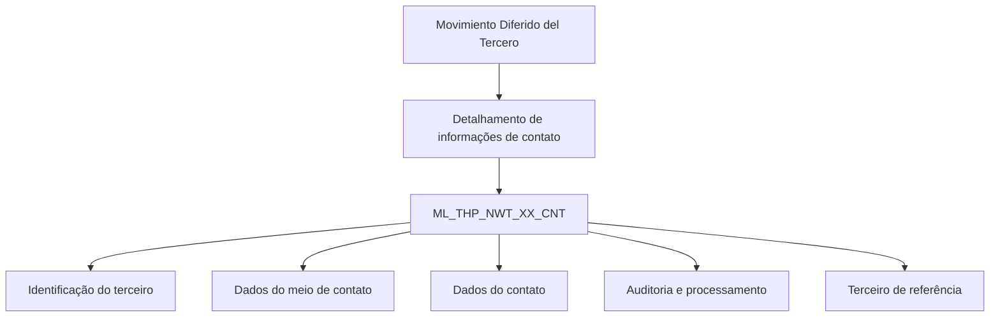

# Detalhamento de Informações de Contato no Movimento Diferido do Terceiro — Visão Técnica

## 1. Metadados do Documento
- **Arquivo de Origem:** Não identificado no conteúdo fornecido
- **Tipo de Documento:** Especificação Técnica
- **Domínio / Sistema:** Movimento Diferido do Terceiro; contatos de terceiros
- **Público-Alvo:** Desenvolvedores, Arquitetos, Analistas Funcionais e Operação
- **Data/Versão Identificada:** Não identificada

---

## 2. Resumo Executivo & Contexto de Negócio

O documento descreve a visão técnica para detalhar informações de contatos de terceiros no processo denominado **Movimiento Diferido del Tercero**. O artefato identifica exclusivamente o modelo de dados envolvido na operação e especifica a tabela utilizada para armazenar dados de caixa postal de contatos de terceiros.

A tabela referenciada é `ML_THP_NWT_XX_CNT`, descrita no documento como **TABLA BUZON CONTACTOS DE TERCEROS**. A estrutura apresentada relaciona colunas, indicação de alteração de valor, obrigatoriedade e uma descrição funcional resumida de cada campo.

A maior parte dos campos é indicada com valor `S` na coluna “CAMBIA VALOR” e `N.A.` em “MOTIVO/VALOR”. O documento diferencia campos obrigatórios (`SI`) de campos não obrigatórios (`NO`), abrangendo identificação do terceiro, documento, atividade, meios de contato, dados organizacionais, auditoria, status de processamento e referências.

Não são fornecidos contratos de API, métodos HTTP, formatos JSON, mecanismos de integração, regras de persistência, valores permitidos, chaves primárias, relacionamentos físicos, nem fluxos de execução detalhados. A análise está limitada à estrutura apresentada.

---

## 3. Arquitetura, Componentes & Tecnologias Envolvidas

### Componentes identificados

| Componente | Tipo | Descrição baseada no documento |
| :--- | :--- | :--- |
| `ML_THP_NWT_XX_CNT` | Tabela de dados | Tabela denominada “TABLA BUZON CONTACTOS DE TERCEROS”. Armazena informações de contatos de terceiros associadas ao Movimento Diferido do Terceiro. |
| Movimento Diferido do Terceiro | Processo / domínio funcional | Contexto funcional no qual ocorre o detalhamento das informações de contatos de terceiros. |
| Terceiro | Entidade de negócio | Entidade identificada por campos como documento, tipo de documento, atividade e terceiro de referência. |
| Meio de contato | Entidade / atributo funcional | Informações como tipo, uso, valor, nome, prioridade, confirmação e extensão de departamento. |



> **Nota de Análise:** O documento não detalha sistemas consumidores, banco de dados, tecnologias de persistência, APIs, métodos HTTP, URLs, ambientes, mecanismos de mensageria ou contratos de integração.

---

## 4. Regras de Negócio, Especificações Funcionais & Processos

### 4.1 Estrutura de obrigatoriedade

A tabela `ML_THP_NWT_XX_CNT` contém campos marcados como obrigatórios (`SI`) e não obrigatórios (`NO`). Conforme o conteúdo fornecido:

- A identificação do registro, sequência, companhia, tipo e número de documento do terceiro são obrigatórios.
- A atividade do terceiro e a sequência do meio de contato são obrigatórias.
- Tipo, uso e valor do meio de contato são obrigatórios.
- A data de validação, indicador de contato padrão, contato prioritário, desabilitação da linha, confirmação do contato, usuário atualizador e data de modificação são obrigatórios.
- O terceiro de referência é obrigatório.
- Nome do meio de contato, tipo de cargo, extensão departamental, dados de cargo, departamento, sobrenomes, documento e país do contato são não obrigatórios.
- Informações de processamento, ação de origem, identificador interno de erro e observações são não obrigatórias.

### 4.2 Regras de alteração apresentadas

Todos os campos apresentados possuem o valor `S` na coluna **CAMBIA VALOR**, indicando que são campos cujo valor pode ser alterado segundo a estrutura exibida.

O campo **MOTIVO/VALOR** é apresentado como `N.A.` para todos os campos transcritos. O documento não explica o significado operacional de `S`, `SI`, `NO` ou `N.A.` além do contexto visual das colunas.

### 4.3 Organização funcional dos dados

| Grupo funcional | Campos associados | Regra / finalidade identificada |
| :--- | :--- | :--- |
| Identificação técnica | `BTC_IDN_VAL`, `SQN_VAL`, `CMP_VAL` | Identificação, sequência e companhia; todos obrigatórios. |
| Identificação do terceiro | `THP_DCM_TYP_VAL`, `THP_DCM_VAL`, `IDN_THP_VAL`, `THP_ACV_VAL` | Tipo de documento, documento, identificador e atividade do terceiro. |
| Meio de contato | `CNH_SQN_VAL`, `CNH_TYP_VAL`, `CNH_USE_TYP_VAL`, `CNH_TXT_VAL`, `CNH_NAM`, `PTY_CNH`, `DFL_CNH`, `CNH_CCK` | Sequência, classificação, uso, valor textual, nome, prioridade, padrão e confirmação do contato. |
| Dados organizacionais e pessoais | `PST_TYP_VAL`, `EXT_CNT_DPR_VAL`, `CNT_PST_VAL`, `CNT_DPR_VAL`, `CNT_FRS_SCN_SRN` | Tipo de cargo, extensão, cargo, departamento e sobrenomes do contato. |
| Documento e país do contato | `CNT_DCM_TYP_VAL`, `CNT_DCM_VAL`, `CNT_CNY_VAL` | Tipo e número de documento, além do país do contato. |
| Auditoria e situação | `VLD_DAT`, `DSB_ROW`, `USR_VAL`, `MDF_DAT`, `PRC_THD_VAL`, `PRC_STS_VAL`, `ACN_ORG_VAL`, `ERR_IDN_VAL`, `OBS_VAL` | Validação, desabilitação, auditoria, processamento, ação de origem, erro e observações. |
| Referência | `RFR_THP` | Terceiro de referência; obrigatório. |

> **Nota de Análise:** O documento não descreve condições de validação, regras de precedência, comportamento de atualização, tratamento de erro, nem valores de domínio para os campos listados.

---

## 5. Tabelas de Parâmetros, Ambientes e Estruturas de Dados

### 5.1 Tabela envolvida

| Item / Parâmetro | Descrição / Função | Tipo / Valores / Formato | Ambiente / Observações |
| :--- | :--- | :--- | :--- |
| `ML_THP_NWT_XX_CNT` | Tabela de caixa postal de contatos de terceiros. | Não informado. | Tabela envolvida no detalhamento de contatos no Movimento Diferido do Terceiro. |

### 5.2 Campos da tabela `ML_THP_NWT_XX_CNT`

| Item / Parâmetro | Descrição / Função | Tipo / Valores / Formato | Ambiente / Observações |
| :--- | :--- | :--- | :--- |
| `BTC_IDN_VAL` | Identificador. | Cambia valor: `S`; motivo/valor: `N.A.` | Obrigatória: `SI`. |
| `SQN_VAL` | Sequência. | Cambia valor: `S`; motivo/valor: `N.A.` | Obrigatória: `SI`. |
| `CMP_VAL` | Companhia. | Cambia valor: `S`; motivo/valor: `N.A.` | Obrigatória: `SI`. |
| `THP_DCM_TYP_VAL` | Tipo do documento do terceiro. | Cambia valor: `S`; motivo/valor: `N.A.` | Obrigatória: `SI`. |
| `THP_DCM_VAL` | Documento do terceiro. | Cambia valor: `S`; motivo/valor: `N.A.` | Obrigatória: `SI`. |
| `THP_ACV_VAL` | Atividade do terceiro. | Cambia valor: `S`; motivo/valor: `N.A.` | Obrigatória: `SI`. |
| `CNH_SQN_VAL` | Sequência do meio de contato. | Cambia valor: `S`; motivo/valor: `N.A.` | Obrigatória: `SI`. |
| `VLD_DAT` | Data de validação. | Cambia valor: `S`; motivo/valor: `N.A.` | Obrigatória: `SI`. |
| `IDN_THP_VAL` | Identificador do terceiro. | Cambia valor: `S`; motivo/valor: `N.A.` | Obrigatória: `NO`. |
| `CNH_TYP_VAL` | Tipo de meio de contato. | Cambia valor: `S`; motivo/valor: `N.A.` | Obrigatória: `SI`. |
| `CNH_USE_TYP_VAL` | Tipo de uso do meio de contato. | Cambia valor: `S`; motivo/valor: `N.A.` | Obrigatória: `SI`. |
| `CNH_TXT_VAL` | Valor do meio de contato. | Cambia valor: `S`; motivo/valor: `N.A.` | Obrigatória: `SI`. |
| `CNH_NAM` | Nome do meio de contato. | Cambia valor: `S`; motivo/valor: `N.A.` | Obrigatória: `NO`. |
| `PST_TYP_VAL` | Tipo de cargo na empresa. | Cambia valor: `S`; motivo/valor: `N.A.` | Obrigatória: `NO`. |
| `EXT_CNT_DPR_VAL` | Extensão do departamento de contato. | Cambia valor: `S`; motivo/valor: `N.A.` | Obrigatória: `NO`. |
| `DFL_CNH` | Registro padrão para o tipo de meio de contato. | Cambia valor: `S`; motivo/valor: `N.A.` | Obrigatória: `SI`. |
| `PTY_CNH` | Meio de contato prioritário. | Cambia valor: `S`; motivo/valor: `N.A.` | Obrigatória: `SI`. |
| `DSB_ROW` | Linha desabilitada. | Cambia valor: `S`; motivo/valor: `N.A.` | Obrigatória: `SI`. |
| `CNH_CCK` | Meio de contato comprovado. | Cambia valor: `S`; motivo/valor: `N.A.` | Obrigatória: `SI`. |
| `USR_VAL` | Usuário que atualizou a linha. | Cambia valor: `S`; motivo/valor: `N.A.` | Obrigatória: `SI`. |
| `MDF_DAT` | Data de modificação. | Cambia valor: `S`; motivo/valor: `N.A.` | Obrigatória: `SI`. |
| `PRC_THD_VAL` | Hilo. | Cambia valor: `S`; motivo/valor: `N.A.` | Obrigatória: `NO`; significado técnico não detalhado. |
| `PRC_STS_VAL` | Situação do processo. | Cambia valor: `S`; motivo/valor: `N.A.` | Obrigatória: `NO`. |
| `ACN_ORG_VAL` | Ação de origem. | Cambia valor: `S`; motivo/valor: `N.A.` | Obrigatória: `NO`. |
| `ERR_IDN_VAL` | Identificador interno de erro. | Cambia valor: `S`; motivo/valor: `N.A.` | Obrigatória: `NO`. |
| `OBS_VAL` | Observação. | Cambia valor: `S`; motivo/valor: `N.A.` | Obrigatória: `NO`. |
| `CNT_PST_VAL` | Cargo do contato. | Cambia valor: `S`; motivo/valor: `N.A.` | Obrigatória: `NO`. |
| `CNT_DPR_VAL` | Departamento do contato. | Cambia valor: `S`; motivo/valor: `N.A.` | Obrigatória: `NO`. |
| `CNT_FRS_SCN_SRN` | Primeiro e segundo sobrenome do contato. | Cambia valor: `S`; motivo/valor: `N.A.` | Obrigatória: `NO`. |
| `CNT_DCM_TYP_VAL` | Tipo de documento do contato. | Cambia valor: `S`; motivo/valor: `N.A.` | Obrigatória: `NO`. |
| `CNT_DCM_VAL` | Documento do contato. | Cambia valor: `S`; motivo/valor: `N.A.` | Obrigatória: `NO`. |
| `CNT_CNY_VAL` | País do contato. | Cambia valor: `S`; motivo/valor: `N.A.` | Obrigatória: `NO`. |
| `RFR_THP` | Terceiro de referência. | Cambia valor: `S`; motivo/valor: `N.A.` | Obrigatória: `SI`. |

> **Nota de Análise:** O documento não informa tipos físicos de dados, tamanhos, formatos de data, enumerações, valores válidos, índices, chaves ou ambientes de execução.

---

## 6. Bateria de Perguntas & Respostas para RAG (FAQ Sintético)

### P1: Qual tabela armazena as informações de contatos de terceiros no Movimento Diferido do Terceiro?
**R:** A tabela identificada no documento é `ML_THP_NWT_XX_CNT`, descrita como “TABLA BUZON CONTACTOS DE TERCEROS”. O documento a apresenta como a tabela envolvida na operação de detalhamento de contatos de terceiros.

### P2: Quais campos identificam o terceiro na tabela `ML_THP_NWT_XX_CNT`?
**R:** Os campos associados à identificação do terceiro incluem `THP_DCM_TYP_VAL`, para tipo de documento do terceiro; `THP_DCM_VAL`, para documento do terceiro; `IDN_THP_VAL`, para identificador do terceiro; e `THP_ACV_VAL`, para atividade do terceiro. Os três primeiros campos de documento e atividade possuem obrigatoriedade conforme indicada no documento, sendo `THP_DCM_TYP_VAL`, `THP_DCM_VAL` e `THP_ACV_VAL` obrigatórios, enquanto `IDN_THP_VAL` não é obrigatório.

### P3: Quais campos do meio de contato são obrigatórios?
**R:** O documento marca como obrigatórios os campos `CNH_SQN_VAL` (sequência do meio de contato), `CNH_TYP_VAL` (tipo de meio de contato), `CNH_USE_TYP_VAL` (tipo de uso do meio de contato), `CNH_TXT_VAL` (valor do meio de contato), `DFL_CNH` (registro padrão), `PTY_CNH` (meio de contato prioritário) e `CNH_CCK` (meio de contato comprovado).

### P4: O nome do meio de contato é obrigatório?
**R:** Não. O campo `CNH_NAM`, descrito como nome do meio de contato, está marcado com obrigatoriedade `NO` no documento.

### P5: Como a tabela registra se um meio de contato é padrão ou prioritário?
**R:** O campo `DFL_CNH` registra o “registro padrão para o tipo de meio de contato”, enquanto o campo `PTY_CNH` representa o “meio de contato prioritário”. Ambos são marcados como obrigatórios (`SI`).

### P6: Quais informações de auditoria são obrigatórias na tabela de contatos?
**R:** O documento marca `USR_VAL`, descrito como o usuário que atualizou a linha, e `MDF_DAT`, descrito como a data de modificação, como obrigatórios. Também é obrigatório `VLD_DAT`, associado à data de validação.

### P7: Como o documento trata o status de processamento e erros?
**R:** O documento lista `PRC_STS_VAL` como situação do processo, `PRC_THD_VAL` como hilo, `ACN_ORG_VAL` como ação de origem, `ERR_IDN_VAL` como identificador interno de erro e `OBS_VAL` como observação. Todos esses campos estão marcados como não obrigatórios (`NO`). Não há detalhamento de valores possíveis, regras de transição de status ou tratamento de erro.

### P8: É possível desabilitar uma linha de contato?
**R:** Sim. O campo `DSB_ROW` é descrito como “fila deshabilitada”, interpretado no contexto apresentado como indicador de linha desabilitada. O documento marca `DSB_ROW` como obrigatório (`SI`), mas não informa os valores aceitos nem o comportamento operacional da desabilitação.

### P9: Quais dados organizacionais do contato podem ser registrados?
**R:** O documento lista `PST_TYP_VAL` para tipo de cargo na empresa, `EXT_CNT_DPR_VAL` para extensão do departamento de contato, `CNT_PST_VAL` para cargo do contato e `CNT_DPR_VAL` para departamento do contato. Todos esses campos são marcados como não obrigatórios (`NO`).

### P10: Quais documentos do contato podem ser informados?
**R:** Os campos `CNT_DCM_TYP_VAL` e `CNT_DCM_VAL` representam, respectivamente, o tipo de documento e o documento do contato. Ambos são não obrigatórios. O campo `CNT_CNY_VAL`, também não obrigatório, representa o país do contato.

### P11: Qual campo representa o terceiro de referência?
**R:** O campo `RFR_THP` representa o terceiro de referência. O documento o marca como obrigatório (`SI`).

### P12: O documento define APIs, endpoints ou contratos de integração para a tabela de contatos?
**R:** Não. O conteúdo fornecido somente apresenta a tabela `ML_THP_NWT_XX_CNT` e sua lista de colunas com indicação de alteração e obrigatoriedade. Não há métodos HTTP, endpoints, URLs, contratos JSON, eventos, tecnologias de integração ou ambientes definidos.

---

## 7. Glossário de Termos, Siglas & Conceitos-Chave

- **`ML_THP_NWT_XX_CNT`:** Tabela descrita como “TABLA BUZON CONTACTOS DE TERCEROS”.
- **Terceiro:** Entidade de negócio associada a documento, atividade, contato e referência.
- **Movimiento Diferido del Tercero:** Contexto funcional mencionado para o detalhamento de informações de contato do terceiro.
- **`BTC_IDN_VAL`:** Identificador.
- **`SQN_VAL`:** Sequência.
- **`CMP_VAL`:** Companhia.
- **`THP_DCM_TYP_VAL`:** Tipo de documento do terceiro.
- **`THP_DCM_VAL`:** Documento do terceiro.
- **`THP_ACV_VAL`:** Atividade do terceiro.
- **`IDN_THP_VAL`:** Identificador do terceiro.
- **`CNH`:** Prefixo presente em campos relativos ao meio de contato; a expansão da sigla não é fornecida.
- **`CNH_SQN_VAL`:** Sequência do meio de contato.
- **`CNH_TYP_VAL`:** Tipo de meio de contato.
- **`CNH_USE_TYP_VAL`:** Tipo de uso do meio de contato.
- **`CNH_TXT_VAL`:** Valor do meio de contato.
- **`CNH_NAM`:** Nome do meio de contato.
- **`DFL_CNH`:** Registro padrão para o tipo de meio de contato.
- **`PTY_CNH`:** Meio de contato prioritário.
- **`CNH_CCK`:** Meio de contato comprovado.
- **`DSB_ROW`:** Linha desabilitada.
- **`USR_VAL`:** Usuário que atualizou a linha.
- **`MDF_DAT`:** Data de modificação.
- **`PRC_THD_VAL`:** Hilo; o significado técnico não é detalhado.
- **`PRC_STS_VAL`:** Situação do processo.
- **`ACN_ORG_VAL`:** Ação de origem.
- **`ERR_IDN_VAL`:** Identificador interno de erro.
- **`OBS_VAL`:** Observação.
- **`RFR_THP`:** Terceiro de referência.
- **`SI`:** Indicador exibido na coluna de obrigatoriedade para campos obrigatórios.
- **`NO`:** Indicador exibido na coluna de obrigatoriedade para campos não obrigatórios.
- **`S`:** Valor exibido na coluna “CAMBIA VALOR”; o significado detalhado não é explicado.
- **`N.A.`:** Valor exibido na coluna “MOTIVO/VALOR”; o significado detalhado não é explicado.

---

## 8. Notas Críticas, Riscos & Limitações

- O documento não identifica o arquivo de origem, autor, versão, data de publicação ou histórico de alterações.
- Não há definição de tipos físicos, formatos, tamanho máximo, precisão, codificação ou domínios de valores dos campos.
- Não são apresentadas chaves primárias, chaves estrangeiras, índices, relacionamentos entre tabelas ou regras de integridade referencial.
- Não há explicação formal para os indicadores `S`, `SI`, `NO` e `N.A.`.
- Não são informados ambientes, URLs, servidores, credenciais, mecanismos de acesso ou rotas de logs.
- Não há APIs, contratos JSON, eventos, filas, integrações ou tecnologias relacionadas à tabela.
- O significado técnico de `PRC_THD_VAL` é limitado à descrição “HILO”; não há detalhamento adicional.
- Parte das descrições originais está truncada na extração, por exemplo “IDENTIFICAD”, “DEPARTAME”, “COMPROBAD” e “SITUACION D”. As interpretações usadas neste relatório foram limitadas ao contexto literal da própria tabela.

---

## 9. Conteúdo Bruto Estruturado (Referência Fiel)

```text
--- [PÁGINA 1 DE 4] ---

DETALLAR Información de Contactos en el
Movimiento Diferido del Tercero (Visión
Técnica)
Modelo de datos involucrado
La tabla que interviene en esta operación es:
TABLA DESCRIPCIÓN
ML_THP_NWT_XX_CNT TABLA BUZON CONTACTOS DE TERCEROS
COLUMNA CAMBIA
VALOR
MOTIVO/VALOR OBLIGATORIA COMENTARIO
BTC_IDN_VAL S N.A. SI IDENTIFICAD
SQN_VAL S N.A. SI SECUENCIA
CMP_VAL S N.A. SI COMPANIA
THP_DCM_TYP_VAL S N.A. SI TIPO DEL
DOCUMENTO
/
RS
Inicio Soluciones APIs Documentación Zeus
ES


--- [PÁGINA 2 DE 4] ---

COLUMNA CAMBIA
VALOR
MOTIVO/VALOR OBLIGATORIA COMENTARIO
DEL TERCER
THP_DCM_VAL S N.A. SI DOCUMENTO
DEL TERCER
THP_ACV_VAL S N.A. SI ACTIVIDAD
TERCERO
CNH_SQN_VAL S N.A. SI SECUENCIA
MEDIO DE
CONTACTO
VLD_DAT S N.A. SI FECHA VALID
IDN_THP_VAL S N.A. NO IDENTIFICAD
TERCERO
CNH_TYP_VAL S N.A. SI TIPO DE MED
DE CONTACT
CNH_USE_TYP_VAL S N.A. SI TIPO DE USO
DEL MEDIO D
CONTACTO
CNH_TXT_VAL S N.A. SI VALOR DEL
MEDIO DE
CONTACTO
CNH_NAM S N.A. NO NOMBRE DE
MEDIO DE
CONTACTO
PST_TYP_VAL S N.A. NO TIPO DE CAR
EN LA EMPRE


--- [PÁGINA 3 DE 4] ---

COLUMNA CAMBIA
VALOR
MOTIVO/VALOR OBLIGATORIA COMENTARIO
EXT_CNT_DPR_VAL S N.A. NO EXTENSION
DEPARTAME
DE CONTACT
DFL_CNH S N.A. SI REGISTRO P
DEFECTO PA
EL TIPO DE
MEDIO DE
CONTACTO
PTY_CNH S N.A. SI MEDIO DE
CONTACTO
PRIORITARIO
DSB_ROW S N.A. SI FILA
DESHABILITA
CNH_CCK S N.A. SI MEDIO DE
CONTACTO
COMPROBAD
USR_VAL S N.A. SI USUARIO QU
ACTUALIZO L
FILA
MDF_DAT S N.A. SI FECHA
MODIFICACIO
PRC_THD_VAL S N.A. NO HILO
PRC_STS_VAL S N.A. NO SITUACION D
PROCESO
ACN_ORG_VAL S N.A. NO ACCION ORIG
ERR_IDN_VAL S N.A. NO IDENTIFICAD
INTERNO DE


--- [PÁGINA 4 DE 4] ---

COLUMNA CAMBIA
VALOR
MOTIVO/VALOR OBLIGATORIA COMENTARIO
ERROR
OBS_VAL S N.A. NO OBSERVACIO
CNT_PST_VAL S N.A. NO CARGO DEL
CONTACTO
CNT_DPR_VAL S N.A. NO DEPARTAME
DEL CONTAC
CNT_FRS_SCN_SRN S N.A. NO PRIMER Y
SEGUNDO
APELLIDO DE
CONTACTO
CNT_DCM_TYP_VAL S N.A. NO TIPO DE
DOCUMENTO
DEL CONTAC
CNT_DCM_VAL S N.A. NO DOCUMENTO
DEL CONTAC
CNT_CNY_VAL S N.A. NO PAIS DEL
CONTACTO
RFR_THP S N.A. SI TERCERO DE
REFERENCIA
```
