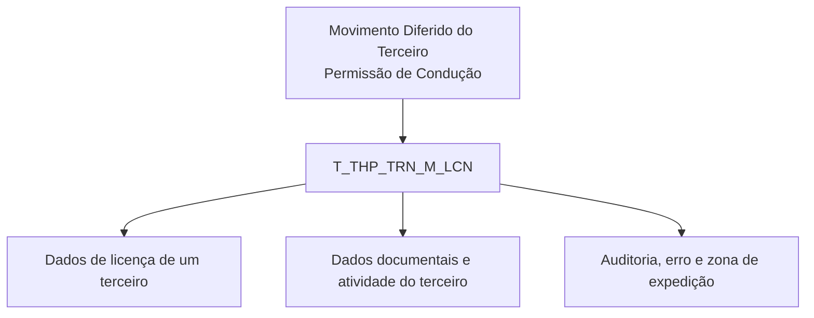

# Detalhar Informação da Permissão de Condução no Movimento Diferido do Terceiro — Visão Técnica

## 1. Metadados do Documento
- **Arquivo de Origem:** Não identificado; conteúdo bruto fornecido na solicitação
- **Tipo de Documento:** Especificação Técnica
- **Domínio / Sistema:** Movimento Diferido do Terceiro; permissões/licenças de condução
- **Público-Alvo:** Desenvolvedores, Arquitetos e Analistas Funcionais
- **Data/Versão Identificada:** Não identificada

---

## 2. Resumo Executivo & Contexto de Negócio

O documento apresenta uma visão técnica para detalhar informações de permissão de condução no contexto de um movimento diferido associado a um terceiro. A especificação identifica explicitamente o modelo de dados envolvido na operação.

A tabela central da operação é `T_THP_TRN_M_LCN`, descrita como “TABLA BUZÓN LICENCIAS DE UN TERCERO”. A estrutura armazena identificadores, sequência, dados documentais, atividade do terceiro, atributos da licença, dados de auditoria e campos relacionados a erro e zona geográfica de expedição.

O conteúdo fornecido é predominantemente tabular e apresenta, para cada coluna, se ocorre alteração de valor e se o preenchimento é obrigatório. Não há detalhamento de métodos HTTP, contratos JSON, integrações, regras de processamento, valores de domínio, nem comportamento transacional.

A extração aparenta conter fragmentação de texto e truncamentos, especialmente nas descrições das colunas. Este relatório preserva esses limites e não expande siglas, descrições ou regras que não estejam explicitamente sustentadas pelo conteúdo original.

---

## 3. Arquitetura, Componentes & Tecnologias Envolvidas

O documento cita somente uma estrutura de dados como participante da operação:

| Componente | Tipo | Descrição identificada |
| :--- | :--- | :--- |
| `T_THP_TRN_M_LCN` | Tabela | “TABLA BUZÓN LICENCIAS DE UN TERCERO” |

Não foram identificados microsserviços, APIs, tecnologias, ambientes, URLs, servidores, pipelines de CI/CD, protocolos de integração ou fluxos entre componentes.



> **Nota de Análise:** O diagrama representa apenas a relação conceitual explicitamente identificável entre a operação e a tabela `T_THP_TRN_M_LCN`. O documento não descreve a origem dos dados, consumidores, serviços intermediários ou sequência de processamento.

---

## 4. Regras de Negócio, Especificações Funcionais & Processos

### 4.1 Estrutura participante

A operação de detalhamento de informação da permissão de condução no movimento diferido do terceiro envolve a tabela `T_THP_TRN_M_LCN`.

### 4.2 Alteração de valor

Para todas as colunas apresentadas no conteúdo extraído, o indicador de alteração de valor está registrado como `S`.

### 4.3 Obrigatoriedade

As colunas identificadas como obrigatórias no documento são:

- `IDN_VAL`
- `IDN_SQN`
- `CMP_VAL`
- `THP_DCM_TYP_VAL`
- `THP_DCM_VAL`
- `THP_ACV_VAL`
- `LCN_SQN_VAL`
- `USR_VAL`
- `MDF_DAT`

As colunas identificadas como não obrigatórias no documento são:

- `PRC_THD_VAL`
- `PRC_STS_VAL`
- `LCN_TYP_VAL`
- `LCN_VAL`
- `LCN_DAT`
- `LCN_STS_VAL`
- `LCN_GRH_VAL`
- `ACN_ORG_VAL`
- `ERR_IDN_VAL`
- `VAL_ZON_EXP_LIC_CON`

### 4.4 Ausência de detalhamento funcional adicional

O conteúdo não especifica:

- Critérios de criação, alteração ou exclusão de registros.
- Regras de validação entre campos.
- Valores permitidos para tipos, estados, códigos ou situações.
- Chaves primárias, chaves estrangeiras ou índices.
- Regras de tratamento para `ERR_IDN_VAL`.
- Processo de integração para envio ou consumo das informações.
- Contratos de API, métodos HTTP ou formatos JSON.
- Regras para cálculo, priorização, autorização ou aprovação.

> **Nota de Análise:** O documento registra que `ACN_ORG_VAL` está relacionado à primeira ação produzida sobre o registro, com referência a `(I)NSERT` e `(M)ODIFI...`; entretanto, o texto extraído está truncado e não permite afirmar valores completos, regras de gravação ou semântica adicional.

---

## 5. Tabelas de Parâmetros, Ambientes e Estruturas de Dados

### 5.1 Tabela envolvida

| Item / Parâmetro | Descrição / Função | Tipo / Valores / Formato | Ambiente / Observações |
| :--- | :--- | :--- | :--- |
| `T_THP_TRN_M_LCN` | “TABLA BUZÓN LICENCIAS DE UN TERCERO” | Não informado | Estrutura indicada como participante da operação |

### 5.2 Colunas identificadas

| Item / Parâmetro | Descrição / Função | Tipo / Valores / Formato | Ambiente / Observações |
| :--- | :--- | :--- | :--- |
| `IDN_VAL` | “IDENTIFI...” | Alteração de valor: `S` | Obrigatória: `SI`; descrição truncada na extração |
| `IDN_SQN` | “SECUEN... DENTRO IDENTIFI...” | Alteração de valor: `S` | Obrigatória: `SI`; descrição truncada na extração |
| `PRC_THD_VAL` | “HILO / RS” | Alteração de valor: `S` | Obrigatória: `NO`; significado não detalhado |
| `PRC_STS_VAL` | “SITUACIÓ... PROCES...” | Alteração de valor: `S` | Obrigatória: `NO`; descrição truncada |
| `CMP_VAL` | “COMPAÑ...” | Alteração de valor: `S` | Obrigatória: `SI`; descrição truncada |
| `THP_DCM_TYP_VAL` | “TIPO DE ... DOCUMENTO DEL TER...” | Alteração de valor: `S` | Obrigatória: `SI`; descrição truncada |
| `THP_DCM_VAL` | “CODIGO ... DOCUMENTO DEL TER...” | Alteração de valor: `S` | Obrigatória: `SI`; descrição truncada |
| `THP_ACV_VAL` | “ACTIVIDA... TERCER...” | Alteração de valor: `S` | Obrigatória: `SI`; descrição truncada |
| `LCN_SQN_VAL` | “SECUEN... LA LICEN...” | Alteração de valor: `S` | Obrigatória: `SI`; descrição truncada |
| `LCN_TYP_VAL` | “TIPO DE LICENCIA” | Alteração de valor: `S` | Obrigatória: `NO` |
| `LCN_VAL` | “CODIGO LICENCIA” | Alteração de valor: `S` | Obrigatória: `NO` |
| `LCN_DAT` | “FECHA D... LICENCIA” | Alteração de valor: `S` | Obrigatória: `NO`; descrição truncada |
| `LCN_STS_VAL` | “ESTADO LICENCIA” | Alteração de valor: `S` | Obrigatória: `NO` |
| `LCN_GRH_VAL` | “CODIGO GEOGRA... DE EXPE... DE LA LIC...” | Alteração de valor: `S` | Obrigatória: `NO`; descrição truncada |
| `ACN_ORG_VAL` | “PRMERA ACCION PRODUC... SOBRE EL REGISTR... (I)NSERT (M)ODIFI...” | Alteração de valor: `S` | Obrigatória: `NO`; texto truncado |
| `USR_VAL` | “USUARIO ACTUALI... FILA” | Alteração de valor: `S` | Obrigatória: `SI`; descrição truncada |
| `MDF_DAT` | “FECHA D... ACTUALI... DE LA FIL...” | Alteração de valor: `S` | Obrigatória: `SI`; descrição truncada |
| `ERR_IDN_VAL` | “CODIGO ERROR” | Alteração de valor: `S` | Obrigatória: `NO` |
| `VAL_ZON_EXP_LIC_CON` | “ZONA GEOGRA... DONDE F... EXPEDID... CARNET CONDUC...” | Alteração de valor: `S` | Obrigatória: `NO`; descrição truncada |

### 5.3 Ambientes, rotas e logs

| Item / Parâmetro | Descrição / Função | Tipo / Valores / Formato | Ambiente / Observações |
| :--- | :--- | :--- | :--- |
| Ambientes | Não identificados | Não informado | O documento não apresenta ambientes |
| URLs | Não identificadas | Não informado | O documento não apresenta URLs |
| Rotas de log | Não identificadas | Não informado | O documento não apresenta caminhos ou variáveis de log |
| Servidores | Não identificados | Não informado | O documento não apresenta mapeamento de servidores |

---

## 6. Bateria de Perguntas & Respostas para RAG (FAQ Sintético)

### P1: Qual tabela é utilizada para detalhar a informação de permissão de condução no movimento diferido do terceiro?
**R:** A tabela identificada no documento é `T_THP_TRN_M_LCN`, descrita como “TABLA BUZÓN LICENCIAS DE UN TERCERO”.

### P2: Quais campos da tabela `T_THP_TRN_M_LCN` são obrigatórios conforme o documento?
**R:** Os campos marcados como obrigatórios (`SI`) são `IDN_VAL`, `IDN_SQN`, `CMP_VAL`, `THP_DCM_TYP_VAL`, `THP_DCM_VAL`, `THP_ACV_VAL`, `LCN_SQN_VAL`, `USR_VAL` e `MDF_DAT`.

### P3: O campo `LCN_TYP_VAL` é obrigatório?
**R:** Não. O documento marca `LCN_TYP_VAL` com obrigatoriedade `NO` e o descreve como “TIPO DE LICENCIA”.

### P4: Qual campo representa o código da licença?
**R:** O campo `LCN_VAL` é descrito no documento como “CODIGO LICENCIA”. A obrigatoriedade indicada para `LCN_VAL` é `NO`.

### P5: Qual campo registra o estado da licença?
**R:** O campo `LCN_STS_VAL` é descrito como “ESTADO LICENCIA”. O documento indica alteração de valor `S` e obrigatoriedade `NO`.

### P6: Qual campo está relacionado ao código de erro?
**R:** O campo `ERR_IDN_VAL` é descrito como “CODIGO ERROR”. O documento indica que esse campo pode sofrer alteração de valor (`S`), mas não é obrigatório (`NO`).

### P7: Quais campos documentais do terceiro são obrigatórios?
**R:** Os campos documentais obrigatórios identificados são `THP_DCM_TYP_VAL`, descrito parcialmente como tipo de documento do terceiro, e `THP_DCM_VAL`, descrito parcialmente como código de documento do terceiro.

### P8: Qual campo registra o usuário que atualiza a linha?
**R:** O campo `USR_VAL` está descrito de forma truncada como “USUARIO ACTUALI... FILA”, indicando relação com o usuário que atualiza a linha. O campo é obrigatório (`SI`).

### P9: Qual campo registra a data de atualização da linha?
**R:** O campo `MDF_DAT` está descrito de forma truncada como “FECHA D... ACTUALI... DE LA FIL...”, indicando relação com a data de atualização da linha. O campo é obrigatório (`SI`).

### P10: O documento define quais são os valores válidos para o estado, tipo ou código de licença?
**R:** Não. O documento lista campos como `LCN_TYP_VAL`, `LCN_VAL` e `LCN_STS_VAL`, mas não apresenta domínios de valores, enumerações, formatos ou regras de validação para esses atributos.

### P11: O documento especifica APIs, métodos HTTP ou contratos JSON para a operação?
**R:** Não. O conteúdo fornecido apresenta somente a tabela envolvida e seus campos. Não há especificação de APIs, métodos HTTP, endpoints, payloads JSON ou contratos de integração.

### P12: O que representa `VAL_ZON_EXP_LIC_CON`?
**R:** O campo `VAL_ZON_EXP_LIC_CON` é descrito parcialmente como uma zona geográfica onde foi expedido o carnet de condução. O documento o marca como alterável (`S`) e não obrigatório (`NO`).

---

## 7. Glossário de Termos, Siglas & Conceitos-Chave

- **`T_THP_TRN_M_LCN`:** Tabela identificada no documento como “TABLA BUZÓN LICENCIAS DE UN TERCERO”.
- **`IDN_VAL`:** Campo com descrição truncada iniciada por “IDENTIFI...”.
- **`IDN_SQN`:** Campo com descrição truncada relacionada a sequência dentro de um identificador.
- **`LCN`:** Prefixo presente em campos relacionados a licença; a expansão da sigla não é informada.
- **`LCN_TYP_VAL`:** Campo descrito como tipo de licença.
- **`LCN_VAL`:** Campo descrito como código de licença.
- **`LCN_DAT`:** Campo descrito parcialmente como data da licença.
- **`LCN_STS_VAL`:** Campo descrito como estado da licença.
- **`LCN_GRH_VAL`:** Campo descrito parcialmente como código geográfico de expedição da licença.
- **`THP_DCM_TYP_VAL`:** Campo descrito parcialmente como tipo de documento do terceiro.
- **`THP_DCM_VAL`:** Campo descrito parcialmente como código de documento do terceiro.
- **`THP_ACV_VAL`:** Campo descrito parcialmente como atividade do terceiro.
- **`ACN_ORG_VAL`:** Campo associado parcialmente à primeira ação produzida sobre o registro, com menções a insert e modificação.
- **`USR_VAL`:** Campo relacionado ao usuário que atualiza a linha.
- **`MDF_DAT`:** Campo relacionado à data de atualização da linha.
- **`ERR_IDN_VAL`:** Campo descrito como código de erro.
- **`VAL_ZON_EXP_LIC_CON`:** Campo relacionado parcialmente à zona geográfica de expedição do carnet de condução.
- **`S`:** Valor apresentado na coluna “CAMBIA VALOR” para todos os campos extraídos; o documento não define explicitamente a expansão de `S`.
- **`SI` / `NO`:** Valores apresentados na coluna “OBLIGATORIA”, indicando respectivamente campo obrigatório ou não obrigatório no idioma do documento.

---

## 8. Notas Críticas, Riscos & Limitações

- O conteúdo extraído possui diversos trechos truncados, impedindo a interpretação completa de algumas descrições.
- Não há informação sobre tipos físicos de dados, tamanhos, precisão, nulidade técnica, chaves ou relacionamentos da tabela.
- Não há regras de validação, regras de negócio condicionais ou sequência operacional detalhada.
- Não há definição de valores permitidos para tipos de licença, estado da licença, situação de processo, atividade do terceiro ou código geográfico.
- O documento não informa como `ERR_IDN_VAL` é preenchido, interpretado ou tratado.
- A referência a `(I)NSERT` e `(M)ODIFI...` em `ACN_ORG_VAL` está incompleta; não é possível afirmar a totalidade das ações ou valores aceitos.
- Não foram identificados ambientes, URLs, servidores, logs, APIs, integrações externas ou dependências de equipes.
- **Nota de Análise:** O documento apresenta a tabela `T_THP_TRN_M_LCN`, porém não detalha contratos técnicos, fluxos de dados ou comportamento da operação sobre os registros.

---

## 9. Conteúdo Bruto Estruturado (Referência Fiel)

```text
--- [PÁGINA 1 DE 3] ---

DETALLAR Información del Permiso de
Conducir en el Movimiento Diferido del Tercero
(Visión Técnica)
Modelo de datos involucrado
La tabla que interviene en esta operación es:
TABLA DESCRIPCIÓN
T_THP_TRN_M_LCN TABLA BUZÓN LICENCIAS DE UN TERCERO
COLUMNA CAMBIA
VALOR
MOTIVO/VALOR OBLIGATORIA COMENT
IDN_VAL S N.A. SI IDENTIFI
IDN_SQN S N.A. SI SECUEN
DENTRO
IDENTIFI
PRC_THD_VAL S N.A. NO HILO
 / 
 RS
Inicio Soluciones APIs Documentación Zeus
ES


--- [PÁGINA 2 DE 3] ---

COLUMNA CAMBIA
VALOR
MOTIVO/VALOR OBLIGATORIA COMENT
PRC_STS_VAL S N.A. NO SITUACIÓ
PROCES
CMP_VAL S N.A. SI COMPAÑ
THP_DCM_TYP_VAL S N.A. SI TIPO DE
COCUME
DEL TER
THP_DCM_VAL S N.A. SI CODIGO 
DOCUME
DEL TER
THP_ACV_VAL S N.A. SI ACTIVIDA
TERCER
LCN_SQN_VAL S N.A. SI SECUEN
LA LICEN
LCN_TYP_VAL S N.A. NO TIPO DE
LICENCIA
LCN_VAL S N.A. NO CODIGO 
LICENCIA
LCN_DAT S N.A. NO FECHA D
LICENCIA
LCN_STS_VAL S N.A. NO ESTADO 
LICENCIA
LCN_GRH_VAL S N.A. NO CODIGO
GEOGRA
DE EXPE
DE LA LIC


--- [PÁGINA 3 DE 3] ---

COLUMNA CAMBIA
VALOR
MOTIVO/VALOR OBLIGATORIA COMENT
ACN_ORG_VAL S N.A. NO PRMERA
ACCION 
PRODUC
SOBRE E
REGISTR
(I)NSERT
(M)ODIFI
USR_VAL S N.A. SI USUARIO
ACTUALI
FILA
MDF_DAT S N.A. SI FECHA D
ACTUALI
DE LA FIL
ERR_IDN_VAL S N.A. NO CODIGO 
ERROR
VAL_ZON_EXP_LIC_CON S N.A. NO ZONA
GEOGRA
DONDE F
EXPEDID
CARNET 
CONDUC
```
