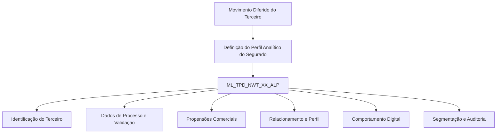

# Perfil Analítico do Segurado no Movimento Diferido do Terceiro — Visão Técnica

## 1. Metadados do Documento
- **Arquivo de Origem:** Não identificado no conteúdo fornecido
- **Tipo de Documento:** Especificação Técnica
- **Domínio / Sistema:** Perfil Analítico do Segurado; Movimento Diferido do Terceiro
- **Público-Alvo:** Desenvolvedores, Arquitetos, Analistas Funcionais e Operação
- **Data/Versão Identificada:** Não identificada

---

## 2. Resumo Executivo & Contexto de Negócio

O documento descreve, sob uma visão técnica, a definição do perfil analítico do segurado no contexto de uma operação denominada “Movimiento Diferido del Tercero”. A informação apresentada concentra-se no modelo de dados utilizado para persistir atributos de identificação, processo, comportamento, propensão comercial, relacionamento, navegação web e segmentação de cliente.

A tabela indicada para a operação é `ML_TPD_NWT_XX_ALP`, descrita literalmente como “TABLA BUZON DEFINICION PERFIL ANALITICO”. O conteúdo relaciona as colunas da tabela, indica que todas possuem alteração de valor marcada como `S`, identifica a obrigatoriedade de cada atributo e apresenta uma descrição funcional abreviada para cada campo.

Os atributos obrigatórios identificam principalmente o terceiro, a sequência, a companhia, o documento, a data de validação, a linha desabilitada, o usuário responsável pela atualização e a data de modificação. Os atributos não obrigatórios concentram dados analíticos, tais como probabilidades de abandono e venda, indicadores de relacionamento, preferências de canal e dispositivo, informações de navegação, engajamento em aplicativo e segmentação.

**Nota de Análise:** o documento não especifica tipos físicos de dados, tamanhos, chaves primárias, chaves estrangeiras, contratos de API, métodos HTTP, regras de cálculo, periodicidade de carga, origem dos valores ou mecanismos de validação além do indicador de obrigatoriedade apresentado.

---

## 3. Arquitetura, Componentes & Tecnologias Envolvidas

| Componente / Elemento | Descrição sustentada pelo documento |
| :--- | :--- |
| Movimento Diferido do Terceiro | Operação na qual é detalhado o perfil analítico do segurado. |
| `ML_TPD_NWT_XX_ALP` | Tabela que intervém na operação; descrita como tabela de buzón para definição do perfil analítico. |
| Perfil Analítico do Segurado | Conjunto de campos de identificação, processo, comportamento, propensão comercial, relacionamento, navegação, canal, dispositivo e segmentação. |
| Zeus | Termo exibido na navegação extraída (“Inicio Soluciones APIs Documentación Zeus”), sem detalhamento técnico ou relação explícita com a tabela. |



**Nota de Análise:** o diagrama representa apenas o agrupamento lógico dos campos da tabela `ML_TPD_NWT_XX_ALP`. O documento não apresenta integrações, serviços, APIs, ambientes, protocolos ou fluxo de carga entre sistemas.

---

## 4. Regras de Negócio, Especificações Funcionais & Processos

1. A operação utiliza a tabela `ML_TPD_NWT_XX_ALP`.
2. Todas as colunas listadas possuem `S` no campo “CAMBIA VALOR”.
3. Os seguintes campos são obrigatórios (`SI`):
   - `BTC_IDN_VAL`: identificado como “IDENTIFICAD”.
   - `SQN_VAL`: sequência.
   - `CMP_VAL`: companhia.
   - `THP_DCM_TYP_VAL`: tipo do documento do terceiro.
   - `THP_DCM_VAL`: documento do terceiro.
   - `VLD_DAT`: data de validação.
   - `DSB_ROW`: fila desabilitada.
   - `USR_VAL`: usuário que atualizou a fila.
   - `MDF_VAL`: data de modificação.
4. Os campos de perfil analítico, processo, propensão comercial, relacionamento, navegação digital, preferência e segmentação são marcados como não obrigatórios (`NO`).
5. O documento registra `N.A.` na coluna “MOTIVO/VALOR” para todos os atributos apresentados.
6. O documento não define condições de preenchimento, fórmulas, faixas de valores, regras de consistência, dependências entre campos ou consequências operacionais para valores ausentes.

---

## 5. Tabelas de Parâmetros, Ambientes e Estruturas de Dados

| Item / Parâmetro | Descrição / Função | Tipo / Valores / Formato | Ambiente / Observações |
| :--- | :--- | :--- | :--- |
| `ML_TPD_NWT_XX_ALP` | Tabela buzón de definição do perfil analítico | Não informado | Tabela que intervém na operação |
| `BTC_IDN_VAL` | Identificad | Não informado | Muda valor: `S`; obrigatório: `SI`; motivo/valor: `N.A.` |
| `SQN_VAL` | Sequência | Não informado | Muda valor: `S`; obrigatório: `SI`; motivo/valor: `N.A.` |
| `CMP_VAL` | Companhia | Não informado | Muda valor: `S`; obrigatório: `SI`; motivo/valor: `N.A.` |
| `THP_DCM_TYP_VAL` | Tipo do documento do terceiro | Não informado | Muda valor: `S`; obrigatório: `SI`; motivo/valor: `N.A.` |
| `THP_DCM_VAL` | Documento do terceiro | Não informado | Muda valor: `S`; obrigatório: `SI`; motivo/valor: `N.A.` |
| `VLD_DAT` | Data de validação | Não informado | Muda valor: `S`; obrigatório: `SI`; motivo/valor: `N.A.` |
| `PRC_THD_VAL` | Hilo | Não informado | Muda valor: `S`; obrigatório: `NO`; motivo/valor: `N.A.` |
| `PRC_STS_VAL` | Situação de processo | Não informado | Muda valor: `S`; obrigatório: `NO`; motivo/valor: `N.A.` |
| `CTV_VAL` | CLTV | Não informado | Muda valor: `S`; obrigatório: `NO`; motivo/valor: `N.A.` |
| `SRD_PER` | Probabilidade de abandono | Não informado | Muda valor: `S`; obrigatório: `NO`; motivo/valor: `N.A.` |
| `UPS_MOT_PER` | Probabilidade selling auto | Não informado | Muda valor: `S`; obrigatório: `NO`; motivo/valor: `N.A.` |
| `UPS_HOM_PER` | Probabilidade selling hogar | Não informado | Muda valor: `S`; obrigatório: `NO`; motivo/valor: `N.A.` |
| `UPS_HLT_PER` | Probabilidade selling salud | Não informado | Muda valor: `S`; obrigatório: `NO`; motivo/valor: `N.A.` |
| `CRG_AUT_PER` | Probabilidade cross sell auto | Não informado | Muda valor: `S`; obrigatório: `NO`; motivo/valor: `N.A.` |
| `CRG_HOM_PER` | Probabilidade cross sell hogar | Não informado | Muda valor: `S`; obrigatório: `NO`; motivo/valor: `N.A.` |
| `CRG_HLT_PER` | Probabilidade cross sell salud | Não informado | Muda valor: `S`; obrigatório: `NO`; motivo/valor: `N.A.` |
| `SAR_IDX_VAL` | Indicador de saturação | Não informado | Muda valor: `S`; obrigatório: `NO`; motivo/valor: `N.A.` |
| `RLN_IDX_VAL` | Índice de relacionamento | Não informado | Muda valor: `S`; obrigatório: `NO`; motivo/valor: `N.A.` |
| `IGR_VAL` | Integralidade | Não informado | Muda valor: `S`; obrigatório: `NO`; motivo/valor: `N.A.` |
| `BNF_QNT` | Quantidade de beneficiários | Não informado | Muda valor: `S`; obrigatório: `NO`; motivo/valor: `N.A.` |
| `HNL_TYP_VAL` | Canal preferido | Não informado | Muda valor: `S`; obrigatório: `NO`; motivo/valor: `N.A.` |
| `DVC_TYP_VAL` | Dispositivo preferido | Não informado | Muda valor: `S`; obrigatório: `NO`; motivo/valor: `N.A.` |
| `CDR_VAL` | Credit score | Não informado | Muda valor: `S`; obrigatório: `NO`; motivo/valor: `N.A.` |
| `HOR_DAY_VAL` | Hora do dia | Não informado | Muda valor: `S`; obrigatório: `NO`; motivo/valor: `N.A.` |
| `RNY_VAL` | Recorrência | Não informado | Muda valor: `S`; obrigatório: `NO`; motivo/valor: `N.A.` |
| `FRY_VAL` | Frequência de visita | Não informado | Muda valor: `S`; obrigatório: `NO`; motivo/valor: `N.A.` |
| `MDV_VAL` | Visitantes multidispositivo | Não informado | Muda valor: `S`; obrigatório: `NO`; motivo/valor: `N.A.` |
| `WEB_TIM_VAL` | Tempo na web | Não informado | Muda valor: `S`; obrigatório: `NO`; motivo/valor: `N.A.` |
| `SNS_VAL` | Seções na web | Não informado | Muda valor: `S`; obrigatório: `NO`; motivo/valor: `N.A.` |
| `WEB_DVC_TYP_VAL` | Dispositivo na web | Não informado | Muda valor: `S`; obrigatório: `NO`; motivo/valor: `N.A.` |
| `FWR_VAL` | Followers | Não informado | Muda valor: `S`; obrigatório: `NO`; motivo/valor: `N.A.` |
| `HNL_SBB_VAL` | Channel subscriber | Não informado | Muda valor: `S`; obrigatório: `NO`; motivo/valor: `N.A.` |
| `APL_ENM_VAL` | App engagement | Não informado | Muda valor: `S`; obrigatório: `NO`; motivo/valor: `N.A.` |
| `CUS_SGM_TYP_VAL` | Identificador de segmentação de cliente | Não informado | Muda valor: `S`; obrigatório: `NO`; motivo/valor: `N.A.` |
| `DSB_ROW` | Fila desabilitada | Não informado | Muda valor: `S`; obrigatório: `SI`; motivo/valor: `N.A.` |
| `USR_VAL` | Usuário que atualizou a fila | Não informado | Muda valor: `S`; obrigatório: `SI`; motivo/valor: `N.A.` |
| `MDF_VAL` | Data de modificação | Não informado | Muda valor: `S`; obrigatório: `SI`; motivo/valor: `N.A.` |
| `ACN_ORG_VAL` | Ação de origem | Não informado | Muda valor: `S`; obrigatório: `NO`; motivo/valor: `N.A.` |
| `ERR_IDN_VAL` | Identificador interno de erro | Não informado | Muda valor: `S`; obrigatório: `NO`; motivo/valor: `N.A.` |

---

## 6. Bateria de Perguntas & Respostas para RAG (FAQ Sintético)

### P1: Qual tabela é utilizada na operação de perfil analítico do segurado no Movimento Diferido do Terceiro?
**R:** A tabela indicada pelo documento é `ML_TPD_NWT_XX_ALP`, descrita como “TABLA BUZON DEFINICION PERFIL ANALITICO”.

### P2: Quais são os campos obrigatórios da tabela `ML_TPD_NWT_XX_ALP`?
**R:** Os campos obrigatórios são `BTC_IDN_VAL`, `SQN_VAL`, `CMP_VAL`, `THP_DCM_TYP_VAL`, `THP_DCM_VAL`, `VLD_DAT`, `DSB_ROW`, `USR_VAL` e `MDF_VAL`.

### P3: O campo `THP_DCM_VAL` é obrigatório e qual informação ele representa?
**R:** Sim. `THP_DCM_VAL` é obrigatório (`SI`) e representa o documento do terceiro.

### P4: Qual campo representa o tipo de documento do terceiro?
**R:** O campo `THP_DCM_TYP_VAL` representa o tipo do documento do terceiro. O documento o classifica como obrigatório.

### P5: Quais campos armazenam probabilidades relacionadas a abandono e estratégias comerciais?
**R:** `SRD_PER` representa a probabilidade de abandono. `UPS_MOT_PER`, `UPS_HOM_PER` e `UPS_HLT_PER` representam probabilidades de selling auto, hogar e salud. `CRG_AUT_PER`, `CRG_HOM_PER` e `CRG_HLT_PER` representam probabilidades de cross sell auto, hogar e salud.

### P6: Quais atributos descrevem preferências de canal e dispositivo?
**R:** `HNL_TYP_VAL` representa o canal preferido e `DVC_TYP_VAL` representa o dispositivo preferido. Para navegação web, `WEB_DVC_TYP_VAL` representa o dispositivo na web.

### P7: Quais campos relacionados à navegação digital estão presentes na tabela?
**R:** Os campos apresentados são `HOR_DAY_VAL` para hora do dia, `RNY_VAL` para recorrência, `FRY_VAL` para frequência de visita, `MDV_VAL` para visitantes multidispositivo, `WEB_TIM_VAL` para tempo na web, `SNS_VAL` para seções na web e `WEB_DVC_TYP_VAL` para dispositivo na web.

### P8: Como o documento representa o status de obrigatoriedade dos campos?
**R:** A coluna “OBLIGATORIA” utiliza `SI` para campos obrigatórios e `NO` para campos não obrigatórios. O documento não apresenta uma definição adicional para esses valores.

### P9: Quais campos suportam auditoria da atualização de uma fila?
**R:** `DSB_ROW` representa a fila desabilitada, `USR_VAL` representa o usuário que atualizou a fila e `MDF_VAL` representa a data de modificação. Os três campos são obrigatórios.

### P10: O documento informa tipos de dados ou formatos para as colunas?
**R:** Não. O documento apresenta nome de coluna, indicador de alteração de valor, motivo/valor, obrigatoriedade e comentário, mas não informa tipo físico, tamanho, formato, domínio de valores ou regra de conversão.

### P11: Qual campo representa segmentação de cliente?
**R:** `CUS_SGM_TYP_VAL` representa o identificador de segmentação de cliente. O campo é marcado como não obrigatório.

### P12: Existem campos para tratamento ou identificação de erros?
**R:** Sim. `ERR_IDN_VAL` é descrito como identificador interno de erro e é marcado como não obrigatório.

---

## 7. Glossário de Termos, Siglas & Conceitos-Chave

- **`ML_TPD_NWT_XX_ALP`:** Tabela que intervém na operação; descrita como tabela buzón de definição de perfil analítico.
- **Movimento Diferido do Terceiro:** Nome da operação abordada pelo documento.
- **Terceiro:** Entidade associada aos campos de documento e tipo de documento; o documento não fornece definição adicional.
- **CLTV:** Termo associado ao campo `CTV_VAL`; o significado da sigla não é expandido no documento.
- **Cross Sell:** Termo associado aos campos `CRG_AUT_PER`, `CRG_HOM_PER` e `CRG_HLT_PER`.
- **Selling Auto / Hogar / Salud:** Termos associados às probabilidades nos campos `UPS_MOT_PER`, `UPS_HOM_PER` e `UPS_HLT_PER`.
- **Credit Score:** Termo associado ao campo `CDR_VAL`.
- **App Engagement:** Termo associado ao campo `APL_ENM_VAL`.
- **Fila Desabilitada:** Descrição apresentada para o campo `DSB_ROW`.
- **Zeus:** Termo exibido na navegação da extração, sem definição contextual adicional.

---

## 8. Notas Críticas, Riscos & Limitações

- O documento não identifica arquivo de origem, autor, data, versão, ambiente ou sistema proprietário.
- A extração não informa tipos de dados, comprimento de campos, valores permitidos, valores padrão, índices ou relacionamentos entre tabelas.
- Não há especificação de APIs, integrações, contratos JSON, serviços, jobs, frequência de processamento ou estratégia de carga da tabela.
- As descrições de vários campos estão truncadas no conteúdo extraído, como `BTC_IDN_VAL` (“IDENTIFICAD”), `PRC_STS_VAL` (“SITUACION D”), `RLN_IDX_VAL` (“INDICE RELA”) e `CUS_SGM_TYP_VAL` (“IDENTIFICAD SEGMENTAC CLIENTE”).
- A coluna “MOTIVO/VALOR” contém `N.A.` para todos os atributos, sem explicação semântica adicional.
- O indicador `S` em “CAMBIA VALOR” é consistente em todas as linhas, mas o documento não explica seu comportamento operacional.

---

## 9. Conteúdo Bruto Estruturado (Referência Fiel)

```text
--- [PÁGINA 1 DE 4] ---

DETALLAR Información Perfil Analítico del
Asegurado en el Movimiento Diferido del
Tercero (Visión Técnica)
Modelo de datos involucrado
La tabla que interviene en esta operación es:
TABLA DESCRIPCIÓN
ML_TPD_NWT_XX_ALP TABLA BUZON DEFINICION PERFIL ANALITICO
COLUMNA CAMBIA
VALOR
MOTIVO/VALOR OBLIGATORIA COMENTARIO
BTC_IDN_VAL S N.A. SI IDENTIFICAD
SQN_VAL S N.A. SI SECUENCIA
CMP_VAL S N.A. SI COMPANIA
THP_DCM_TYP_VAL S N.A. SI TIPO DEL
DOCUMENTO
 / 
 RS
Inicio Soluciones APIs Documentación Zeus
ES


--- [PÁGINA 2 DE 4] ---

COLUMNA CAMBIA
VALOR
MOTIVO/VALOR OBLIGATORIA COMENTARIO
TERCERO
THP_DCM_VAL S N.A. SI DOCUMENTO
TERCERO
VLD_DAT S N.A. SI FECHA VALID
PRC_THD_VAL S N.A. NO HILO
PRC_STS_VAL S N.A. NO SITUACION D
PROCESO
CTV_VAL S N.A. NO CLTV
SRD_PER S N.A. NO PROBABILIDA
ABANDONO
UPS_MOT_PER S N.A. NO PROBABILIDA
SELLING AUT
UPS_HOM_PER S N.A. NO PROBABILIDA
SELLING HOG
UPS_HLT_PER S N.A. NO PROBABILIDA
SELLING SAL
CRG_AUT_PER S N.A. NO PROBABILIDA
CROSS SELL
AUTO
CRG_HOM_PER S N.A. NO PROBABILIDA
CROSS SELL
HOGAR
CRG_HLT_PER S N.A. NO PROBABILIDA
CROSS SELL
SALUD


--- [PÁGINA 3 DE 4] ---

COLUMNA CAMBIA
VALOR
MOTIVO/VALOR OBLIGATORIA COMENTARIO
SAR_IDX_VAL S N.A. NO INDICADOR
SATURACION
RLN_IDX_VAL S N.A. NO INDICE RELA
IGR_VAL S N.A. NO INTEGRALIDA
BNF_QNT S N.A. NO CANTIDAD DE
BENEFICIARI
HNL_TYP_VAL S N.A. NO CANAL
PREFERIDO
DVC_TYP_VAL S N.A. NO DISPOSITIVO
PREFERIDO
CDR_VAL S N.A. NO CREDIT SCOR
HOR_DAY_VAL S N.A. NO HORA DIA
RNY_VAL S N.A. NO RECURRENC
FRY_VAL S N.A. NO FRECUENCIA
VISITA
MDV_VAL S N.A. NO VISITANTES
MULTIDISPOS
WEB_TIM_VAL S N.A. NO TIEMPO EN L
WEB
SNS_VAL S N.A. NO SECCIONS S
WEB_DVC_TYP_VAL S N.A. NO DISPOSITIVO
LA WEB


--- [PÁGINA 4 DE 4] ---

COLUMNA CAMBIA
VALOR
MOTIVO/VALOR OBLIGATORIA COMENTARIO
FWR_VAL S N.A. NO FOLLOWERS
HNL_SBB_VAL S N.A. NO CHANNEL
SUBSCRIBER
APL_ENM_VAL S N.A. NO APP
ENGAGEMEN
CUS_SGM_TYP_VAL S N.A. NO IDENTIFICAD
SEGMENTAC
CLIENTE
DSB_ROW S N.A. SI FILA
DESHABILITA
USR_VAL S N.A. SI USUARIO QU
ACTUALIZO L
FILA
MDF_VAL S N.A. SI FECHA
MODIFICACIO
ACN_ORG_VAL S N.A. NO ACCION ORIG
ERR_IDN_VAL S N.A. NO IDENTIFICAD
INTERNO DE
ERROR
```
