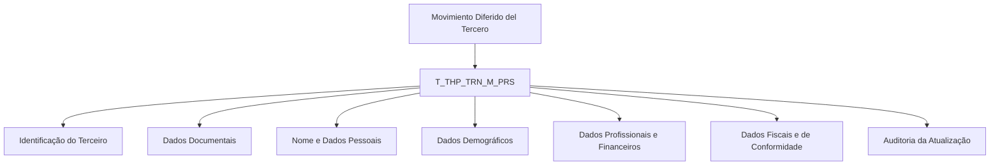

# Detalhamento de Informação Pessoal no Movimento Diferido do Terceiro — Visão Técnica

## 1. Metadados do Documento
- **Arquivo de Origem:** `Não identificado no conteúdo fornecido`
- **Tipo de Documento:** Especificação Técnica
- **Domínio / Sistema:** Movimento Diferido do Terceiro / dados de pessoa / tabela `T_THP_TRN_M_PRS`
- **Público-Alvo:** Desenvolvedores, Arquitetos, Analistas Funcionais e Operação
- **Data/Versão Identificada:** Não identificada

---

## 2. Resumo Executivo & Contexto de Negócio

O documento descreve a visão técnica para detalhar informações pessoais no processo denominado **Movimiento Diferido del Tercero**. O escopo apresentado concentra-se no modelo de dados envolvido na operação, especialmente na tabela `T_THP_TRN_M_PRS`, identificada como **TABLA BUZON PERSONA**.

A especificação lista colunas da tabela, indicando para cada atributo os valores apresentados nas colunas extraídas como “CAMBIA VALOR”, “MOTIVO/VALOR”, obrigatoriedade e comentário funcional. Em todos os registros visíveis, o valor de “CAMBIA VALOR” é `S` e o campo “MOTIVO/VALOR” aparece como `N.A.`.

O principal objetivo do conteúdo é registrar quais dados pessoais, documentais, cadastrais, profissionais, financeiros, fiscais e de auditoria estão associados ao terceiro tratado pela operação. Entre os campos obrigatórios explicitamente identificados estão identificadores, companhia, tipo e código de documento do terceiro, usuário e data de atualização, além de marcação fiscal para outros países.

O documento não especifica contratos de integração, métodos HTTP, APIs, formatos JSON, banco de dados físico, tipos de dados técnicos, regras de persistência, origem dos valores ou fluxos de processamento. A análise, portanto, limita-se estritamente aos campos e descrições que puderam ser extraídos.

---

## 3. Arquitetura, Componentes & Tecnologias Envolvidas

### Componentes e entidades identificados

| Componente / Entidade | Descrição sustentada pelo documento |
| :--- | :--- |
| `T_THP_TRN_M_PRS` | Tabela que intervém na operação; identificada como “TABLA BUZON PERSONA”. |
| Movimento Diferido do Terceiro | Operação cujo detalhamento de informações pessoais é abordado pelo documento. |
| Terceiro | Entidade cujos dados de identificação, documentação, nome, dados demográficos, situação fiscal e informações financeiras são registrados. |
| Pessoa | Conceito presente no nome da tabela e em campos como `PHY_PRS`, `PRS_PCE` e `IDN_THP_VAL`. |
| MAPFRE | Mencionada no comentário de `MPF_GRP_CNI_SCT_VAL`, referente à sociedade consolidada do grupo MAPFRE. |

### Relação lógica extraída



> **Nota de Análise:** O documento não apresenta uma arquitetura de software, APIs, microsserviços, tecnologias de implementação, ambientes ou fluxos de integração. O diagrama representa somente a organização conceitual dos dados da tabela `T_THP_TRN_M_PRS`.

---

## 4. Regras de Negócio, Especificações Funcionais & Processos

### Regras e condições explicitamente identificadas

1. A tabela envolvida na operação é `T_THP_TRN_M_PRS`, descrita como **TABLA BUZON PERSONA**.
2. Todos os atributos exibidos possuem `S` na coluna extraída como “CAMBIA VALOR”.
3. Todos os atributos exibidos possuem `N.A.` na coluna extraída como “MOTIVO/VALOR”.
4. Os campos explicitamente marcados como obrigatórios (`SI`) são:
   - `IDN_VAL`: identificador.
   - `IDN_SQN`: sequência dentro da identificação.
   - `CMP_VAL`: companhia.
   - `THP_DCM_TYP_VAL`: tipo de documento do terceiro.
   - `THP_DCM_VAL`: código de documento do terceiro.
   - `USR_VAL`: usuário que atualiza a fila.
   - `MDF_DAT`: data de atualização da fila.
   - `MCA_TXL_OTH_CNY`: marcação relativa à obrigação fiscal em outros países.
5. Os demais campos apresentados estão marcados como não obrigatórios (`NO`) na extração fornecida.
6. O documento relaciona atributos de pessoa física ou jurídica por meio de `PHY_PRS`, mas não fornece a regra de valores permitidos nem a lógica de classificação.
7. O documento relaciona informações documentais do terceiro, incluindo tipo, código, país emissor, marca de comprovação, data de comprovação, observações ou meio de comprovação e verificação documental.
8. O documento relaciona informações de nascimento — país, estado, província e localidade — sem definir formato, catálogo de domínio ou regra de preenchimento.
9. O documento relaciona informações financeiras, incluindo renda mensal, moeda da renda mensal, regime, marca de conta própria e perfis financeiros de atividades principal e outras.
10. O documento menciona atributos ligados a conformidade, como pessoa politicamente exposta, atividade econômica, obrigação fiscal em outros países e dados de documento do representante legal.
11. O campo `ACN_ORG_VAL` é descrito como referente à primeira entidade que produziu informação sobre o registro, com indicação textual fragmentada de `(I)NSER` e `(M)ODI`; a extração não permite determinar integralmente a regra correspondente.

> **Nota de Análise:** O documento lista campos e obrigatoriedades, mas não detalha regras de validação, tipos de dados, cardinalidade, valores de catálogo, eventos de atualização, ordem de processamento ou contratos de integração.

---

## 5. Tabelas de Parâmetros, Ambientes e Estruturas de Dados

### Estrutura identificada da tabela `T_THP_TRN_M_PRS`

| Item / Parâmetro | Descrição / Função | Tipo / Valores / Formato | Ambiente / Observações |
| :--- | :--- | :--- | :--- |
| `IDN_VAL` | Identificador. | Muda valor: `S`; motivo/valor: `N.A.` | Obrigatório: `SI`. |
| `IDN_SQN` | Sequência dentro da identificação. | Muda valor: `S`; motivo/valor: `N.A.` | Obrigatório: `SI`. |
| `PRC_THD_VAL` | Hilo / referência textual extraída como “HILO / RS”. | Muda valor: `S`; motivo/valor: `N.A.` | Obrigatório: `NO`. Descrição parcialmente extraída. |
| `PRC_STS_VAL` | Situação do processo. | Muda valor: `S`; motivo/valor: `N.A.` | Obrigatório: `NO`. |
| `CMP_VAL` | Companhia. | Muda valor: `S`; motivo/valor: `N.A.` | Obrigatório: `SI`. |
| `THP_DCM_TYP_VAL` | Tipo de documento do terceiro. | Muda valor: `S`; motivo/valor: `N.A.` | Obrigatório: `SI`. |
| `THP_DCM_VAL` | Código de documento do terceiro. | Muda valor: `S`; motivo/valor: `N.A.` | Obrigatório: `SI`. |
| `THP_POC` | Tratamento do terceiro. | Muda valor: `S`; motivo/valor: `N.A.` | Obrigatório: `NO`. |
| `THP_NAM` | Nome do terceiro. | Muda valor: `S`; motivo/valor: `N.A.` | Obrigatório: `NO`. |
| `THP_SCN_NAM` | Segundo nome do terceiro. | Muda valor: `S`; motivo/valor: `N.A.` | Obrigatório: `NO`. |
| `THP_FRS_SRN` | Primeiro sobrenome do terceiro. | Muda valor: `S`; motivo/valor: `N.A.` | Obrigatório: `NO`. |
| `THP_SCN_SRN` | Segundo sobrenome do terceiro. | Muda valor: `S`; motivo/valor: `N.A.` | Obrigatório: `NO`. |
| `NAM_SFX_TYP_VAL` | Sufixo do terceiro, como `JR.` ou `ET`. | Muda valor: `S`; motivo/valor: `N.A.` | Obrigatório: `NO`. Texto de exemplo parcialmente extraído. |
| `THP_ALS` | Alias do terceiro. | Muda valor: `S`; motivo/valor: `N.A.` | Obrigatório: `NO`. |
| `BRD_DAT` | Data de nascimento. | Muda valor: `S`; motivo/valor: `N.A.` | Obrigatório: `NO`. |
| `JOB_VAL` | Trabalho. | Muda valor: `S`; motivo/valor: `N.A.` | Obrigatório: `NO`. |
| `LNG_VAL` | Idioma. | Muda valor: `S`; motivo/valor: `N.A.` | Obrigatório: `NO`. |
| `MPF_GRP_CNI_SCT_VAL` | Sociedade consolidada do grupo MAPFRE. | Muda valor: `S`; motivo/valor: `N.A.` | Obrigatório: `NO`. |
| `MRT_STS_VAL` | Estado civil. | Muda valor: `S`; motivo/valor: `N.A.` | Obrigatório: `NO`. |
| `NTN_TYP_VAL` | Tipo de nacionalidade. | Muda valor: `S`; motivo/valor: `N.A.` | Obrigatório: `NO`. |
| `NTN_VAL` | Nacionalidade. | Muda valor: `S`; motivo/valor: `N.A.` | Obrigatório: `NO`. |
| `PHY_PRS` | Indicador de pessoa física ou jurídica. | Muda valor: `S`; motivo/valor: `N.A.` | Obrigatório: `NO`. |
| `PRF_VAL` | Profissão. | Muda valor: `S`; motivo/valor: `N.A.` | Obrigatório: `NO`. |
| `SEX_VAL` | Sexo. | Muda valor: `S`; motivo/valor: `N.A.` | Obrigatório: `NO`. |
| `VLD_DAT` | Data de validade. | Muda valor: `S`; motivo/valor: `N.A.` | Obrigatório: `NO`. |
| `ACN_ORG_VAL` | Primeira entidade que produziu informação sobre o registro. | Muda valor: `S`; motivo/valor: `N.A.` | Obrigatório: `NO`. Comentário fragmentado: `(I)NSER`, `(M)ODI`. |
| `USR_VAL` | Usuário que atualiza a fila. | Muda valor: `S`; motivo/valor: `N.A.` | Obrigatório: `SI`. |
| `MDF_DAT` | Data de atualização da fila. | Muda valor: `S`; motivo/valor: `N.A.` | Obrigatório: `SI`. |
| `ERR_IDN_VAL` | Código de erro. | Muda valor: `S`; motivo/valor: `N.A.` | Obrigatório: `NO`. |
| `CHL_QNT` | Número de filhos. | Muda valor: `S`; motivo/valor: `N.A.` | Obrigatório: `NO`. |
| `DCM_ISU_DAT` | Data de emissão do documento. | Muda valor: `S`; motivo/valor: `N.A.` | Obrigatório: `NO`. |
| `DCM_EXY_DAT` | Data de caducidade do documento. | Muda valor: `S`; motivo/valor: `N.A.` | Obrigatório: `NO`. |
| `DCM_SHP_VAL` | Identificador associado ao documento. | Muda valor: `S`; motivo/valor: `N.A.` | Obrigatório: `NO`. Descrição truncada na extração. |
| `DTH_DAT_VAL` | Data de falecimento. | Muda valor: `S`; motivo/valor: `N.A.` | Obrigatório: `NO`. |
| `DBL_PER` | Percentual de deficiência. | Muda valor: `S`; motivo/valor: `N.A.` | Obrigatório: `NO`. |
| `STD_VAL` | Nível de estudo. | Muda valor: `S`; motivo/valor: `N.A.` | Obrigatório: `NO`. |
| `TLN_TYP_VAL` | Código de titularidade. | Muda valor: `S`; motivo/valor: `N.A.` | Obrigatório: `NO`. |
| `TMZ_TYP_VAL` | Zona horária. | Muda valor: `S`; motivo/valor: `N.A.` | Obrigatório: `NO`. |
| `LGR_DCM_TYP_VAL` | Tipo de documento do representante legal. | Muda valor: `S`; motivo/valor: `N.A.` | Obrigatório: `NO`. |
| `LGR_DCM_VAL` | Documento do representante legal. | Muda valor: `S`; motivo/valor: `N.A.` | Obrigatório: `NO`. |
| `IDN_THP_VAL` | Identificador do terceiro. | Muda valor: `S`; motivo/valor: `N.A.` | Obrigatório: `NO`. |
| `PRS_PCE` | Pessoa politicamente exposta. | Muda valor: `S`; motivo/valor: `N.A.` | Obrigatório: `NO`. |
| `THP_DCM_CNY_VAL` | País emissor do documento do terceiro. | Muda valor: `S`; motivo/valor: `N.A.` | Obrigatório: `NO`. |
| `THP_DCM_CCK` | Marca de comprovação do documento do terceiro. | Muda valor: `S`; motivo/valor: `N.A.` | Obrigatório: `NO`. |
| `THP_DCM_CCK_DAT` | Data de comprovação do documento do terceiro. | Muda valor: `S`; motivo/valor: `N.A.` | Obrigatório: `NO`. |
| `THP_DCM_OBS_CCK_MTH` | Observação e/ou meio de comprovação do documento do terceiro. | Muda valor: `S`; motivo/valor: `N.A.` | Obrigatório: `NO`. |
| `THP_DCM_VRF_VAL` | Verificação do documento. | Muda valor: `S`; motivo/valor: `N.A.` | Obrigatório: `NO`. |
| `ECM_ACV_VAL` | Código de atividade econômica. | Muda valor: `S`; motivo/valor: `N.A.` | Obrigatório: `NO`. |
| `ECM_ACV_TYP_VAL` | Tipo de atividade econômica. | Muda valor: `S`; motivo/valor: `N.A.` | Obrigatório: `NO`. |
| `BRT_CNY_VAL` | País de nascimento. | Muda valor: `S`; motivo/valor: `N.A.` | Obrigatório: `NO`. |
| `BRT_STT_VAL` | Estado de nascimento. | Muda valor: `S`; motivo/valor: `N.A.` | Obrigatório: `NO`. |
| `BRT_PVC_VAL` | Província de nascimento. | Muda valor: `S`; motivo/valor: `N.A.` | Obrigatório: `NO`. |
| `BRT_TWN_VAL` | Localidade de nascimento. | Muda valor: `S`; motivo/valor: `N.A.` | Obrigatório: `NO`. |
| `RGT_FOL_VAL` | Folio de registro. | Muda valor: `S`; motivo/valor: `N.A.` | Obrigatório: `NO`. |
| `CST_CTG_VAL` | Categoria de cliente. | Muda valor: `S`; motivo/valor: `N.A.` | Obrigatório: `NO`. |
| `CSI_DAT` | Data de constituição. | Muda valor: `S`; motivo/valor: `N.A.` | Obrigatório: `NO`. |
| `MRR_SRN` | Sobrenome de casado. | Muda valor: `S`; motivo/valor: `N.A.` | Obrigatório: `NO`. |
| `INL_CNY_RIN_DAT` | Data de residência no país. | Muda valor: `S`; motivo/valor: `N.A.` | Obrigatório: `NO`. |
| `WRK_EMY_NAM` | Nome da empresa em que trabalha. | Muda valor: `S`; motivo/valor: `N.A.` | Obrigatório: `NO`. |
| `ICM_MNY` | Renda mensal. | Muda valor: `S`; motivo/valor: `N.A.` | Obrigatório: `NO`. |
| `ICM_MNY_CRN_VAL` | Moeda da renda mensal. | Muda valor: `S`; motivo/valor: `N.A.` | Obrigatório: `NO`. |
| `TXR_VAL` | Regime. | Muda valor: `S`; motivo/valor: `N.A.` | Obrigatório: `NO`. |
| `SLF_ACN` | Marca de conta própria. | Muda valor: `S`; motivo/valor: `N.A.` | Obrigatório: `NO`. |
| `FNP_MAN_ACV_VAL` | Perfil financeiro da atividade principal. | Muda valor: `S`; motivo/valor: `N.A.` | Obrigatório: `NO`. |
| `FNP_OTH_ACV_VAL` | Perfil financeiro de outras atividades. | Muda valor: `S`; motivo/valor: `N.A.` | Obrigatório: `NO`. |
| `MCA_TXL_OTH_CNY` | Obrigação fiscal em outros países. | Muda valor: `S`; motivo/valor: `N.A.` | Obrigatório: `SI`. |
| `CIY_TYP_VAL` | Tipo de sociedade. | Muda valor: `S`; motivo/valor: `N.A.` | Obrigatório: `NO`. |

> **Nota de Análise:** O documento não informa tipo físico, tamanho, precisão, domínio de valores, chave primária, chaves estrangeiras, índices ou ambiente de banco de dados para os atributos listados.

---

## 6. Bateria de Perguntas & Respostas para RAG (FAQ Sintético)

### P1: Qual tabela intervém no Movimento Diferido do Terceiro?
**R:** A tabela identificada no documento como interveniente na operação é `T_THP_TRN_M_PRS`, descrita como **TABLA BUZON PERSONA**.

### P2: Quais campos são obrigatórios na tabela `T_THP_TRN_M_PRS`?
**R:** Os campos marcados como obrigatórios são `IDN_VAL`, `IDN_SQN`, `CMP_VAL`, `THP_DCM_TYP_VAL`, `THP_DCM_VAL`, `USR_VAL`, `MDF_DAT` e `MCA_TXL_OTH_CNY`.

### P3: Como o terceiro é identificado na estrutura apresentada?
**R:** A estrutura contém `IDN_VAL`, descrito como identificador, e `IDN_SQN`, descrito como sequência dentro da identificação. Ambos estão marcados como obrigatórios.

### P4: Quais dados documentais do terceiro são tratados?
**R:** O documento lista tipo e código de documento do terceiro (`THP_DCM_TYP_VAL` e `THP_DCM_VAL`), país emissor (`THP_DCM_CNY_VAL`), marca de comprovação (`THP_DCM_CCK`), data de comprovação (`THP_DCM_CCK_DAT`), observação ou meio de comprovação (`THP_DCM_OBS_CCK_MTH`) e verificação do documento (`THP_DCM_VRF_VAL`).

### P5: Quais atributos de auditoria ou atualização da fila são obrigatórios?
**R:** `USR_VAL`, descrito como o usuário que atualiza a fila, e `MDF_DAT`, descrito como a data de atualização da fila, são ambos obrigatórios.

### P6: O documento trata dados de pessoa física e pessoa jurídica?
**R:** Sim. O campo `PHY_PRS` é descrito como relacionado a pessoa física ou jurídica. Porém, o documento não especifica valores permitidos, regra de classificação ou comportamento associado a esse atributo.

### P7: Quais informações de nascimento podem ser registradas?
**R:** São listados data de nascimento (`BRD_DAT`), país de nascimento (`BRT_CNY_VAL`), estado (`BRT_STT_VAL`), província (`BRT_PVC_VAL`) e localidade de nascimento (`BRT_TWN_VAL`). Nenhum desses campos está marcado como obrigatório na extração fornecida.

### P8: Como a pessoa politicamente exposta é representada?
**R:** O campo `PRS_PCE` é descrito como “persona políticamente expuesta”. O documento o classifica como não obrigatório e não detalha valores, critérios de enquadramento ou validações de conformidade.

### P9: Quais informações financeiras são previstas para o terceiro?
**R:** O modelo lista renda mensal (`ICM_MNY`), moeda da renda mensal (`ICM_MNY_CRN_VAL`), regime (`TXR_VAL`), marca de conta própria (`SLF_ACN`), perfil financeiro da atividade principal (`FNP_MAN_ACV_VAL`) e perfil financeiro de outras atividades (`FNP_OTH_ACV_VAL`).

### P10: Existe algum dado obrigatório relacionado à situação fiscal?
**R:** Sim. O campo `MCA_TXL_OTH_CNY`, descrito como obrigação fiscal em outros países, está marcado como obrigatório.

### P11: O documento informa APIs, métodos HTTP ou contratos JSON?
**R:** Não. O documento não apresenta APIs, endpoints, métodos HTTP, contratos JSON, serviços, mensageria, URLs, portas ou protocolos de integração.

### P12: O que significam os valores `S` e `N.A.` apresentados para os campos?
**R:** A extração apresenta `S` na coluna “CAMBIA VALOR” e `N.A.` na coluna “MOTIVO/VALOR” para todos os campos listados. O documento não define formalmente o significado desses valores; portanto, não é possível atribuir semântica adicional com segurança.

---

## 7. Glossário de Termos, Siglas & Conceitos-Chave

- **`T_THP_TRN_M_PRS`:** Tabela identificada como “TABLA BUZON PERSONA”, envolvida no Movimento Diferido do Terceiro.
- **Terceiro:** Entidade cujos dados pessoais, documentais, financeiros e cadastrais são registrados na estrutura apresentada.
- **Movimiento Diferido del Tercero:** Nome da operação mencionada no título do documento.
- **TABLA BUZON PERSONA:** Descrição associada à tabela `T_THP_TRN_M_PRS`.
- **MAPFRE:** Nome presente na descrição de `MPF_GRP_CNI_SCT_VAL`, referente à sociedade consolidada do grupo MAPFRE.
- **Pessoa politicamente exposta:** Conceito associado ao campo `PRS_PCE`.
- **Representante legal:** Conceito associado aos campos `LGR_DCM_TYP_VAL` e `LGR_DCM_VAL`.
- **`S`:** Valor exibido na coluna “CAMBIA VALOR” para todos os atributos; o significado não é definido no material.
- **`N.A.`:** Valor exibido na coluna “MOTIVO/VALOR” para todos os atributos; o significado não é definido no material.
- **`SI` / `NO`:** Valores apresentados na coluna de obrigatoriedade, indicando respectivamente obrigatório e não obrigatório no contexto da extração.

---

## 8. Notas Críticas, Riscos & Limitações

- A extração contém termos fragmentados, palavras truncadas e descrições incompletas, limitando a interpretação de alguns campos.
- Não foi identificado o nome do arquivo de origem, data, versão, autor, área responsável ou sistema corporativo proprietário.
- O documento não define tipos técnicos, tamanhos, precisão, valores aceitos, catálogos, chaves, relacionamentos, índices ou regras de persistência.
- Não há informações sobre APIs, interfaces, microsserviços, integrações, ambientes, servidores, URLs, credenciais, rotas de log ou procedimentos operacionais.
- Não há detalhamento sobre o significado de `S` em “CAMBIA VALOR” ou `N.A.` em “MOTIVO/VALOR”.
- Alguns comentários, como o de `PRC_THD_VAL`, `NAM_SFX_TYP_VAL`, `ACN_ORG_VAL` e `DCM_SHP_VAL`, estão parcialmente extraídos; qualquer interpretação adicional representaria risco de alucinação.
- O documento lista o atributo `CIY_TYP_VAL` como “TIPO S”, mas o texto extraído não apresenta continuação suficiente para determinar o conceito completo além de “tipo de sociedade”.

---

## 9. Conteúdo Bruto Estruturado (Referência Fiel)

```text
--- [PÁGINA 1 DE 8] ---

DETALLAR Información Personal en el
Movimiento Diferido del Tercero (Visión
Técnica)
Modelo de datos involucrado
La tabla que interviene en esta operación es:
TABLA DESCRIPCIÓN
T_THP_TRN_M_PRS TABLA BUZON PERSONA
COLUMNA CAMBIA
VALOR
MOTIVO/VALOR OBLIGATORIA COMEN
IDN_VAL S N.A. SI IDENTI
IDN_SQN S N.A. SI SECUE
DENTR
IDENTI
PRC_THD_VAL S N.A. NO HILO
 / 
 RS
Inicio Soluciones APIs Documentación Zeus
ES


--- [PÁGINA 2 DE 8] ---

COLUMNA CAMBIA
VALOR
MOTIVO/VALOR OBLIGATORIA COMEN
PRC_STS_VAL S N.A. NO SITUAC
PROCE
CMP_VAL S N.A. SI COMPA
THP_DCM_TYP_VAL S N.A. SI TIPO D
COCUM
DEL TE
THP_DCM_VAL S N.A. SI CODIG
DOCUM
DEL TE
THP_POC S N.A. NO TRATA
DEL TE
THP_NAM S N.A. NO NOMBR
TERCE
THP_SCN_NAM S N.A. NO SEGUN
DEL TE
THP_FRS_SRN S N.A. NO PRIME
APELL
TERCE
THP_SCN_SRN S N.A. NO SEGUN
APELL
TERCE
NAM_SFX_TYP_VAL S N.A. NO SUFIJO
TERCE
JR., ET
THP_ALS S N.A. NO ALIAS 
TERCE


--- [PÁGINA 3 DE 8] ---

COLUMNA CAMBIA
VALOR
MOTIVO/VALOR OBLIGATORIA COMEN
BRD_DAT S N.A. NO FECHA
NACIM
JOB_VAL S N.A. NO TRABA
LNG_VAL S N.A. NO IDIOMA
MPF_GRP_CNI_SCT_VAL S N.A. NO SOCIE
CONSO
DEL GR
MAPFR
MRT_STS_VAL S N.A. NO ESTAD
NTN_TYP_VAL S N.A. NO TIPO D
NACIO
NTN_VAL S N.A. NO NACIO
PHY_PRS S N.A. NO FISICO
JURIDI
PRF_VAL S N.A. NO PROFE
SEX_VAL S N.A. NO SEXO
VLD_DAT S N.A. NO FECHA
VALIDE
ACN_ORG_VAL S N.A. NO PRMER
QUE S
PRODU
SOBRE
REGIST
(I)NSER
(M)ODI


--- [PÁGINA 4 DE 8] ---

COLUMNA CAMBIA
VALOR
MOTIVO/VALOR OBLIGATORIA COMEN
USR_VAL S N.A. SI USUAR
ACTUA
FILA
MDF_DAT S N.A. SI FECHA
ACTUA
DE LA 
ERR_IDN_VAL S N.A. NO CODIG
ERROR
CHL_QNT S N.A. NO NUMER
HIJOS
DCM_ISU_DAT S N.A. NO FECHA
EMISIÓ
DOCUM
DCM_EXY_DAT S N.A. NO FECHA
CADUC
DOCUM
DCM_SHP_VAL S N.A. NO IDENTI
DE DO
DTH_DAT_VAL S N.A. NO FECHA
FALLEC
DBL_PER S N.A. NO PORCE
DISCAP
STD_VAL S N.A. NO NIVEL 
ESTUD
TLN_TYP_VAL S N.A. NO CODIG
TITULA


--- [PÁGINA 5 DE 8] ---

COLUMNA CAMBIA
VALOR
MOTIVO/VALOR OBLIGATORIA COMEN
TMZ_TYP_VAL S N.A. NO ZONA H
LGR_DCM_TYP_VAL S N.A. NO TIPO
DOCUM
REPRE
LEGAL
LGR_DCM_VAL S N.A. NO DOCUM
REPRE
LEGAL
IDN_THP_VAL S N.A. NO IDENTI
TERCE
PRS_PCE S N.A. NO PERSO
POLITI
EXPUE
THP_DCM_CNY_VAL S N.A. NO PAIS E
DOC D
TERCE
THP_DCM_CCK S N.A. NO MARCA
DOCUM
DEL TE
COMPR
THP_DCM_CCK_DAT S N.A. NO FECHA
COMPR
DEL
DOCUM
DEL TE
THP_DCM_OBS_CCK_MTH S N.A. NO OBSER
Y/O ME
COMPR
DEL


--- [PÁGINA 6 DE 8] ---

COLUMNA CAMBIA
VALOR
MOTIVO/VALOR OBLIGATORIA COMEN
DOCUM
DEL TE
THP_DCM_VRF_VAL S N.A. NO VERIFI
DEL
DOCUM
ECM_ACV_VAL S N.A. NO CODIG
ACTIVI
ECONO
ECM_ACV_TYP_VAL S N.A. NO TIPO D
DE ACT
ECONO
BRT_CNY_VAL S N.A. NO PAIS D
NACIM
BRT_STT_VAL S N.A. NO ESTAD
NACIM
BRT_PVC_VAL S N.A. NO PROVI
NACIM
BRT_TWN_VAL S N.A. NO LOCAL
NACIM
RGT_FOL_VAL S N.A. NO FOLIO 
REGIST
CST_CTG_VAL S N.A. NO CATEG
CLIENT
CSI_DAT S N.A. NO FECHA
CONST


--- [PÁGINA 7 DE 8] ---

COLUMNA CAMBIA
VALOR
MOTIVO/VALOR OBLIGATORIA COMEN
MRR_SRN S N.A. NO APELL
CASAD
INL_CNY_RIN_DAT S N.A. NO FECHA
RESIDE
EL PAIS
WRK_EMY_NAM S N.A. NO NOMBR
EMPRE
TRABA
ICM_MNY S N.A. NO INGRE
MENSU
ICM_MNY_CRN_VAL S N.A. NO MONED
INGRE
MENSU
TXR_VAL S N.A. NO REGIM
SLF_ACN S N.A. NO MARCA
PROPIA
FNP_MAN_ACV_VAL S N.A. NO PERFIL
FINANC
ACTIVI
PRINC
FNP_OTH_ACV_VAL S N.A. NO PERFIL
FINANC
OTRAS
ACTIVI
MCA_TXL_OTH_CNY S N.A. SI OBLIGA
FISCAL
OTROS


--- [PÁGINA 8 DE 8] ---

COLUMNA CAMBIA
VALOR
MOTIVO/VALOR OBLIGATORIA COMEN
CIY_TYP_VAL S N.A. NO TIPO S
```
