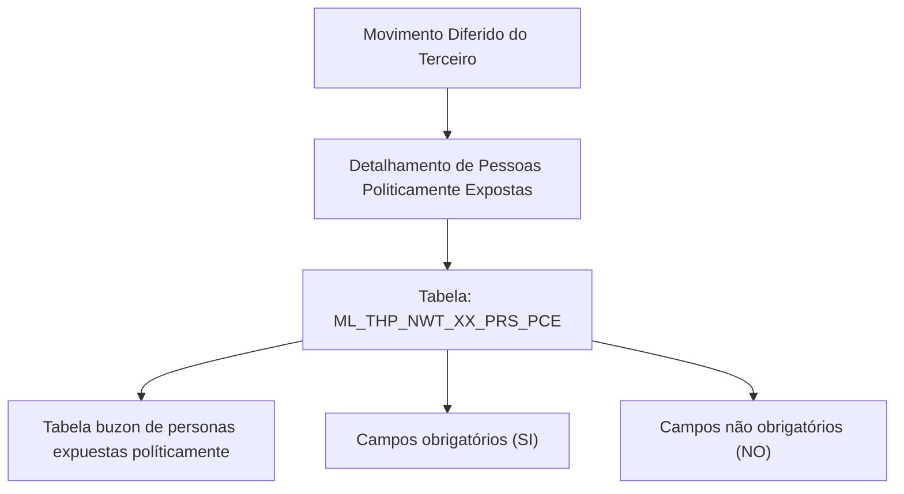

# Detalhamento de Pessoas Politicamente Expostas no Movimento Diferido do Terceiro — Visão Técnica

## 1. Metadados do Documento
- **Arquivo de Origem:** Não identificado no conteúdo fornecido
- **Tipo de Documento:** Especificação Técnica
- **Domínio / Sistema:** Movimento Diferido do Terceiro; Pessoas Politicamente Expostas
- **Público-Alvo:** Desenvolvedores, Arquitetos e Operação
- **Data/Versão Identificada:** Não identificada

---

## 2. Resumo Executivo & Contexto de Negócio

O documento apresenta uma visão técnica para o detalhamento de informações de Pessoas Politicamente Expostas no contexto do processo denominado **Movimento Diferido do Terceiro**. O foco explícito é o modelo de dados envolvido nessa operação.

A operação utiliza a tabela `ML_THP_NWT_XX_PRS_PCE`, descrita no conteúdo como uma **tabela buzon de personas expuestas políticamente**. O documento lista as colunas da tabela, a indicação literal de alteração de valor, a obrigatoriedade e anotações associadas a cada campo.

A especificação fornecida não descreve interfaces, métodos HTTP, contratos JSON, regras de cálculo, serviços consumidores, eventos, integrações externas ou sequência operacional completa. O conteúdo concentra-se exclusivamente na estrutura de dados e nos atributos de obrigatoriedade apresentados.

O material permite identificar os campos mandatórios e não mandatórios conforme os valores literais `SI` e `NO`, mas não define formalmente o significado de `S`, `N.A.` ou das abreviações fragmentadas na coluna de motivo/valor.

---

## 3. Arquitetura, Componentes & Tecnologias Envolvidas

O único componente técnico explicitamente identificado é a tabela `ML_THP_NWT_XX_PRS_PCE`. Nenhuma tecnologia de persistência, aplicação, microsserviço, API, ambiente, servidor ou ferramenta de integração é detalhada.



### Componentes identificados

| Componente | Tipo | Descrição sustentada pelo documento |
| :--- | :--- | :--- |
| Movimento Diferido do Terceiro | Processo / contexto operacional | Contexto no qual ocorre o detalhamento de informações de Pessoas Politicamente Expostas. |
| Pessoas Politicamente Expostas | Domínio de dados | Entidade ou conjunto de informações tratado pela operação. |
| `ML_THP_NWT_XX_PRS_PCE` | Tabela | Tabela que intervém na operação; descrita como tabela buzon de personas expuestas políticamente. |
| Home Solutions APIs Documentation Zeus | Referência textual | Texto exibido na extração bruta, sem detalhamento de função, tecnologia, URL ou integração. |

> **Nota de Análise:** O documento não detalha relacionamentos com outras tabelas, nem os tipos físicos das colunas, chaves, índices, mecanismos de carga ou contratos de integração.

---

## 4. Regras de Negócio, Especificações Funcionais & Processos

### 4.1 Escopo funcional identificado

1. O documento trata do detalhamento de informações de Pessoas Politicamente Expostas.
2. O contexto funcional é o Movimento Diferido do Terceiro.
3. A tabela envolvida na operação é `ML_THP_NWT_XX_PRS_PCE`.
4. A tabela é descrita como uma tabela buzon de personas expuestas políticamente.
5. Todas as colunas apresentadas possuem valor `S` na coluna textual `CAMBIA VALOR`.
6. A obrigatoriedade é indicada literalmente como `SI` ou `NO`.
7. A coluna textual de motivo/valor aparece como `N.A.` para os campos listados.
8. Algumas descrições complementares foram extraídas em fragmentos de linha e não podem ser expandidas sem extrapolar o conteúdo original.

### 4.2 Campos obrigatórios

Os seguintes campos estão marcados como obrigatórios com o valor literal `SI`:

- `BTC_IDN_VAL`
- `SQN_VAL`
- `CMP_VAL`
- `THP_DCM_TYP_VAL`
- `THP_DCM_VAL`
- `VLD_DAT`
- `FML_CBR`
- `DSB_ROW`
- `USR_VAL`
- `MDF_DAT`

### 4.3 Campos não obrigatórios

Os seguintes campos estão marcados como não obrigatórios com o valor literal `NO`:

- `PRC_THD_VAL`
- `PRC_STS_VAL`
- `PCE_PST_RLN_VAL`
- `PRS_PCE_RGS_DAT`
- `PRS_PCE_RMV_DAT`
- `PRS_PCE_RLT_DCM_TYP_VAL`
- `PRS_PCE_RLT_DCM_VAL`
- `ACN_ORG_VAL`
- `ERR_IDN_VAL`

> **Nota de Análise:** Não há definição no documento para os nomes técnicos dos campos, tampouco para as abreviações usadas. Por exemplo, o documento lista `THP_DCM_TYP_VAL`, mas não detalha o tipo de documento aceito, regras de validação ou domínio de valores.

---

## 5. Tabelas de Parâmetros, Ambientes e Estruturas de Dados

### 5.1 Estrutura de dados da tabela `ML_THP_NWT_XX_PRS_PCE`

| Item / Parâmetro | Descrição / Função | Tipo / Valores / Formato | Ambiente / Observações |
| :--- | :--- | :--- | :--- |
| `ML_THP_NWT_XX_PRS_PCE` | Tabela que intervém na operação; descrita como tabela buzon de personas expuestas políticamente. | Não informado | Não informado |
| `BTC_IDN_VAL` | Anotação extraída em fragmento: `IDE`. | Cambia valor: `S`; Motivo/valor: `N.A.`; Obrigatória: `SI` | O significado de `IDE` não é detalhado. |
| `SQN_VAL` | Anotação extraída em fragmento: `SE`. | Cambia valor: `S`; Motivo/valor: `N.A.`; Obrigatória: `SI` | Descrição completa não identificada. |
| `CMP_VAL` | Anotação extraída em fragmentos: `CO` / `CF`. | Cambia valor: `S`; Motivo/valor: `N.A.`; Obrigatória: `SI` | Descrição completa não identificada. |
| `THP_DCM_TYP_VAL` | Anotação extraída em fragmentos: `TIP` / `DO` / `TE`. | Cambia valor: `S`; Motivo/valor: `N.A.`; Obrigatória: `SI` | Descrição completa não identificada. |
| `THP_DCM_VAL` | Anotação extraída em fragmentos: `DO` / `TE`. | Cambia valor: `S`; Motivo/valor: `N.A.`; Obrigatória: `SI` | Descrição completa não identificada. |
| `VLD_DAT` | Anotação extraída em fragmento: `FE`. | Cambia valor: `S`; Motivo/valor: `N.A.`; Obrigatória: `SI` | Descrição completa não identificada. |
| `PRC_THD_VAL` | Anotação extraída em fragmento: `HIL`. | Cambia valor: `S`; Motivo/valor: `N.A.`; Obrigatória: `NO` | Descrição completa não identificada. |
| `PRC_STS_VAL` | Anotação extraída em fragmentos: `SIT` / `PR`. | Cambia valor: `S`; Motivo/valor: `N.A.`; Obrigatória: `NO` | Descrição completa não identificada. |
| `PCE_PST_RLN_VAL` | Anotação extraída em fragmentos: `CO` / `CA` / `PE`. | Cambia valor: `S`; Motivo/valor: `N.A.`; Obrigatória: `NO` | Descrição completa não identificada. |
| `FML_CBR` | Anotação extraída em fragmentos: `IND` / `FAM` / `ES` / `CO`. | Cambia valor: `S`; Motivo/valor: `N.A.`; Obrigatória: `SI` | Descrição completa não identificada. |
| `PRS_PCE_RGS_DAT` | Anotação extraída em fragmentos: `FE` / `CO` / `EX` / `PO`. | Cambia valor: `S`; Motivo/valor: `N.A.`; Obrigatória: `NO` | Descrição completa não identificada. |
| `PRS_PCE_RMV_DAT` | Anotação extraída em fragmentos: `FE` / `CO` / `EX` / `PO`. | Cambia valor: `S`; Motivo/valor: `N.A.`; Obrigatória: `NO` | Descrição completa não identificada. |
| `PRS_PCE_RLT_DCM_TYP_VAL` | Anotação extraída em fragmentos: `TIP` / `DO` / `RE` / `PE`. | Cambia valor: `S`; Motivo/valor: `N.A.`; Obrigatória: `NO` | Descrição completa não identificada. |
| `PRS_PCE_RLT_DCM_VAL` | Anotação extraída em fragmentos: `CO` / `DO` / `RE` / `PE`. | Cambia valor: `S`; Motivo/valor: `N.A.`; Obrigatória: `NO` | Descrição completa não identificada. |
| `DSB_ROW` | Anotação extraída em fragmentos: `FIL` / `DE`. | Cambia valor: `S`; Motivo/valor: `N.A.`; Obrigatória: `SI` | Descrição completa não identificada. |
| `USR_VAL` | Anotação extraída em fragmentos: `US` / `AC` / `FIL`. | Cambia valor: `S`; Motivo/valor: `N.A.`; Obrigatória: `SI` | Descrição completa não identificada. |
| `MDF_DAT` | Anotação extraída em fragmentos: `FE` / `MO`. | Cambia valor: `S`; Motivo/valor: `N.A.`; Obrigatória: `SI` | Descrição completa não identificada. |
| `ACN_ORG_VAL` | Anotação extraída em fragmento: `AC`. | Cambia valor: `S`; Motivo/valor: `N.A.`; Obrigatória: `NO` | Descrição completa não identificada. |
| `ERR_IDN_VAL` | Anotação extraída em fragmentos: `IDE` / `INT` / `ER`. | Cambia valor: `S`; Motivo/valor: `N.A.`; Obrigatória: `NO` | Descrição completa não identificada. |

### 5.2 Ambientes, URLs e rotas operacionais

| Item / Parâmetro | Descrição / Função | Tipo / Valores / Formato | Ambiente / Observações |
| :--- | :--- | :--- | :--- |
| Ambientes | Não informados | Não aplicável | O documento não identifica ambientes de desenvolvimento, homologação ou produção. |
| URLs | Não informadas | Não aplicável | Não há URLs no conteúdo fornecido. |
| Rotas de logs | Não informadas | Não aplicável | Não há caminhos, arquivos ou plataformas de logs identificados. |
| APIs | Apenas a referência textual `Home Solutions APIs Documentation Zeus` | Não informado | Não há endpoint, método HTTP, autenticação ou contrato informado. |

---

## 6. Bateria de Perguntas & Respostas para RAG (FAQ Sintético)

### P1: Qual tabela participa da operação de detalhamento de Pessoas Politicamente Expostas?
**R:** A tabela identificada no documento é `ML_THP_NWT_XX_PRS_PCE`. O conteúdo a descreve como uma tabela buzon de personas expuestas políticamente.

### P2: Qual é o contexto funcional da tabela `ML_THP_NWT_XX_PRS_PCE`?
**R:** A tabela `ML_THP_NWT_XX_PRS_PCE` intervém na operação de detalhamento de informações de Pessoas Politicamente Expostas no contexto do Movimento Diferido do Terceiro.

### P3: Quais campos da tabela estão marcados como obrigatórios?
**R:** Os campos marcados com obrigatoriedade literal `SI` são `BTC_IDN_VAL`, `SQN_VAL`, `CMP_VAL`, `THP_DCM_TYP_VAL`, `THP_DCM_VAL`, `VLD_DAT`, `FML_CBR`, `DSB_ROW`, `USR_VAL` e `MDF_DAT`.

### P4: Quais campos da tabela estão marcados como não obrigatórios?
**R:** Os campos marcados com obrigatoriedade literal `NO` são `PRC_THD_VAL`, `PRC_STS_VAL`, `PCE_PST_RLN_VAL`, `PRS_PCE_RGS_DAT`, `PRS_PCE_RMV_DAT`, `PRS_PCE_RLT_DCM_TYP_VAL`, `PRS_PCE_RLT_DCM_VAL`, `ACN_ORG_VAL` e `ERR_IDN_VAL`.

### P5: O campo `THP_DCM_TYP_VAL` é obrigatório?
**R:** Sim. O campo `THP_DCM_TYP_VAL` está marcado com `SI` na coluna de obrigatoriedade. A descrição complementar foi extraída apenas de forma fragmentada como `TIP`, `DO` e `TE`.

### P6: O campo `PRS_PCE_RLT_DCM_VAL` é obrigatório?
**R:** Não. O campo `PRS_PCE_RLT_DCM_VAL` está marcado com `NO` na coluna de obrigatoriedade. O documento não fornece a definição integral do campo.

### P7: O documento define o tipo de dado ou formato dos campos da tabela?
**R:** Não. O documento lista nomes de colunas, indicação literal `S` para mudança de valor, `N.A.` para motivo/valor e a obrigatoriedade `SI` ou `NO`, mas não informa tipos físicos, tamanhos, formatos ou domínios de valores.

### P8: O documento especifica endpoints ou métodos HTTP para integração com APIs?
**R:** Não. Embora a extração contenha o texto `Home Solutions APIs Documentation Zeus`, não há endpoints, métodos HTTP, URLs, contratos JSON, credenciais ou mecanismos de integração descritos.

### P9: O campo `FML_CBR` deve ser informado?
**R:** Sim. O campo `FML_CBR` está marcado como obrigatório com o valor literal `SI`. A anotação associada foi extraída em fragmentos como `IND`, `FAM`, `ES` e `CO`, sem definição completa.

### P10: O documento descreve o fluxo completo de processamento do Movimento Diferido do Terceiro?
**R:** Não. O conteúdo fornecido identifica o contexto do Movimento Diferido do Terceiro e a tabela envolvida, mas não apresenta etapas de processamento, eventos, sistemas chamadores, sistemas consumidores, regras de transição ou tratamento de exceções.

---

## 7. Glossário de Termos, Siglas & Conceitos-Chave

- **Pessoas Politicamente Expostas:** Domínio de informação citado no título do documento. Não há definição funcional adicional no conteúdo fornecido.
- **Movimento Diferido do Terceiro:** Contexto operacional no qual ocorre o detalhamento das informações. O processo não é descrito em etapas.
- **`ML_THP_NWT_XX_PRS_PCE`:** Tabela envolvida na operação, descrita como tabela buzon de personas expuestas políticamente.
- **PCE:** Sigla presente em nomes de campos como `PCE_PST_RLN_VAL` e `PRS_PCE_RGS_DAT`; o documento não expande formalmente a sigla.
- **`SI` / `NO`:** Valores literais apresentados na coluna de obrigatoriedade.
- **`S`:** Valor literal apresentado para todos os campos na coluna `CAMBIA VALOR`; o documento não define formalmente seu significado.
- **`N.A.`:** Valor literal apresentado na coluna de motivo/valor; o documento não define formalmente seu significado.
- **`VAL`:** Sufixo recorrente nos nomes técnicos das colunas; sem expansão formal no conteúdo.
- **`DAT`:** Sufixo recorrente em colunas como `VLD_DAT`, `PRS_PCE_RGS_DAT`, `PRS_PCE_RMV_DAT` e `MDF_DAT`; sem expansão formal no conteúdo.
- **`DCM`:** Sigla presente em `THP_DCM_TYP_VAL`, `THP_DCM_VAL`, `PRS_PCE_RLT_DCM_TYP_VAL` e `PRS_PCE_RLT_DCM_VAL`; sem expansão formal no conteúdo.

---

## 8. Notas Críticas, Riscos & Limitações

- O documento não identifica arquivo de origem, autor, data, versão, ambiente ou sistema proprietário.
- As descrições associadas às colunas estão parcialmente fragmentadas devido à extração de texto e não devem ser interpretadas como definições completas.
- Não há tipos de dados, tamanhos, restrições de banco, chaves primárias, chaves estrangeiras, índices ou relacionamentos entre tabelas.
- Não há regras de validação além dos indicadores literais de obrigatoriedade `SI` e `NO`.
- Não há especificação de APIs, métodos HTTP, payloads, códigos de resposta, autenticação ou tratamento de erros.
- Não há informações sobre rastreabilidade, auditoria, logs, monitoramento ou procedimentos de suporte.
- Não há detalhamento do significado de `S`, `N.A.` ou das abreviações dos campos; qualquer expansão desses termos seria especulativa.
- A referência `Home Solutions APIs Documentation Zeus` não possui explicação contextual no material extraído.

---

## 9. Conteúdo Bruto Estruturado (Referência Fiel)

```text
--- [PÁGINA 1 DE 3] ---

DETALLAR Información de Personas
Políticamente Expuestas en el Movimiento
Diferido del Tercero (Visión Técnica)
Modelo de datos involucrado
La tabla que interviene en esta operación es:
TABLA DESCRIPCIÓN
ML_THP_NWT_XX_PRS_PCE TABLA BUZON DE PERSONAS EXPUESTAS
POLITICAMENTE
COLUMNA CAMBIA
VALOR
MOTIVO/VALOR OBLIGATORIA CO
BTC_IDN_VAL S N.A. SI IDE
SQN_VAL S N.A. SI SE
CMP_VAL S N.A. SI CO
 /
 CF
Home Solutions APIs Documentation Zeus
EN


--- [PÁGINA 2 DE 3] ---

COLUMNA CAMBIA
VALOR
MOTIVO/VALOR OBLIGATORIA CO
THP_DCM_TYP_VAL S N.A. SI TIP
DO
TE
THP_DCM_VAL S N.A. SI DO
TE
VLD_DAT S N.A. SI FE
PRC_THD_VAL S N.A. NO HIL
PRC_STS_VAL S N.A. NO SIT
PR
PCE_PST_RLN_VAL S N.A. NO CO
CA
PE
FML_CBR S N.A. SI IND
FAM
ES
CO
PRS_PCE_RGS_DAT S N.A. NO FE
CO
EX
PO
PRS_PCE_RMV_DAT S N.A. NO FE
CO
EX
PO
PRS_PCE_RLT_DCM_TYP_VAL S N.A. NO TIP
DO
RE
PE


--- [PÁGINA 3 DE 3] ---

COLUMNA CAMBIA
VALOR
MOTIVO/VALOR OBLIGATORIA CO
PRS_PCE_RLT_DCM_VAL S N.A. NO CO
DO
RE
PE
DSB_ROW S N.A. SI FIL
DE
USR_VAL S N.A. SI US
AC
FIL
MDF_DAT S N.A. SI FE
MO
ACN_ORG_VAL S N.A. NO AC
ERR_IDN_VAL S N.A. NO IDE
INT
ER
```
