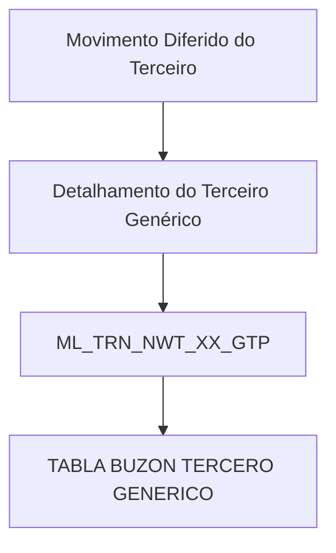
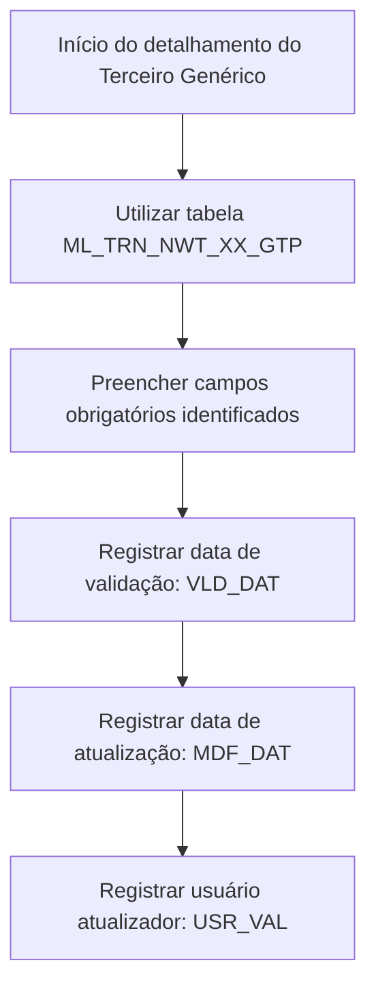

# Detalhamento de Informação do Terceiro Genérico no Movimento Diferido do Terceiro — Visão Técnica

## 1. Metadados do Documento
- **Arquivo de Origem:** Não identificado
- **Tipo de Documento:** Especificação Técnica
- **Domínio / Sistema:** Movimento Diferido do Terceiro / Terceiro Genérico
- **Público-Alvo:** Desenvolvedores, Arquitetos e Analistas Funcionais
- **Data/Versão Identificada:** Não identificada

---

## 2. Resumo Executivo & Contexto de Negócio

O documento descreve, sob uma visão técnica, o detalhamento de informações do **Terceiro Genérico** no contexto do **Movimento Diferido do Terceiro**. A especificação identifica a estrutura de dados envolvida e relaciona os campos que compõem o registro tratado.

A tabela indicada para a operação é `ML_TRN_NWT_XX_GTP`, descrita no conteúdo como **TABLA BUZON TERCERO GENERICO**. O documento apresenta atributos técnicos dessa tabela, indicando que os campos sofrem alteração de valor (`S`), possuem motivo/valor indicado como `N.A.` e possuem uma classificação de obrigatoriedade.

Os campos obrigatórios identificados são relacionados à identificação, sequência, companhia, documento, atividade do terceiro, data de validação, data de atualização e usuário que atualizou a linha. Os demais campos aparecem como não obrigatórios no material fornecido.

O conteúdo não descreve métodos HTTP, APIs, contratos JSON, regras de persistência, origem dos valores, mecanismo de integração, regras de cálculo ou validações adicionais. A informação disponível limita-se à tabela e ao catálogo parcial de colunas, descrições e obrigatoriedade.

---

## 3. Arquitetura, Componentes & Tecnologias Envolvidas

### Componentes identificados

| Componente | Tipo | Descrição sustentada pelo documento |
| :--- | :--- | :--- |
| Movimento Diferido do Terceiro | Processo / contexto funcional | Contexto no qual ocorre o detalhamento da informação do Terceiro Genérico. |
| Terceiro Genérico | Entidade de domínio | Entidade cujas informações são detalhadas no movimento diferido. |
| `ML_TRN_NWT_XX_GTP` | Tabela de dados | Identificada como `TABLA BUZON TERCERO GENERICO`. |
| Soluciones | Navegação / portal citado | Aparece no rodapé da primeira página. Não há detalhamento adicional. |
| APIs | Navegação / portal citado | Aparece no rodapé da primeira página. Não há APIs, endpoints ou contratos descritos. |
| Documentación | Navegação / portal citado | Aparece no rodapé da primeira página. |
| Zeus | Navegação / portal citado | Aparece no rodapé da primeira página. Não há detalhamento adicional. |



> *Nota de Análise: O documento identifica somente o contexto funcional, a entidade Terceiro Genérico e a tabela `ML_TRN_NWT_XX_GTP`. Não há descrição de camadas de aplicação, microsserviços, banco de dados específico, tecnologias, URLs, integrações ou fluxos de dados adicionais.*

---

## 4. Regras de Negócio, Especificações Funcionais & Processos

### Regras explícitas extraídas

1. A operação de detalhamento da informação do Terceiro Genérico no Movimento Diferido do Terceiro envolve a tabela `ML_TRN_NWT_XX_GTP`.
2. A tabela `ML_TRN_NWT_XX_GTP` é descrita como `TABLA BUZON TERCERO GENERICO`.
3. Todos os campos apresentados possuem o indicador `CAMBIA VALOR` igual a `S`.
4. Todos os campos apresentados possuem `MOTIVO/VALOR` igual a `N.A.`.
5. Os campos explicitamente marcados como obrigatórios são:
   - `IDN_VAL`
   - `IDN_SQN`
   - `CMP_VAL`
   - `THP_DCM_TYP_VAL`
   - `THP_DCM_VAL`
   - `THP_ACV_VAL`
   - `VLD_DAT`
   - `MDF_DAT`
   - `USR_VAL`
6. Os demais campos listados são marcados como não obrigatórios.
7. Não foram fornecidos formatos, domínios de valores, tipos físicos, regras de preenchimento, valores padrão ou condições de dependência entre campos.

### Fluxo lógico mínimo suportado pelo material



> *Nota de Análise: O fluxo acima representa apenas a sequência lógica inferível a partir da existência de campos obrigatórios e de atualização. O documento não descreve a ordem operacional real, responsáveis, eventos disparadores ou critérios de aprovação.*

---

## 5. Tabelas de Parâmetros, Ambientes e Estruturas de Dados

### Tabela envolvida

| Item / Parâmetro | Descrição / Função | Tipo / Valores / Formato | Ambiente / Observações |
| :--- | :--- | :--- | :--- |
| `ML_TRN_NWT_XX_GTP` | Tabela envolvida na operação. | Descrita como `TABLA BUZON TERCERO GENERICO`. | O documento não identifica ambiente, banco de dados ou esquema. |

### Campos da tabela `ML_TRN_NWT_XX_GTP`

| Item / Parâmetro | Descrição / Função | Tipo / Valores / Formato | Ambiente / Observações |
| :--- | :--- | :--- | :--- |
| `IDN_VAL` | Identificado. | Cambia valor: `S`; Motivo/valor: `N.A.` | Obrigatória: Sim. |
| `IDN_SQN` | Sequência dentro do identificado. | Cambia valor: `S`; Motivo/valor: `N.A.` | Obrigatória: Sim. |
| `PRC_THD_VAL` | Hilo / RS. | Cambia valor: `S`; Motivo/valor: `N.A.` | Obrigatória: Não. A descrição está fragmentada no texto extraído. |
| `PRC_STS_VAL` | Situación de proceso. | Cambia valor: `S`; Motivo/valor: `N.A.` | Obrigatória: Não. |
| `CMP_VAL` | Compañía. | Cambia valor: `S`; Motivo/valor: `N.A.` | Obrigatória: Sim. |
| `THP_DCM_TYP_VAL` | Tipo de documento do terceiro. | Cambia valor: `S`; Motivo/valor: `N.A.` | Obrigatória: Sim. |
| `THP_DCM_VAL` | Código de documento do terceiro. | Cambia valor: `S`; Motivo/valor: `N.A.` | Obrigatória: Sim. |
| `THP_ACV_VAL` | Atividade do terceiro. | Cambia valor: `S`; Motivo/valor: `N.A.` | Obrigatória: Sim. |
| `THP_VAL` | Código de terceiro. | Cambia valor: `S`; Motivo/valor: `N.A.` | Obrigatória: Não. |
| `THR_LVL_VAL` | Terceiro nível. | Cambia valor: `S`; Motivo/valor: `N.A.` | Obrigatória: Não. |
| `THP_QLT_VAL` | Qualidade. | Cambia valor: `S`; Motivo/valor: `N.A.` | Obrigatória: Não. |
| `MTC_VAL` | Compensação. | Cambia valor: `S`; Motivo/valor: `N.A.` | Obrigatória: Não. |
| `THP_GRG_VAL` | Agrupação. | Cambia valor: `S`; Motivo/valor: `N.A.` | Obrigatória: Não. |
| `THP_OBS_VAL` | Observação. | Cambia valor: `S`; Motivo/valor: `N.A.` | Obrigatória: Não. |
| `RTN_TYP_VAL` | Retenção. | Cambia valor: `S`; Motivo/valor: `N.A.` | Obrigatória: Não. |
| `VLD_DAT` | Data de validação. | Cambia valor: `S`; Motivo/valor: `N.A.` | Obrigatória: Sim. |
| `DSB_ROW` | Inabilitado. | Cambia valor: `S`; Motivo/valor: `N.A.` | Obrigatória: Não. |
| `BNF_CSS_VAL` | Classe de beneficiário. | Cambia valor: `S`; Motivo/valor: `N.A.` | Obrigatória: Não. |
| `ASC_THP_VAL` | Colegiado. | Cambia valor: `S`; Motivo/valor: `N.A.` | Obrigatória: Não. |
| `THP_DSC_VAL` | Causa de inabilitação. | Cambia valor: `S`; Motivo/valor: `N.A.` | Obrigatória: Não. |
| `TAX_IDT_VAL` | Identificação fiscal. | Cambia valor: `S`; Motivo/valor: `N.A.` | Obrigatória: Não. |
| `TAX_THP_TYP_VAL` | IVA terceiro. | Cambia valor: `S`; Motivo/valor: `N.A.` | Obrigatória: Não. |
| `MDF_DAT` | Data de atualização. | Cambia valor: `S`; Motivo/valor: `N.A.` | Obrigatória: Sim. |
| `ACN_ORG_VAL` | Ação origem. | Cambia valor: `S`; Motivo/valor: `N.A.` | Obrigatória: Não. |
| `TYL_VAL` | Tipologia. | Cambia valor: `S`; Motivo/valor: `N.A.` | Obrigatória: Não. |
| `SPL_CTG_VAL` | Categoria de provedor. | Cambia valor: `S`; Motivo/valor: `N.A.` | Obrigatória: Não. |
| `SPL_STT_TYP_VAL` | Tipo de estado de provedor. | Cambia valor: `S`; Motivo/valor: `N.A.` | Obrigatória: Não. |
| `CTR_VAL` | Identificação de contrato. | Cambia valor: `S`; Motivo/valor: `N.A.` | Obrigatória: Não. |
| `INL_CTR_DAT` | Data de início de vigência do contrato. | Cambia valor: `S`; Motivo/valor: `N.A.` | Obrigatória: Não. |
| `FNL_CTR_DAT` | Data de fim de vigência do contrato. | Cambia valor: `S`; Motivo/valor: `N.A.` | Obrigatória: Não. |
| `LNG_VAL` | Idioma. | Cambia valor: `S`; Motivo/valor: `N.A.` | Obrigatória: Não. |
| `USR_VAL` | Usuário que atualizou a fila. | Cambia valor: `S`; Motivo/valor: `N.A.` | Obrigatória: Sim. |

### Campos obrigatórios

| Item / Parâmetro | Descrição / Função | Tipo / Valores / Formato | Ambiente / Observações |
| :--- | :--- | :--- | :--- |
| `IDN_VAL` | Identificado. | Obrigatório: Sim. | Sem formato informado. |
| `IDN_SQN` | Sequência dentro do identificado. | Obrigatório: Sim. | Sem formato informado. |
| `CMP_VAL` | Compañía. | Obrigatório: Sim. | Sem domínio de valores informado. |
| `THP_DCM_TYP_VAL` | Tipo de documento do terceiro. | Obrigatório: Sim. | Sem tipos permitidos informados. |
| `THP_DCM_VAL` | Código de documento do terceiro. | Obrigatório: Sim. | Sem formato informado. |
| `THP_ACV_VAL` | Atividade do terceiro. | Obrigatório: Sim. | Sem catálogo de atividades informado. |
| `VLD_DAT` | Data de validação. | Obrigatório: Sim. | Sem formato de data informado. |
| `MDF_DAT` | Data de atualização. | Obrigatório: Sim. | Sem formato de data informado. |
| `USR_VAL` | Usuário que atualizou a fila. | Obrigatório: Sim. | Sem formato ou origem do usuário informado. |

---

## 6. Bateria de Perguntas & Respostas para RAG (FAQ Sintético)

### P1: Qual tabela é utilizada para detalhar o Terceiro Genérico no Movimento Diferido do Terceiro?
**R:** A tabela utilizada é `ML_TRN_NWT_XX_GTP`, descrita no documento como `TABLA BUZON TERCERO GENERICO`.

### P2: Quais campos obrigatórios devem ser considerados na tabela `ML_TRN_NWT_XX_GTP`?
**R:** Os campos marcados como obrigatórios são `IDN_VAL`, `IDN_SQN`, `CMP_VAL`, `THP_DCM_TYP_VAL`, `THP_DCM_VAL`, `THP_ACV_VAL`, `VLD_DAT`, `MDF_DAT` e `USR_VAL`.

### P3: Qual campo armazena o tipo de documento do terceiro?
**R:** O campo `THP_DCM_TYP_VAL` é descrito como o tipo de documento do terceiro e é obrigatório.

### P4: Qual campo armazena o código de documento do terceiro?
**R:** O campo `THP_DCM_VAL` é descrito como o código de documento do terceiro e é obrigatório.

### P5: Qual campo corresponde à atividade do terceiro?
**R:** O campo `THP_ACV_VAL` corresponde à atividade do terceiro. O documento marca esse campo como obrigatório.

### P6: Qual campo registra a data de validação?
**R:** O campo `VLD_DAT` registra a data de validação. O documento o classifica como obrigatório, mas não informa o formato da data.

### P7: Qual campo registra a data de atualização do registro?
**R:** O campo `MDF_DAT` é descrito como data de atualização e é obrigatório.

### P8: Qual campo identifica o usuário que atualizou a fila?
**R:** O campo `USR_VAL` é descrito como o usuário que atualizou a fila e é obrigatório.

### P9: O campo de identificação fiscal é obrigatório?
**R:** Não. O campo `TAX_IDT_VAL`, descrito como identificação fiscal, está marcado como não obrigatório.

### P10: Quais campos tratam de vigência de contrato?
**R:** Os campos `INL_CTR_DAT` e `FNL_CTR_DAT` correspondem, respectivamente, à data de início e à data de fim da vigência do contrato. Ambos são marcados como não obrigatórios.

### P11: O documento informa os tipos físicos ou formatos dos campos?
**R:** Não. O documento apresenta colunas, descrições, indicador de alteração de valor, motivo/valor e obrigatoriedade, mas não especifica tipos físicos, tamanhos, formatos ou domínios de valores.

### P12: O documento descreve APIs, métodos HTTP ou contratos JSON para a operação?
**R:** Não. Embora o termo “APIs” apareça no rodapé da primeira página, o material não apresenta endpoints, métodos HTTP, payloads JSON, contratos de integração ou mecanismos de autenticação.

---

## 7. Glossário de Termos, Siglas & Conceitos-Chave

- **Terceiro Genérico:** Entidade de domínio tratada no contexto do documento.
- **Movimento Diferido do Terceiro:** Contexto funcional no qual ocorre o detalhamento da informação do Terceiro Genérico.
- **`ML_TRN_NWT_XX_GTP`:** Tabela envolvida na operação, descrita como `TABLA BUZON TERCERO GENERICO`.
- **`IDN_VAL`:** Campo descrito como identificado.
- **`IDN_SQN`:** Campo descrito como sequência dentro do identificado.
- **`CMP_VAL`:** Campo descrito como companhia.
- **`THP_DCM_TYP_VAL`:** Campo de tipo de documento do terceiro.
- **`THP_DCM_VAL`:** Campo de código de documento do terceiro.
- **`THP_ACV_VAL`:** Campo de atividade do terceiro.
- **`THP_VAL`:** Campo de código de terceiro.
- **`THR_LVL_VAL`:** Campo de terceiro nível.
- **`THP_QLT_VAL`:** Campo de qualidade.
- **`MTC_VAL`:** Campo de compensação.
- **`THP_GRG_VAL`:** Campo de agrupação.
- **`THP_OBS_VAL`:** Campo de observação.
- **`RTN_TYP_VAL`:** Campo de retenção.
- **`VLD_DAT`:** Campo de data de validação.
- **`DSB_ROW`:** Campo de inabilitado.
- **`BNF_CSS_VAL`:** Campo de classe de beneficiário.
- **`ASC_THP_VAL`:** Campo de colegiado.
- **`THP_DSC_VAL`:** Campo de causa de inabilitação.
- **`TAX_IDT_VAL`:** Campo de identificação fiscal.
- **`TAX_THP_TYP_VAL`:** Campo de IVA terceiro.
- **`MDF_DAT`:** Campo de data de atualização.
- **`ACN_ORG_VAL`:** Campo de ação origem.
- **`TYL_VAL`:** Campo de tipologia.
- **`SPL_CTG_VAL`:** Campo de categoria de provedor.
- **`SPL_STT_TYP_VAL`:** Campo de tipo de estado de provedor.
- **`CTR_VAL`:** Campo de identificação de contrato.
- **`INL_CTR_DAT`:** Campo de data de início de vigência de contrato.
- **`FNL_CTR_DAT`:** Campo de data de fim de vigência de contrato.
- **`LNG_VAL`:** Campo de idioma.
- **`USR_VAL`:** Campo de usuário que atualizou a fila.
- **`S`:** Valor apresentado na coluna `CAMBIA VALOR` para todos os campos extraídos.
- **`N.A.`:** Valor apresentado na coluna `MOTIVO/VALOR` para todos os campos extraídos.

---

## 8. Notas Críticas, Riscos & Limitações

- O nome do arquivo de origem, a versão e a data do documento não foram identificados no conteúdo fornecido.
- A extração apresenta palavras fragmentadas ou truncadas, incluindo descrições como `HILO / RS`, `SITUACION D PROCESO`, `CAUSA INHABILITACI` e `USUARIO QU ACTUALIZO L FILA`.
- O documento não informa tipo de dado, tamanho, formato, domínio de valores, chave primária, índices, chaves estrangeiras ou relacionamento entre tabelas.
- O documento não detalha a origem dos valores dos campos, nem os sistemas que os produzem ou consomem.
- Não há endpoints, contratos de API, métodos HTTP, mecanismos de autenticação, mensagens de erro ou regras de integração.
- Não há definição explícita para siglas técnicas presentes nos nomes dos campos.
- Não há descrição de regras condicionais, validações de consistência, tratamento de exceções ou políticas de atualização.
- A indicação `CAMBIA VALOR = S` é apresentada para todos os campos, mas o significado operacional desse indicador não é definido no documento.
- A indicação `MOTIVO/VALOR = N.A.` é apresentada para todos os campos, mas o documento não esclarece como esse atributo é utilizado.
- O documento lista o contexto de APIs no rodapé, porém não detalha nenhuma API associada à tabela `ML_TRN_NWT_XX_GTP`.

---

## 9. Conteúdo Bruto Estruturado (Referência Fiel)

```text
--- [PÁGINA 1 DE 4] ---

DETALLAR Información del Tercero Genérico
en el Movimiento Diferido del Tercero (Visión
Técnica)
Modelo de datos involucrado
La tabla que interviene en esta operación es:
TABLA DESCRIPCIÓN
ML_TRN_NWT_XX_GTP TABLA BUZON TERCERO GENERICO
COLUMNA CAMBIA
VALOR
MOTIVO/VALOR OBLIGATORIA COMENTARIO
IDN_VAL S N.A. SI IDENTIFICADO
IDN_SQN S N.A. SI SECUENCIA
DENTRO DEL
IDENTIFICADO
PRC_THD_VAL S N.A. NO HILO
 / 
 RS
Inicio Soluciones APIs Documentación Zeus
ES


--- [PÁGINA 2 DE 4] ---

COLUMNA CAMBIA
VALOR
MOTIVO/VALOR OBLIGATORIA COMENTARIO
PRC_STS_VAL S N.A. NO SITUACION D
PROCESO
CMP_VAL S N.A. SI COMPAIA
THP_DCM_TYP_VAL S N.A. SI TIPO DE
COCUMENTO
DEL TERCERO
THP_DCM_VAL S N.A. SI CODIGO DE
DOCUMENTO
DEL TERCERO
THP_ACV_VAL S N.A. SI ACTIVIDAD D
TERCERO
THP_VAL S N.A. NO CODIGO DE
TERCERO
THR_LVL_VAL S N.A. NO TERCER NIVE
THP_QLT_VAL S N.A. NO CALIDAD
MTC_VAL S N.A. NO COMPENSAC
THP_GRG_VAL S N.A. NO AGRUPACION
THP_OBS_VAL S N.A. NO OBSERVACIO
RTN_TYP_VAL S N.A. NO RETENCION
VLD_DAT S N.A. SI FECHA VALID
DSB_ROW S N.A. NO INHABILITADO


--- [PÁGINA 3 DE 4] ---

COLUMNA CAMBIA
VALOR
MOTIVO/VALOR OBLIGATORIA COMENTARIO
BNF_CSS_VAL S N.A. NO CLASE
BENEFICIARIO
ASC_THP_VAL S N.A. NO COLEGIADO
THP_DSC_VAL S N.A. NO CAUSA
INHABILITACI
TAX_IDT_VAL S N.A. NO IDENTIFICAC
FISCAL
TAX_THP_TYP_VAL S N.A. NO IVA TERCERO
MDF_DAT S N.A. SI FECHA
ACTUALIZACI
ACN_ORG_VAL S N.A. NO ACCION ORIG
TYL_VAL S N.A. NO TIPOLOGIA
SPL_CTG_VAL S N.A. NO CATEGORIA D
PROVEEDOR
SPL_STT_TYP_VAL S N.A. NO TIPO ESTADO
PROVEEDOR
CTR_VAL S N.A. NO IDENTIFICAC
CONTRATO
INL_CTR_DAT S N.A. NO FECHA INICIO
VIGENCIA
CONTRATO
FNL_CTR_DAT S N.A. NO FECHA FIN
VIGENCIA
CONTRATO


--- [PÁGINA 4 DE 4] ---

COLUMNA CAMBIA
VALOR
MOTIVO/VALOR OBLIGATORIA COMENTARIO
LNG_VAL S N.A. NO IDIOMA
USR_VAL S N.A. SI USUARIO QU
ACTUALIZO L
FILA
```
