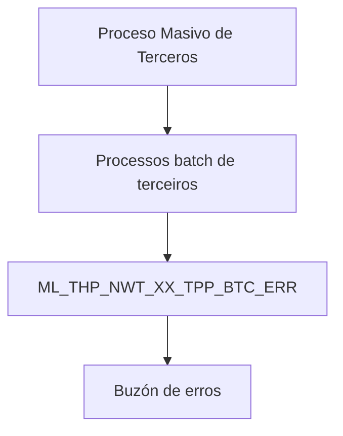

# Revisar Proceso Masivo de Terceros — Visión Técnica y Modelo de Datos

## 1. Metadados do Documento
- **Arquivo de Origem:** Não identificado — conteúdo bruto fornecido na solicitação.
- **Tipo de Documento:** Especificação Técnica.
- **Domínio / Sistema:** Proceso Masivo de Terceros / processos batch de terceiros.
- **Público-Alvo:** Desenvolvedores, Arquitetos e Operação.
- **Data/Versão Identificada:** Não identificada.

---

## 2. Resumo Executivo & Contexto de Negócio

O documento apresenta uma visão técnica para revisão do **Proceso Masivo de Terceros**, com foco exclusivo no modelo de dados envolvido na operação. A tabela identificada como participante da operação é `ML_THP_NWT_XX_TPP_BTC_ERR`, descrita como uma tabela de buzón de erros de processos batch de terceiros.

O conteúdo relaciona colunas da tabela de erros e informa, para todas as colunas listadas, os indicadores `S` em “Cambia valor”, `N.A.` em “Motivo/Valor” e `SI` em “Obligatoria”. Portanto, o material indica que os campos apresentados são obrigatórios no contexto documentado.

As descrições de diversas colunas estão truncadas no conteúdo extraído. O documento permite associar campos a conceitos como companhia, identificação, data de tratamento, número de ordem, hilo, tipo de movimento batch, documento do terceiro, atividade do terceiro, sequenciamento e observação de erro, rota do erro, usuário e data de modificação.

Não há detalhamento de contratos de integração, métodos HTTP, formatos de payload, mecanismos de processamento, políticas de reprocessamento ou tecnologia de persistência além da tabela citada. A documentação também exibe a referência textual “Home Solutions APIs Documentation Zeus”, sem explicação adicional de sua relação com o processo.

---

## 3. Arquitetura, Componentes & Tecnologias Envolvidas

O documento identifica os seguintes elementos técnicos:

- **Proceso Masivo de Terceros:** operação analisada.
- **Processos batch de terceiros:** contexto de execução associado à tabela de erros.
- **`ML_THP_NWT_XX_TPP_BTC_ERR`:** tabela de buzón de erros dos processos batch de terceiros.
- **Home Solutions APIs Documentation Zeus:** referência textual apresentada no documento, sem detalhamento técnico adicional.
- **CF:** termo apresentado junto ao campo `POC_ORD_NBR`, sem definição adicional.



> **Nota de Análise:** O documento não descreve microsserviços, APIs, bancos de dados adicionais, ambientes, protocolos, métodos HTTP ou contratos JSON. O diagrama representa somente a relação explícita entre o processo massivo, os processos batch e a tabela de erros.

---

## 4. Regras de Negócio, Especificações Funcionais & Processos

1. A operação técnica analisada é denominada **Proceso Masivo de Terceros**.
2. A tabela envolvida na operação é `ML_THP_NWT_XX_TPP_BTC_ERR`.
3. A tabela `ML_THP_NWT_XX_TPP_BTC_ERR` é descrita como **TABLA BUZON ERRORES PROCESOS BATCH TERCEROS**.
4. Todas as colunas apresentadas no documento possuem:
   - **Cambia valor:** `S`.
   - **Motivo/Valor:** `N.A.`.
   - **Obligatoria:** `SI`.
5. O documento associa os campos listados a dados de companhia, identificação, datas, ordens, hilo, movimentos batch, documentos de terceiros, atividade de terceiros, erros, rota de erro, usuário e modificação.
6. Não são fornecidas regras para geração de erros, critérios de validação, chaves de negócio, regras de cálculo, retenção da tabela, correção de registros ou reprocessamento de processos batch.
7. Não são descritos os valores aceitos, tamanhos, tipos físicos de dados, índices, chaves primárias, chaves estrangeiras ou nulabilidade técnica das colunas.

---

## 5. Tabelas de Parâmetros, Ambientes e Estruturas de Dados

| Item / Parâmetro | Descrição / Função | Tipo / Valores / Formato | Ambiente / Observações |
| :--- | :--- | :--- | :--- |
| `ML_THP_NWT_XX_TPP_BTC_ERR` | Tabela de buzón de erros de processos batch de terceiros. | Não informado. | Tabela envolvida no Proceso Masivo de Terceros. |
| `CMP_VAL` | `COMPAN` (descrição truncada no conteúdo extraído). | Cambia valor: `S`; Motivo/Valor: `N.A.`; Obrigatória: `SI`. | O tipo de dado não foi informado. |
| `BTC_IDN_VAL` | `IDENTIFIC` (descrição truncada no conteúdo extraído). | Cambia valor: `S`; Motivo/Valor: `N.A.`; Obrigatória: `SI`. | O tipo de dado não foi informado. |
| `POC_DAT` | `FECHA D TRATAM` (descrição truncada no conteúdo extraído). | Cambia valor: `S`; Motivo/Valor: `N.A.`; Obrigatória: `SI`. | O tipo de dado não foi informado. |
| `POC_ORD_NBR` | `NUMERO ORDEN / CF` (descrição truncada no conteúdo extraído). | Cambia valor: `S`; Motivo/Valor: `N.A.`; Obrigatória: `SI`. | O significado de `CF` não foi detalhado. |
| `PRC_THD_VAL` | `HILO`. | Cambia valor: `S`; Motivo/Valor: `N.A.`; Obrigatória: `SI`. | O tipo de dado não foi informado. |
| `BTC_MVM_THP_TYP_VAL` | `TIPO DE MOVIMI BATCH` (descrição truncada no conteúdo extraído). | Cambia valor: `S`; Motivo/Valor: `N.A.`; Obrigatória: `SI`. | Associado ao tipo de movimento batch. |
| `THP_DCM_TYP_VAL` | `TIPO DE DOCUM DEL TER` (descrição truncada no conteúdo extraído). | Cambia valor: `S`; Motivo/Valor: `N.A.`; Obrigatória: `SI`. | Associado ao tipo de documento do terceiro. |
| `THP_DCM_VAL` | `DOCUM DEL TER` (descrição truncada no conteúdo extraído). | Cambia valor: `S`; Motivo/Valor: `N.A.`; Obrigatória: `SI`. | Associado ao documento do terceiro. |
| `THP_ACV_VAL` | `ACTIVID TERCER` (descrição truncada no conteúdo extraído). | Cambia valor: `S`; Motivo/Valor: `N.A.`; Obrigatória: `SI`. | Associado à atividade do terceiro. |
| `ERR_SQN_VAL` | `ERROR SECUEN` (descrição truncada no conteúdo extraído). | Cambia valor: `S`; Motivo/Valor: `N.A.`; Obrigatória: `SI`. | Associado ao sequenciamento de erro. |
| `ERR_IDN_VAL` | `IDENTIF INTERN ERROR` (descrição truncada no conteúdo extraído). | Cambia valor: `S`; Motivo/Valor: `N.A.`; Obrigatória: `SI`. | Associado à identificação interna de erro. |
| `ERR_OBS_VAL` | `OBSERV ERROR` (descrição truncada no conteúdo extraído). | Cambia valor: `S`; Motivo/Valor: `N.A.`; Obrigatória: `SI`. | Associado à observação de erro. |
| `ERR_PTH_TXT_VAL` | `RUTA EN QUE SU EL ERRO` (descrição truncada no conteúdo extraído). | Cambia valor: `S`; Motivo/Valor: `N.A.`; Obrigatória: `SI`. | Associado à rota em que ocorre o erro. |
| `USR_VAL` | `USUARI ACTUAL FILA` (descrição truncada no conteúdo extraído). | Cambia valor: `S`; Motivo/Valor: `N.A.`; Obrigatória: `SI`. | Associado ao usuário atual da fila, conforme extração. |
| `MDF_DAT` | `FECHA MODIFIC` (descrição truncada no conteúdo extraído). | Cambia valor: `S`; Motivo/Valor: `N.A.`; Obrigatória: `SI`. | Associado à data de modificação. |
| `Home Solutions APIs Documentation Zeus` | Referência textual exibida no documento. | Não informado. | Não há explicação sobre funcionalidade, URL ou integração. |

---

## 6. Bateria de Perguntas & Respostas para RAG (FAQ Sintético)

### P1: Qual tabela está envolvida no Proceso Masivo de Terceros?
**R:** A tabela envolvida é `ML_THP_NWT_XX_TPP_BTC_ERR`, descrita no documento como a tabela de buzón de erros de processos batch de terceiros.

### P2: Qual é a finalidade declarada da tabela `ML_THP_NWT_XX_TPP_BTC_ERR`?
**R:** A finalidade declarada é atuar como uma tabela de buzón de erros para processos batch relacionados a terceiros.

### P3: As colunas listadas na tabela de erros são obrigatórias?
**R:** Sim. Para todas as colunas apresentadas, a coluna “Obligatoria” possui o valor `SI`.

### P4: Qual valor aparece no atributo “Cambia valor” para os campos documentados?
**R:** O atributo “Cambia valor” possui o valor `S` para todos os campos apresentados no documento.

### P5: Qual campo representa o hilo no processo batch?
**R:** O campo `PRC_THD_VAL` é descrito como `HILO`.

### P6: Qual campo está associado ao tipo de movimento batch?
**R:** O campo `BTC_MVM_THP_TYP_VAL` está associado ao `TIPO DE MOVIMI BATCH`, conforme a descrição truncada extraída do documento.

### P7: Quais campos estão relacionados a documentos de terceiros?
**R:** O campo `THP_DCM_TYP_VAL` está associado ao tipo de documento do terceiro, e o campo `THP_DCM_VAL` está associado ao documento do terceiro.

### P8: Qual campo registra a rota em que ocorre um erro?
**R:** O campo `ERR_PTH_TXT_VAL` é descrito como `RUTA EN QUE SU EL ERRO`, indicando associação com a rota em que ocorre o erro. A descrição está truncada no conteúdo extraído.

### P9: Qual campo está associado à observação de erro?
**R:** O campo `ERR_OBS_VAL` está associado a `OBSERV ERROR`, isto é, à observação do erro conforme a descrição disponível.

### P10: Qual campo está associado à identificação interna de erro?
**R:** O campo `ERR_IDN_VAL` está associado a `IDENTIF INTERN ERROR`, descrição que indica identificação interna de erro e que foi extraída de forma truncada.

### P11: O documento define tipos físicos, tamanhos ou formatos dos campos?
**R:** Não. O documento apresenta os nomes das colunas, descrições parciais e os indicadores `S`, `N.A.` e `SI`, mas não informa tipos físicos, tamanhos, domínios ou formatos dos dados.

### P12: O documento descreve APIs, endpoints ou contratos JSON do Proceso Masivo de Terceros?
**R:** Não. Embora contenha a referência textual “Home Solutions APIs Documentation Zeus”, o documento não detalha APIs, endpoints, métodos HTTP, URLs ou contratos JSON.

---

## 7. Glossário de Termos, Siglas & Conceitos-Chave

- **Proceso Masivo de Terceros:** operação técnica objeto da revisão documentada.
- **Terceros:** termo apresentado no documento para o domínio processado; não há definição adicional.
- **Batch:** contexto de processamento associado à tabela de erros.
- **Buzón de errores:** denominação da função da tabela `ML_THP_NWT_XX_TPP_BTC_ERR`.
- **Hilo:** descrição associada ao campo `PRC_THD_VAL`; não há detalhamento adicional.
- **`CMP_VAL`:** campo associado a `COMPAN`, em descrição truncada.
- **`BTC_IDN_VAL`:** campo associado a `IDENTIFIC`, em descrição truncada.
- **`POC_DAT`:** campo associado a `FECHA D TRATAM`, em descrição truncada.
- **`POC_ORD_NBR`:** campo associado a `NUMERO ORDEN / CF`, em descrição truncada.
- **`ERR_SQN_VAL`:** campo associado a `ERROR SECUEN`, em descrição truncada.
- **`ERR_IDN_VAL`:** campo associado a `IDENTIF INTERN ERROR`, em descrição truncada.
- **`ERR_OBS_VAL`:** campo associado a `OBSERV ERROR`, em descrição truncada.
- **`ERR_PTH_TXT_VAL`:** campo associado à rota em que ocorre o erro, em descrição truncada.
- **`USR_VAL`:** campo associado a `USUARI ACTUAL FILA`, em descrição truncada.
- **`MDF_DAT`:** campo associado a `FECHA MODIFIC`, em descrição truncada.
- **CF:** sigla exibida na descrição de `POC_ORD_NBR`; significado não informado.
- **THP / BTC / PRC / POC / ERR / USR / MDF:** prefixos presentes nos nomes de campos; o documento não fornece expansões formais para essas siglas.

---

## 8. Notas Críticas, Riscos & Limitações

- As descrições de colunas estão parcialmente truncadas no conteúdo bruto, impossibilitando a recuperação fiel de diversas definições completas.
- O documento não informa os tipos físicos, tamanhos, máscaras, valores permitidos, chaves, índices ou relacionamentos da tabela `ML_THP_NWT_XX_TPP_BTC_ERR`.
- Não há especificação de regras para criação, classificação, consulta, retenção, correção ou reprocessamento dos erros batch.
- Não há definição de ambientes, servidores, URLs, credenciais, rotas de log ou procedimentos operacionais.
- A referência “Home Solutions APIs Documentation Zeus” não contém URL, escopo ou explicação de integração.
- **Nota de Análise:** O documento lista a estrutura de uma tabela de erros de processos batch de terceiros, porém não detalha o processo que popula a tabela, os contratos de integração ou os mecanismos de tratamento dos registros de erro.

---

## 9. Conteúdo Bruto Estruturado (Referência Fiel)

```text
--- [PÁGINA 1 DE 3] ---

REVISAR Proceso Masivo de Terceros (Visión
Técnica)
Modelo de datos involucrado
La tabla que interviene en esta operación es:
TABLA DESCRIPCIÓN
ML_THP_NWT_XX_TPP_BTC_ERR TABLA BUZON ERRORES PROCESOS BATCH
TERCEROS
COLUMNA CAMBIA
VALOR
MOTIVO/VALOR OBLIGATORIA COMEN
CMP_VAL S N.A. SI COMPAN
BTC_IDN_VAL S N.A. SI IDENTIFIC
POC_DAT S N.A. SI FECHA D
TRATAM
POC_ORD_NBR S N.A. SI NUMERO
ORDEN 
 / 
 CF
Home Solutions APIs Documentation Zeus
EN


--- [PÁGINA 2 DE 3] ---

COLUMNA CAMBIA
VALOR
MOTIVO/VALOR OBLIGATORIA COMEN
PROCES
PRC_THD_VAL S N.A. SI HILO
BTC_MVM_THP_TYP_VAL S N.A. SI TIPO DE
MOVIMI
BATCH
THP_DCM_TYP_VAL S N.A. SI TIPO DE
DOCUM
DEL TER
THP_DCM_VAL S N.A. SI DOCUM
DEL TER
THP_ACV_VAL S N.A. SI ACTIVID
TERCER
ERR_SQN_VAL S N.A. SI ERROR 
SECUEN
ERR_IDN_VAL S N.A. SI IDENTIF
INTERN
ERROR
ERR_OBS_VAL S N.A. SI OBSERV
ERROR
ERR_PTH_TXT_VAL S N.A. SI RUTA EN
QUE SU
EL ERRO
USR_VAL S N.A. SI USUARI
ACTUAL
FILA


--- [PÁGINA 3 DE 3] ---

COLUMNA CAMBIA
VALOR
MOTIVO/VALOR OBLIGATORIA COMEN
MDF_DAT S N.A. SI FECHA
MODIFIC
```
