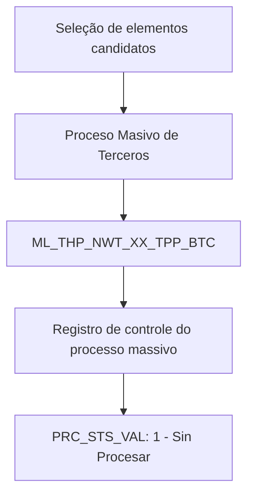

# Processo Massivo de Terceiros — Visão Técnica e Tabela de Controle

## 1. Metadados do Documento
- **Arquivo de Origem:** Não identificado no conteúdo extraído
- **Tipo de Documento:** Especificação Técnica
- **Domínio / Sistema:** Processo Massivo de Terceiros
- **Público-Alvo:** Desenvolvedores, Arquitetos, Operação
- **Data/Versão Identificada:** Não identificada

---

## 2. Resumo Executivo & Contexto de Negócio

O documento descreve a visão técnica para seleção de elementos candidatos no **Proceso Masivo de Terceros**. O foco da extração é o modelo de dados envolvido na operação e, especificamente, a tabela de controle utilizada pelo processamento massivo.

A tabela identificada é `ML_THP_NWT_XX_TPP_BTC`, descrita como **Tabela Control Procesos Masivos Terceros**. A estrutura contém campos para identificação da companhia, identificação do terceiro, data de processamento, ordem do processo, thread de processamento, tipo de movimento batch, documentação e situação do processo.

A documentação também indica que `PRC_STS_VAL` recebe o valor `1 - Sin Procesar`, caracterizando uma situação de processo ainda não processado. Diversas colunas foram marcadas como obrigatórias na extração, incluindo dados de companhia, identificação, data, ordem, tipo de movimento, documento, atividade, situação, usuário e data de modificação.

**Nota de Análise:** O conteúdo extraído não detalha métodos HTTP, contratos JSON, regras de seleção completas, integrações externas, jobs agendados ou a semântica integral de todas as abreviações de colunas.

---

## 3. Arquitetura, Componentes & Tecnologias Envolvidas

Os elementos técnicos explicitamente identificados são:

| Componente / Elemento | Descrição sustentada pelo documento |
| :--- | :--- |
| Processo Massivo de Terceiros | Operação para selecionar elementos candidatos. |
| `ML_THP_NWT_XX_TPP_BTC` | Tabela de controle dos processos massivos de terceiros. |
| `PRC_STS_VAL` | Campo de situação do processo; possui referência ao valor `1 - Sin Procesar`. |
| `Home Solutions APIs Documentation Zeus` | Texto presente na extração, sem detalhamento suficiente para determinar papel arquitetural. |
| `TRATAM / CF` | Texto presente na extração, sem contexto suficiente para definir significado técnico ou funcional. |



**Nota de Análise:** O diagrama representa apenas a relação explicitamente inferível entre a seleção de candidatos, o processo massivo e a tabela de controle. O documento não apresenta camadas de aplicação, serviços, servidores, protocolos ou integrações adicionais.

---

## 4. Regras de Negócio, Especificações Funcionais & Processos

### Processo identificado

1. O documento aborda a seleção de elementos candidatos para o **Proceso Masivo de Terceros**.
2. A operação utiliza a tabela `ML_THP_NWT_XX_TPP_BTC` como tabela de controle dos processos massivos de terceiros.
3. A tabela registra informações de companhia, identificação, data, ordem de processo, thread, tipo de movimento batch, documentação de terceiro, atividade de terceiro, situação do processo, usuário e data de modificação.
4. O campo `PRC_STS_VAL` possui indicação do valor `1 - Sin Procesar`.
5. A extração sinaliza obrigatoriedade para diversos campos, porém alguns nomes e descrições aparecem truncados devido à qualidade ou formatação do conteúdo bruto.

### Restrições e condições explicitamente apresentadas

| Regra / Condição | Evidência no conteúdo |
| :--- | :--- |
| Existência de tabela de controle | `ML_THP_NWT_XX_TPP_BTC` é apresentada como tabela de controle de processos massivos de terceiros. |
| Situação inicial ou situação de não processamento | `PRC_STS_VAL` indica `1 - Sin Procesar`. |
| Campos obrigatórios | A coluna “OBLIGATORIA” apresenta `SI` para os campos exibidos. |
| Uso de identificação de terceiro | `BTC_IDN_VAL` é descrito como identificação. |
| Uso de documento de terceiro | `THP_DCM_TYP_VAL` e `THP_DCM_VAL` são associados ao tipo e ao documento do terceiro. |
| Registro de usuário e modificação | `USR_VAL` é associado ao usuário atual da fila; `MDF_DAT` é associado à data de modificação. |

**Nota de Análise:** O documento não especifica quais eventos alteram `PRC_STS_VAL`, quais valores adicionais são permitidos para esse campo, nem quais validações devem ser aplicadas a cada coluna.

---

## 5. Tabelas de Parâmetros, Ambientes e Estruturas de Dados

### Tabela de controle identificada

| Item / Parâmetro | Descrição / Função | Tipo / Valores / Formato | Ambiente / Observações |
| :--- | :--- | :--- | :--- |
| `ML_THP_NWT_XX_TPP_BTC` | Tabela de controle de processos massivos de terceiros. | Nome de tabela. | Não identificado. |

### Campos extraídos da tabela `ML_THP_NWT_XX_TPP_BTC`

| Item / Parâmetro | Descrição / Função | Tipo / Valores / Formato | Ambiente / Observações |
| :--- | :--- | :--- | :--- |
| `CMP_VAL` | Companhia. | A extração indica “N.A.” para motivo/valor. | Obrigatório: `SI`. |
| `BTC_IDN_VAL` | Identificação. | A extração indica “N.A.” para motivo/valor. | Obrigatório: `SI`. |
| `POC_DAT` | Data associada ao processamento; descrição aparece truncada como “FECHA D TRATAM”. | A extração indica “N.A.” para motivo/valor. | Obrigatório: `SI`. |
| `POC_ORD_NBR` | Número de ordem do processo. | A extração indica “N.A.” para motivo/valor. | Obrigatório: `SI`. |
| `PRC_THD_VAL` | Hilo / thread. | A extração indica “N.A.” para motivo/valor. | Obrigatório: `SI`. |
| `BTC_MVM_THP_TYP_VAL` | Tipo de movimento batch. | A extração indica “N.A.” para motivo/valor. | Obrigatório: `SI`. |
| `THP_DCM_TYP_VAL` | Tipo de documento do terceiro. | A extração indica “N.A.” para motivo/valor. | Obrigatório: `SI`. |
| `THP_DCM_VAL` | Documento do terceiro. | A extração indica “N.A.” para motivo/valor. | Obrigatório: `SI`. |
| `THP_ACV_VAL` | Atividade do terceiro. | A extração indica “N.A.” para motivo/valor. | Obrigatório: `SI`. |
| `PRC_STS_VAL` | Situação do processo. | Valor indicado: `1 - Sin Procesar`. | Obrigatório: `SI`. |
| `USR_VAL` | Usuário atual da fila. | A extração indica “N.A.” para motivo/valor. | Obrigatório: `SI`. |
| `MDF_DAT` | Data de modificação. | A extração indica “N.A.” para motivo/valor. | Obrigatório: `SI`. |

### Ambientes, URLs e rotas de log

| Item / Parâmetro | Descrição / Função | Tipo / Valores / Formato | Ambiente / Observações |
| :--- | :--- | :--- | :--- |
| Ambientes | Não identificados no conteúdo extraído. | Não aplicável. | O documento não apresenta URLs, servidores ou nomes de ambientes. |
| Rotas de logs | Não identificadas no conteúdo extraído. | Não aplicável. | O documento não apresenta caminhos, arquivos ou ferramentas de log. |

---

## 6. Bateria de Perguntas & Respostas para RAG (FAQ Sintético)

### P1: Qual tabela participa do Processo Massivo de Terceiros?
**R:** A tabela indicada no documento é `ML_THP_NWT_XX_TPP_BTC`, descrita como a tabela de controle dos processos massivos de terceiros.

### P2: Qual é o objetivo técnico apresentado para o Processo Massivo de Terceiros?
**R:** O objetivo apresentado é selecionar elementos candidatos para o **Proceso Masivo de Terceros**, utilizando a tabela `ML_THP_NWT_XX_TPP_BTC` para controle da operação.

### P3: Qual campo representa a situação do processo massivo?
**R:** O campo `PRC_STS_VAL` representa a situação do processo. A extração indica o valor `1 - Sin Procesar`.

### P4: O que significa o valor `1` de `PRC_STS_VAL` no documento?
**R:** O documento associa o valor `1` do campo `PRC_STS_VAL` ao estado `Sin Procesar`, ou seja, sem processamento realizado.

### P5: Qual campo identifica a companhia no registro de controle?
**R:** O campo `CMP_VAL` é associado à companhia e está marcado como obrigatório na extração.

### P6: Qual campo armazena a identificação do terceiro?
**R:** O campo `BTC_IDN_VAL` é apresentado como o campo de identificação e está marcado como obrigatório.

### P7: Quais campos registram os documentos do terceiro?
**R:** O tipo de documento do terceiro é associado a `THP_DCM_TYP_VAL`, enquanto o documento do terceiro é associado a `THP_DCM_VAL`. Ambos estão marcados como obrigatórios.

### P8: Como a ordem do processo é representada na tabela de controle?
**R:** O número de ordem do processo é representado pelo campo `POC_ORD_NBR`, descrito como “NUMERO ORDEN PROCESO” na extração.

### P9: Qual campo está relacionado ao thread de processamento?
**R:** O campo `PRC_THD_VAL` é descrito como “HILO”, termo que o documento associa ao thread de processamento.

### P10: Onde é registrada a atividade do terceiro?
**R:** A atividade do terceiro é registrada no campo `THP_ACV_VAL`, apresentado na extração como “ACTIVIDAD TERCERO”.

### P11: Quais campos permitem rastrear o usuário e a modificação do registro?
**R:** O campo `USR_VAL` é associado ao usuário atual da fila, e `MDF_DAT` é associado à data de modificação.

### P12: O documento especifica URLs, APIs ou contratos de integração?
**R:** Não. Embora o texto contenha a expressão “Home Solutions APIs Documentation Zeus”, não há URL, método HTTP, endpoint, contrato JSON ou detalhamento de integração associado.

---

## 7. Glossário de Termos, Siglas & Conceitos-Chave

- **Proceso Masivo de Terceros:** Processo massivo voltado a terceiros, no contexto da seleção de elementos candidatos.
- **`ML_THP_NWT_XX_TPP_BTC`:** Tabela de controle de processos massivos de terceiros.
- **`CMP_VAL`:** Campo associado à companhia.
- **`BTC_IDN_VAL`:** Campo associado à identificação.
- **`POC_DAT`:** Campo associado a uma data; a descrição completa está truncada na extração.
- **`POC_ORD_NBR`:** Campo associado ao número de ordem do processo.
- **`PRC_THD_VAL`:** Campo associado a “hilo”, apresentado como thread de processamento.
- **`BTC_MVM_THP_TYP_VAL`:** Campo associado ao tipo de movimento batch.
- **`THP_DCM_TYP_VAL`:** Campo associado ao tipo de documento do terceiro.
- **`THP_DCM_VAL`:** Campo associado ao documento do terceiro.
- **`THP_ACV_VAL`:** Campo associado à atividade do terceiro.
- **`PRC_STS_VAL`:** Campo associado à situação do processo.
- **`USR_VAL`:** Campo associado ao usuário atual da fila.
- **`MDF_DAT`:** Campo associado à data de modificação.
- **Batch:** Termo usado na descrição de `BTC_MVM_THP_TYP_VAL`; o documento não fornece definição adicional.
- **Sin Procesar:** Situação indicada para o valor `1` de `PRC_STS_VAL`.

---

## 8. Notas Críticas, Riscos & Limitações

- A extração possui trechos truncados, incluindo descrições associadas a `POC_DAT`, `BTC_MVM_THP_TYP_VAL`, `THP_DCM_TYP_VAL`, `THP_DCM_VAL`, `THP_ACV_VAL`, `PRC_STS_VAL`, `USR_VAL` e `MDF_DAT`.
- Não há especificação de tipos físicos de dados, tamanhos, chaves primárias, índices, chaves estrangeiras ou regras de integridade da tabela `ML_THP_NWT_XX_TPP_BTC`.
- Não há detalhamento dos valores possíveis para `PRC_STS_VAL` além de `1 - Sin Procesar`.
- Não há definição operacional sobre o mecanismo de seleção dos elementos candidatos.
- Não há informações sobre execução batch, agendamento, frequência, tratamento de falhas, reprocessamento, logs ou monitoramento.
- A presença dos termos “Home Solutions APIs Documentation Zeus” e “TRATAM / CF” não é suficiente para estabelecer integrações, tecnologias ou significados funcionais.
- **Risco de interpretação:** Expandir siglas como `THP`, `BTC`, `POC`, `PRC`, `ACV` ou `MDF` sem documentação complementar introduziria informação não sustentada pelo conteúdo original.

---

## 9. Conteúdo Bruto Estruturado (Referência Fiel)

```text
--- [PÁGINA 1 DE 2] ---

SELECCIONAR ELEMENTOS CANDIDATOS del
Proceso Masivo de Terceros (Visión Técnica)
Modelo de datos involucrado
La tabla que interviene en esta operación es:
TABLA DESCRIPCIÓN
ML_THP_NWT_XX_TPP_BTC TABLA CONTROL PROCESOS MASIVOS TERCEROS
COLUMNA CAMBIA
VALOR
MOTIVO/VALOR OBLIGATORIA COMEN
CMP_VAL S N.A. SI COMPAN
BTC_IDN_VAL S N.A. SI IDENTIF
POC_DAT S N.A. SI FECHA D
TRATAM
 /
 CF
Home Solutions APIs Documentation Zeus
EN


--- [PÁGINA 2 DE 2] ---

COLUMNA CAMBIA
VALOR
MOTIVO/VALOR OBLIGATORIA COMEN
POC_ORD_NBR S N.A. SI NUMERO
ORDEN
PROCES
PRC_THD_VAL S N.A. SI HILO
BTC_MVM_THP_TYP_VAL S N.A. SI TIPO DE
MOVIMI
BATCH
THP_DCM_TYP_VAL S N.A. SI TIPO DE
DOCUM
DEL TER
THP_DCM_VAL S N.A. SI DOCUM
DEL TER
THP_ACV_VAL S N.A. SI ACTIVID
TERCER
PRC_STS_VAL S Toma el valor 1-
Sin Procesar
SI SITUAC
PROCES
USR_VAL S N.A. SI USUARI
ACTUAL
FILA
MDF_DAT S N.A. SI FECHA
MODIFIC
```
