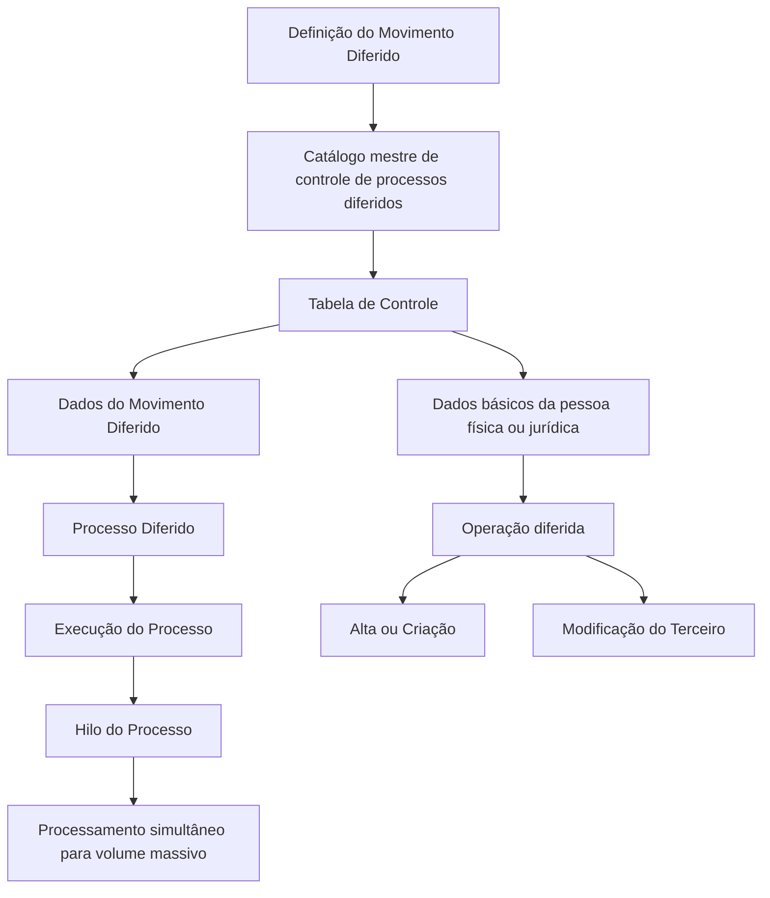

# Processo Massivo de Terceiros — Processo Diferido

## 1. Metadados do Documento
- **Arquivo de Origem:** Não identificado; conteúdo fornecido como extração textual de 2 páginas.
- **Tipo de Documento:** Especificação Técnica / Procedimento.
- **Domínio / Sistema:** Módulo de Terceiros; processos diferidos.
- **Público-Alvo:** Desenvolvedores, Arquitetos, Operação e Analistas Funcionais.
- **Data/Versão Identificada:** Não identificada.

---

## 2. Resumo Executivo & Contexto de Negócio

O documento descreve a criação de um processo massivo de terceiros executado de forma diferida. O objetivo é registrar, no catálogo mestre de controle de processos diferidos do Módulo de Terceiros, as informações que identificam um Movimento Diferido.

A tabela de controle não armazena somente informações do Movimento Diferido. A tabela de controle também inclui os dados básicos que identificam a pessoa física ou jurídica para a qual será realizada uma operação diferida no Módulo de Terceiros.

As operações diferidas disponíveis para o Módulo de Terceiros são a operação de alta ou criação e a operação de modificação do terceiro. A definição do Movimento Diferido inclui companhia, identificador do processo, data de tratamento, número de ordem e hilo do processo.

O uso de hilo de processo permite tratamento simultâneo quando o volume de registros for massivo. O processamento paralelo tem como finalidade reduzir a janela de tempo necessária para a execução do processo diferido.

---

## 3. Arquitetura, Componentes & Tecnologias Envolvidas

| Componente | Papel descrito |
| :--- | :--- |
| Módulo de Terceiros | Módulo no qual são disponibilizadas as operações diferidas de criação e modificação de terceiros. |
| Catálogo mestre de controle de processos diferidos | Catálogo no qual é registrada a informação específica que identifica o Movimento Diferido. |
| Tabela de Controle | Estrutura que contém informações do Movimento Diferido e dados básicos de identificação da pessoa física ou jurídica. |
| Movimento Diferido | Registro cuja criação é descrita no catálogo mestre de controle. |
| Processo Diferido | Processo que identifica o terceiro ou conjunto de terceiros tratado durante a execução. |
| Pessoa física ou jurídica | Entidade para a qual será executada uma operação diferida. |
| Hilo do Processo | Código do hilo no qual será executado o registro; permite processamento simultâneo em cenários de alto volume. |



**Nota de Análise:** O documento não detalha tecnologias, serviços, métodos HTTP, contratos JSON, banco de dados, interfaces de usuário ou mecanismos específicos de agendamento do Processo Diferido.

---

## 4. Regras de Negócio, Especificações Funcionais & Processos

1. O registro do Movimento Diferido deve ser criado no catálogo mestre de controle dos processos diferidos do Módulo de Terceiros.
2. A informação registrada deve identificar especificamente o Movimento Diferido.
3. A tabela de controle deve conter dados do Movimento Diferido e dados básicos que identificam a pessoa física ou jurídica relacionada à operação.
4. O Módulo de Terceiros disponibiliza duas operações diferidas:
   - Operação de alta ou criação.
   - Operação de modificação do terceiro.
5. A propriedade **Companhia** deve indicar o código da companhia para a qual está sendo realizada a definição do Movimento Diferido de Terceiros.
6. A propriedade **Identificador Processo** deve indicar o código do Processo Diferido que identificará o terceiro ou conjunto de terceiros tratado durante a execução do processo.
7. O atributo **Fecha Tratamiento del Proceso** deve conter a data em que ocorre a execução do Processo Diferido.
8. A propriedade **Número de Orden del Proceso** deve determinar a ordem de execução da operação no sistema.
9. O atributo **Hilo del Proceso** deve conter o código do hilo no qual será executado o registro.
10. Em situações de volume massivo de registros, a execução do Processo Diferido pode exigir processamento simultâneo para reduzir a janela de tempo de execução.

---

## 5. Tabelas de Parâmetros, Ambientes e Estruturas de Dados

| Item / Parâmetro | Descrição / Função | Tipo / Valores / Formato | Ambiente / Observações |
| :--- | :--- | :--- | :--- |
| Companhia | Indica o código da companhia sobre a qual é definida a movimentação diferida de terceiros. | Código de companhia; formato não detalhado. | Aplicável à definição do Movimento Diferido de Terceiros. |
| Identificador Processo | Indica o código do Processo Diferido que identifica o terceiro ou conjunto de terceiros a tratar. | Código de processo; formato não detalhado. | Utilizado durante a execução do Processo Diferido. |
| Fecha Tratamiento del Proceso | Contém a data em que é realizada a execução do Processo Diferido. | Data; formato não detalhado. | Associada à execução do processo. |
| Número de Orden del Proceso | Determina a ordem de execução da operação no sistema. | Número de ordem; formato não detalhado. | Define sequenciamento operacional. |
| Hilo del Proceso | Contém o código do hilo de processo no qual o registro será executado. | Código de hilo; formato não detalhado. | Pode suportar processamento simultâneo para grande volume. |
| Operação Diferida | Operação realizada sobre uma pessoa física ou jurídica identificada na tabela de controle. | Alta ou Criação; Modificação do Terceiro. | Operações disponíveis no Módulo de Terceiros. |

---

## 6. Bateria de Perguntas & Respostas para RAG (FAQ Sintético)

### P1: Qual é o objetivo do processo massivo de terceiros diferido?
**R:** O objetivo é registrar no catálogo mestre de controle dos processos diferidos do Módulo de Terceiros a informação específica que identifica o Movimento Diferido.

### P2: A tabela de controle contém apenas informações do Movimento Diferido?
**R:** Não. A tabela de controle contém informações do Movimento Diferido e também os dados básicos que identificam a pessoa física ou jurídica para a qual será executada uma operação diferida.

### P3: Quais operações diferidas estão disponíveis no Módulo de Terceiros?
**R:** O Módulo de Terceiros disponibiliza a operação de alta ou criação e a operação de modificação do terceiro.

### P4: Para que serve o parâmetro Companhia?
**R:** Companhia indica o código da companhia sobre a qual está sendo realizada a definição do Movimento Diferido de Terceiros.

### P5: O que identifica o parâmetro Identificador Processo?
**R:** Identificador Processo indica o código do Processo Diferido que identificará o terceiro ou conjunto de terceiros que será tratado na execução do processo.

### P6: O que representa a Fecha Tratamiento del Proceso?
**R:** Fecha Tratamiento del Proceso contém a data em que é realizada a execução do Processo Diferido.

### P7: Como é definida a ordem de execução de uma operação?
**R:** A ordem de execução é determinada pela propriedade Número de Orden del Proceso.

### P8: Qual é a finalidade do Hilo del Proceso?
**R:** Hilo del Proceso contém o código do hilo no qual o registro será executado. O hilo permite processamento simultâneo quando o volume de registros a tratar é massivo.

### P9: Por que o processamento simultâneo pode ser necessário?
**R:** O processamento simultâneo pode ser necessário quando o volume de registros é massivo, para reduzir a janela de tempo de execução do Processo Diferido.

### P10: O documento define o formato técnico dos códigos de companhia, processo ou hilo?
**R:** Não. O documento descreve a finalidade funcional desses atributos, mas não informa formatos, tamanhos, valores permitidos ou regras técnicas de validação.

---

## 7. Glossário de Termos, Siglas & Conceitos-Chave

- **Módulo de Terceiros:** Módulo que disponibiliza operações diferidas de criação e modificação de terceiros.
- **Movimento Diferido:** Movimento cuja informação específica deve ser registrada no catálogo mestre de controle de processos diferidos.
- **Processo Diferido:** Processo executado posteriormente que trata um terceiro ou conjunto de terceiros.
- **Tabela de Controle:** Estrutura que reúne dados do Movimento Diferido e dados básicos de identificação da pessoa física ou jurídica.
- **Alta ou Criação:** Operação diferida disponível para criação de terceiro.
- **Modificação do Terceiro:** Operação diferida disponível para alteração de um terceiro.
- **Hilo do Processo:** Código do fluxo ou linha de execução do processo para um registro.

---

## 8. Notas Críticas, Riscos & Limitações

- O documento não informa formatos, obrigatoriedade, domínio de valores ou validações dos atributos descritos.
- O documento não detalha como o processamento simultâneo é configurado, coordenado ou monitorado.
- Não há descrição de tratamento de erros, reprocessamento, idempotência ou consistência transacional.
- Não são apresentados contratos de integração, endpoints, banco de dados, mecanismos de persistência ou tecnologias utilizadas.
- Não há detalhamento sobre a distinção operacional entre alta/criação e modificação do terceiro.
- **Nota de Análise:** O conteúdo identifica o processamento massivo e o uso de hilo de processo, mas não especifica limites de volume, quantidade de hilos ou regras de distribuição de registros.

---

## 9. Conteúdo Bruto Estruturado (Referência Fiel)

```text
--- [PÁGINA 1 DE 2] ---

CREAR Proceso Masivo de Terceros - Proceso
Diferido (enlace con visión técnica)
Objetivo
Registrar en el catálogo maestro de control de los procesos diferidos del Módulo de Terceros la
información específica que identifica el Movimiento Diferido.
IMPORTANTE: La tabla de Control no contiene solamente información del Movimiento Diferido
puesto que además, incluye los datos básicos que identifican a la persona física o jurídica para la
que se va a realizar una de las dos operaciones diferidas disponibles para el Módulo de Terceros:
Operación de Alta o Creación, y
Operación de Modificación del Tercero.
Los atributos que concretamente corresponden a la Creación del Movimiento Diferido en este
catálogo maestro son ...
Compañía
Esta propiedad le indica al sistema el código de la compañía sobre la que se está realizando la
definición del movimiento diferido de Terceros.
Identificador Proceso
Esta propiedad le indica al sistema el código del Proceso Diferido que identificará al Tercero o
conjunto de Terceros que se van a tratar en la ejecución del Proceso.
 /
 RS
Inicio Soluciones APIs Documentación Zeus
ES

--- [PÁGINA 2 DE 2] ---

Fecha Tratamiento del Proceso
Este Atributo contiene la Fecha en la que se realiza la Ejecución del Proceso Diferido.
Número de Orden del Proceso
Esta propiedad determina el orden en el que se se debe ejecutar la operación en el sistema.
Hilo del Proceso
Este Atributo contiene el código del hilo del Proceso en el que se va a ejecutar el registro puesto que
en ocasiones, normalmente cuando el volumen de registros a tratar es masivo, la ejecución del
proceso diferido necesita ser procesado de manera simultánea para acortar la ventana de tiempo
de su ejecución.
```
