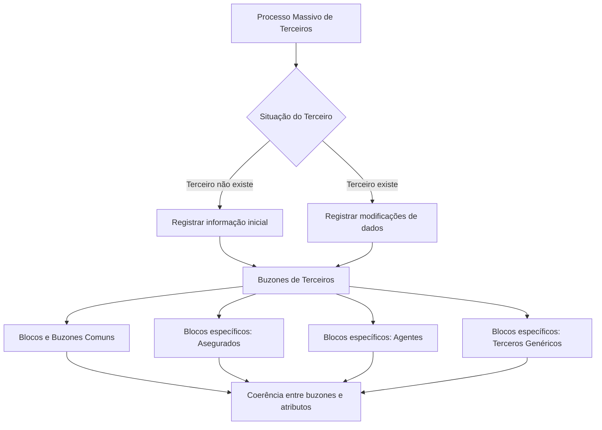

# Processo Massivo de Terceiros — Blocos e Buzones de Informação

## 1. Metadados do Documento
- **Arquivo de Origem:** Não identificado — conteúdo bruto fornecido na solicitação.
- **Tipo de Documento:** Especificação Funcional.
- **Domínio / Sistema:** Processo Massivo de Terceiros; Sistema; Buzones de Terceiros.
- **Público-Alvo:** Desenvolvedores, Arquitetos, Operação e Negócio.
- **Data/Versão Identificada:** Não identificada.

---

## 2. Resumo Executivo & Contexto de Negócio

O documento descreve o processo de registro, nos Buzones de Terceiros, de informações iniciais e modificações de dados de um Terceiro. O processo é aplicável tanto quando o Terceiro ainda não existe quanto quando o Terceiro já existe no Sistema.

O objetivo declarado é conhecer os blocos e buzones de informação disponíveis ou passíveis de uso durante a criação ou alteração de um Terceiro. A documentação organiza essas informações por grupos comuns a diversas atividades e por grupos específicos para as atividades de Asegurados, Agentes e Terceros Genéricos.

A principal regra funcional destacada é a necessidade de coerência total entre os buzones e seus atributos. Como exemplos, o documento estabelece que a indicação de um Terceiro inabilitado deve ser acompanhada do código da causa de inabilitação; de modo semelhante, a indicação de que um Asegurado possui Obrigações Fiscais deve prever informação no bloco correspondente.

As tabelas originais possuem links para operações de criação em linha e para o modelo de dados dos Buzones. Entretanto, o conteúdo extraído não apresenta os URLs, contratos técnicos, atributos internos, métodos HTTP, formatos de payload ou detalhes das operações vinculadas.

---

## 3. Arquitetura, Componentes & Tecnologias Envolvidas

O documento não descreve tecnologias, servidores, protocolos, APIs concretas ou componentes de infraestrutura. A arquitetura funcional identificável consiste no fluxo de registro ou modificação de dados de um Terceiro por meio de blocos e Buzones de Informação, segmentados entre informações comuns e informações específicas por atividade.



**Nota de Análise:** O documento menciona “Soluciones”, “APIs”, “Documentación” e “Zeus” na navegação visível da página, mas não descreve a função técnica, a integração ou a relação desses elementos com o Processo Massivo de Terceiros.

---

## 4. Regras de Negócio, Especificações Funcionais & Processos

### Processo de registro ou alteração

1. Registrar nos Buzones de Terceiros as informações iniciais quando o Terceiro não existir.
2. Registrar nos Buzones de Terceiros as modificações dos dados quando o Terceiro já existir.
3. Selecionar os blocos e buzones adequados conforme o tipo de informação e, quando aplicável, a atividade do Terceiro.
4. Manter coerência total entre os buzones preenchidos e os atributos informados.

### Regra obrigatória de coerência

| Condição informada | Informação complementar exigida |
| :--- | :--- |
| Um Terceiro está inabilitado | Deve ser indicado o código da causa de inabilitação. |
| Um Asegurado possui Obrigações Fiscais | A informação deve ser contemplada no bloco correspondente. |

### Blocos comuns para distintas atividades de Terceiros

Os seguintes Buzones são apresentados como comuns para distintas atividades de Terceiros:

- Dados Básicos do Terceiro.
- Dados Identificativos.
- Obrigações Fiscais.
- Dados de Pessoas Politicamente Expostas.
- Contactos do Terceiro.
- Direções do Terceiro.
- Documentos Alternativos.
- Representantes Legais.
- Accionistas.
- Meios de Cobro e Pago.

### Blocos específicos para a atividade Asegurados

Para a atividade **[1] - Asegurados**, o documento relaciona os seguintes Buzones:

- Informação do Asegurado.
- Consentimentos do Terceiro.
- Dados de Asegurado Não Desejado.
- Perfil Analítico do Terceiro.
- Dados de Licença ou Permiso de Conducción.

### Blocos específicos para a atividade Agentes

Para a atividade **[2] - Agentes**, o documento relaciona:

- Informação do Agente.

### Blocos específicos para atividades de Terceros Genéricos

Para atividades de Terceros Genéricos, o documento relaciona:

- Informação dos Terceros Genéricos.

---

## 5. Tabelas de Parâmetros, Ambientes e Estruturas de Dados

| Item / Parâmetro | Descrição / Função | Tipo / Valores / Formato | Ambiente / Observações |
| :--- | :--- | :--- | :--- |
| Processo Massivo de Terceiros | Processo para registrar informação inicial ou modificações de dados de Terceiros. | Processo funcional. | Aplicável quando o Terceiro não existe ou já existe. |
| Buzones de Terceiros | Estruturas que recebem as informações iniciais ou modificadas de Terceiros. | Estruturas de informação. | Devem manter coerência com seus atributos. |
| Dados Básicos do Terceiro | Informação comum de Terceiro. | Buzón. | Possui referência a operação e Visão Técnica, não extraídas. |
| Dados Identificativos | Informação comum de Terceiro. | Buzón. | Possui referência a operação e Visão Técnica, não extraídas. |
| Obrigações Fiscais | Informação fiscal de Terceiro. | Buzón. | Deve ser contemplado quando um Asegurado tiver Obrigações Fiscais. |
| Dados Pessoas Politicamente Expostas | Informação comum de Terceiro. | Buzón. | Possui referência a operação e Visão Técnica, não extraídas. |
| Contactos do Terceiro | Informação de contato de Terceiro. | Buzón. | Possui referência a operação e Visão Técnica, não extraídas. |
| Direções do Terceiro | Informação de endereço de Terceiro. | Buzón. | Possui referência a operação e Visão Técnica, não extraídas. |
| Documentos Alternativos | Informação documental de Terceiro. | Buzón. | Possui referência a operação e Visão Técnica, não extraídas. |
| Representantes Legais | Informação de representação legal de Terceiro. | Buzón. | Possui referência a operação e Visão Técnica, não extraídas. |
| Accionistas | Informação de acionistas de Terceiro. | Buzón. | Possui referência a operação e Visão Técnica, não extraídas. |
| Medios de Cobro y Pago | Informação sobre meios de cobrança e pagamento. | Buzón. | Possui referência a operação e Visão Técnica, não extraídas. |
| Informação do Asegurado | Informação específica da atividade Asegurados. | Buzón específico. | Atividade [1] - Asegurados. |
| Consentimentos do Terceiro | Informação específica da atividade Asegurados. | Buzón específico. | Atividade [1] - Asegurados. |
| Dados Asegurado No Deseado | Informação específica da atividade Asegurados. | Buzón específico. | Atividade [1] - Asegurados. |
| Perfil Analítico do Terceiro | Informação específica da atividade Asegurados. | Buzón específico. | Atividade [1] - Asegurados. |
| Dados Licencia o Permiso de Conducción | Informação específica da atividade Asegurados. | Buzón específico. | Atividade [1] - Asegurados. |
| Informação do Agente | Informação específica da atividade Agentes. | Buzón específico. | Atividade [2] - Agentes. |
| Informação dos Terceros Genéricos | Informação específica para atividades de Terceros Genéricos. | Buzón específico. | Possui referência a operação e Visão Técnica, não extraídas. |

---

## 6. Bateria de Perguntas & Respostas para RAG (FAQ Sintético)

### P1: Em que consiste o Processo Masivo de Terceros?
**R:** O Processo Masivo de Terceros consiste em registrar, nos Buzones de Terceiros, a informação inicial de um Terceiro quando o Terceiro não existe ou registrar modificações de dados quando o Terceiro já existe no Sistema.

### P2: Qual é o objetivo da documentação sobre os Buzones de Terceiros?
**R:** O objetivo é conhecer quais blocos e Buzones de Informação estão disponíveis ou podem ser considerados durante a criação ou alteração de um Terceiro no Sistema.

### P3: Qual regra deve ser seguida ao indicar que um Terceiro está inabilitado?
**R:** Quando for indicado que um Terceiro está inabilitado, também deve ser indicado o código da causa de inabilitação. O documento exige coerência total entre os Buzones e os atributos que eles contêm.

### P4: Onde devem ser registradas as Obrigações Fiscais de um Asegurado?
**R:** Quando um Asegurado possuir Obrigações Fiscais, essa informação deve ser contemplada no bloco correspondente de Obrigações Fiscais.

### P5: Quais Buzones são comuns a distintas atividades de Terceiros?
**R:** Os Buzones comuns incluem Dados Básicos, Dados Identificativos, Obrigações Fiscais, Dados de Pessoas Politicamente Expostas, Contactos, Direções, Documentos Alternativos, Representantes Legais, Accionistas e Medios de Cobro y Pago.

### P6: Quais informações específicas podem ser registradas para Asegurados?
**R:** Para a atividade Asegurados, o documento lista Informação do Asegurado, Consentimentos do Terceiro, Dados Asegurado No Deseado, Perfil Analítico do Terceiro e Dados Licencia o Permiso de Conducción.

### P7: Qual Buzón específico é apresentado para a atividade Agentes?
**R:** Para a atividade [2] - Agentes, o documento apresenta o Buzón “Información del Agente”.

### P8: Qual informação é apresentada para atividades de Terceros Genéricos?
**R:** Para as atividades de Terceros Genéricos, o documento apresenta o Buzón “Información de los Terceros Genéricos”.

### P9: O documento fornece contratos de API, métodos HTTP ou estruturas JSON dos Buzones?
**R:** Não. O documento informa que as tabelas possuem enlaces para operações de criação em linha e para o modelo de dados dos Buzones, mas o texto extraído não contém métodos HTTP, contratos JSON, URLs ou estruturas internas.

### P10: O que significa a exigência de coerência total entre Buzones e atributos?
**R:** Significa que os dados declarados em um Buzón devem ser acompanhados pelos atributos e blocos relacionados exigidos pelo contexto. Os exemplos fornecidos são o código da causa de inabilitação para um Terceiro inabilitado e o preenchimento do bloco de Obrigações Fiscais para um Asegurado com essas obrigações.

---

## 7. Glossário de Termos, Siglas & Conceitos-Chave

- **Terceiro / Tercero:** Entidade cujas informações iniciais ou modificações são registradas no Sistema.
- **Buzón:** Estrutura de informação que contém dados de um Terceiro.
- **Bloco de Informação:** Agrupamento de Buzones ou informações associadas a um tema ou atividade.
- **Asegurado:** Atividade de Terceiro identificada como atividade [1] no documento.
- **Agente:** Atividade de Terceiro identificada como atividade [2] no documento.
- **Terceros Genéricos:** Grupo de atividades de Terceiros com Buzón específico de informação.
- **Obrigações Fiscais:** Informação fiscal que deve ser contemplada no bloco correspondente quando aplicável a um Asegurado.
- **Visão Técnica:** Referência citada pelo documento para acesso ao modelo de dados, sem conteúdo técnico presente na extração.

---

## 8. Notas Críticas, Riscos & Limitações

- O texto exige coerência total entre Buzones e atributos; preenchimentos inconsistentes podem resultar em informações incompletas ou contraditórias.
- O conteúdo extraído não disponibiliza os enlaces citados para operações de criação em linha ou para as Visões Técnicas.
- Não há detalhamento de modelos de dados, campos obrigatórios, tipos de dados, validações técnicas, contratos JSON, métodos HTTP, códigos de erro ou mecanismos de integração.
- Não há descrição de ambientes, servidores, URLs, autenticação, autorização ou observabilidade.
- **Nota de Análise:** O documento lista diversos Buzones, porém não detalha os atributos internos nem os contratos técnicos expostos para cada Buzón.

---

## 9. Conteúdo Bruto Estruturado (Referência Fiel)

```text
--- [PÁGINA 1 DE 3] ---

Detallar Cambios en los Terceros
Candidatos - Proceso Masivo de Terceros
¿En que consiste?
Registrar en los Buzones de Terceros la información inicial del Tercero o las modificaciones en
los datos del Tercero que serán de aplicación en los casos que el Tercero no exista o exista
respectivamente.
Objetivo
Conocer qué bloques y buzones de información se tienen o pueden contemplar al crear o modificar
un Tercero en el Sistema.
IMPORTANTE: Tiene que existir una total coherencia en los buzones y en los atributos que estos
contienen. Por ejemplo: Si se indica que un Tercero está inhabilitado se debe indicar el código de la
causa de inhabilitación, en cambio si se indica que un Asegurado tiene Obligaciones Fiscales debería
contemplarse su información en el Bloque correspondiente, ... y así sucesivamente.
La Tablas que se muestran a continuación cuentan con enlaces a las Operaciones de Creación en
línea y al Modelo de datos de los Buzones que contienen la información del Tercero en sus
respectivas estructuras.
Bloques y Buzones de Información - COMUNES para distintas
Actividades de Terceros
 /
 RS
Inicio Soluciones APIs Documentación Zeus
ES


--- [PÁGINA 2 DE 3] ---

OPERACIÓN BUZONES - MODELO DE DATOS
Detallar Datos Básicos del Tercero Acceder a Visión Técnica
Detallar Datos Identificativos Acceder a Visión Técnica
Detallar Obligaciones Fiscales Acceder a Visión Técnica
Detallar Datos Personas Políticamente Expuestas Acceder a Visión Técnica
Detallar Contactos del Tercero Acceder a Visión Técnica
Detallar Direcciones del Tercero Acceder a Visión Técnica
Detallar Documentos Alternativos Acceder a Visión Técnica
Detallar Representantes Legales Acceder a Visión Técnica
Detallar Accionistas Acceder a Visión Técnica
Detallar Medios de Cobro y Pago Acceder a Visión Técnica
Bloques y Buzones de Información Específicos para la
Actividad [1] - Asegurados
OPERACIÓN BUZONES - MODELO DE DATOS
Detallar Información del Asegurado Acceder a Visión Técnica
Detallar Consentimientos del Tercero Acceder a Visión Técnica
Detallar Datos Asegurado No Deseado Acceder a Visión Técnica
Detallar Perfil Analítico del Tercero Acceder a Visión Técnica
Detallar Datos Licencia o Permiso de Conducción Acceder a Visión Técnica


--- [PÁGINA 3 DE 3] ---

Bloques y Buzones de Información Específicos para la
Actividad [2] - Agentes
OPERACIÓN BUZONES - MODELO DE DATOS
Detallar Información del Agente Acceder a Visión Técnica
Bloques y Buzones de Información Específicos para las
Actividades de Terceros Genéricos
OPERACIÓN BUZONES - MODELO DE DATOS
Detallar Información de los Terceros Genéricos. Acceder a Visión Técnica
```
