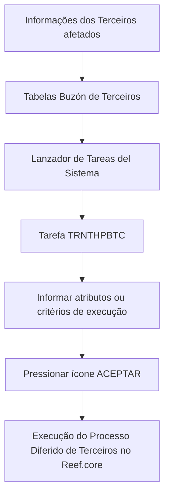

# Procedimento para Executar Processo Massivo de Terceiros no Reef.core

## 1. Metadados do Documento
- **Arquivo de Origem:** Não identificado
- **Tipo de Documento:** Procedimento
- **Domínio / Sistema:** Reef.core — módulo de Terceiros
- **Público-Alvo:** Não identificado
- **Data/Versão Identificada:** Não identificada

---

## 2. Resumo Executivo & Contexto de Negócio

O documento descreve o procedimento para executar um processo massivo de Terceiros no sistema Reef.core. O objetivo declarado é orientar a execução de um processo em lote após o detalhamento das informações dos Terceiros afetados nas Tabelas Buzón de Terceiros.

A execução ocorre como um processo diferido, iniciado por meio do Lanzador de Tareas del Sistema. Para o módulo de Terceiros, os processos diferidos utilizam a tarefa `TRNTHPBTC`.

A tarefa `TRNTHPBTC` exige critérios de execução que identificam a companhia, a data de tratamento, a ordem de execução, a possibilidade de reprocessamento em caso de erro, o idioma e o usuário executor. O documento informa que a ordem de captura dos atributos segue a disposição visual dos campos: da esquerda para a direita e de cima para baixo.

O procedimento é concluído com o acionamento do ícone **ACEPTAR**. O conteúdo fornecido não especifica contratos técnicos, métodos HTTP, estruturas de tabelas, códigos de retorno ou mecanismos detalhados de tratamento de falhas.

---

## 3. Arquitetura, Componentes & Tecnologias Envolvidas

| Componente | Papel descrito |
| :--- | :--- |
| Reef.core | Sistema no qual o processo massivo de Terceiros é executado. |
| Módulo de Terceiros | Módulo cujos processos diferidos são executados pela tarefa `TRNTHPBTC`. |
| Tabelas Buzón de Terceiros | Estruturas nas quais são detalhadas as informações dos Terceiros afetados antes da execução do processo. |
| Lanzador de Tareas del Sistema | Mecanismo utilizado para executar o processo definido. |
| `TRNTHPBTC` | Tarefa utilizada para executar Processos Diferidos do módulo de Terceiros. |
| Ícone ACEPTAR | Ação final indicada para confirmar a execução informada. |



**Nota de Análise:** O documento identifica a tarefa `TRNTHPBTC`, mas não detalha a tecnologia de implementação, a infraestrutura, os servidores, os métodos de integração ou os contratos de dados envolvidos.

---

## 4. Regras de Negócio, Especificações Funcionais & Processos

1. As informações dos Terceiros afetados devem estar detalhadas nas diferentes **Tabelas Buzón de Terceiros** antes da execução do processo.
2. O processo definido deve ser executado por meio do **Lanzador de Tareas del Sistema**.
3. Os Processos Diferidos do módulo de Terceiros são executados pela tarefa `TRNTHPBTC`.
4. A tarefa `TRNTHPBTC` deve receber atributos ou critérios de execução.
5. A captura dos atributos segue a ordem visual dos campos, da esquerda para a direita e de cima para baixo.
6. O atributo **Código de Compañía** contém o código da companhia para a qual o processo massivo de Terceiros está sendo executado.
7. O atributo **Fecha de Tratamiento** determina a data em que a execução do Processo Diferido é realizada.
8. O atributo **Identificador del Proceso Diferido** determina a ordem em que a operação deve ser executada no sistema.
9. O atributo **Volver a Procesar en caso de Error** determina se o processo massivo pode ser reprocessado, em caso de erro, a partir do ponto em que a falha ocorre.
10. O atributo **Idioma** contém a chave do idioma ou linguagem com a qual o processo massivo está sendo executado.
11. O atributo **Usuario** determina a chave de usuário com a qual o processo massivo é executado.
12. Após o preenchimento dos atributos, o procedimento orienta pressionar o ícone **ACEPTAR**.

---

## 5. Tabelas de Parâmetros, Ambientes e Estruturas de Dados

| Item / Parâmetro | Descrição / Função | Tipo / Valores / Formato | Ambiente / Observações |
| :--- | :--- | :--- | :--- |
| Código de Compañía | Contém o código da companhia para a qual o processo massivo de Terceiros é executado. | Código de companhia; formato não detalhado. | Reef.core; módulo de Terceiros. |
| Fecha de Tratamiento | Determina a data em que é realizada a execução do Processo Diferido. | Data; formato não detalhado. | Reef.core; módulo de Terceiros. |
| Identificador del Proceso Diferido | Determina a ordem em que a operação deve ser executada no sistema. | Identificador; formato não detalhado. | Reef.core; módulo de Terceiros. |
| Volver a Procesar en caso de Error | Determina se o processo massivo pode ser reprocessado após erro a partir do ponto da falha. | Opção de reprocessamento; valores não detalhados. | Reef.core; módulo de Terceiros. |
| Idioma | Contém a chave do idioma ou linguagem usada na execução do processo massivo. | Chave de idioma/língua; formato não detalhado. | Reef.core; módulo de Terceiros. |
| Usuario | Determina a chave de usuário utilizada para executar o processo massivo. | Chave de usuário; formato não detalhado. | Reef.core; módulo de Terceiros. |
| `TRNTHPBTC` | Tarefa usada para executar os Processos Diferidos do módulo de Terceiros. | Identificador de tarefa. | Lanzador de Tareas del Sistema. |
| ACEPTAR | Ícone que deve ser pressionado ao final do procedimento. | Ação de confirmação. | Interface não detalhada. |

---

## 6. Bateria de Perguntas & Respostas para RAG (FAQ Sintético)

### P1: Qual é o objetivo do procedimento de Processo Masivo de Terceros?
**R:** O objetivo é conhecer o procedimento necessário para executar um processo massivo de Terceiros no sistema Reef.core.

### P2: Onde devem estar detalhadas as informações dos Terceiros antes da execução?
**R:** As informações dos Terceiros afetados devem estar detalhadas nas diferentes Tabelas Buzón de Terceiros antes de executar o processo definido.

### P3: Como o processo definido é iniciado no Reef.core?
**R:** O processo definido é executado por meio do Lanzador de Tareas del Sistema.

### P4: Qual tarefa executa os Processos Diferidos do módulo de Terceiros?
**R:** Os Processos Diferidos do módulo de Terceiros são executados com a tarefa `TRNTHPBTC`.

### P5: Qual é a função do Código de Compañía na tarefa TRNTHPBTC?
**R:** O Código de Compañía contém o código da companhia para a qual está sendo executado o processo massivo de Terceiros.

### P6: O que a Fecha de Tratamiento determina?
**R:** A Fecha de Tratamiento determina a data em que é realizada a execução do Processo Diferido.

### P7: Como o Identificador del Proceso Diferido influencia a execução?
**R:** O Identificador del Proceso Diferido determina a ordem em que a operação deve ser executada no sistema.

### P8: O que acontece se a opção Volver a Procesar en caso de Error estiver configurada?
**R:** Essa opção determina se o processo massivo pode ser reprocessado em caso de erro, começando a partir do ponto em que a falha foi provocada.

### P9: Para que serve o atributo Idioma?
**R:** O atributo Idioma contém a chave do idioma ou linguagem com a qual o processo massivo está sendo executado.

### P10: Qual informação deve ser preenchida no atributo Usuario?
**R:** O atributo Usuario determina a chave de usuário com a qual o processo massivo é executado.

### P11: Em que ordem os atributos da tarefa devem ser capturados?
**R:** Os campos seguem a ordem de captura da esquerda para a direita e de cima para baixo.

### P12: Qual é a ação final indicada no procedimento?
**R:** Após informar os atributos ou critérios de execução, deve-se pressionar o ícone **ACEPTAR**.

---

## 7. Glossário de Termos, Siglas & Conceitos-Chave

- **Reef.core:** Sistema no qual o processo massivo de Terceiros é executado.
- **Terceiros:** Entidades afetadas pelo processo massivo descrito no documento.
- **Tabelas Buzón de Terceiros:** Tabelas nas quais são detalhadas as informações dos Terceiros afetados.
- **Processo Diferido:** Processo cuja execução é realizada por meio da tarefa do módulo de Terceiros.
- **Lanzador de Tareas del Sistema:** Mecanismo utilizado para executar o processo definido.
- **`TRNTHPBTC`:** Tarefa utilizada para executar Processos Diferidos do módulo de Terceiros.
- **Código de Compañía:** Código da companhia para a qual o processo massivo é executado.
- **Fecha de Tratamiento:** Data em que a execução do Processo Diferido é realizada.
- **Identificador del Proceso Diferido:** Propriedade que determina a ordem de execução da operação no sistema.
- **Volver a Procesar en caso de Error:** Critério que determina a possibilidade de reprocessar o processo massivo após falha.
- **Idioma:** Chave do idioma ou linguagem empregada na execução do processo massivo.
- **Usuario:** Chave de usuário utilizada para executar o processo massivo.
- **ACEPTAR:** Ícone utilizado para concluir a ação descrita.

---

## 8. Notas Críticas, Riscos & Limitações

- O documento não identifica o arquivo de origem, a data, a versão, o autor ou o público-alvo formal.
- O documento não detalha o formato, o domínio de valores, a obrigatoriedade ou as validações dos atributos da tarefa `TRNTHPBTC`.
- O documento informa a possibilidade de reprocessamento em caso de erro, mas não explica como a opção é configurada, quais erros são elegíveis ou como o ponto de falha é identificado.
- O documento não descreve as estruturas das Tabelas Buzón de Terceiros, seus campos, nem o procedimento de carga ou validação dos dados.
- O documento não especifica logs, mensagens de erro, permissões, URLs, ambientes ou critérios de sucesso da execução.
- **Nota de Análise:** O documento lista a tarefa `TRNTHPBTC`, porém não detalha os métodos, contratos, interfaces ou tecnologias associados à tarefa.

---

## 9. Conteúdo Bruto Estruturado (Referência Fiel)

```text
--- [PÁGINA 1 DE 2] ---

EJECUTAR Proceso Masivo de Terceros
Objetivo
Conocer el procedimiento que se ha de realizar para ejecutar un proceso masivo de Terceros en
Reef.core.
Ejecutar Proceso Diferido
Una vez se ha detallado la información de los Terceros afectados en las diferentes Tablas Buzón de
Terceros, se tiene que ejecutar el proceso definido mediante el Lanzador de Tareas del Sistema.
Los Procesos Diferidos del módulo de Terceros se ejecutan con la Tarea TRNTHPBTC, informando e
ella los siguientes Atributos o criterios de ejecución...
De izquierda a derecha y de arriba hacia abajo los siguientes campos marcan el orden de captura de
los Atributos.
 /
 RS
Inicio Soluciones APIs Documentación Zeus
ES


--- [PÁGINA 2 DE 2] ---

Código de Compañía
Este atributo contiene el código de la compañía para la que se está ejecutando el proceso masivo de
Terceros.
Fecha de Tratamiento
Este Atributo determina la Fecha en la que se realiza la Ejecución del Proceso Diferido.
Identificador del Proceso Diferido
Esta propiedad determina el orden en el que se se debe ejecutar la operación en el sistema.
Volver a Procesar en caso de Error
Determina si el proceso masivo se puede volver a procesar en caso de error desde el punto en el que
se provoca el fallo.
Idioma
Esta propiedad contiene la clave del Idioma o Lenguaje con el que se está ejecutando el proceso
masivo.
Usuario
Este campo determina la Clave de Usuario con el que se ejecuta el proceso masivo.
... y por último, se pulsa el icono ACEPTAR.
```
