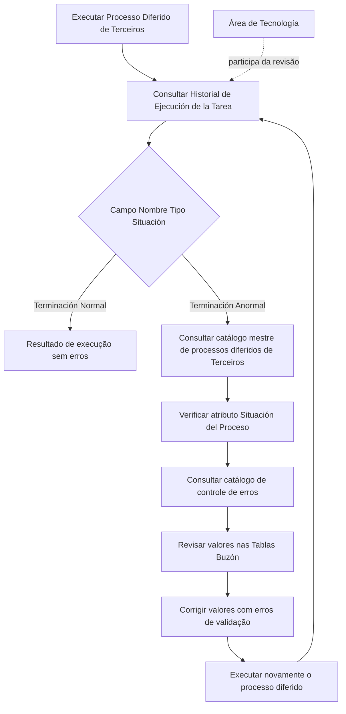

# Procedimento de Revisão da Execução do Massivo de Terceiros e Processo Diferido

## 1. Metadados do Documento
- **Arquivo de Origem:** `Não identificado — conteúdo bruto fornecido na solicitação`
- **Tipo de Documento:** `Procedimento`
- **Domínio / Sistema:** `Terceiros — processos diferidos e execução massiva`
- **Público-Alvo:** `Operação, Tecnologia`
- **Data/Versão Identificada:** `Não identificada`

---

## 2. Resumo Executivo & Contexto de Negócio

O documento descreve o procedimento de revisão da execução do processo massivo de **Terceiros**, com foco na verificação do resultado de um **processo diferido** após sua execução. A consulta inicial deve ocorrer no **Historial de Ejecución de la Tarea**, observando especificamente o conteúdo do campo denominado **Nombre Tipo Situación**.

O resultado esperado de uma execução sem erros é o valor **“Terminación Normal”**. Caso o processo apresente falhas, o campo deve exibir **“Terminación Anormal”**. A identificação de uma terminação anormal exige investigação complementar no catálogo mestre de processos diferidos de Terceiros e no catálogo de controle de erros.

Quando existirem erros de validação, o procedimento determina a revisão dos valores registrados nas **Tablas Buzón** e a correção dos dados que tenham provocado os erros. Após as correções, o processo diferido deve ser executado novamente.

O documento estabelece uma estratégia de resolução por **aproximaciones sucesivas**: revisar resultado, identificar erros, corrigir valores nas tabelas Buzón, reexecutar o processo e repetir o ciclo até atingir o resultado final. A revisão do processo requer, no estado atual descrito pelo documento, participação da área de **Tecnología**.

---

## 3. Arquitetura, Componentes & Tecnologias Envolvidas

Os componentes funcionais e operacionais explicitamente citados são:

| Componente / Elemento | Papel no procedimento |
| :--- | :--- |
| Processo Massivo de Terceiros | Processo cujo resultado de execução deve ser revisado. |
| Processo Diferido | Processo executado cuja situação deve ser verificada e, quando necessário, reexecutada. |
| Historial de Ejecución de la Tarea | Local de consulta do resultado da execução. |
| Campo Nombre Tipo Situación | Campo que informa se a execução terminou normalmente ou anormalmente. |
| Catálogo maestro de procesos diferidos de Terceros | Fonte para consultar o atributo `Situación del Proceso` quando houver terminação anormal. |
| Catálogo de control de errores de los procesos diferidos de Terceros | Fonte para consultar o detalhe dos erros do processo diferido. |
| Tablas Buzón | Tabelas cujos valores devem ser revisados e corrigidos quando validações provocarem erros. |
| Área de Tecnología | Área cuja participação é necessária para a revisão do processo, conforme o documento. |
| Soluciones APIs / Documentación Zeus | Elementos exibidos no conteúdo bruto, sem detalhamento funcional adicional. |



**Nota de Análise:** O documento cita catálogos, tabelas Buzón e o campo `Nombre Tipo Situación`, mas não especifica URLs, telas de acesso, métodos de consulta, estruturas de dados, tecnologias de implementação ou contratos de integração.

---

## 4. Regras de Negócio, Especificações Funcionais & Processos

### Processo de revisão da execução

1. Executar o processo diferido associado ao processamento massivo de Terceiros.
2. Consultar o **Historial de Ejecución de la Tarea** após a execução.
3. Revisar especificamente o conteúdo do campo **Nombre Tipo Situación**.
4. Interpretar o resultado:
   - O valor **“Terminación Normal”** indica que a execução terminou sem erros.
   - O valor **“Terminación Anormal”** indica que ocorreu uma execução anormal.
5. Em caso de **“Terminación Anormal”**:
   - Acessar o **catálogo maestro de procesos diferidos de Terceros**.
   - Consultar o valor do atributo **`Situación del Proceso`**.
   - Consultar o detalhe no **catálogo de control de errores de los procesos diferidos de Terceros**.
6. Revisar os valores informados nas **Tablas Buzón**.
7. Corrigir os valores das Tablas Buzón cujas validações tenham provocado erros.
8. Executar novamente o processo diferido.
9. Repetir o ciclo de revisão, correção e reexecução por **aproximaciones sucesivas** até alcançar o resultado final.
10. Realizar a revisão com participação da área de **Tecnología**, pois o documento declara que, atualmente, essa participação é necessária.

### Critérios de situação da execução

| Situação identificada | Significado | Ação exigida |
| :--- | :--- | :--- |
| `Terminación Normal` | A execução terminou sem erros. | Considerar a execução concluída sem erros. |
| `Terminación Anormal` | A execução apresentou condição anormal. | Consultar `Situación del Proceso`, analisar o catálogo de erros, revisar Tablas Buzón, corrigir e reexecutar. |

---

## 5. Tabelas de Parâmetros, Ambientes e Estruturas de Dados

| Item / Parâmetro | Descrição / Função | Tipo / Valores / Formato | Ambiente / Observações |
| :--- | :--- | :--- | :--- |
| Historial de Ejecución de la Tarea | Histórico utilizado para comprovar o resultado da execução do processo diferido. | Repositório ou histórico de execução; formato não detalhado. | Deve ser consultado após a execução do processo diferido. |
| Nombre Tipo Situación | Campo a ser revisado no histórico de execução. | Valor textual de situação. | Valores explicitamente documentados: `Terminación Normal` e `Terminación Anormal`. |
| Terminación Normal | Resultado de execução sem erros. | Texto. | Não requer investigação de erros segundo o procedimento. |
| Terminación Anormal | Resultado de execução anormal. | Texto. | Exige consulta aos catálogos e revisão das Tablas Buzón. |
| Situación del Proceso | Atributo a ser consultado no catálogo mestre de processos diferidos de Terceiros. | Valor não especificado. | Consultar somente no fluxo de terminação anormal. |
| Catálogo maestro de procesos diferidos de Terceros | Catálogo para conhecer o valor de `Situación del Proceso`. | Catálogo; estrutura não detalhada. | Aplicável a processos diferidos de Terceiros. |
| Catálogo de control de errores de los procesos diferidos de Terceros | Catálogo para obter detalhe dos erros. | Catálogo; estrutura não detalhada. | Consultado quando houver `Terminación Anormal`. |
| Tablas Buzón | Tabelas cujos valores devem ser revisados e corrigidos. | Estrutura e campos não detalhados. | Corrigir valores que tenham provocado erros de validação. |
| Aproximaciones sucesivas | Estratégia de repetição do processo após correções. | Processo iterativo. | Continua até alcançar o resultado final. |
| Área de Tecnología | Área participante na revisão do processo. | Unidade organizacional. | Participação atualmente necessária segundo o documento. |

Não há ambientes técnicos, servidores, URLs, portas, variáveis de configuração ou caminhos de logs identificados no conteúdo fornecido.

---

## 6. Bateria de Perguntas & Respostas para RAG (FAQ Sintético)

### P1: Onde deve ser verificado o resultado da execução do processo diferido de Terceiros?
**R:** O resultado deve ser verificado no **Historial de Ejecución de la Tarea**, após a execução do processo diferido.

### P2: Qual campo deve ser revisado no histórico de execução?
**R:** O campo que deve ser revisado é o **Nombre Tipo Situación**.

### P3: O que significa o valor “Terminación Normal” no campo Nombre Tipo Situación?
**R:** O valor **“Terminación Normal”** indica que a execução do processo diferido terminou sem erros.

### P4: O que deve ser feito quando o campo Nombre Tipo Situación exibir “Terminación Anormal”?
**R:** Deve-se acessar o catálogo mestre de processos diferidos de Terceiros para consultar o atributo **`Situación del Proceso`**, consultar o detalhe no catálogo de controle de erros e revisar os valores das **Tablas Buzón** que possam ter provocado erros de validação.

### P5: Onde é possível consultar o valor do atributo Situación del Proceso?
**R:** O atributo **`Situación del Proceso`** deve ser consultado no **catálogo maestro de procesos diferidos de Terceros**.

### P6: Onde deve ser consultado o detalhe dos erros de processos diferidos de Terceiros?
**R:** O detalhe deve ser consultado no **catálogo de control de errores de los procesos diferidos de Terceros**.

### P7: O que deve ser corrigido antes de reexecutar um processo diferido com falha?
**R:** Devem ser corrigidos os valores informados nas **Tablas Buzón** cujas validações tenham provocado erros.

### P8: Como o processo deve ser conduzido após a correção dos valores nas Tablas Buzón?
**R:** Após a correção, o processo diferido deve ser executado novamente. A revisão e a reexecução devem continuar por **aproximaciones sucesivas** até chegar ao resultado final.

### P9: A revisão do processo pode ser realizada sem a área de Tecnologia?
**R:** O documento informa que, no momento descrito, a revisão do processo deve ser realizada com participação da área de **Tecnología**.

### P10: O documento especifica os métodos HTTP, contratos JSON ou tecnologias do processo massivo de Terceiros?
**R:** Não. O conteúdo fornecido não detalha métodos HTTP, contratos JSON, tecnologias de implementação, URLs, servidores ou ambientes técnicos.

---

## 7. Glossário de Termos, Siglas & Conceitos-Chave

- **Proceso Diferido:** Processo cuja execução ocorre de forma diferida e cujo resultado deve ser verificado no histórico de execução.
- **Proceso Masivo de Terceros:** Processamento massivo relacionado ao domínio de Terceiros.
- **Historial de Ejecución de la Tarea:** Histórico no qual o resultado da execução deve ser comprovado.
- **Nombre Tipo Situación:** Campo cuja situação indica o resultado da execução.
- **Terminación Normal:** Valor que indica término da execução sem erros.
- **Terminación Anormal:** Valor que indica término anormal da execução.
- **Situación del Proceso:** Atributo consultado no catálogo mestre de processos diferidos de Terceiros após uma terminação anormal.
- **Tablas Buzón:** Tabelas que devem ter seus valores revisados e corrigidos quando houver erros de validação.
- **Aproximaciones sucesivas:** Repetição progressiva do ciclo de correção e reexecução até alcançar o resultado final.
- **Tecnología:** Área cuja participação é requerida para a revisão do processo.

---

## 8. Notas Críticas, Riscos & Limitações

- O documento não detalha as causas possíveis de **“Terminación Anormal”**; orienta apenas a consulta aos catálogos de situação e de erros.
- Não são apresentados os campos, estruturas, regras de validação ou mecanismo de atualização das **Tablas Buzón**.
- Não há instruções sobre permissões de acesso, perfis responsáveis, URLs, ambientes, servidores ou caminhos de logs.
- A participação da área de **Tecnología** é uma dependência operacional explícita para a revisão do processo.
- O resultado final é atingido por reexecuções sucessivas, o que pode exigir múltiplos ciclos de análise e correção.
- **Nota de Análise:** Os elementos “Soluciones APIs”, “Documentación Zeus”, “RS”, “Inicio” e “ES” aparecem no conteúdo extraído, mas não possuem detalhamento suficiente para determinar seu papel no procedimento.

---

## 9. Conteúdo Bruto Estruturado (Referência Fiel)

```text
--- [PÁGINA 1 DE 1] ---

REVISAR Ejecución del Masivo TERCEROS
(enlace con visión técnica)
Revisar el Resultado de la Ejecución del Proceso Diferido
Una vez ejecutado el proceso diferido, se tiene que comprobar el resultado de su ejecución en el
Historial de Ejecución de la Tarea: Específicamente revisar el contenido del Campo Nombre Tipo
Situación.
Si la ejecución ha terminado sin errores su valor será “Terminación Normal”, mientras que en caso
contrario mostrará “Terminación Anormal". En este caso se debe acceder al catálogo maestro de
procesos diferidos de Terceros para conocer el valor del Atributo 'Situación del Proceso' además del
detalle en el catálogo de control de errores de los procesos diferidos de Terceros.
Se deberán revisar los valores informados en las Tablas Buzón y corregir aquellos cuyas validaciones
hayan provocado errores.
Tras ello se tendrá que ejecutar nuevamente el proceso diferido para llegar a su resultado final
mediante la ejecución de aproximaciones sucesivas.
La revisión del Proceso, hoy por hoy, se tiene que realizar con la participación del área de
Tecnología.
 / 
 RS
Inicio Soluciones APIs Documentación Zeus
ES
```
