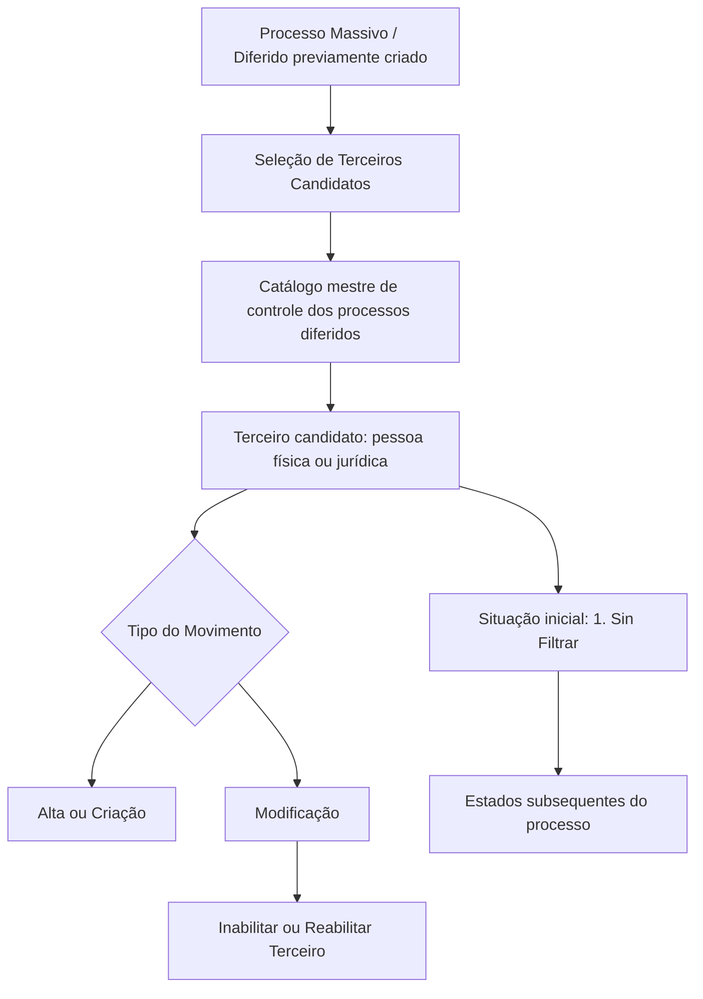

# Processo Massivo de Terceiros — Seleção de Terceiros Candidatos

## 1. Metadados do Documento
- **Arquivo de Origem:** Não identificado
- **Tipo de Documento:** Especificação Técnica
- **Domínio / Sistema:** Módulo de Terceiros / Processo Massivo-Diferido
- **Público-Alvo:** Desenvolvedores, Arquitetos, Analistas Funcionais e Operação
- **Data/Versão Identificada:** Não identificada

---

## 2. Resumo Executivo & Contexto de Negócio

O documento descreve a funcionalidade **“Seleccionar Terceros Candidatos - Proceso Masivo de Terceros”**, relacionada à seleção de pessoas físicas ou jurídicas que participarão de um processo massivo ou diferido no Módulo de Terceiros.

O objetivo funcional é registrar, no catálogo mestre de controle dos processos diferidos, as informações que identificam os terceiros candidatos. Cada terceiro pode ser submetido a uma operação de **Alta ou Criação** ou de **Modificação**.

A especificação define atributos de identificação do terceiro, incluindo tipo e chave de documento identificador, código de atividade e situação do processo. A situação permite acompanhar o estado de processamento de cada candidato antes, durante ou após o fluxo massivo.

O documento não informa contratos de API, métodos HTTP, estruturas JSON, persistência, regras de elegibilidade, critérios de filtragem, responsáveis operacionais ou detalhamento técnico do “enlace con visión técnica”.

---

## 3. Arquitetura, Componentes & Tecnologias Envolvidas

### Componentes identificados

| Componente | Papel identificado |
| :--- | :--- |
| Módulo de Terceiros | Módulo do sistema no qual ocorrem as operações de alta, criação ou modificação de terceiros. |
| Processo Massivo / Diferido | Processo previamente criado que executa operações para terceiros candidatos. |
| Catálogo mestre de controle de processos diferidos | Repositório lógico no qual são registradas informações de identificação dos terceiros candidatos. |
| Terceiro candidato | Pessoa física ou jurídica para a qual será executada uma operação no Processo Massivo. |
| Movimento Diferido | Informação considerada para determinar a operação executada para o terceiro. |
| Início Soluções APIs Documentação Zeus | Termos apresentados na extração original, sem explicação adicional de sua função ou integração. |



> **Nota de Análise:** O documento não detalha tecnologias, bancos de dados, microsserviços, APIs, URLs de ambiente, protocolos de integração ou contratos de dados.

---

## 4. Regras de Negócio, Especificações Funcionais & Processos

### Objetivo do processo

1. Registrar informações identificadoras de terceiros no catálogo mestre de controle dos processos diferidos do Módulo de Terceiros.
2. Selecionar pessoas físicas ou jurídicas para execução em um Processo Massivo/Diferido previamente criado.
3. Associar cada terceiro candidato a uma das duas operações disponíveis:
   - **Alta ou Criação**.
   - **Modificação do Terceiro**.

### Tipo do Movimento no Processo

O atributo **Tipo del Movimiento en el Proceso** especifica qual operação será realizada quando o terceiro for executado, considerando a informação existente no Movimento Diferido.

Valores possíveis:

1. **Alta**.
2. **Modificación**.

### Regra para inabilitação e reabilitação

As modificações específicas para **Inhabilitar** ou **Rehabilitar** um terceiro devem ser implementadas utilizando o tipo de movimento **Modificación**.

### Identificação do terceiro

O processo contém os seguintes atributos de identificação:

1. **Tipo Documento Identificador del Tercero**: identifica o tipo de documento identificador do terceiro.
2. **Clave del Documento Identificador del Tercero**: contém a chave do tipo de documento identificador associado ao terceiro.
3. **Código de Actividad del Tercero**: indica o código da atividade do terceiro no sistema.

### Situação do Processo

O atributo **Situación del Proceso** representa o estado da execução da operação definida para o terceiro candidato no Processo Massivo.

Antes da execução do processo, o estado inicial é obrigatoriamente:

- **1. Sin Filtrar**

Valores possíveis para a situação:

1. **Sin Filtrar**
2. **Detalle Filtrado**
3. **Excepcionando**
4. **Ya Excepcionado**
5. **Ya Tratado**

> **Nota de Análise:** O documento não define as transições permitidas entre os estados, os critérios para filtragem, as condições que geram exceção nem o significado operacional detalhado de “Ya Tratado”.

---

## 5. Tabelas de Parâmetros, Ambientes e Estruturas de Dados

| Item / Parâmetro | Descrição / Função | Tipo / Valores / Formato | Ambiente / Observações |
| :--- | :--- | :--- | :--- |
| Terceiro candidato | Pessoa física ou jurídica para a qual será executada uma operação no Processo Massivo. | Pessoa física ou jurídica. | Associado a um Processo Massivo/Diferido previamente criado. |
| Tipo do Movimento no Processo | Define a operação a ser realizada na execução do terceiro, considerando o Movimento Diferido. | `Alta`; `Modificación`. | Inabilitação e reabilitação devem usar `Modificación`. |
| Operação de Alta ou Criação | Operação disponível no Módulo de Terceiros. | Alta / Criação. | Aplicável ao terceiro candidato. |
| Operação de Modificação do Terceiro | Operação disponível no Módulo de Terceiros. | Modificação. | Inclui inabilitação e reabilitação. |
| Tipo Documento Identificador do Terceiro | Identifica o tipo de documento do terceiro. | Não detalhado. | O documento não lista tipos documentais válidos. |
| Chave do Documento Identificador do Terceiro | Contém a chave do tipo de documento identificador associado ao terceiro. | Não detalhado. | Não são definidos formato, tamanho ou validações. |
| Código de Atividade do Terceiro | Indica o código da atividade do terceiro no sistema. | Não detalhado. | Não são informados domínios ou catálogo de códigos. |
| Situação do Processo | Informa o estado da execução da operação definida para um terceiro candidato. | `1` a `5`. | Estado inicial antes da execução: `1. Sin Filtrar`. |
| Situação `1. Sin Filtrar` | Estado inicial do terceiro antes da execução do processo. | Valor `1`. | Explicitamente definido como estado inicial. |
| Situação `2. Detalle Filtrado` | Situação possível do processo. | Valor `2`. | Sem detalhamento adicional. |
| Situação `3. Excepcionando` | Situação possível do processo. | Valor `3`. | Sem detalhamento adicional. |
| Situação `4. Ya Excepcionado` | Situação possível do processo. | Valor `4`. | Sem detalhamento adicional. |
| Situação `5. Ya Tratado` | Situação possível do processo. | Valor `5`. | Sem detalhamento adicional. |

---

## 6. Bateria de Perguntas & Respostas para RAG (FAQ Sintético)

### P1: Qual é o objetivo da seleção de terceiros candidatos no Processo Massivo?
**R:** O objetivo é registrar, no catálogo mestre de controle dos processos diferidos do Módulo de Terceiros, as informações que identificam pessoas físicas ou jurídicas para as quais será executada uma operação de alta/criação ou modificação.

### P2: Quais operações estão disponíveis para um terceiro candidato no Módulo de Terceiros?
**R:** O documento informa duas operações: **Alta ou Criação** e **Modificação do Terceiro**.

### P3: O que define o atributo Tipo do Movimento no Processo?
**R:** O atributo Tipo do Movimento no Processo especifica a operação que será realizada durante a execução do terceiro, em relação à informação contemplada no Movimento Diferido. Os valores possíveis são `Alta` e `Modificación`.

### P4: Como devem ser implementadas as operações de inabilitação ou reabilitação de um terceiro?
**R:** As modificações específicas para inabilitar ou reabilitar um terceiro devem ser implementadas sob o tipo de movimento `Modificación`.

### P5: Qual é a situação inicial de um terceiro candidato antes da execução do Processo Massivo?
**R:** Antes da execução do processo, a Situação do Processo deve assumir o valor `1. Sin Filtrar`.

### P6: Quais valores a Situação do Processo pode assumir?
**R:** A Situação do Processo pode assumir os valores: `1. Sin Filtrar`, `2. Detalle Filtrado`, `3. Excepcionando`, `4. Ya Excepcionado` e `5. Ya Tratado`.

### P7: O que representa o Tipo de Documento Identificador do Terceiro?
**R:** Essa propriedade identifica o tipo de documento identificador do terceiro. O documento não especifica quais tipos de documento são aceitos.

### P8: Qual é a finalidade da Chave do Documento Identificador do Terceiro?
**R:** A Chave do Documento Identificador do Terceiro contém a chave do tipo de documento identificador associado ao terceiro. Não há formato ou regra de validação detalhados na especificação.

### P9: O que informa o Código de Atividade do Terceiro?
**R:** O Código de Atividade do Terceiro indica, no sistema, o código da atividade do terceiro. O documento não fornece o catálogo de códigos ou suas regras de uso.

### P10: O documento especifica APIs, métodos HTTP ou contratos JSON para o processo massivo?
**R:** Não. A extração apresenta conceitos funcionais e atributos do Processo Massivo de Terceiros, mas não descreve métodos HTTP, endpoints, contratos JSON, tecnologias, integrações ou estruturas de persistência.

---

## 7. Glossário de Termos, Siglas & Conceitos-Chave

- **Alta:** Operação de criação ou inclusão disponível para um terceiro candidato.
- **Catálogo mestre de controle:** Catálogo no qual são registradas informações de identificação dos terceiros candidatos em processos diferidos.
- **Clave del Documento Identificador:** Chave associada ao tipo de documento identificador do terceiro.
- **Código de Actividad del Tercero:** Código que representa a atividade do terceiro no sistema.
- **Detalle Filtrado:** Situação possível do Processo Massivo, correspondente ao valor `2`; sem explicação adicional na fonte.
- **Excepcionando:** Situação possível do Processo Massivo, correspondente ao valor `3`; sem explicação adicional na fonte.
- **Modificación:** Tipo de movimento utilizado para modificar um terceiro; também obrigatório para inabilitação e reabilitação.
- **Módulo de Terceiros:** Módulo do sistema responsável pelas operações relacionadas a terceiros.
- **Movimiento Diferido:** Informação considerada para definir a operação executada para o terceiro.
- **Proceso Masivo/Diferido:** Processo previamente criado que executa operações para terceiros candidatos.
- **Sin Filtrar:** Situação inicial do processo antes de sua execução, correspondente ao valor `1`.
- **Tercero:** Pessoa física ou jurídica tratada pelo Módulo de Terceiros.
- **Tipo Documento Identificador:** Propriedade que identifica o tipo de documento do terceiro.
- **Ya Excepcionado:** Situação possível do Processo Massivo, correspondente ao valor `4`; sem explicação adicional na fonte.
- **Ya Tratado:** Situação possível do Processo Massivo, correspondente ao valor `5`; sem explicação adicional na fonte.

---

## 8. Notas Críticas, Riscos & Limitações

- O documento não identifica o arquivo de origem, data, versão, autor ou sistema corporativo específico.
- Não existem detalhes sobre tecnologias, APIs, endpoints, métodos HTTP, payloads, banco de dados, logs, segurança ou controle de acesso.
- Não são definidos critérios de seleção de terceiros candidatos.
- Não há regras de transição entre as situações `Sin Filtrar`, `Detalle Filtrado`, `Excepcionando`, `Ya Excepcionado` e `Ya Tratado`.
- Não são especificados os formatos, validações ou domínios permitidos para documentos identificadores e códigos de atividade.
- Os termos “Início Soluções APIs Documentação Zeus” aparecem na extração, mas não possuem explicação funcional ou técnica adicional.

---

## 9. Conteúdo Bruto Estruturado (Referência Fiel)

```text
--- [PÁGINA 1 DE 2] ---

SELECCIONAR Terceros Candidatos - Proceso
Masivo de Terceros (enlace con visión técnica)
Objetivo
Registrar en el catálogo maestro de control de los procesos diferidos del Módulo de Terceros la
información que identifica a las Personas físicas o jurídicas para la que se va a realizar una de las
dos operaciones disponibles en el sistema para el Módulo de Terceros:
Operación de Alta o Creación, y
Operación de Modificación del Tercero.
Los atributos que corresponden a la Selección de los Terceros Candidatos para el Proceso
Masivo/Diferido creado previamente son...
Tipo del Movimiento en el Proceso
Este Atributo especifica la operación que se va a realizar en la ejecución del Tercero con respecto de
la información contemplada en el Movimiento Diferido siendo sus posibles valores:
Alta.
Modificación.
NOTA: Las Modificaciones específicas para Inhabilitar o Rehabilitar un Tercero se deben
implementar bajo el tipo de movimiento Modificación.
Tipo Documento Identificador del Tercero
 /
 RS
Inicio Soluciones APIs Documentación Zeus
ES


--- [PÁGINA 2 DE 2] ---

Esta propiedad identificará el tipo de Documento Identificador del Tercero.
Clave del Documento Identificador del Tercero
Este atributo contendrá la clave del Tipo de documento Identificador asociado al Tercero.
Código de Actividad del Tercero
Esta propiedad indica en el sistema el código de la Actividad del Tercero.
Situación del Proceso
Esta propiedad indica el estado de la ejecución de la operación definida para el Tercero candidato
dentro del Proceso Masivo, estado que inicialmente, es decir, antes de la ejecución del proceso, toma
el valor '1'.
Sus posibles valores:
1. Sin Filtrar.
2. Detalle Filtrado.
3. Excepcionando.
4. Ya Excepcionado.
5. Ya Tratado.
```
