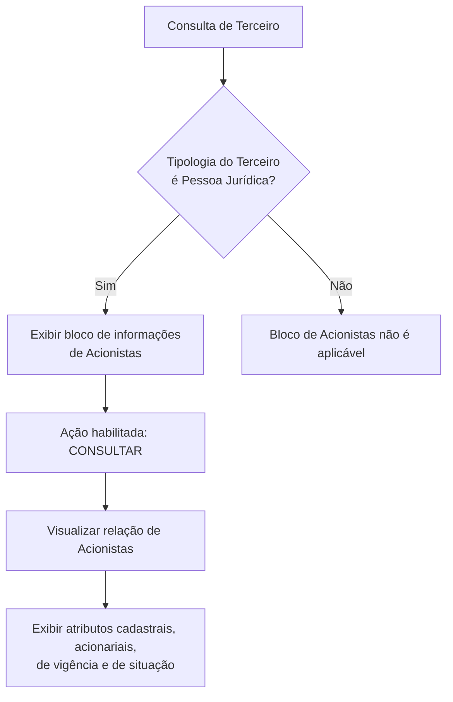

# Consulta de Acionistas de Terceiros — Bloco de Informações para Pessoa Jurídica

## 1. Metadados do Documento
- **Arquivo de Origem:** Não identificado
- **Tipo de Documento:** Especificação Funcional
- **Domínio / Sistema:** Gestão de Terceiros — Acionistas; sistema não nomeado de forma inequívoca
- **Público-Alvo:** Analistas funcionais, operação, desenvolvedores e equipes de negócio
- **Data/Versão Identificada:** Não identificada

---

## 2. Resumo Executivo & Contexto de Negócio

O documento descreve o bloco de informação utilizado para **consultar os acionistas de um Terceiro**. A funcionalidade é aplicável exclusivamente quando a tipologia do Terceiro corresponde a uma **Pessoa Jurídica**.

A consulta apresenta a relação de acionistas vinculados ao Terceiro e disponibiliza uma ação habilitada de **CONSULTAR**. O conteúdo especifica os atributos exibidos na interface, incluindo identificação documental, nacionalidade, nome, dados de vigência, percentual acionarial, cargo e indicadores de exposição política ou inabilitação.

O bloco permite visualizar a composição acionária e o estado operacional de cada acionista no sistema. As datas de alta, baixa e validade suportam a interpretação temporal da relação entre o acionista e o Terceiro.

O documento não detalha contratos de integração, serviços, métodos HTTP, persistência de dados, regras de autorização, URLs, ambientes ou mecanismos de atualização cadastral.

---

## 3. Arquitetura, Componentes & Tecnologias Envolvidas

O conteúdo descreve uma funcionalidade de consulta em um sistema de gestão de Terceiros. Não são identificados microsserviços, bancos de dados, APIs, linguagens, frameworks, ambientes ou tecnologias de infraestrutura.

### Componentes funcionais identificados

| Componente | Função descrita |
| :--- | :--- |
| Terceiro | Entidade consultada; deve possuir tipologia de Pessoa Jurídica para que o bloco de Acionistas seja aplicável. |
| Bloco de Informações de Acionistas | Área que mostra a relação de acionistas associados ao Terceiro. |
| Ação `CONSULTAR` | Ação habilitada explicitamente pelo documento. |
| Acionista | Pessoa física ou jurídica relacionada ao Terceiro por direitos acionariais. |
| Catálogo de cargos | Catálogo existente no sistema que define os valores possíveis para o cargo acionarial. |



> *Nota de Análise: O documento não especifica o comportamento da ação `CONSULTAR`, os critérios de busca, paginação, filtros, permissões ou a origem dos dados apresentados.*

---

## 4. Regras de Negócio, Especificações Funcionais & Processos

### 4.1 Condição de aplicabilidade

1. O bloco de informações de Acionistas deve ser apresentado quando a tipologia do Terceiro corresponder a uma **Pessoa Jurídica**.
2. O propósito do bloco é mostrar a relação de acionistas do Terceiro.
3. O documento declara que a ação **CONSULTAR** está habilitada.

### 4.2 Sequência de visualização

O documento estabelece que a relação de atributos determina a sequência de visualização da informação, da esquerda para a direita e de cima para baixo. Os atributos apresentados são:

1. Tipo Documento Accionista  
2. Clave del Documento Accionista  
3. Nacionalidad del Accionista  
4. Nombre  
5. Apellidos  
6. Fecha de Alta  
7. Fecha de Baja  
8. Porcentaje Accionarial  
9. Cargo  
10. Fecha de Validez  
11. Marca Persona Políticamente Expuesta  
12. Inhabilitación  

### 4.3 Regras funcionais por atributo

- **Tipo Documento Accionista:** visualiza o tipo de documento associado à pessoa física ou jurídica na condição de acionista.
- **Clave del Documento Accionista:** contém a chave do documento do Acionista.
- **Nacionalidad del Accionista:** mostra o país de nacionalidade do Acionista.
- **Nombre:** contém o nome do Acionista.
- **Apellidos:** os dois campos de sobrenome determinam os sobrenomes ou a razão social do Acionista.
- **Fecha de Alta:** indica a data em que o Acionista possui direitos acionariais sobre o Terceiro.
- **Fecha de Baja:** indica a data em que o Acionista deixa de possuir direitos acionariais em relação ao Terceiro associado.
- **Porcentaje Accionarial:** contém o percentual acionarial do Acionista em relação ao número de ações emitidas pelo Terceiro.
- **Cargo:** mostra o cargo acionarial do Acionista segundo os valores possíveis definidos no catálogo de cargos existente no sistema.
- **Fecha de Validez:** mostra a data a partir da qual o Acionista do Terceiro está ou estará plenamente operativo no sistema.
- **Marca Persona Políticamente Expuesta:** identifica o Acionista como pessoa politicamente exposta.
- **Inhabilitación:** mostra se o Acionista está ou não inabilitado no sistema.

---

## 5. Tabelas de Parâmetros, Ambientes e Estruturas de Dados

| Item / Parâmetro | Descrição / Função | Tipo / Valores / Formato | Ambiente / Observações |
| :--- | :--- | :--- | :--- |
| Tipologia do Terceiro | Determina a aplicabilidade do bloco de Acionistas. | Pessoa Jurídica | Nenhum ambiente informado. |
| Ação habilitada | Permite consultar a relação de acionistas. | `CONSULTAR` | O comportamento operacional não é detalhado. |
| Tipo Documento Accionista | Exibe o tipo do documento associado ao Acionista. | Não informado | O Acionista pode ser pessoa física ou jurídica. |
| Clave del Documento Accionista | Armazena ou exibe a chave do documento do Acionista. | Não informado | O formato da chave não foi especificado. |
| Nacionalidad del Accionista | Mostra o país de nacionalidade do Acionista. | País | Não é informado catálogo, código ou formato de país. |
| Nombre | Contém o nome do Acionista. | Texto | Aplicável conforme informação disponível para o Acionista. |
| Apellidos | Determina os sobrenomes ou a razão social do Acionista. | Texto; dois campos mencionados | O documento não informa os nomes técnicos dos dois campos. |
| Fecha de Alta | Data em que o Acionista possui direitos acionariais sobre o Terceiro. | Data | Formato de data não informado. |
| Fecha de Baja | Data em que o Acionista deixa de possuir direitos acionariais sobre o Terceiro. | Data | Formato de data não informado. |
| Porcentaje Accionarial | Percentual acionarial em relação ao número de ações emitidas pelo Terceiro. | Percentual | Não são informados precisão, intervalo ou regras de cálculo. |
| Cargo | Cargo acionarial do Acionista. | Valores definidos no catálogo de cargos do sistema | O catálogo não é detalhado. |
| Fecha de Validez | Data a partir da qual o Acionista está ou estará plenamente operativo no sistema. | Data | Formato de data não informado. |
| Marca Persona Políticamente Expuesta | Identifica o Acionista como pessoa politicamente exposta. | Indicador | Valores possíveis não informados. |
| Inhabilitación | Indica se o Acionista está inabilitado no sistema. | Indicador | Valores possíveis não informados. |

---

## 6. Bateria de Perguntas & Respostas para RAG (FAQ Sintético)

### P1: Em qual condição o bloco de Acionistas de um Terceiro deve ser exibido?
**R:** O bloco de informações de Acionistas deve ser exibido sempre que a tipologia do Terceiro corresponder a uma Pessoa Jurídica.

### P2: Qual é a ação habilitada no bloco de informações de Acionistas?
**R:** O documento identifica a ação `CONSULTAR` como habilitada para o bloco de informações de Acionistas.

### P3: O que representa o campo Tipo Documento Accionista?
**R:** O campo Tipo Documento Accionista visualiza o tipo de documento associado à pessoa física ou jurídica que atua como acionista.

### P4: Qual informação é mostrada em Clave del Documento Accionista?
**R:** Clave del Documento Accionista contém a chave do documento do Acionista. O documento não informa o formato, o tipo de chave ou regras de validação dessa informação.

### P5: Como o sistema identifica a nacionalidade de um Acionista?
**R:** O campo Nacionalidad del Accionista mostra o país de nacionalidade do Acionista. O documento não especifica se o país é apresentado por nome, código ou catálogo.

### P6: Como os campos Apellidos são utilizados para um Acionista?
**R:** Os dois campos Apellidos determinam os sobrenomes ou a razão social do Acionista. O documento não detalha como o sistema distingue a utilização para pessoa física e pessoa jurídica.

### P7: O que significa a Fecha de Alta de um Acionista?
**R:** Fecha de Alta indica a data em que o Acionista possui direitos acionariais sobre o Terceiro.

### P8: O que significa a Fecha de Baja de um Acionista?
**R:** Fecha de Baja mostra a data em que o Acionista deixa de possuir direitos acionariais em relação ao Terceiro ao qual está associado.

### P9: Como deve ser interpretado o Porcentaje Accionarial?
**R:** Porcentaje Accionarial contém o percentual acionarial do Acionista em relação ao número de ações emitidas pelo Terceiro. O documento não apresenta fórmula, limites ou regras de arredondamento para esse percentual.

### P10: De onde vêm os valores possíveis do campo Cargo?
**R:** O campo Cargo visualiza o cargo acionarial sustentado pelo Acionista de acordo com os possíveis valores definidos no catálogo de cargos existente no sistema.

### P11: Qual é a finalidade da Fecha de Validez?
**R:** Fecha de Validez mostra a data a partir da qual o Acionista do Terceiro está ou estará plenamente operativo no sistema.

### P12: Como o sistema trata a condição de Pessoa Politicamente Exposta?
**R:** A Marca Persona Políticamente Expuesta identifica o Acionista como pessoa politicamente exposta. O documento não informa valores permitidos, critérios de classificação ou procedimentos associados a essa marca.

### P13: O que informa o atributo Inhabilitación?
**R:** Inhabilitación mostra se o Acionista está ou não inabilitado no sistema. O documento não detalha as causas, efeitos ou regras de alteração dessa situação.

---

## 7. Glossário de Termos, Siglas & Conceitos-Chave

- **Acionista:** Pessoa física ou jurídica que possui direitos acionariais relacionados ao Terceiro.
- **Apellidos:** Campos que determinam os sobrenomes ou a razão social do Acionista.
- **Cargo:** Cargo acionarial do Acionista, conforme catálogo de cargos existente no sistema.
- **Clave del Documento:** Chave do documento associado ao Acionista.
- **Fecha de Alta:** Data em que o Acionista possui direitos acionariais sobre o Terceiro.
- **Fecha de Baja:** Data em que o Acionista deixa de possuir direitos acionariais em relação ao Terceiro.
- **Fecha de Validez:** Data a partir da qual o Acionista está ou estará plenamente operativo no sistema.
- **Inhabilitación:** Indicador da condição de inabilitação do Acionista no sistema.
- **Marca Persona Políticamente Expuesta:** Marca que identifica o Acionista como pessoa politicamente exposta.
- **Pessoa Jurídica:** Tipologia de Terceiro necessária para a aplicabilidade do bloco de Acionistas.
- **Porcentaje Accionarial:** Percentual acionarial do Acionista em relação ao número de ações emitidas pelo Terceiro.
- **Terceiro:** Entidade à qual os Acionistas estão associados no sistema.

---

## 8. Notas Críticas, Riscos & Limitações

- O documento não identifica o nome do arquivo, data, versão, autor ou sistema de origem de maneira inequívoca.
- Não são detalhados serviços, integrações, APIs, contratos de dados, persistência, tecnologias ou ambientes.
- A ação `CONSULTAR` é indicada como habilitada, mas o fluxo de execução, filtros, permissões, paginação e critérios de consulta não são descritos.
- O formato dos campos documentais e de data não é informado.
- O documento não apresenta valores permitidos para os indicadores de pessoa politicamente exposta e inabilitação.
- O catálogo de cargos é mencionado, mas os cargos disponíveis não são listados.
- A página 3 não contém conteúdo textual funcional recuperável.

---

## 9. Conteúdo Bruto Estruturado (Referência Fiel)

```text
--- [PÁGINA 1 DE 3] ---

CONSULTAR los Accionistas del Tercero
Objetivo
Siempre y cuando la tipología del Tercero corresponda a una Persona Jurídica, este Bloque de
Información muestra la relación de Accionistas del Tercero.
Acciones habilitadas
 CONSULTAR ( )
Accionistas
De izquierda a derecha y de arriba hacia abajo, la siguiente relación de atributos determina la
secuencia de visualización de la Información.
Tipo Documento Accionista
Este campo visualiza el tipo de documento asociado a la persona física o jurídica como accionista.
Clave del Documento Accionista
 /
 RS
Inicio Soluciones APIs Documentación Zeus
ES


--- [PÁGINA 2 DE 3] ---

Este dato contiene la clave del documento del Accionista.
Nacionalidad del Accionista
Este campo del bloque de información muestra el país de nacionalidad del Accionista.
Nombre
Este campo contiene el nombre del Accionista.
Apellidos
Estos dos campos del bloque de información determinan o bien los apellidos o bien la Razón Social
del accionista.
Fecha de Alta
Este dato observa la fecha en la que el accionista tiene los derechos accionariales del Tercero.
Fecha de Baja
Este campo muestra la fecha en la que el accionista causa baja en relación con los derechos
accionariales del Tercero al que está asociado.
Porcentaje Accionarial
Este Campo contiene el Porcentaje accionarial del accionista en relación al número de acciones
emitidas por el Tercero.
Cargo
Este Campo visualiza el cargo accionarial que sustenta el accionista de acuerdo con los posibles
valores en los cargos definidos en el catálogo de cargos existente en el Sistema.
Fecha de Validez
Esta propiedad muestra la fecha a partir de la cual el accionista del Tercero está o estará plenamente
operativo en el sistema.
Marca Persona Políticamente Expuesta
Este campo identifica al accionista como persona políticamente expuesta.
Inhabilitación
Esta propiedad muestra si el Accionista está o no inhabilitado en el sistema.


--- [PÁGINA 3 DE 3] ---

[Página em branco ou apenas elementos visuais/imagem]
```
